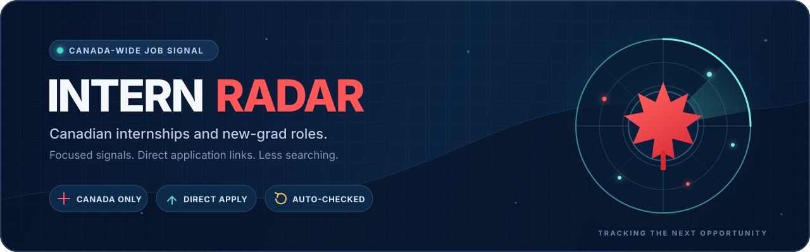

  

<h1 align="center">Canadian New-Grad &amp; Early-Career Roles - 2026</h1>

<strong>Canada-only new-grad and early-career roles, newest employer posting date first.</strong>

  <a href="#tech-new-grad-roles"><strong>Tech new grad</strong></a> 89 open
  &nbsp;&nbsp;-&nbsp;&nbsp;
  <a href="#other-early-career-roles"><strong>Other early career</strong></a> 277 open

  <a href="README.md"><strong>Overview</strong></a> -
  <a href="INTERNSHIPS.md"><strong>Internships &amp; co-ops</strong></a> -
  <a href="CONTRIBUTING.md">Contributing</a> -
  <a href="../../issues/new?template=suggest-listing.yml">Suggest or report a listing</a>

  
  
  
  

Last refreshed Oct 1, 2026 at 02:02 UTC

> [!TIP]
> 
<strong>Start with what changed.</strong> NEW marks roles posted in the last 7 days. The Posted column shows both the exact date and age, and roles posted more than 180 days ago are hidden. Use <code>Ctrl+F</code> or <code>Cmd+F</code> to scan for a city, company, or skill.

## Tech new-grad roles

**89 open role(s)** - newest employer posting date first

<strong>Companies with the most tech new-grad openings</strong>

| Company | Open roles |
|---|---:|
| Ciena | 5 |
| Royal Bank of Canada | 4 |
| Amazon | 3 |
| BDO Canada | 3 |
| Capital One | 3 |
| Jobright.ai | 3 |

| Company | Role | Location | Details | Posted | Apply |
|---|---|---|---|---:|---|
| Ultra Maritime | NEW Graduate Systems Engineer | Dartmouth, NS, Canada, Dartmouth (CAN) | Security clearance - Portfolio / GitHub | Sep 30, 2026 1 day old | <a href="https://ultra.wd3.myworkdayjobs.com/um-careers/job/Dartmouth-NS-Canada/Graduate-Systems-Engineer_REQ-12557"><strong>Apply</strong></a> | <!--id:320139-->
| AlayaCare | NEW Junior Fullstack Developer (Python) | Montreal, Quebec, Canada | French / bilingual - Hybrid / on-site | Sep 30, 2026 1 day old | <a href="https://alayacare.com/open-positions?gh_jid=8858343002"><strong>Apply</strong></a> | <!--id:320137-->
| FluidAI Medical | NEW Jr. Software Engineer - Health Systems | Kitchener, Canada | $75K-$85K/yr - Portfolio / GitHub | Sep 30, 2026 1 day old | <a href="https://ats.rippling.com/fluidai-medical-careers/jobs/68057679-c967-4707-9423-ea2db74de7c5"><strong>Apply</strong></a> | <!--id:320145-->
| Motorola Solutions | NEW Junior Software Engineer, Emergency Call Handling | Gatineau, Canada, More... | - | Sep 29, 2026 2 days old | <a href="https://motorolasolutions.wd5.myworkdayjobs.com/careers/job/Gatineau-Canada/Junior-Software-Engineer--Emergency-Call-Handling_R67731"><strong>Apply</strong></a> | <!--id:320103-->
| Motorola Solutions | NEW Jr. Software Engineer - Java, Angular, JavaScript | Gatineau, Canada, More... | - | Sep 29, 2026 2 days old | <a href="https://motorolasolutions.wd5.myworkdayjobs.com/careers/job/Gatineau-Canada/Jr-Software-Engineer---Java--Angular--JavaScript_R69279-1"><strong>Apply</strong></a> | <!--id:320104-->
| Loblaw Companies | NEW Machine Learning Software Developer I | 1 Presidents Choice Circle, Brampton, ON | - | Sep 28, 2026 3 days old | <a href="https://myview.wd3.myworkdayjobs.com/paradox_careers/job/1-Presidents-Choice-Circle-Brampton-ON/Machine-Learning-Software-Developer-I_R2000709277"><strong>Apply</strong></a> | <!--id:320040-->
| Ciena | NEW Hardware Engineer - New Grad | Ottawa, Canada- Ottawa- 383 Terry Fox- Bldg C | $62.6K-$100K/yr - Co-op enrollment | Sep 28, 2026 3 days old | <a href="https://ciena.wd5.myworkdayjobs.com/Careers/job/Ottawa/Hardware-Engineer---New-Grad_R031783"><strong>Apply</strong></a> | <!--id:320017-->
| University of British Columbia | NEW Junior NLP Data Scientist | UBC Vancouver Campus - Vancouver, BC, Canada, UBCV \| UBC Hospital - Detwiller Pavilion (DPAV) | - | Sep 28, 2026 3 days old | <a href="https://ubc.wd10.myworkdayjobs.com/ubcstaffjobs/job/UBC-Vancouver-Campus---Vancouver-BC-Canada/Junior-NLP-Data-Scientist_JR26186"><strong>Apply</strong></a> | <!--id:320075-->
| Intact | NEW New Grad Tech Development Program - Cybersecurity Stream | 2 Locations, Toronto Ontario CAN | - | Sep 28, 2026 3 days old | <a href="https://intactfc.wd3.myworkdayjobs.com/intactfc/job/Toronto-Ontario-CAN/New-Grad-Tech-Development-Program---Cybersecurity-Stream_R155808"><strong>Apply</strong></a> | <!--id:319984-->
| Intact | NEW New Grad Tech Development Program - Software Development &amp; Cloud Stream | 2 Locations, Toronto Ontario CAN | - | Sep 28, 2026 3 days old | <a href="https://intactfc.wd3.myworkdayjobs.com/intactfc/job/Toronto-Ontario-CAN/New-Grad-Tech-Development-Program---Software-Development---Cloud-Stream_R155934"><strong>Apply</strong></a> | <!--id:319983-->
| RBC | NEW Developer, RBC Amplify 2027, Halifax | Halifax, Nova Scotia, Canada | Co-op enrollment - Graduating 2027 - Student status | Sep 28, 2026 3 days old | <a href="https://www.linkedin.com/jobs/view/4464308183"><strong>Apply</strong></a> | <!--id:0-->
| RBC | NEW Data Engineer, RBC Amplify 2027, Halifax | Halifax, Nova Scotia, Canada | Co-op enrollment - Graduating 2027 - Student status | Sep 28, 2026 3 days old | <a href="https://www.linkedin.com/jobs/view/4464090301"><strong>Apply</strong></a> | <!--id:0-->
| RBC | NEW Data Engineer, RBC Amplify 2027, Toronto | Toronto, Ontario, Canada | Co-op enrollment - Graduating 2027 - Student status | Sep 28, 2026 3 days old | <a href="https://www.linkedin.com/jobs/view/4464307192"><strong>Apply</strong></a> | <!--id:0-->
| Jobright.ai | NEW Machine Learning Engineer - Early Career (Canada) | TBD | - | Sep 28, 2026 3 days old | <a href="https://www.linkedin.com/jobs/view/4471306443"><strong>Apply</strong></a> | <!--id:0-->
| Jobright.ai | NEW AI Engineer, Entry Level (Canada) | TBD | - | Sep 28, 2026 3 days old | <a href="https://www.linkedin.com/jobs/view/4471303601"><strong>Apply</strong></a> | <!--id:0-->
| Revature | NEW Entry Level Software Developer | Halifax, Nova Scotia, Canada | $65K/yr - Canadian work authorization - Assessment likely | Sep 28, 2026 3 days old | <a href="https://www.linkedin.com/jobs/view/4471349268"><strong>Apply</strong></a> | <!--id:0-->
| Nokia | NEW Jr. System Test QA Engineer | Canada | - | Sep 28, 2026 3 days old | <a href="https://fa-evmr-saasfaprod1.fa.ocs.oraclecloud.com/hcmUI/CandidateExperience/en/sites/CX_1/job/40321"><strong>Apply</strong></a> | <!--id:319977-->
| Quora | NEW Software Engineer New Grad, Machine Learning Platform - Quora (Remote) | Remote - Multiple Locations, United States, Canada | Graduating 2026 - Hybrid / on-site - Possible repost | Sep 25, 2026 6 days old | <a href="https://jobs.ashbyhq.com/quora/cf34f80e-fe5c-454d-bc9a-4c59993ffda0"><strong>Apply</strong></a> | <!--id:319947-->
| TD Bank | NEW Software Engineer I | Toronto, Ontario, TD Terrace - 160 Front Street West Corporate, Toronto, Ontario | $69.7K-$98.4K/yr - Hybrid / on-site | Sep 25, 2026 6 days old | <a href="https://td.wd3.myworkdayjobs.com/TD_Bank_Careers/job/Toronto-Ontario/Software-Engineer-I_R_1511144"><strong>Apply</strong></a> | <!--id:319979-->
| Loblaw Companies | NEW Supply Chain, Business Intelligence Developer | 1 Presidents Choice Circle, Brampton, ON | $52K-$71.5K/yr - Hybrid / on-site | Sep 25, 2026 6 days old | <a href="https://myview.wd3.myworkdayjobs.com/paradox_careers/job/1-Presidents-Choice-Circle-Brampton-ON/Supply-Chain--Business-Intelligence-Developer_R2000708428"><strong>Apply</strong></a> | <!--id:319904-->
| Flexspring | NEW AI Model Training and Deployment Developer - New Grad Opportunity | montreal, Quebec, Canada | 4 week term | Sep 25, 2026 6 days old | <a href="https://flexspring.bamboohr.com/careers/71"><strong>Apply</strong></a> | <!--id:319578-->
| Galent | NEW Entry Level Software Developer - Paid Training Program | Mississauga, Ontario, Canada | $65K/yr - Canadian work authorization - Assessment likely | Sep 24, 2026 7 days old | <a href="https://www.linkedin.com/jobs/view/4465923916"><strong>Apply</strong></a> | <!--id:0-->
| BBA Consultants | NEW Junior Engineer, Software Solution Integration | Mont-St-Hilaire, Quebec, Canada | Hybrid / on-site - Assessment likely | Sep 24, 2026 7 days old | <a href="https://www.linkedin.com/jobs/view/4470953478"><strong>Apply</strong></a> | <!--id:0-->
| Medcan | NEW Associate Machine Learning Engineer | Toronto, Ontario, Canada | $71.465K/yr | Sep 24, 2026 7 days old | <a href="https://www.linkedin.com/jobs/view/4471117557"><strong>Apply</strong></a> | <!--id:0-->
| Xero | NEW Associate Engineer (Front End) | Calgary, Alberta, Canada | $109.1K/yr - Hybrid / on-site | Sep 24, 2026 7 days old | <a href="https://www.linkedin.com/jobs/view/4471178679"><strong>Apply</strong></a> | <!--id:0-->
| Xero | NEW Associate Engineer (Back End) | Calgary, Alberta, Canada | $109.1K/yr | Sep 24, 2026 7 days old | <a href="https://www.linkedin.com/jobs/view/4471176811"><strong>Apply</strong></a> | <!--id:0-->
| Amazon | Data Engineer, Early Career - 2026 (CAN) | Toronto, Ontario, Canada | Hybrid / on-site - Possible repost | Sep 24, 2026 7 days old | <a href="https://www.amazon.jobs/en/jobs/10559101"><strong>Apply</strong></a> | <!--id:319875-->
| Cisco | Software Developer I (Full Time) - Canada | 4 Locations, Kanata Ontario Canada | - | Sep 23, 2026 8 days old | <a href="https://cisco.wd5.myworkdayjobs.com/cisco_careers/job/Kanata-Ontario-Canada/Software-Developer-I--Full-Time----Canada_2023599-1"><strong>Apply</strong></a> | <!--id:319815-->
| Sun Life | Student, Jr. Analytics and Automation Developer (Winter 2027) | 2 Locations, North York Ontario | Winter 2027 | Sep 21, 2026 10 days old | <a href="https://sunlife.wd3.myworkdayjobs.com/Campus/job/North-York-Ontario/Student--Jr-Analytics-and-Automation-Developer--Winter-2027-_JR00127514"><strong>Apply</strong></a> | <!--id:318862-->
| Base Career | Business Analyst , Data &amp; Analytics - New Grad (January 2027) | Ottawa, Ontario, Canada | - | Sep 21, 2026 10 days old | <a href="https://www.linkedin.com/jobs/view/4467394748"><strong>Apply</strong></a> | <!--id:0-->
| S M Software Solutions Inc | Software Developer - Junior - RQ11579 | Toronto, Ontario, Canada | Hybrid / on-site | Sep 21, 2026 10 days old | <a href="https://www.linkedin.com/jobs/view/4469829692"><strong>Apply</strong></a> | <!--id:0-->
| Hunter Bond | Graduate Quant Developer/Quant Researcher - Up to $175k CAD 1st Year TC | Montreal, Quebec, Canada | $175K/yr | Sep 21, 2026 10 days old | <a href="https://www.linkedin.com/jobs/view/4467365792"><strong>Apply</strong></a> | <!--id:0-->
| BDO Canada | Analyste d&#39;affaires, Donnees et analytique - Nouveau diplome (janvier 2027) | Calgary, Alberta, Canada | - | Sep 21, 2026 10 days old | <a href="https://www.linkedin.com/jobs/view/4467787948"><strong>Apply</strong></a> | <!--id:0-->
| Jobright.ai | Data Engineer (Early Career) (Canada) | TBD | Talent pool | Sep 21, 2026 10 days old | <a href="https://www.linkedin.com/jobs/view/4468468587"><strong>Apply</strong></a> | <!--id:0-->
| Akkodis | Java Software Developer - Junior | Toronto, Ontario, Canada | 12 month term - Hybrid / on-site | Sep 21, 2026 10 days old | <a href="https://www.linkedin.com/jobs/view/4468782172"><strong>Apply</strong></a> | <!--id:0-->
| Aptiv | Associate Cloud Engineer | CAN Kanata (2), ON - WR | Hybrid / on-site | Sep 18, 2026 13 days old | <a href="https://aptiv.wd5.myworkdayjobs.com/aptiv_careers/job/CAN-Kanata-2-ON---WR/Associate-Cloud-Engineer_J000703943"><strong>Apply</strong></a> | <!--id:318859-->
| BDO Canada | New Grad - Business Analysis &amp; Quality Assurance (January 2027) | Ottawa - Kent St | $60K-$92K/yr - Portfolio / GitHub | Sep 18, 2026 13 days old | <a href="https://bdo.wd3.myworkdayjobs.com/BDO/job/Ottawa---Kent-St/New-Grad---Business-Analysis---Quality-Assurance--January-2027-_JR7096"><strong>Apply</strong></a> | <!--id:318832-->
| TD | Associate Software Engineer-15 | Toronto, Ontario, Canada | $59.5K/yr - Assessment likely | Sep 17, 2026 14 days old | <a href="https://www.linkedin.com/jobs/view/4468355252"><strong>Apply</strong></a> | <!--id:0-->
| EvenUp | Software Engineer (New Grad), Data Products | Toronto, Ontario, Canada | $130K/yr | Sep 17, 2026 14 days old | <a href="https://www.linkedin.com/jobs/view/4458338392"><strong>Apply</strong></a> | <!--id:0-->
| Robert Half | Junior QA Automation Engineer | North York, Ontario, Canada | Possible repost | Sep 17, 2026 14 days old | <a href="https://www.linkedin.com/jobs/view/4466871439"><strong>Apply</strong></a> | <!--id:0-->
| TD | IT Developer I | Toronto, Ontario, Canada | $52.7K/yr - Assessment likely | Sep 17, 2026 14 days old | <a href="https://www.linkedin.com/jobs/view/4468396764"><strong>Apply</strong></a> | <!--id:0-->
| Priceline | Associate Java Developer | Toronto, Ontario, Canada | $85K/yr - 4 week term - Hybrid / on-site | Sep 17, 2026 14 days old | <a href="https://www.linkedin.com/jobs/view/4440078829"><strong>Apply</strong></a> | <!--id:0-->
| PheedLoop Events | Software Engineer- Entry Level | Toronto, Ontario, Canada | - | Sep 17, 2026 14 days old | <a href="https://www.linkedin.com/jobs/view/4468253298"><strong>Apply</strong></a> | <!--id:0-->
| Ciena | ASIC Development Methodology and Automation - New Grad | Ottawa, Ontario, Canada | $70.7K/yr | Sep 17, 2026 14 days old | <a href="https://www.linkedin.com/jobs/view/4467135159"><strong>Apply</strong></a> | <!--id:0-->
| Bevertec | Software Developer - Junior (Oracle E-Business application exp) | Toronto, Ontario, Canada | Hybrid / on-site | Sep 17, 2026 14 days old | <a href="https://www.linkedin.com/jobs/view/4468290175"><strong>Apply</strong></a> | <!--id:0-->
| Akkodis | Software Developer - Junior | Toronto, Ontario, Canada | 12 month term - Hybrid / on-site | Sep 17, 2026 14 days old | <a href="https://www.linkedin.com/jobs/view/4467118125"><strong>Apply</strong></a> | <!--id:0-->
| Qualcomm | Machine Learning Engineer, AI Processors (New Grad to Engineer Level) | Markham, Ontario, Canada, Markham, ON, CA | $104.8K-$154.8K/yr | Sep 17, 2026 14 days old | <a href="https://qualcomm.eightfold.ai/careers/job/446721063770"><strong>Apply</strong></a> | <!--id:319135-->
| TD Bank | Software Engineer I (Java) | 2 Locations, London Ontario | - | Sep 16, 2026 15 days old | <a href="https://td.wd3.myworkdayjobs.com/TD_Bank_Careers/job/London-Ontario/Software-Engineer-I--Java-_R_1511543-1"><strong>Apply</strong></a> | <!--id:319733-->
| PheedLoop | Software Engineer- Entry Level | Toronto, Ontario, Canada | - | Sep 16, 2026 15 days old | <a href="https://www.linkedin.com/jobs/view/4466841094"><strong>Apply</strong></a> | <!--id:0-->
| BDO Canada | Business Analyst , Data &amp; Analytics - New Grad (January 2027) | 7 Locations, Toronto Bay St | - | Sep 15, 2026 16 days old | <a href="https://bdo.wd3.myworkdayjobs.com/BDO/job/Toronto---Bay-St/Business-Analyst---Data---Analytics---New-Grad--January-2027-_JR7065"><strong>Apply</strong></a> | <!--id:318884-->
| The Weir Group | EIT Mechatronics | Mississauga, CA077 - MIN - Mississauga - Meadowvale Blvd | $85-$90/hr - Hybrid / on-site | Sep 14, 2026 17 days old | <a href="https://weir.wd3.myworkdayjobs.com/weir_external_careers/job/Mississauga/EIT-Mechatronics_R0038397"><strong>Apply</strong></a> | <!--id:318342-->
| Affirm | Software Engineer I, Frontend (Upfunnel) | Remote Canada | Remote | Sep 11, 2026 20 days old | <a href="https://job-boards.greenhouse.io/affirm/jobs/7985907003"><strong>Apply</strong></a> | <!--id:318297-->
| Capital One | Associate, Data Scientist - New Grad, 2027 Start | Toronto, ON, Toronto, Ontario | $110K/yr - Hybrid / on-site - Transcript | Sep 11, 2026 20 days old | <a href="https://capitalone.wd12.myworkdayjobs.com/Capital_One/job/Toronto-ON/Associate--Data-Scientist---New-Grad--2027-Start_R999616-1"><strong>Apply</strong></a> | <!--id:318263-->
| CIMA+ | Civil Infrastructure EIT | Vancouver, British Columbia, Canada, Vancouver, British Columbia, Canada | - | Sep 11, 2026 20 days old | <a href="https://jobs.smartrecruiters.com/CIMA2/744000149089539"><strong>Apply</strong></a> | <!--id:318293-->
| Capital One | Associate, Data Analyst - New Grad, 2027 Start | Toronto, ON, Toronto, Ontario | $100K/yr - Hybrid / on-site - Transcript | Sep 8, 2026 23 days old | <a href="https://capitalone.wd12.myworkdayjobs.com/Capital_One/job/Toronto-ON/Associate--Data-Analyst---New-Grad--2027-Start_R999613-1"><strong>Apply</strong></a> | <!--id:317827-->
| Royal Bank of Canada | Developer, RBC Amplify 2027, Toronto | TORONTO, Ontario, Canada, 180 WELLINGTON ST W:TORONTO | Co-op enrollment - Graduating 2027 - Student status | Sep 8, 2026 23 days old | <a href="https://rbc.wd3.myworkdayjobs.com/RBCEARLYTALENT1/job/TORONTO-Ontario-Canada/Developer--RBC-Amplify-2027--Toronto_R-0000187114-1"><strong>Apply</strong></a> | <!--id:318904-->
| Linamar | Automation Technician, Junior | Guelph, ON, Canada | - | Sep 8, 2026 23 days old | <a href="https://fa-epmd-saasfaprod1.fa.ocs.oraclecloud.com/hcmUI/CandidateExperience/en/sites/CX_3001/job/14261"><strong>Apply</strong></a> | <!--id:317784-->
| Royal Bank of Canada | Developer, RBC Amplify 2027, Halifax | HALIFAX, Nova Scotia, Canada, 120 WESTERN PKY:BEDFORD | Co-op enrollment - Graduating 2027 - Student status | Sep 7, 2026 24 days old | <a href="https://rbc.wd3.myworkdayjobs.com/rbcglobal1/job/HALIFAX-Nova-Scotia-Canada/Developer--RBC-Amplify-2027--Halifax_R-0000187119"><strong>Apply</strong></a> | <!--id:319774-->
| Royal Bank of Canada | Data Engineer, RBC Amplify 2027, Toronto | TORONTO, Ontario, Canada, 180 WELLINGTON ST W:TORONTO | Co-op enrollment - Graduating 2027 - Student status | Sep 7, 2026 24 days old | <a href="https://rbc.wd3.myworkdayjobs.com/rbcglobal1/job/TORONTO-Ontario-Canada/Data-Engineer--RBC-Amplify-2027--Toronto_R-0000187113"><strong>Apply</strong></a> | <!--id:319771-->
| Royal Bank of Canada | Data Engineer, RBC Amplify 2027, Halifax | HALIFAX, Nova Scotia, Canada, 120 WESTERN PKY:BEDFORD | Co-op enrollment - Graduating 2027 - Student status | Sep 7, 2026 24 days old | <a href="https://rbc.wd3.myworkdayjobs.com/rbcglobal1/job/HALIFAX-Nova-Scotia-Canada/Data-Engineer--RBC-Amplify-2027--Halifax_R-0000187117"><strong>Apply</strong></a> | <!--id:319773-->
| Canadian Tire | New Graduate Program - 2027 Data Science Associate, Finance Rotational Program | Toronto, ON, 2180 Yonge | Spring 2027 - $53K-$88K/yr - 12 month term - Graduating 2027 | Sep 4, 2026 27 days old | <a href="https://canadiantirecorporation.wd3.myworkdayjobs.com/Enterprise_External_Careers_Site/job/Toronto-ON/New-Graduate-Program---2027-Data-Science-Associate--Finance-Rotational-Program_JR164983"><strong>Apply</strong></a> | <!--id:317650-->
| DoorDash | Software Engineer, Entry-Level (Graduation Date Winter 2026 - Spring/Summer 2027) | Toronto, ON | Spring/Summer 2027 - $94K-$118K CAD - Graduating 2026 | Sep 4, 2026 27 days old | <a href="https://job-boards.greenhouse.io/doordashcanada/jobs/8176003"><strong>Apply</strong></a> | <!--id:319002-->
| AtkinsRealis | New Graduate, Process Engineering &amp; Automation Division | CA.ON.Toronto.191 The West Mall | Graduating 2027 - Hybrid / on-site | Sep 3, 2026 28 days old | <a href="https://slihrms.wd3.myworkdayjobs.com/careers/job/CAONToronto191-The-West-Mall/New-Graduate--Process-Engineering---Automation-Division_R-162444"><strong>Apply</strong></a> | <!--id:317481-->
| General Dynamics Mission Systems | Junior Hardware Engineering Developer, FPGA | Ottawa, ON, Canada, Ottawa, ON, Canada | - | Sep 2, 2026 29 days old | <a href="https://jobs.smartrecruiters.com/GDMSI/744000147039249"><strong>Apply</strong></a> | <!--id:317254-->
| Mastercard | Software Engineer, Launch Program 2027 - Vancouver, Canada | Vancouver, Canada | $100K/yr - 18 month term - Graduating 2026 - Student status | Sep 2, 2026 29 days old | <a href="https://mastercard.wd1.myworkdayjobs.com/Campus/job/Vancouver-Canada/Software-Engineer--Launch-Program-2027---Vancouver--Canada_R-287622"><strong>Apply</strong></a> | <!--id:318897-->
| Mastercard | Software Engineer, Launch Program 2027 - Toronto, Canada | Toronto, Canada | $100K/yr - 18 month term - Graduating 2026 - Student status | Sep 2, 2026 29 days old | <a href="https://mastercard.wd1.myworkdayjobs.com/Campus/job/Toronto-Canada/Software-Engineer--Launch-Program-2027---Toronto--Canada_R-287621"><strong>Apply</strong></a> | <!--id:318898-->
| PointClickCare | Canada- Jr Software Engineer (SRE) | Remote or Mississauga | $70K-$80K CAD - Co-op enrollment | Sep 1, 2026 30 days old | <a href="https://jobs.lever.co/pointclickcare/e56d6df3-16fb-4652-9d97-c6140700d2e0"><strong>Apply</strong></a> | <!--id:317190-->
| Ontario Teachers&#39; Pension Plan | Associate Systems Analyst (12 month contract) | Toronto, Canada, Toronto - 37.25 | $89.8K/yr - 12 month term - Hybrid / on-site - Talent pool | Aug 31, 2026 31 days old | <a href="https://otppb.wd3.myworkdayjobs.com/OntarioTeachers_Careers/job/Toronto-Canada/Associate-Systems-Analyst--12-month-contract-_7215"><strong>Apply</strong></a> | <!--id:317008-->
| AltaML | Associate Software Developer (Brilliant Harvest) (Winter 2027) | Calgary | Winter 2027 - Co-op enrollment - Hybrid / on-site | Aug 27, 2026 35 days old | <a href="https://jobs.lever.co/altaml/abed5ba5-8cbe-46b1-beae-25fe30bc4c91"><strong>Apply</strong></a> | <!--id:317438-->
| Nedco | Junior IT Workplace &amp; Infrastructure Analyst | Mississauga, ON, Canada, Mississauga, ON, Canada | - | Aug 26, 2026 36 days old | <a href="https://jobs.smartrecruiters.com/REXEL1/744000145783918"><strong>Apply</strong></a> | <!--id:316759-->
| Zip | Software Engineer, New Grad (2027 Start) | Toronto | $121K/yr - Graduating 2026 - Hybrid / on-site | Aug 25, 2026 37 days old | <a href="https://jobs.ashbyhq.com/zip/b5242472-5679-4084-af77-238b6335b792"><strong>Apply</strong></a> | <!--id:316494-->
| Semtech | Associate Hardware Design Engineer | CAN - Burlington, ON | $70K-$75K/yr - Assessment likely | Aug 25, 2026 37 days old | <a href="https://semtech.wd1.myworkdayjobs.com/SemtechCareers/job/CAN---Burlington-ON/Associate-PCB-Design-Engineer_REQ3455"><strong>Apply</strong></a> | <!--id:319765-->
| Ciena | Embedded Software Engineer - New Grad | Ottawa, Canada- Ottawa- 385 Terry Fox- Bldg B | $68.8K-$109.8K/yr - Co-op enrollment - Student status | Aug 24, 2026 38 days old | <a href="https://ciena.wd5.myworkdayjobs.com/Careers/job/Ottawa/Embedded-Software-Engineer---New-Grad_R031571"><strong>Apply</strong></a> | <!--id:316357-->
| Silicon Laboratories | Developpeur logiciel I / Software Engineer I | Montreal | - | Aug 21, 2026 41 days old | <a href="https://silabs.wd1.myworkdayjobs.com/SiliconlabsCareers/job/Montreal/Dveloppeur-logiciel-I---Software-Engineer-I_20984-1"><strong>Apply</strong></a> | <!--id:316218-->
| Ciena | Embedded Software Developer (New Grad) | Ottawa, Canada- Ottawa- 385 Terry Fox- Bldg B | $68.8K-$109.8K/yr - 12 month term - 6 month term - Co-op enrollment | Aug 20, 2026 42 days old | <a href="https://ciena.wd5.myworkdayjobs.com/Careers/job/Ottawa/Embedded-Software-Developer--New-Grad-_R031481"><strong>Apply</strong></a> | <!--id:316062-->
| Capital One | Associate, Software Engineer, New Grad Card Expansion | Toronto, ON, Toronto, Ontario | Hybrid / on-site - Transcript | Aug 19, 2026 43 days old | <a href="https://capitalone.wd12.myworkdayjobs.com/Capital_One/job/Toronto-ON/Associate--Software-Engineer--New-Grad-Card-Expansion_R247320"><strong>Apply</strong></a> | <!--id:305247-->
| Amazon | Software Development Engineer, Early Career - 2026 | Vancouver, British Columbia, Canada | Student status - Possible repost | Aug 14, 2026 48 days old | <a href="https://www.amazon.jobs/en/jobs/10502743"><strong>Apply</strong></a> | <!--id:319091-->
| TD Bank | Quality Engineer I - Mobile Automation Engineer | Toronto, Ontario, TD Terrace - 160 Front Street West Corporate, Toronto, Ontario | $69.7K-$98.4K/yr - Hybrid / on-site - Talent pool | Aug 11, 2026 51 days old | <a href="https://td.wd3.myworkdayjobs.com/TD_Bank_Careers/job/Toronto-Ontario/Quality-Engineer-I_R_1502207"><strong>Apply</strong></a> | <!--id:309719-->
| General Dynamics Mission Systems | Junior Hardware Engineering Developer | Ottawa, ON, Canada, Ottawa, ON, Canada | - | Aug 11, 2026 51 days old | <a href="https://jobs.smartrecruiters.com/GDMSI/744000142894435"><strong>Apply</strong></a> | <!--id:314736-->
| Fleetway | Associate Data Analyst - 8 Month Contract | Saint John, NB, Canada | 8 month term | Aug 5, 2026 57 days old | <a href="https://hcpd.fa.ca2.oraclecloud.com/hcmUI/CandidateExperience/en/sites/CX_1/job/11389"><strong>Apply</strong></a> | <!--id:315325-->
| OpenTable | System Engineer I | Toronto, Canada | $70K-$90K/yr - Portfolio / GitHub | Jul 22, 2026 71 days old | <a href="https://job-boards.greenhouse.io/opentable/jobs/8644093002"><strong>Apply</strong></a> | <!--id:306725-->
| Motorola Solutions | Junior Software Engineer, AI Agent Platform | Ontario Remote Work, More... | - | Jul 16, 2026 77 days old | <a href="https://motorolasolutions.wd5.myworkdayjobs.com/careers/job/Ontario-Remote-Work/Junior-Software-Engineer--AI-Agent-Platform_R66146"><strong>Apply</strong></a> | <!--id:298340-->
| Applied Systems | Associate Software Engineer / Software Engineer | US-IL-Chicago, US-TX-Dallas, CA-ON-Toronto | $60K-$125K/yr - Hybrid / on-site | Jul 6, 2026 87 days old | <a href="https://careers-appliedsystems.icims.com/jobs/7318/associate-software-engineer---software-engineer/job?in_iframe=1"><strong>Apply</strong></a> | <!--id:319049-->
| Ciena | Hardware Power Engineer - New Grad | Ottawa | - | May 15, 2026 139 days old | <a href="https://ciena.wd5.myworkdayjobs.com/Careers/job/Ottawa/Hardware-Power-Engineer---New-Grad_R030580"><strong>Apply</strong></a> | <!--id:44079-->
| ShyftLabs | Associate AI Engineer | Toronto, Ontario | - | May 13, 2026 141 days old | <a href="https://jobs.lever.co/shyftlabs/1a665cf5-1f3f-4610-be00-b46ffa13a675"><strong>Apply</strong></a> | <!--id:319584-->
| Amazon | ITS Network Engineer I, Operations Management Center (OMC) | Vancouver, British Columbia, Canada | Hybrid / on-site | May 12, 2026 142 days old | <a href="https://www.amazon.jobs/en/jobs/10417360"><strong>Apply</strong></a> | <!--id:319915-->
| Cerebras | DevOps Engineer - New Grad 2026 | Toronto, CAN | Student status | May 11, 2026 143 days old | <a href="https://jobs.ashbyhq.com/cerebras/40e0d3ee-8f0a-4b19-9bf9-79410b1c7735"><strong>Apply</strong></a> | <!--id:319012-->
| Cerebras | Software Engineer - New Grad 2026 | Toronto, CAN | Graduating 2026 - Hybrid / on-site - Student status | May 11, 2026 143 days old | <a href="https://jobs.ashbyhq.com/cerebras/99c289fa-8fc6-49f7-b7e8-78ac4e9d99ac"><strong>Apply</strong></a> | <!--id:319005-->
| Feathery | Full Stack Engineer, Early Career | Toronto | - | Apr 20, 2026 164 days old | <a href="https://jobs.ashbyhq.com/feathery/0814d62d-2742-454a-b8f4-7e302fdf5a24"><strong>Apply</strong></a> | <!--id:318987-->

## Other early-career roles

**277 open role(s)** - newest employer posting date first

<strong>Show 277 other early-career role(s)</strong>

| Company | Role | Location | Details | Posted | Apply |
|---|---|---|---|---:|---|
| Eaton | NEW Early Career Development Program | Burlington, Ontario, CAN, L7L 5Z1, Milton, Ontario, CAN, L9T 5C3, Mississauga, Ontario, CAN, L5R 1B8, Toronto, Ontario, CAN, M9W 5X9, Burlington, ON, CA, Milton, ON, CA, Mississauga, ON, CA, Toronto, ON, CA | $70K-$80K/yr - 8 month term - Canadian work authorization - Co-op enrollment | Sep 30, 2026 1 day old | <a href="https://eaton.eightfold.ai/careers/job/687239312162"><strong>Apply</strong></a> | <!--id:320165-->
| Woodbine Entertainment | NEW Junior Graphic Designer | Etobicoke, Ontario, Woodbine HQ | $50K-$55K/yr - Hybrid / on-site - Student status - Portfolio / GitHub | Sep 30, 2026 1 day old | <a href="https://woodbineentertainment.wd10.myworkdayjobs.com/EXT/job/Etobicoke-Ontario/Junior-Graphic-Designer_JR1344"><strong>Apply</strong></a> | <!--id:320143-->
| NAV CANADA | NEW Technical Services Technologist Trainee Level (2 positions available - Anticipatory Staffing) | Montreal | $56.785K-$91.597K/yr - French / bilingual | Sep 30, 2026 1 day old | <a href="https://navcanada.wd10.myworkdayjobs.com/NAV_Careers/job/Montreal/Technical-Services-Technologist-Trainee-Level--2-positions-available---Anticipatory-Staffing-_JR-8412"><strong>Apply</strong></a> | <!--id:320135-->
| Canadian Tire | NEW Associate Analyst, BP Controls Input | Toronto, ON, 2180 Yonge | $53K-$88K/yr - Hybrid / on-site - Portfolio / GitHub | Sep 30, 2026 1 day old | <a href="https://canadiantirecorporation.wd3.myworkdayjobs.com/Enterprise_External_Careers_Site/job/Toronto-ON/Associate-Analyst--BP-Controls-Input_JR166187-1"><strong>Apply</strong></a> | <!--id:320134-->
| Bank of Montreal | NEW Credit Analyst Trainee | 2 Locations, Mississauga ON CAN | - | Sep 29, 2026 2 days old | <a href="https://bmo.wd3.myworkdayjobs.com/External/job/Mississauga-ON-CAN/Credit-Analyst-Trainee_R260027876"><strong>Apply</strong></a> | <!--id:320110-->
| CIMA+ | NEW Junior Urban Planner | Edmonton, Alberta, Canada, Edmonton, Alberta, Canada | - | Sep 29, 2026 2 days old | <a href="https://jobs.smartrecruiters.com/CIMA2/744000152543489"><strong>Apply</strong></a> | <!--id:320128-->
| Mastercard | NEW Technical Program Management Analyst, Launch Program 2027 - Toronto, Canada | Toronto, Canada | Spring 2027 - 18 month term - Co-op enrollment - Graduating 2027 | Sep 29, 2026 2 days old | <a href="https://mastercard.wd1.myworkdayjobs.com/Campus/job/Toronto-Canada/Technical-Program-Management-Analyst--Launch-Program-2027---Toronto--Canada_R-287626"><strong>Apply</strong></a> | <!--id:320072-->
| Mastercard | NEW Technical Program Management Analyst, Launch Program 2027 - Vancouver - Canada | Vancouver, Canada | 18 month term - Student status - Portfolio / GitHub | Sep 29, 2026 2 days old | <a href="https://mastercard.wd1.myworkdayjobs.com/Campus/job/Vancouver-Canada/Technical-Program-Management-Analyst--Launch-Program-2027---Vancouver---Canada_R-285956"><strong>Apply</strong></a> | <!--id:320071-->
| Questrade Financial Group | NEW Junior Risk &amp; Credit Analyst | 5700 Yonge St, North York, ON M2M 4K2, Canada, Toronto, ON, Canada | - | Sep 29, 2026 2 days old | <a href="https://jobs.dayforcehcm.com/en-US/qfg/CANDIDATEPORTAL/jobs/17951"><strong>Apply</strong></a> | <!--id:320081-->
| SECURE | NEW Junior Capital Accountant | CA-AB-Calgary | Student status - Assessment likely - Possible repost | Sep 29, 2026 2 days old | <a href="https://careers-canada-secure.icims.com/jobs/2004/junior-capital-accountant/job?in_iframe=1"><strong>Apply</strong></a> | <!--id:320105-->
| CIBC | NEW Associate, Commercial Banking Associate Program - New Grad - Manitoba | Winnipeg, MB, MB-Winnipeg, 1 Lombard Place, 19th Floor | Hybrid / on-site - Student status - Assessment likely | Sep 28, 2026 3 days old | <a href="https://cibc.wd3.myworkdayjobs.com/campus/job/Winnipeg-MB/Associate--Commercial-Banking-Associate-Program---New-Grad---Manitoba_2619852-1"><strong>Apply</strong></a> | <!--id:320029-->
| Ciena | NEW Ingenieur de Validation de Composant/ Product Validation Engineer - New Grad | Quebec, Canada- Quebec- 505 Parc-Technologique | Co-op enrollment - French / bilingual | Sep 28, 2026 3 days old | <a href="https://ciena.wd5.myworkdayjobs.com/Careers/job/Quebec/Ingnieur-de-Validation-de-Composant--Product-Validation-Engineer---New-Grad_R031778"><strong>Apply</strong></a> | <!--id:320018-->
| CIMA+ | NEW Junior P&amp;C/SCADA Engineer | Edmonton, Alberta, Canada, Edmonton, Alberta, Canada | - | Sep 28, 2026 3 days old | <a href="https://jobs.smartrecruiters.com/CIMA2/744000152266249"><strong>Apply</strong></a> | <!--id:320047-->
| Mastercard | NEW Sales Associate Analyst, Launch Program 2027 - Canada | Toronto, Canada | 18 month term - Graduating 2026 - Student status | Sep 28, 2026 3 days old | <a href="https://mastercard.wd1.myworkdayjobs.com/Campus/job/Toronto-Canada/Sales-Associate-Analyst--Launch-Program-2027---Canada_R-287604"><strong>Apply</strong></a> | <!--id:320073-->
| Mastercard | NEW Communications Associate Specialist, Launch Program 2027 - Toronto, Canada | Toronto, Canada | 18 month term - Graduating 2026 - Student status | Sep 28, 2026 3 days old | <a href="https://mastercard.wd1.myworkdayjobs.com/Campus/job/Toronto-Canada/Communications-Associate-Specialist--Launch-Program-2027---Toronto--Canada_R-287628"><strong>Apply</strong></a> | <!--id:320074-->
| Johnson Electric | NEW Junior PLC Controls Specialist - Straight Nights | Canada, Stratford, Canada - PM Stratford (General) | $62K-$65K/yr - Hybrid / on-site | Sep 28, 2026 3 days old | <a href="https://johnsonelectric.wd3.myworkdayjobs.com/Career_JE/job/Canada-Stratford/Jr-PLC-Specialist_R00030952"><strong>Apply</strong></a> | <!--id:316889-->
| Arctic Wolf | NEW Professional Services Engineer 1 | 3 Locations, Waterloo ON CAN | - | Sep 28, 2026 3 days old | <a href="https://arcticwolf.wd1.myworkdayjobs.com/External/job/Waterloo-ON-CAN/Professional-Services-Engineer-1_R26_1068"><strong>Apply</strong></a> | <!--id:319980-->
| Pontosense | NEW Junior Solutions Engineer | Toronto, Ontario, Canada | $70K-$100K/yr - Hybrid / on-site | Sep 28, 2026 3 days old | <a href="https://www.linkedin.com/jobs/view/4471308804"><strong>Apply</strong></a> | <!--id:0-->
| Soho Square Solutions | NEW Junior Production Support Analyst | Montreal, Quebec, Canada | Hybrid / on-site | Sep 28, 2026 3 days old | <a href="https://www.linkedin.com/jobs/view/4470581040"><strong>Apply</strong></a> | <!--id:0-->
| AtkinsRealis | NEW Junior I&amp;C Designer | CA.ON.Mississauga.2285 Speakman Drive | Hybrid / on-site - Assessment likely | Sep 28, 2026 3 days old | <a href="https://slihrms.wd3.myworkdayjobs.com/careers/job/CAONMississauga2285-Speakman-Drive/Junior-I-C-Designer_R-164516-1"><strong>Apply</strong></a> | <!--id:319951-->
| Bird Construction | NEW VDC Coordinator (New Grad) - Industrial West | Edmonton, AB, Edmonton | Hybrid / on-site | Sep 26, 2026 5 days old | <a href="https://bird.wd3.myworkdayjobs.com/BirdConstructionCareers/job/Edmonton-AB/VDC-Coordinator_JR-9488"><strong>Apply</strong></a> | <!--id:319952-->
| Bird Construction | NEW Junior Supply Chain Specialist - Corporate | Calgary, AB, Calgary | - | Sep 26, 2026 5 days old | <a href="https://bird.wd3.myworkdayjobs.com/BirdConstructionCareers/job/Calgary-AB/Supply-Chain-Coordinator_JR-8762"><strong>Apply</strong></a> | <!--id:314603-->
| Gastronomous Technologies | NEW Junior Sales (Growth) Representative | Oakville, ON, Oakville, Ontario, ON, Canada | - | Sep 25, 2026 6 days old | <a href="https://gastronomous-technologies-inc.breezy.hr/p/622c608b7c00-junior-sales-growth-representative"><strong>Apply</strong></a> | <!--id:319970-->
| BMO | NEW Accounting Analyst, CPA Trainee (New or Recent Graduate Opportunity ) | Toronto, ON, CAN, FCP | $45K-$100K/yr - Student status - Assessment likely | Sep 25, 2026 6 days old | <a href="https://bmo.wd3.myworkdayjobs.com/Campus/job/Toronto-ON-CAN/Accounting-Analyst--CPA-Trainee--New-or-Recent-Graduate-Opportunity--_R260027626-2"><strong>Apply</strong></a> | <!--id:319922-->
| University of British Columbia | NEW Junior Research Coordinator | UBC Hospital Site - Vancouver, BC, Canada, VCH \| Vancouver General Hospital - Gordon and Leslie Diamond Health Care Centre (VGHHCC) | - | Sep 25, 2026 6 days old | <a href="https://ubc.wd10.myworkdayjobs.com/ubcstaffjobs/job/UBC-Hospital-Site---Vancouver-BC-Canada/Junior-Research-Coordinator_JR26118"><strong>Apply</strong></a> | <!--id:319958-->
| CIBC | NEW Career Programs Networking Event, October 28th 2026 Graduate Leadership Development Program (GLDP)-Risk Management | Toronto, ON, Toronto-81 Bay, 33rd Floor | Summer 2027 - Graduating 2026 - Assessment likely | Sep 25, 2026 6 days old | <a href="https://cibc.wd3.myworkdayjobs.com/search/job/Toronto-ON/Career-Programs-Networking-Event--October-28th-2026-Graduate-Leadership-Development-Program--GLDP--Risk_2619727-1"><strong>Apply</strong></a> | <!--id:319921-->
| Veolia | NEW Associate EI&amp;C Engineer | Oakville, ON, Canada, Oakville, ON, Canada | - | Sep 25, 2026 6 days old | <a href="https://jobs.smartrecruiters.com/VeoliaEnvironnementSA/744000151842058"><strong>Apply</strong></a> | <!--id:319933-->
| McElhanney | NEW Civil Engineering Technologist (New Graduate) - Spring 2027 | Penticton, BC, Canada, Penticton, BC, Canada | Spring 2027 - Graduating 2027 | Sep 25, 2026 6 days old | <a href="https://jobs.dayforcehcm.com/en-US/mcelhanney/CANDIDATEPORTAL/jobs/9309"><strong>Apply</strong></a> | <!--id:319965-->
| SECURE | NEW Junior Switch Person (Rail Operations) | CA-AB-Edmonton | Assessment likely | Sep 25, 2026 6 days old | <a href="https://careers-canada-secure.icims.com/jobs/1907/junior-switch-person-%28rail-operations%29/job?in_iframe=1"><strong>Apply</strong></a> | <!--id:319941-->
| Canadian Tire | NEW New Graduate Program - 2027 Next Generation Talent Rotational Program, Technology Associate | Toronto, ON, 2300 Yonge | Fall 2026 - $53K/yr - Graduating 2027 - Transcript | Sep 25, 2026 6 days old | <a href="https://canadiantirecorporation.wd3.myworkdayjobs.com/Enterprise_External_Careers_Site/job/Toronto-ON/New-Graduate-Program---2027-Next-Generation-Talent-Rotational-Program--Technology-Associate_JR165800"><strong>Apply</strong></a> | <!--id:319899-->
| Uline | NEW Customer Service Management Trainee | 4 Locations, Ontario CA | - | Sep 24, 2026 7 days old | <a href="https://uline.wd1.myworkdayjobs.com/Uline_Careers/job/Ontario-CA/Customer-Service-Management-Trainee_R267714-1"><strong>Apply</strong></a> | <!--id:319710-->
| BBA Consultants | NEW Ingenieur.e junior en integration de solutions logicielles | Mont-St-Hilaire, Quebec, Canada | - | Sep 24, 2026 7 days old | <a href="https://www.linkedin.com/jobs/view/4469312955"><strong>Apply</strong></a> | <!--id:0-->
| Pratt &amp; Whitney | NEW Ingenieur - Programme de rotation de nouveaux gradues 2027 / Engineer - New Graduate Rotation Program 2027 | Longueuil, Quebec, Canada | Graduating 2027 - Hybrid / on-site | Sep 24, 2026 7 days old | <a href="https://www.linkedin.com/jobs/view/4462060644"><strong>Apply</strong></a> | <!--id:0-->
| ZS | NEW Associate LLM Engineer (Forward Deployment) | Toronto, Ontario, Canada | Hybrid / on-site | Sep 24, 2026 7 days old | <a href="https://www.linkedin.com/jobs/view/4452850404"><strong>Apply</strong></a> | <!--id:0-->
| Open Farm Pet | Financial Analyst - New Graduate | Toronto, ON | $55K-$60K/yr - Graduating 2026 - Hybrid / on-site | Sep 23, 2026 8 days old | <a href="https://job-boards.greenhouse.io/openfarminc/jobs/5433068008"><strong>Apply</strong></a> | <!--id:319700-->
| CIBC | Associate, Private Wealth Rotational Program - Montreal - Bilingual | Montreal, QC, QC-Montreal, 1250 Rene-Levesque W Blvd, Suite 3100 | Spring 2027 - French / bilingual - Graduating 2026 - Hybrid / on-site | Sep 23, 2026 8 days old | <a href="https://cibc.wd3.myworkdayjobs.com/search/job/Montral-QC/Associate--Private-Wealth-Rotational-Program---Montreal---Bilingual_2619459"><strong>Apply</strong></a> | <!--id:319677-->
| CIBC | Associate, Commercial Banking Associate Program - New Grad - Saskatchewan | Regina, SK, 1801 Hamilton St, Suite 505 | Hybrid / on-site - Student status - Assessment likely | Sep 23, 2026 8 days old | <a href="https://cibc.wd3.myworkdayjobs.com/campus/job/Regina-SK/Associate--Commercial-Banking-Associate-Program---New-Grad---Saskatchewan_2619004"><strong>Apply</strong></a> | <!--id:319668-->
| Uline | Warehouse Management Trainee | 3 Locations, Edmonton AB | - | Sep 23, 2026 8 days old | <a href="https://uline.wd1.myworkdayjobs.com/Uline_Careers/job/Edmonton-AB/Warehouse-Management-Trainee_R267506-1"><strong>Apply</strong></a> | <!--id:319663-->
| CBC/Radio-Canada | Junior Consultant, Production Support (T &amp; I) (Telework/Hybrid) | Montreal, QC, Montreal - MRC (Papineau) (36.25) | French / bilingual - Hybrid / on-site | Sep 23, 2026 8 days old | <a href="https://cbcrc.wd3.myworkdayjobs.com/CBC_Radio-Canada_Jobs/job/Montreal-QC/Expert-conseil-ou-experte-conseil-junior--Soutien---Gestion-de-la-diffusion--T-et-I---tltravail-hybride-_JR00009125"><strong>Apply</strong></a> | <!--id:319828-->
| Sun Life | Student, Junior Financial Analyst (Winter 2027) | Toronto, Ontario, Sun Life Toronto One York | Winter 2027 - Hybrid / on-site | Sep 23, 2026 8 days old | <a href="https://sunlife.wd3.myworkdayjobs.com/Campus/job/Toronto-Ontario/Student--Junior-Financial-Analyst--Winter-2027-_JR00128108"><strong>Apply</strong></a> | <!--id:319743-->
| CIMA+ | Electrical EIT | Vancouver, British Columbia, Canada, Vancouver, British Columbia, Canada | - | Sep 23, 2026 8 days old | <a href="https://jobs.smartrecruiters.com/CIMA2/744000151237848"><strong>Apply</strong></a> | <!--id:319694-->
| CIMA+ | Mechanical Buildings EIT | Edmonton, Alberta, Canada, Edmonton, Alberta, Canada | - | Sep 23, 2026 8 days old | <a href="https://jobs.smartrecruiters.com/CIMA2/744000151225072"><strong>Apply</strong></a> | <!--id:319695-->
| CIMA+ | Junior Electrical Technologist - Buildings | Ottawa, Ontario, Canada, Ottawa, Ontario, Canada | - | Sep 22, 2026 9 days old | <a href="https://jobs.smartrecruiters.com/CIMA2/744000151116119"><strong>Apply</strong></a> | <!--id:319661-->
| Alberta Investment Management Corporation | Accountant II, CPA Rotational Program | Edmonton | Possible repost | Sep 22, 2026 9 days old | <a href="https://aimco.wd10.myworkdayjobs.com/AIMCoCareers/job/Edmonton/Accountant-II--CPA-Rotational-Program-2_JR100920"><strong>Apply</strong></a> | <!--id:319567-->
| Harris Computer | Conseiller(ere) juridique commercial junior | Remote - Quebec | French / bilingual | Sep 22, 2026 9 days old | <a href="https://harriscomputer.wd3.myworkdayjobs.com/1/job/Remote---Quebec/conseiller-re--juridique-commercial-junior_R0046765"><strong>Apply</strong></a> | <!--id:319607-->
| BDO Canada | Junior Administrative Professional, Personal Debt Solutions | St. John&#39;s - Kenmount Rd | Possible repost | Sep 22, 2026 9 days old | <a href="https://bdo.wd3.myworkdayjobs.com/BDO/job/St-Johns---Kenmount-Rd/Junior-Administrative-Professional--Personal-Debt-Solutions_JR7102"><strong>Apply</strong></a> | <!--id:319608-->
| McElhanney | Geomatics (Survey) New Graduate - Energy &amp; Resources - May 2027 | Lloydminster, AB, Canada, Lloydminster, AB, Canada | - | Sep 22, 2026 9 days old | <a href="https://jobs.dayforcehcm.com/en-US/mcelhanney/CANDIDATEPORTAL/jobs/9254"><strong>Apply</strong></a> | <!--id:319822-->
| McElhanney | Geomatics (Survey) New Graduate - Cities &amp; Communities - May 2027 | Prince George, BC, Canada, Prince George, BC, Canada | - | Sep 22, 2026 9 days old | <a href="https://jobs.dayforcehcm.com/en-US/mcelhanney/CANDIDATEPORTAL/jobs/9267"><strong>Apply</strong></a> | <!--id:319821-->
| McElhanney | Geomatics (Survey) New Graduate - Major Projects - May 2027 | Calgary, AB, Canada, Calgary, AB, Canada | - | Sep 22, 2026 9 days old | <a href="https://jobs.dayforcehcm.com/en-US/mcelhanney/CANDIDATEPORTAL/jobs/9248"><strong>Apply</strong></a> | <!--id:319823-->
| McElhanney | Geomatics (Survey) New Graduate - May 2027 | Fort St John, BC, Canada, Fort St. John, BC, Canada | Graduating 2027 | Sep 22, 2026 9 days old | <a href="https://jobs.dayforcehcm.com/en-US/mcelhanney/CANDIDATEPORTAL/jobs/9243"><strong>Apply</strong></a> | <!--id:319824-->
| Cenovus Energy | New Grad, CPA | CA-AB-Calgary, Calgary | 12 month term - Canadian work authorization - Co-op enrollment | Sep 21, 2026 10 days old | <a href="https://cenovus.wd3.myworkdayjobs.com/careers/job/CA-AB-Calgary/New-Grad--CPA_R-410358"><strong>Apply</strong></a> | <!--id:319568-->
| BDO Canada | Junior Accountant, US Corporate Tax Services (Edmonton or Calgary) | 2 Locations, Calgary 8th Ave SW | - | Sep 21, 2026 10 days old | <a href="https://bdo.wd3.myworkdayjobs.com/BDO/job/Calgary---8th-Ave-SW/Junior-Accountant--US-Corporate-Tax-Services--Edmonton-or-Calgary-_JR6914"><strong>Apply</strong></a> | <!--id:319565-->
| First Canadian Title | Junior Title Officer | CAN, Ontario, Oakville, Oakville, ON | Hybrid / on-site - Unpaid | Sep 21, 2026 10 days old | <a href="https://firstam.wd1.myworkdayjobs.com/fctcareers/job/CAN-Ontario-Oakville/Junior-Title-Officer_R058886"><strong>Apply</strong></a> | <!--id:319554-->
| Magna | Jr. Die Process &amp; Development Engineer | Brampton, Ontario, CA, 7655 BRAMALEA RD, BRAMPTON, ON L6T 4Y5, CANADA | $69.359K-$90.845K/yr - Possible repost | Sep 21, 2026 10 days old | <a href="https://magna.wd3.myworkdayjobs.com/magna/job/Brampton-Ontario-CA/Jr-Die-Process---Development-Engineer_R00262720"><strong>Apply</strong></a> | <!--id:318900-->
| Ciena | Mixed Signal IP Integration Engineer - New Grad | Ottawa, Canada- Ottawa- 383 Terry Fox- Bldg C | Co-op enrollment | Sep 21, 2026 10 days old | <a href="https://ciena.wd5.myworkdayjobs.com/Careers/job/Ottawa/Mixed-Signal-IP-Integration-Engineer---New-Grad_R031688"><strong>Apply</strong></a> | <!--id:318848-->
| Jobright.ai | Prompt Engineer - Early Career (Canada) | TBD | - | Sep 21, 2026 10 days old | <a href="https://www.linkedin.com/jobs/view/4468485496"><strong>Apply</strong></a> | <!--id:0-->
| AECOM | Municipal Civil Designer/ EIT | Burnaby, BC, Canada, Burnaby, BC, Canada | - | Sep 19, 2026 12 days old | <a href="https://jobs.smartrecruiters.com/AECOM2/744000150490111"><strong>Apply</strong></a> | <!--id:318844-->
| Capital Power | Accounting Specialist (CPA Student) Finance Development Program | Edmonton, AB, Edmonton - EPCOR Tower 11th Floor | Hybrid / on-site - Cover letter | Sep 18, 2026 13 days old | <a href="https://capitalpower.wd10.myworkdayjobs.com/External/job/Edmonton-AB/Accounting-Specialist--CPA-Student--Finance-Development-Program_JR807167"><strong>Apply</strong></a> | <!--id:318747-->
| Clio | Junior Accountant | Vancouver, Burnaby | $58.8K-$79.6K/yr - Hybrid / on-site | Sep 18, 2026 13 days old | <a href="https://clio.wd3.myworkdayjobs.com/ClioCareerSite/job/Vancouver/Junior-Accountant_REQ-5274"><strong>Apply</strong></a> | <!--id:318823-->
| CIMA+ | Technicien(ne) genie civil Junior- Transport | Sherbrooke, Quebec, Canada, Sherbrooke, Quebec, Canada | - | Sep 18, 2026 13 days old | <a href="https://jobs.smartrecruiters.com/CIMA2/744000150384468"><strong>Apply</strong></a> | <!--id:318789-->
| InterRent REIT | New Grad - Community Leasing Agent | St. Catharines, ON, Canada, St. Catharines, ON, Canada | - | Sep 18, 2026 13 days old | <a href="https://jobs.dayforcehcm.com/en-US/iip/CANDIDATEPORTAL/jobs/4059"><strong>Apply</strong></a> | <!--id:318803-->
| Linamar | Business Analyst, Junior - ERP | Guelph, ON, Canada | - | Sep 18, 2026 13 days old | <a href="https://fa-epmd-saasfaprod1.fa.ocs.oraclecloud.com/hcmUI/CandidateExperience/en/sites/CX_3001/job/14338"><strong>Apply</strong></a> | <!--id:318799-->
| Generac | Associate Verification Engineer | Canada - Toronto | Hybrid / on-site | Sep 17, 2026 14 days old | <a href="https://generac.wd5.myworkdayjobs.com/external/job/Canada---Toronto/Associate-Verification-Engineer_JR16559-1"><strong>Apply</strong></a> | <!--id:318877-->
| Marsh &amp; McLennan | Actuarial Analyst - 2026 &amp; 2027 New Grads - Montreal | Montreal - 1 Place Ville Marie | Hybrid / on-site - Portfolio / GitHub | Sep 17, 2026 14 days old | <a href="https://mmc.wd1.myworkdayjobs.com/MMC/job/Montreal---1-Place-Ville-Marie/Actuarial-Analyst---2026---2027-New-Grads---Montreal_R_362643-1"><strong>Apply</strong></a> | <!--id:318833-->
| McElhanney | Junior Civil Engineer (EIT) | Kitimat, BC, Canada, Kitimat, BC, Canada | - | Sep 17, 2026 14 days old | <a href="https://jobs.dayforcehcm.com/en-US/mcelhanney/CANDIDATEPORTAL/jobs/9144"><strong>Apply</strong></a> | <!--id:318811-->
| McElhanney | Junior Civil Engineer (EIT) - Transportation - May 2027 | Kamloops, BC, Canada, Kamloops, BC, Canada | - | Sep 17, 2026 14 days old | <a href="https://jobs.dayforcehcm.com/en-US/mcelhanney/CANDIDATEPORTAL/jobs/9140"><strong>Apply</strong></a> | <!--id:318814-->
| McElhanney | Junior Structural Engineer (EIT) - Buildings - May 2027 | Courtenay, BC, Canada, Courtenay, BC, Canada | - | Sep 17, 2026 14 days old | <a href="https://jobs.dayforcehcm.com/en-US/mcelhanney/CANDIDATEPORTAL/jobs/9160"><strong>Apply</strong></a> | <!--id:318812-->
| PepsiCo Canada | PepsiCo Canada: Sales 2027 New Grad | CA-NS-Dartmouth | - | Sep 17, 2026 14 days old | <a href="https://globalcampus-pepsico.icims.com/jobs/476243/pepsico-canada%3a-sales-2027-new-grad/job?in_iframe=1"><strong>Apply</strong></a> | <!--id:319400-->
| SGS | Junior Metallurgist - Mineral Processing | Burnaby, BC, Canada, Burnaby, BC, Canada | - | Sep 16, 2026 15 days old | <a href="https://jobs.smartrecruiters.com/SGS/744000149954988"><strong>Apply</strong></a> | <!--id:318671-->
| Cardinal Health | Operations Early Career Development Program (Embark) | CA-Ontario-Med Prod #4551 | $86K/yr - 12 month term - Graduating 2026 | Sep 16, 2026 15 days old | <a href="https://cardinalhealth.wd1.myworkdayjobs.com/EXT/job/CA-Ontario-Med-Prod-4551/Operations-Early-Career-Development-Program--Embark-_20186349"><strong>Apply</strong></a> | <!--id:318591-->
| Bank of Montreal | Service Representative (New or Recent Graduate) - 1 Year Contract | Toronto, ON, CAN, YNG | $35.5K-$65K/yr - Student status | Sep 16, 2026 15 days old | <a href="https://bmo.wd3.myworkdayjobs.com/External/job/Toronto-ON-CAN/Service-Representative--New-or-Recent-Graduate----1-Year-Contract_R260026246"><strong>Apply</strong></a> | <!--id:318585-->
| Loblaw Companies | Junior Planner | 2 Fraser Ave, Toronto, ON | $68K-$93.5K/yr - 12 month term - Assessment likely - Possible repost | Sep 16, 2026 15 days old | <a href="https://myview.wd3.myworkdayjobs.com/paradox_careers/job/2-Fraser-Ave-Toronto-ON/Junior-Planner_R2000706509"><strong>Apply</strong></a> | <!--id:318569-->
| General Dynamics Mission Systems | Junior System Integration - Qualification &amp; Verification Engineer | Ottawa, ON, Canada, Ottawa, ON, Canada | - | Sep 16, 2026 15 days old | <a href="https://jobs.smartrecruiters.com/GDMSI/744000149889730"><strong>Apply</strong></a> | <!--id:318578-->
| McElhanney | Junior Civil Engineer (EIT) - Land Development - May 2027 | Kamloops, BC, Canada, Kamloops, BC, Canada | - | Sep 16, 2026 15 days old | <a href="https://jobs.dayforcehcm.com/en-US/mcelhanney/CANDIDATEPORTAL/jobs/9112"><strong>Apply</strong></a> | <!--id:318639-->
| McElhanney | Junior Biologist /Junior Environmental Professional (BIT) - May 2027 | Calgary, AB, Canada, Calgary, AB, Canada | - | Sep 16, 2026 15 days old | <a href="https://jobs.dayforcehcm.com/en-US/mcelhanney/CANDIDATEPORTAL/jobs/9087"><strong>Apply</strong></a> | <!--id:318618-->
| McElhanney | Geomatics (Survey) New Graduate - May 2027 | Edmonton, AB, Canada, Edmonton, AB, Canada | Graduating 2027 | Sep 16, 2026 15 days old | <a href="https://jobs.dayforcehcm.com/en-US/mcelhanney/CANDIDATEPORTAL/jobs/9108"><strong>Apply</strong></a> | <!--id:318616-->
| McElhanney | Geomatics (Survey) New Graduate - May 2027 | Terrace, BC, Canada, Terrace, BC, Canada | Graduating 2027 | Sep 16, 2026 15 days old | <a href="https://jobs.dayforcehcm.com/en-US/mcelhanney/CANDIDATEPORTAL/jobs/9092"><strong>Apply</strong></a> | <!--id:318617-->
| McElhanney | 2027 Early Talent Expression of Interest Form - Internships &amp; New Graduates | Alberta, Canada, AB, Canada, British Columbia, Canada, BC | Talent pool | Sep 16, 2026 15 days old | <a href="https://jobs.dayforcehcm.com/en-US/mcelhanney/CANDIDATEPORTAL/jobs/9118"><strong>Apply</strong></a> | <!--id:318677-->
| Analog Devices | Associate Analog Design Engineer | Canada, Toronto | - | Sep 16, 2026 15 days old | <a href="https://analogdevices.wd1.myworkdayjobs.com/External/job/Canada-Toronto/Associate-Analog-Design-Engineer_R266122"><strong>Apply</strong></a> | <!--id:319884-->
| CLV Group Inc. | New Grad - Community Leasing Agent | St Catharine&#39;s, Ontario, Canada | Portfolio / GitHub | Sep 16, 2026 15 days old | <a href="https://clvgroup.bamboohr.com/careers/229"><strong>Apply</strong></a> | <!--id:318575-->
| Ryder System | Operations Management Trainee | CAN - Etobicoke ON M8Z 5G3, CAN - Etobicoke ON Kipling Ave | $55K/yr - Assessment likely | Sep 15, 2026 16 days old | <a href="https://ryder.wd5.myworkdayjobs.com/RyderCareers/job/CAN---Etobicoke-ON-M8Z-5G3/Operations-Management-Trainee--Mon---Fri--_R183553"><strong>Apply</strong></a> | <!--id:318497-->
| Colliers | Junior Analyst | 2 Locations, Fredericton New Brunswick Canada | - | Sep 15, 2026 16 days old | <a href="https://colliers.wd3.myworkdayjobs.com/Colliers-External-Career-Site/job/Fredericton-New-Brunswick-Canada/Analyst-Valuation---Advisory-services_JR18233"><strong>Apply</strong></a> | <!--id:319777-->
| McElhanney | Civil Engineering Technologist / Engineer-in-Training (EIT) | Calgary, AB, Canada, Calgary, AB, Canada | - | Sep 15, 2026 16 days old | <a href="https://jobs.dayforcehcm.com/en-US/mcelhanney/CANDIDATEPORTAL/jobs/9007"><strong>Apply</strong></a> | <!--id:318623-->
| McElhanney | Junior Survey Technologist | Lloydminster, AB, Canada, Lloydminster, AB, Canada | - | Sep 15, 2026 16 days old | <a href="https://jobs.dayforcehcm.com/en-US/mcelhanney/CANDIDATEPORTAL/jobs/9025"><strong>Apply</strong></a> | <!--id:318622-->
| PepsiCo Canada | PepsiCo Canada: Supply Chain 2027 New Grad | CA-NS-New Minas | - | Sep 15, 2026 16 days old | <a href="https://globalcampus-pepsico.icims.com/jobs/474951/pepsico-canada%3a-supply-chain-2027-new-grad/job?in_iframe=1"><strong>Apply</strong></a> | <!--id:319405-->
| Enbridge | Engineer-in-Training II (EIT II) - Stations Engineering | Toronto | $73K-$90K/yr - 12 week term - 20 week term - Co-op enrollment | Sep 14, 2026 17 days old | <a href="https://enbridge.wd3.myworkdayjobs.com/enbridge_careers/job/Toronto/Engineer-in-Training-II--EIT-II----Stations-Engineering_71456-1"><strong>Apply</strong></a> | <!--id:318400-->
| BDO Canada | New Grad: Junior Accountant, Canadian Tax Services (Fall 2027) Vancouver | Vancouver | Fall 2027 - $55K-$63K/yr - Possible repost | Sep 14, 2026 17 days old | <a href="https://bdo.wd3.myworkdayjobs.com/BDO/job/Vancouver/New-Grad--Junior-Accountant--Canadian-Tax-Services--Fall-2027--Vancouver_JR7054"><strong>Apply</strong></a> | <!--id:318391-->
| BDO Canada | Business Analyst - BizApps - New Grad (January 2027) | 2 Locations, Toronto Bay St | - | Sep 14, 2026 17 days old | <a href="https://bdo.wd3.myworkdayjobs.com/BDO/job/Toronto---Bay-St/Business-Analyst---BizApps_JR7066"><strong>Apply</strong></a> | <!--id:318887-->
| Shermco Industries, Inc. | New Grad P&amp;C Field Engineer - 1 | CA-BC-Burnaby | $70/hr - Hybrid / on-site - Cover letter | Sep 14, 2026 17 days old | <a href="https://careers-us-shermco.icims.com/jobs/2537/new-grad-p%26c-field-engineer---1/job?in_iframe=1"><strong>Apply</strong></a> | <!--id:318943-->
| BDO Canada | Junior Accountant, Canadian Tax Services (Montreal) | Montreal - 1000 Rue De La Gauchetiere Ouest | Fall 2027 - French / bilingual - Possible repost | Sep 11, 2026 20 days old | <a href="https://bdo.wd3.myworkdayjobs.com/BDO/job/Montreal---1000-Rue-De-La-Gauchetire-Ouest/Junior-Accountant--Canadian-Tax-Services--Montreal-_JR7043"><strong>Apply</strong></a> | <!--id:318298-->
| Rocket Lab USA | Optical Engineer I | Toronto, CAN | $80K-$100K CAD - Citizenship required | Sep 11, 2026 20 days old | <a href="https://job-boards.greenhouse.io/rocketlab/jobs/7992932003"><strong>Apply</strong></a> | <!--id:318260-->
| Elk Valley Resources | Engineer or Engineer in Training, Projects | Elkford, BC | Portfolio / GitHub | Sep 11, 2026 20 days old | <a href="https://jobs.lever.co/evr/bb76cd0b-dff8-43b9-b264-f00f7bc2ea75"><strong>Apply</strong></a> | <!--id:318723-->
| NAV CANADA | Technical Services Technologist Trainee - Montreal | Montreal | $56.785K-$91.597K/yr - French / bilingual | Sep 11, 2026 20 days old | <a href="https://navcanada.wd10.myworkdayjobs.com/NAV_Careers/job/Montreal/Technical-Services-Technologist-Trainee---Montreal_JR-8396"><strong>Apply</strong></a> | <!--id:318237-->
| CIBC | Associate, Private Wealth Rotational Program (Saskatoon) | Saskatoon, SK, 410 22nd Street East | Spring 2027 - Graduating 2026 - Hybrid / on-site - Student status | Sep 11, 2026 20 days old | <a href="https://cibc.wd3.myworkdayjobs.com/campus/job/Saskatoon-SK/Associate--Private-Wealth-Rotational-Program--Saskatoon-_2616002-1"><strong>Apply</strong></a> | <!--id:318336-->
| CIBC | Associate, Private Wealth Rotational Program | Vancouver, BC, Vancouver-1055 Dunsmuir-2500 | Spring 2027 - $50.84K-$59.35K/yr - Graduating 2026 - Hybrid / on-site | Sep 11, 2026 20 days old | <a href="https://cibc.wd3.myworkdayjobs.com/campus/job/Vancouver-BC/Associate--Private-Wealth-Rotational-Program_2616005-1"><strong>Apply</strong></a> | <!--id:318337-->
| CIBC | Associate, Private Wealth Rotational Program (Halifax) | Halifax, NS, Halifax-1969 Upper Water St. | Spring 2027 - Graduating 2026 - Hybrid / on-site - Student status | Sep 11, 2026 20 days old | <a href="https://cibc.wd3.myworkdayjobs.com/campus/job/Halifax-NS/Associate--Private-Wealth-Rotational-Program--Halifax-_2615994-1"><strong>Apply</strong></a> | <!--id:318333-->
| CIBC | Associate, Private Wealth Rotational Program | Edmonton, AB, Edmonton-10180-101st Street | Spring 2027 - Graduating 2026 - Hybrid / on-site - Student status | Sep 11, 2026 20 days old | <a href="https://cibc.wd3.myworkdayjobs.com/campus/job/Edmonton-AB/Associate--Private-Wealth-Rotational-Program_2616004-1"><strong>Apply</strong></a> | <!--id:318338-->
| CIBC | Associate, Private Wealth Rotational Program | London, ON, London-255 Queens, 2200 | Spring 2027 - $48.88K-$56.98K/yr - Graduating 2026 - Hybrid / on-site | Sep 11, 2026 20 days old | <a href="https://cibc.wd3.myworkdayjobs.com/campus/job/London-ON/Associate--Private-Wealth-Rotational-Program_2616001-1"><strong>Apply</strong></a> | <!--id:318334-->
| AECOM | Civil Engineering EIT / Engineer / Technologist - Construction Services | Burnaby, BC, Canada, Burnaby, BC, Canada | - | Sep 11, 2026 20 days old | <a href="https://jobs.smartrecruiters.com/AECOM2/744000149009329"><strong>Apply</strong></a> | <!--id:318373-->
| McElhanney | Junior Utility Locate Technician | Red Deer, AB, Canada, Red Deer, AB, Canada | - | Sep 11, 2026 20 days old | <a href="https://jobs.dayforcehcm.com/en-US/mcelhanney/CANDIDATEPORTAL/jobs/8965"><strong>Apply</strong></a> | <!--id:318303-->
| Telus | Actuarial Analyst - New Grad | Toronto, Ontario, Canada, CAN-ON-25 York Street | French / bilingual - Student status | Sep 10, 2026 21 days old | <a href="https://lifeworks.wd3.myworkdayjobs.com/External/job/Toronto-Ontario-Canada/Actuarial-Analyst---New-Grad_R-23207"><strong>Apply</strong></a> | <!--id:318178-->
| CIBC | Associate, Commercial Banking Associate Program - New Grad | Toronto, ON, Toronto-81 Bay, 10th Floor | Hybrid / on-site - Student status - Assessment likely | Sep 10, 2026 21 days old | <a href="https://cibc.wd3.myworkdayjobs.com/campus/job/Toronto-ON/Associate--Commercial-Banking-Associate-Program---New-Grad_2618602"><strong>Apply</strong></a> | <!--id:318157-->
| NAV CANADA | Technical Services Technologist Trainee - Edmonton, Alberta | Edmonton | $56.785K-$91.597K/yr | Sep 10, 2026 21 days old | <a href="https://navcanada.wd10.myworkdayjobs.com/NAV_Careers/job/Edmonton/Technical-Services-Technologist-Trainee---Edmonton--Alberta_JR-8290"><strong>Apply</strong></a> | <!--id:318139-->
| Alma Mater Society of UBC Vancouver | Junior Events Coordinator - Conferences and Catering | 6133 University Boulevard, 6133 University Boulevard, Vancouver, British Columbia, Canada, Vancouver, BC, Canada | - | Sep 10, 2026 21 days old | <a href="https://jobs.dayforcehcm.com/en-US/almamater/CANDIDATEPORTAL/jobs/7468"><strong>Apply</strong></a> | <!--id:318246-->
| BDO Canada | New Grad: Junior Accountant, Canadian Tax Services (2027) Toronto Bay Street | Toronto - Bay St | $59K-$67K/yr - Possible repost | Sep 9, 2026 22 days old | <a href="https://bdo.wd3.myworkdayjobs.com/BDO/job/Toronto---Bay-St/New-Grad--Junior-Accountant--Canadian-Tax-Services--2027--Toronto-Bay-Street_JR7021"><strong>Apply</strong></a> | <!--id:317932-->
| Alberta Investment Management Corporation | New Grad Analyst, Investment Management Rotational Program (Fundamental and Quantitative Roles) | Calgary | 12 month term - 18 month term - 6 month term | Sep 9, 2026 22 days old | <a href="https://aimco.wd10.myworkdayjobs.com/AIMCoCareers/job/Calgary/New-Grad-Analyst--Investment-Management-Rotational-Program--Fundamental-and-Quantitative-Roles-_JR100915"><strong>Apply</strong></a> | <!--id:317872-->
| Suncor | New Graduate Mining Engineer in Training (EIT) | 4 Locations, Fort McMurray Base Plant AB CAN | - | Sep 9, 2026 22 days old | <a href="https://suncor.wd1.myworkdayjobs.com/Suncor_External/job/Fort-McMurray-Base-Plant-AB-CAN/New-Graduate-Mining-Engineer-in-Training--EIT-_R0017757"><strong>Apply</strong></a> | <!--id:318906-->
| McElhanney | Junior Inspector | Calgary, AB, Canada, Calgary, AB, Canada | - | Sep 9, 2026 22 days old | <a href="https://jobs.dayforcehcm.com/en-US/mcelhanney/CANDIDATEPORTAL/jobs/8938"><strong>Apply</strong></a> | <!--id:318078-->
| AECOM | Entry-Level Environmental Planner | Hamilton, ON, Canada, Hamilton, ON, Canada | - | Sep 8, 2026 23 days old | <a href="https://jobs.smartrecruiters.com/AECOM2/744000148318439"><strong>Apply</strong></a> | <!--id:317958-->
| PepsiCo Canada | PepsiCo Canada: Sales 2027 New Grad | CA-SK-Saskatoon | - | Sep 8, 2026 23 days old | <a href="https://globalcampus-pepsico.icims.com/jobs/474366/pepsico-canada%3a-sales-2027-new-grad/job?in_iframe=1"><strong>Apply</strong></a> | <!--id:319408-->
| PepsiCo Canada | PepsiCo Canada: Sales 2027 New Grad | CA-AB-Calgary | - | Sep 8, 2026 23 days old | <a href="https://globalcampus-pepsico.icims.com/jobs/474106/pepsico-canada%3a-sales-2027-new-grad/job?in_iframe=1"><strong>Apply</strong></a> | <!--id:319412-->
| Linamar | Accounting Associate - New Graduate Rotation Program | Guelph, ON, Canada | - | Sep 8, 2026 23 days old | <a href="https://fa-epmd-saasfaprod1.fa.ocs.oraclecloud.com/hcmUI/CandidateExperience/en/sites/CX_3001/job/14265"><strong>Apply</strong></a> | <!--id:317838-->
| Royal Bank of Canada | Business Analyst, RBC Amplify 2027, Halifax | HALIFAX, Nova Scotia, Canada, 120 WESTERN PKY:BEDFORD | Co-op enrollment - Graduating 2027 - Student status | Sep 7, 2026 24 days old | <a href="https://rbc.wd3.myworkdayjobs.com/rbcglobal1/job/HALIFAX-Nova-Scotia-Canada/Business-Analyst--RBC-Amplify-2027--Halifax_R-0000187116"><strong>Apply</strong></a> | <!--id:319772-->
| Royal Bank of Canada | Business Analyst, RBC Amplify 2027, Toronto | TORONTO, Ontario, Canada, 180 WELLINGTON ST W:TORONTO | Co-op enrollment - Graduating 2027 - Student status | Sep 7, 2026 24 days old | <a href="https://rbc.wd3.myworkdayjobs.com/rbcglobal1/job/TORONTO-Ontario-Canada/Business-Analyst--RBC-Amplify-2027--Toronto_R-0000187109"><strong>Apply</strong></a> | <!--id:319770-->
| PepsiCo Canada | PepsiCo Canada: Sales 2027 New Grad | CA-AB-Edmonton | - | Sep 7, 2026 24 days old | <a href="https://globalcampus-pepsico.icims.com/jobs/474105/pepsico-canada%3a-sales-2027-new-grad/job?in_iframe=1"><strong>Apply</strong></a> | <!--id:319416-->
| General Dynamics Mission Systems | Systems Engineering Analysts (SoS), Junior | Calgary, AB, Canada, Calgary, AB, Canada | - | Sep 4, 2026 27 days old | <a href="https://jobs.smartrecruiters.com/GDMSI/744000147560169"><strong>Apply</strong></a> | <!--id:317533-->
| AECOM | Entry Level Civil Engineer | Waterloo, IA, United States, Waterloo, IA | - | Sep 4, 2026 27 days old | <a href="https://jobs.smartrecruiters.com/AECOM2/744000147533960"><strong>Apply</strong></a> | <!--id:317703-->
| Canadian Tire | New Graduate Program - 2027 Finance Associate Analyst Rotational Program | Toronto, ON, 2180 Yonge | Spring 2027 - $53K-$88K/yr - 12 month term - Graduating 2027 | Sep 4, 2026 27 days old | <a href="https://canadiantirecorporation.wd3.myworkdayjobs.com/Enterprise_External_Careers_Site/job/Toronto-ON/New-Graduate-Program---2027-Finance-Associate-Analyst-Rotational-Program_JR164421"><strong>Apply</strong></a> | <!--id:317649-->
| PepsiCo Canada | People &amp; Operations New Grad | CA-ON-Brampton | $66.7K/yr - Co-op enrollment | Sep 4, 2026 27 days old | <a href="https://globalcampus-pepsico.icims.com/jobs/474011/people-%26-operations-new-grad/job?in_iframe=1"><strong>Apply</strong></a> | <!--id:319630-->
| Johnson Controls | Electrical EIT | Edmonton-Alberta-Canada, SA - Edmonton Orion | - | Sep 3, 2026 28 days old | <a href="https://jci.wd5.myworkdayjobs.com/jci/job/Edmonton-Alberta-Canada/Electrical-EIT_WD30278998"><strong>Apply</strong></a> | <!--id:317491-->
| AtkinsRealis | New Graduate, Environmental Technician | CA.AB.Edmonton.8915 51st Avenue, Suite 201 | Graduating 2027 - Hybrid / on-site - Assessment likely | Sep 3, 2026 28 days old | <a href="https://slihrms.wd3.myworkdayjobs.com/careers/job/CAABEdmonton8915-51st-Avenue-Suite-201/New-Graduate--Environmental-Technician_R-162611-1"><strong>Apply</strong></a> | <!--id:317482-->
| CIMA+ | Transmission Lines (T&amp;D) - Civil EIT | Mississauga, Ontario, Canada, Mississauga, Ontario, Canada | - | Sep 3, 2026 28 days old | <a href="https://jobs.smartrecruiters.com/CIMA2/744000147327941"><strong>Apply</strong></a> | <!--id:317469-->
| CIMA+ | Transmission Lines (T&amp;D) - Civil EIT | Regina, Saskatchewan, Canada, Regina, Saskatchewan, Canada | - | Sep 3, 2026 28 days old | <a href="https://jobs.smartrecruiters.com/CIMA2/744000147327959"><strong>Apply</strong></a> | <!--id:317470-->
| CIMA+ | Transmission Lines (T&amp;D) - Civil EIT | Saskatoon, Saskatchewan, Canada, Saskatoon, Saskatchewan, Canada | - | Sep 3, 2026 28 days old | <a href="https://jobs.smartrecruiters.com/CIMA2/744000147326880"><strong>Apply</strong></a> | <!--id:317471-->
| CIMA+ | Transmission Lines (T&amp;D) - Civil EIT | Kitchener, Ontario, Canada, Kitchener, Ontario, Canada | - | Sep 3, 2026 28 days old | <a href="https://jobs.smartrecruiters.com/CIMA2/744000147327849"><strong>Apply</strong></a> | <!--id:317472-->
| CIMA+ | Transmission Lines (T&amp;D) - Civil EIT | Calgary, Alberta, Canada, Calgary, Alberta, Canada | - | Sep 3, 2026 28 days old | <a href="https://jobs.smartrecruiters.com/CIMA2/744000147326631"><strong>Apply</strong></a> | <!--id:317474-->
| CIMA+ | Transmission Lines (T&amp;D) - Civil EIT | Edmonton, Alberta, Canada, Edmonton, Alberta, Canada | - | Sep 3, 2026 28 days old | <a href="https://jobs.smartrecruiters.com/CIMA2/744000147327179"><strong>Apply</strong></a> | <!--id:317475-->
| CIMA+ | Transmission Lines (T&amp;D) - Civil EIT | Kelowna, British Columbia, Canada, Kelowna, British Columbia, Canada | - | Sep 3, 2026 28 days old | <a href="https://jobs.smartrecruiters.com/CIMA2/744000147327049"><strong>Apply</strong></a> | <!--id:317476-->
| CIMA+ | Transmission Lines (T&amp;D) - Civil EIT | Vancouver, British Columbia, Canada, Vancouver, British Columbia, Canada | - | Sep 3, 2026 28 days old | <a href="https://jobs.smartrecruiters.com/CIMA2/744000147326859"><strong>Apply</strong></a> | <!--id:317478-->
| AtkinsRealis | Junior Electrical Engineer | CA.ON.Mississauga.2251 Speakman Drive | Hybrid / on-site | Sep 3, 2026 28 days old | <a href="https://slihrms.wd3.myworkdayjobs.com/careers/job/CAONMississauga2251-Speakman-Drive/Junior-Electrical-Engineer_R-158568-1"><strong>Apply</strong></a> | <!--id:317430-->
| Ciena | SVT/PV Engineer 1 - New Grad | Ottawa, Canada- Ottawa- 385 Terry Fox- Bldg B | $62.7K-$100.1K/yr - Co-op enrollment - Portfolio / GitHub | Sep 3, 2026 28 days old | <a href="https://ciena.wd5.myworkdayjobs.com/Careers/job/Ottawa/SVT-PV-Engineer-1---New-Grad_R031622"><strong>Apply</strong></a> | <!--id:317417-->
| Shell | Shell Graduate Programme 2027 / Programme Jeunes diplomes de Shell - Canada | 3 Locations, Scotford | Graduating 2027 | Sep 3, 2026 28 days old | <a href="https://shell.wd3.myworkdayjobs.com/shellcareers/job/Scotford/Shell-Graduate-Programme-2027---Programme-Jeunes-diplms-de-Shell---Canada_R205119"><strong>Apply</strong></a> | <!--id:319826-->
| Rival Technologies | Junior Helpdesk Support | Toronto, ON | $45K-$55K/yr - Canadian work authorization - Co-op enrollment - Hybrid / on-site | Sep 3, 2026 28 days old | <a href="https://job-boards.greenhouse.io/rivaltechnologies/jobs/5414733008"><strong>Apply</strong></a> | <!--id:317401-->
| EXP | Technicienne juniore ou technicien junior en conception d&#39;infrastructures de transport | Sherbrooke, QC, Canada | - | Sep 3, 2026 28 days old | <a href="https://elcn.fa.us2.oraclecloud.com/hcmUI/CandidateExperience/en/sites/CX/job/113093"><strong>Apply</strong></a> | <!--id:317443-->
| CIBC | Associate, Commercial Banking Associate Program - New Grad - Quebec - Bilingual | 2 Locations, Montreal QC | French / bilingual | Sep 2, 2026 29 days old | <a href="https://cibc.wd3.myworkdayjobs.com/campus/job/Montreal-QC/Associate--Commercial-Banking-Associate-Program---New-Grad---Quebec---Bilingual_2618150"><strong>Apply</strong></a> | <!--id:319542-->
| Masco | Junior Product Engineering Designer | CA - Ontario - Saint Thomas, Masco Canada - St. Thomas | $52.5K-$82.72K/yr - Hybrid / on-site - Portfolio / GitHub | Sep 2, 2026 29 days old | <a href="https://masco.wd1.myworkdayjobs.com/Masco/job/CA---Ontario---Saint-Thomas/Junior-Product-Engineering-Designer---Commercial-R-I_REQ54265-2"><strong>Apply</strong></a> | <!--id:317245-->
| BDO Canada | New Grad: Junior Accountant, Assurance - Winnipeg (January 2027) | Winnipeg | Cover letter - Transcript - Possible repost | Sep 2, 2026 29 days old | <a href="https://bdo.wd3.myworkdayjobs.com/BDO/job/Winnipeg/New-Grad--Junior-Accountant--Assurance---Winnipeg--January-2027-_JR6982"><strong>Apply</strong></a> | <!--id:317242-->
| BDO Canada | New Grad: Junior Accountant, Assurance - Winnipeg (May 2027) | Winnipeg | Cover letter - Transcript - Possible repost | Sep 2, 2026 29 days old | <a href="https://bdo.wd3.myworkdayjobs.com/BDO/job/Winnipeg/New-Grad--Junior-Accountant--Assurance---Winnipeg--May-2027-_JR6992"><strong>Apply</strong></a> | <!--id:317238-->
| RTX | Ingenieur - Programme de rotation de nouveaux gradues 2027 / Engineer - New Graduate Rotation Program 2027 | CA-QC-LONGUEUIL-J01 ~ 1000 Blvd Marie-Victorin ~ J01 BLDG | Graduating 2027 - Hybrid / on-site | Sep 2, 2026 29 days old | <a href="https://globalhr.wd5.myworkdayjobs.com/REC_RTX_Ext_Gateway/job/CA-QC-LONGUEUIL-J01--1000-Blvd-Marie-Victorin--J01-BLDG/Ingnieur---Programme-de-rotation-de-nouveaux-gradues-2027---Engineer---New-Graduate-Rotation-Program-2027_01870776-1"><strong>Apply</strong></a> | <!--id:317234-->
| BDO Canada | New Grad: Junior Accountant, Assurance (Greater Toronto Area Offices) - Fall 2028 | 2 Locations, Toronto Bay St | Fall 2028 | Sep 2, 2026 29 days old | <a href="https://bdo.wd3.myworkdayjobs.com/BDO/job/Toronto---Bay-St/New-Grad--Junior-Accountant--Assurance--Greater-Toronto-Area-Offices----Fall-2028_JR6964"><strong>Apply</strong></a> | <!--id:319781-->
| BDO Canada | New Grad: Junior Accountant, Assurance (Greater Toronto Area Offices) - Fall 2027 | 2 Locations, Toronto Bay St | Fall 2027 | Sep 2, 2026 29 days old | <a href="https://bdo.wd3.myworkdayjobs.com/BDO/job/Toronto---Bay-St/New-Grad--Junior-Accountant--Assurance--Greater-Toronto-Area-Offices----Fall-2027_JR5359"><strong>Apply</strong></a> | <!--id:140248-->
| BGIS | Junior Drawing &amp; Occupancy Technologist | Markham, ON, Canada | - | Sep 2, 2026 29 days old | <a href="https://fa-evcg-saasfaprod1.fa.ocs.oraclecloud.com/hcmUI/CandidateExperience/en/sites/CX_1/job/232696"><strong>Apply</strong></a> | <!--id:317261-->
| ENTUITIVE | Junior Structural Technologist - BIM | Edmonton, Alberta, Canada | - | Sep 2, 2026 29 days old | <a href="https://apply.workable.com/entuitive/j/18143B0838/"><strong>Apply</strong></a> | <!--id:317249-->
| EXP | Geotechnical Engineer in Training | Kamloops, BC, Canada | - | Sep 2, 2026 29 days old | <a href="https://elcn.fa.us2.oraclecloud.com/hcmUI/CandidateExperience/en/sites/CX/job/113107"><strong>Apply</strong></a> | <!--id:317253-->
| Magna | Manufacturing Engineering - Jr. | Milton, Ontario, CA, 400 CHISHOLM DR, MILTON, ON L9T 5V6, CANADA | $65K-$75K/yr - 6 month term - Co-op enrollment | Sep 1, 2026 30 days old | <a href="https://magna.wd3.myworkdayjobs.com/magna/job/Milton-Ontario-CA/Manufacturing-Engineering---Jr_R00259724"><strong>Apply</strong></a> | <!--id:317188-->
| RTX | Technologue - Programme de rotation de nouveaux gradues 2027 / Technologist - New Graduate Rotation Program 2027 | CA-QC-LONGUEUIL-J01 ~ 1000 Blvd Marie-Victorin ~ J01 BLDG | Graduating 2027 | Sep 1, 2026 30 days old | <a href="https://globalhr.wd5.myworkdayjobs.com/REC_RTX_Ext_Gateway/job/CA-QC-LONGUEUIL-J01--1000-Blvd-Marie-Victorin--J01-BLDG/Technologue---Programme-de-rotation-de-nouveaux-gradues-2027---Technologist---New-Graduate-Rotation-Program-2027_01870988-1"><strong>Apply</strong></a> | <!--id:317091-->
| Canadian Tire | New Graduate Program - 2027 Merchandising Rotational Program | Toronto, ON, 2180 Yonge | Spring/Summer 2027 - $53K-$88K/yr - 24 month term - Graduating 2027 | Aug 31, 2026 31 days old | <a href="https://canadiantirecorporation.wd3.myworkdayjobs.com/Enterprise_External_Careers_Site/job/Toronto-ON/New-Graduate-Program---2027-Merchandising-Rotational-Program_JR162750-1"><strong>Apply</strong></a> | <!--id:317101-->
| The Walt Disney Company | Junior Animator - ILM Vancouver | Vancouver, BC, Canada, CAN - BC - Lucas - 1133 Melville St - Canada | $53.6K/yr - Hybrid / on-site - References | Aug 31, 2026 31 days old | <a href="https://disney.wd5.myworkdayjobs.com/disneycareerdc/job/Vancouver-BC-Canada/Junior-Animator---ILM-Vancouver_10039748"><strong>Apply</strong></a> | <!--id:317096-->
| CIBC | Associate, Commercial Banking Associate Program - New Grad - Edmonton | Edmonton, AB, AB-Edmonton-10336-103 Street NW, Unit 240 | Hybrid / on-site - Student status - Assessment likely | Aug 28, 2026 34 days old | <a href="https://cibc.wd3.myworkdayjobs.com/campus/job/Edmonton-AB/Associate--Commercial-Banking-Associate-Program---New-Grad---Edmonton_2617818"><strong>Apply</strong></a> | <!--id:316931-->
| CIBC | Associate, Commercial Banking Associate Program - New Grad - Calgary | Calgary, AB, Calgary-855 2nd St, SW, 8th FL | Hybrid / on-site - Student status - Assessment likely | Aug 28, 2026 34 days old | <a href="https://cibc.wd3.myworkdayjobs.com/campus/job/Calgary-AB/Associate--Commercial-Banking-Associate-Program---New-Grad---Calgary_2617869"><strong>Apply</strong></a> | <!--id:316930-->
| Veeva Systems | Associate Quality Engineer | Canada - Toronto | - | Aug 28, 2026 34 days old | <a href="https://jobs.lever.co/veeva/7c9942bc-eaa5-482b-abd5-d525364e6484"><strong>Apply</strong></a> | <!--id:319274-->
| Knix | Junior Producer | Toronto, ON | - | Aug 28, 2026 34 days old | <a href="https://jobs.lever.co/knix/1f1fc711-c454-40d4-8d31-d22e579525a6"><strong>Apply</strong></a> | <!--id:316970-->
| Bird Construction | Purchaser (Entry-Level) | Edmonton, AB, Edmonton (Ellwood) | - | Aug 27, 2026 35 days old | <a href="https://bird.wd3.myworkdayjobs.com/BirdConstructionCareers/job/Edmonton-AB/Purchaser--Entry-Level-_JR-9481"><strong>Apply</strong></a> | <!--id:316912-->
| Ciena | ASIC Synthesis and STA Engineer - New Grad | Ottawa, Canada- Ottawa- 383 Terry Fox- Bldg C | $70.7K-$112.9K/yr | Aug 27, 2026 35 days old | <a href="https://ciena.wd5.myworkdayjobs.com/Careers/job/Ottawa/ASIC-Synthesis-and-STA-Engineer---New-Grad_R030893"><strong>Apply</strong></a> | <!--id:316791-->
| Ryder System | Operations Management Trainee | CAN - Dartmouth NS B3B 1V8, Dartmouth | $53K/yr - Assessment likely | Aug 26, 2026 36 days old | <a href="https://ryder.wd5.myworkdayjobs.com/RyderCareers/job/CAN---Dartmouth-NS-B3B-1V8/Operations-Management-Trainee_R181915"><strong>Apply</strong></a> | <!--id:316812-->
| Procurify | Junior Accountant | Canada Remote | Remote | Aug 25, 2026 37 days old | <a href="https://jobs.ashbyhq.com/procurify/296a7226-7ea2-42d1-8e18-5bc333b5d5e3"><strong>Apply</strong></a> | <!--id:316502-->
| Sun Life | Advisor Trainee- Advisor Development Program | 2 Locations, Burnaby British Columbia | - | Aug 25, 2026 37 days old | <a href="https://sunlife.wd3.myworkdayjobs.com/Experienced-Jobs/job/Burnaby-British-Columbia/Advisor-Trainee--Advisor-Development-Program_JR00122138"><strong>Apply</strong></a> | <!--id:319820-->
| Bird Construction | Junior Estimator - Fabrication | 2 Locations, Edmonton AB | - | Aug 25, 2026 37 days old | <a href="https://bird.wd3.myworkdayjobs.com/BirdConstructionCareers/job/Edmonton-AB/Junior-Estimator---Fabrication_JR-9245"><strong>Apply</strong></a> | <!--id:306319-->
| Thales | Junior Mechanical Engineer | 2 Locations, Halifax Wilkinson | - | Aug 25, 2026 37 days old | <a href="https://thales.wd3.myworkdayjobs.com/Careers/job/Halifax---Wilkinson/Junior-Mechanical-Engineer_R0335783-1"><strong>Apply</strong></a> | <!--id:311957-->
| Semtech | Associate Analog Design Engineer | CAN - Ottawa, ON | $70K-$75K/yr - Assessment likely | Aug 25, 2026 37 days old | <a href="https://semtech.wd1.myworkdayjobs.com/SemtechCareers/job/CAN---Ottawa-ON/Associate-Analog-Design-Engineer_REQ3486"><strong>Apply</strong></a> | <!--id:319766-->
| BGIS | Junior Interior Designer | Vancouver, BC, Canada | - | Aug 25, 2026 37 days old | <a href="https://fa-evcg-saasfaprod1.fa.ocs.oraclecloud.com/hcmUI/CandidateExperience/en/sites/CX_1/job/232664"><strong>Apply</strong></a> | <!--id:316480-->
| EXP | Electrical EIT / Engineering Trainee (Mining) | Sudbury, ON, Canada | - | Aug 25, 2026 37 days old | <a href="https://elcn.fa.us2.oraclecloud.com/hcmUI/CandidateExperience/en/sites/CX/job/113047"><strong>Apply</strong></a> | <!--id:316435-->
| BDO Canada | Junior Accountant, US Corporate Tax Services (Montreal) | Montreal - 1000 Rue De La Gauchetiere Ouest | - | Aug 24, 2026 38 days old | <a href="https://bdo.wd3.myworkdayjobs.com/BDO/job/Montreal---1000-Rue-De-La-Gauchetire-Ouest/Junior-Accountant--US-Corporate-Tax-Services--Montreal-_JR6895"><strong>Apply</strong></a> | <!--id:316328-->
| The Boyd Group | Junior Estimator (Parts Coordinator) - Nanaimo | Nanaimo, British Columbia, BC Nanaimo - 210210 | $25-$30/hr - 1 month term - Possible repost | Aug 24, 2026 38 days old | <a href="https://boydgroup.wd1.myworkdayjobs.com/boydcareers/job/Nanaimo-British-Columbia/Junior-Estimator--Parts-Coordinator----Nanaimo_R064173-1"><strong>Apply</strong></a> | <!--id:316407-->
| BGIS | Bilingual Junior Drawing &amp; Occupancy Technologist (FR/ENG) | Markham, ON, Canada | French / bilingual | Aug 24, 2026 38 days old | <a href="https://fa-evcg-saasfaprod1.fa.ocs.oraclecloud.com/hcmUI/CandidateExperience/en/sites/CX_1/job/232644"><strong>Apply</strong></a> | <!--id:316356-->
| Sun Life | Account Executive Development Program (AEDP) 2026/2027 New Graduate Rotational Program (Toronto/Waterloo)) | 2 Locations, Toronto Ontario | - | Aug 22, 2026 40 days old | <a href="https://sunlife.wd3.myworkdayjobs.com/Campus/job/Toronto-Ontario/Account-Executive-Development-Program--AEDP--2026-2027-New-Graduate-Rotational-Program--Ontario-_JR00127097"><strong>Apply</strong></a> | <!--id:318875-->
| Sun Life | Account Executive Development Program (AEDP) 2026/2027 New Graduate Rotational Program (Western - BC, Alberta, Manitoba and Saskatchewan) | 4 Locations, Vancouver British Columbia | - | Aug 22, 2026 40 days old | <a href="https://sunlife.wd3.myworkdayjobs.com/Campus/job/Vancouver-British-Columbia/Account-Executive-Development-Program--AEDP--2026-2027-New-Graduate-Rotational-Program--Western---BC--Alberta--Manitoba-and-Saskatchewan-_JR00127096"><strong>Apply</strong></a> | <!--id:318876-->
| Aspect Biosystems | Associate Process Engineer (12 month contract) | Vancouver, BC (on-site) | $64K-$72K/yr - 12 month term - Hybrid / on-site - Talent pool | Aug 21, 2026 41 days old | <a href="https://job-boards.greenhouse.io/aspectbiosystems/jobs/5398727008"><strong>Apply</strong></a> | <!--id:319814-->
| SGS | Junior Analist Microbiologie | Oosterhout, NB, Netherlands, Oosterhout, NB | - | Aug 21, 2026 41 days old | <a href="https://jobs.smartrecruiters.com/SGS/744000144700366"><strong>Apply</strong></a> | <!--id:318674-->
| CIMA+ | Electrical EIT E&amp;R | Saskatoon, Saskatchewan, Canada, Saskatoon, Saskatchewan, Canada | - | Aug 20, 2026 42 days old | <a href="https://jobs.smartrecruiters.com/CIMA2/744000144655999"><strong>Apply</strong></a> | <!--id:317408-->
| Egis | Junior Engineer, Bridges - Engineer in Training | Grande Prairie, AB, Canada, Grande Prairie, AB, Canada | - | Aug 20, 2026 42 days old | <a href="https://jobs.smartrecruiters.com/EgisGroup/744000144638884"><strong>Apply</strong></a> | <!--id:316091-->
| Egis | Junior Engineer, Bridges - Engineer in Training | Edmonton, AB, Canada, Edmonton, AB, Canada | - | Aug 20, 2026 42 days old | <a href="https://jobs.smartrecruiters.com/EgisGroup/744000144637774"><strong>Apply</strong></a> | <!--id:316092-->
| AECOM | Municipal/Civil EIT | Calgary, AB, Canada, Calgary, AB, Canada | - | Aug 20, 2026 42 days old | <a href="https://jobs.smartrecruiters.com/AECOM2/744000144604699"><strong>Apply</strong></a> | <!--id:316142-->
| AtkinsRealis | Jr. Project Specialist | CA.ON.Mississauga.2251 Speakman Drive | Hybrid / on-site | Aug 20, 2026 42 days old | <a href="https://slihrms.wd3.myworkdayjobs.com/careers/job/CAONMississauga2251-Speakman-Drive/Jr-Project-Specialist_R-159946"><strong>Apply</strong></a> | <!--id:316055-->
| McElhanney | Geomatics (Survey) New Graduate- Fort St John | Fort St John, BC, Canada, Fort St. John, BC, Canada | - | Aug 20, 2026 42 days old | <a href="https://jobs.dayforcehcm.com/en-US/mcelhanney/CANDIDATEPORTAL/jobs/8728"><strong>Apply</strong></a> | <!--id:316848-->
| Nedco | Junior Outside Technical Sales Specialist - Power and Motor Control | Edmonton, AB, Canada, Edmonton, AB, Canada | - | Aug 19, 2026 43 days old | <a href="https://jobs.smartrecruiters.com/REXEL1/744000144389638"><strong>Apply</strong></a> | <!--id:316001-->
| Egis | Junior Engineer, Bridges - Engineer in Training | Calgary, AB, Canada, Calgary, AB, Canada | - | Aug 19, 2026 43 days old | <a href="https://jobs.smartrecruiters.com/EgisGroup/744000144388219"><strong>Apply</strong></a> | <!--id:316004-->
| BDO Canada | Junior Accountant, Assurance - Barrie - Fall 2026 | Barrie | Fall 2026 - $50K-$58K/yr - Possible repost | Aug 19, 2026 43 days old | <a href="https://bdo.wd3.myworkdayjobs.com/BDO/job/Barrie/Junior-Accountant--Assurance---Barrie---Fall-2026_JR6863"><strong>Apply</strong></a> | <!--id:315968-->
| EXP | Junior Structural Designer, Buildings | Hamilton, ON, Canada | - | Aug 19, 2026 43 days old | <a href="https://elcn.fa.us2.oraclecloud.com/hcmUI/CandidateExperience/en/sites/CX/job/113029"><strong>Apply</strong></a> | <!--id:315976-->
| Elk Valley Resources | Engineer / EIT - Apply For Future Opportunities | Elkford, BC | Portfolio / GitHub - Talent pool | Aug 18, 2026 44 days old | <a href="https://jobs.lever.co/evr/5a361863-3ecb-4e49-9669-a9724b4fe606"><strong>Apply</strong></a> | <!--id:315923-->
| Colliers | Junior Accountant | Vancouver, British Columbia, Canada, Vancouver - Oceanic Plaza | $55.575K-$65K/yr - Canadian work authorization - Hybrid / on-site | Aug 17, 2026 45 days old | <a href="https://colliers.wd3.myworkdayjobs.com/Colliers-External-Career-Site/job/Vancouver-British-Columbia-Canada/Junior-Accountant_JR18371"><strong>Apply</strong></a> | <!--id:315796-->
| Magna | Junior Manufacturing Engineer | Milton, Ontario, CA, 333 MARKET DRIVE,L9T 4Z7,MILTON,CA | $61K-$73K/yr - Co-op enrollment | Aug 17, 2026 45 days old | <a href="https://magna.wd3.myworkdayjobs.com/magna/job/Milton-Ontario-CA/Junior-Manufacturing-Engineer_R00256845"><strong>Apply</strong></a> | <!--id:315777-->
| Ryder System | Operations Management Trainee | CAN - Burlington ON L7N 3G2, Burlington ON | $55K/yr - Assessment likely | Aug 17, 2026 45 days old | <a href="https://ryder.wd5.myworkdayjobs.com/RyderCareers/job/CAN---Burlington-ON-L7N-3G2/Operations-Management-Trainee_R180859"><strong>Apply</strong></a> | <!--id:315750-->
| CIMA+ | Technicienne ou technicien junior en electrotechnique - Banque de candidatures | Rimouski, Quebec, Canada, Rimouski, Quebec, Canada | - | Aug 17, 2026 45 days old | <a href="https://jobs.smartrecruiters.com/CIMA2/744000143856879"><strong>Apply</strong></a> | <!--id:317411-->
| General Dynamics Mission Systems | Junior GUI Design - Human Factors Engineering | Calgary, AB, Canada, Calgary, AB, Canada | - | Aug 17, 2026 45 days old | <a href="https://jobs.smartrecruiters.com/GDMSI/744000143846145"><strong>Apply</strong></a> | <!--id:315765-->
| General Dynamics Mission Systems | Junior GUI Design - Human Factors Engineering | Ottawa, ON, Canada, Ottawa, ON, Canada | - | Aug 17, 2026 45 days old | <a href="https://jobs.smartrecruiters.com/GDMSI/744000143847781"><strong>Apply</strong></a> | <!--id:315766-->
| Sun Life | Account Executive Development Program (AEDP)  2026/2027 New Graduate Rotational Program | Montreal, Quebec, Sun Life Montreal Metcalfe | French / bilingual - Cover letter - Portfolio / GitHub | Aug 14, 2026 48 days old | <a href="https://sunlife.wd3.myworkdayjobs.com/Campus/job/Montreal-Quebec/Programme-de-formation-des-chargs-de-comptes--PFCC--Programme-de-rotation-pour-nouveaux-diplms-2026-2027--Quebec---Montreal-Quebec-City-_JR00127095"><strong>Apply</strong></a> | <!--id:314855-->
| AtkinsRealis | Junior Reactor Physicist | CA.ON.Mississauga.2251 Speakman Drive | Hybrid / on-site | Aug 13, 2026 49 days old | <a href="https://slihrms.wd3.myworkdayjobs.com/careers/job/CAONMississauga2251-Speakman-Drive/Junior-Reactor-Physicist_R-161186"><strong>Apply</strong></a> | <!--id:314812-->
| Hiive | New Analyst Program | Vancouver, BC (HQ) | CA$65K - CA$85K - Offers Bonus - Co-op enrollment - Hybrid / on-site - Transcript | Aug 13, 2026 49 days old | <a href="https://jobs.ashbyhq.com/hiive/8e2a6a7b-a02a-4b51-8d4b-1ebd79027469"><strong>Apply</strong></a> | <!--id:314817-->
| AECOM | Electrical, Instrumentation &amp; Controls EIT | Winnipeg, MB, Canada, Winnipeg, MB, Canada | - | Aug 13, 2026 49 days old | <a href="https://jobs.smartrecruiters.com/AECOM2/744000143343104"><strong>Apply</strong></a> | <!--id:314819-->
| WSP | Junior Hydrogeologist | Calgary, AB, Canada, Canada | - | Aug 13, 2026 49 days old | <a href="https://emit.fa.ca3.oraclecloud.com/hcmUI/CandidateExperience/en/sites/CX_2001/job/93038"><strong>Apply</strong></a> | <!--id:315564-->
| HUB | Associate, Junior Broker &amp; Administration | Grande Prairie, AB, Grande Prairie - Alberta - 9906 106 Street | Hybrid / on-site | Aug 12, 2026 50 days old | <a href="https://hubinternational.wd1.myworkdayjobs.com/HUBInternational/job/Grande-Prairie-AB/Personal-Insurance-Advisor_R0035282"><strong>Apply</strong></a> | <!--id:302957-->
| Capital One | Associate, Strategy Analyst - New Grad 2027 | Toronto, ON, Toronto, Ontario | Graduating 2027 - Hybrid / on-site - Transcript | Aug 12, 2026 50 days old | <a href="https://capitalone.wd12.myworkdayjobs.com/Capital_One/job/Toronto-ON/Associate--Strategy-Analyst---New-Grad-2027_R242577-1"><strong>Apply</strong></a> | <!--id:140098-->
| HTS Engineering - Heat Transfer Solutions | Junior Sales Support | Greater Sudbury, ON, Canada, Greater Sudbury, ON, Canada | - | Aug 12, 2026 50 days old | <a href="https://jobs.dayforcehcm.com/en-US/htseng/CANDIDATEPORTAL/jobs/8621"><strong>Apply</strong></a> | <!--id:314774-->
| WSP | Early Career Professional Industrial Hygienist | Sudbury, ON, Canada, Canada | - | Aug 11, 2026 51 days old | <a href="https://emit.fa.ca3.oraclecloud.com/hcmUI/CandidateExperience/en/sites/CX_2001/job/92995"><strong>Apply</strong></a> | <!--id:315568-->
| WSP | Ingenieur(e) junior en lignes de transport d&#39;energie - Lignes de transport aeriennes | Montreal, QC, Canada, Canada | - | Aug 11, 2026 51 days old | <a href="https://emit.fa.ca3.oraclecloud.com/hcmUI/CandidateExperience/en/sites/CX_2001/job/91986"><strong>Apply</strong></a> | <!--id:315566-->
| Foresters Financial | Actuarial New Grad 2027 Opportunities | Toronto, Ontario | $55K-$77K/yr - Hybrid / on-site | Aug 10, 2026 52 days old | <a href="https://foresters.wd3.myworkdayjobs.com/ForestersFinancialCareers/job/Toronto-Ontario/Actuarial-New-Grad-2027-Opportunities_R-2297"><strong>Apply</strong></a> | <!--id:314693-->
| TD Bank | Quality Engineer I (Core-Java &amp; Mainframe) | Toronto, Ontario, TD Terrace - 160 Front Street West Corporate, Toronto, Ontario | $69.7K-$98.4K/yr - Talent pool | Aug 10, 2026 52 days old | <a href="https://td.wd3.myworkdayjobs.com/TD_Bank_Careers/job/Toronto-Ontario/Quality-Engineer-I--Core-Java---Mainframe-_R_1497021"><strong>Apply</strong></a> | <!--id:300141-->
| BDO Canada | Junior Accountant, Assurance (Winter 2027 or Fall 2027 or Winter 2028) | Montreal - 1000 Rue De La Gauchetiere Ouest | Winter 2027 - French / bilingual - Possible repost | Aug 10, 2026 52 days old | <a href="https://bdo.wd3.myworkdayjobs.com/BDO/job/Montreal---1000-Rue-De-La-Gauchetire-Ouest/Junior-Accountant--Assurance--Winter-2027-or-Fall-2027-or-Winter-2028-_JR6726"><strong>Apply</strong></a> | <!--id:314687-->
| McElhanney | Junior Survey Assistant | Calgary, AB, Canada, Calgary, AB, Canada | - | Aug 10, 2026 52 days old | <a href="https://jobs.dayforcehcm.com/en-US/mcelhanney/CANDIDATEPORTAL/jobs/8581"><strong>Apply</strong></a> | <!--id:314726-->
| Huron | Consulting Analyst, Digital (Toronto) Start Dates Q3/Q4 2027 (Spring 2027 Graduates) | Toronto - 55 University Ave | Spring 2027 - $75K/yr - Canadian work authorization - Graduating 2027 | Aug 7, 2026 55 days old | <a href="https://huron.wd1.myworkdayjobs.com/huroncareers/job/Toronto---55-University-Ave/Consulting-Analyst--Digital--Toronto--Start-Dates-Q3-Q4-2027--Spring-2027-Graduates-_JR-0016130"><strong>Apply</strong></a> | <!--id:314653-->
| Huron | Consulting Analyst, Digital (Montreal Bilingual French and English) - Start Dates Q3/Q4 2027 (Spring 2027 Graduates) | Montreal Canada | Spring 2027 - $75K/yr - Canadian work authorization - French / bilingual | Aug 7, 2026 55 days old | <a href="https://huron.wd1.myworkdayjobs.com/huroncareers/job/Montreal-Canada/Consulting-Analyst--Digital--Montreal-Bilingual-French-and-English----Start-Dates-Q3-Q4-2027--Spring-2027-Graduates-_JR-0016131"><strong>Apply</strong></a> | <!--id:314654-->
| Ultra Maritime | Jr Project Engineer (CAM) | Dartmouth, NS, Canada, Dartmouth (CAN) | Security clearance - Assessment likely - Portfolio / GitHub | Aug 7, 2026 55 days old | <a href="https://ultra.wd3.myworkdayjobs.com/um-careers/job/Dartmouth-NS-Canada/Jr-Project-Engineer--CAM-_REQ-12340"><strong>Apply</strong></a> | <!--id:314629-->
| Capital One | Associate, Process Management- New Grad 2027 | Toronto, ON, Toronto, Ontario | $80K/yr - French / bilingual - Graduating 2027 - Hybrid / on-site | Aug 7, 2026 55 days old | <a href="https://capitalone.wd12.myworkdayjobs.com/Capital_One/job/Toronto-ON/Associate--Process-Management--New-Grad-2027_R247470"><strong>Apply</strong></a> | <!--id:310851-->
| WSP | Junior Construction Coordinator / Supervisor | Yellowknife, NT, Canada, Canada | - | Aug 7, 2026 55 days old | <a href="https://emit.fa.ca3.oraclecloud.com/hcmUI/CandidateExperience/en/sites/CX_2001/job/92626"><strong>Apply</strong></a> | <!--id:315572-->
| Thinkingbox | Junior Accountant - Thinkingbox | Vancouver | $50K-$60K CAD | Aug 6, 2026 56 days old | <a href="https://jobs.lever.co/thinkingbox/ea1accbe-20d9-4234-90e6-bee2b91f34fd"><strong>Apply</strong></a> | <!--id:314621-->
| PepsiCo Canada | PepsiCo Canada: Health and Safety New Grad - Move/Sell | CA-ON-Mississauga | $72.5K-$78.7K/yr - Graduating 2026 | Aug 6, 2026 56 days old | <a href="https://globalcampus-pepsico.icims.com/jobs/468629/pepsico-canada%3a-health-and-safety-new-grad---move-sell/job?in_iframe=1"><strong>Apply</strong></a> | <!--id:319520-->
| Phasor Engineering | Electrical Engineer-in-Training (EIT) | Burnaby, British Columbia, Canada | - | Aug 6, 2026 56 days old | <a href="https://apply.workable.com/phasorengineering/j/F2C2A81E23/"><strong>Apply</strong></a> | <!--id:316252-->
| PepsiCo Canada | PepsiCo Canada: Sales 2027 New Grad | CA-ON-Ancaster | $70K/yr | Aug 5, 2026 57 days old | <a href="https://globalcampus-pepsico.icims.com/jobs/465784/pepsico-canada%3a-sales-2027-new-grad/job?in_iframe=1"><strong>Apply</strong></a> | <!--id:319533-->
| PepsiCo Canada | PepsiCo Canada: Sales 2027 New Grad | CA-ON-Sudbury | $70K/yr | Aug 5, 2026 57 days old | <a href="https://globalcampus-pepsico.icims.com/jobs/467316/pepsico-canada%3a-sales-2027-new-grad/job?in_iframe=1"><strong>Apply</strong></a> | <!--id:319528-->
| PepsiCo Canada | PepsiCo Canada: Sales 2027 New Grad | CA-ON-Scarborough | $70K/yr | Aug 5, 2026 57 days old | <a href="https://globalcampus-pepsico.icims.com/jobs/467302/pepsico-canada%3a-sales-2027-new-grad/job?in_iframe=1"><strong>Apply</strong></a> | <!--id:319532-->
| Amazon | Workplace Health and Safety Specialist, Early Career - (2027) - Canada | Barrhaven, Ontario, Canada, Bolton, Ontario, Canada, Calgary, Alberta, Canada, Hamilton, Ontario, Canada, Richmond, British Columbia, Canada, St. Thomas, Ontario, Canada, Ottawa, Ontario, Canada, Tsawwassen First Nation, British Columbia, Canada | - | Aug 5, 2026 57 days old | <a href="https://www.amazon.jobs/en/jobs/10493332"><strong>Apply</strong></a> | <!--id:319101-->
| PepsiCo Canada | PepsiCo Canada: Sales 2027 New Grad | CA-NS-Bedford | - | Aug 4, 2026 58 days old | <a href="https://globalcampus-pepsico.icims.com/jobs/467304/pepsico-canada%3a-sales-2027-new-grad/job?in_iframe=1"><strong>Apply</strong></a> | <!--id:319531-->
| PepsiCo Canada | PepsiCo Canada: Supply Chain 2027 New Grad | CA-MB-Winnipeg | - | Aug 4, 2026 58 days old | <a href="https://globalcampus-pepsico.icims.com/jobs/467625/pepsico-canada%3a-supply-chain-2027-new-grad/job?in_iframe=1"><strong>Apply</strong></a> | <!--id:319522-->
| PepsiCo Canada | PepsiCo Canada: Away From Home (AFH) 2027 New Grad | CA-ON-Mississauga | $51.8K-$84.42K/yr | Aug 4, 2026 58 days old | <a href="https://globalcampus-pepsico.icims.com/jobs/468285/pepsico-canada%3a-away-from-home-%28afh%29-2027-new-grad/job?in_iframe=1"><strong>Apply</strong></a> | <!--id:319521-->
| PepsiCo Canada | PepsiCo Canada: Sales 2027 New Grad | CA-BC-Delta | - | Aug 4, 2026 58 days old | <a href="https://globalcampus-pepsico.icims.com/jobs/467315/pepsico-canada%3a-sales-2027-new-grad/job?in_iframe=1"><strong>Apply</strong></a> | <!--id:319529-->
| PepsiCo Canada | PepsiCo Canada: Supply Chain 2027 New Grad | CA-AB-Calgary | - | Aug 4, 2026 58 days old | <a href="https://globalcampus-pepsico.icims.com/jobs/467350/pepsico-canada%3a-supply-chain-2027-new-grad/job?in_iframe=1"><strong>Apply</strong></a> | <!--id:319527-->
| PepsiCo Canada | PepsiCo Canada: Supply Chain 2027 New Grad | CA-BC-Delta | $73.6K-$80.7K/yr | Aug 4, 2026 58 days old | <a href="https://globalcampus-pepsico.icims.com/jobs/467620/pepsico-canada%3a-supply-chain-2027-new-grad/job?in_iframe=1"><strong>Apply</strong></a> | <!--id:319524-->
| PepsiCo Canada | PepsiCo Canada: Sales 2027 New Grad | CA-MB-Winnipeg | - | Aug 4, 2026 58 days old | <a href="https://globalcampus-pepsico.icims.com/jobs/467313/pepsico-canada%3a-sales-2027-new-grad/job?in_iframe=1"><strong>Apply</strong></a> | <!--id:319530-->
| PepsiCo Canada | PepsiCo Canada: Territory Sales Representative 2027 New Grad | CA-ON-Mississauga | $51.8K-$84.42K/yr | Aug 4, 2026 58 days old | <a href="https://globalcampus-pepsico.icims.com/jobs/467383/pepsico-canada%3a-territory-sales-representative-2027-new-grad/job?in_iframe=1"><strong>Apply</strong></a> | <!--id:319525-->
| PepsiCo Canada | PepsiCo Canada: Supply Chain 2027 New Grad | CA-AB-Taber | - | Aug 4, 2026 58 days old | <a href="https://globalcampus-pepsico.icims.com/jobs/467621/pepsico-canada%3a-supply-chain-2027-new-grad/job?in_iframe=1"><strong>Apply</strong></a> | <!--id:319523-->
| PepsiCo Canada | PepsiCo Canada: Marketing 2027 New Grad | CA-ON-Mississauga | $63.3K-$103.2K/yr - Portfolio / GitHub | Aug 4, 2026 58 days old | <a href="https://globalcampus-pepsico.icims.com/jobs/467379/pepsico-canada%3a-marketing-2027-new-grad/job?in_iframe=1"><strong>Apply</strong></a> | <!--id:319526-->
| WSP | Junior Materials Lab Technician | London, ON, Canada, Canada | - | Aug 4, 2026 58 days old | <a href="https://emit.fa.ca3.oraclecloud.com/hcmUI/CandidateExperience/en/sites/CX_2001/job/92130"><strong>Apply</strong></a> | <!--id:315574-->
| Kraft Heinz | 2027 Canada Trainee Program | Toronto - Queen&#39;s Quay - Headquarters | 4 month term - Hybrid / on-site - Assessment likely | Jul 31, 2026 62 days old | <a href="https://heinz.wd1.myworkdayjobs.com/KraftHeinz_Careers_UR/job/Toronto---Queens-Quay---Headquarters/XMLNAME-2027-Canada-Trainee-Program_R-105287"><strong>Apply</strong></a> | <!--id:312289-->
| PepsiCo Canada | PepsiCo Canada: Sales 2027 New Grad | CA-ON-Nepean | $70K/yr | Jul 31, 2026 62 days old | <a href="https://globalcampus-pepsico.icims.com/jobs/463980/pepsico-canada%3a-sales-2027-new-grad/job?in_iframe=1"><strong>Apply</strong></a> | <!--id:319534-->
| WSP | Junior Building Sciences Technician | Winnipeg, MB, Canada, Canada | - | Jul 31, 2026 62 days old | <a href="https://emit.fa.ca3.oraclecloud.com/hcmUI/CandidateExperience/en/sites/CX_2001/job/92055"><strong>Apply</strong></a> | <!--id:315578-->
| Ryder System | Operations Management Trainee | CAN - Mississauga ON L5T 2H7, Mississauga | $55K/yr - Assessment likely | Jul 30, 2026 63 days old | <a href="https://ryder.wd5.myworkdayjobs.com/RyderCareers/job/CAN---Mississauga-ON-L5T-2H7/Operations-Management-Trainee_R172168"><strong>Apply</strong></a> | <!--id:311583-->
| Johnson Controls | Electrical Project Specialist (EIT) | Vancouver-British Columbia-Canada, CAN BC DELTA | Hybrid / on-site - Assessment likely | Jul 29, 2026 64 days old | <a href="https://jci.wd5.myworkdayjobs.com/JCI/job/Vancouver-British-Columbia-Canada/Electrical-Project-Specialist--EIT-_WD30275422"><strong>Apply</strong></a> | <!--id:311791-->
| OSCO Construction Group | Entry Level Estimator | Saint John, NB, Canada | - | Jul 28, 2026 65 days old | <a href="https://hdrc.fa.ca3.oraclecloud.com/hcmUI/CandidateExperience/en/sites/CX_3001/job/4866"><strong>Apply</strong></a> | <!--id:315203-->
| CLV Group Inc. | New Grad Sales Consultant - Hamilton | Hamilton, Ontario, Canada | Portfolio / GitHub - Talent pool | Jul 28, 2026 65 days old | <a href="https://clvgroup.bamboohr.com/careers/221"><strong>Apply</strong></a> | <!--id:310333-->
| WSP | Junior Asphalt Laboratory Technician | London, ON, Canada, Canada | - | Jul 23, 2026 70 days old | <a href="https://emit.fa.ca3.oraclecloud.com/hcmUI/CandidateExperience/en/sites/CX_2001/job/90686"><strong>Apply</strong></a> | <!--id:315580-->
| OTI Lumionics | Junior Analytical Chemist | Mississauga, ON | $65K-$90K CAD - Hybrid / on-site | Jul 22, 2026 71 days old | <a href="https://jobs.lever.co/otilumionics/5660bd64-39f7-4561-86bf-be965e12388f"><strong>Apply</strong></a> | <!--id:306807-->
| Parsons | Associate Engineer - MTO | CA - ON, Markham, R183630, Multiple Locations Available | - | Jul 22, 2026 71 days old | <a href="https://parsons.wd5.myworkdayjobs.com/search/job/CA---ON-Markham/Associate-Engineer---MTO_R183630"><strong>Apply</strong></a> | <!--id:306627-->
| SECURE | Junior Well Operations Engineer | CA-AB-Calgary | - | Jul 22, 2026 71 days old | <a href="https://careers-canada-secure.icims.com/jobs/1880/junior-well-operations-engineer/job?in_iframe=1"><strong>Apply</strong></a> | <!--id:319218-->
| BGIS | Jr. Building Condition Assessor (Future New Grad Opportunity!) | Markham, ON, Canada | - | Jul 22, 2026 71 days old | <a href="https://fa-evcg-saasfaprod1.fa.ocs.oraclecloud.com/hcmUI/CandidateExperience/en/sites/CX_1/job/232063"><strong>Apply</strong></a> | <!--id:315338-->
| Innergex Renewable Energy Inc | Associate Electrical Engineer | Longueuil, QC, Canada | - | Jul 22, 2026 71 days old | <a href="https://fa-ewqm-saasfaprod1.fa.ocs.oraclecloud.com/hcmUI/CandidateExperience/en/sites/CX_1001/job/2511"><strong>Apply</strong></a> | <!--id:318907-->
| AtkinsRealis | Junior Mechanical CAD Designer | CA.ON.Mississauga.2251 Speakman Drive | Hybrid / on-site | Jul 21, 2026 72 days old | <a href="https://slihrms.wd3.myworkdayjobs.com/careers/job/CAONMississauga2251-Speakman-Drive/Junior-Mechanical-CAD-Designer_R-160045"><strong>Apply</strong></a> | <!--id:305825-->
| SSR Mining | Mine Geologist, Junior (Resource Development Beat Geologist)) | Saskatoon, SK, Canada | Talent pool | Jul 21, 2026 72 days old | <a href="https://ssrmining.wd108.myworkdayjobs.com/SSR_Mining_Careers/job/Saskatoon-SK-Canada/Resource-Development-Beat-Geologist_R3121"><strong>Apply</strong></a> | <!--id:316031-->
| Carta | Finance and Equity Analyst - Rotational Program | Toronto, Ontario, Canada | $68.17K-$80.2K/yr - 12 month term - Portfolio / GitHub | Jul 16, 2026 77 days old | <a href="https://job-boards.greenhouse.io/carta/jobs/7807641003"><strong>Apply</strong></a> | <!--id:308899-->
| Magna | CTPAT Coordinator and Jr. Buyer | Vaughan, Ontario, CA, 251 AVIVA PARK DR, VAUGHAN, ON L4L 9C7, CANADA | $75K-$85K/yr - Student status - Portfolio / GitHub | Jul 16, 2026 77 days old | <a href="https://magna.wd3.myworkdayjobs.com/magna/job/Vaughan-Ontario-CA/CTPAT-Coordinator-and-Jr-Buyer_R00248200"><strong>Apply</strong></a> | <!--id:290959-->
| Magna | Jr. Designer (Design Engineering) | Newmarket, Ontario, CA, 521 NEWPARK BLVD, NEWMARKET, ON L3X 2S2, CANADA | $55K-$80K/yr - Student status | Jul 16, 2026 77 days old | <a href="https://magna.wd3.myworkdayjobs.com/magna/job/Newmarket-Ontario-CA/Jr-Designer--Design-Engineering-_R00250455"><strong>Apply</strong></a> | <!--id:297285-->
| Brookfield | Junior Law Clerk | Toronto, Ontario, Brookfield Place | Possible repost | Jul 16, 2026 77 days old | <a href="https://brookfield.wd5.myworkdayjobs.com/brookfieldprivate/job/Toronto-Ontario/Junior-Law-Clerk_R2045408-1"><strong>Apply</strong></a> | <!--id:183792-->
| First Canadian Title | Junior Title Officer - Residential Lending Solutions | CAN, Ontario, Oakville, Oakville, ON | Hybrid / on-site - Unpaid | Jul 16, 2026 77 days old | <a href="https://firstam.wd1.myworkdayjobs.com/fctcareers/job/CAN-Ontario-Oakville/Junior-Title-Officer---Residential-Lending-Solutions_R027103-1"><strong>Apply</strong></a> | <!--id:150077-->
| Teledyne | Project Coordinator (Entry Level for Technical Grads) | Canada - Edmonton, AB | Talent pool | Jul 16, 2026 77 days old | <a href="https://flir.wd1.myworkdayjobs.com/flircareers/job/Canada---Edmonton-AB/Project-Coordinator--Entry-Level-for-Technical-Grads-_REQ34761"><strong>Apply</strong></a> | <!--id:279081-->
| TD Bank | Quality Engineer I-2 | Toronto, Ontario, 310/320 Front Street West Corporate, Toronto, Ontario | $69.7K-$98.4K/yr | Jul 16, 2026 77 days old | <a href="https://td.wd3.myworkdayjobs.com/TD_Bank_Careers/job/Toronto-Ontario/Quality-Engineer-I-2_R_1469786"><strong>Apply</strong></a> | <!--id:280263-->
| WSP | Junior Building Science Technician | Calgary, AB, Canada, Canada | - | Jul 16, 2026 77 days old | <a href="https://emit.fa.ca3.oraclecloud.com/hcmUI/CandidateExperience/en/sites/CX_2001/job/87148"><strong>Apply</strong></a> | <!--id:315582-->
| WSP | Electrical Engineer-in-Training (EIT) | Vancouver, BC, Canada, Canada | - | Jul 16, 2026 77 days old | <a href="https://emit.fa.ca3.oraclecloud.com/hcmUI/CandidateExperience/en/sites/CX_2001/job/91305"><strong>Apply</strong></a> | <!--id:315584-->
| AtkinsRealis | Junior Mechanical Machine CAD Designer | CA.ON.Mississauga.2251 Speakman Drive | Hybrid / on-site | Jul 15, 2026 78 days old | <a href="https://slihrms.wd3.myworkdayjobs.com/careers/job/CAONMississauga2251-Speakman-Drive/Junior-Mechanical-Machine-CAD-Designer_R-159293"><strong>Apply</strong></a> | <!--id:302880-->
| CRB | HVAC Design Engineer (Entry Level) | Mississauga, ON, Canada, Mississauga, ON, Canada | - | Jul 10, 2026 83 days old | <a href="https://jobs.smartrecruiters.com/CRB/744000137194437"><strong>Apply</strong></a> | <!--id:299659-->
| EXP | CPI/Ing. junior civil, Surveillance d&#39;infrastructures urbaines | Quebec, QC, Canada | - | Jul 9, 2026 84 days old | <a href="https://elcn.fa.us2.oraclecloud.com/hcmUI/CandidateExperience/en/sites/CX/job/112825"><strong>Apply</strong></a> | <!--id:315245-->
| WSP | Ingenieur(e) junior (CPI) en rehabilitation des sols et des eaux souterraines | Montreal, QC, Canada, Canada | - | Jul 7, 2026 86 days old | <a href="https://emit.fa.ca3.oraclecloud.com/hcmUI/CandidateExperience/en/sites/CX_2001/job/90146"><strong>Apply</strong></a> | <!--id:315586-->
| Swan Valley Consumers Cooperative Ltd. | Jr. Accountant | Bonnyville, AB, Canada, Canada | - | Jul 7, 2026 86 days old | <a href="https://fa-esfc-saasfaprod1.fa.ocs.oraclecloud.com/hcmUI/CandidateExperience/en/sites/CX_1/job/12618"><strong>Apply</strong></a> | <!--id:315522-->
| WSP | Drainage Engineer / EIT / Designer | Calgary, AB, Canada, Canada | - | Jul 6, 2026 87 days old | <a href="https://emit.fa.ca3.oraclecloud.com/hcmUI/CandidateExperience/en/sites/CX_2001/job/89494"><strong>Apply</strong></a> | <!--id:315588-->
| AtkinsRealis | Junior Engineering Analyst | CA.ON.Mississauga.2251 Speakman Drive | - | Jul 3, 2026 90 days old | <a href="https://slihrms.wd3.myworkdayjobs.com/careers/job/CAONMississauga2251-Speakman-Drive/Junior-Engineering-Analyst_R-156155-1"><strong>Apply</strong></a> | <!--id:296933-->
| WSP | Junior Mining Engineer | Calgary, AB, Canada, Canada | - | Jul 3, 2026 90 days old | <a href="https://emit.fa.ca3.oraclecloud.com/hcmUI/CandidateExperience/en/sites/CX_2001/job/90494"><strong>Apply</strong></a> | <!--id:315590-->
| VO2 GROUP | [VO2 Canada] - Business Analyst (BA) Junior - Tremplin Salesforce &amp; IA | Montreal, Canada | - | Jun 30, 2026 93 days old | <a href="https://jobs.lever.co/vo2-group/4a1ba40c-9aee-40c5-b0f8-9940734b895e"><strong>Apply</strong></a> | <!--id:299717-->
| AtkinsRealis | Junior Process Engineering Assistant | CA.ON.Mississauga.2251 Speakman Drive | - | Jun 29, 2026 94 days old | <a href="https://slihrms.wd3.myworkdayjobs.com/careers/job/CAONMississauga2251-Speakman-Drive/Junior-Process-Engineering-Assistant_R-158416-1"><strong>Apply</strong></a> | <!--id:294951-->
| EXP | Technicienne ou technicien junior en infrastructures urbaines | Sherbrooke, QC, Canada | - | Jun 26, 2026 97 days old | <a href="https://elcn.fa.us2.oraclecloud.com/hcmUI/CandidateExperience/en/sites/CX/job/112571"><strong>Apply</strong></a> | <!--id:315247-->
| EXP | Civil Engineer-in-Training (EIT) / Project Coordinator - Water &amp; Wastewater | Brampton, ON, Canada | - | Jun 26, 2026 97 days old | <a href="https://elcn.fa.us2.oraclecloud.com/hcmUI/CandidateExperience/en/sites/CX/job/112772"><strong>Apply</strong></a> | <!--id:315248-->
| HTS Engineering - Heat Transfer Solutions | Junior HVAC Sales Specialist | Chelmsford, Greater Sudbury, ON, Canada, Greater Sudbury, ON, Canada | - | Jun 25, 2026 98 days old | <a href="https://jobs.dayforcehcm.com/en-US/htseng/CANDIDATEPORTAL/jobs/8356"><strong>Apply</strong></a> | <!--id:299541-->
| BGIS | Junior Interior Designer | Ottawa, ON, Canada | - | Jun 25, 2026 98 days old | <a href="https://fa-evcg-saasfaprod1.fa.ocs.oraclecloud.com/hcmUI/CandidateExperience/en/sites/CX_1/job/231543"><strong>Apply</strong></a> | <!--id:315368-->
| WSP | Junior Geotechnical Engineer-in-Training | Terrace, BC, Canada, Canada | - | Jun 23, 2026 100 days old | <a href="https://emit.fa.ca3.oraclecloud.com/hcmUI/CandidateExperience/en/sites/CX_2001/job/81087"><strong>Apply</strong></a> | <!--id:315592-->
| EXP | Transportation Engineering Trainee | Markham, ON, Canada | - | Jun 23, 2026 100 days old | <a href="https://elcn.fa.us2.oraclecloud.com/hcmUI/CandidateExperience/en/sites/CX/job/112760"><strong>Apply</strong></a> | <!--id:315249-->
| AtkinsRealis | Structural EIT/Field Coordinator | CA.AB.Calgary.2200 - 144 4th avenue SW | Hybrid / on-site | Jun 22, 2026 101 days old | <a href="https://slihrms.wd3.myworkdayjobs.com/careers/job/CAABCalgary2200---144-4th-avenue-SW/Structural-EIT-Field-Coordinator_R-158274-1"><strong>Apply</strong></a> | <!--id:291638-->
| WSP | Technicien(ne) junior en Hydrogeologie | Quebec, QC, Canada, Canada | - | Jun 15, 2026 108 days old | <a href="https://emit.fa.ca3.oraclecloud.com/hcmUI/CandidateExperience/en/sites/CX_2001/job/88753"><strong>Apply</strong></a> | <!--id:315594-->
| EXP | Junior Mechanical Drafter (Mining) | St. John&#39;s, NL, Canada | - | Jun 12, 2026 111 days old | <a href="https://elcn.fa.us2.oraclecloud.com/hcmUI/CandidateExperience/en/sites/CX/job/112685"><strong>Apply</strong></a> | <!--id:315251-->
| Onterris | Junior Environmental Technologist or Scientist | CAN-Alberta-Grande Prairie-118 St | - | Jun 5, 2026 118 days old | <a href="https://montrose.wd1.myworkdayjobs.com/MEG/job/CAN-Alberta-Grande-Prairie-118-St/Junior-Environmental-Technologist-or-Scientist_R8350"><strong>Apply</strong></a> | <!--id:285148-->
| WSP | Junior Materials Technician - Prince George | Prince George, BC, Canada, Canada | - | Jun 3, 2026 120 days old | <a href="https://emit.fa.ca3.oraclecloud.com/hcmUI/CandidateExperience/en/sites/CX_2001/job/88176"><strong>Apply</strong></a> | <!--id:315596-->
| EXP | Junior Materials Testing Technician | Calgary, AB, Canada | - | Jun 2, 2026 121 days old | <a href="https://elcn.fa.us2.oraclecloud.com/hcmUI/CandidateExperience/en/sites/CX/job/112611"><strong>Apply</strong></a> | <!--id:315252-->
| Nedco | Junior Outside Technical Sales Specialist - Power and Motor Control | Burnaby, BC, Canada, Burnaby, BC, Canada | - | May 27, 2026 127 days old | <a href="https://jobs.smartrecruiters.com/REXEL1/744000128793428"><strong>Apply</strong></a> | <!--id:299865-->
| BGIS | Electrical Engineer in Training | Toronto, ON, Canada | - | May 21, 2026 133 days old | <a href="https://fa-evcg-saasfaprod1.fa.ocs.oraclecloud.com/hcmUI/CandidateExperience/en/sites/CX_1/job/230665"><strong>Apply</strong></a> | <!--id:315380-->
| Onterris | Junior Environmental Technologist/Scientist | CAN-Alberta-Calgary | - | May 15, 2026 139 days old | <a href="https://montrose.wd1.myworkdayjobs.com/MEG/job/CAN-Alberta-Calgary/Junior-Environmental-Technologist-Scientist_R8026"><strong>Apply</strong></a> | <!--id:287367-->
| PepsiCo Canada | PepsiCo Beverages: 2026 Supply Chain Leadership Program | CA-AB-Calgary | Hybrid / on-site | May 8, 2026 146 days old | <a href="https://globalcampus-pepsico.icims.com/jobs/453614/pepsico-beverages%3a-2026-supply-chain-leadership-program/job?in_iframe=1"><strong>Apply</strong></a> | <!--id:319536-->
| InterRent REIT | New Grad Sales Representative | Oakville, ON, Canada, Oakville, ON, Canada, Burlington, ON, Canada, Burlington | - | May 6, 2026 148 days old | <a href="https://jobs.dayforcehcm.com/en-US/iip/CANDIDATEPORTAL/jobs/3675"><strong>Apply</strong></a> | <!--id:316567-->
| AECOM | Structural EIT | Burnaby, BC, Canada, Burnaby, BC, Canada | - | Apr 28, 2026 156 days old | <a href="https://jobs.smartrecruiters.com/AECOM2/744000123515232"><strong>Apply</strong></a> | <!--id:292941-->
| Q-Block Computing | Junior Quantum Engineer | Ottawa, ON, Ottawa, Ontario, ON, Canada | $85,000 - $110,000 / year | Apr 19, 2026 165 days old | <a href="https://q-block-computing.breezy.hr/p/2902876c59fb-junior-quantum-engineer"><strong>Apply</strong></a> | <!--id:316581-->
| EXP | Junior Civil Engineer-EIT | North Bay, ON, Canada | - | Apr 7, 2026 177 days old | <a href="https://elcn.fa.us2.oraclecloud.com/hcmUI/CandidateExperience/en/sites/CX/job/112227"><strong>Apply</strong></a> | <!--id:315258-->

<strong>Show 37 recently closed new-grad role(s)</strong>

| Company | Role | Location | Details | Posted | Apply |
|---|---|---|---|---:|---|
| ~~AltaML~~ | ~~Associate Software Engineer (Winter 2027)~~ | ~~Edmonton~~ | Winter 2027 - $15K-$20K CAD - 8 month term - Student status | Aug 27, 2026 35 days old | Closed | <!--id:317305-->
| ~~University of Alberta~~ | ~~Junior Research Associate~~ | ~~Edmonton, AB, Canada~~ | - | Sep 22, 2026 9 days old | Closed | <!--id:319689-->
| ~~CIMA+~~ | ~~Telecom EIT~~ | ~~Vancouver, British Columbia, Canada, Vancouver, British Columbia, Canada~~ | - | Sep 17, 2026 14 days old | Closed | <!--id:318740-->
| ~~CIMA+~~ | ~~Electrical EIT E&amp;R~~ | ~~Vancouver, British Columbia, Canada, Vancouver, British Columbia, Canada~~ | - | Sep 17, 2026 14 days old | Closed | <!--id:318637-->
| ~~Elk Valley Resources~~ | ~~Engineer or Engineer in Training, Mining~~ | ~~Sparwood, BC~~ | Portfolio / GitHub | Sep 11, 2026 20 days old | Closed | <!--id:318402-->
| ~~PagerDuty~~ | ~~Site Reliability Engineer I~~ | ~~Atlanta; Toronto~~ | $98K-$148.5K/yr - 12 week term - 22 week term - Hybrid / on-site | Sep 1, 2026 30 days old | Closed | <!--id:317901-->
| ~~AECOM~~ | ~~Structural EIT~~ | ~~Kitchener, ON, Canada, Kitchener, ON, Canada~~ | - | Sep 4, 2026 27 days old | Closed | <!--id:317701-->
| ~~CIMA+~~ | ~~Electrical Engineering Trainee - Infrastructure~~ | ~~Calgary, Alberta, Canada, Calgary, Alberta, Canada~~ | - | Aug 31, 2026 31 days old | Closed | <!--id:317405-->
| ~~Definity~~ | ~~Actuarial and Advanced Analytics, New Graduate Rotational Program (September 2027 Start)~~ | ~~Waterloo, ONT, Canada~~ | - | Sep 1, 2026 30 days old | Closed | <!--id:317126-->
| ~~Definity~~ | ~~Commercial Insurance Underwriting, New Graduate Rotational Program (September 2027 Start)~~ | ~~Waterloo, ONT, Canada~~ | - | Sep 1, 2026 30 days old | Closed | <!--id:317127-->
| ~~Definity~~ | ~~Claims, New Graduate Rotational Program (September 2027 Start)~~ | ~~Mississauga, ONT, Canada~~ | - | Sep 1, 2026 30 days old | Closed | <!--id:317125-->
| ~~Ciena~~ | ~~Photonic Layout Engineer - New Grad~~ | ~~Ottawa, Canada- Ottawa- 383 Terry Fox- Bldg C~~ | $61.8K-$98.8K/yr | Jul 29, 2026 64 days old | Closed | <!--id:310825-->
| ~~PepsiCo Canada~~ | ~~PepsiCo Canada: Supply Chain 2027 New Grad~~ | ~~CA-QC-Saint-Augustin-de-Desmaures~~ | - | Sep 17, 2026 14 days old | Closed | <!--id:319474-->
| ~~CIBC~~ | ~~CIBC- Private Wealth Rotational Program - Virtual Information Session-Bilingual~~ | ~~2 Locations, Montral QC~~ | French / bilingual | Sep 22, 2026 9 days old | Closed | <!--id:319587-->
| ~~AtkinsRealis~~ | ~~Junior Mechanical Engineering Analyst~~ | ~~CA.ON.Mississauga.2251 Speakman Drive~~ | Hybrid / on-site - Security clearance | Aug 25, 2026 37 days old | Closed | <!--id:316487-->
| ~~Sun Life~~ | ~~ServiceNow Associate Software Engineer~~ | ~~2 Locations, Waterloo Ontario~~ | - | Sep 18, 2026 13 days old | Closed | <!--id:318950-->
| ~~Onterris~~ | ~~Junior GIS Analyst~~ | ~~5 Locations, CAN AB Remote~~ | - | Sep 16, 2026 15 days old | Closed | <!--id:318926-->
| ~~BP~~ | ~~Supply, Trading, and Shipping Graduate Program- Trading &amp; Analytics- Calgary~~ | ~~Canada - Calgary, CA: Calgary~~ | Canadian work authorization - Graduating 2026 - Portfolio / GitHub | Aug 31, 2026 31 days old | Closed | <!--id:317040-->
| ~~Qualcomm~~ | ~~System AI Engineer, Display (New Grad Level and up)~~ | ~~Markham, Ontario, Canada, Markham, ON, CA~~ | $90.1K-$135.1K/yr - Co-op enrollment | Sep 17, 2026 14 days old | Closed | <!--id:319165-->
| ~~TD Bank~~ | ~~Risk Management Associate Rotational Program~~ | ~~Toronto, Ontario, TD Centre - TD Tower - 66 Wellington Street West, Toronto, Ontario~~ | $90K/yr - 24 month term - 6 month term - Possible repost | Sep 8, 2026 23 days old | Closed | <!--id:318051-->
| ~~CIMA+~~ | ~~Electrical Jr Technical Prof~~ | ~~Vancouver, British Columbia, Canada, Vancouver, British Columbia, Canada~~ | - | Aug 20, 2026 42 days old | Closed | <!--id:317409-->
| ~~Intact~~ | ~~Underwriter SL, Development Program~~ | ~~4 Locations, Toronto Ontario CAN~~ | - | Sep 10, 2026 21 days old | Closed | <!--id:319792-->
| ~~BDO Canada~~ | ~~Junior Accountant, Assurance (January 2027)~~ | ~~Ottawa - Kent St~~ | $55K/yr - French / bilingual - Possible repost | Aug 10, 2026 52 days old | Closed | <!--id:314685-->
| ~~Intact~~ | ~~Underwriter CL, Development Program~~ | ~~12 Locations, Toronto Ontario CAN~~ | - | Sep 8, 2026 23 days old | Closed | <!--id:319797-->
| ~~Aviva~~ | ~~Jr Underwriter Auto CI, IRCA~~ | ~~Markham, Canada - Markham ON 10 Aviva Way~~ | $50K-$65K/yr - Hybrid / on-site - Portfolio / GitHub - Unpaid | Sep 17, 2026 14 days old | Closed | <!--id:318752-->
| ~~Bird Construction~~ | ~~Procurement Coordinator/Junior Buyer~~ | ~~Mississauga, ON, Mississauga~~ | Security clearance | Aug 5, 2026 57 days old | Closed | <!--id:314289-->
| ~~Nokia~~ | ~~Jr. NSP Technical Care Specialist~~ | ~~Canada~~ | - | Jul 28, 2026 65 days old | Closed | <!--id:316662-->
| ~~General Motors~~ | ~~Early Career Software Developer- Embedded Software~~ | ~~2 Locations, Markham Ontario Canada~~ | - | Sep 3, 2026 28 days old | Closed | <!--id:319891-->
| ~~Parsons~~ | ~~Junior Hydrogeologist~~ | ~~CA - AB, Calgary, CAN AB Calgary (214 11th Avenue SW)~~ | Assessment likely | Jul 16, 2026 77 days old | Closed | <!--id:286405-->
| ~~TD Bank~~ | ~~Marketing Graduate Leadership Associate~~ | ~~Toronto, Ontario, TD Terrace - 160 Front Street West Corporate, Toronto, Ontario~~ | 24 month term - Graduating 2025 - Cover letter | Sep 8, 2026 23 days old | Closed | <!--id:319736-->
| ~~TD Bank~~ | ~~Global Transaction Banking (GTB), Engineer I~~ | ~~Toronto, Ontario, TD Centre - TD Tower - 66 Wellington Street West, Toronto, Ontario~~ | $105.1K-$129K/yr - Portfolio / GitHub - Possible repost | Jul 27, 2026 66 days old | Closed | <!--id:308661-->
| ~~Royal Bank of Canada~~ | ~~RBC Personal Banking &amp; Commercial Banking Analyst Program~~ | ~~TORONTO, Ontario, Canada, RBC WATERPARK PLACE, 88 QUEENS QUAY W:TORONTO~~ | Cover letter - Talent pool | Sep 9, 2026 22 days old | Closed | <!--id:317879-->
| ~~TD Bank~~ | ~~Risk Management Quantitative Associate Rotational Program~~ | ~~Toronto, Ontario, TD Centre - TD Tower - 66 Wellington Street West, Toronto, Ontario~~ | $95K/yr - 24 month term - Assessment likely - Cover letter | Sep 8, 2026 23 days old | Closed | <!--id:318052-->
| ~~TD Bank~~ | ~~Software Engineer I - Mainframe~~ | ~~Toronto, Ontario, TD Terrace - 160 Front Street West Corporate, Toronto, Ontario~~ | $69.7K-$98.4K/yr - Portfolio / GitHub - Talent pool | Sep 18, 2026 13 days old | Closed | <!--id:318821-->
| ~~TD Bank~~ | ~~Quality Engineer I~~ | ~~Toronto, Ontario, TD Terrace - 160 Front Street West Corporate, Toronto, Ontario~~ | $69.7K-$98.4K/yr - Portfolio / GitHub - Talent pool | Sep 18, 2026 13 days old | Closed | <!--id:310503-->
| ~~TD Bank~~ | ~~Market Risk Associate Rotational Program~~ | ~~Toronto, Ontario, TD Centre - TD Tower - 66 Wellington Street West, Toronto, Ontario~~ | $75K/yr - 24 month term - Graduating 2025 - Assessment likely | Sep 8, 2026 23 days old | Closed | <!--id:318048-->
| ~~TD Bank~~ | ~~Compliance Associate Rotational Program~~ | ~~Toronto, Ontario, TD Centre - West - 100 Wellington Street West, Toronto, Ontario~~ | 24 month term - Graduating 2025 - Cover letter | Sep 8, 2026 23 days old | Closed | <!--id:318042-->

---

  <strong>Found a missing, closed, or incorrect role?</strong> 
  <a href="../../issues/new?template=suggest-listing.yml">Send a one-minute listing report</a> - <a href="CONTRIBUTING.md">Contribution guide</a>  
  Star or watch the repository to keep the radar close when recruiting season moves fast.

