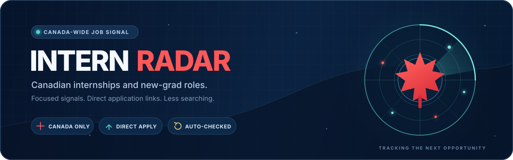

  

<h1 align="center">Canadian Internships &amp; New-Grad Roles - 2026</h1>

<strong>Canada-only internships, co-ops, and early-career roles - one searchable list, newest first.</strong>

  <a href="#tech-internships"><strong>Tech internships</strong></a> 385 open
  &nbsp;&nbsp;-&nbsp;&nbsp;
  <a href="#other-internships"><strong>Other internships</strong></a> 1273 open 
  <a href="#tech-new-grad-roles"><strong>Tech new grad</strong></a> 110 open
  &nbsp;&nbsp;-&nbsp;&nbsp;
  <a href="#other-early-career-roles"><strong>Other early career</strong></a> 448 open

  <a href="CONTRIBUTING.md"><strong>Contributing</strong></a> -
  <a href="../../issues/new?template=suggest-listing.yml">Suggest or report a listing</a>

  
  
  
  
  

Last refreshed Sep 3, 2026 at 12:15 UTC

> [!TIP]
> 
<strong>Start with what changed.</strong> NEW marks roles posted in the last 7 days. The Posted column shows both the exact date and age. Use <code>Ctrl+F</code> or <code>Cmd+F</code> to scan for a city, company, or skill. Every row is re-checked for a Canadian location before it is published.

## Internships & co-ops

**1658 open role(s)** - newest employer posting date first

### Tech internships

**385 open role(s)**

<strong>Companies with the most tech internship openings</strong>

| Company | Open roles |
|---|---:|
| Huawei Canada | 31 |
| PricewaterhouseCoopers (PwC) | 21 |
| Royal Bank of Canada | 21 |
| Vosyn | 18 |
| Manulife Financial | 17 |
| Intelcom \| Dragonfly | 13 |

| Company | Role | Location | Details | Posted | Apply |
|---|---|---|---|---:|---|
| CAE | NEW C-FIN-275 Stagiaire en genie logiciel, IA, automatisation et intelligence d&#39;affaires | Montreal, Quebec, Canada | - | Sep 3, 2026 today | <a href="https://www.linkedin.com/jobs/view/4462726244"><strong>Apply</strong></a> | <!--id:0-->
| CGI | NEW Coop AI Developer | Calgary, Alberta, Canada | Winter 2027 - 8 month term - Co-op enrollment - Student status | Sep 3, 2026 today | <a href="https://www.linkedin.com/jobs/view/4462742060"><strong>Apply</strong></a> | <!--id:0-->
| SAP | NEW SAP iXp Intern - Developpeur Java, developpement Cloud | Montreal, Quebec, Canada | - | Sep 3, 2026 today | <a href="https://www.linkedin.com/jobs/view/4451944512"><strong>Apply</strong></a> | <!--id:0-->
| Sun Life | NEW Student, Associate Front-End Developer (Winter 2027) | North York, Ontario, Canada | Winter 2027 - Graduating 2027 - Hybrid / on-site | Sep 3, 2026 today | <a href="https://www.linkedin.com/jobs/view/4462443057"><strong>Apply</strong></a> | <!--id:0-->
| KPMG Canada | NEW QC - Stagiaire Cybersecurite Reponse aux Incidents | Montreal, Quebec, Canada | Winter 2027 | Sep 3, 2026 today | <a href="https://www.linkedin.com/jobs/view/4462729648"><strong>Apply</strong></a> | <!--id:0-->
| Pratt &amp; Whitney | NEW Stage - Hiver 2027 - Automatisation /Internship - Winter 2027 - Automation | Mirabel, Quebec, Canada | Winter 2027 | Sep 3, 2026 today | <a href="https://www.linkedin.com/jobs/view/4462481489"><strong>Apply</strong></a> | <!--id:0-->
| SAP | NEW SAP iXp Intern - Java Developer, Cloud Development | Montreal, Quebec, Canada | Hybrid / on-site - Possible repost | Sep 3, 2026 today | <a href="https://www.linkedin.com/jobs/view/4451948524"><strong>Apply</strong></a> | <!--id:0-->
| General Dynamics Mission Systems-Canada | NEW Co-op Winter 2027 - Software Developer - 8 Months | Ottawa, Ontario, Canada | Winter 2027 - 8 month term - Canadian work authorization - Co-op enrollment | Sep 3, 2026 today | <a href="https://www.linkedin.com/jobs/view/4462420075"><strong>Apply</strong></a> | <!--id:0-->
| General Dynamics Mission Systems-Canada | NEW Co-op Winter 2027 - Software Engineering Developer - 16-Months | Calgary, Alberta, Canada | Winter 2027 - 16 month term - Canadian work authorization - Co-op enrollment | Sep 3, 2026 today | <a href="https://www.linkedin.com/jobs/view/4462186959"><strong>Apply</strong></a> | <!--id:0-->
| SAP | NEW SAP iXp Intern - CX Cloud Operation, Platform Developer (AIOps) | Montreal, Quebec, Canada | Hybrid / on-site | Sep 3, 2026 today | <a href="https://www.linkedin.com/jobs/view/4461328925"><strong>Apply</strong></a> | <!--id:0-->
| SAP | NEW Stagiaire iXp SAP - CX Operations Cloud, Developpeur de plateforme (AIOps) | Montreal, Quebec, Canada | - | Sep 3, 2026 today | <a href="https://www.linkedin.com/jobs/view/4461336754"><strong>Apply</strong></a> | <!--id:0-->
| Mirego | NEW Stagiaire en developpement logiciel - janvier 2027 | Montreal, Quebec, Canada | Winter 2027 | Sep 3, 2026 today | <a href="https://www.linkedin.com/jobs/view/4462495630"><strong>Apply</strong></a> | <!--id:0-->
| J.D. Irving, Limited | NEW Finance Data Analyst Student - Winter 2027 | Saint John, New Brunswick, Canada | Winter 2027 - Transcript - Possible repost | Sep 3, 2026 today | <a href="https://www.linkedin.com/jobs/view/4462484474"><strong>Apply</strong></a> | <!--id:0-->
| RBC | NEW 2027 Winter - GRM, FC Insights and Analytics Intern (4 Months) | Toronto, Ontario, Canada | Winter 2027 - 4 month term - Full-time - Co-op enrollment | Sep 3, 2026 today | <a href="https://www.linkedin.com/jobs/view/4462172694"><strong>Apply</strong></a> | <!--id:0-->
| Mirego | NEW Stagiaire en developpement logiciel - Equipe d&#39;intelligence artificielle generative - janvier 2027 | Quebec, Quebec, Canada | Winter 2027 | Sep 3, 2026 today | <a href="https://www.linkedin.com/jobs/view/4462711111"><strong>Apply</strong></a> | <!--id:0-->
| Sun Life | NEW Student, Cloud Infrastructure Analyst (Fall 2026) | Toronto, Ontario, Canada | Fall 2026 - Graduating 2026 - Hybrid / on-site - Security clearance | Sep 3, 2026 today | <a href="https://www.linkedin.com/jobs/view/4462445080"><strong>Apply</strong></a> | <!--id:0-->
| Info-Tech Research Group | NEW Co-op Software Developer - Winter 2027 (January - April) - London or Toronto, Ontario (Remote/Hybrid Based on Location) | Toronto, Ontario, Canada | Winter 2027 - Co-op enrollment - Hybrid / on-site - Student status | Sep 3, 2026 today | <a href="https://www.linkedin.com/jobs/view/4462446125"><strong>Apply</strong></a> | <!--id:0-->
| KPMG Canada | NEW QC - Intern Cybersecurity Incident Response | Quebec, Quebec, Canada | Winter 2027 - French / bilingual | Sep 3, 2026 today | <a href="https://www.linkedin.com/jobs/view/4462714675"><strong>Apply</strong></a> | <!--id:0-->
| CAE | NEW C-FIN-275 Software Engineering Intern, AI, Automation and Business Intelligence-EN | Montreal, Quebec, Canada | Hybrid / on-site - Security clearance | Sep 3, 2026 today | <a href="https://www.linkedin.com/jobs/view/4459993956"><strong>Apply</strong></a> | <!--id:0-->
| AbCellera | NEW IT Helpdesk Intern (8-month Co-op) | Vancouver | $3.3K-$4.3K/mo - 8 month term - Co-op enrollment - Hybrid / on-site | Sep 2, 2026 1 day old | <a href="https://job-boards.greenhouse.io/abcellera/jobs/7984903003"><strong>Apply</strong></a> | <!--id:317400-->
| General Motors | NEW 2027 Winter Co-op Body Controls Calibration and System Test Developer | Oshawa Elevation Centre - Oshawa Elevation Centre | 16 month term - Full-time - Co-op enrollment | Sep 2, 2026 1 day old | <a href="https://generalmotors.wd5.myworkdayjobs.com/Careers_GM/job/Oshawa-Elevation-Centre---Oshawa-Elevation-Centre/XMLNAME-2027-Winter-Co-op-Body-Controls-Calibration-and-System-Test-Developer_JR-202618823"><strong>Apply</strong></a> | <!--id:317280-->
| Sun Life | NEW Student, Jr. Strategy Analyst, AI Enablement &amp; Acceleration (Winter 2027) | Toronto, Ontario, Sun Life Toronto One York | Winter 2027 - Full-time - Hybrid / on-site - Student status | Sep 2, 2026 1 day old | <a href="https://sunlife.wd3.myworkdayjobs.com/Campus/job/Toronto-Ontario/Student--Jr-Strategy-Analyst--AI-Enablement---Acceleration--Winter-2027-_JR00127738"><strong>Apply</strong></a> | <!--id:317278-->
| CAE | NEW C-IT-200 Product Cybersecurity Specialist Intern | Montreal (St. Laurent), Montreal - 8585 Cote-De-Liesse, QC, Canada | 16 week term - Full-time - Co-op enrollment | Sep 2, 2026 1 day old | <a href="https://cae.wd3.myworkdayjobs.com/career/job/Montreal-St-Laurent/C-IT-200-Product-Cybersecurity-Specialist-Intern_123542"><strong>Apply</strong></a> | <!--id:317277-->
| CAE | NEW C-FIN-275 Software Engineering Intern, AI, Automation and Business Intelligence | Montreal (St. Laurent), Montreal - 8585 Cote-De-Liesse, QC, Canada | Full-time - Hybrid / on-site - Security clearance | Sep 2, 2026 1 day old | <a href="https://cae.wd3.myworkdayjobs.com/career/job/Montreal-St-Laurent/C-FIN-275-Software-Engineering-Intern--AI--Automation-and-Business-Intelligence_123477-1"><strong>Apply</strong></a> | <!--id:317276-->
| General Dynamics Mission Systems | NEW Co-op Winter 2027 - Software Developer - 8 Months | Ottawa, ON, Canada, Ottawa, ON, Canada | Winter 2027 - 8 month term - Co-op enrollment | Sep 2, 2026 1 day old | <a href="https://jobs.smartrecruiters.com/GDMSI/744000147019949"><strong>Apply</strong></a> | <!--id:317255-->
| General Dynamics Mission Systems | NEW Co-op Winter 2027 - Software Engineering Developer - 16-Months | Calgary, AB, Canada, Calgary, AB, Canada | Winter 2027 - 16 month term - Co-op enrollment | Sep 2, 2026 1 day old | <a href="https://jobs.smartrecruiters.com/GDMSI/744000146985399"><strong>Apply</strong></a> | <!--id:317257-->
| TD Bank | NEW Direct Investing Analytics &amp; Insights Intern / Co-Op (Winter 2027) | Toronto, Ontario, 161 Bay Street Corporate, Toronto, Ontario | Winter 2027 - $48K-$68K/yr - Full-time - Co-op enrollment | Sep 2, 2026 1 day old | <a href="https://td.wd3.myworkdayjobs.com/TD_Bank_Careers/job/Toronto-Ontario/Direct-Investing-Analytics---Insights-Intern---Co-Op--Fall-2026-_R_1507372"><strong>Apply</strong></a> | <!--id:317323-->
| Fleetway | NEW Finance Data Analyst Student - Winter 2027 | Saint John, NB, Canada | Winter 2027 | Sep 2, 2026 1 day old | <a href="https://hcpd.fa.ca2.oraclecloud.com/hcmUI/CandidateExperience/en/sites/CX_1/job/11918"><strong>Apply</strong></a> | <!--id:317297-->
| Almag Aluminum | NEW IT Technical Support Co-op | Brampton, Ontario, Canada | Co-op enrollment | Sep 2, 2026 1 day old | <a href="https://apply.workable.com/almag-aluminum/j/E8C48DB573/"><strong>Apply</strong></a> | <!--id:317402-->
| Nokia | NEW DSP Firmware Engineering Co-op/Intern | Canada | Co-op enrollment | Sep 2, 2026 1 day old | <a href="https://fa-evmr-saasfaprod1.fa.ocs.oraclecloud.com/hcmUI/CandidateExperience/en/sites/CX_1/job/39237"><strong>Apply</strong></a> | <!--id:317299-->
| Nokia | NEW Software Tester - Co-op/Intern | Canada | Co-op enrollment | Sep 2, 2026 1 day old | <a href="https://fa-evmr-saasfaprod1.fa.ocs.oraclecloud.com/hcmUI/CandidateExperience/en/sites/CX_1/job/39342"><strong>Apply</strong></a> | <!--id:317266-->
| Nokia | NEW Test Automation Co-op/Intern | Canada | Co-op enrollment | Sep 2, 2026 1 day old | <a href="https://fa-evmr-saasfaprod1.fa.ocs.oraclecloud.com/hcmUI/CandidateExperience/en/sites/CX_1/job/39345"><strong>Apply</strong></a> | <!--id:317267-->
| Nokia | NEW Software Developer Co-op/Intern | Canada | Co-op enrollment | Sep 2, 2026 1 day old | <a href="https://fa-evmr-saasfaprod1.fa.ocs.oraclecloud.com/hcmUI/CandidateExperience/en/sites/CX_1/job/39435"><strong>Apply</strong></a> | <!--id:317271-->
| Nokia | NEW Test Automation Designer Coop/Intern | Canada | Co-op enrollment | Sep 2, 2026 1 day old | <a href="https://fa-evmr-saasfaprod1.fa.ocs.oraclecloud.com/hcmUI/CandidateExperience/en/sites/CX_1/job/39338"><strong>Apply</strong></a> | <!--id:317264-->
| Nokia | NEW Tools and Automation SW Dev Co-op/Intern | Canada | Co-op enrollment | Sep 2, 2026 1 day old | <a href="https://fa-evmr-saasfaprod1.fa.ocs.oraclecloud.com/hcmUI/CandidateExperience/en/sites/CX_1/job/39341"><strong>Apply</strong></a> | <!--id:317265-->
| Nokia | NEW Software Applications Co-op/Intern | Canada | Co-op enrollment | Sep 2, 2026 1 day old | <a href="https://fa-evmr-saasfaprod1.fa.ocs.oraclecloud.com/hcmUI/CandidateExperience/en/sites/CX_1/job/39432"><strong>Apply</strong></a> | <!--id:317270-->
| Definity | NEW Data Specialist - Claim Operations Management - Fall 2026 Co-op/Intern | Waterloo, ONT, Canada | Fall 2026 - Co-op enrollment | Sep 2, 2026 1 day old | <a href="https://hdks.fa.ca2.oraclecloud.com/hcmUI/CandidateExperience/en/sites/CX_1/job/9148"><strong>Apply</strong></a> | <!--id:317252-->
| Royal Bank of Canada | NEW 2027 Winter - GRM, FC Insights and Analytics Intern (4 Months) | TORONTO, Ontario, Canada, 20 KING ST W:TORONTO | Winter 2027 - 4 month term - Full-time - Co-op enrollment | Sep 1, 2026 2 days old | <a href="https://rbc.wd3.myworkdayjobs.com/RBCEARLYTALENT1/job/TORONTO-Ontario-Canada/XMLNAME-2027-Winter---GRM--FC-Insights-and-Analytics-Intern--4-Months-_R-0000185601-2"><strong>Apply</strong></a> | <!--id:317219-->
| General Dynamics Mission Systems | NEW Co-op May 2026 - Software Engineering - 8 Months | Ottawa, ON, Canada, Ottawa, ON, Canada | 8 month term - Co-op enrollment | Sep 1, 2026 2 days old | <a href="https://jobs.smartrecruiters.com/GDMSI/744000146822449"><strong>Apply</strong></a> | <!--id:317227-->
| Intelcom \| Dragonfly | NEW Software Development Intern - Address Intelligence Platform | Canada, Quebec, Montreal, Service Centre (Montreal) Lab | Full-time | Sep 1, 2026 2 days old | <a href="https://intelcomgroup.wd3.myworkdayjobs.com/Intelcom/job/Canada-Quebec-Montreal/Software-Development-Intern---Address-Intelligence-Platform_JR111611"><strong>Apply</strong></a> | <!--id:317180-->
| Intelcom \| Dragonfly | NEW Front-End Developer Intern - Power Platform Integration | Canada, Quebec, Montreal, Service Centre (Montreal) Lab | Full-time | Sep 1, 2026 2 days old | <a href="https://intelcomgroup.wd3.myworkdayjobs.com/Intelcom/job/Canada-Quebec-Montreal/Front-End-Developer-Intern---Power-Platform-Integration_JR111615-1"><strong>Apply</strong></a> | <!--id:317179-->
| Remarcable | NEW Full Stack Developer (Student Co-op) | Vancouver, BC | CA$23 - CA$26 - 12 month term - Full-time - Co-op enrollment | Sep 1, 2026 2 days old | <a href="https://jobs.ashbyhq.com/remarcable-inc/a4f3aaaa-9469-42e8-a610-450d25eb5da7"><strong>Apply</strong></a> | <!--id:317196-->
| Huawei Canada | NEW Co-op Engineer - Computer Network for AI | Markham, Ontario, Canada, Markham, Canada | Co-op enrollment | Sep 1, 2026 2 days old | <a href="https://huaweicanada.recruitee.com/o/co-op-engineer-computer-network-for-ai"><strong>Apply</strong></a> | <!--id:317258-->
| TC Energy | NEW Student Intern, Computer Science | Calgary, Alberta, Calgary Head Office | Full-time - Hybrid / on-site - Student status | Sep 1, 2026 2 days old | <a href="https://tcenergy.wd3.myworkdayjobs.com/CAREER_SITE_TC/job/Calgary-Alberta/Student-Intern--Computer-Science_JR-10733"><strong>Apply</strong></a> | <!--id:317117-->
| RTX | NEW Stage - Hiver 2027 - Developpement Logiciel Avance, Methodes Numeriques / Internship - Winter 2027 - Advanced Software Development, Numerical Methods | CA-QC-LONGUEUIL-J01 ~ 1000 Blvd Marie-Victorin ~ J01 BLDG | Winter 2027 - Full-time - Co-op enrollment | Sep 1, 2026 2 days old | <a href="https://globalhr.wd5.myworkdayjobs.com/REC_RTX_Ext_Gateway/job/CA-QC-LONGUEUIL-J01--1000-Blvd-Marie-Victorin--J01-BLDG/Stage---Hiver-2027---Dveloppement-Logiciel-Avanc--Mthodes-Numriques---Internship---Winter-2027---Advanced-Software-Development--Numerical-Methods_01871187"><strong>Apply</strong></a> | <!--id:317095-->
| General Motors | NEW 2027 Winter Co-op Mechatronic Infrastructure Diagnostic Systems | Markham, Ontario, Canada, Markham Elevation Centre - Markham Elevation Centre | 12 month term - Full-time - Co-op enrollment | Sep 1, 2026 2 days old | <a href="https://generalmotors.wd5.myworkdayjobs.com/Careers_GM/job/Markham-Ontario-Canada/XMLNAME-2027-Winter-Co-op-Mechatronic-Infrastructure-Diagnostic-Systems_JR-202618915"><strong>Apply</strong></a> | <!--id:317082-->
| Royal Bank of Canada | NEW 2027 Winter - CDO, Data Traceability &amp; Controls Intern (4 Months - Bedford, NS) | HALIFAX, Nova Scotia, Canada, 175 WESTERN PKY:BEDFORD | Winter 2027 - 4 month term - Full-time - Co-op enrollment | Sep 1, 2026 2 days old | <a href="https://rbc.wd3.myworkdayjobs.com/rbcglobal1/job/HALIFAX-Nova-Scotia-Canada/XMLNAME-2027-Winter---CDO--Data-Traceability---Controls-Intern--4-Months-_R-0000186553"><strong>Apply</strong></a> | <!--id:317392-->
| Fleetway | NEW Data Modelling Co-op Student - Winter 2027 | Toronto, ON, Canada | Winter 2027 - Co-op enrollment | Sep 1, 2026 2 days old | <a href="https://hcpd.fa.ca2.oraclecloud.com/hcmUI/CandidateExperience/en/sites/CX_1/job/11866"><strong>Apply</strong></a> | <!--id:317205-->
| Flexspring | NEW QA Automation Engineer co-op | Montreal, Quebec, Canada | Full-time - Co-op enrollment | Sep 1, 2026 2 days old | <a href="https://flexspring.bamboohr.com/careers/69"><strong>Apply</strong></a> | <!--id:317195-->
| Flexspring | NEW Full Stack Developer co-op | Montreal, Quebec, Canada | Full-time - Co-op enrollment | Sep 1, 2026 2 days old | <a href="https://flexspring.bamboohr.com/careers/68"><strong>Apply</strong></a> | <!--id:317194-->
| Stripe | NEW Software Engineer, Intern (Summer or Winter) | Toronto | - | Aug 31, 2026 3 days old | <a href="https://stripe.com/jobs/search?gh_jid=8130805"><strong>Apply</strong></a> | <!--id:317132-->
| Manulife Financial | NEW Winter Co-op 2027 - Software Engineering | Toronto, Ontario, CAN, Ontario, Toronto, 200 Bloor Street East | $52.65K/yr - 4 month term - Full-time - Co-op enrollment | Aug 31, 2026 3 days old | <a href="https://manulife.wd3.myworkdayjobs.com/MFCJH_Jobs/job/Toronto-Ontario/Winter-Co-op-2027---Software-Engineering_JR26081663"><strong>Apply</strong></a> | <!--id:317073-->
| Manulife Financial | NEW Winter Co-op 2027 - Software Engineering (8 Months) | Toronto, Ontario, CAN, Ontario, Toronto, 200 Bloor Street East | $52.65K/yr - 8 month term - Full-time - Co-op enrollment | Aug 31, 2026 3 days old | <a href="https://manulife.wd3.myworkdayjobs.com/MFCJH_Jobs/job/Toronto-Ontario/Winter-Co-op-2027---Software-Engineering--8-Months-_JR26081664"><strong>Apply</strong></a> | <!--id:317072-->
| Royal Bank of Canada | NEW 2027 Winter - GRM, ALM Risk Data &amp; Automation Analyst Intern (4 Months) | TORONTO, Ontario, Canada, ROYAL BANK PLAZA, 200 BAY ST:TORONTO | Winter 2027 - 4 month term - Full-time - Co-op enrollment | Aug 31, 2026 3 days old | <a href="https://rbc.wd3.myworkdayjobs.com/RBCEARLYTALENT1/job/TORONTO-Ontario-Canada/XMLNAME-2027-Winter---GRM--ALM-Risk-Data---Automation-Analyst-Intern--4-Months-_R-0000186330"><strong>Apply</strong></a> | <!--id:317066-->
| Royal Bank of Canada | NEW 2027 Winter - GRM, Data Analyst Intern (4 Months) | TORONTO, Ontario, Canada, ROYAL BANK PLAZA, 200 BAY ST:TORONTO | Winter 2027 - 4 month term - Full-time - Co-op enrollment | Aug 31, 2026 3 days old | <a href="https://rbc.wd3.myworkdayjobs.com/rbcglobal1/job/TORONTO-Ontario-Canada/XMLNAME-2027-Winter---GRM--Data-Analyst-Intern--4-Months-_R-0000186286"><strong>Apply</strong></a> | <!--id:317065-->
| Manulife Financial | NEW Winter Co-op 2027 - Software Engineering | Waterloo, Ontario, CAN, Ontario, Waterloo, 500 King Street North | $52.65K/yr - 4 month term - Full-time - Co-op enrollment | Aug 31, 2026 3 days old | <a href="https://manulife.wd3.myworkdayjobs.com/MFCJH_Jobs/job/Waterloo-Ontario/Winter-Co-op-2027---Software-Engineering_JR26081661"><strong>Apply</strong></a> | <!--id:317058-->
| Ciena | NEW AI &amp; Automation Intern - GCN Services Business Operations | Ottawa, Canada- Ottawa- 5050 Innovation- Bldg A | Fall - $20.5-$27.5/hr - Full-time - Hybrid / on-site | Aug 31, 2026 3 days old | <a href="https://ciena.wd5.myworkdayjobs.com/Careers/job/Ottawa/Resourcing-and-Enablement-Intern_R030908"><strong>Apply</strong></a> | <!--id:44090-->
| FortWood Capital LP | NEW Intern, Quantitative Developer | Vancouver, British Columbia, Canada | $11K/yr - Canadian work authorization - Cover letter - Portfolio / GitHub | Aug 31, 2026 3 days old | <a href="https://www.linkedin.com/jobs/view/4461077111"><strong>Apply</strong></a> | <!--id:0-->
| SOTI | NEW Performance Test Engineer Intern (January 2027 12 Months) | Mississauga, Canada - Meadowvale Office (HQ) | 12 month term - Full-time | Aug 31, 2026 3 days old | <a href="https://soti.wd3.myworkdayjobs.com/SOTI-Next-Gen/job/Mississauga-Canada--Meadowvale-Office-HQ/Performance-Test-Engineer-Intern--January-2027-12-Months-_R10437"><strong>Apply</strong></a> | <!--id:317104-->
| OMERS | NEW Student Analyst, Global Credit (Opportunities Across Private Corporate / Infrastructure Credit, Leveraged Finance and Capital Securities / Liquid Credit) - (Summer 2027, 4 Months) | Toronto, Ontario, Head Office Toronto | Summer 2027 - 4 month term - Full-time - Hybrid / on-site | Aug 31, 2026 3 days old | <a href="https://omers.wd3.myworkdayjobs.com/omers_external/job/Toronto-Ontario/Student-Analyst--Global-Credit--Opportunities-Across-Private-Corporate---Infrastructure-Credit--Leveraged-Finance-and-Capital-Securities---Liquid-Credit-----Summer-2027--4-Months-_JR-8383"><strong>Apply</strong></a> | <!--id:317048-->
| Intelcom \| Dragonfly | NEW Software Developer in Test Intern | Canada, Quebec, Montreal, Service Centre (Montreal) Lab | Full-time | Aug 31, 2026 3 days old | <a href="https://intelcomgroup.wd3.myworkdayjobs.com/Intelcom/job/Canada-Quebec-Montreal/Software-Developer-in-Test-Intern_JR111565"><strong>Apply</strong></a> | <!--id:317038-->
| Intelcom \| Dragonfly | NEW Site Reliability Engineering (SRE) Intern | Canada, Quebec, Montreal, Service Centre (Montreal) Lab | Full-time | Aug 31, 2026 3 days old | <a href="https://intelcomgroup.wd3.myworkdayjobs.com/Intelcom/job/Canada-Quebec-Montreal/Site-Reliability-Engineering--SRE--Intern_JR111560"><strong>Apply</strong></a> | <!--id:317037-->
| Intelcom \| Dragonfly | NEW Business Intelligence (BI) Developer Intern | Canada, Quebec, Montreal, Service Centre (Montreal) | Full-time | Aug 31, 2026 3 days old | <a href="https://intelcomgroup.wd3.myworkdayjobs.com/Intelcom/job/Canada-Quebec-Montreal/Business-Intelligence--BI--Developer-Intern_JR111555"><strong>Apply</strong></a> | <!--id:317029-->
| Intelcom \| Dragonfly | NEW Data Engineering Intern | Canada, Quebec, Montreal, Service Centre (Montreal) Lab | Full-time | Aug 31, 2026 3 days old | <a href="https://intelcomgroup.wd3.myworkdayjobs.com/Intelcom/job/Canada-Quebec-Montreal/Data-Engineering-Intern_JR111567"><strong>Apply</strong></a> | <!--id:317031-->
| Intelcom \| Dragonfly | NEW DevOps Intern | Canada, Quebec, Montreal, Service Centre (Montreal) Lab | Full-time - Student status - Portfolio / GitHub | Aug 31, 2026 3 days old | <a href="https://intelcomgroup.wd3.myworkdayjobs.com/Intelcom/job/Canada-Quebec-Montreal/DevOps-Intern_JR111562"><strong>Apply</strong></a> | <!--id:317032-->
| Intelcom \| Dragonfly | NEW Full-Stack Developer Intern - Route Optimization | Canada, Quebec, Montreal, Service Centre (Montreal) Lab | Full-time | Aug 31, 2026 3 days old | <a href="https://intelcomgroup.wd3.myworkdayjobs.com/Intelcom/job/Canada-Quebec-Montreal/Full-Stack-Developer-Intern---Route-Optimization_JR111570-1"><strong>Apply</strong></a> | <!--id:317024-->
| Intelcom \| Dragonfly | NEW Front-end Developer Intern - Mobile Application | Canada, Quebec, Montreal, Service Centre (Montreal) Lab | Full-time | Aug 31, 2026 3 days old | <a href="https://intelcomgroup.wd3.myworkdayjobs.com/Intelcom/job/Canada-Quebec-Montreal/Front-end-Developer-Intern---Mobile-Application_JR111571"><strong>Apply</strong></a> | <!--id:317023-->
| Intelcom \| Dragonfly | NEW Routing Data Analytics &amp; Optimization Intern | Canada, Quebec, Montreal, Service Centre (Montreal) | Full-time | Aug 31, 2026 3 days old | <a href="https://intelcomgroup.wd3.myworkdayjobs.com/Intelcom/job/Canada-Quebec-Montreal/Routing-Data-Analytics---Optimization-Intern_JR111557-1"><strong>Apply</strong></a> | <!--id:317025-->
| Intelcom \| Dragonfly | NEW Software Development Intern - Warehouse Productivity | Canada, Quebec, Montreal, Service Centre (Montreal) Lab | Full-time | Aug 31, 2026 3 days old | <a href="https://intelcomgroup.wd3.myworkdayjobs.com/Intelcom/job/Canada-Quebec-Montreal/Software-Development-Intern---Warehouse-Productivity_JR111578-1"><strong>Apply</strong></a> | <!--id:317022-->
| Intelcom \| Dragonfly | NEW AI Data Analyst Intern | Canada, Quebec, Montreal, Service Centre (Montreal) Lab | Full-time | Aug 31, 2026 3 days old | <a href="https://intelcomgroup.wd3.myworkdayjobs.com/Intelcom/job/Canada-Quebec-Montreal/AI-Data-Analyst-Intern_JR111568"><strong>Apply</strong></a> | <!--id:317027-->
| Manulife Financial | NEW Winter Co-op 2027 - AI | Toronto, Ontario, CAN, Ontario, Toronto, 200 Bloor Street East | $54.6K/yr - Full-time - Co-op enrollment - Hybrid / on-site | Aug 31, 2026 3 days old | <a href="https://manulife.wd3.myworkdayjobs.com/MFCJH_Jobs/job/Toronto-Ontario/Winter-Co-op-2027---AI_JR26081677"><strong>Apply</strong></a> | <!--id:317019-->
| Wealthsimple | NEW Software Development and Data Science Internships (Winter 2027) | Toronto, Ontario | Winter 2027 - CA$74K - CA$90K - 8 month term - Co-op enrollment | Aug 31, 2026 3 days old | <a href="https://jobs.ashbyhq.com/wealthsimple/de09418a-8a12-46aa-a371-34bafaf5be26"><strong>Apply</strong></a> | <!--id:317046-->
| Manulife Financial | NEW Summer Intern 2027 - Software Engineering | Toronto, Ontario, CAN, Ontario, Toronto, 200 Bloor Street East | $52.65K/yr - Full-time - Hybrid / on-site - Cover letter | Aug 31, 2026 3 days old | <a href="https://manulife.wd3.myworkdayjobs.com/MFCJH_Jobs/job/Toronto-Ontario/Summer-Intern-2027---Software-Engineering_JR26081684"><strong>Apply</strong></a> | <!--id:317383-->
| Manulife Financial | NEW Winter Co-op 2027 - Data Engineering | Toronto, Ontario, CAN, Ontario, Toronto, 200 Bloor Street East | $52.65K/yr - 4 month term - Full-time - Co-op enrollment | Aug 31, 2026 3 days old | <a href="https://manulife.wd3.myworkdayjobs.com/MFCJH_Jobs/job/Toronto-Ontario/Winter-Co-op-2027---Data-Engineering_JR26081658"><strong>Apply</strong></a> | <!--id:317385-->
| Manulife Financial | NEW Winter Co-op 2027 - Data Engineering | Waterloo, Ontario, CAN, Ontario, Waterloo, 500 King Street North | $52.65K/yr - 4 month term - Full-time - Co-op enrollment | Aug 31, 2026 3 days old | <a href="https://manulife.wd3.myworkdayjobs.com/MFCJH_Jobs/job/Waterloo-Ontario/Winter-Co-op-2027---Data-Engineering_JR26081660"><strong>Apply</strong></a> | <!--id:317384-->
| Manulife Financial | NEW Winter Co-op 2027 - AI (12 Months) | Toronto, Ontario, CAN, Ontario, Toronto, 200 Bloor Street East | $54.6K/yr - 12 month term - Full-time - Co-op enrollment | Aug 31, 2026 3 days old | <a href="https://manulife.wd3.myworkdayjobs.com/MFCJH_Jobs/job/Toronto-Ontario/Winter-Co-op-2027---AI--12-Months-_JR26081678"><strong>Apply</strong></a> | <!--id:317386-->
| Manulife Financial | NEW Summer Intern 2027 - Software Engineering | Waterloo, Ontario, CAN, Ontario, Waterloo, 500 King Street North | $52.65K/yr - Full-time - Hybrid / on-site - Cover letter | Aug 31, 2026 3 days old | <a href="https://manulife.wd3.myworkdayjobs.com/MFCJH_Jobs/job/Waterloo-Ontario/Summer-Intern-2027---Software-Engineering_JR26081686"><strong>Apply</strong></a> | <!--id:317381-->
| Manulife Financial | NEW Summer Intern 2027 - Data Engineering | Toronto, Ontario, CAN, Ontario, Toronto, 200 Bloor Street East | $52.65K/yr - Full-time - Hybrid / on-site - Cover letter | Aug 31, 2026 3 days old | <a href="https://manulife.wd3.myworkdayjobs.com/MFCJH_Jobs/job/Toronto-Ontario/Summer-Intern-2027---Data-Engineering_JR26081683"><strong>Apply</strong></a> | <!--id:317382-->
| Manulife Financial | NEW Summer Intern 2027 - Software Engineering (8 Months) | Toronto, Ontario, CAN, Ontario, Toronto, 200 Bloor Street East | $52.65K/yr - 8 month term - Full-time - Hybrid / on-site | Aug 31, 2026 3 days old | <a href="https://manulife.wd3.myworkdayjobs.com/MFCJH_Jobs/job/Toronto-Ontario/Summer-Intern-2027---Software-Engineering--8-Months-_JR26081685"><strong>Apply</strong></a> | <!--id:317380-->
| Manulife Financial | NEW Winter Co-op 2027 - Risk Analytics &amp; Automation (8 months) | Toronto, Ontario, CAN, Ontario, Toronto, 200 Bloor Street East | $46.8K/yr - 8 month term - Full-time - Co-op enrollment | Aug 31, 2026 3 days old | <a href="https://manulife.wd3.myworkdayjobs.com/MFCJH_Jobs/job/Toronto-Ontario/Winter-Co-op-2027---Risk-Analytics---Automation--8-months-_JR26080922"><strong>Apply</strong></a> | <!--id:317377-->
| Manulife Financial | NEW Summer Intern 2027 - AI | Toronto, Ontario, CAN, Ontario, Toronto, 200 Bloor Street East | $54.6K/yr - Full-time - Hybrid / on-site - Cover letter | Aug 31, 2026 3 days old | <a href="https://manulife.wd3.myworkdayjobs.com/MFCJH_Jobs/job/Toronto-Ontario/Summer-Intern-2027---AI_JR26081688"><strong>Apply</strong></a> | <!--id:317378-->
| Manulife Financial | NEW Summer Intern 2027 - Data &amp; Analytics | Toronto, Ontario, CAN, Ontario, Toronto, 250 Bloor Street East | $60.45K/yr - Full-time - Co-op enrollment - Hybrid / on-site | Aug 31, 2026 3 days old | <a href="https://manulife.wd3.myworkdayjobs.com/MFCJH_Jobs/job/Toronto-Ontario/XMLNAME-2027-Summer-Co-op---Data---Analytics_JR26081967"><strong>Apply</strong></a> | <!--id:317372-->
| Manulife Financial | NEW Summer Intern 2027 - Data &amp; Analytics (8 Months) | Waterloo, Ontario, CAN, Ontario, Waterloo, 500 King Street North | $60.45K/yr - 8 month term - Full-time - Co-op enrollment | Aug 31, 2026 3 days old | <a href="https://manulife.wd3.myworkdayjobs.com/MFCJH_Jobs/job/Waterloo-Ontario/XMLNAME-2027-Summer-Co-op---Data---Analytics--8-Months-_JR26081977"><strong>Apply</strong></a> | <!--id:317371-->
| Manulife Financial | NEW Winter Co-op 2027 - Data &amp; Analytics | Toronto, Ontario, CAN, Ontario, Toronto, 250 Bloor Street East | $60.45K/yr - Full-time - Co-op enrollment - Hybrid / on-site | Aug 31, 2026 3 days old | <a href="https://manulife.wd3.myworkdayjobs.com/MFCJH_Jobs/job/Toronto-Ontario/XMLNAME-2027-Winter-Co-op---Data---Analytics_JR26081943"><strong>Apply</strong></a> | <!--id:317365-->
| Manulife Financial | NEW Winter Co-op 2027 - Data &amp; Analytics (8 Months) | Toronto, Ontario, CAN, Ontario, Waterloo, 500 King Street North | $60.45K/yr - 8 month term - Full-time - Co-op enrollment | Aug 31, 2026 3 days old | <a href="https://manulife.wd3.myworkdayjobs.com/MFCJH_Jobs/job/Toronto-Ontario/XMLNAME-2027-Winter-Co-op---Data---Analytics--8-Months-_JR26081944"><strong>Apply</strong></a> | <!--id:317364-->
| Google | NEW Software Developer Intern, BS, Summer 2027 | Waterloo, ON, Canada, Toronto, ON, Canada | Summer 2027 - 12 week term - 14 week term - Full-time | Aug 31, 2026 3 days old | <a href="https://www.google.com/about/careers/applications/jobs/results/123510626377966278-software-developer-intern-bs-summer-2027"><strong>Apply</strong></a> | <!--id:317053-->
| Google | NEW Software Developer Intern, MS, Summer 2027 | Waterloo, ON, Canada, Toronto, ON, Canada | Summer 2027 - 12 week term - 14 week term - Full-time | Aug 31, 2026 3 days old | <a href="https://www.google.com/about/careers/applications/jobs/results/138960139137753798-software-developer-intern-ms-summer-2027"><strong>Apply</strong></a> | <!--id:317054-->
| SEGULA Technologies | NEW Stage - Data Analyst | Montreal, Quebec, Canada | - | Aug 30, 2026 4 days old | <a href="https://www.linkedin.com/jobs/view/4460863787"><strong>Apply</strong></a> | <!--id:0-->
| MDA Space | NEW Engineering Student - Software Product Assurance - Fall 2026 | Sainte-Anne-de-Bellevue, Quebec, Canada | Fall 2026 | Aug 30, 2026 4 days old | <a href="https://www.linkedin.com/jobs/view/4414773340"><strong>Apply</strong></a> | <!--id:0-->
| Trench Group | NEW AI &amp; ML Intern - Electrical Engineer | Scarborough, Ontario, Canada | 12 month term | Aug 30, 2026 4 days old | <a href="https://www.linkedin.com/jobs/view/4434008080"><strong>Apply</strong></a> | <!--id:0-->
| Deloitte | NEW Tech &amp; Transformation - Cyber - Digital Trust &amp; Privacy - Co-op/Intern 2027 - Multiple Locations | Ottawa, Ontario, Canada | Canadian work authorization - Co-op enrollment - Hybrid / on-site | Aug 29, 2026 5 days old | <a href="https://www.linkedin.com/jobs/view/4460502247"><strong>Apply</strong></a> | <!--id:0-->
| Hakkoda, an IBM Company | NEW Federal Developer Intern, Software Engineering (January 2027 - 4 Months - Ottawa) | Ottawa, Ontario, Canada | 4 month term - Hybrid / on-site - Security clearance | Aug 29, 2026 5 days old | <a href="https://www.linkedin.com/jobs/view/4460327228"><strong>Apply</strong></a> | <!--id:0-->
| Trans Mountain | NEW IT, Enterprise and Business Solutions, Co-op Student (12-month term) | Calgary, Alberta, Canada | 12 month term - Co-op enrollment - Student status | Aug 29, 2026 5 days old | <a href="https://www.linkedin.com/jobs/view/4459465547"><strong>Apply</strong></a> | <!--id:0-->
| TommieTest | NEW AI Automation Co-op (Fall 2026) | Vancouver, British Columbia, Canada | Fall 2026 - Co-op enrollment - Student status - Portfolio / GitHub | Aug 29, 2026 5 days old | <a href="https://www.linkedin.com/jobs/view/4460531666"><strong>Apply</strong></a> | <!--id:0-->
| GIRO | NEW Hiver 2027 - Stagiaire en developpement logiciel | Montreal, Quebec, Canada | Winter 2027 | Aug 29, 2026 5 days old | <a href="https://www.linkedin.com/jobs/view/4460521493"><strong>Apply</strong></a> | <!--id:0-->
| Deloitte | NEW Analyst Intern, Infrastructure &amp; Project Finance - Winter 2027 - Toronto | Toronto, Ontario, Canada | Winter 2027 - $40K/yr - Hybrid / on-site | Aug 29, 2026 5 days old | <a href="https://www.linkedin.com/jobs/view/4460504233"><strong>Apply</strong></a> | <!--id:0-->
| Hitachi Rail | NEW Software Analyst Intern (Fall 2026, 8 months) | Toronto, Ontario, Canada | Fall 2026 - 8 month term - Hybrid / on-site - Assessment likely | Aug 29, 2026 5 days old | <a href="https://www.linkedin.com/jobs/view/4448722603"><strong>Apply</strong></a> | <!--id:0-->
| Lumentum | NEW Software Verification Engineer (Co-op/Intern) | Canada - Ottawa (Bill Leathem) | $24-$35/hr - 12 month term - 4 month term - 8 month term | Aug 28, 2026 6 days old | <a href="https://lumentum.wd5.myworkdayjobs.com/LITE/job/Canada---Ottawa-Bill-Leathem/Software-Verification-Engineer--Co-op-Intern-_20261136"><strong>Apply</strong></a> | <!--id:316985-->
| Intelcom \| Dragonfly | NEW Network Planning Intern | Canada, Quebec, Montreal, Service Centre (Montreal) | Full-time | Aug 28, 2026 6 days old | <a href="https://intelcomgroup.wd3.myworkdayjobs.com/Intelcom/job/Canada-Quebec-Montreal/Network-Planning-Intern_JR111558-1"><strong>Apply</strong></a> | <!--id:316943-->
| IBM | NEW Federal Developer Intern, Software Engineering (January 2027 - 4 Months - Ottawa) | Ottawa, Ontario, Canada | 4 month term - Hybrid / on-site - Security clearance | Aug 28, 2026 6 days old | <a href="https://www.linkedin.com/jobs/view/4458028506"><strong>Apply</strong></a> | <!--id:0-->
| IBM | NEW Application Developer Intern - Full Stack / Cloud / Modern Engineering (January 2027 - 4 Months - Toronto) | Toronto, Ontario, Canada | 4 month term - Hybrid / on-site - Portfolio / GitHub | Aug 28, 2026 6 days old | <a href="https://www.linkedin.com/jobs/view/4458036650"><strong>Apply</strong></a> | <!--id:0-->
| KPMG Canada | NEW QC - Stagiaire Developpeur Frontend (Angular) | Boisbriand, Quebec, Canada | - | Aug 28, 2026 6 days old | <a href="https://www.linkedin.com/jobs/view/4404519706"><strong>Apply</strong></a> | <!--id:0-->
| RBC | NEW 2027 Winter - GRM, Data Analyst Developer Intern (8 Months) | Toronto, Ontario, Canada | Winter 2027 - 8 month term - Full-time - Graduating 2027 | Aug 28, 2026 6 days old | <a href="https://www.linkedin.com/jobs/view/4460146625"><strong>Apply</strong></a> | <!--id:0-->
| Ericsson | NEW Software Developer Co-op | Ottawa, Ontario, Canada | 16 month term - Co-op enrollment - Portfolio / GitHub | Aug 28, 2026 6 days old | <a href="https://www.linkedin.com/jobs/view/4458686739"><strong>Apply</strong></a> | <!--id:0-->
| IBM | NEW AI &amp; Automation Data Scientist Intern (January 2027 - 4 Months - Toronto or Montreal) / Stagiaire Data Scientist en IA et Automatisation (janvier 2027 - 4 mois - Toronto ou Montreal) | Toronto, Ontario, Canada | 4 month term - Hybrid / on-site - Portfolio / GitHub | Aug 28, 2026 6 days old | <a href="https://www.linkedin.com/jobs/view/4458027499"><strong>Apply</strong></a> | <!--id:0-->
| IBM | NEW IPC AI/ML Developer Intern (January 2027 - 12 Months - Toronto) | Toronto, Ontario, Canada | 12 month term - Hybrid / on-site | Aug 28, 2026 6 days old | <a href="https://www.linkedin.com/jobs/view/4458058488"><strong>Apply</strong></a> | <!--id:0-->
| IG Wealth Management | NEW Fall Intern 2026 - Cybersecurity Services Department | Manitoba, Canada | Fall 2026 - $44K/yr - Hybrid / on-site - Returning to school | Aug 28, 2026 6 days old | <a href="https://www.linkedin.com/jobs/view/4460129226"><strong>Apply</strong></a> | <!--id:0-->
| IBM | NEW Data Services Developer Intern (January 2027 - 4 Months - Toronto) | Toronto, Ontario, Canada | 4 month term - Hybrid / on-site - Portfolio / GitHub | Aug 28, 2026 6 days old | <a href="https://www.linkedin.com/jobs/view/4458048524"><strong>Apply</strong></a> | <!--id:0-->
| IBM | NEW Machine Learning Developer Intern (January 2027 - 4 Months - Toronto or Montreal) / Stagiaire developpeur en apprentissage automatique (janvier 2027 - 4 mois - Toronto ou Montreal) | Montreal, Quebec, Canada | 4 month term - Hybrid / on-site - Portfolio / GitHub | Aug 28, 2026 6 days old | <a href="https://www.linkedin.com/jobs/view/4458029550"><strong>Apply</strong></a> | <!--id:0-->
| IBM | NEW Salesforce &amp; GTM Developer Intern (January 2027 - 4 Months - Toronto) | Toronto, Ontario, Canada | 4 month term - Hybrid / on-site - Student status | Aug 28, 2026 6 days old | <a href="https://www.linkedin.com/jobs/view/4458016587"><strong>Apply</strong></a> | <!--id:0-->
| Deloitte | NEW Analyst Intern, Software Engineering, Innovation CoE - Winter 2027 - Toronto | Toronto, Ontario, Canada | Winter 2027 - $40K/yr - Graduating 2027 - Hybrid / on-site | Aug 28, 2026 6 days old | <a href="https://www.linkedin.com/jobs/view/4460503244"><strong>Apply</strong></a> | <!--id:0-->
| IBM | NEW Agentic AI Engineer Developer Intern (January 2027 - 4 Months - Toronto) | Toronto, Ontario, Canada | 4 month term - Hybrid / on-site - Portfolio / GitHub | Aug 28, 2026 6 days old | <a href="https://www.linkedin.com/jobs/view/4458030566"><strong>Apply</strong></a> | <!--id:0-->
| Rakuten Kobo Inc. | NEW Software Quality Assurance Co-op | Toronto, Ontario, Canada | $50K/yr - Co-op enrollment - Hybrid / on-site | Aug 28, 2026 6 days old | <a href="https://www.linkedin.com/jobs/view/4450720999"><strong>Apply</strong></a> | <!--id:0-->
| AltaML | NEW Associate Software Engineer (Winter 2027) | Edmonton | Winter 2027 - $15K-$20K CAD - 8 month term - Student status | Aug 27, 2026 7 days old | <a href="https://jobs.lever.co/altaml/bd8167f5-e84c-48b1-9cad-2831bf71dea1"><strong>Apply</strong></a> | <!--id:317305-->
| Motorola | NEW Firmware Validation, Co-Op | Vancouver, Canada | Full-time - Co-op enrollment | Aug 27, 2026 7 days old | <a href="https://motorolasolutions.wd5.myworkdayjobs.com/Careers/job/Vancouver-Canada/Firmware-Validation--Co-Op_R65683-1"><strong>Apply</strong></a> | <!--id:316896-->
| Royal Bank of Canada | NEW 2027 Winter - GRM, Data Analyst Developer Intern (8 Months) | TORONTO, Ontario, Canada, 20 KING ST W:TORONTO | Winter 2027 - 8 month term - Full-time - Co-op enrollment | Aug 27, 2026 7 days old | <a href="https://rbc.wd3.myworkdayjobs.com/rbcglobal1/job/TORONTO-Ontario-Canada/XMLNAME-2027-Winter---GRM--Data-Analyst-Developer-Intern--8-Months-_R-0000185825"><strong>Apply</strong></a> | <!--id:316939-->
| Marsh &amp; McLennan | NEW Oliver Wyman - Summer Analyst 2027 - Data and Analytics (DNA) - Toronto | Toronto - Bremner | 8 week term - Full-time - Hybrid / on-site | Aug 27, 2026 7 days old | <a href="https://mmc.wd1.myworkdayjobs.com/MMC/job/Toronto---Bremner/Oliver-Wyman---Summer-Analyst-2027---Data-and-Analytics--DNA----Toronto_R_363727-1"><strong>Apply</strong></a> | <!--id:316886-->
| Royal Bank of Canada | NEW 2027 Winter - GRM, AI &amp; Stress Testing Analytics Intern (4 Months) | TORONTO, Ontario, Canada, RBC CENTRE, 155 WELLINGTON ST W:TORONTO | Winter 2027 - 4 month term - Full-time - Co-op enrollment | Aug 27, 2026 7 days old | <a href="https://rbc.wd3.myworkdayjobs.com/rbcglobal1/job/TORONTO-Ontario-Canada/XMLNAME-2027-Winter---GRM--AI---Stress-Testing-Analytics-Intern--4-Months-_R-0000185790"><strong>Apply</strong></a> | <!--id:316874-->
| RTX | NEW Stage - Hiver 2027 - Developpeur Solutions d&#39;Automatisation / Internship - Winter 2027 - Automation solutions Developer | CA-QC-LONGUEUIL-J01 ~ 1000 Blvd Marie-Victorin ~ J01 BLDG | Winter 2027 - Full-time | Aug 27, 2026 7 days old | <a href="https://globalhr.wd5.myworkdayjobs.com/REC_RTX_Ext_Gateway/job/CA-QC-LONGUEUIL-J01--1000-Blvd-Marie-Victorin--J01-BLDG/Stage---Hiver-2027---Developpeur-Solutions-d-Automatisation---Internship---Winter-2027---Automation-solutions-Developer_01866472"><strong>Apply</strong></a> | <!--id:316855-->
| Pratt &amp; Whitney | NEW Stage - Hiver 2027 - Gestion et analyse de donnees clients / Internship - Winter 2027 - Customer Master Data Analysis and Management | Longueuil, Quebec, Canada | Winter 2027 | Aug 27, 2026 7 days old | <a href="https://www.linkedin.com/jobs/view/4459672802"><strong>Apply</strong></a> | <!--id:0-->
| RBC | NEW 2027 Winter - ECCO, Data Scientist Intern (4 Months) | Toronto, Ontario, Canada | Winter 2027 - 4 month term - Full-time - Co-op enrollment | Aug 27, 2026 7 days old | <a href="https://www.linkedin.com/jobs/view/4459619799"><strong>Apply</strong></a> | <!--id:0-->
| Canadian Tire Corporation | NEW Banking Analytics Student (4 months) - Winter 2027 | Oakville, Ontario, Canada | Winter 2027 - 4 month term - Student status - Portfolio / GitHub | Aug 27, 2026 7 days old | <a href="https://www.linkedin.com/jobs/view/4459349454"><strong>Apply</strong></a> | <!--id:0-->
| Alberta Investment Management Corporation (AIMCo) | NEW Student, Quantitative Analytics &amp; Reporting (Fall 2026) | Calgary, Alberta, Canada | Fall 2026 - Portfolio / GitHub - Possible repost | Aug 27, 2026 7 days old | <a href="https://www.linkedin.com/jobs/view/4458313963"><strong>Apply</strong></a> | <!--id:0-->
| Pembina Pipeline Corporation | NEW Cost Analytics and Reporting Intern | Calgary, Alberta, Canada | Hybrid / on-site - Returning to school - Student status | Aug 27, 2026 7 days old | <a href="https://www.linkedin.com/jobs/view/4459394859"><strong>Apply</strong></a> | <!--id:0-->
| Alberta Investment Management Corporation (AIMCo) | NEW Student, Data Governance (Fall 2026) | Calgary, Alberta, Canada | Fall 2026 - Possible repost | Aug 27, 2026 7 days old | <a href="https://www.linkedin.com/jobs/view/4458318705"><strong>Apply</strong></a> | <!--id:0-->
| Pratt &amp; Whitney | NEW Stage - Hiver 2027 - Developpeur Solutions d&#39;Automatisation / Internship - Winter 2027 - Automation solutions Developer | Longueuil, Quebec, Canada | Winter 2027 | Aug 27, 2026 7 days old | <a href="https://www.linkedin.com/jobs/view/4459674739"><strong>Apply</strong></a> | <!--id:0-->
| IG Wealth Management | NEW Winter Intern 2027 - Platform Developer (Winnipeg Office) | Manitoba, Canada | Winter 2027 - $44K/yr - Hybrid / on-site - Returning to school | Aug 27, 2026 7 days old | <a href="https://www.linkedin.com/jobs/view/4459387986"><strong>Apply</strong></a> | <!--id:0-->
| RBC | NEW Winter 2027 - GRM, BSLR Liquidity Data &amp; AI Intern (4 Months) | Toronto, Ontario, Canada | Winter 2027 - 4 month term - Full-time - Co-op enrollment | Aug 27, 2026 7 days old | <a href="https://www.linkedin.com/jobs/view/4459346633"><strong>Apply</strong></a> | <!--id:0-->
| DarkVision | NEW Data Developer Co-Op | North Vancouver, British Columbia, Canada | $4.5K/mo - Co-op enrollment | Aug 27, 2026 7 days old | <a href="https://www.linkedin.com/jobs/view/4457752098"><strong>Apply</strong></a> | <!--id:0-->
| RBC | NEW 2027 Winter - GRM, AI &amp; Stress Testing Analytics Intern (4 Months) | Toronto, Ontario, Canada | Winter 2027 - 4 month term - Full-time - Co-op enrollment | Aug 27, 2026 7 days old | <a href="https://www.linkedin.com/jobs/view/4459807470"><strong>Apply</strong></a> | <!--id:0-->
| PLATO | NEW Software Tester -Indigenous  Intern | Sault Ste. Marie, Ontario, Canada | Hybrid / on-site | Aug 27, 2026 7 days old | <a href="https://www.linkedin.com/jobs/view/4457988698"><strong>Apply</strong></a> | <!--id:0-->
| Peakhill Capital | NEW Software Engineer Intern | Toronto, Ontario, Canada | - | Aug 27, 2026 7 days old | <a href="https://www.linkedin.com/jobs/view/4458307169"><strong>Apply</strong></a> | <!--id:0-->
| InterDigital, Inc. | NEW Intern, Cybersecurity (Montreal) | Montreal, Quebec, Canada | 6 month term | Aug 27, 2026 7 days old | <a href="https://www.linkedin.com/jobs/view/4459383173"><strong>Apply</strong></a> | <!--id:0-->
| Ericsson | NEW Business Intelligence co-op | Ottawa, Ontario, Canada | 16 month term - 8 month term - Co-op enrollment | Aug 27, 2026 7 days old | <a href="https://www.linkedin.com/jobs/view/4458305547"><strong>Apply</strong></a> | <!--id:0-->
| Connor, Clark &amp; Lunn Investment Management (CC&amp;L) | NEW Intern, Quantitative Developer | Vancouver, British Columbia, Canada | $11K/yr - Canadian work authorization - Assessment likely - Cover letter | Aug 27, 2026 7 days old | <a href="https://www.linkedin.com/jobs/view/4459360609"><strong>Apply</strong></a> | <!--id:0-->
| RBC | 2027 Winter - GRM, Portfolio Risk &amp; Credit Analytics Intern (4 Months) | Toronto, ON, CA | Winter 2027 - 4 month term - Full-time - Co-op enrollment | Aug 27, 2026 7 days old | <a href="https://ca.indeed.com/viewjob?jk=68cef034314cc50b"><strong>Apply</strong></a> | <!--id:0-->
| Royal Bank of Canada | 2027 Winter - ECCO, Data Scientist Intern (4 Months) | TORONTO, Ontario, Canada, 180 WELLINGTON ST W:TORONTO | Winter 2027 - 4 month term - Full-time - Co-op enrollment | Aug 26, 2026 8 days old | <a href="https://rbc.wd3.myworkdayjobs.com/rbcglobal1/job/TORONTO-Ontario-Canada/XMLNAME-2027-Winter---ECCO--Data-Scientist-Intern--4-Months-_R-0000185186"><strong>Apply</strong></a> | <!--id:316876-->
| Royal Bank of Canada | 2027 Winter - GRM, QA Analyst Intern (8 Months) | TORONTO, Ontario, Canada, 20 KING ST W:TORONTO | Winter 2027 - 8 month term - Full-time - Co-op enrollment | Aug 26, 2026 8 days old | <a href="https://rbc.wd3.myworkdayjobs.com/rbcglobal1/job/TORONTO-Ontario-Canada/XMLNAME-2027-Winter---GRM--QA-Analyst-Intern--8-Months-_R-0000185743"><strong>Apply</strong></a> | <!--id:316871-->
| Royal Bank of Canada | 2027 Winter - GRM, Portfolio Risk &amp; Credit Analytics Intern (4 Months) | TORONTO, Ontario, Canada, ROYAL BANK PLAZA, 200 BAY ST:TORONTO | Winter 2027 - 4 month term - Full-time - Co-op enrollment | Aug 26, 2026 8 days old | <a href="https://rbc.wd3.myworkdayjobs.com/rbcglobal1/job/TORONTO-Ontario-Canada/XMLNAME-2027-Winter---GRM--Portfolio-Risk---Credit-Analytics-Intern--4-Months-_R-0000185978"><strong>Apply</strong></a> | <!--id:316869-->
| RTX | Stage - Hiver 2027 - Gestion et analyse de donnees clients / Internship - Winter 2027 - Customer Master Data Analysis and Management | CA-QC-LONGUEUIL-J01 ~ 1000 Blvd Marie-Victorin ~ J01 BLDG | Winter 2027 - Full-time | Aug 26, 2026 8 days old | <a href="https://globalhr.wd5.myworkdayjobs.com/REC_RTX_Ext_Gateway/job/CA-QC-LONGUEUIL-J01--1000-Blvd-Marie-Victorin--J01-BLDG/Stage---Hiver-2027---Gestion-et-analyse-de-donnes-clients---Internship---Winter-2027---Customer-Master-Data-Analysis-and-Management_01865932"><strong>Apply</strong></a> | <!--id:316866-->
| Connor, Clark &amp; Lunn Investment Management | Intern, Quantitative Developer | Vancouver, British Columbia, Canada | $11K/yr - Canadian work authorization - Hybrid / on-site - Assessment likely | Aug 26, 2026 8 days old | <a href="https://job-boards.greenhouse.io/cclim/jobs/4383943009"><strong>Apply</strong></a> | <!--id:316786-->
| Canadian Tire | Banking Analytics Student (4 months) - Winter 2027 | Oakville, ON, Oakville 01 | Winter 2027 - $23-$37/hr - 4 month term - Full-time | Aug 26, 2026 8 days old | <a href="https://canadiantirecorporation.wd3.myworkdayjobs.com/Enterprise_External_Careers_Site/job/Oakville-ON/Banking-Analytics-Student--4-months----Winter-2027_JR164756"><strong>Apply</strong></a> | <!--id:316751-->
| Royal Bank of Canada | Winter 2027 - GRM, BSLR Liquidity Data &amp; AI Intern (4 Months) | TORONTO, Ontario, Canada, ROYAL BANK PLAZA, 200 BAY ST:TORONTO | Winter 2027 - 4 month term - Full-time - Co-op enrollment | Aug 26, 2026 8 days old | <a href="https://rbc.wd3.myworkdayjobs.com/RBCEARLYTALENT1/job/TORONTO-Ontario-Canada/Winter-2027---GRM--BSLR-Liquidity-Data---AI-Intern--4-Months-_R-0000185661-1"><strong>Apply</strong></a> | <!--id:316724-->
| BMO | BMO Capital Markets Winter 2027, Full Stack Engineer, Toronto (Co-Op/ Internship) | Toronto, ON, CAN, FCP | Winter 2027 - $80K/yr - 15 week term - Part-time | Aug 26, 2026 8 days old | <a href="https://bmo.wd3.myworkdayjobs.com/Campus/job/Toronto-ON-CAN/BMO-Capital-Markets-Winter-2027--Full-Stack-Engineer--Toronto--Co-Op--Internship-_R260021769-1"><strong>Apply</strong></a> | <!--id:316720-->
| Sun Life | Student, Automation Specialist (Winter 2027) | Waterloo, Ontario, Sun Life Waterloo King | Winter 2027 - Full-time - Co-op enrollment - Graduating 2027 | Aug 26, 2026 8 days old | <a href="https://sunlife.wd3.myworkdayjobs.com/Campus/job/Waterloo-Ontario/Student--Automation-Specialist--Winter-2027-_JR00127231"><strong>Apply</strong></a> | <!--id:316707-->
| Danaher Corporation | Mechatronics Engineering Co op | Vancouver, British Columbia, Canada, CAN - Vancouver - Cytiva | $40K-$50K/yr - Full-time - Co-op enrollment - Student status | Aug 26, 2026 8 days old | <a href="https://danaher.wd1.myworkdayjobs.com/DanaherJobs/job/Vancouver-British-Columbia-Canada/Mechatronics-Engineering-Co-op_R1316259"><strong>Apply</strong></a> | <!--id:317001-->
| Dayforce | FALL 2026 AI Engineering Intern 8 Months | Toronto, Ontario, Canada | Fall 2026 - 8 month term - Assessment likely | Aug 26, 2026 8 days old | <a href="https://www.linkedin.com/jobs/view/4456939724"><strong>Apply</strong></a> | <!--id:0-->
| Ericsson | Developpeur(se) IA agentique - co-op | Montreal, Quebec, Canada | 16 month term - 8 month term - Co-op enrollment | Aug 26, 2026 8 days old | <a href="https://www.linkedin.com/jobs/view/4457498536"><strong>Apply</strong></a> | <!--id:0-->
| Autodesk | PhD Intern - AI Researcher for CAD (B-Rep) Generation | Toronto, Ontario, Canada | 16 week term - Hybrid / on-site | Aug 26, 2026 8 days old | <a href="https://www.linkedin.com/jobs/view/4457604245"><strong>Apply</strong></a> | <!--id:0-->
| PepsiCo | PepsiCo Canada: Fall 2026 IT Analytics &amp; Automation Co-op | Mississauga, Ontario, Canada | Fall 2026 - $25-$37/hr - Co-op enrollment - Student status | Aug 26, 2026 8 days old | <a href="https://www.linkedin.com/jobs/view/4456986155"><strong>Apply</strong></a> | <!--id:0-->
| Pratt &amp; Whitney | Stage - Hiver 2027 - Science des donnees et analytique avancee / Internship - Winter 2027 - Data Science and Advanced Analytics | Longueuil, Quebec, Canada | Winter 2027 | Aug 26, 2026 8 days old | <a href="https://www.linkedin.com/jobs/view/4458704910"><strong>Apply</strong></a> | <!--id:0-->
| RBC | 2027 Winter - GRM, Commercial Portfolio Risk &amp; Credit Analytics Intern (4 Months) | Toronto, Ontario, Canada | Winter 2027 - 4 month term - Full-time - Co-op enrollment | Aug 26, 2026 8 days old | <a href="https://www.linkedin.com/jobs/view/4459016614"><strong>Apply</strong></a> | <!--id:0-->
| TechInsights | Software Development Co-op Student (Fall 2026) | Ottawa, ON, Canada | Fall 2026 - Co-op enrollment | Aug 25, 2026 9 days old | <a href="https://techinsights.applytojob.com/apply/JihPx6iShB/Software-Development-Coop-Student-Fall-2026"><strong>Apply</strong></a> | <!--id:316603-->
| Carbon Engineering | IT Admin Co-op | Squamish, BC, Canada | Co-op enrollment | Aug 25, 2026 9 days old | <a href="https://carbonengineering.applytojob.com/apply/OPn8TX7ZBH/IT-Admin-Coop"><strong>Apply</strong></a> | <!--id:316579-->
| Carbon Engineering | Process Systems Engineering Co-op, Automation &amp; Data Integration | Squamish, BC, Canada | Co-op enrollment | Aug 25, 2026 9 days old | <a href="https://carbonengineering.applytojob.com/apply/39rDfuYiYY/Process-Systems-Engineering-Coop-Automation-Data-Integration"><strong>Apply</strong></a> | <!--id:316601-->
| RTX | Stage - Hiver 2027 - Analyste en intelligence d&#39;affaires et gouvernance / Internship - Winter 2027 - Business Intelligence and Governance Analyst | CA-QC-LONGUEUIL-J01 ~ 1000 Blvd Marie-Victorin ~ J01 BLDG | Winter 2027 - Full-time | Aug 25, 2026 9 days old | <a href="https://globalhr.wd5.myworkdayjobs.com/REC_RTX_Ext_Gateway/job/CA-QC-LONGUEUIL-J01--1000-Blvd-Marie-Victorin--J01-BLDG/Stage---Hiver-2027---Analyste-en-intelligence-d-affaires-et-gouvernance---Internship---Winter-2027---Business-Intelligence-and-Governance-Analyst_01868337"><strong>Apply</strong></a> | <!--id:316486-->
| Royal Bank of Canada | 2027 Winter - GRM, Commercial Portfolio Risk &amp; Credit Analytics Intern (4 Months) | TORONTO, Ontario, Canada, ROYAL BANK PLAZA, 200 BAY ST:TORONTO | Winter 2027 - 4 month term - Full-time - Co-op enrollment | Aug 25, 2026 9 days old | <a href="https://rbc.wd3.myworkdayjobs.com/RBCEARLYTALENT1/job/TORONTO-Ontario-Canada/XMLNAME-2027-Winter---GRM--Commercial-Portfolio-Risk---Credit-Analytics-Intern--4-Months-_R-0000185201-1"><strong>Apply</strong></a> | <!--id:316447-->
| BMO | BMO Capital Markets Winter 2027 Global Markets Analyst (Generalist &amp; Quantitative/Developer), Toronto (Co-Op/ Internship) | Toronto, ON, CAN, FCP | Winter 2027 - $100K/yr - Part-time - Co-op enrollment | Aug 25, 2026 9 days old | <a href="https://bmo.wd3.myworkdayjobs.com/Campus/job/Toronto-ON-CAN/BMO-Capital-Markets-Winter-2027-Global-Markets-Analyst--Generalist---Quantitative-Developer---Toronto_R260018951-2"><strong>Apply</strong></a> | <!--id:315966-->
| Royal Bank of Canada | 2027 Summer - GRM, AI Innovation - Business Analyst Intern (4 Months) | TORONTO, Ontario, Canada, RBC CENTRE, 155 WELLINGTON ST W:TORONTO | 4 month term - Full-time - Co-op enrollment | Aug 25, 2026 9 days old | <a href="https://rbc.wd3.myworkdayjobs.com/ExternalPrivatePostingStudents/job/TORONTO-Ontario-Canada/XMLNAME-2027-Summer---GRM--AI-Innovation---Business-Analyst-Intern--4-Months-_R-0000182977"><strong>Apply</strong></a> | <!--id:316430-->
| CIBC | Software/Application Developer Co-op | Toronto, Ontario, Canada | 12 month term - 4 month term - 8 month term | Aug 25, 2026 9 days old | <a href="https://www.linkedin.com/jobs/view/4458292108"><strong>Apply</strong></a> | <!--id:0-->
| RBC | 2027 Winter - ECCO, Data Intern (4 Months) | Toronto, Ontario, Canada | Winter 2027 - 4 month term - Full-time - Co-op enrollment | Aug 25, 2026 9 days old | <a href="https://www.linkedin.com/jobs/view/4458275551"><strong>Apply</strong></a> | <!--id:0-->
| iGaming Ontario | Co-op Student, Market Insights and Analytics | Toronto, Ontario, Canada | Fall 2026 - Canadian work authorization - Co-op enrollment - Hybrid / on-site | Aug 25, 2026 9 days old | <a href="https://www.linkedin.com/jobs/view/4455869939"><strong>Apply</strong></a> | <!--id:0-->
| IG Wealth Management | Winter Intern 2027 - Analytics &amp; Reporting Department | Manitoba, Canada | Winter 2027 - $44K/yr - Hybrid / on-site - Returning to school | Aug 25, 2026 9 days old | <a href="https://www.linkedin.com/jobs/view/4458241715"><strong>Apply</strong></a> | <!--id:0-->
| Canadian Tire Corporation | Credit Risk Data Scientist Student - (4 Months) - Winter 2027 | Oakville, Ontario, Canada | Winter 2027 - 4 month term - Student status - Portfolio / GitHub | Aug 25, 2026 9 days old | <a href="https://www.linkedin.com/jobs/view/4458535598"><strong>Apply</strong></a> | <!--id:0-->
| RBC | 2027 CFO Winter/Summer Data Enablement Co-Op (8 Months) | Toronto, Ontario, Canada | 8 month term - Full-time - Co-op enrollment | Aug 25, 2026 9 days old | <a href="https://www.linkedin.com/jobs/view/4458271628"><strong>Apply</strong></a> | <!--id:0-->
| Scotiabank | GBM - Corporate Banking, Credit Analytics Group (CAG) Internship/Co-op - Winter 2027 | Toronto, Ontario, Canada | Winter 2027 - Co-op enrollment - Student status - Assessment likely | Aug 25, 2026 9 days old | <a href="https://www.linkedin.com/jobs/view/4457189131"><strong>Apply</strong></a> | <!--id:0-->
| McGill University | Assistant(e) aux bases de donnees du musee (Stagiaire AUS) | Montreal, Quebec, Canada | - | Aug 25, 2026 9 days old | <a href="https://www.linkedin.com/jobs/view/4456583265"><strong>Apply</strong></a> | <!--id:0-->
| Ministere des Transports et de la Mobilite durable du Quebec (MTMD) | EMPLOI ETUDIANT - Analyste de l&#39;informatique et des procedes administratifs | Montreal, Quebec, Canada | - | Aug 25, 2026 9 days old | <a href="https://www.linkedin.com/jobs/view/4403198730"><strong>Apply</strong></a> | <!--id:0-->
| SAP | SAP iXp Intern - SAP Analytics Cloud, Security Engineering [Vancouver] | Vancouver, British Columbia, Canada | 6 month term - 8 month term - Hybrid / on-site | Aug 25, 2026 9 days old | <a href="https://www.linkedin.com/jobs/view/4457175500"><strong>Apply</strong></a> | <!--id:0-->
| BNP Paribas | IT Analyst, Intern | Montreal, Quebec, Canada | Winter 2026 - 4 month term - French / bilingual - Graduating 2026 | Aug 25, 2026 9 days old | <a href="https://www.linkedin.com/jobs/view/4456531109"><strong>Apply</strong></a> | <!--id:0-->
| Ericsson | AI Development Co-op | Montreal, Quebec, Canada | Co-op enrollment - Portfolio / GitHub | Aug 25, 2026 9 days old | <a href="https://www.linkedin.com/jobs/view/4456899826"><strong>Apply</strong></a> | <!--id:0-->
| Ericsson | Full-Stack Developer Co-op | Montreal, Quebec, Canada | Co-op enrollment | Aug 25, 2026 9 days old | <a href="https://www.linkedin.com/jobs/view/4456897771"><strong>Apply</strong></a> | <!--id:0-->
| Future Electronics | IT Development Intern (Fall 2026) | Kirkland, Quebec, Canada | Fall 2026 - Hybrid / on-site | Aug 25, 2026 9 days old | <a href="https://www.linkedin.com/jobs/view/4458289629"><strong>Apply</strong></a> | <!--id:0-->
| Google | Stagiaire en developpement logiciel, doctorat, ete 2027 | Montreal, Quebec, Canada | Summer 2027 | Aug 25, 2026 9 days old | <a href="https://www.linkedin.com/jobs/view/4456882358"><strong>Apply</strong></a> | <!--id:0-->
| Huawei Canada | Co-op Researcher - Agentic AI | Markham, Ontario, Canada, Markham, Canada | Co-op enrollment | Aug 24, 2026 10 days old | <a href="https://huaweicanada.recruitee.com/o/co-op-researcher-agentic-ai"><strong>Apply</strong></a> | <!--id:316844-->
| Royal Bank of Canada | 2027 Winter - GRM, AI Business Analyst Intern (4 Months) | TORONTO, Ontario, Canada, 20 KING ST W:TORONTO | Winter 2027 - 4 month term - Full-time - Co-op enrollment | Aug 24, 2026 10 days old | <a href="https://rbc.wd3.myworkdayjobs.com/RBCEARLYTALENT1/job/TORONTO-Ontario-Canada/XMLNAME-2027-Winter---GRM--AI-Business-Analyst-Intern--4-Months-_R-0000185625"><strong>Apply</strong></a> | <!--id:316373-->
| Motorola Solutions | Data Analyst Co-Op | Ontario Remote Work, Ontario,Canada Offsite | Full-time - Co-op enrollment - Graduating 2026 | Aug 24, 2026 10 days old | <a href="https://motorolasolutions.wd5.myworkdayjobs.com/careers/job/Ontario-Remote-Work/Data-Analyst-Co-Op_R67175"><strong>Apply</strong></a> | <!--id:316349-->
| Royal Bank of Canada | 2027 CFO Winter/Summer Data Enablement Co-Op (8 Months) | TORONTO, Ontario, Canada, ROYAL BANK PLAZA, 200 BAY ST:TORONTO | 8 month term - Full-time - Co-op enrollment | Aug 24, 2026 10 days old | <a href="https://rbc.wd3.myworkdayjobs.com/RBCEARLYTALENT1/job/TORONTO-Ontario-Canada/XMLNAME-2027-CFO-Winter-Summer-Data-Enablement-Co-Op--8-Months-_R-0000185444"><strong>Apply</strong></a> | <!--id:316348-->
| RTX | Stage - Hiver 2027 - Science des donnees et analytique avancee / Internship - Winter 2027 - Data Science and Advanced Analytics | CA-QC-LONGUEUIL-J01 ~ 1000 Blvd Marie-Victorin ~ J01 BLDG | Winter 2027 - Full-time | Aug 24, 2026 10 days old | <a href="https://globalhr.wd5.myworkdayjobs.com/REC_RTX_Ext_Gateway/job/CA-QC-LONGUEUIL-J01--1000-Blvd-Marie-Victorin--J01-BLDG/Stage---Hiver-2027---Science-des-donnees-et-analytique-avancee---Internship---Winter-2027---Data-Science-and-Advanced-Analytics_01865000"><strong>Apply</strong></a> | <!--id:316311-->
| Motorola | Test Automation Engineer, Co-Op | Vancouver, Canada | Full-time - Co-op enrollment - Portfolio / GitHub | Aug 24, 2026 10 days old | <a href="https://motorolasolutions.wd5.myworkdayjobs.com/Careers/job/Vancouver-Canada/Test-Automation-Engineer--Co-Op_R68069"><strong>Apply</strong></a> | <!--id:316417-->
| University of Ottawa | ATPUO - Winter 2027 - ADM1370N - Applications of Information Technology for Business | Ottawa, ON | Winter 2027 | Aug 24, 2026 10 days old | <a href="https://uottawa.wd3.myworkdayjobs.com/uOttawa_External_Career_Site/job/Main-Campus/ATPUO---Winter-2027---ADM1370N---Applications-of-Information-Technology-for-Business_JR38423"><strong>Apply</strong></a> | <!--id:316288-->
| University of Ottawa | ATPUO - Winter 2027 - ADM1370Q - Applications of Information Technology for Business | Ottawa, ON | Winter 2027 | Aug 24, 2026 10 days old | <a href="https://uottawa.wd3.myworkdayjobs.com/uOttawa_External_Career_Site/job/Main-Campus/ATPUO---Winter-2027---ADM1370Q---Applications-of-Information-Technology-for-Business_JR38426"><strong>Apply</strong></a> | <!--id:316290-->
| University of Ottawa | ATPUO - Winter 2027 - ADM1370M - Applications of Information Technology for Business | Ottawa, ON | Winter 2027 | Aug 24, 2026 10 days old | <a href="https://uottawa.wd3.myworkdayjobs.com/uOttawa_External_Career_Site/job/Main-Campus/ATPUO---Winter-2027---ADM1370M---Applications-of-Information-Technology-for-Business_JR38420"><strong>Apply</strong></a> | <!--id:316287-->
| University of Ottawa | ATPUO - Winter 2027 - ADM1370P - Applications of Information Technology for Business | Ottawa, ON | Winter 2027 | Aug 24, 2026 10 days old | <a href="https://uottawa.wd3.myworkdayjobs.com/uOttawa_External_Career_Site/job/Main-Campus/ATPUO---Winter-2027---ADM1370P---Applications-of-Information-Technology-for-Business_JR38425"><strong>Apply</strong></a> | <!--id:316289-->
| Google | Software Developer Intern, PhD, Summer 2027 | Waterloo, ON, Canada, Montreal, QC, Canada, Toronto, ON, Canada | Summer 2027 - 12 week term - 14 week term - Full-time | Aug 24, 2026 10 days old | <a href="https://www.google.com/about/careers/applications/jobs/results/112518690523488966-software-developer-intern-phd-summer-2027"><strong>Apply</strong></a> | <!--id:316261-->
| Magnet Forensics | Software Developer Co-op (Fall 2026) | Halifax, Nova Scotia, Canada | Fall 2026 - Co-op enrollment - Hybrid / on-site | Aug 24, 2026 10 days old | <a href="https://www.linkedin.com/jobs/view/4411296638"><strong>Apply</strong></a> | <!--id:0-->
| Royal Bank of Canada | 2027 Winter - ECCO, Data Intern (4 Months) | TORONTO, Ontario, Canada, BAY WELLINGTON TOWER, 181 BAY ST:TORONTO | Winter 2027 - 4 month term - Full-time - Co-op enrollment | Aug 24, 2026 10 days old | <a href="https://rbc.wd3.myworkdayjobs.com/rbcglobal1/job/TORONTO-Ontario-Canada/XMLNAME-2027-Winter---ECCO--Data-Intern--4-Months-_R-0000185330"><strong>Apply</strong></a> | <!--id:316397-->
| Simon-Kucher | Summer 2027 Intern - Elevate/Data Science [UG/Masters] | Toronto, Ontario, Canada | Summer 2027 - 9 week term - Student status - Talent pool | Aug 23, 2026 11 days old | <a href="https://www.linkedin.com/jobs/view/4437291302"><strong>Apply</strong></a> | <!--id:0-->
| Find Data Science Jobs | BMO Capital Markets Winter 2027 Global Markets Analyst (Generalist &amp; Quantitative/Developer), Toronto | Toronto, Ontario, Canada | Winter 2027 - $100K/yr - Graduating 2028 - Student status | Aug 23, 2026 11 days old | <a href="https://www.linkedin.com/jobs/view/4457808432"><strong>Apply</strong></a> | <!--id:0-->
| BNP Paribas | Data Analyst Intern | Montreal, Quebec, Canada | 4 month term - French / bilingual - Talent pool | Aug 23, 2026 11 days old | <a href="https://www.linkedin.com/jobs/view/4445545033"><strong>Apply</strong></a> | <!--id:0-->
| Pratt &amp; Whitney | Stage - Hiver 2027 - Soutien numerique et intelligence d&#39;affaires (Informatique) \| Internship - Winter 2027 Digital Support &amp; Business Intelligence Intern (Computer Science) | Longueuil, Quebec, Canada | Winter 2027 | Aug 23, 2026 11 days old | <a href="https://www.linkedin.com/jobs/view/4457826003"><strong>Apply</strong></a> | <!--id:0-->
| SAP | SAP iXp Intern - Agile Developer, Business Data Cloud | Vancouver, British Columbia, Canada | 8 month term - Hybrid / on-site | Aug 23, 2026 11 days old | <a href="https://www.linkedin.com/jobs/view/4447425537"><strong>Apply</strong></a> | <!--id:0-->
| IG Wealth Management | Winter Intern 2027 - Data Science (Winnipeg Office) | Manitoba, Canada | Winter 2027 - $44K/yr - Hybrid / on-site - Returning to school | Aug 22, 2026 12 days old | <a href="https://www.linkedin.com/jobs/view/4457541014"><strong>Apply</strong></a> | <!--id:0-->
| IG Wealth Management | Winter Intern 2027 - Business and Data Platforms | Manitoba, Canada | Winter 2027 - $44K/yr - Hybrid / on-site - Returning to school | Aug 22, 2026 12 days old | <a href="https://www.linkedin.com/jobs/view/4457525988"><strong>Apply</strong></a> | <!--id:0-->
| Ericsson | Data Analyst Intern | Mississauga, Ontario, Canada | $37/hr - 12 month term - Student status - Cover letter | Aug 22, 2026 12 days old | <a href="https://www.linkedin.com/jobs/view/4456254242"><strong>Apply</strong></a> | <!--id:0-->
| EXFO | Stagiaire ingenieur logiciel / Software Engineer Intern | Montreal, Quebec, Canada | - | Aug 22, 2026 12 days old | <a href="https://www.linkedin.com/jobs/view/4454660202"><strong>Apply</strong></a> | <!--id:0-->
| PricewaterhouseCoopers (PwC) | September 2027 - Data Enablement (Non-CPA) - 8 month Co-op - Vancouver | Vancouver, Vancouver - 250 Howe Street | $58K-$68K/yr - 8 month term - Full-time - Co-op enrollment | Aug 21, 2026 13 days old | <a href="https://pwc.wd3.myworkdayjobs.com/Global_Campus_Careers/job/Vancouver/September-2027---Data-Enablement--Non-CPA----8-month-Co-op---Vancouver_754085WD"><strong>Apply</strong></a> | <!--id:316240-->
| PricewaterhouseCoopers (PwC) | September 2027 - Data Enablement (CPA) - 8 month Co-op - Calgary | Calgary, Calgary - 111-5th Avenue Southwest | 8 month term - Full-time - Co-op enrollment | Aug 21, 2026 13 days old | <a href="https://pwc.wd3.myworkdayjobs.com/Global_Campus_Careers/job/Calgary/September-2027---Data-Enablement--CPA----8-month-Co-op---Calgary_754208WD"><strong>Apply</strong></a> | <!--id:316242-->
| PricewaterhouseCoopers (PwC) | September 2027 - Data Enablement (Non-CPA) - 8 month Co-op - Calgary | Calgary, Calgary - 111-5th Avenue Southwest | 8 month term - Full-time - Co-op enrollment | Aug 21, 2026 13 days old | <a href="https://pwc.wd3.myworkdayjobs.com/Global_Campus_Careers/job/Calgary/September-2027---Data-Enablement--Non-CPA----8-month-Co-op---Calgary_754211WD-1"><strong>Apply</strong></a> | <!--id:316241-->
| PricewaterhouseCoopers (PwC) | September 2027 - Data Enablement (CPA) - 8 month Co-op - Vancouver | Vancouver, Vancouver - 250 Howe Street | $55K-$65K/yr - 8 month term - Full-time - Co-op enrollment | Aug 21, 2026 13 days old | <a href="https://pwc.wd3.myworkdayjobs.com/Global_Campus_Careers/job/Vancouver/September-2027---Data-Enablement--CPA----8-month-Co-op---Vancouver_754069WD"><strong>Apply</strong></a> | <!--id:316239-->
| PricewaterhouseCoopers (PwC) | September 2027 - Data Enablement (CPA) - 8 month Co-op - Toronto | Toronto, Toronto - 18 York Street | 8 month term - Full-time - Co-op enrollment | Aug 21, 2026 13 days old | <a href="https://pwc.wd3.myworkdayjobs.com/Global_Campus_Careers/job/Toronto/September-2027---Data-Enablement--CPA----8-month-Co-op---Toronto_754065WD"><strong>Apply</strong></a> | <!--id:316237-->
| PricewaterhouseCoopers (PwC) | September 2027 - Data Enablement (Non-CPA) - 8 month Co-op - Montreal | Montreal, Montreal - 1250 Rene Levesque Boulevard Ouest | 8 month term - Full-time - Co-op enrollment | Aug 21, 2026 13 days old | <a href="https://pwc.wd3.myworkdayjobs.com/Global_Campus_Careers/job/Montreal/September-2027---Data-Enablement--Non-CPA----8-month-Co-op---Montreal_754063WD"><strong>Apply</strong></a> | <!--id:316236-->
| PricewaterhouseCoopers (PwC) | September 2027 - Data Enablement (CPA) - 8 month Co-op - Montreal | Montreal, Montreal - 1250 Rene Levesque Boulevard Ouest | 8 month term - Full-time - Co-op enrollment | Aug 21, 2026 13 days old | <a href="https://pwc.wd3.myworkdayjobs.com/Global_Campus_Careers/job/Montreal/September-2027---Data-Enablement--CPA----8-month-Co-op---Montreal_754061WD"><strong>Apply</strong></a> | <!--id:316235-->
| PricewaterhouseCoopers (PwC) | September 2027 - Data Enablement (Non-CPA) - 8 month Co-op - Toronto | Toronto, Toronto - 18 York Street | $62K-$72K/yr - 8 month term - Full-time - Co-op enrollment | Aug 21, 2026 13 days old | <a href="https://pwc.wd3.myworkdayjobs.com/Global_Campus_Careers/job/Toronto/September-2027---Data-Enablement--Non-CPA----8-month-Co-op---Toronto_754067WD"><strong>Apply</strong></a> | <!--id:316238-->
| PricewaterhouseCoopers (PwC) | May 2027 - Risk Services - IT Audit CPA - Summer Intern - Montreal | Montreal, Montreal - 1250 Rene Levesque Boulevard Ouest | Full-time - French / bilingual - Student status | Aug 21, 2026 13 days old | <a href="https://pwc.wd3.myworkdayjobs.com/Global_Campus_Careers/job/Montreal/May-2027---Risk-Services---IT-Audit-CPA---Summer-Intern---Montreal_707204WD-2"><strong>Apply</strong></a> | <!--id:316233-->
| PricewaterhouseCoopers (PwC) | May 2027 - Cyber as a Service - Summer Intern - Toronto | Toronto, Toronto - 18 York Street | Summer - $60K-$70K/yr - Full-time - French / bilingual | Aug 21, 2026 13 days old | <a href="https://pwc.wd3.myworkdayjobs.com/Global_Campus_Careers/job/Toronto/May-2027---Cyber-as-a-Service---Summer-Intern---Toronto_753391WD"><strong>Apply</strong></a> | <!--id:316216-->
| PricewaterhouseCoopers (PwC) | May 2027 - Cyber as a Service - Summer Intern - Montreal | Montreal, Montreal - 1250 Rene Levesque Boulevard Ouest | Summer - Full-time - French / bilingual - Student status | Aug 21, 2026 13 days old | <a href="https://pwc.wd3.myworkdayjobs.com/Global_Campus_Careers/job/Montreal/May-2027---Cyber-as-a-Service---Summer-Intern---Montreal_753393WD-1"><strong>Apply</strong></a> | <!--id:316215-->
| PricewaterhouseCoopers (PwC) | May 2027 - Cyber as a Service - Summer Intern - Vancouver | Vancouver, Vancouver - 250 Howe Street | Summer - $60K-$70K/yr - Full-time - French / bilingual | Aug 21, 2026 13 days old | <a href="https://pwc.wd3.myworkdayjobs.com/Global_Campus_Careers/job/Vancouver/May-2027---Cyber-as-a-Service---Summer-Intern---Vancouver_752595WD"><strong>Apply</strong></a> | <!--id:316217-->
| BMO | Data Science Analyst - Audit AI &amp; Analytics, Winter 2027 (Co-op/Internship) - 4 Months | Toronto, ON, CAN, FCP | Winter 2027 - $54.6K-$101.4K/yr - 4 month term - Part-time | Aug 21, 2026 13 days old | <a href="https://bmo.wd3.myworkdayjobs.com/Privileged/job/Toronto-ON-CAN/Data-Science-Analyst---Audit-AI---Analytics--Winter-2027--Co-op-Internship----4-Months_R260024761"><strong>Apply</strong></a> | <!--id:316200-->
| RTX | Stage - Hiver 2027 - Soutien numerique et intelligence d&#39;affaires (Informatique) \| Internship - Winter 2027 Digital Support &amp; Business Intelligence Intern (Computer Science) | CA-QC-LONGUEUIL-J01 ~ 1000 Blvd Marie-Victorin ~ J01 BLDG | Winter 2027 - Full-time | Aug 21, 2026 13 days old | <a href="https://globalhr.wd5.myworkdayjobs.com/rec_rtx_ext_gateway/job/CA-QC-LONGUEUIL-J01--1000-Blvd-Marie-Victorin--J01-BLDG/Stage---Hiver-2027---Soutien-numrique-et-intelligence-d-affaires--Informatique----Internship---Winter-2027-Digital-Support---Business-Intelligence-Intern--Computer-Science-_01866869"><strong>Apply</strong></a> | <!--id:316192-->
| PricewaterhouseCoopers (PwC) | May 2027 - Cyber and Privacy - Summer Intern - Montreal | Montreal, Montreal - 1250 Rene Levesque Boulevard Ouest | Summer - Full-time - French / bilingual - Student status | Aug 21, 2026 13 days old | <a href="https://pwc.wd3.myworkdayjobs.com/Global_Campus_Careers/job/Montreal/May-2027---Cyber-and-Privacy---Summer-Intern---Montreal_753370WD"><strong>Apply</strong></a> | <!--id:316183-->
| BMO | Business Analyst, Data and Change Management , Winter 2027 (Co-op/Internship) - 4 Months | Toronto, ON, CAN, YNG | Winter 2027 - $45.5K-$84.5K/yr - 4 month term - Part-time | Aug 21, 2026 13 days old | <a href="https://bmo.wd3.myworkdayjobs.com/Privileged/job/Toronto-ON-CAN/Business-Analyst--Data-and-Change-Management---Winter-2027--Co-op-Internship----4-Months_R260024737"><strong>Apply</strong></a> | <!--id:316174-->
| BMO | Data Science Risk Analyst, Winter 2027 (Co-op/Internship) - 4 Months | Toronto, ON, CAN, YNG | Winter 2027 - $54.6K-$101.4K/yr - 4 month term - Part-time | Aug 21, 2026 13 days old | <a href="https://bmo.wd3.myworkdayjobs.com/Privileged/job/Toronto-ON-CAN/Data-Science-Risk-Analyst--Winter-2027--Co-op-Internship----4-Months_R260024735"><strong>Apply</strong></a> | <!--id:316175-->
| RTX | Stage - Hiver 2027 - Analyste en assurance qualite / Intern - Winter 2027 - Quality Assurance Analyst | CA-QC-LONGUEUIL-J01 ~ 1000 Blvd Marie-Victorin ~ J01 BLDG | Winter 2027 - Full-time - French / bilingual | Aug 21, 2026 13 days old | <a href="https://globalhr.wd5.myworkdayjobs.com/REC_RTX_Ext_Gateway/job/CA-QC-LONGUEUIL-J01--1000-Blvd-Marie-Victorin--J01-BLDG/Stage---Hiver-2027---Analyste-en-assurance-qualit---Intern---Winter-2027---Quality-Assurance-Analyst_01868724"><strong>Apply</strong></a> | <!--id:316170-->
| PricewaterhouseCoopers (PwC) | May 2027 - Cloud, Data and AI - Summer Intern - Montreal | Montreal, Montreal - 1250 Rene Levesque Boulevard Ouest | Summer 2027 - Full-time - French / bilingual | Aug 21, 2026 13 days old | <a href="https://pwc.wd3.myworkdayjobs.com/Global_Campus_Careers/job/Montreal/May-2027---Cloud--Data-and-AI---Summer-Intern---Montreal_753364WD"><strong>Apply</strong></a> | <!--id:316153-->
| General Motors | 2027 Winter Co-op Lighting Software Development &amp; Test | Markham, Ontario, Canada, Markham Elevation Centre - Markham Elevation Centre | 16 month term - Full-time - Co-op enrollment | Aug 21, 2026 13 days old | <a href="https://generalmotors.wd5.myworkdayjobs.com/Careers_GM/job/Markham-Ontario-Canada/XMLNAME-2027-Winter-Co-op-Lighting-Software-Development---Test_JR-202618179"><strong>Apply</strong></a> | <!--id:316149-->
| Ontario Teachers&#39; Pension Plan | Intern- Investments, Infrastructure &amp; Natural Resources (May 2027- 4 Month Contract) | Toronto, Canada, Toronto - 37.25 | Summer 2027 - 4 month term - Full-time - Co-op enrollment | Aug 21, 2026 13 days old | <a href="https://otppb.wd3.myworkdayjobs.com/OntarioTeachers_Careers/job/Toronto-Canada/Intern--Investments--Infrastructure---Natural-Resources--May-2027--4-Month-Contract-_7163"><strong>Apply</strong></a> | <!--id:316112-->
| Ontario Teachers&#39; Pension Plan | Intern- Investments, Infrastructure &amp; Natural Resources (January 2027- 4 Month Contract) | Toronto, Canada, Toronto - 37.25 | Winter 2027 - 4 month term - Full-time - Co-op enrollment | Aug 21, 2026 13 days old | <a href="https://otppb.wd3.myworkdayjobs.com/OntarioTeachers_Careers/job/Toronto-Canada/Intern--Investments--Infrastructure---Natural-Resources--January-2027--4-Month-Contract-_7161"><strong>Apply</strong></a> | <!--id:316111-->
| Ontario Teachers&#39; Pension Plan | Intern- Finance, Risk Analytics (January 2027- 8 months) | Toronto, Canada, Toronto - 37.25 | 8 month term - Full-time - Co-op enrollment | Aug 21, 2026 13 days old | <a href="https://otppb.wd3.myworkdayjobs.com/OntarioTeachers_Careers/job/Toronto-Canada/Intern--Finance--Risk-Analytics--January-2027--8-months-_7145"><strong>Apply</strong></a> | <!--id:316108-->
| Ontario Teachers&#39; Pension Plan | Intern - Member Services, Business Insights and Analytics (January 2027 - 8 months) | Toronto, Canada, Toronto - 37.25 | 8 month term - Full-time - Co-op enrollment | Aug 21, 2026 13 days old | <a href="https://otppb.wd3.myworkdayjobs.com/OntarioTeachers_Careers/job/Toronto-Canada/Intern---Member-Services--Business-Insights-and-Analytics--January-2027---8-months-_7179"><strong>Apply</strong></a> | <!--id:316102-->
| IG Wealth Management | Winter Intern 2027 - Corporate Platforms - Finance, Data and Reporting | Manitoba, Canada | Winter 2027 - Hybrid / on-site - Returning to school - Student status | Aug 21, 2026 13 days old | <a href="https://www.linkedin.com/jobs/view/4457014732"><strong>Apply</strong></a> | <!--id:0-->
| Google | Developpeur logiciel, debutant, etudiant ou nouveau diplome | Montreal, Quebec, Canada | $126K/yr | Aug 21, 2026 13 days old | <a href="https://www.linkedin.com/jobs/view/4450338835"><strong>Apply</strong></a> | <!--id:0-->
| QuadReal Property Group | Data Documentation &amp; Quality, Fall 2026 - Toronto (Co-op/Internship) - 4 Months | Toronto, Ontario, Canada | Fall 2026 - 4 month term - Co-op enrollment - Returning to school | Aug 21, 2026 13 days old | <a href="https://www.linkedin.com/jobs/view/4456784936"><strong>Apply</strong></a> | <!--id:0-->
| Pratt &amp; Whitney | Stage - Hiver 2027 - Robotique et Automatisation dans le secteur manufacturier de aeronautique / Internship - Winter 2027 - Robotics and Automation in the Aeronautics Manufacturing Sector | Longueuil, Quebec, Canada | Winter 2027 | Aug 21, 2026 13 days old | <a href="https://www.linkedin.com/jobs/view/4457017244"><strong>Apply</strong></a> | <!--id:0-->
| Arbor Memorial Inc. | IT Co-op Student | Toronto, Ontario, Canada | Co-op enrollment - Cover letter | Aug 21, 2026 13 days old | <a href="https://www.linkedin.com/jobs/view/4457052607"><strong>Apply</strong></a> | <!--id:0-->
| Deloitte | TetT- Cybersecurite Confidentialite et confiance numeriques - Stagiaire en alternance/stagiaire 2027 | Toronto, Ontario, Canada | - | Aug 21, 2026 13 days old | <a href="https://www.linkedin.com/jobs/view/4456043775"><strong>Apply</strong></a> | <!--id:0-->
| Green Infrastructure Partners | Co-op, Information Technology | Markham, Ontario, Canada | Co-op enrollment | Aug 21, 2026 13 days old | <a href="https://www.linkedin.com/jobs/view/4456775751"><strong>Apply</strong></a> | <!--id:0-->
| RBC | 2027 Winter - GRM, Portfolio Risk Data &amp; AI Analyst Intern (4 Months) | Toronto, Ontario, Canada | Winter 2027 - 4 month term - Full-time - Co-op enrollment | Aug 21, 2026 13 days old | <a href="https://www.linkedin.com/jobs/view/4456775926"><strong>Apply</strong></a> | <!--id:0-->
| OLIX | Software Engineering Intern | Toronto, Ontario, Canada | $60/hr | Aug 21, 2026 13 days old | <a href="https://www.linkedin.com/jobs/view/4453883809"><strong>Apply</strong></a> | <!--id:0-->
| CGI | AI Futures @ CGI Co-op Event | Toronto, Ontario, Canada | Co-op enrollment - Student status | Aug 21, 2026 13 days old | <a href="https://www.linkedin.com/jobs/view/4457061362"><strong>Apply</strong></a> | <!--id:0-->
| EnerSys | Software Engineering Co-Op | Burnaby, British Columbia, Canada | Co-op enrollment - Student status - Portfolio / GitHub | Aug 21, 2026 13 days old | <a href="https://www.linkedin.com/jobs/view/4456037053"><strong>Apply</strong></a> | <!--id:0-->
| Transition Ventures | Software Engineering Intern | Toronto, Ontario, Canada | $60/hr | Aug 21, 2026 13 days old | <a href="https://www.linkedin.com/jobs/view/4456066135"><strong>Apply</strong></a> | <!--id:0-->
| SecureRx Technologies Inc. | Software Developer / Engineer Intern (Co-op) - Summer 2027, (Healthcare SaaS) - Remote | Ontario, Canada | Summer 2027 - Co-op enrollment - Student status | Aug 21, 2026 13 days old | <a href="https://www.linkedin.com/jobs/view/4456068502"><strong>Apply</strong></a> | <!--id:0-->
| Equans Services Canada &amp; US | Analyste developpeur(euse) - Stagiaire YUL | Dorval, Quebec, Canada | - | Aug 21, 2026 13 days old | <a href="https://www.linkedin.com/jobs/view/4453046235"><strong>Apply</strong></a> | <!--id:0-->
| BMO | Software Developer, Winter 2027 (Co-op/Internship) - 12 Months | Toronto, ON, CAN, BMOPLACE | Winter 2027 - $61.6K-$113.9K/yr - 12 month term - Part-time | Aug 20, 2026 14 days old | <a href="https://bmo.wd3.myworkdayjobs.com/Privileged/job/Toronto-ON-CAN/Software-Developer--Winter-2027--Co-op-Internship----12-Months_R260024678"><strong>Apply</strong></a> | <!--id:316083-->
| BMO | Cloud Business &amp; Strategy Analytics Analyst, Winter 2027 (Co-op/Internship) - 4 Months | Toronto, ON, CAN, BMOPLACE | Winter 2027 - $45.5K-$84.5K/yr - 4 month term - Part-time | Aug 20, 2026 14 days old | <a href="https://bmo.wd3.myworkdayjobs.com/Privileged/job/Toronto-ON-CAN/Cloud-Business---Strategy-Analytics-Analyst--Winter-2027--Co-op-Internship----4-Months_R260024672"><strong>Apply</strong></a> | <!--id:316085-->
| BMO | Junior Cybersecurity Intern, Winter 2027 (Co-op/Internship) - 4 Months | Toronto, ON, CAN, FCP | Winter 2027 - $46.2K-$85.2K/yr - 4 month term - Part-time | Aug 20, 2026 14 days old | <a href="https://bmo.wd3.myworkdayjobs.com/Privileged/job/Toronto-ON-CAN/Junior-Cybersecurity-Intern--Winter-2027--Co-op-Internship----4-Months_R260024652-3"><strong>Apply</strong></a> | <!--id:316072-->
| BMO | Junior Software Developer, Winter 2027 (Co-op/Internship) - 4 Months | Toronto, ON, CAN, BMOPLACE | Winter 2027 - $50.1K-$93K/yr - 4 month term - Part-time | Aug 20, 2026 14 days old | <a href="https://bmo.wd3.myworkdayjobs.com/Privileged/job/Toronto-ON-CAN/Junior-Software-Developer--Winter-2027--Co-op-Internship----4-Months_R260024650"><strong>Apply</strong></a> | <!--id:316073-->
| BMO | Software Developer, Winter 2027 (Co-op/Internship) - 4 Months | Toronto, ON, CAN, BMOPLACE | Winter 2027 - $61.6K-$113.9K/yr - 4 month term - Part-time | Aug 20, 2026 14 days old | <a href="https://bmo.wd3.myworkdayjobs.com/Privileged/job/Toronto-ON-CAN/Software-Developer--Winter-2027--Co-op-Internship----4-Months_R260024638-3"><strong>Apply</strong></a> | <!--id:316075-->
| BMO | Software Developer, Winter 2027 (Co-op/Internship) - 8 Months | Toronto, ON, CAN, BMOPLACE | Winter 2027 - $61.6K-$113.9K/yr - 8 month term - Part-time | Aug 20, 2026 14 days old | <a href="https://bmo.wd3.myworkdayjobs.com/Privileged/job/Toronto-ON-CAN/Software-Developer--Winter-2027--Co-op-Internship----8-Months_R260024640-2"><strong>Apply</strong></a> | <!--id:316074-->
| Mackenzie Investments | Winter Intern 2027 - Asset Management Operations, Portfolio Ops &amp; Analytics | CA-ON-Greater Toronto Area | Portfolio / GitHub | Aug 20, 2026 14 days old | <a href="https://careersen-mackenzieinvestments.icims.com/jobs/5975/winter-intern-2027---asset-management-operations%2c-portfolio-ops-%26-analytics/job?in_iframe=1"><strong>Apply</strong></a> | <!--id:316540-->
| RTX | Stage - Hiver 2027 - Robotique et Automatisation dans le secteur manufacturier de aeronautique / Internship - Winter 2027 - Robotics and Automation in the Aeronautics Manufacturing Sector | CA-QC-LONGUEUIL-J01 ~ 1000 Blvd Marie-Victorin ~ J01 BLDG | Winter 2027 - Full-time | Aug 20, 2026 14 days old | <a href="https://globalhr.wd5.myworkdayjobs.com/REC_RTX_Ext_Gateway/job/CA-QC-LONGUEUIL-J01--1000-Blvd-Marie-Victorin--J01-BLDG/Stage---Hiver-2027---Robotique-et-Automatisation-dans-le-secteur-manufacturier-de-aronautique---Internship---Winter-2027---Robotics-and-Automation-in-the-Aeronautics-Manufacturing-Sector_01866622"><strong>Apply</strong></a> | <!--id:316044-->
| Royal Bank of Canada | 2027 Winter - GRM, Portfolio Risk Data &amp; AI Analyst Intern (4 Months) | TORONTO, Ontario, Canada, ROYAL BANK PLAZA, 200 BAY ST:TORONTO | Winter 2027 - 4 month term - Full-time - Co-op enrollment | Aug 20, 2026 14 days old | <a href="https://rbc.wd3.myworkdayjobs.com/rbcglobal1/job/TORONTO-Ontario-Canada/XMLNAME-2027-Winter---GRM--Portfolio-Risk-Data---AI-Analyst-Intern--4-Months-_R-0000185116-2"><strong>Apply</strong></a> | <!--id:316129-->
| Magna | Computer Vision Engineering Co-op | Toronto, Ontario, CA, 672 DUPONT ST, M6G 1Z5, TORONTO, CA | $24.5-$28.5/hr - Full-time - Co-op enrollment | Aug 19, 2026 15 days old | <a href="https://magna.wd3.myworkdayjobs.com/magna/job/Toronto-Ontario-CA/Computer-Vision-Engineering-Co-op_R00248460"><strong>Apply</strong></a> | <!--id:292019-->
| Capital One | Intern, Full Stack Software Engineer - Team Sprout - Winter 2027 | Toronto, ON, Toronto, Ontario | Winter 2027 - $45K-$85K/yr - Full-time - Hybrid / on-site | Aug 19, 2026 15 days old | <a href="https://capitalone.wd12.myworkdayjobs.com/Capital_One/job/Toronto-ON/Intern--Full-Stack-Software-Engineer---Team-Integrated-Sprout---Winter-2027_R249010"><strong>Apply</strong></a> | <!--id:315726-->
| Huawei Canada | Co-op Researcher - Physical AI | Markham, Ontario, Canada, Markham, Canada | Co-op enrollment | Aug 19, 2026 15 days old | <a href="https://huaweicanada.recruitee.com/o/co-op-researcher-physical-ai"><strong>Apply</strong></a> | <!--id:316532-->
| Autodesk | Intern, AI Developer/ Stagiaire en developpement IA | Montreal, QC, CAN, AMER - Canada - Quebec - Montreal - 10 Rue Duke | 16 week term - Full-time - Hybrid / on-site | Aug 19, 2026 15 days old | <a href="https://autodesk.wd1.myworkdayjobs.com/Ext/job/Montreal-QC-CAN/Intern--AI-Developer--Stagiaire-en-dveloppement-IA_26WD100523-2"><strong>Apply</strong></a> | <!--id:315980-->
| Huawei Canada | Co-op Researcher - LLMs &amp; Computer Vision | Markham, Ontario, Canada, Markham, Canada | Co-op enrollment | Aug 19, 2026 15 days old | <a href="https://huaweicanada.recruitee.com/o/co-op-researcher-llms-computer-vision"><strong>Apply</strong></a> | <!--id:316534-->
| Kepler Communications | Embedded Software Engineering Intern (January 2027) (4 months) | Toronto, Ontario | 4 month term - Co-op enrollment - Hybrid / on-site | Aug 19, 2026 15 days old | <a href="https://jobs.lever.co/kepler/2ad02ce3-1d56-4aee-9f1d-5199c780c0c1"><strong>Apply</strong></a> | <!--id:315986-->
| Huawei Canada | Co-op Researcher - Video Generation &amp; 3D Computer Vision | Markham, Ontario, Canada, Markham, Canada | Co-op enrollment | Aug 19, 2026 15 days old | <a href="https://huaweicanada.recruitee.com/o/co-op-researcher-video-generation-3d-computer-vision"><strong>Apply</strong></a> | <!--id:316536-->
| Huawei Canada | Co-op Researcher - Machine Learning, Speech &amp; Audio AI | Markham, Ontario, Canada, Markham, Canada | Co-op enrollment | Aug 19, 2026 15 days old | <a href="https://huaweicanada.recruitee.com/o/co-op-researcher-machine-learning-speech-audio-ai"><strong>Apply</strong></a> | <!--id:316539-->
| PricewaterhouseCoopers (PwC) | May 2027 - Cyber and Privacy - Summer Intern - Toronto | Toronto, Toronto - 18 York Street | Summer - $60K-$70K/yr - Full-time - French / bilingual | Aug 19, 2026 15 days old | <a href="https://pwc.wd3.myworkdayjobs.com/Global_Campus_Careers/job/Toronto/May-2027---Cyber-and-Privacy---Summer-Intern---Toronto_752831WD-1"><strong>Apply</strong></a> | <!--id:315959-->
| Roche | Health Data Strategy Operations Intern | Mississauga, Canada Pharma Campus | 12 month term - Full-time - Hybrid / on-site | Aug 19, 2026 15 days old | <a href="https://roche.wd3.myworkdayjobs.com/roche-ext/job/Mississauga/Health-Data-Strategy-Operations-Intern_202608-120368"><strong>Apply</strong></a> | <!--id:315942-->
| Royal Bank of Canada | 2027 Winter - GRM, Data Scientist Intern (8 Months) | TORONTO, Ontario, Canada, RBC CENTRE, 155 WELLINGTON ST W:TORONTO | Winter 2027 - 8 month term - Full-time - Co-op enrollment | Aug 18, 2026 16 days old | <a href="https://rbc.wd3.myworkdayjobs.com/RBCEARLYTALENT1/job/TORONTO-Ontario-Canada/XMLNAME-2027-Winter---GRM--Data-Scientist-Intern--8-Months-_R-0000184624-1"><strong>Apply</strong></a> | <!--id:315928-->
| BMO | Data Analytics Intern, Winter 2027 (Co-op/Internship) - 8 months | Toronto, ON, CAN, FCP | Winter 2027 - $54.6K-$101.4K/yr - 8 month term - Part-time | Aug 18, 2026 16 days old | <a href="https://bmo.wd3.myworkdayjobs.com/Privileged/job/Toronto-ON-CAN/Data-Analytics-Intern--Winter-2027--Co-op-Internship----8-months_R260024336"><strong>Apply</strong></a> | <!--id:315916-->
| PricewaterhouseCoopers (PwC) | May 2027 - Risk Services - IT Audit Non-CPA - Summer Intern - Montreal | Montreal, Montreal - 1250 Rene Levesque Boulevard Ouest | Full-time - French / bilingual - Student status | Aug 18, 2026 16 days old | <a href="https://pwc.wd3.myworkdayjobs.com/Global_Campus_Careers/job/Montreal/May-2027---Risk-Services---IT-Audit-Non-CPA---Summer-Intern---Montreal_751609WD"><strong>Apply</strong></a> | <!--id:315891-->
| PricewaterhouseCoopers (PwC) | May 2027 - Cloud, Data and AI - Summer Intern - Calgary | Calgary, Calgary - 111-5th Avenue Southwest | Summer 2027 - Full-time - French / bilingual | Aug 18, 2026 16 days old | <a href="https://pwc.wd3.myworkdayjobs.com/Global_Campus_Careers/job/Calgary/May-2027---Cloud--Data-and-AI---Summer-Intern---Calgary_752586WD"><strong>Apply</strong></a> | <!--id:315883-->
| PricewaterhouseCoopers (PwC) | May 2027 - Cloud, Data and AI - Summer Intern - Toronto | Toronto, Toronto - 18 York Street | Summer 2027 - $60K-$70K/yr - Full-time - French / bilingual | Aug 18, 2026 16 days old | <a href="https://pwc.wd3.myworkdayjobs.com/Global_Campus_Careers/job/Toronto/May-2027---Cloud--Data-and-AI---Summer-Intern---Toronto_745713WD"><strong>Apply</strong></a> | <!--id:315882-->
| PricewaterhouseCoopers (PwC) | May 2027 - Cloud, Data and AI - Summer Intern - Vancouver | Vancouver, Vancouver - 250 Howe Street | Summer 2027 - $60K-$70K/yr - Full-time - French / bilingual | Aug 18, 2026 16 days old | <a href="https://pwc.wd3.myworkdayjobs.com/Global_Campus_Careers/job/Vancouver/May-2027---Cloud--Data-and-AI---Summer-Intern---Vancouver_752583WD"><strong>Apply</strong></a> | <!--id:315884-->
| PricewaterhouseCoopers (PwC) | May 2027 - Cloud, Data and AI - Summer Intern - Ottawa | Ottawa, Ottawa - 99 Bank Street | Summer 2027 - $60K-$70K/yr - Full-time - French / bilingual | Aug 18, 2026 16 days old | <a href="https://pwc.wd3.myworkdayjobs.com/Global_Campus_Careers/job/Ottawa/May-2027---Cloud--Data-and-AI---Summer-Intern---Ottawa_752827WD"><strong>Apply</strong></a> | <!--id:315881-->
| PricewaterhouseCoopers (PwC) | May 2027 - Cyber and Privacy - Summer Intern - Vancouver | Vancouver, Vancouver - 250 Howe Street | Summer - $60K-$70K/yr - Full-time - French / bilingual | Aug 18, 2026 16 days old | <a href="https://pwc.wd3.myworkdayjobs.com/Global_Campus_Careers/job/Vancouver/May-2027---Cyber-and-Privacy---Summer-Intern---Vancouver_752593WD"><strong>Apply</strong></a> | <!--id:315875-->
| Royal Bank of Canada | 2027 Winter - GRM, MCCR Policy AI Applications Intern (4 Months) | TORONTO, Ontario, Canada, ROYAL BANK PLAZA, 200 BAY ST:TORONTO | Winter 2027 - 4 month term - Full-time - Co-op enrollment | Aug 18, 2026 16 days old | <a href="https://rbc.wd3.myworkdayjobs.com/RBCEARLYTALENT1/job/TORONTO-Ontario-Canada/XMLNAME-2027-Winter---GRM--MCCR-Policy-AI-Applications-Intern--4-Months-_R-0000184696-1"><strong>Apply</strong></a> | <!--id:315848-->
| Royal Bank of Canada | Winter 2027 - GRM, Financial Crimes Quality Assurance Intern (4 months) | TORONTO, Ontario, Canada, RBC CENTRE, 155 WELLINGTON ST W:TORONTO | Winter 2027 - 4 month term - Full-time - Co-op enrollment | Aug 17, 2026 17 days old | <a href="https://rbc.wd3.myworkdayjobs.com/RBCEARLYTALENT1/job/TORONTO-Ontario-Canada/Winter-2027---GRM--Financial-Crimes-Quality-Assurance-Intern--4-months-_R-0000184566-2"><strong>Apply</strong></a> | <!--id:315800-->
| RTX | Stage - Hiver 2027 - Gestion de projets et developpement d&#39;outils d&#39;analyse en qualite / Internship - Winter 2027 - Quality Project management and data analysis tool development | CA-QC-LONGUEUIL-J01 ~ 1000 Blvd Marie-Victorin ~ J01 BLDG | Winter 2027 - Full-time | Aug 17, 2026 17 days old | <a href="https://globalhr.wd5.myworkdayjobs.com/REC_RTX_Ext_Gateway/job/CA-QC-LONGUEUIL-J01--1000-Blvd-Marie-Victorin--J01-BLDG/Stage---Hiver-2027---Gestion-de-projets-et-dveloppement-d-outils-d-analyse-en-qualit---Internship---Winter-2027---Quality-Project-management-and-data-analysis-tool-development_01863188"><strong>Apply</strong></a> | <!--id:315792-->
| Thomson Reuters | Applied Research Intern (NLP/ML/GenAI) | Canada, Toronto, Ontario | 8 month term - Full-time - Portfolio / GitHub | Aug 17, 2026 17 days old | <a href="https://thomsonreuters.wd5.myworkdayjobs.com/External_Career_Site/job/Canada-Toronto-Ontario/Applied-Research-Intern--NLP-ML-GenAI-_JREQ202812"><strong>Apply</strong></a> | <!--id:315768-->
| Royal Bank of Canada | Winter 2027 Student - Data Analyst, Commercial Banking (4 months) | TORONTO, Ontario, Canada, RBC WATERPARK PLACE, 88 QUEENS QUAY W:TORONTO | Winter 2027 - 4 month term - Full-time - Co-op enrollment | Aug 17, 2026 17 days old | <a href="https://rbc.wd3.myworkdayjobs.com/RBCEARLYTALENT1/job/TORONTO-Ontario-Canada/Winter-2027-Student---Data-Analyst--Commercial-Banking--4-months-_R-0000183473"><strong>Apply</strong></a> | <!--id:315762-->
| Royal Bank of Canada | Winter 2027 Co-op Student - Data Analyst, Personal Banking (4, 8, 12 months) | TORONTO, Ontario, Canada, RBC WATERPARK PLACE, 88 QUEENS QUAY W:TORONTO | Winter 2027 - 12 month term - Full-time - Co-op enrollment | Aug 17, 2026 17 days old | <a href="https://rbc.wd3.myworkdayjobs.com/RBCEARLYTALENT1/job/TORONTO-Ontario-Canada/Winter-2027-Co-op-Student---Data-Analyst--Personal-Banking--4--8--12-months-_R-0000184514"><strong>Apply</strong></a> | <!--id:315756-->
| Capital One | Intern, Mobile Software Engineer - Team Gringotts North - Winter 2027 | Toronto, ON, Toronto, Ontario | Winter 2027 - $45K-$85K/yr - Full-time - Hybrid / on-site | Aug 17, 2026 17 days old | <a href="https://capitalone.wd12.myworkdayjobs.com/Capital_One/job/Toronto-ON/Intern--Mobile-Software-Engineer---Team-Gringotts-North---Winter-2027_R249015"><strong>Apply</strong></a> | <!--id:315747-->
| Capital One | Intern, Backend Software Engineer - Team Interstellar - Winter 2027 | Toronto, ON, Toronto, Ontario | Winter 2027 - $45K-$85K/yr - Full-time - Hybrid / on-site | Aug 17, 2026 17 days old | <a href="https://capitalone.wd12.myworkdayjobs.com/Capital_One/job/Toronto-ON/Intern--Backend-Software-Engineer---Team-Interstellar---Winter-2027_R249022"><strong>Apply</strong></a> | <!--id:315746-->
| Capital One | Intern, Full Stack Software Engineer - Team Pickle - Winter 2027 | Toronto, ON, Toronto, Ontario | Winter 2027 - $45K-$85K/yr - Full-time - Hybrid / on-site | Aug 17, 2026 17 days old | <a href="https://capitalone.wd12.myworkdayjobs.com/Capital_One/job/Toronto-ON/Intern--Full-Stack-Software-Engineer---Team-Pickle---Winter-2027_R249013"><strong>Apply</strong></a> | <!--id:315727-->
| Johnson &amp; Johnson | AI &amp; Digital Co-Op | Toronto, Ontario, Canada, CA003 ON Toronto - 19 Green Belt Dr | Full-time - Co-op enrollment - Student status | Aug 14, 2026 20 days old | <a href="https://jj.wd5.myworkdayjobs.com/jj/job/Toronto-Ontario-Canada/AI---Digital-Co-Op_R-092243"><strong>Apply</strong></a> | <!--id:314831-->
| Loblaw Companies | Article Analyst, Data Operations - Co-op Student | 2 Fraser Ave, Toronto, ON | Full-time - Co-op enrollment - Hybrid / on-site | Aug 13, 2026 21 days old | <a href="https://myview.wd3.myworkdayjobs.com/paradox_careers/job/2-Fraser-Ave-Toronto-ON/Article-Analyst--Data-Operations---Co-op-Student_R2000692769"><strong>Apply</strong></a> | <!--id:314816-->
| Ciena | WaveLogic Software - Intern (Fall 2026) | Ottawa, Canada- Ottawa- 385 Terry Fox- Bldg B | Fall 2026 - $25-$35/hr - Full-time - Student status | Aug 12, 2026 22 days old | <a href="https://ciena.wd5.myworkdayjobs.com/Careers/job/Ottawa/WaveLogic-Software---Intern_R031443"><strong>Apply</strong></a> | <!--id:312339-->
| Loblaw Companies | Software Development - Co-op Student | 500 Lake Shore Blvd W, Toronto, ON | Fall 2026 - $35.1K-$65.7K/yr - 4 month term - Full-time | Aug 12, 2026 22 days old | <a href="https://myview.wd3.myworkdayjobs.com/paradox_careers/job/500-Lake-Shore-Blvd-W-Toronto-ON/Software-Development---Co-op-Student_R2000693078"><strong>Apply</strong></a> | <!--id:314772-->
| Videotron | Stagiaire informatique | Montreal, QC, Canada, Montreal, QC, Remote, Canada | Remote | Aug 12, 2026 22 days old | <a href="https://jobs.smartrecruiters.com/Videotron/744000143102378"><strong>Apply</strong></a> | <!--id:316038-->
| Autodesk | Intern Software Developer, Stagiaire en Developpement Logiciel | Montreal, QC, CAN, AMER - Canada - Quebec - Montreal - 10 Rue Duke | Winter 2027 - 16 week term - Full-time - Hybrid / on-site | Aug 11, 2026 23 days old | <a href="https://autodesk.wd1.myworkdayjobs.com/uni/job/Montreal-QC-CAN/Intern-Software-Developer--Stagiaire-en-Dveloppement-Logiciel_26WD100398-1"><strong>Apply</strong></a> | <!--id:314727-->
| Sun Life | Student, Digital Analytics (Summer 2027-Summer 2028) | Toronto, Ontario, Sun Life Toronto One York | Summer 2027 - 12 month term - Full-time - Graduating 2028 | Aug 10, 2026 24 days old | <a href="https://sunlife.wd3.myworkdayjobs.com/Campus/job/Toronto-Ontario/Student--Digital-Analytics--Summer-2027-Summer-2028--_JR00126578"><strong>Apply</strong></a> | <!--id:314712-->
| Kobo | Software Quality Assurance Co-op | Toronto, Canada, Kobo-ON-John Street | $50K/yr - Full-time - Co-op enrollment - Hybrid / on-site | Aug 7, 2026 27 days old | <a href="https://rakuten.wd1.myworkdayjobs.com/Kobo/job/Toronto-Canada/Software-Quality-Assurance-Co-op_1036325"><strong>Apply</strong></a> | <!--id:314637-->
| Autodesk | Stagiaire en Developpement Cloud, Intern Cloud Developer - FCAP | Montreal, QC, CAN, AMER - Canada - Quebec - Montreal - 10 Rue Duke | Winter 2027 - Full-time - Hybrid / on-site | Aug 7, 2026 27 days old | <a href="https://autodesk.wd1.myworkdayjobs.com/Ext/job/Montreal-QC-CAN/Stagiaire-en-Dveloppement-Cloud--Intern-Cloud-Developer---FCAP_26WD100406-2"><strong>Apply</strong></a> | <!--id:314632-->
| Autodesk | Stagiaire en Developpement Cloud, Intern Cloud Developer | Montreal, QC, CAN, AMER - Canada - Quebec - Montreal - 10 Rue Duke | Winter 2027 - 16 week term - Full-time - Hybrid / on-site | Aug 7, 2026 27 days old | <a href="https://autodesk.wd1.myworkdayjobs.com/uni/job/Montreal-QC-CAN/Stagiaire-en-Dveloppement-Cloud--Intern-Cloud-Developer_26WD100400-3"><strong>Apply</strong></a> | <!--id:314631-->
| Epic Games | Machine Learning Intern | Montreal,Quebec,Canada | 12 month term - Part-time - Possible repost | Aug 7, 2026 27 days old | <a href="https://epicgames.com/careers/jobs/6138140004?gh_jid=6138140004"><strong>Apply</strong></a> | <!--id:314638-->
| Hootsuite | Co-op/Intern, IT Operations - Fall 2026 | Vancouver, British Columbia, Canada | Fall 2026 - $46K-$55K CAD - 4 month term - Co-op enrollment | Aug 7, 2026 27 days old | <a href="https://job-boards.greenhouse.io/hootsuite/jobs/8112838"><strong>Apply</strong></a> | <!--id:314627-->
| Thales | CO-OP Systems Engineer- Vancouver shipyard | British Columbia Remote | $55K-$65K/yr - Full-time - Co-op enrollment - Hybrid / on-site | Aug 6, 2026 28 days old | <a href="https://thales.wd3.myworkdayjobs.com/Careers/job/British-Columbia-Remote/CO-OP-Systems-Engineer_R0336218-1"><strong>Apply</strong></a> | <!--id:314494-->
| Flexspring | Digital Marketing Intern - SEO &amp; AI Search | Montreal, Quebec, Canada | Canadian work authorization - Student status - Portfolio / GitHub | Aug 6, 2026 28 days old | <a href="https://flexspring.bamboohr.com/careers/64"><strong>Apply</strong></a> | <!--id:314611-->
| Arlo | Firmware Developer Co-op | Richmond, BC, Canada, CA - British Columbia - Richmond | $4K/mo - 8 month term - Full-time - Co-op enrollment | Aug 4, 2026 30 days old | <a href="https://arlo.wd12.myworkdayjobs.com/external_careers/job/Richmond-BC-Canada/Firmware-Developer-Co-op_JR100404"><strong>Apply</strong></a> | <!--id:313716-->
| Huawei Canada | Co-op Engineer - openJiuwen AI Agent Platform | Markham, Ontario, Canada, Markham, Canada | Co-op enrollment | Aug 4, 2026 30 days old | <a href="https://huaweicanada.recruitee.com/o/co-op-engineer-openjiuwen-ai-agent-platform"><strong>Apply</strong></a> | <!--id:317259-->
| Yotta Labs | Research Engineer Intern - AI Systems | United States, Hong Kong, Canada, Singapore | 16 week term - Full-time - Cover letter | Aug 2, 2026 32 days old | <a href="https://jobs.ashbyhq.com/yotta/09821a51-fbe6-42a7-a566-0d2b5d40fae3"><strong>Apply</strong></a> | <!--id:315286-->
| InstaLILY | Software Engineer I, Toronto Co-op | Toronto | 12 month term - Co-op enrollment - Hybrid / on-site | Jul 31, 2026 34 days old | <a href="https://job-boards.greenhouse.io/instalilyai/jobs/4342089009"><strong>Apply</strong></a> | <!--id:315290-->
| Loblaw Companies | Analyst, Data Operations - Co-op Student | 1 Presidents Choice Circle, Brampton, ON | Full-time - Co-op enrollment - Student status | Jul 29, 2026 36 days old | <a href="https://myview.wd3.myworkdayjobs.com/paradox_careers/job/1-Presidents-Choice-Circle-Brampton-ON/Analyst--Data-Operations---Co-op-Student_R2000688374"><strong>Apply</strong></a> | <!--id:310786-->
| Magna | IoT Systems Engineer - Co-op (4 months) - Starting September | Milton, Ontario, CA, 400 CHISHOLM DR, MILTON, ON L9T 5V6, CANADA | $28.09-$33.05/hr - 4 month term - Full-time - Co-op enrollment | Jul 28, 2026 37 days old | <a href="https://magna.wd3.myworkdayjobs.com/magna/job/Milton-Ontario-CA/Manufacturing-Engineer---Co-op--4-months-_R00252235"><strong>Apply</strong></a> | <!--id:304256-->
| TMX Group | GTS Finance Coordinator Intern (Information Security) | Toronto - 100 Adelaide St W | 4 month term - Full-time - Co-op enrollment | Jul 27, 2026 38 days old | <a href="https://tmx.wd3.myworkdayjobs.com/TMX_Careers/job/Toronto---100-Adelaide-St-W/GTS-Finance-Coordinator-Intern--Information-Security-_R-6314"><strong>Apply</strong></a> | <!--id:309588-->
| Later | Data/Analytics Co-op | Vancouver, British Columbia, Canada | Co-op enrollment | Jul 27, 2026 38 days old | <a href="https://job-boards.greenhouse.io/later/jobs/8647385002"><strong>Apply</strong></a> | <!--id:309204-->
| GE Vernova | GE Vernova Finance Coop - Grid Automation | Markham | 8 month term - Full-time - Co-op enrollment | Jul 24, 2026 41 days old | <a href="https://gevernova.wd5.myworkdayjobs.com/vernova_externalsite/job/Markham/Finance-Coop---Grid-Automation_R5025772-2"><strong>Apply</strong></a> | <!--id:305295-->
| Huawei Canada | Intern Engineer - openJiuwen AI Agent Platform | Markham, Ontario, Canada, Markham, Canada | - | Jul 23, 2026 42 days old | <a href="https://huaweicanada.recruitee.com/o/intern-engineer-openjiuwen-ai-agent-platform"><strong>Apply</strong></a> | <!--id:316543-->
| Later | Software Development Co-op (Later Influence) | Vancouver, British Columbia, Canada | Co-op enrollment | Jul 22, 2026 43 days old | <a href="https://job-boards.greenhouse.io/later/jobs/8643138002"><strong>Apply</strong></a> | <!--id:307000-->
| ShyftLabs | AI Engineer Intern | Toronto, Ontario | - | Jul 21, 2026 44 days old | <a href="https://jobs.lever.co/shyftlabs/4f389ea7-9b98-4ed0-99c2-b25ea8cc2dcd"><strong>Apply</strong></a> | <!--id:306075-->
| Kepler Communications | FPGA Digital Design Engineering Intern (January 2027) (4-16 months) | Toronto, Ontario | 16 month term - Co-op enrollment - Hybrid / on-site | Jul 21, 2026 44 days old | <a href="https://jobs.lever.co/kepler/f06ca5e6-2e7f-4b76-a5c4-cb423d3cfc03"><strong>Apply</strong></a> | <!--id:306703-->
| Huawei Canada | Intern Researcher- AI Data Security | Waterloo, Ontario, Canada, Waterloo, Canada | - | Jul 20, 2026 45 days old | <a href="https://huaweicanada.recruitee.com/o/intern-researcher-ai-data-security"><strong>Apply</strong></a> | <!--id:316546-->
| Eclipse Automation | Electrical Engineering - Hardware Design Co-op | Cambridge, ON, Canada, Cambridge, ON, Canada | Co-op enrollment | Jul 20, 2026 45 days old | <a href="https://jobs.dayforcehcm.com/en-US/eclipse/CANDIDATEPORTAL/jobs/4049"><strong>Apply</strong></a> | <!--id:305080-->
| Magna | IT Co-op | Penetanguishene, Ontario, CA, 1-11 CENTENNIAL DR, PENETANGUISHENE, ON L9M 1G8, CANADA | $21-$23/hr - Full-time - Co-op enrollment - Student status | Jul 16, 2026 49 days old | <a href="https://magna.wd3.myworkdayjobs.com/magna/job/Penetanguishene-Ontario-CA/IT-Co-op_R00230813"><strong>Apply</strong></a> | <!--id:205052-->
| Magna | Junior Full Stack Developer Coop | Milton, Ontario, CA, 333 MARKET DRIVE,L9T 4Z7,MILTON,CA | Full-time - Co-op enrollment - Student status | Jul 16, 2026 49 days old | <a href="https://magna.wd3.myworkdayjobs.com/magna/job/Milton-Ontario-CA/Junior-Full-Stack-Developer-Coop_R00244793"><strong>Apply</strong></a> | <!--id:205120-->
| Magna | Systems/Network Analyst Co-op | St. Thomas - Formet, Ontario, CA, 1 COSMA COURT,N5P 4J5,ST. THOMAS,CA | $21.6-$25.25/hr - 8 month term - Full-time - Co-op enrollment | Jul 16, 2026 49 days old | <a href="https://magna.wd3.myworkdayjobs.com/magna/job/St-Thomas--Formet-Ontario-CA/Systems-Network-Analyst-Co-op_R00248093"><strong>Apply</strong></a> | <!--id:290532-->
| Brookfield | Intern, AI Value Creation Office | Toronto, Ontario, Brookfield Place | Full-time | Jul 16, 2026 49 days old | <a href="https://brookfield.wd5.myworkdayjobs.com/brookfieldprivate/job/Toronto-Ontario/Intern--AI-Value-Creation-Office_R2048790"><strong>Apply</strong></a> | <!--id:183791-->
| Hitachi Energy | Software Analyst Intern (Fall 2026, 8 months) | Toronto, Ontario, Canada, (RSBU) Toronto | Fall 2026 - $23-$30/hr - 8 month term - Full-time | Jul 16, 2026 49 days old | <a href="https://hitachi.wd1.myworkdayjobs.com/hitachi/job/Toronto-Ontario-Canada/Software-Analyst-Intern--Fall-2026--8-months-_R1013034-1"><strong>Apply</strong></a> | <!--id:300227-->
| Bree | Machine Learning Engineering, Intern | Toronto | Summer 2021 - $50-$65/hr - 8 month term - Full-time | Jul 15, 2026 50 days old | <a href="https://jobs.ashbyhq.com/bree/5e79b2fd-164c-4e72-91ef-1b8fd1c5518a"><strong>Apply</strong></a> | <!--id:302765-->
| Georgian Partners Growth | AI/ML Engineer Intern (2027) | Toronto Headquarters | Portfolio / GitHub | Jul 14, 2026 51 days old | <a href="https://jobs.ashbyhq.com/georgian/2ae71a4b-dd9d-4068-8ef2-81351ee74cab"><strong>Apply</strong></a> | <!--id:302073-->
| Vosyn | IT Support Specialist - Master-Level Internship | Etobicoke, ON, Etobicoke, Ontario, ON, Canada, Remote | $32+ / hour - Remote | Jul 14, 2026 51 days old | <a href="https://vosyn.breezy.hr/p/cdcd2c45a55e-it-support-specialist-master-level-internship"><strong>Apply</strong></a> | <!--id:316661-->
| Vosyn | Back End Developer - Master-Level Internship | Etobicoke, ON, Etobicoke, Ontario, ON, Canada, Remote | $32+ / hour - Remote | Jul 14, 2026 51 days old | <a href="https://vosyn.breezy.hr/p/f4859df17c84-back-end-developer-master-level-internship"><strong>Apply</strong></a> | <!--id:316563-->
| Vosyn | Front End Software Developer - Master-Level Internship | Etobicoke, ON, Etobicoke, Ontario, ON, Canada, Remote | $32+ / hour - Remote | Jul 14, 2026 51 days old | <a href="https://vosyn.breezy.hr/p/3a6acf388326-front-end-software-developer-master-level-internship"><strong>Apply</strong></a> | <!--id:316652-->
| Vosyn | IT Developer - Master-Level Internship | Etobicoke, ON, Etobicoke, Ontario, ON, Canada, Remote | $32+ / hour - Remote | Jul 14, 2026 51 days old | <a href="https://vosyn.breezy.hr/p/4dfde463d452-it-developer-master-level-internship"><strong>Apply</strong></a> | <!--id:316659-->
| Vosyn | Cybersecurity Analyst - Master-Level Internship | Etobicoke, ON, Etobicoke, Ontario, ON, Canada, Remote | $32+ / hour - Remote | Jul 14, 2026 51 days old | <a href="https://vosyn.breezy.hr/p/651de78c3fc6-cybersecurity-analyst-master-level-internship"><strong>Apply</strong></a> | <!--id:316612-->
| Vosyn | Cloud Engineering (IT) - Master-Level Internship | Etobicoke, ON, Etobicoke, Ontario, ON, Canada, Remote | $32+ / hour - Remote | Jul 14, 2026 51 days old | <a href="https://vosyn.breezy.hr/p/3517c287a53e-cloud-engineering-it-master-level-internship"><strong>Apply</strong></a> | <!--id:316593-->
| DRW | Software Developer Intern | Montreal | Talent pool | Jul 13, 2026 52 days old | <a href="https://job-boards.greenhouse.io/drweng/jobs/7991196"><strong>Apply</strong></a> | <!--id:301263-->
| DRW | AI/ML Research Intern | Montreal | Graduating 2027 | Jul 13, 2026 52 days old | <a href="https://job-boards.greenhouse.io/drweng/jobs/7991171"><strong>Apply</strong></a> | <!--id:301257-->
| Eclipse Automation | Software Design Co-op (Nuclear) | Cambridge, ON, Canada, Cambridge, ON, Canada | Co-op enrollment | Jul 13, 2026 52 days old | <a href="https://jobs.dayforcehcm.com/en-US/eclipse/CANDIDATEPORTAL/jobs/4031"><strong>Apply</strong></a> | <!--id:301494-->
| Eclipse Automation | Controls Software Design Co-op | Cambridge, ON, Canada, Cambridge, ON, Canada | Co-op enrollment | Jul 11, 2026 54 days old | <a href="https://jobs.dayforcehcm.com/en-US/eclipse/CANDIDATEPORTAL/jobs/4000"><strong>Apply</strong></a> | <!--id:300763-->
| Xsolla | AI-First Engineering Intern | Montreal | $20-$25/hr CAD | Jul 10, 2026 55 days old | <a href="https://jobs.lever.co/xsolla/5ec8e8f7-ed75-4697-a1c0-28a026f2e571"><strong>Apply</strong></a> | <!--id:299528-->
| Loblaw Companies | AI Engineering - Co-op Student | 1 Presidents Choice Circle, Brampton, ON | Co-op enrollment | Jul 8, 2026 57 days old | <a href="https://myview.wd3.myworkdayjobs.com/paradox_careers/job/1-Presidents-Choice-Circle-Brampton-ON/AI-Engineering---Co-op-Student_R2000681500"><strong>Apply</strong></a> | <!--id:298342-->
| Eclipse Automation | Software Developer Co-op | Cambridge, ON, Canada, Cambridge, ON, Canada | Co-op enrollment | Jul 8, 2026 57 days old | <a href="https://jobs.dayforcehcm.com/en-US/eclipse/CANDIDATEPORTAL/jobs/3973"><strong>Apply</strong></a> | <!--id:299858-->
| Amgen | Undergraduate Co-op Student - Software Engineer - Large Molecule Discovery - Technology | Canada - Burnaby | Co-op enrollment | Jul 7, 2026 58 days old | <a href="https://amgen.wd1.myworkdayjobs.com/careers/job/Canada---Burnaby/Undergraduate--Co-op-Student---Software-Engineer---Large-Molecule-Discovery---Technology_R-249424"><strong>Apply</strong></a> | <!--id:298004-->
| Q-Block Computing | Embedded Systems Developer Intern | Ottawa, ON, Ottawa, Ontario, ON, Canada | $18 - $25 / hour | Jul 6, 2026 59 days old | <a href="https://q-block-computing.breezy.hr/p/6d13d3d6cc7e-embedded-systems-developer-intern"><strong>Apply</strong></a> | <!--id:316576-->
| Vosyn | AI Integration &amp; Data Engineer (Vibecoding) - Master-Level Internship | Etobicoke, ON, Etobicoke, Ontario, ON, Canada, Remote | $32+ / hour - Remote | Jun 29, 2026 66 days old | <a href="https://vosyn.breezy.hr/p/39ef20fe3f2a-ai-integration-data-engineer-vibecoding-master-level-internship"><strong>Apply</strong></a> | <!--id:316544-->
| Veeda AI | Internship - Veeda AI Scientist | California, Zurich, Seattle, Toronto | Talent pool | Jun 29, 2026 66 days old | <a href="https://jobs.ashbyhq.com/veeda-labs/58cc42fb-1d6f-4e5f-860d-3b97bdccc6f4"><strong>Apply</strong></a> | <!--id:315284-->
| Vosyn | Applied AI Engineer (Agentic Workflows &amp; RAG) - Master-Level Internship | Etobicoke, ON, Etobicoke, Ontario, ON, Canada, Remote | $32+ / hour - Remote | Jun 29, 2026 66 days old | <a href="https://vosyn.breezy.hr/p/88431c4279c9-applied-ai-engineer-agentic-workflows-rag-master-level-internship"><strong>Apply</strong></a> | <!--id:316552-->
| Vosyn | AI Application Builder (Vibecoding) - Master-Level Internship | Etobicoke, ON, Etobicoke, Ontario, ON, Canada, Remote | $32+ / hour - Remote | Jun 29, 2026 66 days old | <a href="https://vosyn.breezy.hr/p/3a11757fffb7-ai-application-builder-vibecoding-master-level-internship"><strong>Apply</strong></a> | <!--id:316538-->
| Agentis Capital | Investment Banking Winter Analyst - Infrastructure M&amp;A Advisory - Winter 2027 | Toronto, Vancouver | Winter 2027 - 4 month term - Full-time - Graduating 2027 | Jun 29, 2026 66 days old | <a href="https://jobs.ashbyhq.com/Agentis-Capital-Advisors/70f69bab-0f86-433a-b703-98b6a431a7cf"><strong>Apply</strong></a> | <!--id:294920-->
| Gastronomous Technologies | Co-Op Mechatronics Engineer | Oakville, ON, Oakville, Ontario, ON, Canada | Co-op enrollment | Jun 29, 2026 66 days old | <a href="https://gastronomous-technologies-inc.breezy.hr/p/6804c6af9b72-co-op-mechatronics-engineer"><strong>Apply</strong></a> | <!--id:316575-->
| Gastronomous Technologies | Co-Op Embedded Software Engineer | Oakville, ON, Oakville, Ontario, ON, Canada | Co-op enrollment | Jun 29, 2026 66 days old | <a href="https://gastronomous-technologies-inc.breezy.hr/p/85ac5afe8db4-co-op-embedded-software-engineer"><strong>Apply</strong></a> | <!--id:316562-->
| Gastronomous Technologies | Co-Op Full Stack Developer | Oakville, ON, Oakville, Ontario, ON, Canada | Co-op enrollment | Jun 29, 2026 66 days old | <a href="https://gastronomous-technologies-inc.breezy.hr/p/2986a6fb7975-co-op-full-stack-developer"><strong>Apply</strong></a> | <!--id:316569-->
| Later | AI Automation Co-op (Fall 2026) | Vancouver, British Columbia, Canada | Fall 2026 - Co-op enrollment - Student status - Portfolio / GitHub | Jun 23, 2026 72 days old | <a href="https://job-boards.greenhouse.io/later/jobs/8604889002"><strong>Apply</strong></a> | <!--id:293083-->
| Orennia | Analytics Intern (Fall 2026 Term) | Calgary Headquarters | Fall 2026 - 12 month term - Full-time - Returning to school | Jun 23, 2026 72 days old | <a href="https://boards.greenhouse.io/orennia/jobs/5277706008?gh_jid=5277706008"><strong>Apply</strong></a> | <!--id:315283-->
| Huawei Canada | Intern Research Engineer - AI Agent Systems | Markham, Ontario, Canada, Markham, Canada | - | Jun 22, 2026 73 days old | <a href="https://huaweicanada.recruitee.com/o/intern-research-engineer-ai-agent-systems"><strong>Apply</strong></a> | <!--id:316559-->
| Huawei Canada | Intern Researcher - AI | Vancouver, British Columbia, Canada, Vancouver, Canada | - | Jun 19, 2026 76 days old | <a href="https://huaweicanada.recruitee.com/o/intern-researcher-ai-3"><strong>Apply</strong></a> | <!--id:316564-->
| LATYS | Etudiant en Doctorat - Systemes Experimentaux rientes Materiel / PhD Student - Hardware-Oriented Experimental Systems | Montreal, Quebec, Canada | - | Jun 19, 2026 76 days old | <a href="https://job-boards.greenhouse.io/latys/jobs/8601448002"><strong>Apply</strong></a> | <!--id:302345-->
| Vosyn | Quality Assurance - Master-Level Internship | Etobicoke, ON, Etobicoke, Ontario, ON, Canada, Remote | $32+ / hour - Remote | Jun 18, 2026 77 days old | <a href="https://vosyn.breezy.hr/p/d95c5fdd7419-quality-assurance-master-level-internship"><strong>Apply</strong></a> | <!--id:316683-->
| Vosyn | Automation &amp; Integration Specialist - Master-Level Internship - Startup Programs | Etobicoke, ON, Etobicoke, Ontario, ON, Canada, Remote | $32+ / hour - Remote | Jun 18, 2026 77 days old | <a href="https://vosyn.breezy.hr/p/df4fddc1e89d-automation-integration-specialist-master-level-internship---startup-programs"><strong>Apply</strong></a> | <!--id:316557-->
| Vosyn | Machine Learning - Master-Level Internship | Etobicoke, ON, Etobicoke, Ontario, ON, Canada, Remote | $32+ / hour - Remote | Jun 18, 2026 77 days old | <a href="https://vosyn.breezy.hr/p/0657493fee1a-machine-learning-master-level-internship"><strong>Apply</strong></a> | <!--id:316666-->
| Huawei Canada | Intern Researcher - AI/ML Technology Insight and Planning | Vancouver, British Columbia, Canada, Vancouver, Canada | - | Jun 12, 2026 83 days old | <a href="https://huaweicanada.recruitee.com/o/intern-researcher-aiml-technology-insight-and-planning"><strong>Apply</strong></a> | <!--id:316573-->
| Huawei Canada | Co-op Engineer - AI Software Engineering | Markham, Ontario, Canada, Markham, Canada | Co-op enrollment | Jun 12, 2026 83 days old | <a href="https://huaweicanada.recruitee.com/o/co-op-engineer-ai-software-engineering"><strong>Apply</strong></a> | <!--id:316578-->
| TribalScale | Agile Software Engineer - Co-op | Toronto, Ontario, Canada | Co-op enrollment - Hybrid / on-site | Jun 9, 2026 86 days old | <a href="https://job-boards.greenhouse.io/tribalscale/jobs/4687337006"><strong>Apply</strong></a> | <!--id:42847-->
| MaintainX | Stagiaire en developpement logiciel | Montreal | Portfolio / GitHub | May 26, 2026 100 days old | <a href="https://job-boards.greenhouse.io/maintainx/jobs/5146964007"><strong>Apply</strong></a> | <!--id:31526-->
| MaintainX | Software Development Intern | Montreal, Quebec | 16 week term - Hybrid / on-site - Student status | May 26, 2026 100 days old | <a href="https://job-boards.greenhouse.io/maintainx/jobs/5146022007"><strong>Apply</strong></a> | <!--id:31515-->
| Corpay | Software Developer (Co-op) | Vancouver - Parking | Co-op enrollment | May 15, 2026 111 days old | <a href="https://corpay.wd103.myworkdayjobs.com/ext_001/job/Vancouver---Parking/Software-Developer--Co-op-_R05866"><strong>Apply</strong></a> | <!--id:284671-->
| AssetWorks | Business Development (Data Analysis) Intern | Canada - Ontario | - | May 15, 2026 111 days old | <a href="https://volarisgroup.wd3.myworkdayjobs.com/AssetWorks/job/Canada---Ontario/Business-Development--Data-Analysis--Intern_R45522"><strong>Apply</strong></a> | <!--id:187395-->
| Amynta Group | IT Summer Student | Toronto | - | May 15, 2026 111 days old | <a href="https://amynta.wd5.myworkdayjobs.com/global/job/Toronto/IT-Summer-Student_2604-0254"><strong>Apply</strong></a> | <!--id:279465-->
| Cohere | Machine Learning Intern/Co-op (Winter 2027) | Canada, Europe, United States, United Kingdom | Winter 2027 - 6 month term - 6 week term - Full-time | May 13, 2026 113 days old | <a href="https://jobs.ashbyhq.com/cohere/36d1f52f-8270-4652-adf5-5303a0ff341b"><strong>Apply</strong></a> | <!--id:4169-->
| Huawei Canada | Intern Researcher - LLMs Agentic AI and RL | Markham, Ontario, Canada, Markham, Canada | - | May 8, 2026 118 days old | <a href="https://huaweicanada.recruitee.com/o/intern-researcher-llms-agentic-ai-and-rl"><strong>Apply</strong></a> | <!--id:316598-->
| Squarepoint | Intern Software Developer - Montreal - 2027 | Montreal | 12 week term - Possible repost | May 7, 2026 119 days old | <a href="https://www.squarepoint-capital.com/open-opportunities?id=7905463&amp;gh_jid=7905463"><strong>Apply</strong></a> | <!--id:315855-->
| Huawei Canada | Intern Researcher - Physical AI | Markham, Ontario, Canada, Markham, Canada | - | May 7, 2026 119 days old | <a href="https://huaweicanada.recruitee.com/o/intern-researcher-physical-ai"><strong>Apply</strong></a> | <!--id:316605-->
| Huawei Canada | Co-op Researcher - Web &amp; AI | Markham, Ontario, Canada, Markham, Canada | Co-op enrollment | May 5, 2026 121 days old | <a href="https://huaweicanada.recruitee.com/o/co-op-researcher-web-ai-1"><strong>Apply</strong></a> | <!--id:316608-->
| Cohere | Software Engineer Intern (Winter 2027) | Canada, Dubai, London, United States, United Kingdom | Winter 2027 - 6 month term - 6 week term - Full-time | May 1, 2026 125 days old | <a href="https://jobs.ashbyhq.com/cohere/8c035d3d-081d-4c8a-914a-72f4efaad254"><strong>Apply</strong></a> | <!--id:4113-->
| Human Computer Lab | Intern - Software/ML Engineer | San Francisco, Toronto | - | Apr 3, 2026 153 days old | <a href="https://jobs.ashbyhq.com/human-computer-lab/7d13ae27-1f02-4d9b-8d39-e3d9d67df705"><strong>Apply</strong></a> | <!--id:315285-->
| Huawei Canada | Co-op Researcher - AI Computing System | Vancouver, British Columbia, Canada, Vancouver, Canada | Co-op enrollment | Apr 1, 2026 155 days old | <a href="https://huaweicanada.recruitee.com/o/co-op-researcher-ai-computing-system-1"><strong>Apply</strong></a> | <!--id:316610-->
| Huawei Canada | Intern Researcher - AI Foundation Model Training | Markham, Ontario, Canada, Markham, Canada | - | Mar 23, 2026 164 days old | <a href="https://huaweicanada.recruitee.com/o/intern-researcher-ai-foundation-model-training"><strong>Apply</strong></a> | <!--id:316611-->
| NationGraph | Winter 2027 Software Engineering Intern | Toronto | Winter 2027 - CA$6K - CA$8K per month | Mar 21, 2026 166 days old | <a href="https://jobs.ashbyhq.com/nationgraph/a1bcdd3e-d863-42b6-8469-ec587190ad68"><strong>Apply</strong></a> | <!--id:316521-->
| Huawei Canada | Intern Researcher - AI Agent Evaluation | Markham, Ontario, Canada, Markham, Canada | - | Mar 19, 2026 168 days old | <a href="https://huaweicanada.recruitee.com/o/intern-researcher-ai-agent-evaluation"><strong>Apply</strong></a> | <!--id:316613-->
| Huawei Canada | Intern Researcher - AI Agent | Markham, Ontario, Canada, Markham, Canada | - | Mar 13, 2026 174 days old | <a href="https://huaweicanada.recruitee.com/o/intern-researcher-ai-agent"><strong>Apply</strong></a> | <!--id:316615-->
| Agentis Capital | Investment Banking Fall Analyst - Infrastructure M&amp;A Advisory - Fall 2026 | Toronto, Vancouver | Fall 2026 - 4 month term - Full-time - Graduating 2027 | Mar 10, 2026 177 days old | <a href="https://jobs.ashbyhq.com/Agentis-Capital-Advisors/da8431fd-cce3-4e81-b443-40f8a716a790"><strong>Apply</strong></a> | <!--id:287495-->
| Agentis Capital | Investment Banking Summer Analyst - Infrastructure M&amp;A Advisory - Summer 2027 | Toronto, Vancouver | Summer 2027 - 4 month term - Full-time - Graduating 2028 | Mar 10, 2026 177 days old | <a href="https://jobs.ashbyhq.com/Agentis-Capital-Advisors/af7e9253-cea8-4287-baf9-838a900546b3"><strong>Apply</strong></a> | <!--id:33903-->
| Cresta | Forward Deployed Engineering Intern (AI Agent) | Toronto, Canada (Hybrid) | $30-$50/hr - Hybrid / on-site - Student status | Feb 3, 2026 212 days old | <a href="https://job-boards.greenhouse.io/cresta/jobs/5106468008"><strong>Apply</strong></a> | <!--id:25441-->
| Vosyn | Cloud Engineering - Master-Level Internship | Etobicoke, ON, Etobicoke, Ontario, ON, Canada, Remote | $32+ / hour - Remote | Jan 29, 2026 217 days old | <a href="https://vosyn.breezy.hr/p/a3f6eb722b40-cloud-engineering-master-level-internship"><strong>Apply</strong></a> | <!--id:316599-->
| Vosyn | Database Engineering - Master-Level Internship | Etobicoke, ON, Etobicoke, Ontario, ON, Canada, Remote | $32+ / hour - Remote | Jan 29, 2026 217 days old | <a href="https://vosyn.breezy.hr/p/b70ad8782a8a-database-engineering-master-level-internship"><strong>Apply</strong></a> | <!--id:316616-->
| Vosyn | ESG &amp; CSR Responsible AI - Master-Level Internship | Etobicoke, ON, Etobicoke, Ontario, ON, Canada, Remote | $32+ / hour - Remote | Jan 29, 2026 217 days old | <a href="https://vosyn.breezy.hr/p/3f3541603915-esg-csr-responsible-ai-master-level-internship"><strong>Apply</strong></a> | <!--id:316631-->
| Vosyn | Database Engineering - Master-Level Internship | Etobicoke, ON, Etobicoke, Ontario, ON, Canada, Remote | $32+ / hour - Remote | Jan 29, 2026 217 days old | <a href="https://vosyn.breezy.hr/p/671942e8ff85-database-engineering-master-level-internship"><strong>Apply</strong></a> | <!--id:316614-->
| Vosyn | WordPress Developer - Internship | Etobicoke, ON, Etobicoke, Ontario, ON, Canada, Remote | $32+ / hour - Remote | Jan 29, 2026 217 days old | <a href="https://vosyn.breezy.hr/p/50ad75069958-wordpress-developer-internship"><strong>Apply</strong></a> | <!--id:316696-->
| Vosyn | C++ Developer - Master-Level Internship | Etobicoke, ON, Etobicoke, Ontario, ON, Canada, Remote | $32+ / hour - Remote | Jan 27, 2026 219 days old | <a href="https://vosyn.breezy.hr/p/4c6c6d2f6cfb-c-developer-master-level-internship"><strong>Apply</strong></a> | <!--id:316582-->
| Huawei Canada | Co-op Researcher - Computer Vision and Machine Learning | Markham, Ontario, Canada, Markham, Canada | Co-op enrollment | Jan 12, 2026 234 days old | <a href="https://huaweicanada.recruitee.com/o/co-op-researcher-computer-vision-and-machine-learning-2"><strong>Apply</strong></a> | <!--id:316619-->
| Cresta | AI Quality Assurance Intern | Toronto, Ontario | $30-$50/hr - Assessment likely | Dec 24, 2025 253 days old | <a href="https://job-boards.greenhouse.io/cresta/jobs/5047247008"><strong>Apply</strong></a> | <!--id:25363-->
| Huawei Canada | Co-op Engineer - Machine Learning and AI Infrastructure | Markham, Ontario, Canada, Markham, Canada | Co-op enrollment | Dec 3, 2025 274 days old | <a href="https://huaweicanada.recruitee.com/o/co-op-engineer-machine-learning-and-ai-infrastructure"><strong>Apply</strong></a> | <!--id:316621-->
| Huawei Canada | Intern Researcher - AI Computing System | Vancouver, British Columbia, Canada, Vancouver, Canada | - | Nov 3, 2025 304 days old | <a href="https://huaweicanada.recruitee.com/o/intern-researcher-ai-computing-system"><strong>Apply</strong></a> | <!--id:316623-->
| Huawei Canada | Co-op Researcher-AI for Autonomous Driving &amp; Multimodal Learning | Markham, Ontario, Canada, Markham, Canada | Co-op enrollment | Oct 29, 2025 309 days old | <a href="https://huaweicanada.recruitee.com/o/co-op-researcher-ai-for-autonomous-driving-multimodal-learning"><strong>Apply</strong></a> | <!--id:316624-->
| Astera Labs | Firmware Engineer (Internship) - Vancouver | Vancouver, Canada | Canadian work authorization - Co-op enrollment - Portfolio / GitHub | Sep 25, 2025 343 days old | <a href="https://job-boards.greenhouse.io/asteraearlycareer2026/jobs/4609356005"><strong>Apply</strong></a> | <!--id:3543-->
| Huawei Canada | Intern Researcher - Agentic AI | Montreal, Quebec, Canada, Montreal, Canada | - | Sep 19, 2025 349 days old | <a href="https://huaweicanada.recruitee.com/o/intern-researcher-agentic-ai-1"><strong>Apply</strong></a> | <!--id:316626-->
| Tenstorrent | AI Compiler Software Intern (PEY) | Toronto, Ontario, Canada | Hybrid / on-site | Sep 12, 2025 356 days old | <a href="https://job-boards.greenhouse.io/tenstorrentuniversity/jobs/4873659007"><strong>Apply</strong></a> | <!--id:4214-->
| Huawei Canada | Co-op Researcher-Computer Vision and Machine Learning | Markham, Ontario, Canada, Markham, Canada | Co-op enrollment | Sep 3, 2025 365 days old | <a href="https://huaweicanada.recruitee.com/o/co-op-researcher-computer-vision-and-machine-learning-1"><strong>Apply</strong></a> | <!--id:316630-->
| Huawei Canada | Co-op Researcher - Machine Learning and Computer Vision | Markham, Ontario, Canada, Markham, Canada | Co-op enrollment | Sep 3, 2025 365 days old | <a href="https://huaweicanada.recruitee.com/o/co-op-researcher-machine-learning-and-computer-vision"><strong>Apply</strong></a> | <!--id:316632-->
| Huawei Canada | Co-op Engineer-Mobile AI | Markham, Ontario, Canada, Markham, Canada | Co-op enrollment | Sep 3, 2025 365 days old | <a href="https://huaweicanada.recruitee.com/o/co-op-engineer-mobile-ai"><strong>Apply</strong></a> | <!--id:316634-->
| NRT Technology Corp | Junior Payments Quality Assurance Analyst Co-Op | Toronto, ON, Canada, Toronto, ON, Canada | Co-op enrollment | Jul 24, 2025 406 days old | <a href="https://jobs.dayforcehcm.com/en-US/nrt/CANDIDATEPORTAL/jobs/4667"><strong>Apply</strong></a> | <!--id:302408-->
| Huawei Canada | Co-op Software Engineer - AI System &amp; Infrastructure | Vancouver, British Columbia, Canada, Vancouver, Canada | Co-op enrollment | May 6, 2025 485 days old | <a href="https://huaweicanada.recruitee.com/o/co-opsoftware-engineer-ai-system-infrastructure-2-3"><strong>Apply</strong></a> | <!--id:316639-->
| Huawei Canada | Co-op Researcher - Embodied AI Agent (Robotic) | Montreal, Quebec, Canada, Montreal, Canada | Co-op enrollment | May 1, 2025 490 days old | <a href="https://huaweicanada.recruitee.com/o/co-op-researcher-embodied-ai-agent-robotic-2-3"><strong>Apply</strong></a> | <!--id:316641-->
| Huawei Canada | Intern Researcher - Embodied AI | Markham, Ontario, Canada, Markham, Canada | - | Jan 16, 2025 595 days old | <a href="https://huaweicanada.recruitee.com/o/intern-researcher-embodied-ai"><strong>Apply</strong></a> | <!--id:316645-->
| Cresta | Product Design Intern for AI and Human Agents Platform | Toronto, Canada | $30-$50/hr - Portfolio / GitHub | Jan 2, 2025 609 days old | <a href="https://job-boards.greenhouse.io/cresta/jobs/4476000008"><strong>Apply</strong></a> | <!--id:25477-->
| Cresta | Machine Learning Engineering Intern | Toronto, Canada (Hybrid) | $45-$70/hr - Hybrid / on-site | Sep 11, 2024 722 days old | <a href="https://job-boards.greenhouse.io/cresta/jobs/4123863008"><strong>Apply</strong></a> | <!--id:25467-->
| Cresta | Software Engineer Intern | Toronto Canada | $30-$50/hr - Full-time - Co-op enrollment - Hybrid / on-site | Sep 10, 2024 723 days old | <a href="https://job-boards.greenhouse.io/cresta/jobs/4123841008"><strong>Apply</strong></a> | <!--id:25555-->
| Acceldata | Software Engineering Co-op | Kitchener | $20-$30/hr CAD - 4 month term - Co-op enrollment - Hybrid / on-site | Jan 22, 2024 955 days old | <a href="https://jobs.lever.co/acceldata/3b6d3dfe-5e49-41c9-98a5-f732fa63fdf4"><strong>Apply</strong></a> | <!--id:42013-->

### Other internships

<strong>Show 1273 other internship role(s)</strong>

| Company | Role | Location | Details | Posted | Apply |
|---|---|---|---|---:|---|
| Soucy | NEW Stagiaire - Developpement d&#39;une plateforme d&#39;intelligence de marche (Hiver 2027) | Drummondville, Quebec, Canada | Winter 2027 - Talent pool | Sep 3, 2026 today | <a href="https://www.linkedin.com/jobs/view/4462481749"><strong>Apply</strong></a> | <!--id:0-->
| Ericsson | NEW Integration Co-op | Mississauga, Ontario, Canada | 3 month term - Co-op enrollment - Student status | Sep 3, 2026 today | <a href="https://www.linkedin.com/jobs/view/4461341919"><strong>Apply</strong></a> | <!--id:0-->
| Doppelmayr Canada | NEW Stagiaire genie electrique (Hiver 2027) | St-Jerome, Quebec, Canada | Winter 2027 - French / bilingual | Sep 3, 2026 today | <a href="https://www.linkedin.com/jobs/view/4462495035"><strong>Apply</strong></a> | <!--id:0-->
| BBA Consultants | NEW Ingenieur.e electrique stagiaire | Montreal, Quebec, Canada | - | Sep 3, 2026 today | <a href="https://www.linkedin.com/jobs/view/4462747762"><strong>Apply</strong></a> | <!--id:0-->
| Virtusa | NEW Intern - Technology | Toronto, Ontario, Canada | - | Sep 3, 2026 today | <a href="https://www.linkedin.com/jobs/view/4460706488"><strong>Apply</strong></a> | <!--id:0-->
| Activision | NEW Stagiaire - Design de systeme - Beenox (Hiver 2027) | Quebec, Quebec, Canada | Winter 2027 | Sep 3, 2026 today | <a href="https://www.linkedin.com/jobs/view/4462726697"><strong>Apply</strong></a> | <!--id:0-->
| General Dynamics Mission Systems-Canada | NEW Co-op Winter 2027 - Test Engineering - 4 Month | Ottawa, Ontario, Canada | Winter 2027 - 4 month term - Canadian work authorization - Co-op enrollment | Sep 3, 2026 today | <a href="https://www.linkedin.com/jobs/view/4462405483"><strong>Apply</strong></a> | <!--id:0-->
| KPMG Canada | NEW BC Offices - Non-CPA Opportunities in Risk Services - Technology Risk Services - Summer Intern - Summer 2027 Start | Victoria, British Columbia, Canada | Summer 2027 - $45K/yr - Cover letter - Transcript | Sep 3, 2026 today | <a href="https://www.linkedin.com/jobs/view/4453611950"><strong>Apply</strong></a> | <!--id:0-->
| KPMG Canada | NEW BC Offices - Non-CPA Opportunities in Risk Services - Technology Risk Services - Co-op - 2027 Start | Victoria, British Columbia, Canada | Fall 2027 - $45K/yr - Co-op enrollment - Cover letter | Sep 3, 2026 today | <a href="https://www.linkedin.com/jobs/view/4453615576"><strong>Apply</strong></a> | <!--id:0-->
| Deloitte | NEW Analyste, Incitations mondiales a l&#39;investissement et a l&#39;innovation (Gi3) - Stagiaire (8-16 mois) | Ottawa, Ontario, Canada | Co-op enrollment | Sep 3, 2026 today | <a href="https://www.linkedin.com/jobs/view/4461344364"><strong>Apply</strong></a> | <!--id:0-->
| Activision | NEW Stagiaire en effets speciaux - Beenox - Hiver 2027 | Quebec, Quebec, Canada | Winter 2027 - Portfolio / GitHub | Sep 3, 2026 today | <a href="https://www.linkedin.com/jobs/view/4462464366"><strong>Apply</strong></a> | <!--id:0-->
| Activision | NEW Stagiaire en production - Beenox - Hiver 2027 | Quebec, Quebec, Canada | Winter 2027 - Talent pool | Sep 3, 2026 today | <a href="https://www.linkedin.com/jobs/view/4462465296"><strong>Apply</strong></a> | <!--id:0-->
| Activision | NEW Stagiaire - Intelligence des affaires - Beenox (Hiver 2027) | Montreal, Quebec, Canada | Winter 2027 | Sep 3, 2026 today | <a href="https://www.linkedin.com/jobs/view/4462729702"><strong>Apply</strong></a> | <!--id:0-->
| AMD | NEW Summer 2027 Long Term ASIC Verification Engineering Intern/ Co-Op | Kanata, Ontario, Canada | Summer 2027 - 12 month term - 16 month term - Full-time | Sep 3, 2026 today | <a href="https://www.linkedin.com/jobs/view/4459998437"><strong>Apply</strong></a> | <!--id:0-->
| Shell | NEW Shell Assessed Internship Programme (January/May 2027) / Programme de stages evalues de Shell (janvier / mai 2027) - Canada | Corunna, Ontario, Canada | 16 month term - 4 month term - Student status | Sep 3, 2026 today | <a href="https://www.linkedin.com/jobs/view/4462799238"><strong>Apply</strong></a> | <!--id:0-->
| Shell | NEW Shell Assessed Internship Programme (September 2027) / Programme de stages evalues de Shell (septembre 2027) - Canada | Fort Saskatchewan, Alberta, Canada | 16 month term - 4 month term - Student status | Sep 3, 2026 today | <a href="https://www.linkedin.com/jobs/view/4462791360"><strong>Apply</strong></a> | <!--id:0-->
| J.D. Irving, Limited | NEW Financial Business Analyst Co-op Student - Winter 2027 | Saint John, New Brunswick, Canada | Winter 2027 - Co-op enrollment - Student status - Transcript | Sep 3, 2026 today | <a href="https://www.linkedin.com/jobs/view/4462481585"><strong>Apply</strong></a> | <!--id:0-->
| KPMG Canada | NEW Management Consulting GMA:  Consultant, Internship (Jan-April &#39;27) | Montreal, Quebec, Canada | Co-op enrollment | Sep 3, 2026 today | <a href="https://www.linkedin.com/jobs/view/4453613968"><strong>Apply</strong></a> | <!--id:0-->
| TD | NEW Intern/ Co-op Winter 2027 | Toronto, Ontario, Canada | Winter 2027 - $51.4K/yr - Co-op enrollment - Cover letter | Sep 3, 2026 today | <a href="https://www.linkedin.com/jobs/view/4440845496"><strong>Apply</strong></a> | <!--id:0-->
| Interfor | NEW GIS Intern | Chase, British Columbia, Canada | $3.35K/mo - 8 month term | Sep 3, 2026 today | <a href="https://www.linkedin.com/jobs/view/4460427270"><strong>Apply</strong></a> | <!--id:0-->
| KPMG Canada | NEW Service-conseils en management (GMA) - Consultant(e) stagiaire, janvier a avril 2027 | Montreal, Quebec, Canada | Co-op enrollment | Sep 3, 2026 today | <a href="https://www.linkedin.com/jobs/view/4453623290"><strong>Apply</strong></a> | <!--id:0-->
| Alcoa | NEW Stagiaire Genie, secteur electrolyse (Hiver 2027) | Deschambault-Grondines, Quebec, Canada | Winter 2027 | Sep 3, 2026 today | <a href="https://www.linkedin.com/jobs/view/4462735332"><strong>Apply</strong></a> | <!--id:0-->
| Fairstone Bank | NEW Jr Treasury Analyst, Intern | Montreal, Quebec, Canada | Full-time - French / bilingual - Hybrid / on-site | Sep 3, 2026 today | <a href="https://www.linkedin.com/jobs/view/4461331749"><strong>Apply</strong></a> | <!--id:0-->
| Sun Life | NEW Student, Jr. Strategy Analyst (Winter and Summer 2027) | Toronto, Ontario, Canada | Summer 2027 - 8 month term - Graduating 2027 - Hybrid / on-site | Sep 3, 2026 today | <a href="https://www.linkedin.com/jobs/view/4462493714"><strong>Apply</strong></a> | <!--id:0-->
| Soucy | NEW Stagiaire programmation (Hiver 2027) | Drummondville, Quebec, Canada | Winter 2027 | Sep 3, 2026 today | <a href="https://www.linkedin.com/jobs/view/4462496070"><strong>Apply</strong></a> | <!--id:0-->
| BDO Canada | NEW Co-op or Intern, Financial Reporting &amp; Insights (Fall 2026) Oakville | Oakville, Ontario, Canada | Fall 2026 - $50K-$57K/yr - Co-op enrollment - Possible repost | Sep 3, 2026 today | <a href="https://www.linkedin.com/jobs/view/4462414631"><strong>Apply</strong></a> | <!--id:0-->
| BDO Canada | NEW Co-op or Intern, Financial Reporting &amp; Insights - Manitoba - Winter 2027 | Pembina Valley Region, Manitoba, Canada | Winter 2027 - Co-op enrollment - Possible repost | Sep 3, 2026 today | <a href="https://www.linkedin.com/jobs/view/4462410534"><strong>Apply</strong></a> | <!--id:0-->
| BDO Canada | NEW Co-op or Intern, Financial Reporting &amp; Insights - Manitoba - Summer 2027 | Pembina Valley Region, Manitoba, Canada | Summer 2027 - Co-op enrollment - Possible repost | Sep 3, 2026 today | <a href="https://www.linkedin.com/jobs/view/4462408579"><strong>Apply</strong></a> | <!--id:0-->
| Activision | NEW Stagiaire Programmation de Moteur - Beenox (Hiver 2027) | Quebec, Quebec, Canada | Winter 2027 - Portfolio / GitHub | Sep 3, 2026 today | <a href="https://www.linkedin.com/jobs/view/4462718820"><strong>Apply</strong></a> | <!--id:0-->
| Activision | NEW Stagiaire - Ingenieur d&#39;outil - Beenox (Hiver 2027) | Montreal, Quebec, Canada | Winter 2027 - Talent pool | Sep 3, 2026 today | <a href="https://www.linkedin.com/jobs/view/4462715767"><strong>Apply</strong></a> | <!--id:0-->
| Activision | NEW Stagiaire  - Programmation graphique - Beenox (Hiver 2027) | Quebec, Quebec, Canada | Winter 2027 - Portfolio / GitHub | Sep 3, 2026 today | <a href="https://www.linkedin.com/jobs/view/4462456803"><strong>Apply</strong></a> | <!--id:0-->
| Activision | NEW Stagiaire -  Innovation IA -  Beenox (Hiver 2027) | Montreal, Quebec, Canada | Winter 2027 | Sep 3, 2026 today | <a href="https://www.linkedin.com/jobs/view/4462724724"><strong>Apply</strong></a> | <!--id:0-->
| Fairstone Financial | NEW Jr Treasury Analyst, Intern | Montreal, Quebec, LOC0003_Montreal Head Office | Full-time - French / bilingual - Hybrid / on-site | Sep 2, 2026 1 day old | <a href="https://fairstone.wd3.myworkdayjobs.com/FairstoneCareers/job/Montreal-Quebec/Jr-Treasury-Analyst--Intern_R25339"><strong>Apply</strong></a> | <!--id:317306-->
| Royal Bank of Canada | NEW Banking Advisor Intern | OAKVILLE, Ontario, Canada, 220 NORTH SERVICE RD W:OAKVILLE | Full-time - Talent pool | Sep 2, 2026 1 day old | <a href="https://rbc.wd3.myworkdayjobs.com/rbcglobal1/job/OAKVILLE-Ontario-Canada/Banking-Advisor-Intern_R-0000186790"><strong>Apply</strong></a> | <!--id:317304-->
| Niagara Bottling | NEW Manufacturing Intern - Philly | Philly - Ontario, CA | $23.52-$31.16/hr - 12 week term - Part-time | Sep 2, 2026 1 day old | <a href="https://niagarawater.wd5.myworkdayjobs.com/niagara/job/Philly---Ontario-CA/Manufacturing-Intern---Philly_R56066"><strong>Apply</strong></a> | <!--id:317300-->
| Amgen | NEW Undergraduate Co-op Student - Business Analyst | Canada - Burnaby | $45K-$55K/yr - 8 month term - Full-time - Co-op enrollment | Sep 2, 2026 1 day old | <a href="https://amgen.wd1.myworkdayjobs.com/careers/job/Canada---Burnaby/Undergraduate-Co-op-Student---Business-Analyst_R-254807"><strong>Apply</strong></a> | <!--id:317302-->
| Amgen | NEW Undergraduate Co-op Student - R&amp;D Biologics Discovery | Canada - Burnaby | $45K-$55K/yr - 8 month term - Full-time - Co-op enrollment | Sep 2, 2026 1 day old | <a href="https://amgen.wd1.myworkdayjobs.com/careers/job/Canada---Burnaby/Undergraduate-Co-op-Student---R-D-Biologics-Discovery_R-254834"><strong>Apply</strong></a> | <!--id:317301-->
| D2L | NEW Product Marketing Coordinator - Fall 2026 Co-op | Kitchener, ON | Fall 2026 - $880-$1K USD - Co-op enrollment - Student status | Sep 2, 2026 1 day old | <a href="https://www.d2l.com/careers/jobs/?job_id=8174918&amp;gh_jid=8174918"><strong>Apply</strong></a> | <!--id:317307-->
| Elk Valley Resources | NEW January 2027 Enterprise Risk Management (ERM) Co-op | Sparwood, BC | 12 month term - Co-op enrollment - Portfolio / GitHub | Sep 2, 2026 1 day old | <a href="https://jobs.lever.co/evr/14f4f191-3e18-4bdc-98fc-ec69a4e2627d"><strong>Apply</strong></a> | <!--id:317308-->
| Elk Valley Resources | NEW January 2027 Finance and Accounting Co-op | Sparwood, BC | 12 month term - Co-op enrollment - Portfolio / GitHub | Sep 2, 2026 1 day old | <a href="https://jobs.lever.co/evr/bd6c33a9-f703-4a83-8d4b-95b6bb99245a"><strong>Apply</strong></a> | <!--id:317309-->
| Royal Bank of Canada | NEW 2027 CFO, Winter HQLA Portfolio Management Intern - Co-op (4 Months) | TORONTO, Ontario, Canada, RBC CENTRE, 155 WELLINGTON ST W:TORONTO | 4 month term - Full-time - Co-op enrollment | Sep 2, 2026 1 day old | <a href="https://rbc.wd3.myworkdayjobs.com/RBCEARLYTALENT1/job/TORONTO-Ontario-Canada/XMLNAME-2027-CFO--Winter-HQLA-Portfolio-Management-Intern---Co-op--4-Months-_R-0000186765"><strong>Apply</strong></a> | <!--id:317294-->
| Royal Bank of Canada | NEW 2027 Winter - CLAO, Procurement Solutions Desk Intern (4 Months) | TORONTO, Ontario, Canada, BAY WELLINGTON TOWER, 181 BAY ST:TORONTO | Winter 2027 - 4 month term - Full-time - Co-op enrollment | Sep 2, 2026 1 day old | <a href="https://rbc.wd3.myworkdayjobs.com/RBCEARLYTALENT1/job/TORONTO-Ontario-Canada/XMLNAME-2027-Winter---CLAO--Procurement-Solutions-Desk-Intern--4-Months-_R-0000186715-1"><strong>Apply</strong></a> | <!--id:317293-->
| Royal Bank of Canada | NEW 2027 Winter Product Marketing Coordinator Co-op (4-8 months) | TORONTO, Ontario, Canada, RBC CENTRE, 155 WELLINGTON ST W:TORONTO | $40K-$60K/yr - 8 month term - Full-time - Co-op enrollment | Sep 2, 2026 1 day old | <a href="https://rbc.wd3.myworkdayjobs.com/RBCEARLYTALENT1/job/TORONTO-Ontario-Canada/XMLNAME-2027-Winter-Product-Marketing-Coordinator-Co-op--4-8-months-_R-0000186134"><strong>Apply</strong></a> | <!--id:317292-->
| GE Vernova | NEW Stagiaire Concepteur Mecanique Turbine | Brossard | Winter 2027 - Full-time | Sep 2, 2026 1 day old | <a href="https://gevernova.wd5.myworkdayjobs.com/vernova_externalsite/job/Brossard/Stagiaire-Concepteur-Mcanique-Turbine_R5051913"><strong>Apply</strong></a> | <!--id:317291-->
| Ferrovial | NEW Summer 2027 Interns - Toronto Area | Toronto, CAN - FCUS - HQ - OLS - Queen St (CN0103) | Summer 2027 - $50K-$55K/yr - Full-time - Assessment likely | Sep 2, 2026 1 day old | <a href="https://ferrovial.wd3.myworkdayjobs.com/ferrovial_career_site/job/Toronto/Summer-2027-Interns---Toronto-Area_JR19107"><strong>Apply</strong></a> | <!--id:317289-->
| BDO Canada | NEW Co-op or Intern, Internal Administration (Winter 2027) Winnipeg | Winnipeg | Winter 2027 - 4 month term - Full-time - Co-op enrollment | Sep 2, 2026 1 day old | <a href="https://bdo.wd3.myworkdayjobs.com/BDO/job/Winnipeg/Co-op-or-Intern--Internal-Administration--Winter-2027--Winnipeg_JR7001"><strong>Apply</strong></a> | <!--id:317288-->
| AtkinsRealis | NEW Payroll Intern | CA.QC.Montreal.455 boul. Rene-Levesque Ouest | 12 month term - Full-time - French / bilingual | Sep 2, 2026 1 day old | <a href="https://slihrms.wd3.myworkdayjobs.com/careers/job/CAQCMontral455-boul-Ren-Lvesque-Ouest/Payroll-Intern_R-163316"><strong>Apply</strong></a> | <!--id:317286-->
| RTX | NEW Stage - Hiver 2027 - Conception de la section d&#39;essai / Internship - Winter 2027 - Test Section Design | CA-QC-LONGUEUIL-J01 ~ 1000 Blvd Marie-Victorin ~ J01 BLDG | Winter 2027 - Full-time | Sep 2, 2026 1 day old | <a href="https://globalhr.wd5.myworkdayjobs.com/REC_RTX_Ext_Gateway/job/CA-QC-LONGUEUIL-J01--1000-Blvd-Marie-Victorin--J01-BLDG/Stage---Hiver-2027---Conception-de-la-section-d-essai---Internship---Winter-2027---Test-Section-Design_01871035"><strong>Apply</strong></a> | <!--id:317285-->
| RTX | NEW Stage - Hiver 2027 - Specialiste en amelioration des procedes / Internship - Winter 2027 - Process Improvement Specialist | CA-QC-LONGUEUIL-J01 ~ 1000 Blvd Marie-Victorin ~ J01 BLDG | Winter 2027 - Full-time | Sep 2, 2026 1 day old | <a href="https://globalhr.wd5.myworkdayjobs.com/REC_RTX_Ext_Gateway/job/CA-QC-LONGUEUIL-J01--1000-Blvd-Marie-Victorin--J01-BLDG/Stage---Hiver-2027---Spcialiste-en-amlioration-des-procds--Leasco---Internship---Winter-2027---Process-Improvement-Specialist--Leasco_01864981"><strong>Apply</strong></a> | <!--id:317150-->
| Sun Life | NEW Dean Connor Inclusion Scholarship Program for Black or Indigenous Students (Summer 2027) | Toronto, Ontario, Sun Life Toronto One York | Summer 2027 - $10K/yr - Full-time - Citizenship required | Sep 2, 2026 1 day old | <a href="https://sunlife.wd3.myworkdayjobs.com/Campus/job/Toronto-Ontario/Dean-Connor-Inclusion-Scholarship-Program-for-Black-or-Indigenous-Students--Summer-2027-_JR00127121"><strong>Apply</strong></a> | <!--id:317279-->
| Kensington | NEW Finance Intern | Toronto | Hybrid / on-site | Sep 2, 2026 1 day old | <a href="https://job-boards.greenhouse.io/kensingtontours/jobs/5229001007"><strong>Apply</strong></a> | <!--id:317290-->
| Johnson Electric | NEW Junior Quality Engineering Co-op - September 2026 | Canada, Mississauga, Canada - PM Mississauga (General) | $22-$24/hr - Full-time - Co-op enrollment - Hybrid / on-site | Sep 2, 2026 1 day old | <a href="https://johnsonelectric.wd3.myworkdayjobs.com/Career_JE/job/Canada-Mississauga/Junior-Quality-Engineering-Co-op_R00030797"><strong>Apply</strong></a> | <!--id:317069-->
| Royal Bank of Canada | NEW 2027 Winter - GRM, Counterparty Credit Risk Intern (4 Months) | TORONTO, Ontario, Canada, ROYAL BANK PLAZA, 200 BAY ST:TORONTO | Winter 2027 - 4 month term - Full-time - Co-op enrollment | Sep 2, 2026 1 day old | <a href="https://rbc.wd3.myworkdayjobs.com/RBCEARLYTALENT1/job/TORONTO-Ontario-Canada/XMLNAME-2027-Winter---GRM--Counterparty-Credit-Risk-Intern--4-Months-_R-0000186752"><strong>Apply</strong></a> | <!--id:317248-->
| Magna | NEW Industrial Engineering Co-op, Material Flow | Milton, Ontario, CA, 400 CHISHOLM DR, MILTON, ON L9T 5V6, CANADA | $28.09-$33.05/hr - Full-time - Co-op enrollment - Student status | Sep 2, 2026 1 day old | <a href="https://magna.wd3.myworkdayjobs.com/magna/job/Milton-Ontario-CA/Industrial-Engineering-Co-op--Material-Flow_R00259404"><strong>Apply</strong></a> | <!--id:317247-->
| BDO Canada | NEW Co-op or Intern, Assurance - Winnipeg - Fall 2027 | Winnipeg | Fall 2027 - 4 month term - Full-time - Co-op enrollment | Sep 2, 2026 1 day old | <a href="https://bdo.wd3.myworkdayjobs.com/BDO/job/Winnipeg/Co-op-or-Intern--Assurance---Winnipeg---Fall-2027_JR6988"><strong>Apply</strong></a> | <!--id:317239-->
| BDO Canada | NEW Co-op or Intern, Assurance - Winnipeg - Winter 2027 | Winnipeg | Winter 2027 - 4 month term - Full-time - Co-op enrollment | Sep 2, 2026 1 day old | <a href="https://bdo.wd3.myworkdayjobs.com/BDO/job/Winnipeg/Co-op-or-Intern--Assurance---Winnipeg---Winter-2027_JR6986"><strong>Apply</strong></a> | <!--id:317241-->
| BDO Canada | NEW Co-op or Intern, Assurance - Winnipeg - Summer 2027 | Winnipeg | Summer 2027 - 4 month term - Full-time - Co-op enrollment | Sep 2, 2026 1 day old | <a href="https://bdo.wd3.myworkdayjobs.com/BDO/job/Winnipeg/Co-op-or-Intern--Assurance---Winnipeg---Summer-2027_JR6987"><strong>Apply</strong></a> | <!--id:317240-->
| Colliers | NEW Intern | Edmonton, Alberta, Canada, Edmonton - 103 Ave | Part-time - Canadian work authorization - Graduating 2027 | Sep 2, 2026 1 day old | <a href="https://colliers.wd3.myworkdayjobs.com/Colliers-External-Career-Site/job/Edmonton-Alberta-Canada/Intern_JR18461"><strong>Apply</strong></a> | <!--id:317237-->
| RTX | NEW Internship - Winter 2027 - Combustion Engineering | CA-ON-MISSISSAUGA-P22M01 ~ 1801 Courtney Park Dr ~ P22M01 BLDG | Winter 2027 - Full-time - Canadian work authorization - Hybrid / on-site | Sep 2, 2026 1 day old | <a href="https://globalhr.wd5.myworkdayjobs.com/REC_RTX_Ext_Gateway/job/CA-ON-MISSISSAUGA-P22M01--1801-Courtney-Park-Dr--P22M01-BLDG/Internship---Winter-2027---Combustion-Engineering_01871804-1"><strong>Apply</strong></a> | <!--id:317233-->
| General Dynamics Mission Systems | NEW Co-op Winter 2027 - Test Engineering - 4 Month | Ottawa, ON, Canada, Ottawa, ON, Canada | Winter 2027 - 4 month term - Co-op enrollment | Sep 2, 2026 1 day old | <a href="https://jobs.smartrecruiters.com/GDMSI/744000147003089"><strong>Apply</strong></a> | <!--id:317256-->
| Danaher Corporation | NEW Product Development Engineering Co-op | Vancouver, British Columbia, Canada, CAN - Vancouver - Cytiva | 12 month term - 16 month term - 8 month term | Sep 2, 2026 1 day old | <a href="https://danaher.wd1.myworkdayjobs.com/danaherjobs/job/Vancouver-British-Columbia-Canada/Product-Development-Engineering-Co-op_R1316413"><strong>Apply</strong></a> | <!--id:317397-->
| Danaher Corporation | NEW R&amp;D Formulation Co-op | Vancouver, British Columbia, Canada, CAN - Vancouver - Cytiva | $40K-$50K/yr - Full-time - Co-op enrollment - Hybrid / on-site | Sep 2, 2026 1 day old | <a href="https://danaher.wd1.myworkdayjobs.com/danaherjobs/job/Vancouver-British-Columbia-Canada/R-D-Formulation-Co-op_R1316242"><strong>Apply</strong></a> | <!--id:317399-->
| Danaher Corporation | NEW R&amp;D Formulation Co-op | Vancouver, British Columbia, Canada | Co-op enrollment | Sep 2, 2026 1 day old | <a href="https://danaher.wd1.myworkdayjobs.com/danaherjobs/job/Vancouver-British-Columbia-Canada/R-D-Formulation-Co-op_R1317288"><strong>Apply</strong></a> | <!--id:317398-->
| Royal Bank of Canada | NEW Financial Advisor Intern | OAKVILLE, Ontario, Canada, 220 NORTH SERVICE RD W:OAKVILLE | Full-time - Talent pool | Sep 2, 2026 1 day old | <a href="https://rbc.wd3.myworkdayjobs.com/rbcglobal1/job/OAKVILLE-Ontario-Canada/Financial-Advisor-Intern_R-0000186593"><strong>Apply</strong></a> | <!--id:317388-->
| RTX | NEW Stage - Hiver 2027 - Ingenierie de services / Internship - Winter 2027 - Customer Engineering | CA-QC-LONGUEUIL-J01 ~ 1000 Blvd Marie-Victorin ~ J01 BLDG | Winter 2027 - Full-time | Sep 2, 2026 1 day old | <a href="https://globalhr.wd5.myworkdayjobs.com/REC_RTX_Ext_Gateway/job/CA-QC-LONGUEUIL-J01--1000-Blvd-Marie-Victorin--J01-BLDG/Stage---Hiver-2027---Ingnierie-de-services---Internship---Winter-2027---Customer-Engineering_01868234"><strong>Apply</strong></a> | <!--id:317349-->
| Fleetway | NEW Financial Business Analyst Co-op Student - Winter 2027 | Saint John, NB, Canada | Winter 2027 - Co-op enrollment | Sep 2, 2026 1 day old | <a href="https://hcpd.fa.ca2.oraclecloud.com/hcmUI/CandidateExperience/en/sites/CX_1/job/11916"><strong>Apply</strong></a> | <!--id:317296-->
| Calgary Co-operative Association Limited | NEW Pharmacist Intern (Calgary) | Calgary, AB, Canada | - | Sep 2, 2026 1 day old | <a href="https://fa-etus-saasfaprod1.fa.ocs.oraclecloud.com/hcmUI/CandidateExperience/en/sites/CX_2004/job/56202"><strong>Apply</strong></a> | <!--id:317310-->
| AIG | NEW 2027 Early Careers: Summer Intern, Claims - Canada - Toronto, Ontario | Toronto, 120 Bremner Boulevard, Toronto, Ontario, CAN | 9 week term - Full-time - Transcript | Sep 1, 2026 2 days old | <a href="https://aig.wd1.myworkdayjobs.com/aig/job/Toronto/XMLNAME-2027-Early-Careers--Summer-Intern--Claims---Canada---Toronto--Ontario_JR2603682-1"><strong>Apply</strong></a> | <!--id:317217-->
| AIG | NEW 2027 Early Careers: Summer Intern, Distribution - Canada - Toronto, Ontario | Toronto, 120 Bremner Boulevard, Toronto, Ontario, CAN | 9 week term - Full-time - Portfolio / GitHub | Sep 1, 2026 2 days old | <a href="https://aig.wd1.myworkdayjobs.com/aig/job/Toronto/XMLNAME-2027-Early-Careers--Summer-Intern--Distribution---Canada---Toronto--Ontario_JR2603686-1"><strong>Apply</strong></a> | <!--id:317216-->
| Roche | NEW Logistics Intern | Mississauga, Canada Pharma Campus | 8 month term - Full-time - Hybrid / on-site | Sep 1, 2026 2 days old | <a href="https://roche.wd3.myworkdayjobs.com/roche-ext/job/Mississauga/Logistics-Intern_202608-122113"><strong>Apply</strong></a> | <!--id:317212-->
| RTX | NEW Stage - Hiver 2027 - Analyse des affaires et strategies de tarification / Internship - Winter 2027 -  Business Analysis &amp; Pricing Strategy | CA-QC-LONGUEUIL-J01 ~ 1000 Blvd Marie-Victorin ~ J01 BLDG | Winter 2027 - Full-time | Sep 1, 2026 2 days old | <a href="https://globalhr.wd5.myworkdayjobs.com/REC_RTX_Ext_Gateway/job/CA-QC-LONGUEUIL-J01--1000-Blvd-Marie-Victorin--J01-BLDG/XMLNAME-01864059-Stage---Hiver-2027---Analyse-des-affaires-et-strategies-de-tarification---Internship---Winter-2027----Business-Analysis---Pricing-Strategy_01864059"><strong>Apply</strong></a> | <!--id:317210-->
| Elk Valley Resources | NEW January 2027 Talent Management Co-op | Sparwood, BC | 12 month term - Co-op enrollment - Portfolio / GitHub | Sep 1, 2026 2 days old | <a href="https://jobs.lever.co/evr/95d70105-2e23-47e3-b4b3-5d31bccb88c4"><strong>Apply</strong></a> | <!--id:317225-->
| General Dynamics Mission Systems | NEW Co-op Winter 2027 - Systems Test Engineering - 4-8 Months | Ottawa, ON, Canada, Ottawa, ON, Canada | Winter 2027 - 8 month term - Co-op enrollment | Sep 1, 2026 2 days old | <a href="https://jobs.smartrecruiters.com/GDMSI/744000146818149"><strong>Apply</strong></a> | <!--id:317228-->
| RTX | NEW Stage - Planification Ingenierie &amp; Services des Installations - Hiver 2027 \| Intership - Engineering Planning &amp; Facility Services - Winter 2027 | CA-QC-LONGUEUIL-J01 ~ 1000 Blvd Marie-Victorin ~ J01 BLDG | Winter 2027 - Full-time | Sep 1, 2026 2 days old | <a href="https://globalhr.wd5.myworkdayjobs.com/Private_Posting_No_TMP/job/CA-QC-LONGUEUIL-J01--1000-Blvd-Marie-Victorin--J01-BLDG/Stage---Planification-Ingnierie---Services-des-Installations---Hiver-2027---Intership---Engineering-Planning---Facility-Services---Winter-2027_01865904"><strong>Apply</strong></a> | <!--id:317184-->
| Investment Management Corporation of Ontario | NEW Intern, Cash and Treasury | Toronto - 16 York St | $45K-$65K/yr - 12 month term - Full-time - Hybrid / on-site | Sep 1, 2026 2 days old | <a href="https://imcoinvest.wd3.myworkdayjobs.com/IMCO/job/Toronto---16-York-St/Intern--Cash-and-Treasury_R26-122-2"><strong>Apply</strong></a> | <!--id:317183-->
| Intelcom \| Dragonfly | NEW Industrial Engineering Intern - Equipment &amp; Maintenance | Canada, Quebec, Montreal, Service Centre (Montreal) | Full-time | Sep 1, 2026 2 days old | <a href="https://intelcomgroup.wd3.myworkdayjobs.com/Intelcom/job/Canada-Quebec-Montreal/Industrial-Engineering-Intern---Equipment---Maintenance_JR111604"><strong>Apply</strong></a> | <!--id:317182-->
| Intelcom \| Dragonfly | NEW Financial Analyst Intern - Forecasting &amp; Demand Planning | Canada, Quebec, Montreal, Service Centre (Montreal) | Full-time | Sep 1, 2026 2 days old | <a href="https://intelcomgroup.wd3.myworkdayjobs.com/Intelcom/job/Canada-Quebec-Montreal/Financial-Analyst-Intern---Forecasting---Demand-Planning_JR111616"><strong>Apply</strong></a> | <!--id:317181-->
| BMO | NEW Private Wealth Administrative Assistant, Winter 2027 (Co-op/Internship) - 4 months | Cobourg, ON, CAN, COB76KW | Winter 2027 - $33.5K-$46.5K/yr - 4 month term - Part-time | Sep 1, 2026 2 days old | <a href="https://bmo.wd3.myworkdayjobs.com/Privileged/job/Cobourg-ON-CAN/Private-Wealth-Administrative-Assistant--Winter-2027--Co-op-Internship----4-months_R260025719"><strong>Apply</strong></a> | <!--id:317178-->
| RTX | NEW Stage -  Hiver 2027 - Maintenance, Reparation, Revision et Gestion des couts / Internship - Winter 2027 - Maintenance, Repair, Overhaul and Cost Management | CA-QC-LONGUEUIL-J01 ~ 1000 Blvd Marie-Victorin ~ J01 BLDG | Winter 2027 - Full-time | Sep 1, 2026 2 days old | <a href="https://globalhr.wd5.myworkdayjobs.com/REC_RTX_Ext_Gateway/job/CA-QC-LONGUEUIL-J01--1000-Blvd-Marie-Victorin--J01-BLDG/Stage----Hiver-2027---Maintenance--Rparation--Rvision-et-Gestion-des-cots---Internship---Winter-2027---Maintenance--Repair--Overhaul-and-Cost-Management_01871296"><strong>Apply</strong></a> | <!--id:317174-->
| RTX | NEW Stage - Hiver 2027- Stagiaire Dessinateur(trice)/Integrateur(trice) - Definition de Produit / Internship - Winter 2027 - Draftperson / Integrator Intern - Product Definition | CA-QC-LONGUEUIL-J01 ~ 1000 Blvd Marie-Victorin ~ J01 BLDG | Winter 2027 - Full-time | Sep 1, 2026 2 days old | <a href="https://globalhr.wd5.myworkdayjobs.com/REC_RTX_Ext_Gateway/job/CA-QC-LONGUEUIL-J01--1000-Blvd-Marie-Victorin--J01-BLDG/Stage---Hiver-2027--Stagiaire-Dessinateur-trice--Intgrateur-trice----Dfinition-de-Produit---Internship---Winter-2027---Draftperson---Integrator-Intern---Product-Definition_01867718"><strong>Apply</strong></a> | <!--id:317173-->
| RSM | NEW International Tax Transfer Pricing Intern - Winter 2027 | Toronto, CAN-ON-Toronto-11 King Street W #700 | Winter 2027 - $50.16K-$59.85K/yr - 8 month term - Full-time | Sep 1, 2026 2 days old | <a href="https://rsm.wd1.myworkdayjobs.com/RSMCareers/job/Toronto/International-Tax-Transfer-Pricing-Intern---Winter-2027_JR120896"><strong>Apply</strong></a> | <!--id:317170-->
| RSM | NEW Private Client Services Intern - Winter 2027 | Toronto, CAN-ON-Toronto-11 King Street W #700 | Winter 2027 - $50.16K-$59.85K/yr - Full-time | Sep 1, 2026 2 days old | <a href="https://rsm.wd1.myworkdayjobs.com/RSMCareers/job/Toronto/Private-Client-Services-Intern---Winter-2027_JR118303"><strong>Apply</strong></a> | <!--id:317171-->
| RSM | NEW Assurance Intern - Winter 2027 | Toronto, CAN-ON-Toronto-11 King Street W #700 | Winter 2027 - $50.16K-$59.85K/yr - Full-time | Sep 1, 2026 2 days old | <a href="https://rsm.wd1.myworkdayjobs.com/RSMCareers/job/Toronto/Assurance-Intern---Winter-2027_JR118112"><strong>Apply</strong></a> | <!--id:317168-->
| RSM | NEW Assurance Intern - Summer 2027 | Toronto, CAN-ON-Toronto-11 King Street W #700 | Summer 2027 - $50.16K-$59.85K/yr - Full-time | Sep 1, 2026 2 days old | <a href="https://rsm.wd1.myworkdayjobs.com/RSMCareers/job/Toronto/Assurance-Intern---Summer-2027_JR119677"><strong>Apply</strong></a> | <!--id:317167-->
| RSM | NEW Business Tax Intern - Winter 2027 | Toronto, CAN-ON-Toronto-11 King Street W #700 | Winter 2027 - $50.16K-$59.85K/yr - Full-time | Sep 1, 2026 2 days old | <a href="https://rsm.wd1.myworkdayjobs.com/RSMCareers/job/Toronto/Business-Tax-Intern---Winter-2027_JR118302"><strong>Apply</strong></a> | <!--id:317172-->
| RSM | NEW International Tax Transfer Pricing Associate - Fall 2027 | Toronto, CAN-ON-Toronto-11 King Street W #700 | Fall 2027 - $57.2K-$68.25K/yr - Full-time | Sep 1, 2026 2 days old | <a href="https://rsm.wd1.myworkdayjobs.com/RSMCareers/job/Toronto/International-Tax-Transfer-Pricing-Associate---Fall-2027_JR120893"><strong>Apply</strong></a> | <!--id:317169-->
| Telus | NEW Summer Internship - Defined Benefit Pension Administration | Montreal, Quebec, Canada, CAN-QC-1060 Boulevard Robert-Bourassa | Full-time | Sep 1, 2026 2 days old | <a href="https://lifeworks.wd3.myworkdayjobs.com/External/job/Montreal-Quebec-Canada/Summer-Internship---Defined-Benefit-Pension-Administration_R-23151"><strong>Apply</strong></a> | <!--id:317157-->
| Royal Bank of Canada | NEW Client Advisor Intern | WOODSTOCK, Ontario, Canada, 218 SPRINGBANK AVE N:WOODSTOCK | Part-time - Talent pool | Sep 1, 2026 2 days old | <a href="https://rbc.wd3.myworkdayjobs.com/rbcglobal1/job/WOODSTOCK-Ontario-Canada/Client-Advisor-Intern_R-0000186462"><strong>Apply</strong></a> | <!--id:317154-->
| RTX | NEW Stage -  Hiver 2027- Soutien aux equipes HEP (hybrid-electric propulsion) et NSE (New Small Engine) a la gestion de programme / Internship - Winter 2027 - HEP (Hybrid-Electric propulsion) &amp; NSE (New Small Engine) support to Program Management team | CA-QC-LONGUEUIL-J01 ~ 1000 Blvd Marie-Victorin ~ J01 BLDG | Winter 2027 - Full-time - Hybrid / on-site | Sep 1, 2026 2 days old | <a href="https://globalhr.wd5.myworkdayjobs.com/REC_RTX_Ext_Gateway/job/CA-QC-LONGUEUIL-J01--1000-Blvd-Marie-Victorin--J01-BLDG/Stage----Hiver-2027--Soutien-aux-equipes-HEP--hybrid-electric-propulsion--et-NSE--New-Small-Engine--a-la-gestion-de-programme---Internship---Winter-2027---HEP--Hybrid-Electric-propulsion----NSE--New-Small-Engine--support-to-Program-Management-team_01865614"><strong>Apply</strong></a> | <!--id:317151-->
| RTX | NEW Internship - Winter 2027 - Environment, Health &amp; Safety Co-Op Student | CA-ON-MISSISSAUGA-P22M01 ~ 1801 Courtney Park Dr ~ P22M01 BLDG | Winter 2027 - Full-time - Canadian work authorization - Co-op enrollment | Sep 1, 2026 2 days old | <a href="https://globalhr.wd5.myworkdayjobs.com/REC_RTX_Ext_Gateway/job/CA-ON-MISSISSAUGA-P22M01--1801-Courtney-Park-Dr--P22M01-BLDG/XMLNAME---Internship---Winter-2027---Environment--Health---Safety-Co-Op-Student_01866679"><strong>Apply</strong></a> | <!--id:317152-->
| RTX | NEW Stage - Hiver 2027 - Support aux Programmes des GAP / Internship - Winter 2027 - APU Programs Support | CA-QC-LONGUEUIL-J01 ~ 1000 Blvd Marie-Victorin ~ J01 BLDG | Winter 2027 - Full-time | Sep 1, 2026 2 days old | <a href="https://globalhr.wd5.myworkdayjobs.com/REC_RTX_Ext_Gateway/job/CA-QC-LONGUEUIL-J01--1000-Blvd-Marie-Victorin--J01-BLDG/Stage---Hiver-2027---Support-aux-Programmes-des-GAP---Internship---Winter-2027---APU-Programs-Support_01869035"><strong>Apply</strong></a> | <!--id:317153-->
| RTX | NEW Stage - Hiver 2027 - Service Technique des Accessoires Moteurs / Internship - Winter 2027 - Engine Controls &amp; Accessories Technical Services | CA-QC-LONGUEUIL-J01 ~ 1000 Blvd Marie-Victorin ~ J01 BLDG | Winter 2027 - Full-time | Sep 1, 2026 2 days old | <a href="https://globalhr.wd5.myworkdayjobs.com/REC_RTX_Ext_Gateway/job/CA-QC-LONGUEUIL-J01--1000-Blvd-Marie-Victorin--J01-BLDG/Stage---Hiver-2027---Service-Technique-des-Accessoires-Moteurs---Internship---Winter-2027---Engine-Controls---Accessories-Technical-Services_01869315"><strong>Apply</strong></a> | <!--id:317149-->
| Lumentum | NEW Process Engineer Co-op/Intern | Canada - Ottawa (Bill Leathem) | $24-$35/hr - 16 month term - 4 month term - Full-time | Sep 1, 2026 2 days old | <a href="https://lumentum.wd5.myworkdayjobs.com/LITE/job/Canada---Ottawa-Bill-Leathem/Process-Engineer-Co-op-Intern_20261183"><strong>Apply</strong></a> | <!--id:317148-->
| Accor | NEW Superviseur.e a la reception,stage (H/F/D) | Mont-Tremblant, QC, Canada, Mont-Tremblant, QC, Canada | - | Sep 1, 2026 2 days old | <a href="https://jobs.smartrecruiters.com/AccorHotel/744000146770629"><strong>Apply</strong></a> | <!--id:317416-->
| DuCharme, McMillen &amp; Associates, Inc. | NEW Canada Sales Tax Intern - Summer 2027 | Calgary | Summer 2027 - Full-time - Hybrid / on-site | Sep 1, 2026 2 days old | <a href="https://dmainc.wd5.myworkdayjobs.com/DMA/job/Calgary/Canada-Sales-Tax-Intern---Summer-2027_REQ671"><strong>Apply</strong></a> | <!--id:317136-->
| Telus | NEW Winter Internship - Defined Benefit Pension Administration | Montreal, Quebec, Canada, CAN-QC-1060 Boulevard Robert-Bourassa | Full-time | Sep 1, 2026 2 days old | <a href="https://lifeworks.wd3.myworkdayjobs.com/External/job/Montreal-Quebec-Canada/Internship---Defined-Benefit-Pension-Administration_R-22942"><strong>Apply</strong></a> | <!--id:316842-->
| TC Energy | NEW Student Intern, Supply Chain | Calgary, Alberta, Calgary Head Office | Full-time - Hybrid / on-site - Student status | Sep 1, 2026 2 days old | <a href="https://tcenergy.wd3.myworkdayjobs.com/CAREER_SITE_TC/job/Calgary-Alberta/Student-Intern--Supply-Chain_JR-10737"><strong>Apply</strong></a> | <!--id:317122-->
| TC Energy | NEW Student Intern, Accounting / Finance | Calgary, Alberta, Calgary Head Office | Full-time - Hybrid / on-site - Student status | Sep 1, 2026 2 days old | <a href="https://tcenergy.wd3.myworkdayjobs.com/CAREER_SITE_TC/job/Calgary-Alberta/Student-Intern--Accounting---Finance_JR-10731"><strong>Apply</strong></a> | <!--id:317114-->
| TC Energy | NEW Student Intern, Business / Commerce | Calgary, Alberta, Calgary Head Office | Full-time - Hybrid / on-site - Student status | Sep 1, 2026 2 days old | <a href="https://tcenergy.wd3.myworkdayjobs.com/CAREER_SITE_TC/job/Calgary-Alberta/Student-Intern--Business---Commerce_JR-10732"><strong>Apply</strong></a> | <!--id:317115-->
| TC Energy | NEW Student Intern, Human Resources | Calgary, Alberta, Calgary Head Office | Full-time - Hybrid / on-site - Student status | Sep 1, 2026 2 days old | <a href="https://tcenergy.wd3.myworkdayjobs.com/CAREER_SITE_TC/job/Calgary-Alberta/Student-Intern--Human-Resources_JR-10735"><strong>Apply</strong></a> | <!--id:317121-->
| TC Energy | NEW Student Intern, Environmental Science | Calgary, Alberta, Calgary Head Office | Full-time - Hybrid / on-site - Student status | Sep 1, 2026 2 days old | <a href="https://tcenergy.wd3.myworkdayjobs.com/CAREER_SITE_TC/job/Calgary-Alberta/Student-Intern--Environmental-Science_JR-10734"><strong>Apply</strong></a> | <!--id:317120-->
| TC Energy | NEW Student Intern, Engineering | Airdrie, Alberta, Airdrie Service Centre | Full-time - Hybrid / on-site - Student status | Sep 1, 2026 2 days old | <a href="https://tcenergy.wd3.myworkdayjobs.com/CAREER_SITE_TC/job/Airdrie-Alberta/Student-Intern--Engineering_JR-10738"><strong>Apply</strong></a> | <!--id:317119-->
| TC Energy | NEW Student Intern, Engineering | Calgary, Alberta, Calgary Head Office | Full-time - Hybrid / on-site - Student status | Sep 1, 2026 2 days old | <a href="https://tcenergy.wd3.myworkdayjobs.com/CAREER_SITE_TC/job/Calgary-Alberta/Intern---Engineering_JR-10728"><strong>Apply</strong></a> | <!--id:317113-->
| Intelcom \| Dragonfly | NEW Human Resources Intern - Western Canada | Canada, Alberta, Calgary, Calgary North | Full-time | Sep 1, 2026 2 days old | <a href="https://intelcomgroup.wd3.myworkdayjobs.com/Intelcom/job/Canada-Alberta-Calgary/Human-Resources-Intern---Western-Canada_JR111594"><strong>Apply</strong></a> | <!--id:317098-->
| Intelcom \| Dragonfly | NEW Human Resources Intern - Quebec | Canada, Quebec, Quebec, Quebec | Full-time - Hybrid / on-site - Student status | Sep 1, 2026 2 days old | <a href="https://intelcomgroup.wd3.myworkdayjobs.com/Intelcom/job/Canada-Quebec-Qubec/Human-Resources-Intern---Quebec_JR111593"><strong>Apply</strong></a> | <!--id:317099-->
| RTX | NEW Stage - Hiver 2027 - Genie manufacturier / Internship - Winter 2027 - Manufacturing Engineering | CA-QC-LONGUEUIL-J01 ~ 1000 Blvd Marie-Victorin ~ J01 BLDG | Winter 2027 - Full-time | Sep 1, 2026 2 days old | <a href="https://globalhr.wd5.myworkdayjobs.com/REC_RTX_Ext_Gateway/job/CA-QC-LONGUEUIL-J01--1000-Blvd-Marie-Victorin--J01-BLDG/Stage---Hiver-2027---Gnie-manufacturier---Internship---Winter-2027---Manufacturing-Engineering_01871164"><strong>Apply</strong></a> | <!--id:317093-->
| Manulife Financial | NEW Summer Intern 2027 - Canadian Operations | Toronto, Ontario, CAN, Ontario, Toronto, 250 Bloor Street East | $40.95K/yr - Full-time - Hybrid / on-site - Student status | Sep 1, 2026 2 days old | <a href="https://manulife.wd3.myworkdayjobs.com/MFCJH_Jobs/job/Toronto-Ontario/Summer-Intern-2027---Canadian-Operations_JR26081980"><strong>Apply</strong></a> | <!--id:317089-->
| Manulife Financial | NEW Summer Intern 2027 - Disability Operations | CAN, Ontario, Toronto, 250 Bloor Street East, CAN, Ontario, Waterloo, 500 King Street North | Summer 2027 - $39K/yr - Full-time - Co-op enrollment | Sep 1, 2026 2 days old | <a href="https://manulife.wd3.myworkdayjobs.com/MFCJH_Jobs/job/CAN-Ontario-Toronto-250-Bloor-Street-East/Summer-Intern-2027---Disability-Operations_JR26081969"><strong>Apply</strong></a> | <!--id:317090-->
| Manulife Financial | NEW Summer Intern 2027 - Curatorial Assistant | Toronto, Ontario, CAN, Ontario, Toronto, 200 Bloor Street East | $40.95K/yr - Full-time - Hybrid / on-site - Student status | Sep 1, 2026 2 days old | <a href="https://manulife.wd3.myworkdayjobs.com/MFCJH_Jobs/job/Toronto-Ontario/Summer-Intern-2027---Curatorial-Assistant_JR26080240"><strong>Apply</strong></a> | <!--id:317092-->
| Manulife Financial | NEW Summer Intern 2027 - Canadian Operations | Waterloo, Ontario, CAN, Ontario, Waterloo, 500 King Street North | $40.95K/yr - Full-time - Hybrid / on-site - Student status | Sep 1, 2026 2 days old | <a href="https://manulife.wd3.myworkdayjobs.com/MFCJH_Jobs/job/Waterloo-Ontario/Summer-Intern-2027---Canadian-Operations_JR26081979"><strong>Apply</strong></a> | <!--id:317087-->
| Manulife Financial | NEW Summer Intern 2027 - Canadian Operations | Montreal, Quebec, CAN, Quebec, Montreal, 900 Boulevard de Maisonneuve Ouest | $40.95K/yr - Full-time - Hybrid / on-site - Student status | Sep 1, 2026 2 days old | <a href="https://manulife.wd3.myworkdayjobs.com/MFCJH_Jobs/job/Montreal-Quebec/Summer-Intern-2027---Canadian-Operations_JR26081981"><strong>Apply</strong></a> | <!--id:317086-->
| Manulife Financial | NEW Summer Intern 2027 - Canadian Operations | CAN, Nova Scotia, Halifax, 2727 Joseph Howe Drive | $40.95K/yr - Full-time - Hybrid / on-site - Student status | Sep 1, 2026 2 days old | <a href="https://manulife.wd3.myworkdayjobs.com/MFCJH_Jobs/job/CAN-Nova-Scotia-Halifax-2727-Joseph-Howe-Drive/Summer-Intern-2027---Canadian-Operations_JR26081978"><strong>Apply</strong></a> | <!--id:317088-->
| Johnson &amp; Johnson | NEW Global Oncology Market Access Co-Op | Toronto, Ontario, Canada, CA003 ON Toronto - 19 Green Belt Dr | Fall 2027 - $22/hr - Full-time - Co-op enrollment | Sep 1, 2026 2 days old | <a href="https://jj.wd5.myworkdayjobs.com/jj/job/Toronto-Ontario-Canada/Global-Oncology-Market-Access-Co-Op_R-077690"><strong>Apply</strong></a> | <!--id:313333-->
| CAE | NEW C-MO-420 Manufacturing Operations Management Intern | Montreal (St. Laurent), Montreal - 8585 Cote-De-Liesse, QC, Canada | 16 week term - 6 month term - Full-time | Sep 1, 2026 2 days old | <a href="https://cae.wd3.myworkdayjobs.com/career/job/Montreal-St-Laurent/C-MO-420-Manufacturing-Operations-Management-Intern_123305"><strong>Apply</strong></a> | <!--id:317075-->
| Royal Bank of Canada | NEW Banking Advisor Intern - 10th Line | OTTAWA, Ontario, Canada, 2272 10 LINE RD:OTTAWA | Full-time - Talent pool | Sep 1, 2026 2 days old | <a href="https://rbc.wd3.myworkdayjobs.com/rbcglobal1/job/OTTAWA-Ontario-Canada/Banking-Advisor-Intern---10th-Line_R-0000186623-1"><strong>Apply</strong></a> | <!--id:317390-->
| Royal Bank of Canada | NEW 2027 Winter - ECCO, Strategic Execution Practice Management Intern (4 Months) | TORONTO, Ontario, Canada, 180 WELLINGTON ST W:TORONTO | Winter 2027 - 4 month term - Full-time - Co-op enrollment | Sep 1, 2026 2 days old | <a href="https://rbc.wd3.myworkdayjobs.com/rbcglobal1/job/TORONTO-Ontario-Canada/XMLNAME-2027-Winter---ECCO--Strategic-Execution-Practice-Management-Intern--4-Months-_R-0000186573-2"><strong>Apply</strong></a> | <!--id:317391-->
| Royal Bank of Canada | NEW Financial Planner Intern | VANCOUVER, British Columbia, Canada, 685 HASTINGS ST W:VANCOUVER | Full-time - Portfolio / GitHub - Talent pool | Sep 1, 2026 2 days old | <a href="https://rbc.wd3.myworkdayjobs.com/rbcglobal1/job/VANCOUVER-British-Columbia-Canada/Financial-Planner-Intern_R-0000186631"><strong>Apply</strong></a> | <!--id:317389-->
| Royal Bank of Canada | NEW 2027 Winter - GRM, Local Market Risk Intern (4 Months) | TORONTO, Ontario, Canada, ROYAL BANK PLAZA, 200 BAY ST:TORONTO | Winter 2027 - 4 month term - Full-time - Co-op enrollment | Sep 1, 2026 2 days old | <a href="https://rbc.wd3.myworkdayjobs.com/rbcglobal1/job/TORONTO-Ontario-Canada/XMLNAME-2027-Winter---GRM--Local-Market-Risk-Intern--4-Months-_R-0000185685"><strong>Apply</strong></a> | <!--id:317393-->
| TD Bank | NEW EVENT - TD Future Connect Networking Event for Associate- Virtual. Apply Now to Attend Associate (Winter 2027) | Toronto, Ontario, TD Centre - TD Tower - 66 Wellington Street West, Toronto, Ontario | Winter 2027 - Full-time - Transcript - Talent pool | Sep 1, 2026 2 days old | <a href="https://td.wd3.myworkdayjobs.com/TD_Bank_Careers/job/Toronto-Ontario/EVENT---TD-Future-Connect-Networking-Event-for-Associate--Virtual-Apply-Now-to-Attend-Associate--Winter-2027-_R_1508654"><strong>Apply</strong></a> | <!--id:317337-->
| TD Bank | NEW EVENT - TD Future Connect Networking Event for Intern/Co-op - Virtual. Apply Now to Attend Intern/Co-op (Winter 2027) | Toronto, Ontario, TD Centre - TD Tower - 66 Wellington Street West, Toronto, Ontario | Winter 2027 - Full-time - Co-op enrollment - Transcript | Sep 1, 2026 2 days old | <a href="https://td.wd3.myworkdayjobs.com/TD_Bank_Careers/job/Toronto-Ontario/EVENT---TD-Future-Connect-Networking-Event-for-Intern-Co-op---Virtual-Apply-Now-to-Attend-Intern-Co-op--Winter-2027-_R_1508646"><strong>Apply</strong></a> | <!--id:317336-->
| TD Bank | NEW EVENT - French TD Future Connect Networking Event for Intern/Co-op &amp; Associates - Virtual.  Apply Now to Attend (Winter 2027) | Montreal, Quebec, 1350 Rene-Levesque Blvd Corporate, Montreal, Quebec | Winter 2027 - $45.7K-$105K/yr - Full-time - Co-op enrollment | Sep 1, 2026 2 days old | <a href="https://td.wd3.myworkdayjobs.com/TD_Bank_Careers/job/Montral-Qubec/EVENT---French-TD-Future-Connect-Networking-Event-for-Intern-Co-op---Associates---Virtual--Apply-Now-to-Attend--Winter-2027-_R_1508728"><strong>Apply</strong></a> | <!--id:317333-->
| Hitachi Energy | NEW Stagiaire d&#39;ete 2027 - Varennes/2027 Summer Intern - Varennes | Varennes, Quebec, Canada, (HE)Office_QC, Varennes | Summer 2027 - 16 week term - Full-time - Canadian work authorization | Sep 1, 2026 2 days old | <a href="https://hitachi.wd1.myworkdayjobs.com/hitachi/job/Varennes-Quebec-Canada/Stagiaire-d-t-2027---Varennes-2027-Summer-Intern---Varennes_R0143628"><strong>Apply</strong></a> | <!--id:317314-->
| Hitachi Energy | NEW Stagiaire d&#39;ete 2027 - Saint-Laurent/2027 Summer Intern - Saint-Laurent | Saint-Laurent, Quebec, Canada, (HE)Office_QC, Saint-Laurent | Summer 2027 - 16 week term - Full-time - Canadian work authorization | Sep 1, 2026 2 days old | <a href="https://hitachi.wd1.myworkdayjobs.com/hitachi/job/Saint-Laurent-Quebec-Canada/Stagiaire-d-t-2027---Saint-Laurent-2027-Summer-Intern---Saint-Laurent_R0143629"><strong>Apply</strong></a> | <!--id:317313-->
| Fleetway | NEW Accounting Student - Winter 2027 | Saint John, NB, Canada | Winter 2027 | Sep 1, 2026 2 days old | <a href="https://hcpd.fa.ca2.oraclecloud.com/hcmUI/CandidateExperience/en/sites/CX_1/job/11908"><strong>Apply</strong></a> | <!--id:317129-->
| Fleetway | NEW Engineering Co-Op Student Winter 2027 | Chipman, NB, Canada | Winter 2027 - Co-op enrollment | Sep 1, 2026 2 days old | <a href="https://hcpd.fa.ca2.oraclecloud.com/hcmUI/CandidateExperience/en/sites/CX_1/job/11935"><strong>Apply</strong></a> | <!--id:317207-->
| Fleetway | NEW Woodlands Co-Op Student Winter 2027 | NB, Canada | Winter 2027 - Co-op enrollment | Sep 1, 2026 2 days old | <a href="https://hcpd.fa.ca2.oraclecloud.com/hcmUI/CandidateExperience/en/sites/CX_1/job/11948"><strong>Apply</strong></a> | <!--id:317208-->
| Fleetway | NEW Recruitment Co-op Student - Winter 2027 | Dieppe, NB, Canada | Winter 2027 - Co-op enrollment | Sep 1, 2026 2 days old | <a href="https://hcpd.fa.ca2.oraclecloud.com/hcmUI/CandidateExperience/en/sites/CX_1/job/11603"><strong>Apply</strong></a> | <!--id:317202-->
| Fleetway | NEW Human Resources Co-op Student - Winter 2027 | Dieppe, NB, Canada | Winter 2027 - Co-op enrollment | Sep 1, 2026 2 days old | <a href="https://hcpd.fa.ca2.oraclecloud.com/hcmUI/CandidateExperience/en/sites/CX_1/job/11600"><strong>Apply</strong></a> | <!--id:317201-->
| Fleetway | NEW Corporate Quality Co-op Student - Winter 2027 (8-month term) | Toronto, ON, Canada | Winter 2027 - 8 month term - Co-op enrollment | Sep 1, 2026 2 days old | <a href="https://hcpd.fa.ca2.oraclecloud.com/hcmUI/CandidateExperience/en/sites/CX_1/job/11598"><strong>Apply</strong></a> | <!--id:317200-->
| Fleetway | NEW Logistics / Supply Chain Co-op Student - Winter 2027 | Dieppe, NB, Canada | Winter 2027 - Co-op enrollment | Sep 1, 2026 2 days old | <a href="https://hcpd.fa.ca2.oraclecloud.com/hcmUI/CandidateExperience/en/sites/CX_1/job/11586"><strong>Apply</strong></a> | <!--id:317199-->
| Fleetway | NEW Corporate Reliability Engineering Co-op Student - Winter 2027 (12-month term) | Toronto, ON, Canada | Winter 2027 - 12 month term - Co-op enrollment | Sep 1, 2026 2 days old | <a href="https://hcpd.fa.ca2.oraclecloud.com/hcmUI/CandidateExperience/en/sites/CX_1/job/11543"><strong>Apply</strong></a> | <!--id:317198-->
| Fleetway | NEW Production Engineering Co-op Student - Winter 2027 | Dieppe, NB, Canada | Winter 2027 - Co-op enrollment | Sep 1, 2026 2 days old | <a href="https://hcpd.fa.ca2.oraclecloud.com/hcmUI/CandidateExperience/en/sites/CX_1/job/11607"><strong>Apply</strong></a> | <!--id:317203-->
| Fleetway | NEW Marketing Co-op Student - Winter 2027 | Toronto, ON, Canada | Winter 2027 - Co-op enrollment | Sep 1, 2026 2 days old | <a href="https://hcpd.fa.ca2.oraclecloud.com/hcmUI/CandidateExperience/en/sites/CX_1/job/11643"><strong>Apply</strong></a> | <!--id:317204-->
| Fleetway | NEW Category &amp; Shopper Development Co-op Student - Winter 2027 | Toronto, ON, Canada | Winter 2027 - Co-op enrollment | Sep 1, 2026 2 days old | <a href="https://hcpd.fa.ca2.oraclecloud.com/hcmUI/CandidateExperience/en/sites/CX_1/job/11493"><strong>Apply</strong></a> | <!--id:317156-->
| Fleetway | NEW Sales Enablement &amp; Digital Strategy Co-op Student - Winter 2027 | Toronto, ON, Canada | Winter 2027 - Co-op enrollment | Sep 1, 2026 2 days old | <a href="https://hcpd.fa.ca2.oraclecloud.com/hcmUI/CandidateExperience/en/sites/CX_1/job/11492"><strong>Apply</strong></a> | <!--id:317155-->
| Fleetway | NEW Financial Planning &amp; Analysis Co-op Student - Winter 2027 | Saint John, NB, Canada | Winter 2027 - Co-op enrollment | Sep 1, 2026 2 days old | <a href="https://hcpd.fa.ca2.oraclecloud.com/hcmUI/CandidateExperience/en/sites/CX_1/job/11911"><strong>Apply</strong></a> | <!--id:317128-->
| Royal Bank of Canada | NEW Winter 2027 - CLAO, Procurement Analyst Intern (4 Months) | TORONTO, Ontario, Canada, BAY WELLINGTON TOWER, 181 BAY ST:TORONTO | Winter 2027 - 4 month term - Full-time - Co-op enrollment | Aug 31, 2026 3 days old | <a href="https://rbc.wd3.myworkdayjobs.com/rbcglobal1/job/TORONTO-Ontario-Canada/Winter-2027---CLAO--Procurement-Analyst-Intern--4-Months-_R-0000185891"><strong>Apply</strong></a> | <!--id:317063-->
| Royal Bank of Canada | NEW Banking Advisor Intern | OTTAWA, Ontario, Canada, 3131 STRANDHERD DR:OTTAWA | Full-time - Talent pool | Aug 31, 2026 3 days old | <a href="https://rbc.wd3.myworkdayjobs.com/rbcglobal1/job/OTTAWA-Ontario-Canada/Banking-Advisor-Intern_R-0000184364-1"><strong>Apply</strong></a> | <!--id:317064-->
| Manulife Financial | NEW Winter Co-op 2027 - Marketing | Toronto, Ontario, CAN, Ontario, Toronto, 200 Bloor Street East | $40.95K/yr - Full-time - Co-op enrollment - Hybrid / on-site | Aug 31, 2026 3 days old | <a href="https://manulife.wd3.myworkdayjobs.com/MFCJH_Jobs/job/Toronto-Ontario/Winter-Co-op-2027---Marketing_JR26080121"><strong>Apply</strong></a> | <!--id:317060-->
| Manulife Financial | NEW Winter Co-op 2027 - Risk | Toronto, Ontario, CAN, Ontario, Toronto, 200 Bloor Street East | $46.8K/yr - Full-time - Co-op enrollment - Hybrid / on-site | Aug 31, 2026 3 days old | <a href="https://manulife.wd3.myworkdayjobs.com/MFCJH_Jobs/job/Toronto-Ontario/Winter-Co-op-2027---Risk_JR26080231"><strong>Apply</strong></a> | <!--id:317059-->
| TD Bank | NEW 2027 Summer Analyst - Global Transaction Banking (Toronto) | TD Centre - TD Tower - 66 Wellington Street West, Toronto, Ontario | 16 week term - Full-time - Co-op enrollment | Aug 31, 2026 3 days old | <a href="https://td.wd3.myworkdayjobs.com/TD_Bank_Careers/job/TD-Centre---TD-Tower---66-Wellington-Street-West-Toronto-Ontario/XMLNAME-2027-Summer-Analyst---Global-Transaction-Banking--Toronto-_R_1508066"><strong>Apply</strong></a> | <!--id:317057-->
| Sagard | NEW Intern, Sagard Private Equity - Winter 2027 / Stagiaire, Sagard Placements Prives Canada hiver 2027 | Montreal, Quebec, Canada | Winter 2027 - French / bilingual - Portfolio / GitHub | Aug 31, 2026 3 days old | <a href="https://www.linkedin.com/jobs/view/4460022415"><strong>Apply</strong></a> | <!--id:0-->
| Alcoa | NEW Stagiaire - Genie chimique ou metallurgique, aluminerie de Baie-Comeau (Hiver 2027) | Baie-Comeau, Quebec, Canada | Winter 2027 | Aug 31, 2026 3 days old | <a href="https://www.linkedin.com/jobs/view/4461055630"><strong>Apply</strong></a> | <!--id:0-->
| Syscomax | NEW Stagiaire en gestion de chantier | Mirabel, Quebec, Canada | - | Aug 31, 2026 3 days old | <a href="https://www.linkedin.com/jobs/view/4460009733"><strong>Apply</strong></a> | <!--id:0-->
| The Mosaic Company | NEW Process Control Engineer Co-Op/Intern - Winter 2027 | Esterhazy, Saskatchewan, Canada | Winter 2027 - 12 month term - Full-time - Canadian work authorization | Aug 31, 2026 3 days old | <a href="https://www.linkedin.com/jobs/view/4442929715"><strong>Apply</strong></a> | <!--id:0-->
| Backlinkgen | NEW Digital -: Marketing -Internship | Lucknow, Ontario, Canada | - | Aug 31, 2026 3 days old | <a href="https://www.linkedin.com/jobs/view/4459769979"><strong>Apply</strong></a> | <!--id:0-->
| Sante Quebec - Institut de cardiologie de Montreal | NEW Stagiaire temps partiel | Montreal, Quebec, Canada | - | Aug 31, 2026 3 days old | <a href="https://www.linkedin.com/jobs/view/4460020316"><strong>Apply</strong></a> | <!--id:0-->
| Manulife | NEW 2027 Winter Co-op  - Operations Analyst | Toronto, Ontario, Canada | $40.95K/yr - Co-op enrollment - Hybrid / on-site - Student status | Aug 31, 2026 3 days old | <a href="https://www.linkedin.com/jobs/view/4459788254"><strong>Apply</strong></a> | <!--id:0-->
| FortWood Capital LP | NEW Intern, Quantitative Equity Analyst | Vancouver, British Columbia, Canada | $11K/yr - Canadian work authorization - Cover letter - Portfolio / GitHub | Aug 31, 2026 3 days old | <a href="https://www.linkedin.com/jobs/view/4461064307"><strong>Apply</strong></a> | <!--id:0-->
| McGill University | NEW TA Fall 2026: NUR1 424-001 Legal, Ethical, and Professional Practice Issues (on Campus) | Sherbrooke 680 | Fall 2026 - $38.46/hr - Part-time - Canadian work authorization | Aug 31, 2026 3 days old | <a href="https://mcgill.wd3.myworkdayjobs.com/mcgill_careers/job/Sherbrooke-680/TA-Fall-2026--NUR1-424-001-Legal--Ethical--and-Professional-Practice-Issues--on-Campus-_JR0000079974"><strong>Apply</strong></a> | <!--id:317124-->
| Royal Bank of Canada | NEW 2027 Winter - GRM, MCCR Strategic Delivery Intern (4 Months) | TORONTO, Ontario, Canada, ROYAL BANK PLAZA, 200 BAY ST:TORONTO | Winter 2027 - 4 month term - Full-time - Co-op enrollment | Aug 31, 2026 3 days old | <a href="https://rbc.wd3.myworkdayjobs.com/RBCEARLYTALENT1/job/TORONTO-Ontario-Canada/XMLNAME-2027-Winter---GRM--MCCR-Strategic-Delivery-Intern--4-Months-_R-0000185971-2"><strong>Apply</strong></a> | <!--id:317111-->
| Royal Bank of Canada | NEW 2027 Winter - ECCO, Global Intra-Group Arrangements Intern (4 Months) | TORONTO, Ontario, Canada, BAY WELLINGTON TOWER, 181 BAY ST:TORONTO | Winter 2027 - 4 month term - Full-time - Co-op enrollment | Aug 31, 2026 3 days old | <a href="https://rbc.wd3.myworkdayjobs.com/RBCEARLYTALENT1/job/TORONTO-Ontario-Canada/XMLNAME-2027-Winter---ECCO--Global-Intra-Group-Arrangements-Intern--4-Months-_R-0000186200-1"><strong>Apply</strong></a> | <!--id:317110-->
| PricewaterhouseCoopers (PwC) | NEW Mai 2027 - Certification CPA - Stagiaire d&#39;ete - Ville de Quebec | Quebec City, Quebec City - 2640 Boulevard Laurier | Full-time - French / bilingual | Aug 31, 2026 3 days old | <a href="https://pwc.wd3.myworkdayjobs.com/Global_Campus_Careers/job/Qubec-City/Mai-2027---Certification-CPA---Stagiaire-d-t---Ville-de-Qubec_748566WD"><strong>Apply</strong></a> | <!--id:317107-->
| PricewaterhouseCoopers (PwC) | NEW Septembre 2027 - Certification CPA - Co-op - 8 mois - Ville de Quebec | Quebec City, Quebec City - 2640 Boulevard Laurier | Full-time - Co-op enrollment - French / bilingual | Aug 31, 2026 3 days old | <a href="https://pwc.wd3.myworkdayjobs.com/Global_Campus_Careers/job/Qubec-City/Septembre-2027---Certification-CPA---Co-op---8-mois---Ville-de-Qubec_748558WD"><strong>Apply</strong></a> | <!--id:317106-->
| PricewaterhouseCoopers (PwC) | NEW Janvier 2027 - Certification CPA - Co-op - 4 mois - Ville de Quebec | Quebec City, Quebec City - 2640 Boulevard Laurier | Full-time - Co-op enrollment - French / bilingual | Aug 31, 2026 3 days old | <a href="https://pwc.wd3.myworkdayjobs.com/Global_Campus_Careers/job/Qubec-City/Janvier-2027---Certification-CPA---Co-op---4-mois---Ville-de-Qubec_748575WD-1"><strong>Apply</strong></a> | <!--id:317105-->
| Intact | NEW Investment Analyst- 4 months Internship/Coop (Winter 2027)   | Montreal, Quebec, CAN, Montreal, 2020 Robert-Bourassa | Winter 2027 - 4 month term - Full-time - Canadian work authorization | Aug 31, 2026 3 days old | <a href="https://intactfc.wd3.myworkdayjobs.com/intactfc/job/Montral-Quebec-CAN/Investment-Analyst--4-months-Internship-Coop--Winter-2027---_R155467"><strong>Apply</strong></a> | <!--id:317100-->
| BMO | NEW Private Wealth Administrative Assistant, Winter 2027 (Co-op/Internship) - 4 months | Toronto, ON, CAN, CLAIRE | Winter 2027 - $33.5K-$50K/yr - 4 month term - Part-time | Aug 31, 2026 3 days old | <a href="https://bmo.wd3.myworkdayjobs.com/Privileged/job/Toronto-ON-CAN/Private-Wealth-Administrative-Assistant--Winter-2027--Co-op-Internship----4-months_R260025466"><strong>Apply</strong></a> | <!--id:317097-->
| Johnson &amp; Johnson | NEW Marketing Operations Co-Op | Markham, Ontario, Canada, CA002 ON Markham - 200 Whitehall Dr | Winter 2027 - $23/hr - 8 month term - Full-time | Aug 31, 2026 3 days old | <a href="https://jj.wd5.myworkdayjobs.com/jj/job/Markham-Ontario-Canada/Marketing-Operations-Co-Op_R-096194"><strong>Apply</strong></a> | <!--id:317084-->
| Wealthsimple | NEW Design Intern (Winter 2027) | Toronto, Ontario | Winter 2027 - CA$74K - CA$90K - 6 month term - 8 month term | Aug 31, 2026 3 days old | <a href="https://jobs.ashbyhq.com/wealthsimple/272ea39d-c94e-4400-956a-bbe8d40461b3"><strong>Apply</strong></a> | <!--id:317067-->
| Ultra Maritime | NEW Accounting Coordinator Co-op Student | Dartmouth, NS, Canada, Dartmouth (CAN) | Full-time - Co-op enrollment - Security clearance | Aug 31, 2026 3 days old | <a href="https://ultra.wd3.myworkdayjobs.com/um-careers/job/Dartmouth-NS-Canada/Accounting-Coordinator-Co-op-Student_REQ-12175"><strong>Apply</strong></a> | <!--id:317051-->
| Johnson Electric | NEW Maintenance Co-op Student - 12 months | Canada, Mississauga, Canada - FPS Mississauga (General) | $22-$24/hr - 12 month term - Full-time - Co-op enrollment | Aug 31, 2026 3 days old | <a href="https://johnsonelectric.wd3.myworkdayjobs.com/Career_JE/job/Canada-Mississauga/Maintenance-Co-op-Student---12-months_R00030915"><strong>Apply</strong></a> | <!--id:317050-->
| OMERS | NEW Student, Private Equity Analyst (Summer 2027, 4 Months) | Head Office Toronto | Summer 2027 - $66.3K-$87.75K/yr - 4 month term - Full-time | Aug 31, 2026 3 days old | <a href="https://omers.wd3.myworkdayjobs.com/omers_external/job/Head-Office-Toronto/Student--Private-Equity-Analyst--Summer-2027--4-Months-_JR-8378"><strong>Apply</strong></a> | <!--id:317049-->
| PricewaterhouseCoopers (PwC) | NEW Janvier 2027 - Services fiscaux CPA - Co-op - 8 Mois - Ville de Quebec | Quebec City, Quebec City - 2640 Boulevard Laurier | Full-time - Co-op enrollment - French / bilingual | Aug 31, 2026 3 days old | <a href="https://pwc.wd3.myworkdayjobs.com/Global_Campus_Careers/job/Qubec-City/Janvier-2027---Services-fiscaux-CPA---Co-op---8-Mois---Ville-de-Qubec_753361WD"><strong>Apply</strong></a> | <!--id:317042-->
| PricewaterhouseCoopers (PwC) | NEW Janvier 2027 - Services fiscaux CPA - Co-op 4 - Mois - Ville de Quebec | Quebec City, Quebec City - 2640 Boulevard Laurier | Full-time - Co-op enrollment - French / bilingual | Aug 31, 2026 3 days old | <a href="https://pwc.wd3.myworkdayjobs.com/Global_Campus_Careers/job/Qubec-City/Janvier-2027---Services-fiscaux-CPA---Co-op-4---Mois---Ville-de-Qubec_753347WD-2"><strong>Apply</strong></a> | <!--id:317043-->
| PricewaterhouseCoopers (PwC) | NEW Janvier 2028 - Services fiscaux CPA - Co-op - 4 Mois - Ville de Quebec | Quebec City, Quebec City - 2640 Boulevard Laurier | Full-time - Co-op enrollment - French / bilingual | Aug 31, 2026 3 days old | <a href="https://pwc.wd3.myworkdayjobs.com/Global_Campus_Careers/job/Qubec-City/Janvier-2028---Services-fiscaux-CPA---Co-op---4-Mois---Ville-de-Qubec_753356WD"><strong>Apply</strong></a> | <!--id:317041-->
| BP | NEW Summer Internship - Supply, Trading, &amp; Shipping - Calgary | Canada - Calgary, CA: Calgary | 12 week term - Full-time - Canadian work authorization | Aug 31, 2026 3 days old | <a href="https://bpinternational.wd3.myworkdayjobs.com/bpEarlyCareers/job/Canada---Calgary/Summer-Internship---Supply--Trading----Shipping---Calgary_RQ115340"><strong>Apply</strong></a> | <!--id:317039-->
| Intelcom \| Dragonfly | NEW R&amp;D Solution Builder Intern | Canada, Quebec, Montreal, Service Centre (Montreal) Lab | Full-time | Aug 31, 2026 3 days old | <a href="https://intelcomgroup.wd3.myworkdayjobs.com/Intelcom/job/Canada-Quebec-Montreal/R-D-Solution-Builder-Intern_JR111563"><strong>Apply</strong></a> | <!--id:317036-->
| Intelcom \| Dragonfly | NEW Operations Analyst Intern | Canada, Quebec, Montreal, Service Centre (Montreal) | Full-time | Aug 31, 2026 3 days old | <a href="https://intelcomgroup.wd3.myworkdayjobs.com/Intelcom/job/Canada-Quebec-Montreal/Operations-Analyst-Intern_JR111559"><strong>Apply</strong></a> | <!--id:317035-->
| Intelcom \| Dragonfly | NEW HR Process Mapping Intern | Canada, Quebec, Montreal, Service Centre (Montreal) | Full-time | Aug 31, 2026 3 days old | <a href="https://intelcomgroup.wd3.myworkdayjobs.com/Intelcom/job/Canada-Quebec-Montreal/HR-Process-Mapping-Intern_JR111574"><strong>Apply</strong></a> | <!--id:317034-->
| Intelcom \| Dragonfly | NEW Financial Planning and Analysis (FP&amp;A) Intern | Canada, Quebec, Montreal, Service Centre (Montreal) | Full-time | Aug 31, 2026 3 days old | <a href="https://intelcomgroup.wd3.myworkdayjobs.com/Intelcom/job/Canada-Quebec-Montreal/Financial-Planning-and-Analysis--FP-A--Intern_JR111554"><strong>Apply</strong></a> | <!--id:317033-->
| Intelcom \| Dragonfly | NEW Business Analyst Intern | Canada, Quebec, Montreal, Service Centre (Montreal) | Full-time | Aug 31, 2026 3 days old | <a href="https://intelcomgroup.wd3.myworkdayjobs.com/Intelcom/job/Canada-Quebec-Montreal/Business-Analyst-Intern_JR111553"><strong>Apply</strong></a> | <!--id:317028-->
| Intelcom \| Dragonfly | NEW Corporate Real Estate, Facilities Services &amp; Projects Intern | Canada, Quebec, Montreal, Service Centre (Montreal) | Full-time | Aug 31, 2026 3 days old | <a href="https://intelcomgroup.wd3.myworkdayjobs.com/Intelcom/job/Canada-Quebec-Montreal/Corporate-Real-Estate--Facilities-Services---Projects-Intern_JR111577"><strong>Apply</strong></a> | <!--id:317030-->
| Intelcom \| Dragonfly | NEW Industrial Engineering Intern - Simulation, Productivity &amp; Capacity | Canada, Quebec, Montreal, Service Centre (Montreal) | Full-time | Aug 31, 2026 3 days old | <a href="https://intelcomgroup.wd3.myworkdayjobs.com/Intelcom/job/Canada-Quebec-Montreal/Industrial-Engineering-Intern---Simulation--Productivity---Capacity_JR111579"><strong>Apply</strong></a> | <!--id:317026-->
| BMO | NEW Private Wealth Analyst, Summer 2027 (Co-op/Internship) - 4 months | Toronto, ON, CAN, FCP | Summer 2027 - $40.5K-$80K/yr - 4 month term - Part-time | Aug 31, 2026 3 days old | <a href="https://bmo.wd3.myworkdayjobs.com/Campus/job/Toronto-ON-CAN/Private-Wealth-Analyst--Summer-2027--Co-op-Internship----4-months_R260025470-2"><strong>Apply</strong></a> | <!--id:317021-->
| General Motors | NEW 2027 Winter Co-op - Maintenance Group Leader GA | Oshawa, Ontario, Canada, Oshawa ASSY, STPG, TECH - Oshawa - Building C (Truck Trim / Final Line) | 16 month term - Full-time - Co-op enrollment | Aug 31, 2026 3 days old | <a href="https://generalmotors.wd5.myworkdayjobs.com/Careers_GM/job/Oshawa-Ontario-Canada/XMLNAME-2027-Winter-Co-op---Maintenance-Group-Leader-GA_JR-202618673"><strong>Apply</strong></a> | <!--id:317013-->
| Manulife Financial | NEW Summer Intern 2027 - Marketing | Toronto, Ontario, CAN, Ontario, Toronto, 200 Bloor Street East | $40.95K/yr - Full-time - Co-op enrollment - Hybrid / on-site | Aug 31, 2026 3 days old | <a href="https://manulife.wd3.myworkdayjobs.com/MFCJH_Jobs/job/Toronto-Ontario/Summer-Intern-2027---Marketing_JR26080124"><strong>Apply</strong></a> | <!--id:317017-->
| Manulife Financial | NEW Winter Co-op 2027 - HR | Toronto, Ontario, CAN, Ontario, Toronto, 200 Bloor Street East | $35.1K/yr - 6 month term - Full-time - Co-op enrollment | Aug 31, 2026 3 days old | <a href="https://manulife.wd3.myworkdayjobs.com/MFCJH_Jobs/job/Toronto-Ontario/Winter-Co-op-2027---HR_JR26080232"><strong>Apply</strong></a> | <!--id:317018-->
| Manulife Financial | NEW Summer Intern 2027 - Risk | Toronto, Ontario, CAN, Ontario, Toronto, 200 Bloor Street East | $46.8K/yr - Full-time - Co-op enrollment - Hybrid / on-site | Aug 31, 2026 3 days old | <a href="https://manulife.wd3.myworkdayjobs.com/MFCJH_Jobs/job/Toronto-Ontario/Summer-Intern-2027---Risk_JR26080238"><strong>Apply</strong></a> | <!--id:317014-->
| Manulife Financial | NEW Summer Intern 2027 - Accounting | Toronto, Ontario, CAN, Ontario, Toronto, 200 Bloor Street East | $40.95K/yr - Full-time - Co-op enrollment - Hybrid / on-site | Aug 31, 2026 3 days old | <a href="https://manulife.wd3.myworkdayjobs.com/MFCJH_Jobs/job/Toronto-Ontario/Summer-Intern-2027---Accounting_JR26080118"><strong>Apply</strong></a> | <!--id:317016-->
| Heidelberg Materials | NEW Aggregates Operations Intern | Coquitlam, BC, CAN &gt; BC &gt; Coquitlam &gt; 1739 Pipeline Rd | Fall - 8 month term - Full-time - Talent pool | Aug 31, 2026 3 days old | <a href="https://heidelbergmaterials.wd3.myworkdayjobs.com/global_hm_career_site/job/Coquitlam-BC/Aggregates-Operations-Intern_JR10018416"><strong>Apply</strong></a> | <!--id:317012-->
| General Motors | NEW 2027 Winter Co-Op - Student Production Group Leader (Evergreen) | Oshawa, Ontario, Canada, Oshawa ASSY, STPG, TECH - Oshawa - Building P (Paint Shop) | 16 month term - Full-time - Co-op enrollment | Aug 31, 2026 3 days old | <a href="https://generalmotors.wd5.myworkdayjobs.com/Careers_GM/job/Oshawa-Ontario-Canada/XMLNAME-2027-Winter-Co-Op---Student-Production-Group-Leader--Evergreen-_JR-202618703"><strong>Apply</strong></a> | <!--id:317015-->
| Sun Life | NEW Student, Junior Financial Analyst (Fall 2026) | Toronto, Ontario, Sun Life Toronto One York | Fall 2026 - Full-time - Co-op enrollment - Hybrid / on-site | Aug 31, 2026 3 days old | <a href="https://sunlife.wd3.myworkdayjobs.com/Campus/job/Toronto-Ontario/Student--Junior-Financial-Analyst--Fall-2026-_JR00127249"><strong>Apply</strong></a> | <!--id:317010-->
| Manulife Financial | NEW Summer Intern 2027 - HR | Toronto, Ontario, CAN, Ontario, Toronto, 200 Bloor Street East | $35.1K/yr - 6 month term - Full-time - Co-op enrollment | Aug 31, 2026 3 days old | <a href="https://manulife.wd3.myworkdayjobs.com/MFCJH_Jobs/job/Toronto-Ontario/Summer-Intern-2027---HR_JR26081955"><strong>Apply</strong></a> | <!--id:317011-->
| Royal Bank of Canada | NEW client advisor intern | FAIRVIEW, Alberta, Canada, 10201 110 ST:FAIRVIEW | Part-time - Talent pool | Aug 31, 2026 3 days old | <a href="https://rbc.wd3.myworkdayjobs.com/rbcglobal1/job/FAIRVIEW-Alberta-Canada/client-advisor-intern_R-0000179533"><strong>Apply</strong></a> | <!--id:308099-->
| Royal Bank of Canada | NEW Financial Advisor Intern | RICHMOND, British Columbia, Canada, 8171 ACKROYD RD:RICHMOND | Full-time - Talent pool | Aug 31, 2026 3 days old | <a href="https://rbc.wd3.myworkdayjobs.com/rbcglobal1/job/RICHMOND-British-Columbia-Canada/Financial-Advisor-Intern_R-0000186438"><strong>Apply</strong></a> | <!--id:317395-->
| Manulife Financial | NEW Winter Co-op 2027 - Business Technology | Toronto, Ontario, CAN, Ontario, Toronto, 200 Bloor Street East | $40.95K/yr - Full-time - Co-op enrollment - Hybrid / on-site | Aug 31, 2026 3 days old | <a href="https://manulife.wd3.myworkdayjobs.com/MFCJH_Jobs/job/Toronto-Ontario/Winter-Co-op-2027---Business-Technology_JR26081665"><strong>Apply</strong></a> | <!--id:317387-->
| Manulife Financial | NEW Summer Intern 2027 - Business Technology | Toronto, Ontario, CAN, Ontario, Toronto, 200 Bloor Street East | $40.95K/yr - Full-time - Hybrid / on-site - Possible repost | Aug 31, 2026 3 days old | <a href="https://manulife.wd3.myworkdayjobs.com/MFCJH_Jobs/job/Toronto-Ontario/Summer-Intern-2027---Business-Technology_JR26081687"><strong>Apply</strong></a> | <!--id:317379-->
| Manulife Financial | NEW Winter Co-op 2027 - Wealth Marketing (8 months) | Toronto, Ontario, CAN, Ontario, Toronto, 200 Bloor Street East | $40.95K/yr - 8 month term - Full-time - Co-op enrollment | Aug 31, 2026 3 days old | <a href="https://manulife.wd3.myworkdayjobs.com/MFCJH_Jobs/job/Toronto-Ontario/Winter-Co-op-2027---Wealth-Marketing--8-months-_JR26080978"><strong>Apply</strong></a> | <!--id:317376-->
| Manulife Financial | NEW Summer Intern 2027 - Operations Analyst | Toronto, Ontario, CAN, Ontario, Toronto, 250 Bloor Street East | $40.95K/yr - Full-time - Co-op enrollment - Hybrid / on-site | Aug 31, 2026 3 days old | <a href="https://manulife.wd3.myworkdayjobs.com/MFCJH_Jobs/job/Toronto-Ontario/XMLNAME-2027-Summer-Intern---Operations-Analyst_JR26081960"><strong>Apply</strong></a> | <!--id:317375-->
| Manulife Financial | NEW Summer Intern 2027 - Operations Analyst | Montreal, Quebec, CAN, Quebec, Montreal, 900 Boulevard de Maisonneuve Ouest | $40.95K/yr - Full-time - Co-op enrollment - Hybrid / on-site | Aug 31, 2026 3 days old | <a href="https://manulife.wd3.myworkdayjobs.com/MFCJH_Jobs/job/Montreal-Quebec/XMLNAME-2027-Summer-Intern---Operations-Analyst_JR26081968"><strong>Apply</strong></a> | <!--id:317373-->
| Manulife Financial | NEW Summer Intern 2027 - Operations Analyst | Halifax, Nova Scotia, CAN, Nova Scotia, Halifax, 2727 Joseph Howe Drive | $40.95K/yr - Full-time - Co-op enrollment - Hybrid / on-site | Aug 31, 2026 3 days old | <a href="https://manulife.wd3.myworkdayjobs.com/MFCJH_Jobs/job/Halifax-Nova-Scotia/XMLNAME-2027-Summer-Intern---Operations-Analyst_JR26081961"><strong>Apply</strong></a> | <!--id:317374-->
| Manulife Financial | NEW Summer Intern 2027 - Marketing, Global Digital Experience | Toronto, Ontario, CAN, Ontario, Toronto, 200 Bloor Street East | $40.95K/yr - Full-time - Co-op enrollment - Hybrid / on-site | Aug 31, 2026 3 days old | <a href="https://manulife.wd3.myworkdayjobs.com/MFCJH_Jobs/job/Toronto-Ontario/Summer-Intern-2027---Marketing--Global-Digital-Experience_JR26081959"><strong>Apply</strong></a> | <!--id:317370-->
| Manulife Financial | NEW Winter Co-op 2027 - Operations Analyst | Toronto, Ontario, CAN, Ontario, Toronto, 250 Bloor Street East | $40.95K/yr - Full-time - Co-op enrollment - Hybrid / on-site | Aug 31, 2026 3 days old | <a href="https://manulife.wd3.myworkdayjobs.com/MFCJH_Jobs/job/Toronto-Ontario/XMLNAME-2027-Winter-Co-op----Operations-Analyst_JR26081939"><strong>Apply</strong></a> | <!--id:317020-->
| Manulife Financial | NEW Winter Co-op 2027 - Disability Operations | Waterloo, Ontario, CAN, Ontario, Waterloo, 500 King Street North | Fall 2026 - $39K/yr - Full-time - Co-op enrollment | Aug 31, 2026 3 days old | <a href="https://manulife.wd3.myworkdayjobs.com/MFCJH_Jobs/job/Waterloo-Ontario/XMLNAME-2027-Winter-Co-op---Disability-Operations_JR26081942"><strong>Apply</strong></a> | <!--id:317366-->
| Manulife Financial | NEW Winter Co-op 2027 - Operations Analyst | Montreal, Quebec, CAN, Quebec, Montreal, 900 Boulevard de Maisonneuve Ouest | $40.95K/yr - Full-time - Co-op enrollment - Hybrid / on-site | Aug 31, 2026 3 days old | <a href="https://manulife.wd3.myworkdayjobs.com/MFCJH_Jobs/job/Montreal-Quebec/XMLNAME-2027-Winter-Co-op----Operations-Analyst--Montreal-_JR26081941"><strong>Apply</strong></a> | <!--id:317367-->
| Manulife Financial | NEW Summer Intern 2027 - Compliance Analyst | Toronto, Ontario, CAN, Ontario, Toronto, 200 Bloor Street East | $40.95K/yr - Full-time - Co-op enrollment - Hybrid / on-site | Aug 31, 2026 3 days old | <a href="https://manulife.wd3.myworkdayjobs.com/MFCJH_Jobs/job/Toronto-Ontario/Summer-Intern-2027---Compliance-Analyst_JR26080573"><strong>Apply</strong></a> | <!--id:317368-->
| Manulife Financial | NEW Winter Co-op 2027 - Global Wealth &amp; Asset Management | Toronto, Ontario, CAN, Ontario, Toronto, 200 Bloor Street East | $35.1K/yr - Full-time - Co-op enrollment - Possible repost | Aug 31, 2026 3 days old | <a href="https://manulife.wd3.myworkdayjobs.com/MFCJH_Jobs/job/Toronto-Ontario/XMLNAME-2027-Canada-Winter-Co-op-Global-Wealth---Asset-Management_JR26081572"><strong>Apply</strong></a> | <!--id:317363-->
| Manulife Financial | NEW Winter Co-op 2027 - Reporting Analyst | Toronto, Ontario, CAN, Ontario, Toronto, 200 Bloor Street East | $40.95K/yr - Full-time - Co-op enrollment - Hybrid / on-site | Aug 31, 2026 3 days old | <a href="https://manulife.wd3.myworkdayjobs.com/MFCJH_Jobs/job/Toronto-Ontario/XMLNAME-2027-Canada-Winter-Co-op---Reporting-Analyst_JR26080665"><strong>Apply</strong></a> | <!--id:317362-->
| Manulife Financial | NEW Winter Co-op 2027 - Global Hedging, Variable and Indexed-Linked Products | Toronto, Ontario, CAN, Ontario, Toronto, 200 Bloor Street East | $44.85K/yr - Full-time - Co-op enrollment - Hybrid / on-site | Aug 31, 2026 3 days old | <a href="https://manulife.wd3.myworkdayjobs.com/MFCJH_Jobs/job/Toronto-Ontario/XMLNAME-2027-Canada-Winter-Co-op---Global-Hedging--Variable-and-Indexed-Linked-Products_JR26081864"><strong>Apply</strong></a> | <!--id:317360-->
| Manulife Financial | NEW Winter Co-op 2027 - Investment Counsel Support | Toronto, Ontario, CAN, Ontario, Toronto, 250 Bloor Street East | $40.95K/yr - Full-time - Co-op enrollment - Hybrid / on-site | Aug 31, 2026 3 days old | <a href="https://manulife.wd3.myworkdayjobs.com/MFCJH_Jobs/job/Toronto-Ontario/XMLNAME-2027-Canada-Winter-Co-op---Investment-Counsel-Support_JR26081573"><strong>Apply</strong></a> | <!--id:317359-->
| Manulife Financial | NEW Winter Co-op 2027 - Venture Capital | Toronto, Ontario, CAN, Ontario, Toronto, 200 Bloor Street East | $44.85K/yr - Full-time - Co-op enrollment - Hybrid / on-site | Aug 31, 2026 3 days old | <a href="https://manulife.wd3.myworkdayjobs.com/MFCJH_Jobs/job/Toronto-Ontario/XMLNAME-2027-Canada-Winter-Co-op---Venture-Capital_JR26081858"><strong>Apply</strong></a> | <!--id:317361-->
| Manulife Financial | NEW Winter Co-op 2027 - Product Analyst | Waterloo, Ontario, CAN, Ontario, Waterloo, 500 King Street North | $40.95K/yr - Full-time - Co-op enrollment - Hybrid / on-site | Aug 31, 2026 3 days old | <a href="https://manulife.wd3.myworkdayjobs.com/MFCJH_Jobs/job/Waterloo-Ontario/XMLNAME-2027-Canada-Winter-Co-op---Product-Analyst_JR26080338"><strong>Apply</strong></a> | <!--id:317357-->
| Manulife Financial | NEW Winter Co-op 2027 - Quantitative Analyst | Toronto, Ontario, CAN, Ontario, Toronto, 200 Bloor Street East | $56.55K/yr - Full-time - Co-op enrollment - Hybrid / on-site | Aug 31, 2026 3 days old | <a href="https://manulife.wd3.myworkdayjobs.com/MFCJH_Jobs/job/Toronto-Ontario/XMLNAME-2027-Canada-Winter-Co-op---Quantitative-Analyst_JR26080353"><strong>Apply</strong></a> | <!--id:317358-->
| Manulife Financial | NEW Summer Intern 2027 - Reporting Analyst | Toronto, Ontario, CAN, Ontario, Toronto, 200 Bloor Street East | $40.95K/yr - Full-time - Co-op enrollment - Hybrid / on-site | Aug 31, 2026 3 days old | <a href="https://manulife.wd3.myworkdayjobs.com/MFCJH_Jobs/job/Toronto-Ontario/XMLNAME-2027-Canada-Summer-Co-op---Reporting-Analyst_JR26080667"><strong>Apply</strong></a> | <!--id:317355-->
| Manulife Financial | NEW Summer Intern 2027 - Global Hedging, Variable and Indexed-Linked Products | Toronto, Ontario, CAN, Ontario, Toronto, 200 Bloor Street East | Full-time - Co-op enrollment - Hybrid / on-site | Aug 31, 2026 3 days old | <a href="https://manulife.wd3.myworkdayjobs.com/MFCJH_Jobs/job/Toronto-Ontario/XMLNAME-2027-Canada-Summer-Co-op---Global-Hedging--Variable-and-Indexed-Linked-Products_JR26080805"><strong>Apply</strong></a> | <!--id:317353-->
| Manulife Financial | NEW Summer Intern 2027 - Quantitative Analyst | Toronto, Ontario, CAN, Ontario, Toronto, 200 Bloor Street East | Full-time - Co-op enrollment - Hybrid / on-site | Aug 31, 2026 3 days old | <a href="https://manulife.wd3.myworkdayjobs.com/MFCJH_Jobs/job/Toronto-Ontario/XMLNAME-2027-Canada-Summer-Co-op---Quantitative-Analyst_JR26080358"><strong>Apply</strong></a> | <!--id:317354-->
| Manulife Financial | NEW Summer Intern 2027 - General Accounts | Toronto, Ontario, CAN, Ontario, Toronto, 200 Bloor Street East | Spring 2028 - $40.95K/yr - Full-time - Graduating 2028 | Aug 31, 2026 3 days old | <a href="https://manulife.wd3.myworkdayjobs.com/MFCJH_Jobs/job/Toronto-Ontario/XMLNAME-2027-Canada-Summer-Internship---General-Accounts_JR26081866"><strong>Apply</strong></a> | <!--id:317352-->
| Manulife Financial | NEW Summer Intern 2027 - Private Wealth | Montreal, Quebec, CAN, Quebec, Montreal, 900 Boulevard de Maisonneuve Ouest | $40.95K/yr - Full-time - Hybrid / on-site - Cover letter | Aug 31, 2026 3 days old | <a href="https://manulife.wd3.myworkdayjobs.com/MFCJH_Jobs/job/Montreal-Quebec/Summer-Intern-2027---Private-Wealth_JR26080650"><strong>Apply</strong></a> | <!--id:317351-->
| Manulife Financial | NEW Summer Intern 2027 - Global Wealth &amp; Asset Management | Toronto, Ontario, CAN, Ontario, Toronto, 200 Bloor Street East | $40.95K/yr - Full-time - Co-op enrollment - Hybrid / on-site | Aug 31, 2026 3 days old | <a href="https://manulife.wd3.myworkdayjobs.com/MFCJH_Jobs/job/Toronto-Ontario/XMLNAME-2027-Canada-Summer-Internship---Global-Wealth---Asset-Management_JR26081591"><strong>Apply</strong></a> | <!--id:317356-->
| Questrade Financial Group | NEW Strategy &amp; Corporate Development Intern - Questrade Future Leaders Internship Program (QFLIP) | Toronto, ON, Canada, Toronto, ON, Canada | - | Aug 31, 2026 3 days old | <a href="https://jobs.dayforcehcm.com/en-US/qfg/CANDIDATEPORTAL/jobs/17631"><strong>Apply</strong></a> | <!--id:317130-->
| Questrade Financial Group | NEW Product Management Intern - Questrade Future Leaders Internship Program (QFLIP) | Toronto, ON, Canada, Toronto, ON, Canada | - | Aug 31, 2026 3 days old | <a href="https://jobs.dayforcehcm.com/en-US/qfg/CANDIDATEPORTAL/jobs/17620"><strong>Apply</strong></a> | <!--id:317070-->
| Staples Canada | NEW COOP Placement | Welland, ON, Canada | Co-op enrollment | Aug 31, 2026 3 days old | <a href="https://fa-exhh-saasfaprod1.fa.ocs.oraclecloud.com/hcmUI/CandidateExperience/en/sites/CX_2001/job/73742"><strong>Apply</strong></a> | <!--id:317140-->
| Tout le Monde Gagne | NEW Stagiaire en marketing (Stage non remunere 12h/semaine) | Montreal, Quebec, Canada | French / bilingual - Portfolio / GitHub | Aug 30, 2026 4 days old | <a href="https://www.linkedin.com/jobs/view/4459721343"><strong>Apply</strong></a> | <!--id:0-->
| Jubilant Pharma Limited | NEW Etudiant(e) , validation / Student, Validation | Montreal, Quebec, Canada | Fall 2026 - Co-op enrollment | Aug 30, 2026 4 days old | <a href="https://www.linkedin.com/jobs/view/4450501054"><strong>Apply</strong></a> | <!--id:0-->
| CAA Club Group | NEW Actuarial Intern (ON) - Summer 2027 | Mississauga, Ontario, Canada | Summer 2027 - Student status - Assessment likely - Cover letter | Aug 30, 2026 4 days old | <a href="https://www.linkedin.com/jobs/view/4449211124"><strong>Apply</strong></a> | <!--id:0-->
| CAA Club Group | NEW Actuarial Intern (QC) - Fall 2027 | Montreal, Quebec, Canada | Fall 2027 - Student status - Assessment likely - Cover letter | Aug 30, 2026 4 days old | <a href="https://www.linkedin.com/jobs/view/4450394268"><strong>Apply</strong></a> | <!--id:0-->
| House of Commons of Canada Chambre des communes du Canada | NEW Etudiant e s coop - Divers postes | Ottawa, Ontario, Canada | Co-op enrollment - French / bilingual | Aug 30, 2026 4 days old | <a href="https://www.linkedin.com/jobs/view/4350716201"><strong>Apply</strong></a> | <!--id:0-->
| GHD | NEW Indigenous Engineer Intern/co-op | Toronto, Ontario, Canada | Co-op enrollment - Student status | Aug 30, 2026 4 days old | <a href="https://www.linkedin.com/jobs/view/4414750870"><strong>Apply</strong></a> | <!--id:0-->
| MDA Space | NEW Etudiant en ingenierie - Conception d&#39;equipements d&#39;essai pour l&#39;electronique - Automne 2026 | Sainte-Anne-de-Bellevue, Quebec, Canada | Fall 2026 | Aug 30, 2026 4 days old | <a href="https://www.linkedin.com/jobs/view/4414995211"><strong>Apply</strong></a> | <!--id:0-->
| Deloitte | NEW Analyste Stagiaire, Ingenierie financiere et modelisation - 2027 - Emplacements multiples | Toronto, Ontario, Canada | Co-op enrollment | Aug 29, 2026 5 days old | <a href="https://www.linkedin.com/jobs/view/4459407817"><strong>Apply</strong></a> | <!--id:0-->
| House of Commons of Canada Chambre des communes du Canada | NEW Co-op Students - Various Positions | Ottawa, Ontario, Canada | 16 week term - Co-op enrollment - French / bilingual | Aug 29, 2026 5 days old | <a href="https://www.linkedin.com/jobs/view/4350836087"><strong>Apply</strong></a> | <!--id:0-->
| Deloitte | NEW Analyst Intern, Financial Engineering &amp; Modeling - 2027 - Multiple Locations | Toronto, Ontario, Canada | Hybrid / on-site - Cover letter | Aug 29, 2026 5 days old | <a href="https://www.linkedin.com/jobs/view/4460513149"><strong>Apply</strong></a> | <!--id:0-->
| Deloitte | NEW Analyst, Global Investment &amp; Innovation Incentives (Gi3) - Intern (8-16 month) - Multiple Locations | Halifax, Nova Scotia, Canada | $54K/yr - 16 month term - Hybrid / on-site | Aug 29, 2026 5 days old | <a href="https://www.linkedin.com/jobs/view/4460503269"><strong>Apply</strong></a> | <!--id:0-->
| Deloitte | NEW Indigenous (First Nation, Metis &amp; Inuit) Co-op/Intern - Multiple Locations - Multiple Business Areas | Regina, Saskatchewan, Canada | Co-op enrollment - Assessment likely | Aug 29, 2026 5 days old | <a href="https://www.linkedin.com/jobs/view/4460396497"><strong>Apply</strong></a> | <!--id:0-->
| KPMG Canada | NEW Risk Services - Technology Risk Services Intern/Co-op - Ontario &amp; Atlantic - Winter, Summer or Fall 2027 | St John&#39;s, Newfoundland and Labrador, Canada | Fall 2027 - Co-op enrollment - Transcript | Aug 29, 2026 5 days old | <a href="https://www.linkedin.com/jobs/view/4451024211"><strong>Apply</strong></a> | <!--id:0-->
| Deloitte | NEW Conception strategique et operationelle - Stage/Co-op Ete 2027 - Emplacements multiples | Toronto, Ontario, Canada | Summer 2027 - Co-op enrollment - French / bilingual | Aug 29, 2026 5 days old | <a href="https://www.linkedin.com/jobs/view/4459424817"><strong>Apply</strong></a> | <!--id:0-->
| Trans Mountain | NEW Training, Co-op Student (12-month term) | Edmonton, Alberta, Canada | 12 month term - Co-op enrollment - Talent pool | Aug 29, 2026 5 days old | <a href="https://www.linkedin.com/jobs/view/4459466522"><strong>Apply</strong></a> | <!--id:0-->
| Deloitte | NEW Analyste stagiaire, Conseils en cas de litiges - Hiver 2027 - Emplacements multiples | Ottawa, Ontario, Canada | Winter 2027 - French / bilingual | Aug 29, 2026 5 days old | <a href="https://www.linkedin.com/jobs/view/4459415783"><strong>Apply</strong></a> | <!--id:0-->
| KPMG Canada | NEW Risk Services - Regulatory and Risk Advisory Intern/Co-op - Toronto - Summer or Fall 2027 | Toronto, Ontario, Canada | Fall 2027 - Co-op enrollment - Transcript | Aug 29, 2026 5 days old | <a href="https://www.linkedin.com/jobs/view/4451011558"><strong>Apply</strong></a> | <!--id:0-->
| KPMG Canada | NEW Risk Services (Non-CPA) - Forensic Technology Intern/Co-op - Toronto - Winter, Summer or Fall 2027 | Toronto, Ontario, Canada | Fall 2027 - Co-op enrollment - Transcript | Aug 29, 2026 5 days old | <a href="https://www.linkedin.com/jobs/view/4451026169"><strong>Apply</strong></a> | <!--id:0-->
| Deloitte | NEW Analyst Intern, Discovery - Winter 2027 - Toronto | Toronto, Ontario, Canada | Winter 2027 - $40K/yr - Graduating 2027 - Hybrid / on-site | Aug 29, 2026 5 days old | <a href="https://www.linkedin.com/jobs/view/4460513129"><strong>Apply</strong></a> | <!--id:0-->
| Deloitte | NEW Strategy and Business Design - Summer 2027 Co-op/Intern - Multiple locations | Vancouver, British Columbia, Canada | Summer 2027 - $48K/yr - Canadian work authorization - Co-op enrollment | Aug 29, 2026 5 days old | <a href="https://www.linkedin.com/jobs/view/4460519028"><strong>Apply</strong></a> | <!--id:0-->
| University of Niagara Falls Canada | NEW Student Social Media Marketing Intern | Niagara Falls, Ontario, Canada | Canadian work authorization - Hybrid / on-site - Student status | Aug 29, 2026 5 days old | <a href="https://www.linkedin.com/jobs/view/4459430862"><strong>Apply</strong></a> | <!--id:0-->
| HSO | NEW Marketing Intern | Toronto, Ontario, Canada | Fall - Hybrid / on-site - Student status | Aug 29, 2026 5 days old | <a href="https://www.linkedin.com/jobs/view/4450342463"><strong>Apply</strong></a> | <!--id:0-->
| Deloitte | NEW Analyst Intern, Investigations &amp; Disputes - Winter 2027 - Multiple Locations | Ottawa, Ontario, Canada | Winter 2027 - $40K/yr - Hybrid / on-site | Aug 29, 2026 5 days old | <a href="https://www.linkedin.com/jobs/view/4460519017"><strong>Apply</strong></a> | <!--id:0-->
| TD | NEW Intern/ Co-op Summer 2027 | Toronto, Ontario, Canada | Summer 2027 - Co-op enrollment - Cover letter - Transcript | Aug 29, 2026 5 days old | <a href="https://www.linkedin.com/jobs/view/4460531023"><strong>Apply</strong></a> | <!--id:0-->
| CAA Club Group | NEW Actuarial Intern (QC) - Summer 2027 | Montreal, Quebec, Canada | Summer 2027 - Student status - Assessment likely - Cover letter | Aug 29, 2026 5 days old | <a href="https://www.linkedin.com/jobs/view/4448478750"><strong>Apply</strong></a> | <!--id:0-->
| CAA Club Group | NEW Actuarial Intern (QC) - Winter 2027 | Montreal, Quebec, Canada | Winter 2027 - Student status - Assessment likely - Cover letter | Aug 29, 2026 5 days old | <a href="https://www.linkedin.com/jobs/view/4448470955"><strong>Apply</strong></a> | <!--id:0-->
| Echelon Insurance | NEW Actuarial Intern (QC) - Winter 2027 | Montreal, Quebec, Canada | Winter 2027 - Student status - Assessment likely - Cover letter | Aug 29, 2026 5 days old | <a href="https://www.linkedin.com/jobs/view/4450653387"><strong>Apply</strong></a> | <!--id:0-->
| Echelon Insurance | NEW Actuarial Intern (QC) - Fall 2027 | Montreal, Quebec, Canada | Fall 2027 - Student status - Assessment likely - Cover letter | Aug 29, 2026 5 days old | <a href="https://www.linkedin.com/jobs/view/4450637839"><strong>Apply</strong></a> | <!--id:0-->
| Hatch | NEW Stage - Analyste-conseil, Services-conseils (Advisory) | Montreal, Quebec, Canada | Co-op enrollment - French / bilingual | Aug 29, 2026 5 days old | <a href="https://www.linkedin.com/jobs/view/4459401002"><strong>Apply</strong></a> | <!--id:0-->
| Lumentum | NEW Mechanical Designer (Co-op/Intern) | Canada - Ottawa (Bill Leathem) | $24-$35/hr - 8 month term - Full-time - Co-op enrollment | Aug 28, 2026 6 days old | <a href="https://lumentum.wd5.myworkdayjobs.com/LITE/job/Canada---Ottawa-Bill-Leathem/Mechanical-Designer--Co-op-Intern-_20261123"><strong>Apply</strong></a> | <!--id:316987-->
| Royal Bank of Canada | NEW Client Advisor/Intern | EDMONTON, Alberta, Canada, 16508 50 ST NW:EDMONTON | Part-time - Talent pool | Aug 28, 2026 6 days old | <a href="https://rbc.wd3.myworkdayjobs.com/rbcglobal1/job/EDMONTON-Alberta-Canada/Client-Advisor-Intern_R-0000186317"><strong>Apply</strong></a> | <!--id:316984-->
| RSM | NEW Federal Tax Services Associate - Fall 2027 | Calgary, CAN-AB-Calgary-112 4th Avenue SW | Fall 2027 - $57.2K-$68.25K/yr - Full-time | Aug 28, 2026 6 days old | <a href="https://rsm.wd1.myworkdayjobs.com/RSMCareers/job/Calgary/Federal-Tax-Services-Associate---Fall-2027_JR120970"><strong>Apply</strong></a> | <!--id:316983-->
| RSM | NEW Business Tax Services Associate - Fall 2027 | Toronto, CAN-ON-Toronto-11 King Street W #700 | Fall 2027 - $57.2K-$68.25K/yr - Full-time | Aug 28, 2026 6 days old | <a href="https://rsm.wd1.myworkdayjobs.com/RSMCareers/job/Toronto/Business-Tax-Services-Associate---Fall-2027_JR120891"><strong>Apply</strong></a> | <!--id:316981-->
| Cardinal Health | NEW Operations Internship (Summer 2027) | CA-Ontario-Med Prod #4551 | Summer 2027 - $23/hr - 10 week term - 12 week term | Aug 28, 2026 6 days old | <a href="https://cardinalhealth.wd1.myworkdayjobs.com/EXT/job/CA-Ontario-Med-Prod-4551/Operations-Internship--Summer-2027-_20186342"><strong>Apply</strong></a> | <!--id:316982-->
| Rival Technologies | NEW HR Admin Internship - Part Time | Vancouver | Part-time - Canadian work authorization - Hybrid / on-site | Aug 28, 2026 6 days old | <a href="https://job-boards.greenhouse.io/rivaltechnologies/jobs/5409704008"><strong>Apply</strong></a> | <!--id:317004-->
| McGill University | NEW TA FALL 2026: Research Methods in Nursing 1 - NUR2 612 | Sherbrooke 680 | Fall 2026 - $38.46/hr - Part-time - Canadian work authorization | Aug 28, 2026 6 days old | <a href="https://mcgill.wd3.myworkdayjobs.com/mcgill_careers/job/Sherbrooke-680/TA-FALL-2026--Research-Methods-in-Nursing-1---NUR2-612_JR0000079914"><strong>Apply</strong></a> | <!--id:316965-->
| McGill University | NEW TA  Fall 2026: NUR1 323 Illness Management 1 &amp; NUR2 623 Clinical Assessment and Therapeutics | Sherbrooke 680 | Fall 2026 - $38.46/hr - Part-time - Canadian work authorization | Aug 28, 2026 6 days old | <a href="https://mcgill.wd3.myworkdayjobs.com/mcgill_careers/job/Sherbrooke-680/TA--Fall-2026--NUR1-323-Illness-Management-1---NUR2-623-Clinical-Assessment-and-Therapeutics_JR0000079912"><strong>Apply</strong></a> | <!--id:316966-->
| Loblaw Companies | NEW Pharmacy Intern | 535 Granville St, Summerside, PE | Full-time | Aug 28, 2026 6 days old | <a href="https://myview.wd3.myworkdayjobs.com/paradox_careers/job/535-Granville-St-Summerside-PE/Pharmacy-Intern_R2000695458-1"><strong>Apply</strong></a> | <!--id:316959-->
| PricewaterhouseCoopers (PwC) | NEW January 2027 - Strategy&amp; Value Creation Non-CPA - Co-op - 4 months - Toronto | Toronto, Toronto - 18 York Street | $59K-$69K/yr - 4 month term - Full-time - Co-op enrollment | Aug 28, 2026 6 days old | <a href="https://pwc.wd3.myworkdayjobs.com/Global_Campus_Careers/job/Toronto/January-2027---Strategy--Value-Creation-Non-CPA---Co-op---4-months---Toronto_753796WD"><strong>Apply</strong></a> | <!--id:316956-->
| PricewaterhouseCoopers (PwC) | NEW January 2027 - Strategy&amp; Value Creation Non-CPA - Co-op - 4 months - Calgary | Calgary, Calgary - 111-5th Avenue Southwest | 4 month term - Full-time - Co-op enrollment | Aug 28, 2026 6 days old | <a href="https://pwc.wd3.myworkdayjobs.com/Global_Campus_Careers/job/Calgary/January-2027---Strategy--Value-Creation-Non-CPA---Co-op---4-months---Calgary_753794WD"><strong>Apply</strong></a> | <!--id:316957-->
| PricewaterhouseCoopers (PwC) | NEW May 2027 - Strategy&amp; Value Creation Non-CPA - Summer Intern - Toronto | Toronto, Toronto - 18 York Street | $50K-$60K/yr - Full-time - French / bilingual - Student status | Aug 28, 2026 6 days old | <a href="https://pwc.wd3.myworkdayjobs.com/Global_Campus_Careers/job/Toronto/May-2027---Strategy--Value-Creation-Non-CPA---Summer-Intern---Toronto_753800WD"><strong>Apply</strong></a> | <!--id:316954-->
| PricewaterhouseCoopers (PwC) | NEW May 2027 - Strategy&amp; Value Creation Non-CPA - Summer Intern - Montreal | Montreal, Montreal - 1250 Rene Levesque Boulevard Ouest | Full-time - French / bilingual - Student status | Aug 28, 2026 6 days old | <a href="https://pwc.wd3.myworkdayjobs.com/Global_Campus_Careers/job/Montreal/May-2027---Strategy--Value-Creation-Non-CPA---Summer-Intern---Montreal_753801WD"><strong>Apply</strong></a> | <!--id:316953-->
| PricewaterhouseCoopers (PwC) | NEW January 2027 - Strategy&amp; Value Creation Non-CPA - Co-op - 4 months - Montreal | Montreal, Montreal - 1250 Rene Levesque Boulevard Ouest | 4 month term - Full-time - Co-op enrollment | Aug 28, 2026 6 days old | <a href="https://pwc.wd3.myworkdayjobs.com/Global_Campus_Careers/job/Montreal/January-2027---Strategy--Value-Creation-Non-CPA---Co-op---4-months---Montreal_753797WD"><strong>Apply</strong></a> | <!--id:316955-->
| PricewaterhouseCoopers (PwC) | NEW January 2027 - Strategy&amp; Value Creation Non-CPA - Co-op - 4 months - Vancouver | Vancouver, Vancouver - 250 Howe Street | $59K-$69K/yr - 4 month term - Full-time - Co-op enrollment | Aug 28, 2026 6 days old | <a href="https://pwc.wd3.myworkdayjobs.com/Global_Campus_Careers/job/Vancouver/January-2027---Strategy--Value-Creation-Non-CPA---Co-op---4-months---Vancouver_753792WD-1"><strong>Apply</strong></a> | <!--id:316958-->
| Huron | NEW Digital Consulting Intern Summer 2027, Toronto (Spring 2028 Graduates) | Toronto - 55 University Ave | Summer 2027 - $30/hr - 10 week term - Full-time | Aug 28, 2026 6 days old | <a href="https://huron.wd1.myworkdayjobs.com/huroncareers/job/Toronto---55-University-Ave/Digital-Consulting-Intern-Summer-2027--Toronto--Spring-2028-Graduates-_JR-0016127-1"><strong>Apply</strong></a> | <!--id:316949-->
| Huron | NEW Digital Consulting Intern Summer 2027, Montreal (Spring 2028 Graduates) | Montreal Canada | Summer 2027 - $30/hr - 10 week term - Full-time | Aug 28, 2026 6 days old | <a href="https://huron.wd1.myworkdayjobs.com/huroncareers/job/Montreal-Canada/Digital-Consulting-Intern-Summer-2027--Montreal--Spring-2028-Graduates-_JR-0016124"><strong>Apply</strong></a> | <!--id:316948-->
| Jones Lang LaSalle (JLL) | NEW Tourism Specialist Internship | Niagara, ON, CAN-CLIENT Niagara-OutletCollection at Niagara | Fall - $20-$24/hr - Full-time - Hybrid / on-site | Aug 28, 2026 6 days old | <a href="https://jll.wd1.myworkdayjobs.com/jllcareers/job/Niagara-ON/Tourism-Specialist-Internship_REQ531726"><strong>Apply</strong></a> | <!--id:316947-->
| BMO | NEW Junior Analyst, Quantitative Investments, Winter 2027 (Co-op/Internship) - 4 months | Toronto, ON, CAN, FCP | Winter 2027 - $45.5K-$84.5K/yr - 4 month term - Part-time | Aug 28, 2026 6 days old | <a href="https://bmo.wd3.myworkdayjobs.com/Privileged/job/Toronto-ON-CAN/Junior-Analyst--Quantitative-Investments--Winter-2027--Co-op-Internship----4-months_R260025464"><strong>Apply</strong></a> | <!--id:316941-->
| Airbus | NEW Stage en Conception et Calcul d&#39;Aerostructure | Montreal Area, Mirabel (Airbus Atlantique Canada) | Full-time | Aug 28, 2026 6 days old | <a href="https://ag.wd3.myworkdayjobs.com/Airbus/job/Montreal-Area/Stage-en-Conception-et-Calcul-d-Aerostructure_JR10437854"><strong>Apply</strong></a> | <!--id:316940-->
| Royal Bank of Canada | NEW Banking Advisor Intern | LONDON, Ontario, Canada, 1105 WELLINGTON RD:LONDON | Full-time - Talent pool | Aug 28, 2026 6 days old | <a href="https://rbc.wd3.myworkdayjobs.com/rbcglobal1/job/LONDON-Ontario-Canada/Banking-Advisor-Intern_R-0000186236"><strong>Apply</strong></a> | <!--id:316937-->
| Royal Bank of Canada | NEW Banking Advisor Intern | SUSSEX, New Brunswick, Canada, 664 MAIN ST:SUSSEX | Full-time - Talent pool | Aug 28, 2026 6 days old | <a href="https://rbc.wd3.myworkdayjobs.com/rbcglobal1/job/SUSSEX-New-Brunswick-Canada/Banking-Advisor-Intern_R-0000182733-1"><strong>Apply</strong></a> | <!--id:312352-->
| Royal Bank of Canada | NEW Client Advisor Intern | MONCTON, New Brunswick, Canada, 719 MOUNTAIN RD:MONCTON | Part-time - French / bilingual - Talent pool | Aug 28, 2026 6 days old | <a href="https://rbc.wd3.myworkdayjobs.com/rbcglobal1/job/MONCTON-New-Brunswick-Canada/Client-Advisor-Intern_R-0000182345-2"><strong>Apply</strong></a> | <!--id:311174-->
| Manulife Financial | NEW Winter Co-op 2027 - Accounting | Toronto, Ontario, CAN, Ontario, Toronto, 200 Bloor Street East | $40.95K/yr - Full-time - Co-op enrollment - Hybrid / on-site | Aug 28, 2026 6 days old | <a href="https://manulife.wd3.myworkdayjobs.com/MFCJH_Jobs/job/Toronto-Ontario/Winter-Co-op-2027---Accounting_JR26080117"><strong>Apply</strong></a> | <!--id:316932-->
| Manulife Financial | NEW 2027 Co-op - Actuarial (All work-terms) Montreal | Montreal, Quebec, CAN, Quebec, Montreal, 900 Boulevard de Maisonneuve Ouest | Winter 2027 - Full-time - Co-op enrollment - French / bilingual | Aug 28, 2026 6 days old | <a href="https://manulife.wd3.myworkdayjobs.com/MFCJH_Jobs/job/Montreal-Quebec/XMLNAME-2027-Co-op---Actuarial--All-work-terms--Montreal_JR26080424"><strong>Apply</strong></a> | <!--id:316933-->
| TD Bank | NEW Intern/ Co-op Summer 2027 | Toronto, Ontario, TD Centre - East - 222 Bay Street, Toronto, Ontario | Summer 2027 - Full-time - Co-op enrollment - Student status | Aug 28, 2026 6 days old | <a href="https://td.wd3.myworkdayjobs.com/TD_Bank_Careers/job/Toronto-Ontario/Intern--Co-op-Summer-2027_R_1508201"><strong>Apply</strong></a> | <!--id:316921-->
| TD Bank | NEW Intern/ Co-op Winter 2027 | Toronto, Ontario, TD Centre - East - 222 Bay Street, Toronto, Ontario | Winter 2027 - $51.4K-$95K/yr - Full-time - Co-op enrollment | Aug 28, 2026 6 days old | <a href="https://td.wd3.myworkdayjobs.com/TD_Bank_Careers/job/Toronto-Ontario/Global-Markets-Intern--Co-op-Fall-2026_R_1495152"><strong>Apply</strong></a> | <!--id:289103-->
| IBM | NEW Digital Product Engineering Consultant Intern (January 2027 - 4 Months - Toronto) | Toronto, Ontario, Canada | 4 month term - Hybrid / on-site - Portfolio / GitHub | Aug 28, 2026 6 days old | <a href="https://www.linkedin.com/jobs/view/4458020548"><strong>Apply</strong></a> | <!--id:0-->
| IBM | NEW Oracle Consultant Intern (January 2027 - 4 Months - Montreal, Calgary, Toronto, Ottawa) / Consultant stagiaire Oracle (janvier 2027 - stage de 4 mois - Montreal, Calgary, Toronto, Ottawa) | Montreal, Quebec, Canada | 4 month term - Possible repost | Aug 28, 2026 6 days old | <a href="https://www.linkedin.com/jobs/view/4458016588"><strong>Apply</strong></a> | <!--id:0-->
| IBM | NEW Federal Consulting Intern, Business Analysis (January 2027 - 4 Months - Ottawa) | Ottawa, Ontario, Canada | 4 month term - Hybrid / on-site - Security clearance | Aug 28, 2026 6 days old | <a href="https://www.linkedin.com/jobs/view/4458028507"><strong>Apply</strong></a> | <!--id:0-->
| Revoca | NEW Electrical Engineering Intern | Edmonton, Alberta, Canada | Unpaid | Aug 28, 2026 6 days old | <a href="https://www.linkedin.com/jobs/view/4458922887"><strong>Apply</strong></a> | <!--id:0-->
| Alberta Investment Management Corporation (AIMCo) | NEW Co-op, Fixed Income (May 2027) | Calgary, Alberta, Canada | Co-op enrollment - Student status - Portfolio / GitHub | Aug 28, 2026 6 days old | <a href="https://www.linkedin.com/jobs/view/4458910309"><strong>Apply</strong></a> | <!--id:0-->
| TELUS Health | NEW Internship - Defined Benefit Pension Administration | Montreal, Quebec, Canada | - | Aug 28, 2026 6 days old | <a href="https://www.linkedin.com/jobs/view/4460114616"><strong>Apply</strong></a> | <!--id:0-->
| Mine &amp; Yours | NEW Operations Intern | Vancouver, British Columbia, Canada | - | Aug 28, 2026 6 days old | <a href="https://www.linkedin.com/jobs/view/4458692479"><strong>Apply</strong></a> | <!--id:0-->
| Numberly | NEW Internship - CRM &amp; Digital Marketing - Montreal | Montreal, Quebec, Canada | French / bilingual | Aug 28, 2026 6 days old | <a href="https://www.linkedin.com/jobs/view/4458955892"><strong>Apply</strong></a> | <!--id:0-->
| Hydro Quebec | NEW Stages universitaires etudiant(es) Autochtones - Banque 2026 | Quebec, Canada | - | Aug 28, 2026 6 days old | <a href="https://www.linkedin.com/jobs/view/4417244346"><strong>Apply</strong></a> | <!--id:0-->
| Alberta Investment Management Corporation (AIMCo) | NEW Co-op, Renewable Resources (8 Months) | Calgary, Alberta, Canada | 8 month term - Co-op enrollment - Portfolio / GitHub | Aug 28, 2026 6 days old | <a href="https://www.linkedin.com/jobs/view/4458907346"><strong>Apply</strong></a> | <!--id:0-->
| IBM | NEW Atlantic Consulting Intern (January 2027 - 4 Months - Halifax) | Bedford, Nova Scotia, Canada | 4 month term - Hybrid / on-site - Portfolio / GitHub | Aug 28, 2026 6 days old | <a href="https://www.linkedin.com/jobs/view/4458012639"><strong>Apply</strong></a> | <!--id:0-->
| IBM | NEW Enterprise Strategy Consultant Intern (January 2027 - 4 Months Term - Toronto, Ottawa) | Ottawa, Ontario, Canada | 4 month term - Hybrid / on-site | Aug 28, 2026 6 days old | <a href="https://www.linkedin.com/jobs/view/4458041552"><strong>Apply</strong></a> | <!--id:0-->
| IBM | NEW Microsoft 365 Copilot Studio Consultant Intern (January 2027 - 4 Months - Toronto) | Toronto, Ontario, Canada | 4 month term - Hybrid / on-site | Aug 28, 2026 6 days old | <a href="https://www.linkedin.com/jobs/view/4458029546"><strong>Apply</strong></a> | <!--id:0-->
| IBM | NEW IBM Payments Centre Strategy and Business Consultant Intern (January 2027 - 8 Months - Toronto) | Toronto, Ontario, Canada | 8 month term - Hybrid / on-site - Possible repost | Aug 28, 2026 6 days old | <a href="https://www.linkedin.com/jobs/view/4458056485"><strong>Apply</strong></a> | <!--id:0-->
| Vanderlande | NEW Integration CO-OP | Vancouver, British Columbia, Canada | Co-op enrollment - Hybrid / on-site - Security clearance | Aug 28, 2026 6 days old | <a href="https://www.linkedin.com/jobs/view/4448475592"><strong>Apply</strong></a> | <!--id:0-->
| Hitachi Rail | NEW Stagiaire Gestionnaire de Projet (automne 2026) | Quebec, Canada | Fall 2026 - French / bilingual - Portfolio / GitHub | Aug 28, 2026 6 days old | <a href="https://www.linkedin.com/jobs/view/4448733069"><strong>Apply</strong></a> | <!--id:0-->
| Echelon Insurance | NEW Stagiaire en actuariat- Hiver 2027 (ECH_QC) | Montreal, Quebec, Canada | Winter 2027 | Aug 28, 2026 6 days old | <a href="https://www.linkedin.com/jobs/view/4450622678"><strong>Apply</strong></a> | <!--id:0-->
| Elk Valley Resources | NEW January 2027 Electrical Engineering Co-op | Sparwood, BC | $5K-$6K CAD - 12 month term - Co-op enrollment - Portfolio / GitHub | Aug 28, 2026 6 days old | <a href="https://jobs.lever.co/evr/2ac75d99-606b-4708-ad26-cd7c3d5b7889"><strong>Apply</strong></a> | <!--id:316963-->
| EXP | NEW Geotechnical Engineering Student (Co-op) | Brampton, ON, Canada | Co-op enrollment | Aug 28, 2026 6 days old | <a href="https://elcn.fa.us2.oraclecloud.com/hcmUI/CandidateExperience/en/sites/CX/job/113075"><strong>Apply</strong></a> | <!--id:316968-->
| Klue | NEW Program Management Associate, Intern | Vancouver, British Columbia | CA$40,000 - CA$50,000 - Offers Equity - CA$22,450 Commission | Aug 27, 2026 7 days old | <a href="https://jobs.ashbyhq.com/klue/583c1739-ee22-4e90-860d-674ae9284544"><strong>Apply</strong></a> | <!--id:316960-->
| McGill University | NEW Supplementary Posting - Teaching Assistants, SWRK 319-002 and SWRK 321-001, Fall 2026.  School of Social Work | Sherbrooke 550 | Fall 2026 - $38.46/hr - Canadian work authorization - French / bilingual | Aug 27, 2026 7 days old | <a href="https://mcgill.wd3.myworkdayjobs.com/mcgill_careers/job/Sherbrooke-550/Supplementary-Posting---Teaching-Assistants--SWRK-319-002-and-SWRK-321-001--Fall-2026--School-of-Social-Work_JR0000079876"><strong>Apply</strong></a> | <!--id:316918-->
| Alberta Investment Management Corporation | NEW Co-op, Renewable Resources (8 Months) | Calgary | 8 month term - Full-time - Co-op enrollment | Aug 27, 2026 7 days old | <a href="https://aimco.wd10.myworkdayjobs.com/AIMCoCareers/job/Calgary/Co-op--Renewable-Resources--8-Months-_JR100892"><strong>Apply</strong></a> | <!--id:316911-->
| Roche | NEW 2027 FutureWorks - Pharma Technical Communications Intern | Mississauga, Canada Pharma Campus | 12 month term - Full-time - Hybrid / on-site | Aug 27, 2026 7 days old | <a href="https://roche.wd3.myworkdayjobs.com/roche-ext/job/Mississauga/XMLNAME-2027-FutureWorks---Pharma-Technical-Communications-Intern_202608-122149"><strong>Apply</strong></a> | <!--id:316900-->
| RTX | NEW Stage - Hiver 2027 - Stagiaire en recrutement / Internship - Winter 2027 - Talent Acquisition Intern | CA-QC-LONGUEUIL-J01 ~ 1000 Blvd Marie-Victorin ~ J01 BLDG | Winter 2027 - Full-time | Aug 27, 2026 7 days old | <a href="https://globalhr.wd5.myworkdayjobs.com/REC_RTX_Ext_Gateway/job/CA-QC-LONGUEUIL-J01--1000-Blvd-Marie-Victorin--J01-BLDG/Stage---Hiver-2027---Stagiaire-en-recrutement---Internship---Winter-2027---Talent-Acquisition-Intern_01861789"><strong>Apply</strong></a> | <!--id:316909-->
| Roche | NEW 2027 Winter Internship -  External Quality System Intern | Mississauga, Canada Pharma Campus | 12 month term - Full-time - Hybrid / on-site | Aug 27, 2026 7 days old | <a href="https://roche.wd3.myworkdayjobs.com/roche-ext/job/Mississauga/XMLNAME-2027-Winter-Internship----External-Quality-System-Intern_202608-121342"><strong>Apply</strong></a> | <!--id:316899-->
| Roche | NEW 2027 FutureWorks - Pharma Technical Intern | Mississauga, Canada Pharma Campus | 12 month term - Full-time - Hybrid / on-site | Aug 27, 2026 7 days old | <a href="https://roche.wd3.myworkdayjobs.com/roche-ext/job/Mississauga/XMLNAME-2027-FutureWorks---Pharma-Technical-Intern_202608-120351"><strong>Apply</strong></a> | <!--id:316901-->
| RTX | NEW Stage - Hiver 2027 - Aerodynamique et refroidissement des turbines / Internship - Winter 2027 - Turbine Aerodynamics &amp; Cooling | CA-QC-LONGUEUIL-J01 ~ 1000 Blvd Marie-Victorin ~ J01 BLDG | Winter 2027 - Full-time | Aug 27, 2026 7 days old | <a href="https://globalhr.wd5.myworkdayjobs.com/REC_RTX_Ext_Gateway/job/CA-QC-LONGUEUIL-J01--1000-Blvd-Marie-Victorin--J01-BLDG/Stage---Hiver-2027---Aerodynamique-et-refroidissement-des-turbines---Internship---Winter-2027---Turbine-Aerodynamics---Cooling_01864622"><strong>Apply</strong></a> | <!--id:316905-->
| RTX | NEW Stage Hiver 2027 - Ingenierie de projet PT6A / Internship - Winter 2027 - PT6A Project Engineering | CA-QC-LONGUEUIL-J01 ~ 1000 Blvd Marie-Victorin ~ J01 BLDG | Winter 2027 - Full-time - Hybrid / on-site | Aug 27, 2026 7 days old | <a href="https://globalhr.wd5.myworkdayjobs.com/REC_RTX_Ext_Gateway/job/CA-QC-LONGUEUIL-J01--1000-Blvd-Marie-Victorin--J01-BLDG/Stage-Hiver-2027---Ingnierie-de-projet-PT6A---Internship---Winter-2027---PT6A-Project-Engineering_01868596"><strong>Apply</strong></a> | <!--id:316907-->
| RTX | NEW Stage - Hiver 2027 - Brevets et innovation / Internship - Winter 2027 - Patents &amp; Innovation | CA-QC-LONGUEUIL-J01 ~ 1000 Blvd Marie-Victorin ~ J01 BLDG | Winter 2027 - Full-time - Canadian work authorization - Hybrid / on-site | Aug 27, 2026 7 days old | <a href="https://globalhr.wd5.myworkdayjobs.com/REC_RTX_Ext_Gateway/job/CA-QC-LONGUEUIL-J01--1000-Blvd-Marie-Victorin--J01-BLDG/Internship---Winter-2027---Patents---Innovation-Intern_01870104"><strong>Apply</strong></a> | <!--id:316902-->
| CIBC | NEW Fall 2026 Direct Applicant Portal | Toronto, ON, Toronto-81 Bay, 33rd Floor | Fall 2026 - Full-time - Assessment likely | Aug 27, 2026 7 days old | <a href="https://cibc.wd3.myworkdayjobs.com/search/job/Toronto-ON/Fall-2026-Direct-Applicant-Portal_2609748-2"><strong>Apply</strong></a> | <!--id:316898-->
| Rockwell Automation | NEW EHS Co-op/ Intern | Cambridge, Ontario, Canada, Canada Cambridge (Dundas) | $86.28K/yr - Full-time - Co-op enrollment - Hybrid / on-site | Aug 27, 2026 7 days old | <a href="https://rockwellautomation.wd1.myworkdayjobs.com/External_Rockwell_Automation/job/Cambridge-Ontario-Canada/EHS-Co-op--Intern_R26-6480"><strong>Apply</strong></a> | <!--id:316895-->
| Elk Valley Resources | NEW January 2027 Mechanical Engineering Co-op | Sparwood, BC | $5K-$6K CAD - 12 month term - Co-op enrollment - Portfolio / GitHub | Aug 27, 2026 7 days old | <a href="https://jobs.lever.co/evr/c6531b52-7f7e-4b4e-bc71-0a4e7bf511c0"><strong>Apply</strong></a> | <!--id:316964-->
| Elk Valley Resources | NEW January 2027 Projects/Civil Engineering Co-op | Sparwood, BC | $5K-$6K CAD - 12 month term - Co-op enrollment - Portfolio / GitHub | Aug 27, 2026 7 days old | <a href="https://jobs.lever.co/evr/8d11ddae-3014-4d53-a2b6-6c7f62000628"><strong>Apply</strong></a> | <!--id:316917-->
| Dulcedo Management | NEW Marketing Intern | Quebec | $500 CAD - Possible repost | Aug 27, 2026 7 days old | <a href="https://jobs.lever.co/dulcedo/99b6c608-aa2d-4ae3-b68d-77e079fbe11e"><strong>Apply</strong></a> | <!--id:316915-->
| Alberta Investment Management Corporation | NEW Co-op, Fixed Income (May 2027) | Calgary | 4 month term - Full-time - Co-op enrollment | Aug 27, 2026 7 days old | <a href="https://aimco.wd10.myworkdayjobs.com/AIMCoCareers/job/Calgary/Co-op--Fixed-Income--May-2027-_JR100898"><strong>Apply</strong></a> | <!--id:316944-->
| Royal Bank of Canada | NEW Commercial Banking Advisor Intern | PRINCE GEORGE, British Columbia, Canada, 550 VICTORIA ST:PRINCE GEORGE | Full-time - Student status - Talent pool | Aug 27, 2026 7 days old | <a href="https://rbc.wd3.myworkdayjobs.com/rbcglobal1/job/PRINCE-GEORGE-British-Columbia-Canada/Commercial-Banking-Advisor-Intern_R-0000179631-1"><strong>Apply</strong></a> | <!--id:300280-->
| Ontario Teachers&#39; Pension Plan | NEW Intern- Investments, Real Estate (January 2027- 4 Months) | Toronto, Canada, Toronto - 37.25 | 4 month term - Full-time - Co-op enrollment | Aug 27, 2026 7 days old | <a href="https://otppb.wd3.myworkdayjobs.com/OntarioTeachers_Careers/job/Toronto-Canada/Intern--Investments--Real-Estate--May-2027--4-Months-_7176"><strong>Apply</strong></a> | <!--id:316146-->
| Royal Bank of Canada | NEW Banking Advisor Intern  - Mandarin/Cantonese | OTTAWA, Ontario, Canada, 360 MARCH RD:OTTAWA | Full-time - Talent pool | Aug 27, 2026 7 days old | <a href="https://rbc.wd3.myworkdayjobs.com/rbcglobal1/job/OTTAWA-Ontario-Canada/Banking-Advisor-Intern----Mandarin-Cantonese_R-0000186064"><strong>Apply</strong></a> | <!--id:316875-->
| Royal Bank of Canada | NEW Client Advisor Intern - Casual | CHATHAM-KENT, Ontario, Canada, 190 KING ST W:CHATHAM-KENT | Part-time - Talent pool | Aug 27, 2026 7 days old | <a href="https://rbc.wd3.myworkdayjobs.com/rbcglobal1/job/CHATHAM-KENT-Ontario-Canada/Client-Advisor-Intern---Casual_R-0000185828"><strong>Apply</strong></a> | <!--id:316873-->
| Royal Bank of Canada | NEW Client Advisor Intern | NIAGARA FALLS, Ontario, Canada, 3499 PORTAGE RD:NIAGARA FALLS | Part-time - Talent pool | Aug 27, 2026 7 days old | <a href="https://rbc.wd3.myworkdayjobs.com/rbcglobal1/job/NIAGARA-FALLS-Ontario-Canada/Client-Advisor-Intern_R-0000185998"><strong>Apply</strong></a> | <!--id:316872-->
| RTX | NEW Stage - Hiver 2027 - Stagiaire en Ressources Humaines / Internship - Winter 2027 -  Human Resources Internship | CA-QC-LONGUEUIL-J01 ~ 1000 Blvd Marie-Victorin ~ J01 BLDG | Winter 2027 - Full-time - French / bilingual | Aug 27, 2026 7 days old | <a href="https://globalhr.wd5.myworkdayjobs.com/REC_RTX_Ext_Gateway/job/CA-QC-LONGUEUIL-J01--1000-Blvd-Marie-Victorin--J01-BLDG/Stage---Hiver-2027---Stagiaire-en-Ressources-Humaines---Internship---Winter-2027----Human-Resources-Internship_01863091"><strong>Apply</strong></a> | <!--id:316863-->
| RTX | NEW Stage - Hiver 2027 - Stage en relations de travail et relations avec les employes / Internship - Winter 2027 -  Employee and Labour Relations Intern | CA-QC-LONGUEUIL-J01 ~ 1000 Blvd Marie-Victorin ~ J01 BLDG | Winter 2027 - Full-time | Aug 27, 2026 7 days old | <a href="https://globalhr.wd5.myworkdayjobs.com/REC_RTX_Ext_Gateway/job/CA-QC-LONGUEUIL-J01--1000-Blvd-Marie-Victorin--J01-BLDG/Stage---Hiver-2027---Stage-en-relations-de-travail-et-relations-avec-les-employs---Internship---Winter-2027----Employee-and-Labour-Relations-Intern_01863094"><strong>Apply</strong></a> | <!--id:316862-->
| RTX | NEW Stage - Hiver 2027 - Ingenierie de fabrication / Internship - Winter 2027 - Manufacturing Engineer | CA-QC-LONGUEUIL-J01 ~ 1000 Blvd Marie-Victorin ~ J01 BLDG | Winter 2027 - Full-time | Aug 27, 2026 7 days old | <a href="https://globalhr.wd5.myworkdayjobs.com/REC_RTX_Ext_Gateway/job/CA-QC-LONGUEUIL-J01--1000-Blvd-Marie-Victorin--J01-BLDG/Stage---Hiver-2027---Ingnierie-de-fabrication---Internship---Winter-2027---Manufacturing-Engineer_01864153"><strong>Apply</strong></a> | <!--id:316860-->
| RTX | NEW Stage - Hiver 2027 - Stagiaire en Ressources Humaines /Internship - Winter 2027 - HR Internship | CA-QC-LONGUEUIL-J01 ~ 1000 Blvd Marie-Victorin ~ J01 BLDG | Winter 2027 - Full-time - Hybrid / on-site | Aug 27, 2026 7 days old | <a href="https://globalhr.wd5.myworkdayjobs.com/REC_RTX_Ext_Gateway/job/CA-QC-LONGUEUIL-J01--1000-Blvd-Marie-Victorin--J01-BLDG/Stage---Hiver-2027---Stagiaire-en-Ressources-Humaines--Internship---Winter-2027---HR-Internship_01869960"><strong>Apply</strong></a> | <!--id:316861-->
| RTX | NEW Internship - Winter 2027 - Compressor Aerodynamics | CA-ON-MISSISSAUGA-P22M01 ~ 1801 Courtney Park Dr ~ P22M01 BLDG | Winter 2027 - Full-time - Canadian work authorization - Hybrid / on-site | Aug 27, 2026 7 days old | <a href="https://globalhr.wd5.myworkdayjobs.com/REC_RTX_Ext_Gateway/job/CA-ON-MISSISSAUGA-P22M01--1801-Courtney-Park-Dr--P22M01-BLDG/Internship---Winter-2027---Compressor-Aerodynamics_01863740"><strong>Apply</strong></a> | <!--id:316859-->
| RTX | NEW Stage - Hiver 2027 - Amelioration de procedes a l&#39;outillage / Internship - Winter 2027 - Tooling process improvements | CA-QC-LONGUEUIL-J01 ~ 1000 Blvd Marie-Victorin ~ J01 BLDG | Winter 2027 - Full-time - Hybrid / on-site | Aug 27, 2026 7 days old | <a href="https://globalhr.wd5.myworkdayjobs.com/REC_RTX_Ext_Gateway/job/CA-QC-LONGUEUIL-J01--1000-Blvd-Marie-Victorin--J01-BLDG/Stage---Hiver-2027---Amelioration-de-procedes-a-l-outillage---Internship---Winter-2027---Tooling-process-improvements_01864305"><strong>Apply</strong></a> | <!--id:316854-->
| RTX | NEW Stage - Hiver 2027 - Analyste gestion des projets / Internship - Winter 2027- Project Management Analyst | CA-QC-LONGUEUIL-J01 ~ 1000 Blvd Marie-Victorin ~ J01 BLDG | Winter 2027 - Full-time | Aug 27, 2026 7 days old | <a href="https://globalhr.wd5.myworkdayjobs.com/REC_RTX_Ext_Gateway/job/CA-QC-LONGUEUIL-J01--1000-Blvd-Marie-Victorin--J01-BLDG/Stage---Hiver-2027---Analyste-gestion-des-projets---Internship---Winter-2027--Project-Management-Analyst_01862961"><strong>Apply</strong></a> | <!--id:316856-->
| RBC | NEW 2027 Winter - GRM, Retail Risk Modeling Analyst Intern (8 Months) | Toronto, Ontario, Canada | Winter 2027 - 8 month term - Full-time - Co-op enrollment | Aug 27, 2026 7 days old | <a href="https://www.linkedin.com/jobs/view/4459349668"><strong>Apply</strong></a> | <!--id:0-->
| Pratt &amp; Whitney | NEW Stage - Hiver 2027 - Stagiaire en developpement d&#39;affaires / Internship - Winter 2027 -Business Development Intern | Longueuil, Quebec, Canada | Winter 2027 | Aug 27, 2026 7 days old | <a href="https://www.linkedin.com/jobs/view/4459661894"><strong>Apply</strong></a> | <!--id:0-->
| Canadian Tire Corporation | NEW Fraud Strategy Student (4 months) - Winter 2027 | Welland, Ontario, Canada | Winter 2027 - 4 month term - Student status - Possible repost | Aug 27, 2026 7 days old | <a href="https://www.linkedin.com/jobs/view/4459357414"><strong>Apply</strong></a> | <!--id:0-->
| Glencore | NEW May 2027 Geographic Information Systems (GIS) Co-op | Calgary, Alberta, Canada | 12 month term - Co-op enrollment - Portfolio / GitHub | Aug 27, 2026 7 days old | <a href="https://www.linkedin.com/jobs/view/4457972683"><strong>Apply</strong></a> | <!--id:0-->
| Connor, Clark &amp; Lunn Investment Management (CC&amp;L) | NEW Intern, Quantitative Equity Analyst | Vancouver, British Columbia, Canada | $11K/yr - Canadian work authorization - Assessment likely - Cover letter | Aug 27, 2026 7 days old | <a href="https://www.linkedin.com/jobs/view/4459353801"><strong>Apply</strong></a> | <!--id:0-->
| BSH Home Appliances Corporation - North America | NEW Intern - Supply Chain | Mississauga, Ontario, Canada | Hybrid / on-site | Aug 27, 2026 7 days old | <a href="https://www.linkedin.com/jobs/view/4458649560"><strong>Apply</strong></a> | <!--id:0-->
| BDO Canada | NEW Co-op or Intern, Credits &amp; Incentives (Winter 2027) GTA Offices | Markham, Ontario, Canada | Winter 2027 - $54K-$64K/yr - Co-op enrollment | Aug 27, 2026 7 days old | <a href="https://www.linkedin.com/jobs/view/4457511299"><strong>Apply</strong></a> | <!--id:0-->
| TELUS | NEW Stagiaire - Administration des regimes de retraites | Montreal, Quebec, Canada | French / bilingual | Aug 27, 2026 7 days old | <a href="https://www.linkedin.com/jobs/view/4459871312"><strong>Apply</strong></a> | <!--id:0-->
| PwC Canada | NEW January 2027 - Deals Valuations Real Estate Non-CPA - Co-op - 4 months - Toronto | Greater Toronto Area, Canada | $60K/yr - 4 month term - Co-op enrollment - French / bilingual | Aug 27, 2026 7 days old | <a href="https://www.linkedin.com/jobs/view/4457277993"><strong>Apply</strong></a> | <!--id:0-->
| BayCare Health System | NEW Post College Intern - SJH Foundation | St Josephs, Newfoundland and Labrador, Canada | - | Aug 27, 2026 7 days old | <a href="https://www.linkedin.com/jobs/view/4459860362"><strong>Apply</strong></a> | <!--id:0-->
| FortisBC | NEW Engineering Co-op, Records | Surrey, British Columbia, Canada | 8 month term - Co-op enrollment - Student status | Aug 27, 2026 7 days old | <a href="https://www.linkedin.com/jobs/view/4458341059"><strong>Apply</strong></a> | <!--id:0-->
| Pathworks Ecommerce Solutions Inc. | NEW Mar/Tech Intern | Edmonton, Alberta, Canada | - | Aug 27, 2026 7 days old | <a href="https://www.linkedin.com/jobs/view/4457930133"><strong>Apply</strong></a> | <!--id:0-->
| Zurich Canada | NEW Technology Services Intern | Toronto, Ontario, Canada | Fall 2026 - $54.6K/yr - Canadian work authorization - Hybrid / on-site | Aug 27, 2026 7 days old | <a href="https://www.linkedin.com/jobs/view/4458311139"><strong>Apply</strong></a> | <!--id:0-->
| Pratt &amp; Whitney | NEW Stage - Hiver 2027 - Ingenierie du developpement des systemes de commande / Internship - Winter 2027 - Development Controls Engineer | Longueuil, Quebec, Canada | Winter 2027 | Aug 27, 2026 7 days old | <a href="https://www.linkedin.com/jobs/view/4459677768"><strong>Apply</strong></a> | <!--id:0-->
| The Mosaic Company | NEW Process Engineer Co-Op/Intern - Winter 2027 | Colonsay, Saskatchewan, Canada | Winter 2027 - Full-time - Canadian work authorization - Co-op enrollment | Aug 27, 2026 7 days old | <a href="https://www.linkedin.com/jobs/view/4442936376"><strong>Apply</strong></a> | <!--id:0-->
| Ericsson | NEW Test and Automated Test Co-op | Ottawa, Ontario, Canada | $37/hr - 16 month term - Co-op enrollment - Student status | Aug 27, 2026 7 days old | <a href="https://www.linkedin.com/jobs/view/4458307555"><strong>Apply</strong></a> | <!--id:0-->
| MNP | NEW Auditeur(trice) Adjoint(e), Stage 2027 | Berthierville, Quebec, Canada | - | Aug 27, 2026 7 days old | <a href="https://www.linkedin.com/jobs/view/4457294359"><strong>Apply</strong></a> | <!--id:0-->
| Elk Valley Resources | NEW January 2027 Geotechnical/Geological Engineering Co-op | Elkford, BC | $5K-$6K CAD - 12 month term - Co-op enrollment - Portfolio / GitHub | Aug 27, 2026 7 days old | <a href="https://jobs.lever.co/evr/e8a7d435-ec4b-4257-831b-e89133ebc1a3"><strong>Apply</strong></a> | <!--id:316890-->
| Royal Bank of Canada | NEW Winter 2027 - CLAO, Procurement Intern Analyst (4 Months) | TORONTO, Ontario, Canada, BAY WELLINGTON TOWER, 181 BAY ST:TORONTO | Winter 2027 - 4 month term - Full-time - Co-op enrollment | Aug 27, 2026 7 days old | <a href="https://rbc.wd3.myworkdayjobs.com/RBCEARLYTALENT1/job/TORONTO-Ontario-Canada/Winter-2027---CLAO--Procurement-Intern-Analyst--4-Months-_R-0000185890-1"><strong>Apply</strong></a> | <!--id:316826-->
| Royal Bank of Canada | NEW 2027 Winter - GRM, Quantitative Risk Intern (4 Months) | TORONTO, Ontario, Canada, ROYAL BANK PLAZA, 200 BAY ST:TORONTO | Winter 2027 - 4 month term - Full-time - Co-op enrollment | Aug 27, 2026 7 days old | <a href="https://rbc.wd3.myworkdayjobs.com/RBCEARLYTALENT1/job/TORONTO-Ontario-Canada/XMLNAME-2027-Winter---GRM--Quantitative-Risk-Intern--4-Months-_R-0000186003-2"><strong>Apply</strong></a> | <!--id:316827-->
| PricewaterhouseCoopers (PwC) | NEW May 2027 - Delivering Deal Value Non-CPA - Summer Intern - Calgary | Calgary, Calgary - 111-5th Avenue Southwest | Full-time - French / bilingual - Student status | Aug 27, 2026 7 days old | <a href="https://pwc.wd3.myworkdayjobs.com/Global_Campus_Careers/job/Calgary/May-2027---Delivering-Deal-Value-Non-CPA---Summer-Intern---Calgary_753785WD"><strong>Apply</strong></a> | <!--id:316820-->
| PricewaterhouseCoopers (PwC) | NEW May 2027 - Delivering Deal Value Non-CPA - Summer Intern - Montreal | Montreal, Montreal - 1250 Rene Levesque Boulevard Ouest | Full-time - French / bilingual - Student status | Aug 27, 2026 7 days old | <a href="https://pwc.wd3.myworkdayjobs.com/Global_Campus_Careers/job/Montreal/May-2027---Delivering-Deal-Value-Non-CPA---Summer-Intern---Montreal_753787WD-2"><strong>Apply</strong></a> | <!--id:316819-->
| PricewaterhouseCoopers (PwC) | NEW May 2027 - Delivering Deal Value Non-CPA - Summer Intern - Toronto | Toronto, Toronto - 18 York Street | $50K-$60K/yr - Full-time - French / bilingual - Student status | Aug 27, 2026 7 days old | <a href="https://pwc.wd3.myworkdayjobs.com/Global_Campus_Careers/job/Toronto/May-2027---Delivering-Deal-Value-Non-CPA---Summer-Intern---Toronto_753431WD"><strong>Apply</strong></a> | <!--id:316821-->
| PricewaterhouseCoopers (PwC) | NEW January 2027 - Delivering Deal Value Non-CPA - Co-op - 4 months - Toronto | Toronto, Toronto - 18 York Street | $59K-$69K/yr - 4 month term - Full-time - Co-op enrollment | Aug 27, 2026 7 days old | <a href="https://pwc.wd3.myworkdayjobs.com/Global_Campus_Careers/job/Toronto/January-2027---Delivering-Deal-Value-Non-CPA---Co-op---4-months---Toronto_753429WD"><strong>Apply</strong></a> | <!--id:316824-->
| PricewaterhouseCoopers (PwC) | NEW January 2027 - Delivering Deal Value Non-CPA - Co-op - 4 months - Calgary | Calgary, Calgary - 111-5th Avenue Southwest | 4 month term - Full-time - Co-op enrollment | Aug 27, 2026 7 days old | <a href="https://pwc.wd3.myworkdayjobs.com/Global_Campus_Careers/job/Calgary/January-2027---Delivering-Deal-Value-Non-CPA---Co-op---4-months---Calgary_753782WD-1"><strong>Apply</strong></a> | <!--id:316823-->
| PricewaterhouseCoopers (PwC) | NEW May 2027 - Deals Corporate Finance Non-CPA - Summer Intern - Montreal | Montreal, Montreal - 1250 Rene Levesque Boulevard Ouest | Full-time - French / bilingual - Student status | Aug 27, 2026 7 days old | <a href="https://pwc.wd3.myworkdayjobs.com/Global_Campus_Careers/job/Montreal/May-2027---Deals-Corporate-Finance-Non-CPA---Summer-Intern---Montreal_745699WD"><strong>Apply</strong></a> | <!--id:316818-->
| PricewaterhouseCoopers (PwC) | NEW May 2027 - Deals Corporate Finance Non-CPA - Summer Intern - Quebec City | Quebec City, Quebec City - 2640 Boulevard Laurier | Full-time - French / bilingual - Student status | Aug 27, 2026 7 days old | <a href="https://pwc.wd3.myworkdayjobs.com/Global_Campus_Careers/job/Qubec-City/May-2027---Deals-Corporate-Finance-Non-CPA---Summer-Intern---Quebec-City_753715WD"><strong>Apply</strong></a> | <!--id:316817-->
| PricewaterhouseCoopers (PwC) | NEW January 2027 - Delivering Deal Value Non-CPA - Co-op - 4 months - Montreal | Montreal, Montreal - 1250 Rene Levesque Boulevard Ouest | 4 month term - Full-time - Co-op enrollment | Aug 27, 2026 7 days old | <a href="https://pwc.wd3.myworkdayjobs.com/Global_Campus_Careers/job/Montreal/January-2027---Delivering-Deal-Value-Non-CPA---Co-op---4-months---Montreal_753783WD"><strong>Apply</strong></a> | <!--id:316822-->
| RTX | NEW Stage Hiver 2027 - Analyste de Transfert du Travail / Internship Winter 2027 - Global Work Transfer Analyst | CA-QC-LONGUEUIL-J01 ~ 1000 Blvd Marie-Victorin ~ J01 BLDG | Winter 2027 - Part-time | Aug 27, 2026 7 days old | <a href="https://globalhr.wd5.myworkdayjobs.com/Private_Posting_No_TMP/job/CA-QC-LONGUEUIL-J01--1000-Blvd-Marie-Victorin--J01-BLDG/Stage-Hiver-2027---Analyste-de-Transfert-du-Travail---Internship-Winter-2027---Global-Work-Transfer-Analyst_01867505"><strong>Apply</strong></a> | <!--id:316815-->
| BDO Canada | NEW Co-op or Intern, Assurance | St. John&#39;s - Kenmount Rd | Full-time - Co-op enrollment - Possible repost | Aug 27, 2026 7 days old | <a href="https://bdo.wd3.myworkdayjobs.com/BDO/job/St-Johns---Kenmount-Rd/Co-op-or-Intern--Assurance_JR6941"><strong>Apply</strong></a> | <!--id:316809-->
| RTX | NEW Stage - Hiver 2027 - Stagiaire en Ressources Humaines - Operations / Internship - Winter 2027 - Human Resources Operations Intern | CA-QC-LONGUEUIL-J01 ~ 1000 Blvd Marie-Victorin ~ J01 BLDG | Winter 2027 - Full-time - French / bilingual | Aug 27, 2026 7 days old | <a href="https://globalhr.wd5.myworkdayjobs.com/rec_rtx_ext_gateway/job/CA-QC-LONGUEUIL-J01--1000-Blvd-Marie-Victorin--J01-BLDG/Stage---Hiver-2027---Stagiaire-en-Ressources-Humaines---Oprations---Internship---Winter-2027---Human-Resources-Operations-Intern_01863005"><strong>Apply</strong></a> | <!--id:316802-->
| RTX | NEW Stage - Hiver 2027 - Stagiaire en Gestion de Talent / Internship - Winter 2027 - Talent Management Intern | CA-QC-LONGUEUIL-J01 ~ 1000 Blvd Marie-Victorin ~ J01 BLDG | Winter 2027 - Full-time | Aug 27, 2026 7 days old | <a href="https://globalhr.wd5.myworkdayjobs.com/rec_rtx_ext_gateway/job/CA-QC-LONGUEUIL-J01--1000-Blvd-Marie-Victorin--J01-BLDG/Stage---Hiver-2027---Stagiaire-en-Gestion-de-Talent---Internship---Winter-2027---Talent-Management-Intern_01869448"><strong>Apply</strong></a> | <!--id:316804-->
| RTX | NEW Internship - Winter 2027 - Systems Operability Analyst | CA-ON-MISSISSAUGA-P22M01 ~ 1801 Courtney Park Dr ~ P22M01 BLDG | Winter 2027 - Full-time - Canadian work authorization - Hybrid / on-site | Aug 27, 2026 7 days old | <a href="https://globalhr.wd5.myworkdayjobs.com/rec_rtx_ext_gateway/job/CA-ON-MISSISSAUGA-P22M01--1801-Courtney-Park-Dr--P22M01-BLDG/Internship---Winter-2027---Systems-Operability-Analyst_01865204"><strong>Apply</strong></a> | <!--id:316797-->
| Ciena | NEW Layout Design Intern (Fall 2026) | Ottawa, Canada- Ottawa- 383 Terry Fox- Bldg C | Fall 2026 - $25.5-$35/hr - 4 month term - Full-time | Aug 27, 2026 7 days old | <a href="https://ciena.wd5.myworkdayjobs.com/Careers/job/Ottawa/Layout-Design-Intern--Fall-2026-_R031587"><strong>Apply</strong></a> | <!--id:316790-->
| Elk Valley Resources | NEW January 2027 Geology Co-op | Sparwood, BC | $5K-$6K CAD - 12 month term - Co-op enrollment - Portfolio / GitHub | Aug 27, 2026 7 days old | <a href="https://jobs.lever.co/evr/dae7b45f-5598-4d2d-b6a1-4e26ea168caa"><strong>Apply</strong></a> | <!--id:316891-->
| Elk Valley Resources | NEW January 2027 Process/Chemical Engineering Co-op | Sparwood, BC | $5K-$6K CAD - 12 month term - Co-op enrollment - Portfolio / GitHub | Aug 27, 2026 7 days old | <a href="https://jobs.lever.co/evr/613a5c5a-536c-4106-b2b4-6497ebfc44c3"><strong>Apply</strong></a> | <!--id:316834-->
| AECOM | NEW Civil Engineering Intern | Edmonton, AB, Canada, Edmonton, AB, Canada | - | Aug 27, 2026 7 days old | <a href="https://jobs.smartrecruiters.com/AECOM2/744000146009795"><strong>Apply</strong></a> | <!--id:316894-->
| EXP | Stagiaire universitaire Hiver 2027, Conception d&#39;Ouvrages d&#39;art | Laval, QC, Canada | Winter 2027 | Aug 27, 2026 7 days old | <a href="https://elcn.fa.us2.oraclecloud.com/hcmUI/CandidateExperience/en/sites/CX/job/113065"><strong>Apply</strong></a> | <!--id:316837-->
| EXP | Stagiaire universitaire Hiver 2027, Conception d&#39;Ouvrages d&#39;art | Sherbrooke, QC, Canada | Winter 2027 | Aug 27, 2026 7 days old | <a href="https://elcn.fa.us2.oraclecloud.com/hcmUI/CandidateExperience/en/sites/CX/job/113066"><strong>Apply</strong></a> | <!--id:316840-->
| EXP | Stagiaire universitaire Hiver 2027, Conception d&#39;Ouvrages d&#39;art | Quebec, QC, Canada | Winter 2027 | Aug 27, 2026 7 days old | <a href="https://elcn.fa.us2.oraclecloud.com/hcmUI/CandidateExperience/en/sites/CX/job/113067"><strong>Apply</strong></a> | <!--id:316839-->
| EXP | Stagiaire universitaire Hiver 2027, Conception d&#39;Ouvrages d&#39;art | Montreal, QC, Canada | Winter 2027 | Aug 27, 2026 7 days old | <a href="https://elcn.fa.us2.oraclecloud.com/hcmUI/CandidateExperience/en/sites/CX/job/113064"><strong>Apply</strong></a> | <!--id:316838-->
| Human Computer Lab | Intern - Industrial Designer | San Francisco, Toronto | Portfolio / GitHub | Aug 26, 2026 8 days old | <a href="https://jobs.ashbyhq.com/human-computer-lab/9aa0a361-9807-404b-a87e-1460699a296d"><strong>Apply</strong></a> | <!--id:316841-->
| Loblaw Companies | Vendor Enablement - Co-Op Student | 1 Presidents Choice Circle, Brampton, ON | $35.1K-$65.7K/yr - 8 month term - Full-time - Co-op enrollment | Aug 26, 2026 8 days old | <a href="https://myview.wd3.myworkdayjobs.com/paradox_careers/job/1-Presidents-Choice-Circle-Brampton-ON/Vendor-Enablement---Co-Op-Student_R2000663173-1"><strong>Apply</strong></a> | <!--id:294277-->
| PricewaterhouseCoopers (PwC) | May 2027 - Assurance CPA - Summer Internship/Co-op - Winnipeg | Winnipeg, Winnipeg - 2300 Richardson Building | Full-time - Co-op enrollment - Hybrid / on-site | Aug 26, 2026 8 days old | <a href="https://pwc.wd3.myworkdayjobs.com/Global_Campus_Careers/job/Winnipeg/May-2027---Assurance-CPA---Summer-Internship-Co-op---Winnipeg_748636WD"><strong>Apply</strong></a> | <!--id:316779-->
| PricewaterhouseCoopers (PwC) | January 2027 - Assurance CPA - Co-op - 4 months - Winnipeg | Winnipeg, Winnipeg - 2300 Richardson Building | 4 month term - Full-time - Co-op enrollment | Aug 26, 2026 8 days old | <a href="https://pwc.wd3.myworkdayjobs.com/Global_Campus_Careers/job/Winnipeg/January-2027---Assurance-CPA---Co-op---4-months---Winnipeg_748630WD"><strong>Apply</strong></a> | <!--id:316780-->
| PricewaterhouseCoopers (PwC) | May 2027 - Deals Corporate Finance Non-CPA - Summer Intern - Toronto | Toronto, Toronto - 18 York Street | $46K-$56K/yr - Full-time - French / bilingual - Student status | Aug 26, 2026 8 days old | <a href="https://pwc.wd3.myworkdayjobs.com/Global_Campus_Careers/job/Toronto/May-2027---Deals-Corporate-Finance-Non-CPA---Summer-Intern---Toronto_738625WD"><strong>Apply</strong></a> | <!--id:316776-->
| PricewaterhouseCoopers (PwC) | May 2027 - Deals Corporate Finance Non-CPA - Summer Intern - Vancouver | Vancouver, Vancouver - 250 Howe Street | $46K-$56K/yr - Full-time - French / bilingual - Student status | Aug 26, 2026 8 days old | <a href="https://pwc.wd3.myworkdayjobs.com/Global_Campus_Careers/job/Vancouver/May-2027---Deals-Corporate-Finance-Non-CPA---Summer-Intern---Vancouver_753706WD"><strong>Apply</strong></a> | <!--id:316777-->
| PricewaterhouseCoopers (PwC) | September 2027 - Risk Services (CPA) - 4 month Co-op - Winnipeg | Winnipeg, Winnipeg - 2300 Richardson Building | 4 month term - Full-time - Co-op enrollment | Aug 26, 2026 8 days old | <a href="https://pwc.wd3.myworkdayjobs.com/Global_Campus_Careers/job/Winnipeg/September-2027---Risk-Services--CPA----4-month-Co-op---Winnipeg_754960WD"><strong>Apply</strong></a> | <!--id:316778-->
| PricewaterhouseCoopers (PwC) | January 2027 - Deals Valuations Real Estate Non-CPA - Co-op - 4 months - Toronto | Toronto, Toronto - 18 York Street | $60K-$70K/yr - 4 month term - Full-time - Co-op enrollment | Aug 26, 2026 8 days old | <a href="https://pwc.wd3.myworkdayjobs.com/Global_Campus_Careers/job/Toronto/January-2027---Deals-Valuations-Real-Estate-Non-CPA---Co-op---4-months---Toronto_753433WD"><strong>Apply</strong></a> | <!--id:316775-->
| Magna | Finance Co-op Student | Milton, Ontario, CA, 333 MARKET DRIVE,L9T 4Z7,MILTON,CA | $23.27/hr - Full-time - Co-op enrollment | Aug 26, 2026 8 days old | <a href="https://magna.wd3.myworkdayjobs.com/magna/job/Milton-Ontario-CA/Finance-Co-op-Student_R00258630"><strong>Apply</strong></a> | <!--id:316774-->
| RTX | Stage - Hiver 2027 - Operabilite / Internship - Winter 2027 - Operability | CA-QC-LONGUEUIL-J01 ~ 1000 Blvd Marie-Victorin ~ J01 BLDG | Winter 2027 - Full-time | Aug 26, 2026 8 days old | <a href="https://globalhr.wd5.myworkdayjobs.com/rec_rtx_ext_gateway/job/CA-QC-LONGUEUIL-J01--1000-Blvd-Marie-Victorin--J01-BLDG/Stage---Hiver-2027---Oprabilit---Internship---Winter-2027---Operability_01863206"><strong>Apply</strong></a> | <!--id:316771-->
| RTX | Stage - Hiver 2027 - Ingenierie du developpement des systemes de commande / Internship - Winter 2027 - Development Controls Engineer | CA-QC-LONGUEUIL-J01 ~ 1000 Blvd Marie-Victorin ~ J01 BLDG | Winter 2027 - Full-time - Hybrid / on-site | Aug 26, 2026 8 days old | <a href="https://globalhr.wd5.myworkdayjobs.com/rec_rtx_ext_gateway/job/CA-QC-LONGUEUIL-J01--1000-Blvd-Marie-Victorin--J01-BLDG/Stage---Hiver-2027---Ingnierie-du-dveloppement-des-systemes-de-commande---Internship---Winter-2027---Development-Controls-Engineer_01861694"><strong>Apply</strong></a> | <!--id:316770-->
| RTX | Internship - Winter 2027 - Sustainable Propulsion Performance Analysis and Methods Development | CA-ON-MISSISSAUGA-P22M01 ~ 1801 Courtney Park Dr ~ P22M01 BLDG | Winter 2027 - Full-time - Canadian work authorization - Hybrid / on-site | Aug 26, 2026 8 days old | <a href="https://globalhr.wd5.myworkdayjobs.com/rec_rtx_ext_gateway/job/CA-ON-MISSISSAUGA-P22M01--1801-Courtney-Park-Dr--P22M01-BLDG/Internship---Winter-2027---Sustainable-Propulsion-Performance-Analysis-and-Methods-Development_01868800"><strong>Apply</strong></a> | <!--id:316765-->
| RTX | Stagiaire Hiver 2027 Performance Moteurs / Internship Winter 2027 Engine Performance | CA-QC-LONGUEUIL-J01 ~ 1000 Blvd Marie-Victorin ~ J01 BLDG | Winter 2027 - Full-time | Aug 26, 2026 8 days old | <a href="https://globalhr.wd5.myworkdayjobs.com/rec_rtx_ext_gateway/job/CA-QC-LONGUEUIL-J01--1000-Blvd-Marie-Victorin--J01-BLDG/Stagiaire-Hiver-2027-Performance-Moteurs---Internship-Winter-2027-Engine-Performance_01861168"><strong>Apply</strong></a> | <!--id:316763-->
| CVS Health | Pharmacy Intern | CA - Ontario, 17320 - Garfield Beach CVS, L.L.C. | Part-time | Aug 26, 2026 8 days old | <a href="https://cvshealth.wd1.myworkdayjobs.com/CVS_Health_Careers/job/CA---Ontario/Pharmacy-Intern_R1024503"><strong>Apply</strong></a> | <!--id:316884-->
| Royal Bank of Canada | Client Advisor Intern | POWERVIEW-PINE FALLS, Manitoba, Canada, 1 LINDEN ST:POWERVIEW-PINE FALLS | Part-time - Talent pool | Aug 26, 2026 8 days old | <a href="https://rbc.wd3.myworkdayjobs.com/rbcglobal1/job/POWERVIEW-PINE-FALLS-Manitoba-Canada/Client-Advisor-Intern_R-0000181256-1"><strong>Apply</strong></a> | <!--id:305472-->
| Royal Bank of Canada | 2027 Winter - GRM, AML Compliance Analyst Intern (4 months) | TORONTO, Ontario, Canada, RBC CENTRE, 155 WELLINGTON ST W:TORONTO | Winter 2027 - 4 month term - Full-time - Co-op enrollment | Aug 26, 2026 8 days old | <a href="https://rbc.wd3.myworkdayjobs.com/rbcglobal1/job/TORONTO-Ontario-Canada/XMLNAME-2027-Winter---GRM--AML-Compliance-Analyst-Intern--4-months-_R-0000185751-1"><strong>Apply</strong></a> | <!--id:316879-->
| Royal Bank of Canada | 2027 Winter - GRM, Retail Risk Modeling Analyst Intern (8 Months) | TORONTO, Ontario, Canada, RBC WATERPARK PLACE, 88 QUEENS QUAY W:TORONTO | Winter 2027 - 8 month term - Full-time - Co-op enrollment | Aug 26, 2026 8 days old | <a href="https://rbc.wd3.myworkdayjobs.com/rbcglobal1/job/TORONTO-Ontario-Canada/XMLNAME-2027-Winter---GRM--Retail-Risk-Modeling-Analyst-Intern--8-Months-_R-0000185759-2"><strong>Apply</strong></a> | <!--id:316878-->
| Royal Bank of Canada | 2027 Winter - GRM, Model Risk Intern (4 Months) | TORONTO, Ontario, Canada, 180 WELLINGTON ST W:TORONTO | Winter 2027 - 4 month term - Full-time - Co-op enrollment | Aug 26, 2026 8 days old | <a href="https://rbc.wd3.myworkdayjobs.com/rbcglobal1/job/TORONTO-Ontario-Canada/XMLNAME-2027-Winter---GRM--Model-Risk-Intern--4-Months-_R-0000185788"><strong>Apply</strong></a> | <!--id:316870-->
| RTX | Stage - Hiver 2027 - Ingenierie du Developpement - Support a l&#39;assemblage et au processus d&#39;instrumentation - nouveau programme moteur / Internship - Winter 2027 - Development Engineering - Support for assembly and instrumentation process - new engine program | CA-QC-LONGUEUIL-J01 ~ 1000 Blvd Marie-Victorin ~ J01 BLDG | Winter 2027 - Full-time | Aug 26, 2026 8 days old | <a href="https://globalhr.wd5.myworkdayjobs.com/REC_RTX_Ext_Gateway/job/CA-QC-LONGUEUIL-J01--1000-Blvd-Marie-Victorin--J01-BLDG/Stage---Hiver-2027---Ingnierie-du-Dveloppement---Support-a-l-assemblage-et-au-processus-d-instrumentation---nouveau-programme-moteur---Internship---Winter-2027---Development-Engineering---Support-for-assembly-and-instrumentation-process---new-engine-program_01860683"><strong>Apply</strong></a> | <!--id:316867-->
| RTX | Internship - Winter - Draftsperson, Product Definition | CA-ON-MISSISSAUGA-P22M01 ~ 1801 Courtney Park Dr ~ P22M01 BLDG | Full-time - Canadian work authorization - Hybrid / on-site | Aug 26, 2026 8 days old | <a href="https://globalhr.wd5.myworkdayjobs.com/REC_RTX_Ext_Gateway/job/CA-ON-MISSISSAUGA-P22M01--1801-Courtney-Park-Dr--P22M01-BLDG/Internship---Winter---Draftsperson--Product-Definition_01865011"><strong>Apply</strong></a> | <!--id:316868-->
| RTX | Stage - Hiver 2027 - Stagiaire en developpement d&#39;affaires / Internship - Winter 2027 -Business Development Intern | CA-QC-LONGUEUIL-J01 ~ 1000 Blvd Marie-Victorin ~ J01 BLDG | Winter 2027 - Full-time | Aug 26, 2026 8 days old | <a href="https://globalhr.wd5.myworkdayjobs.com/REC_RTX_Ext_Gateway/job/CA-QC-LONGUEUIL-J01--1000-Blvd-Marie-Victorin--J01-BLDG/Stage---Hiver-2027---Stagiaire-en-dveloppement-d-affaires---Internship---Winter-2027--Business-Development-Intern_01864752"><strong>Apply</strong></a> | <!--id:316865-->
| RTX | Stage - Hiver 2027 - Laboratoire des materiaux / Internship - Winter 2027 - Materials laboratory | CA-QC-LONGUEUIL-J01 ~ 1000 Blvd Marie-Victorin ~ J01 BLDG | Winter 2027 - Full-time | Aug 26, 2026 8 days old | <a href="https://globalhr.wd5.myworkdayjobs.com/REC_RTX_Ext_Gateway/job/CA-QC-LONGUEUIL-J01--1000-Blvd-Marie-Victorin--J01-BLDG/Stage---Hiver-2027---Laboratoire-des-materiaux---Internship---Winter-2027---Materials-laboratory_01864441"><strong>Apply</strong></a> | <!--id:316864-->
| University of Ottawa | ATPUO - Winter 2027 - ADM4311M - Strategic Management | Ottawa, ON | Winter 2027 | Aug 26, 2026 8 days old | <a href="https://uottawa.wd3.myworkdayjobs.com/uOttawa_External_Career_Site/job/Main-Campus/ATPUO---Winter-2027---ADM4311M---Strategic-Management_JR38772"><strong>Apply</strong></a> | <!--id:316835-->
| PricewaterhouseCoopers (PwC) | September 2027 - Risk Services (Non-CPA) - 4 month Co-op - Winnipeg | Winnipeg, Winnipeg - 2300 Richardson Building | 4 month term - Full-time - Co-op enrollment | Aug 26, 2026 8 days old | <a href="https://pwc.wd3.myworkdayjobs.com/Global_Campus_Careers/job/Winnipeg/September-2027---Risk-Services--Non-CPA----4-month-Co-op---Winnipeg_755232WD"><strong>Apply</strong></a> | <!--id:316825-->
| Heidelberg Materials | Quality Control Co-Op | Ottawa, ON, CAN &gt; ON &gt; Ottawa &gt; 2787 Sheffield Rd | $20/hr - Full-time - Co-op enrollment - Student status | Aug 26, 2026 8 days old | <a href="https://heidelbergmaterials.wd3.myworkdayjobs.com/global_hm_career_site/job/Ottawa-ON/Quality-Control-Co-Op_JR10018372"><strong>Apply</strong></a> | <!--id:316794-->
| Connor, Clark &amp; Lunn Investment Management | Intern, Quantitative Equity Analyst | Vancouver, British Columbia, Canada | $11K/yr - Canadian work authorization - Hybrid / on-site - Assessment likely | Aug 26, 2026 8 days old | <a href="https://job-boards.greenhouse.io/cclim/jobs/4383968009"><strong>Apply</strong></a> | <!--id:316787-->
| Elk Valley Resources | May 2027 Geographic Information Systems (GIS) Co-op | Calgary, AB | 12 month term - Co-op enrollment - Portfolio / GitHub | Aug 26, 2026 8 days old | <a href="https://jobs.lever.co/evr/5e458beb-48ae-4035-b9d2-684047241896"><strong>Apply</strong></a> | <!--id:316785-->
| Royal Bank of Canada | 2027 Winter - GRM, Investigation Analyst Intern (4 Months) | TORONTO, Ontario, Canada, RBC CENTRE, 155 WELLINGTON ST W:TORONTO | Winter 2027 - 4 month term - Full-time - Co-op enrollment | Aug 26, 2026 8 days old | <a href="https://rbc.wd3.myworkdayjobs.com/RBCEARLYTALENT1/job/TORONTO-Ontario-Canada/XMLNAME-2027-Winter---GRM--Investigation-Analyst-Intern--4-Months-_R-0000184671-1"><strong>Apply</strong></a> | <!--id:316753-->
| Canadian Tire | Fraud Strategy Student (4 months) - Winter 2027 | Welland, ON, Welland | Winter 2027 - $23-$37/hr - 4 month term - Full-time | Aug 26, 2026 8 days old | <a href="https://canadiantirecorporation.wd3.myworkdayjobs.com/Enterprise_External_Careers_Site/job/Welland-ON/Fraud-Strategy-Student--4-months----Winter-2027_JR164531"><strong>Apply</strong></a> | <!--id:316752-->
| Ardian | Secondaries &amp; Primaries Intern - September 2026 I Montreal | Montreal, CAN - Montreal - 1250 Boulevard Rene-Levesque Ouest | Spring 2026 - Full-time - Co-op enrollment - French / bilingual | Aug 26, 2026 8 days old | <a href="https://ardian.wd103.myworkdayjobs.com/ArdianCareers/job/Montreal/Secondaries---Primaries-Intern---September-2026-I-Montreal_JR1002213"><strong>Apply</strong></a> | <!--id:316741-->
| RTX | Stage - Hiver 2027 - Coordination des projets de recherche collaboratifs et amelioration du processus de gestion des technologies / Internship - Winter 2027 - Collaborative Research Projects Coordination &amp; Technology Management Process Improvement | CA-QC-LONGUEUIL-J01 ~ 1000 Blvd Marie-Victorin ~ J01 BLDG | Winter 2027 - Full-time | Aug 26, 2026 8 days old | <a href="https://globalhr.wd5.myworkdayjobs.com/REC_RTX_Ext_Gateway/job/CA-QC-LONGUEUIL-J01--1000-Blvd-Marie-Victorin--J01-BLDG/Stage---Hiver-2027---Coordination-des-projets-de-recherche-collaboratifs-et-amelioration-du-processus-de-gestion-des-technologies---Internship---Winter-2027---Collaborative-Research-Projects-Coordination---Technology-Management-Process-Improvement_01868255"><strong>Apply</strong></a> | <!--id:316749-->
| RTX | Stage - Hiver 2027 - Projet Fabrication Additive / Internship - Winter 2027 - Additive manufacturing project | CA-QC-LONGUEUIL-AY ~ 1000 Blvd Marie-Victorin ~ AY BLDG | Winter 2027 - Full-time | Aug 26, 2026 8 days old | <a href="https://globalhr.wd5.myworkdayjobs.com/REC_RTX_Ext_Gateway/job/CA-QC-LONGUEUIL-AY--1000-Blvd-Marie-Victorin--AY-BLDG/Stage---Hiver-2027---Projet-Fabrication-Additive---Internship---Winter-2027---Additive-manufacturing-project_01868777"><strong>Apply</strong></a> | <!--id:316743-->
| RTX | Internship - Winter 2027 - Development Engineering Support Analyst | CA-ON-MISSISSAUGA-P22M01 ~ 1801 Courtney Park Dr ~ P22M01 BLDG | Winter 2027 - 4 month term - Full-time - Canadian work authorization | Aug 26, 2026 8 days old | <a href="https://globalhr.wd5.myworkdayjobs.com/REC_RTX_Ext_Gateway/job/CA-ON-MISSISSAUGA-P22M01--1801-Courtney-Park-Dr--P22M01-BLDG/Internship---Winter-2027---Development-Engineering-Support-Analyst_01859772"><strong>Apply</strong></a> | <!--id:316746-->
| RTX | Stage - Hiver 2027 - Conception pour Ingenierie, centre de produit/Composantes Externes Controle et Nacelle / Internship - Winter 2027 - Design for Product Center Engineering/External Component Control and Nacelle | CA-QC-LONGUEUIL-J01 ~ 1000 Blvd Marie-Victorin ~ J01 BLDG | Winter 2027 - Full-time | Aug 26, 2026 8 days old | <a href="https://globalhr.wd5.myworkdayjobs.com/REC_RTX_Ext_Gateway/job/CA-QC-LONGUEUIL-J01--1000-Blvd-Marie-Victorin--J01-BLDG/Stage---Hiver-2027---Conception-pour-Ingnierie--centre-de-produit-Composantes-Externes-Controle-et-Nacelle---Internship---Winter-2027---Design-for-Product-Center-Engineering-External-Component-Control-and-Nacelle_01869343"><strong>Apply</strong></a> | <!--id:316747-->
| RTX | Stage - Hiver 2027 - Analyste mecanique Multi-disciplinaire / Internship - Winter 2027 - Multidisciplinary Mechanical Analyst | CA-QC-LONGUEUIL-J12 ~ 1000 Blvd Marie-Victorin ~ J12 BLDG | Winter 2027 - Full-time | Aug 26, 2026 8 days old | <a href="https://globalhr.wd5.myworkdayjobs.com/REC_RTX_Ext_Gateway/job/CA-QC-LONGUEUIL-J12--1000-Blvd-Marie-Victorin--J12-BLDG/Stage---Hiver-2027---Analyste-mcanique-Multi-disciplinaire---Internship---Winter-2027---Multidisciplinary-Mechanical-Analyst_01863309"><strong>Apply</strong></a> | <!--id:316744-->
| RTX | Stage - Hiver 2027 - Ingenierie : outils d&#39;integrite des produits et amelioration des processus / Internship - Winter 2027 - Engineering Product Integrity tools and process improvements | CA-QC-LONGUEUIL-J01 ~ 1000 Blvd Marie-Victorin ~ J01 BLDG | Winter 2027 - Full-time | Aug 26, 2026 8 days old | <a href="https://globalhr.wd5.myworkdayjobs.com/REC_RTX_Ext_Gateway/job/CA-QC-LONGUEUIL-J01--1000-Blvd-Marie-Victorin--J01-BLDG/Stage---Hiver-2027---Ingnierie---outils-d-intgrit-des-produits-et-amlioration-des-processus---Internship---Winter-2027---Engineering-Product-Integrity-tools-and-process-improvements_01863379"><strong>Apply</strong></a> | <!--id:316745-->
| RTX | Stage - Hiver 2027 - Ingenierie de projets - Programmes turbopropulseurs regionaux (LONGUEUIL OU MISSISSAUGA) / Internship - Winter 2027 - Project Engineering - Regional engine programs (LONGUEUIL OR MISSISSAUGA) | CA-QC-LONGUEUIL-J01 ~ 1000 Blvd Marie-Victorin ~ J01 BLDG | Winter 2027 - Full-time | Aug 26, 2026 8 days old | <a href="https://globalhr.wd5.myworkdayjobs.com/rec_rtx_ext_gateway/job/CA-QC-LONGUEUIL-J01--1000-Blvd-Marie-Victorin--J01-BLDG/Stage---Hiver-2027---Ingnierie-de-projets---Programmes-turbopropulseurs-rgionaux--LONGUEUIL-OU-MISSISSAUGA----Internship---Winter-2027---Project-Engineering---Regional-engine-programs--LONGUEUIL-OR-MISSISSAUGA-_01867607"><strong>Apply</strong></a> | <!--id:316740-->
| RTX | Stage - Hiver 2027- Conception d&#39;Aerostructures et de Systemes / Internship  - Winter 2027 - Airframe &amp; Systems Design | CA-QC-LONGUEUIL-J01 ~ 1000 Blvd Marie-Victorin ~ J01 BLDG | Winter 2027 - Full-time - French / bilingual | Aug 26, 2026 8 days old | <a href="https://globalhr.wd5.myworkdayjobs.com/rec_rtx_ext_gateway/job/CA-QC-LONGUEUIL-J01--1000-Blvd-Marie-Victorin--J01-BLDG/Stage---Hiver-2027--Conception-d-Arostructures-et-de-Systmes---Internship----Winter-2027---Airframe---Systems-Design_01867519"><strong>Apply</strong></a> | <!--id:316738-->
| Elk Valley Resources | January 2027 Operational Excellence Co-op | Sparwood, BC | 12 month term - Co-op enrollment - Portfolio / GitHub | Aug 26, 2026 8 days old | <a href="https://jobs.lever.co/evr/485dca34-ad36-4ab6-90a3-db0354f0829f"><strong>Apply</strong></a> | <!--id:316757-->
| Elk Valley Resources | January 2027 Recruitment Co-op | Sparwood, BC | 12 month term - Co-op enrollment - Portfolio / GitHub | Aug 26, 2026 8 days old | <a href="https://jobs.lever.co/evr/a5f9b55d-fb40-445c-8643-4bbae6d73d43"><strong>Apply</strong></a> | <!--id:316758-->
| Elk Valley Resources | January 2027 Environmental Performance Co-op | Sparwood, BC | 12 month term - Co-op enrollment - Portfolio / GitHub | Aug 26, 2026 8 days old | <a href="https://jobs.lever.co/evr/c87b6077-df95-44eb-9456-408f4e62d8a0"><strong>Apply</strong></a> | <!--id:316756-->
| Elk Valley Resources | January 2027 Environmental (Fish Monitoring and Planning) Co-op | Sparwood, BC | 12 month term - Co-op enrollment - Portfolio / GitHub | Aug 26, 2026 8 days old | <a href="https://jobs.lever.co/evr/49b3db78-1816-4a14-b62f-6999b343d368"><strong>Apply</strong></a> | <!--id:316755-->
| Royal Bank of Canada | 2027 Winter - GRM, Enterprise Risk Analyst Intern (4 Months) | TORONTO, Ontario, Canada, ROYAL BANK PLAZA, 200 BAY ST:TORONTO | Winter 2027 - 4 month term - Full-time - Co-op enrollment | Aug 26, 2026 8 days old | <a href="https://rbc.wd3.myworkdayjobs.com/RBCEARLYTALENT1/job/TORONTO-Ontario-Canada/XMLNAME-2027-Winter---GRM--Enterprise-Risk-Analyst-Intern--4-Months-_R-0000185777-1"><strong>Apply</strong></a> | <!--id:316723-->
| PricewaterhouseCoopers (PwC) | May 2027 - Deals Financial Crimes Technology Non-CPA - Summer Intern - Toronto | Toronto, Toronto - 18 York Street | Summer - $60K-$70K/yr - Full-time - French / bilingual | Aug 26, 2026 8 days old | <a href="https://pwc.wd3.myworkdayjobs.com/Global_Campus_Careers/job/Toronto/May-2027---Deals-Financial-Crimes-Technology-Non-CPA---Summer-Intern---Toronto_754653WD"><strong>Apply</strong></a> | <!--id:316722-->
| RTX | Stage - Hiver 2027- Support a l&#39;ingenierie du developpement / Internship - Winter 2027 - Development Engineering Internship | CA-QC-LONGUEUIL-J01 ~ 1000 Blvd Marie-Victorin ~ J01 BLDG | Winter 2027 - Full-time | Aug 26, 2026 8 days old | <a href="https://globalhr.wd5.myworkdayjobs.com/REC_RTX_Ext_Gateway/job/CA-QC-LONGUEUIL-J01--1000-Blvd-Marie-Victorin--J01-BLDG/Stage---Hiver-2027--Support--l-ingnierie-du-dveloppement---Internship---Winter-2027---Development-Engineering-Internship_01867252"><strong>Apply</strong></a> | <!--id:316717-->
| RTX | Stage - Hiver 2027 - Membre Equipe Seal Team de Transmission / Internship - Winter 2027 - Member of the Seal Team Transmission Team | CA-QC-LONGUEUIL-J01 ~ 1000 Blvd Marie-Victorin ~ J01 BLDG | Winter 2027 - Full-time - French / bilingual | Aug 26, 2026 8 days old | <a href="https://globalhr.wd5.myworkdayjobs.com/REC_RTX_Ext_Gateway/job/CA-QC-LONGUEUIL-J01--1000-Blvd-Marie-Victorin--J01-BLDG/Stage---Hiver-2027---Membre-Equipe-Seal-Team-de-Transmission---Internship---Winter-2027---Member-of-the-Seal-Team-Transmission-Team_01864750"><strong>Apply</strong></a> | <!--id:316714-->
| RTX | Internship - Winter 2027 - Structural Analyst | CA-ON-MISSISSAUGA-P22M01 ~ 1801 Courtney Park Dr ~ P22M01 BLDG | Winter 2027 - Full-time - Canadian work authorization - Hybrid / on-site | Aug 26, 2026 8 days old | <a href="https://globalhr.wd5.myworkdayjobs.com/REC_RTX_Ext_Gateway/job/CA-ON-MISSISSAUGA-P22M01--1801-Courtney-Park-Dr--P22M01-BLDG/Internship---Winter-2027---Structural-Analyst_01869986"><strong>Apply</strong></a> | <!--id:316716-->
| RTX | Stage - Hiver 2027 - Membre Equipe des Engrenages de Transmission / Internship - Winter 2027 - Member of the Transmission Gear Team | CA-QC-LONGUEUIL-J01 ~ 1000 Blvd Marie-Victorin ~ J01 BLDG | Winter 2027 - Full-time - French / bilingual | Aug 26, 2026 8 days old | <a href="https://globalhr.wd5.myworkdayjobs.com/REC_RTX_Ext_Gateway/job/CA-QC-LONGUEUIL-J01--1000-Blvd-Marie-Victorin--J01-BLDG/Stage---Hiver-2027---Membre-Equipe-des-Engrenages-de-Transmission---Internship---Winter-2027---Member-of-the-Transmission-Gear-Team_01864636"><strong>Apply</strong></a> | <!--id:316715-->
| Sun Life | Student, Financial Control Specialist (Winter 2027) | Waterloo, Ontario, Sun Life Waterloo King | Winter 2027 - Full-time - Graduating 2027 - Hybrid / on-site | Aug 26, 2026 8 days old | <a href="https://sunlife.wd3.myworkdayjobs.com/Campus/job/Waterloo-Ontario/Student--Financial-Control-Specialist--Winter-2027-_JR00127099"><strong>Apply</strong></a> | <!--id:316708-->
| The Boyd Group | Finance Intern - Audit &amp; Financial Reporting | Winnipeg, Manitoba, AA Winnipeg Head Office - 000400 | Full-time - Hybrid / on-site - Student status | Aug 26, 2026 8 days old | <a href="https://boydgroup.wd1.myworkdayjobs.com/boydcareers/job/Winnipeg-Manitoba/Finance-Intern---Audit---Financial-Reporting_R064518"><strong>Apply</strong></a> | <!--id:317003-->
| TD Bank | TDI Actuarial Intern/Co-op (Winter 2027) | Montreal, Quebec, 50 Boulevard Cremazie West, Montreal, Quebec | Winter 2027 - $45.7K-$74.4K/yr - Full-time - Co-op enrollment | Aug 26, 2026 8 days old | <a href="https://td.wd3.myworkdayjobs.com/TD_Bank_Careers/job/Montral-Qubec/TDI-Actuarial-Intern-Co-op--Winter-2027-_R_1505744-1"><strong>Apply</strong></a> | <!--id:316699-->
| TD Bank | TDI Actuarial Intern/Co-op (Summer 2027) | Montreal, Quebec, 50 Boulevard Cremazie West, Montreal, Quebec | Summer 2027 - $45.7K-$74.4K/yr - Full-time - Co-op enrollment | Aug 26, 2026 8 days old | <a href="https://td.wd3.myworkdayjobs.com/TD_Bank_Careers/job/Montral-Qubec/TDI-Actuarial-Intern-Co-op--Summer-2027-_R_1505745"><strong>Apply</strong></a> | <!--id:316698-->
| Pratt &amp; Whitney | Stage - Hiver 2027 - Soutien clientele aviation generale / Internship - Winter 2027 -  General Aviation Customer Support | Longueuil, Quebec, Canada | Winter 2027 | Aug 26, 2026 8 days old | <a href="https://www.linkedin.com/jobs/view/4458708953"><strong>Apply</strong></a> | <!--id:0-->
| IBM | Technical Engineering Seller Intern - Entry Level Sales Program 2027 | Ottawa, Ontario, Canada | Hybrid / on-site | Aug 26, 2026 8 days old | <a href="https://www.linkedin.com/jobs/view/4457238010"><strong>Apply</strong></a> | <!--id:0-->
| Pratt &amp; Whitney | Stage - Hiver 2027 - Centre Priorite Clients / Internship - Winter 2027 - Customer First Centre, Technical helpdesk | Longueuil, Quebec, Canada | Winter 2027 | Aug 26, 2026 8 days old | <a href="https://www.linkedin.com/jobs/view/4458718876"><strong>Apply</strong></a> | <!--id:0-->
| LAPORTE | Stagiaire en automatisation | Montreal, Quebec, Canada | - | Aug 26, 2026 8 days old | <a href="https://www.linkedin.com/jobs/view/4457680516"><strong>Apply</strong></a> | <!--id:0-->
| TUV SUD | Engineering Intern | New Market, New Brunswick, Canada | $22/hr - Full-time - Hybrid / on-site - Student status | Aug 26, 2026 8 days old | <a href="https://www.linkedin.com/jobs/view/4458782780"><strong>Apply</strong></a> | <!--id:0-->
| Sun Life | Student, Underwriting Analyst (Winter 2027) | Waterloo, Ontario, Canada | Winter 2027 - Graduating 2027 - Hybrid / on-site | Aug 26, 2026 8 days old | <a href="https://www.linkedin.com/jobs/view/4459003319"><strong>Apply</strong></a> | <!--id:0-->
| Pratt &amp; Whitney | Stage- Hiver 2027-Transformation numerique \| Internship- Digital Transformation -Winter 2027 | Longueuil, Quebec, Canada | Winter 2027 | Aug 26, 2026 8 days old | <a href="https://www.linkedin.com/jobs/view/4458701976"><strong>Apply</strong></a> | <!--id:0-->
| RBC | 2027 Winter - GRMI, Valuation Actuarial Intern (8 Months) | Mississauga, Ontario, Canada | Winter 2027 - 8 month term - Full-time - Co-op enrollment | Aug 26, 2026 8 days old | <a href="https://www.linkedin.com/jobs/view/4459001776"><strong>Apply</strong></a> | <!--id:0-->
| RBC | 2027 Winter- GRMI, Valuation Actuarial Intern (4 Months) | Mississauga, Ontario, Canada | Winter 2027 - 4 month term - Full-time - Co-op enrollment | Aug 26, 2026 8 days old | <a href="https://www.linkedin.com/jobs/view/4459012621"><strong>Apply</strong></a> | <!--id:0-->
| Societe des traversiers du Quebec | Stagiaire en audit interne | Quebec, Quebec, Canada | Fall 2026 - French / bilingual | Aug 26, 2026 8 days old | <a href="https://www.linkedin.com/jobs/view/4448269111"><strong>Apply</strong></a> | <!--id:0-->
| BBA Consultants | Stagiaire en Sante, Securite et Environnement - Hiver 2027 | Montreal, Quebec, Canada | Winter 2027 | Aug 26, 2026 8 days old | <a href="https://www.linkedin.com/jobs/view/4456955692"><strong>Apply</strong></a> | <!--id:0-->
| WTW | Early Careers: Pension Outsourcing Internship - (Winter, Summer or Fall 2027) - Toronto | Toronto, Ontario, Canada | Fall 2027 - Hybrid / on-site - Student status - Cover letter | Aug 26, 2026 8 days old | <a href="https://www.linkedin.com/jobs/view/4459072393"><strong>Apply</strong></a> | <!--id:0-->
| GoodMorning | Digital Marketing Intern (Co-op) | Edmonton, Alberta, Canada | Co-op enrollment - Student status | Aug 26, 2026 8 days old | <a href="https://www.linkedin.com/jobs/view/4439475238"><strong>Apply</strong></a> | <!--id:0-->
| Cargill | Commodity Trading Intern | Winnipeg, Manitoba, Canada | 16 week term - Assessment likely - Possible repost | Aug 26, 2026 8 days old | <a href="https://www.linkedin.com/jobs/view/4456945271"><strong>Apply</strong></a> | <!--id:0-->
| Bombardier | Intern, Manufacturing Logistics (Fall 2026) | Montreal, Quebec, Canada | Fall 2026 - 4 month term - French / bilingual - Hybrid / on-site | Aug 26, 2026 8 days old | <a href="https://www.linkedin.com/jobs/view/4440095290"><strong>Apply</strong></a> | <!--id:0-->
| Matador | Stagiaire - Medias sociaux et engagement communautaire \| Social Media &amp; Community Engagement Intern | Laval, Quebec, Canada | - | Aug 26, 2026 8 days old | <a href="https://www.linkedin.com/jobs/view/4459156341"><strong>Apply</strong></a> | <!--id:0-->
| RBC | 2027 Insurance - Winter, Pricing, Actuarial Intern (4-16 months) | Toronto, Ontario, Canada | 16 month term - Full-time - Co-op enrollment | Aug 26, 2026 8 days old | <a href="https://www.linkedin.com/jobs/view/4459021309"><strong>Apply</strong></a> | <!--id:0-->
| iA Financial Group (Industrial Alliance) | Releve aux placements - Jeunes professionnel(le)s, etudiant(e)s et stagiaires | Quebec, Quebec, Canada | Cover letter | Aug 26, 2026 8 days old | <a href="https://www.linkedin.com/jobs/view/4459029548"><strong>Apply</strong></a> | <!--id:0-->
| Fleetway | Mechanical Engineering Student - Winter 2027 | Saint John, NB, Canada | Winter 2027 | Aug 26, 2026 8 days old | <a href="https://hcpd.fa.ca2.oraclecloud.com/hcmUI/CandidateExperience/en/sites/CX_1/job/11829"><strong>Apply</strong></a> | <!--id:316843-->
| Rodan Energy Solutions | HR Administrator - Co-op Student | Mississauga, ON, Canada | Co-op enrollment | Aug 25, 2026 9 days old | <a href="https://rodanenergysolutionsinc.applytojob.com/apply/aFs4UjOraS/HR-Administrator-Coop-Student"><strong>Apply</strong></a> | <!--id:316589-->
| TechInsights | Teardown Lab Co-op Student (Fall 2026) | Ottawa, ON, Canada | Fall 2026 - Co-op enrollment | Aug 25, 2026 9 days old | <a href="https://techinsights.applytojob.com/apply/BMs0TSJYAc/Teardown-Lab-Coop-Student-Fall-2026"><strong>Apply</strong></a> | <!--id:316606-->
| TechInsights | Circuit Analysis Co-op Student (Fall 2026) | Ottawa, ON, Canada | Fall 2026 - Co-op enrollment | Aug 25, 2026 9 days old | <a href="https://techinsights.applytojob.com/apply/A2pMRZ2Rap/Circuit-Analysis-Coop-Student-Fall-2026"><strong>Apply</strong></a> | <!--id:316590-->
| TechInsights | Research Scientist - Semiconductor Process Chemistry - Co-op Student Fall 2026 | Ottawa, ON, Canada | Fall 2026 - Co-op enrollment | Aug 25, 2026 9 days old | <a href="https://techinsights.applytojob.com/apply/RVCXkgZULm/Research-Scientist-Semiconductor-Process-Chemistry-Coop-Student-Fall-2026"><strong>Apply</strong></a> | <!--id:316600-->
| Carbon Engineering | Process Engineer Co-op (OPS) | Squamish, BC, Canada | Co-op enrollment | Aug 25, 2026 9 days old | <a href="https://carbonengineering.applytojob.com/apply/ToXAEuEwIl/Process-Engineer-Coop-OPS"><strong>Apply</strong></a> | <!--id:316597-->
| Carbon Engineering | Process Engineer Co-op | Squamish, BC, Canada | Co-op enrollment | Aug 25, 2026 9 days old | <a href="https://carbonengineering.applytojob.com/apply/ro7uu0qLUc/Process-Engineer-Coop"><strong>Apply</strong></a> | <!--id:316592-->
| Carbon Engineering | Mechanical Engineering Co-op | Squamish, BC, Canada | Co-op enrollment | Aug 25, 2026 9 days old | <a href="https://carbonengineering.applytojob.com/apply/5ry8jCFAeK/Mechanical-Engineering-Coop"><strong>Apply</strong></a> | <!--id:316588-->
| Royal Bank of Canada | Client Advisor Intern | EDMONTON, Alberta, Canada, 129 MANNING CROSS NW:EDMONTON | Part-time - Talent pool | Aug 25, 2026 9 days old | <a href="https://rbc.wd3.myworkdayjobs.com/rbcglobal1/job/EDMONTON-Alberta-Canada/Client-Advisor-Intern_R-0000185467"><strong>Apply</strong></a> | <!--id:316512-->
| Royal Bank of Canada | Banking Advisor Intern | INGERSOLL, Ontario, Canada, 156 THAMES ST S:INGERSOLL | Full-time - Talent pool | Aug 25, 2026 9 days old | <a href="https://rbc.wd3.myworkdayjobs.com/rbcglobal1/job/INGERSOLL-Ontario-Canada/Banking-Advisor-Intern_R-0000185580-1"><strong>Apply</strong></a> | <!--id:316510-->
| Royal Bank of Canada | Client Advisor Intern | EDMONTON, Alberta, Canada, 15735 97 ST NW:EDMONTON | Part-time - Talent pool | Aug 25, 2026 9 days old | <a href="https://rbc.wd3.myworkdayjobs.com/rbcglobal1/job/EDMONTON-Alberta-Canada/Client-Advisor-Intern_R-0000185267"><strong>Apply</strong></a> | <!--id:316511-->
| Royal Bank of Canada | 2027 Winter - ECCO, ECT Control Assurance Intern (4 Months) | TORONTO, Ontario, Canada, 180 WELLINGTON ST W:TORONTO | Winter 2027 - 4 month term - Full-time - Co-op enrollment | Aug 25, 2026 9 days old | <a href="https://rbc.wd3.myworkdayjobs.com/rbcglobal1/job/TORONTO-Ontario-Canada/XMLNAME-2027-Winter---ECCO--ECT-Control-Assurance-Intern--4-Months-_R-0000185124"><strong>Apply</strong></a> | <!--id:316513-->
| BMO | BMO Capital Markets Winter 2027 Investment Banking Analyst, Montreal (Co-Op/ Internship) | MONTREAL, QC, CAN, HO | Winter 2027 - $100K/yr - Part-time - Co-op enrollment | Aug 25, 2026 9 days old | <a href="https://bmo.wd3.myworkdayjobs.com/Campus/job/MONTREAL-QC-CAN/BMO-Capital-Markets-Winter-2027-Investment-Banking-Analyst--Montreal_R260021629-2"><strong>Apply</strong></a> | <!--id:314821-->
| RTX | Stage - Hiver 2027 - Gestion de la chaine d&#39;approvisionnement | CA-QC-LONGUEUIL-J01 ~ 1000 Blvd Marie-Victorin ~ J01 BLDG | Winter 2027 - Full-time | Aug 25, 2026 9 days old | <a href="https://globalhr.wd5.myworkdayjobs.com/REC_RTX_Ext_Gateway/job/CA-QC-LONGUEUIL-J01--1000-Blvd-Marie-Victorin--J01-BLDG/XMLNAME-01819068-Stage---Hiver-2027---Gestion-de-la-chane-d-approvisionnement_01868756"><strong>Apply</strong></a> | <!--id:316499-->
| RTX | Stage - Hiver 2027 - Gestion de la Chaine d&#39;approvisionnement / Internship - Winter 2027 - Supply Chain Management | CA-QC-LONGUEUIL-J01 ~ 1000 Blvd Marie-Victorin ~ J01 BLDG | Winter 2027 - Full-time - Co-op enrollment | Aug 25, 2026 9 days old | <a href="https://globalhr.wd5.myworkdayjobs.com/REC_RTX_Ext_Gateway/job/CA-QC-LONGUEUIL-J01--1000-Blvd-Marie-Victorin--J01-BLDG/COOP-Student-in-Supply-Chain_01868807"><strong>Apply</strong></a> | <!--id:316498-->
| Hitachi Energy | Electro-Mechanical Engineering Intern | Toronto, Ontario, Canada, (RSBU) Toronto | $23-$30/hr - Full-time - Hybrid / on-site - Assessment likely | Aug 25, 2026 9 days old | <a href="https://hitachi.wd1.myworkdayjobs.com/hitachi/job/Toronto-Ontario-Canada/Electro-Mechanical-Engineering-Intern_R0141181"><strong>Apply</strong></a> | <!--id:316493-->
| University of Ottawa | APTPUO - Winter 2027 - APA 3324 M00 - Techniques and Strategies in Sport | Ottawa, ON | Winter 2027 | Aug 25, 2026 9 days old | <a href="https://uottawa.wd3.myworkdayjobs.com/uOttawa_External_Career_Site/job/Main-Campus/APTPUO---Winter-2027---APA-3324-M00---Techniques-and-Strategies-in-Sport_JR38734"><strong>Apply</strong></a> | <!--id:316492-->
| University of Ottawa | APTPUO - Hiver 2027 - APA3518 M00 - Loisir, sport et developpement communautaire | Ottawa, ON | Winter 2027 | Aug 25, 2026 9 days old | <a href="https://uottawa.wd3.myworkdayjobs.com/uOttawa_External_Career_Site/job/Main-Campus/APTPUO---Hiver-2027---APA3518-M00---Loisir--sport-et-dveloppement-communautaire_JR38737"><strong>Apply</strong></a> | <!--id:316491-->
| CIBC | Campus Event: In-Person Capital Markets Networking Night, Summer 2028 (Sep 15th, 2026) | Toronto, ON, ON-81 Bay Street-Virtual | Summer 2028 - Full-time - Student status - Assessment likely | Aug 25, 2026 9 days old | <a href="https://cibc.wd3.myworkdayjobs.com/campus/job/Toronto-ON/Campus-Event--In-Person-Capital-Markets-Networking-Night--Summer-2028--Sep-15th--2026-_2617671"><strong>Apply</strong></a> | <!--id:316484-->
| PricewaterhouseCoopers (PwC) | May 2027 - Finance Managed Services (CPA) - Summer Internship - Toronto | Toronto, Toronto - 18 York Street | $55K-$65K/yr - Full-time - Student status | Aug 25, 2026 9 days old | <a href="https://pwc.wd3.myworkdayjobs.com/Global_Campus_Careers/job/Toronto/May-2027---Finance-Managed-Services--CPA----Summer-Internship---Toronto_752877WD"><strong>Apply</strong></a> | <!--id:316474-->
| PricewaterhouseCoopers (PwC) | May 2027 - Finance Managed Services (CPA) - Summer Internship - Calgary | Calgary, Calgary - 111-5th Avenue Southwest | Full-time - Student status | Aug 25, 2026 9 days old | <a href="https://pwc.wd3.myworkdayjobs.com/Global_Campus_Careers/job/Calgary/May-2027---Finance-Managed-Services--CPA----Summer-Internship---Calgary_752876WD"><strong>Apply</strong></a> | <!--id:316475-->
| RTX | Stage - Hiver 2027-Stagiaire Instrumentation/Internship - Winter 2027-Instrumentation | CA-QC-LONGUEUIL-J01 ~ 1000 Blvd Marie-Victorin ~ J01 BLDG | Winter 2027 - Full-time | Aug 25, 2026 9 days old | <a href="https://globalhr.wd5.myworkdayjobs.com/REC_RTX_Ext_Gateway/job/CA-QC-LONGUEUIL-J01--1000-Blvd-Marie-Victorin--J01-BLDG/Stage---Hiver-2027-Stagiaire-Instrumentation-Internship---Winter-2027-Instrumentation_01868397"><strong>Apply</strong></a> | <!--id:316469-->
| RTX | Stage - Hiver 2027 - Finance chaine d&#39;approvisionnement / Internship - Winter 2027 - Supply Chain Finance | CA-QC-LONGUEUIL-J01 ~ 1000 Blvd Marie-Victorin ~ J01 BLDG | Winter 2027 - Full-time - Hybrid / on-site | Aug 25, 2026 9 days old | <a href="https://globalhr.wd5.myworkdayjobs.com/REC_RTX_Ext_Gateway/job/CA-QC-LONGUEUIL-J01--1000-Blvd-Marie-Victorin--J01-BLDG/Stage---Hiver-2027---Finance-chane-d-approvisionnement---Internship---Winter-2027---Supply-Chain-Finance_01868444"><strong>Apply</strong></a> | <!--id:316468-->
| RSM | Audit Associate - Fall 2027 | Toronto, CAN-ON-Toronto-11 King Street W #700 | Fall 2027 - $57.2K-$68.25K/yr - Full-time | Aug 25, 2026 9 days old | <a href="https://rsm.wd1.myworkdayjobs.com/RSMCareers/job/Toronto/Audit-Associate---Fall-2027_JR119238"><strong>Apply</strong></a> | <!--id:316467-->
| Johnson Electric | CNC Setter Operator (Co-op) | Canada, Stratford, Canada - PM Stratford (General) | $20-$22/hr - Full-time - Co-op enrollment - Hybrid / on-site | Aug 25, 2026 9 days old | <a href="https://johnsonelectric.wd3.myworkdayjobs.com/Career_JE/job/Canada-Stratford/CNC-Setter-Operator--Co-op-_R00030801-2"><strong>Apply</strong></a> | <!--id:316460-->
| Royal Bank of Canada | 2027 Winter - GRMI, Valuation Actuarial Intern (8 Months) | MISSISSAUGA, Ontario, Canada, MEADOWVALE BUSINESS PARK, 6880 FINANCIAL DR:MISSISSAUGA | Winter 2027 - 8 month term - Full-time - Co-op enrollment | Aug 25, 2026 9 days old | <a href="https://rbc.wd3.myworkdayjobs.com/rbcglobal1/job/MISSISSAUGA-Ontario-Canada/XMLNAME-2027-Winter---GRMI--Valuation-Actuarial-Intern--8-Months-_R-0000185757"><strong>Apply</strong></a> | <!--id:316456-->
| Royal Bank of Canada | 2027 Winter- GRMI, Valuation Actuarial Intern (4 Months) | MISSISSAUGA, Ontario, Canada, MEADOWVALE BUSINESS PARK, 6880 FINANCIAL DR:MISSISSAUGA | Winter 2027 - 4 month term - Full-time - Co-op enrollment | Aug 25, 2026 9 days old | <a href="https://rbc.wd3.myworkdayjobs.com/rbcglobal1/job/MISSISSAUGA-Ontario-Canada/XMLNAME-2027-Winter--GRMI--Valuation-Actuarial-Intern--4-Months-_R-0000185480"><strong>Apply</strong></a> | <!--id:316457-->
| RTX | Stage - COOP Superviseur maintenance des bancs d&#39;essais - Hiver 2027 \| Internship -   COOP supervisor at Test Facilities Maintenance - Winter 2027 | CA-QC-LONGUEUIL-J01 ~ 1000 Blvd Marie-Victorin ~ J01 BLDG | Winter 2027 - Full-time - Co-op enrollment | Aug 25, 2026 9 days old | <a href="https://globalhr.wd5.myworkdayjobs.com/REC_RTX_Ext_Gateway/job/CA-QC-LONGUEUIL-J01--1000-Blvd-Marie-Victorin--J01-BLDG/Stage---COOP-Superviseur-maintenance-des-bancs-d-essais---Hiver-2027---Internship-----COOP-supervisor-at-Test-Facilities-Maintenance---Winter-2027_01867651"><strong>Apply</strong></a> | <!--id:316455-->
| RSM | Audit Associate - Fall 2027 | Calgary, CAN-AB-Calgary-112 4th Avenue SW | Fall 2027 - $57.2K-$68.25K/yr - Full-time | Aug 25, 2026 9 days old | <a href="https://rsm.wd1.myworkdayjobs.com/RSMCareers/job/Calgary/Audit-Associate---Fall-2027_JR119176"><strong>Apply</strong></a> | <!--id:316453-->
| RSM | Audit Associate - Fall 2027 | Edmonton, CAN-AB-Edmonton-2500 Bell Tower | Fall 2027 - $57.2K-$68.25K/yr - Full-time | Aug 25, 2026 9 days old | <a href="https://rsm.wd1.myworkdayjobs.com/RSMCareers/job/Edmonton/Audit-Associate---Fall-2027_JR119178"><strong>Apply</strong></a> | <!--id:316454-->
| BMO | BMO Capital Markets Winter 2027 Investment Banking Analyst, Vancouver (Co-op/ Internship) | Vancouver, BC, CAN, FBT | Winter 2027 - $100K/yr - Part-time - Co-op enrollment | Aug 25, 2026 9 days old | <a href="https://bmo.wd3.myworkdayjobs.com/Privileged/job/Vancouver-BC-CAN/BMO-Capital-Markets-Winter-2027-Investment-Banking-Analyst--Vancouver_R260021763"><strong>Apply</strong></a> | <!--id:316152-->
| University of Ottawa | ATPUO - Winter 2027 - ADM3351M - Fixed Income Investments | Ottawa, ON | Winter 2027 | Aug 25, 2026 9 days old | <a href="https://uottawa.wd3.myworkdayjobs.com/uOttawa_External_Career_Site/job/Main-Campus/ATPUO---Winter-2027---ADM3351M---Fixed-Income-Investments_JR38724-1"><strong>Apply</strong></a> | <!--id:316434-->
| University of Ottawa | ATPUO - Winter 2027 - ADM3352N - Portfolio Management | Ottawa, ON | Winter 2027 - Portfolio / GitHub | Aug 25, 2026 9 days old | <a href="https://uottawa.wd3.myworkdayjobs.com/uOttawa_External_Career_Site/job/Main-Campus/ATPUO---Winter-2027---ADM3352N---Portfolio-Management_JR38726"><strong>Apply</strong></a> | <!--id:316432-->
| University of Ottawa | ATPUO - Winter 2027 - ADM3352M - Portfolio Management | Ottawa, ON | Winter 2027 - Portfolio / GitHub | Aug 25, 2026 9 days old | <a href="https://uottawa.wd3.myworkdayjobs.com/uOttawa_External_Career_Site/job/Main-Campus/ATPUO---Winter-2027---ADM3352M---Portfolio-Management_JR38725"><strong>Apply</strong></a> | <!--id:316433-->
| BDO Canada | Co-op or Intern, US Corporate Tax Services (January 2027) Vancouver | Vancouver | $48K-$60K/yr - 8 month term - Full-time - Co-op enrollment | Aug 25, 2026 9 days old | <a href="https://bdo.wd3.myworkdayjobs.com/BDO/job/Vancouver/Co-op-or-Intern--US-Corporate-Tax-Services--January-2027--Vancouver_JR6915"><strong>Apply</strong></a> | <!--id:316428-->
| BDO Canada | Co-op or Intern, Canadian Tax Services (Winter 2027) Halifax | Halifax - Mumford Rd | Winter 2027 - 4 month term - Full-time - Co-op enrollment | Aug 25, 2026 9 days old | <a href="https://bdo.wd3.myworkdayjobs.com/BDO/job/Halifax---Mumford-Rd/Co-op-or-Intern--Canadian-Tax-Services--Winter-2027--Halifax_JR6920"><strong>Apply</strong></a> | <!--id:316425-->
| BDO Canada | Co-op or Intern, Canadian Tax Services (Winter 2027) Charlottetown | Charlottetown | Winter 2027 - $44K-$56K/yr - 4 month term - Full-time | Aug 25, 2026 9 days old | <a href="https://bdo.wd3.myworkdayjobs.com/BDO/job/Charlottetown/Co-op-or-Intern--Canadian-Tax-Services--Winter-2027--Charlottetown_JR6918"><strong>Apply</strong></a> | <!--id:316427-->
| BDO Canada | Co-op or Intern, Canadian Tax Services (Winter 2027) St. John&#39;s | St. John&#39;s - Kenmount Rd | Winter 2027 - 4 month term - Full-time - Co-op enrollment | Aug 25, 2026 9 days old | <a href="https://bdo.wd3.myworkdayjobs.com/BDO/job/St-Johns---Kenmount-Rd/Co-op-or-Intern--Canadian-Tax-Services--Winter-2027--St-John-s_JR6919"><strong>Apply</strong></a> | <!--id:316426-->
| BMO | BMO Capital Markets Winter 2027 Investment Banking Analyst, Metals &amp; Mining, Toronto (Co-Op/ Internship) | Toronto, ON, CAN, FCP | Winter 2027 - $100K/yr - Part-time - Co-op enrollment | Aug 25, 2026 9 days old | <a href="https://bmo.wd3.myworkdayjobs.com/Campus/job/Toronto-ON-CAN/BMO-Capital-Markets-Winter-2027-Investment-Banking-Analyst--Metals---Mining--Toronto_R260021761-2"><strong>Apply</strong></a> | <!--id:316342-->
| BMO | BMO Capital Markets Winter 2027 Investment Banking Analyst, Toronto (Co-op/ Internship) | Toronto, ON, CAN, FCP | Winter 2027 - $100K/yr - Part-time - Co-op enrollment | Aug 25, 2026 9 days old | <a href="https://bmo.wd3.myworkdayjobs.com/Campus/job/Toronto-ON-CAN/BMO-Capital-Markets-Winter-2027-Investment-Banking-Analyst--Toronto_R260021622-3"><strong>Apply</strong></a> | <!--id:315795-->
| Elk Valley Resources | January 2027 Environmental Science Co-op | Sparwood, BC | 12 month term - Co-op enrollment - Portfolio / GitHub | Aug 25, 2026 9 days old | <a href="https://jobs.lever.co/evr/d7531711-9cca-4b4b-815e-acc6cebfef8f"><strong>Apply</strong></a> | <!--id:316461-->
| DuCharme, McMillen &amp; Associates, Inc. | Canada Sales Tax Intern - Summer 2027 | Toronto | Summer 2027 - Full-time - Hybrid / on-site | Aug 25, 2026 9 days old | <a href="https://dmainc.wd5.myworkdayjobs.com/DMA/job/Toronto/Canada-Sales-Tax-Intern---Summer-2027_REQ669"><strong>Apply</strong></a> | <!--id:316702-->
| PepsiCo | FritoLay - Stagiaire en ventes - Laval/Boucherville | Laval, Quebec, Canada | French / bilingual | Aug 25, 2026 9 days old | <a href="https://www.linkedin.com/jobs/view/4303721883"><strong>Apply</strong></a> | <!--id:0-->
| Labatt Breweries of Canada | Stage - Chaine d&#39;approvisionnement | Montreal, Quebec, Canada | Fall 2027 | Aug 25, 2026 9 days old | <a href="https://www.linkedin.com/jobs/view/4458524682"><strong>Apply</strong></a> | <!--id:0-->
| Skyworks Solutions, Inc. | RF Systems Co-Op (May 2027 - Apr 2028) | Ottawa, Ontario, Canada | Co-op enrollment - Hybrid / on-site | Aug 25, 2026 9 days old | <a href="https://www.linkedin.com/jobs/view/4458256777"><strong>Apply</strong></a> | <!--id:0-->
| Alstom | Stagiaire en Support au Developpement des Systemes &amp; Outils de Gestion de Projet | Saint-Bruno, Quebec, Canada | - | Aug 25, 2026 9 days old | <a href="https://www.linkedin.com/jobs/view/4448451656"><strong>Apply</strong></a> | <!--id:0-->
| Epsilon Industries | Co-op Student | Kingston, Ontario, Canada | Co-op enrollment - Possible repost | Aug 25, 2026 9 days old | <a href="https://www.linkedin.com/jobs/view/4458274227"><strong>Apply</strong></a> | <!--id:0-->
| IG Wealth Management | Winter Intern 2027 - Corporate Platform - Financial Systems Pod | Manitoba, Canada | Winter 2027 - $44K-$47K/yr - Hybrid / on-site - Returning to school | Aug 25, 2026 9 days old | <a href="https://www.linkedin.com/jobs/view/4458528196"><strong>Apply</strong></a> | <!--id:0-->
| Google | Stagiaire en recherche, doctorat, ete 2027 | Montreal, Quebec, Canada | Summer 2027 - $120K/yr | Aug 25, 2026 9 days old | <a href="https://www.linkedin.com/jobs/view/4456885316"><strong>Apply</strong></a> | <!--id:0-->
| iGaming Ontario | Co-op Student, Market Insights and Research | Toronto, Ontario, Canada | Fall 2026 - Canadian work authorization - Co-op enrollment - Hybrid / on-site | Aug 25, 2026 9 days old | <a href="https://www.linkedin.com/jobs/view/4455890436"><strong>Apply</strong></a> | <!--id:0-->
| TD | TDI Actuarial Intern/Co-op (Winter 2027) | Toronto, Ontario, Canada | Winter 2027 - $45.7K/yr - Co-op enrollment - French / bilingual | Aug 25, 2026 9 days old | <a href="https://www.linkedin.com/jobs/view/4458177861"><strong>Apply</strong></a> | <!--id:0-->
| Teck Resources Limited | Reliability Co-op Student | Kamloops, British Columbia, Canada | $5.592K/mo - 8 month term - Full-time - Co-op enrollment | Aug 25, 2026 9 days old | <a href="https://www.linkedin.com/jobs/view/4445877879"><strong>Apply</strong></a> | <!--id:0-->
| TD | TDI Actuarial Intern/Co-op (Summer 2027) | Toronto, Ontario, Canada | Summer 2027 - $45.7K/yr - Co-op enrollment - French / bilingual | Aug 25, 2026 9 days old | <a href="https://www.linkedin.com/jobs/view/4458168994"><strong>Apply</strong></a> | <!--id:0-->
| Tetra Tech | Business Analyst Co-op | Pickering, Ontario, Canada | $22-$25/hr - Co-op enrollment - Security clearance - Assessment likely | Aug 25, 2026 9 days old | <a href="https://www.linkedin.com/jobs/view/4452008568"><strong>Apply</strong></a> | <!--id:0-->
| Mercer | Actuarial Analyst - 2027 Internship - Montreal | Montreal, Quebec, Canada | Hybrid / on-site - Portfolio / GitHub | Aug 25, 2026 9 days old | <a href="https://www.linkedin.com/jobs/view/4458237904"><strong>Apply</strong></a> | <!--id:0-->
| Labatt Breweries of Canada | Technology Internship | Toronto, Ontario, Canada | $25/hr - Graduating 2027 - Hybrid / on-site - Returning to school | Aug 25, 2026 9 days old | <a href="https://www.linkedin.com/jobs/view/4458507975"><strong>Apply</strong></a> | <!--id:0-->
| Labatt Breweries of Canada | Marketing Internship | Toronto, Ontario, Canada | $25/hr - Graduating 2027 - Hybrid / on-site - Returning to school | Aug 25, 2026 9 days old | <a href="https://www.linkedin.com/jobs/view/4458508929"><strong>Apply</strong></a> | <!--id:0-->
| PwC Canada | September 2027 - Risk Services (Non-CPA) - 8 month Co-op - Toronto | Greater Toronto Area, Canada | $62K/yr - 8 month term - Co-op enrollment - Student status | Aug 25, 2026 9 days old | <a href="https://www.linkedin.com/jobs/view/4456555156"><strong>Apply</strong></a> | <!--id:0-->
| Definity | Technology Solutions Co-op, Personal Insurance - Winter 2027 Co-op/Intern | Waterloo, Ontario, Canada | Winter 2027 - $85K/yr - Part-time - Co-op enrollment | Aug 25, 2026 9 days old | <a href="https://www.linkedin.com/jobs/view/4458278219"><strong>Apply</strong></a> | <!--id:0-->
| Toronto Regional Real Estate Board | Professional Standards Coordinator Intern | North York, Ontario, Canada | Cover letter - Talent pool | Aug 25, 2026 9 days old | <a href="https://www.linkedin.com/jobs/view/4446127278"><strong>Apply</strong></a> | <!--id:0-->
| Enercare Inc. | Associate Product Owner - Intern | Markham, Ontario, Canada | Full-time - Hybrid / on-site | Aug 25, 2026 9 days old | <a href="https://www.linkedin.com/jobs/view/4458247215"><strong>Apply</strong></a> | <!--id:0-->
| telMAX Inc. | Performance Marketing Specialist Co-op | Markham, Ontario, Canada | Fall 2026 - Co-op enrollment - Hybrid / on-site - Student status | Aug 25, 2026 9 days old | <a href="https://www.linkedin.com/jobs/view/4456543030"><strong>Apply</strong></a> | <!--id:0-->
| Societe de l&#39;assurance automobile du Quebec | Etudiant/Etudiante | Quebec, Quebec, Canada | - | Aug 25, 2026 9 days old | <a href="https://www.linkedin.com/jobs/view/4455876403"><strong>Apply</strong></a> | <!--id:0-->
| Alvarez &amp; Marsal | Intern, A&amp;M Tax Canada | Calgary, Alberta, Canada | $50K/yr - Possible repost | Aug 25, 2026 9 days old | <a href="https://www.linkedin.com/jobs/view/4458579676"><strong>Apply</strong></a> | <!--id:0-->
| RISC Foundation (Risk and Insurance Studies Centre) | FALL 2026 INTERNSHIP - Technology Governance and Assurance Intern (Graduate Students) | Toronto, Ontario, Canada | Fall 2026 - 4 month term - Hybrid / on-site - Cover letter | Aug 25, 2026 9 days old | <a href="https://www.linkedin.com/jobs/view/4457170214"><strong>Apply</strong></a> | <!--id:0-->
| EXP | Stagiaire Universitaire Automne 2026, Controle des materiaux | Trois-Rivieres, QC, Canada | Fall 2026 | Aug 25, 2026 9 days old | <a href="https://elcn.fa.us2.oraclecloud.com/hcmUI/CandidateExperience/en/sites/CX/job/113070"><strong>Apply</strong></a> | <!--id:316436-->
| Staples Canada | Communications and Community Impact Co-op | Richmond Hill, ON, Canada | Co-op enrollment | Aug 25, 2026 9 days old | <a href="https://fa-exhh-saasfaprod1.fa.ocs.oraclecloud.com/hcmUI/CandidateExperience/en/sites/CX_2001/job/73708"><strong>Apply</strong></a> | <!--id:316704-->
| University of Ottawa | ATPUO - Winter 2027 - ADM4317M - Leadership, Strategy and Sustainability | Ottawa, ON | Winter 2027 | Aug 24, 2026 10 days old | <a href="https://uottawa.wd3.myworkdayjobs.com/uOttawa_External_Career_Site/job/Main-Campus/ATPUO---Winter-2027---ADM4317M---Leadership--Strategy-and-Sustainability_JR38716"><strong>Apply</strong></a> | <!--id:316381-->
| University of Ottawa | ATPUO - Hiver 2027 - ADM3718M - Commerce international | Ottawa, ON | Winter 2027 | Aug 24, 2026 10 days old | <a href="https://uottawa.wd3.myworkdayjobs.com/uOttawa_External_Career_Site/job/Main-Campus/ATPUO---Hiver-2027---ADM3718M---Commerce-international_JR38719"><strong>Apply</strong></a> | <!--id:316379-->
| University of Ottawa | ATPUO - Hiver 2027 - ADM3746M - Prix de revient | Ottawa, ON | Winter 2027 | Aug 24, 2026 10 days old | <a href="https://uottawa.wd3.myworkdayjobs.com/uOttawa_External_Career_Site/job/Main-Campus/ATPUO---Hiver-2027---ADM3746M---Prix-de-revient_JR38721"><strong>Apply</strong></a> | <!--id:316377-->
| University of Ottawa | ATPUO - Hiver 2027 - ADM3754M - Modelisation financiere | Ottawa, ON | Winter 2027 | Aug 24, 2026 10 days old | <a href="https://uottawa.wd3.myworkdayjobs.com/uOttawa_External_Career_Site/job/Main-Campus/ATPUO---Hiver-2027---ADM3754M---Modlisation-financire_JR38723"><strong>Apply</strong></a> | <!--id:316375-->
| University of Ottawa | ATPUO - Hiver 2027 - ADM3752M - Gestion de portefeuille | Ottawa, ON | Winter 2027 | Aug 24, 2026 10 days old | <a href="https://uottawa.wd3.myworkdayjobs.com/uOttawa_External_Career_Site/job/Main-Campus/ATPUO---Hiver-2027---ADM3752M---Gestion-de-portefeuille_JR38722"><strong>Apply</strong></a> | <!--id:316376-->
| University of Ottawa | ATPUO - Hiver 2027 - ADM3718N - Commerce international | Ottawa, ON | Winter 2027 | Aug 24, 2026 10 days old | <a href="https://uottawa.wd3.myworkdayjobs.com/uOttawa_External_Career_Site/job/Main-Campus/ATPUO---Hiver-2027---ADM3718N---Commerce-international_JR38720"><strong>Apply</strong></a> | <!--id:316378-->
| University of Ottawa | ATPUO - Winter 2027 - ADM3346M - Cost Accounting | Ottawa, ON | Winter 2027 | Aug 24, 2026 10 days old | <a href="https://uottawa.wd3.myworkdayjobs.com/uOttawa_External_Career_Site/job/Main-Campus/ATPUO---Winter-2027---ADM3346M---Cost-Accounting_JR38713"><strong>Apply</strong></a> | <!--id:316382-->
| University of Ottawa | ATPUO - Hiver 2027 - ADM3713M - Creation d&#39;une nouvelle entreprise | Ottawa, ON | Winter 2027 | Aug 24, 2026 10 days old | <a href="https://uottawa.wd3.myworkdayjobs.com/uOttawa_External_Career_Site/job/Main-Campus/ATPUO---Hiver-2027---ADM3713M---Cration-d-une-nouvelle-entreprise_JR38718"><strong>Apply</strong></a> | <!--id:316380-->
| PricewaterhouseCoopers (PwC) | September 2027 - Risk Services (Non-CPA) - 8 month Co-op - Toronto | Toronto, Toronto - 18 York Street | $62K-$72K/yr - 8 month term - Full-time - Co-op enrollment | Aug 24, 2026 10 days old | <a href="https://pwc.wd3.myworkdayjobs.com/Global_Campus_Careers/job/Toronto/September-2027---Risk-Services--Non-CPA----8-month-Co-op---Toronto_754645WD"><strong>Apply</strong></a> | <!--id:316365-->
| RTX | Stage - Hiver 2027 - Centre Priorite Clients / Internship - Winter 2027 - Customer First Centre, Technical helpdesk | CA-QC-LONGUEUIL-J01 ~ 1000 Blvd Marie-Victorin ~ J01 BLDG | Winter 2027 - Full-time | Aug 24, 2026 10 days old | <a href="https://globalhr.wd5.myworkdayjobs.com/REC_RTX_Ext_Gateway/job/CA-QC-LONGUEUIL-J01--1000-Blvd-Marie-Victorin--J01-BLDG/Stage---Hiver-2027---Centre-Priorit-Clients---Internship---Winter-2027---Customer-First-Centre--Technical-helpdesk_01867386"><strong>Apply</strong></a> | <!--id:316360-->
| University of Ottawa | ATPUO - Winter 2027 - ADM3316M - Competitive intelligence | Ottawa, ON | Winter 2027 | Aug 24, 2026 10 days old | <a href="https://uottawa.wd3.myworkdayjobs.com/uOttawa_External_Career_Site/job/Main-Campus/ATPUO---Winter-2027---ADM3316M---Competitive-intelligence_JR38705"><strong>Apply</strong></a> | <!--id:316354-->
| University of Ottawa | ATPUO - Winter 2027 - ADM3323M - Market Research | Ottawa, ON | Winter 2027 | Aug 24, 2026 10 days old | <a href="https://uottawa.wd3.myworkdayjobs.com/uOttawa_External_Career_Site/job/Main-Campus/ATPUO---Winter-2027---ADM3323M---Market-Research_JR38710"><strong>Apply</strong></a> | <!--id:316351-->
| University of Ottawa | ATPUO - Winter 2027 - ADM3318Q - International Business | Ottawa, ON | Winter 2027 | Aug 24, 2026 10 days old | <a href="https://uottawa.wd3.myworkdayjobs.com/uOttawa_External_Career_Site/job/Main-Campus/ATPUO---Winter-2027---ADM3318Q---International-Business_JR38707"><strong>Apply</strong></a> | <!--id:316352-->
| University of Ottawa | ATPUO - Winter 2027 - ADM3318M - International Business | Ottawa, ON | Winter 2027 | Aug 24, 2026 10 days old | <a href="https://uottawa.wd3.myworkdayjobs.com/uOttawa_External_Career_Site/job/Main-Campus/ATPUO---Winter-2027---ADM3318M---International-Business_JR38706"><strong>Apply</strong></a> | <!--id:316353-->
| University of Ottawa | ATPUO - Winter 2027 - ADM3326M - Advertising and Sales Promotion Management | Ottawa, ON | Winter 2027 | Aug 24, 2026 10 days old | <a href="https://uottawa.wd3.myworkdayjobs.com/uOttawa_External_Career_Site/job/Main-Campus/ATPUO---Winter-2027----ADM3326M---Advertising-and-Sales-Promotion-Management_JR38711"><strong>Apply</strong></a> | <!--id:316350-->
| University of Ottawa | ATPUO - Winter 2027 - ADM3301P - Operations Management | Ottawa, ON | Winter 2027 | Aug 24, 2026 10 days old | <a href="https://uottawa.wd3.myworkdayjobs.com/uOttawa_External_Career_Site/job/Main-Campus/ATPUO---Winter-2027---ADM3301P---Operations-Management_JR38703"><strong>Apply</strong></a> | <!--id:316355-->
| Royal Bank of Canada | 2027 Winter - ECCO, Process Risk COE Intern (4 Months) | TORONTO, Ontario, Canada, 180 WELLINGTON ST W:TORONTO | Winter 2027 - 4 month term - Full-time - Co-op enrollment | Aug 24, 2026 10 days old | <a href="https://rbc.wd3.myworkdayjobs.com/RBCEARLYTALENT1/job/TORONTO-Ontario-Canada/XMLNAME-2027-Winter---ECCO--Process-Risk-COE-Intern--4-Months-_R-0000185133"><strong>Apply</strong></a> | <!--id:316347-->
| BMO | BMO Capital Markets Winter 2027 Client Enablement Analyst, Toronto (Co-op/ Internship) | Toronto, ON, CAN, FCP | Winter 2027 - $70K/yr - Part-time - Co-op enrollment | Aug 24, 2026 10 days old | <a href="https://bmo.wd3.myworkdayjobs.com/Privileged/job/Toronto-ON-CAN/BMO-Capital-Markets-Winter-2027-Client-Enablement-Analyst--Toronto_R260021775-3"><strong>Apply</strong></a> | <!--id:316343-->
| Hitachi Energy | Stagiaire Controle documentaire qualite | Quebec, Quebec, Canada, (HE)Office_QC, Quebec City | Full-time - French / bilingual | Aug 24, 2026 10 days old | <a href="https://hitachi.wd1.myworkdayjobs.com/hitachi/job/Quebec-Quebec-Canada/Stagiaire-Controle-documentaire-qualit_R0142078"><strong>Apply</strong></a> | <!--id:316336-->
| Royal Bank of Canada | 2027 Winter - CLAO, Administrative Assistant Intern (4 Months) | TORONTO, Ontario, Canada, RBC CENTRE, 155 WELLINGTON ST W:TORONTO | Winter 2027 - 4 month term - Full-time - Co-op enrollment | Aug 24, 2026 10 days old | <a href="https://rbc.wd3.myworkdayjobs.com/RBCEARLYTALENT1/job/TORONTO-Ontario-Canada/XMLNAME-2027-Winter---CLAO--Administrative-Assistant-Intern--4-Months-_R-0000185453-1"><strong>Apply</strong></a> | <!--id:316332-->
| Royal Bank of Canada | 2027 Global Asset Management, Product Management Intern Winter/Spring (8 months) | TORONTO, Ontario, Canada, RBC CENTRE, 155 WELLINGTON ST W:TORONTO | 8 month term - Full-time - Co-op enrollment | Aug 24, 2026 10 days old | <a href="https://rbc.wd3.myworkdayjobs.com/ExternalPrivatePostingStudents/job/TORONTO-Ontario-Canada/XMLNAME-2027-Global-Asset-Management--Product-Management-Intern-Winter-Spring--8-months-_R-0000185514"><strong>Apply</strong></a> | <!--id:316331-->
| BMO | Coordinator, CRE Project Management Office , Winter 2027 (Co-op/Internship) - 4 Months | Toronto, ON, CAN, YNG | Winter 2027 - $45.5K-$84.5K/yr - 4 month term - Part-time | Aug 24, 2026 10 days old | <a href="https://bmo.wd3.myworkdayjobs.com/Privileged/job/Toronto-ON-CAN/Coordinator--CRE-Project-Management-Office---Winter-2027--Co-op-Internship----4-Months_R260024897"><strong>Apply</strong></a> | <!--id:316325-->
| BMO | Environmental Health &amp; Safety Coordinator, Winter 2027 (Co-op/Internship) - 4 Months | Toronto, ON, CAN, YNG | Winter 2027 - $45.5K-$84.5K/yr - 4 month term - Part-time | Aug 24, 2026 10 days old | <a href="https://bmo.wd3.myworkdayjobs.com/Privileged/job/Toronto-ON-CAN/Environmental-Health---Safety-Coordinator--Winter-2027--Co-op-Internship----4-Months_R260024877-1"><strong>Apply</strong></a> | <!--id:316327-->
| BMO | Transaction Coordinator, Corporate Real Estate, Winter 2027 (Co-op/Internship) - 4 Months | Toronto, ON, CAN, YNG | Winter 2027 - $45.5K-$84.5K/yr - 4 month term - Part-time | Aug 24, 2026 10 days old | <a href="https://bmo.wd3.myworkdayjobs.com/Privileged/job/Toronto-ON-CAN/Transaction-Coordinator--Corporate-Real-Estate--Winter-2027--Co-op-Internship----4-Months_R260024879-1"><strong>Apply</strong></a> | <!--id:316326-->
| RTX | Stage - Hiver 2027 - Soutien clientele aviation generale / Internship - Winter 2027 -  General Aviation Customer Support | CA-QC-LONGUEUIL-J01 ~ 1000 Blvd Marie-Victorin ~ J01 BLDG | Winter 2027 - Full-time | Aug 24, 2026 10 days old | <a href="https://globalhr.wd5.myworkdayjobs.com/REC_RTX_Ext_Gateway/job/CA-QC-LONGUEUIL-J01--1000-Blvd-Marie-Victorin--J01-BLDG/Stage---Hiver-2027---Soutien-clientle-aviation-gnrale---Internship---Winter-2027----General-Aviation-Customer-Support_01867131"><strong>Apply</strong></a> | <!--id:316320-->
| AECOM | Field Engineering Intern | Burnaby, BC, Canada, Burnaby, BC, Canada | - | Aug 24, 2026 10 days old | <a href="https://jobs.smartrecruiters.com/AECOM2/744000145298919"><strong>Apply</strong></a> | <!--id:316414-->
| RTX | Stage- Hiver 2027-Transformation numerique \| Internship- Digital Transformation -Winter 2027 | CA-QC-LONGUEUIL-J01 ~ 1000 Blvd Marie-Victorin ~ J01 BLDG | Winter 2027 - Full-time | Aug 24, 2026 10 days old | <a href="https://globalhr.wd5.myworkdayjobs.com/REC_RTX_Ext_Gateway/job/CA-QC-LONGUEUIL-J01--1000-Blvd-Marie-Victorin--J01-BLDG/Stage--Hiver-2027-Transformation-numerique---Internship--Digital-Transformation--Winter-2027_01867012"><strong>Apply</strong></a> | <!--id:316313-->
| RTX | Stage en industrialisation avancee - Hiver 2027 \| Advanced Industrialization Internship - Winter 2027 | CA-QC-LONGUEUIL-J01 ~ 1000 Blvd Marie-Victorin ~ J01 BLDG | Winter 2027 - Full-time | Aug 24, 2026 10 days old | <a href="https://globalhr.wd5.myworkdayjobs.com/REC_RTX_Ext_Gateway/job/CA-QC-LONGUEUIL-J01--1000-Blvd-Marie-Victorin--J01-BLDG/Stage-en-industrialisation-avance---Hiver-2027---Advanced-Industrialization-Internship---Winter-2027_01867518"><strong>Apply</strong></a> | <!--id:316312-->
| RTX | Stage en gestion des processus d&#39;affaires (BPM)- Hiver 2027 \| Internship- Business Process Management (BPM) - Winter 2027 | CA-QC-LONGUEUIL-J01 ~ 1000 Blvd Marie-Victorin ~ J01 BLDG | Winter 2027 - Full-time | Aug 24, 2026 10 days old | <a href="https://globalhr.wd5.myworkdayjobs.com/REC_RTX_Ext_Gateway/job/CA-QC-LONGUEUIL-J01--1000-Blvd-Marie-Victorin--J01-BLDG/Stage-en-gestion-des-processus-d-affaires--BPM---Hiver-2027---Internship--Business-Process-Management--BPM----Winter-2027_01864041"><strong>Apply</strong></a> | <!--id:316314-->
| Ontario Teachers&#39; Pension Plan | Intern - Total Risk Fund (May 2027 - 12 months) | Toronto, Canada, Toronto - 37.25 | 12 month term - Full-time - Student status | Aug 24, 2026 10 days old | <a href="https://otppb.wd3.myworkdayjobs.com/OntarioTeachers_Careers/job/Toronto-Canada/Intern---Total-Risk-Fund--May-2027---12-months-_7212"><strong>Apply</strong></a> | <!--id:316310-->
| University of Ottawa | ATPUO - Hiver 2027 - ADM4779M - Gestion et mise en place des technologies Web dans les organisations | Ottawa, ON | Winter 2027 | Aug 24, 2026 10 days old | <a href="https://uottawa.wd3.myworkdayjobs.com/uOttawa_External_Career_Site/job/Main-Campus/ATPUO---Hiver-2027---ADM4779M---Gestion-et-mise-en-place-des-technologies-Web-dans-les-organisations_JR38604"><strong>Apply</strong></a> | <!--id:316283-->
| University of Ottawa | ATPUO - Winter 2027 - ADM4346M - Auditing in a Digital Environment | Ottawa, ON | Winter 2027 | Aug 24, 2026 10 days old | <a href="https://uottawa.wd3.myworkdayjobs.com/uOttawa_External_Career_Site/job/Main-Campus/ATPUO---Winter-2027---ADM4346M---Auditing-in-a-Digital-Environment_JR38615"><strong>Apply</strong></a> | <!--id:316302-->
| University of Ottawa | ATPUO - Winter 2027 - ADM2742M - Comptabilite intermediaire I | Ottawa, ON | Winter 2027 | Aug 24, 2026 10 days old | <a href="https://uottawa.wd3.myworkdayjobs.com/uOttawa_External_Career_Site/job/Main-Campus/ATPUO---Winter-2027---ADM2742M---Comptabilit-intermediaire-I_JR38585"><strong>Apply</strong></a> | <!--id:316300-->
| University of Ottawa | ATPUO - Winter 2027 - ADM2381M - Business Communication Skills | Ottawa, ON | Winter 2027 | Aug 24, 2026 10 days old | <a href="https://uottawa.wd3.myworkdayjobs.com/uOttawa_External_Career_Site/job/Main-Campus/ATPUO---Winter-2027---ADM2381M---Business-Communication-Skills_JR38578"><strong>Apply</strong></a> | <!--id:316299-->
| University of Ottawa | ATPUO - Hiver 2027- ADM2720P - Marketing | Ottawa, ON | Winter 2027 | Aug 24, 2026 10 days old | <a href="https://uottawa.wd3.myworkdayjobs.com/uOttawa_External_Career_Site/job/Main-Campus/ATPUO---Hiver-2027--ADM2720P---Marketing_JR38581"><strong>Apply</strong></a> | <!--id:316284-->
| University of Ottawa | ATPUO - Winter 2027 - ADM1300M - Introduction to Business | Ottawa, ON | Winter 2027 | Aug 24, 2026 10 days old | <a href="https://uottawa.wd3.myworkdayjobs.com/uOttawa_External_Career_Site/job/Main-Campus/ATPUO---Winter-2027---ADM1300M---Introduction-to-Business_JR38412"><strong>Apply</strong></a> | <!--id:316286-->
| University of Ottawa | ATPUO - Hiver 2027 - ADM4755M - Finances, ethique et responsabilite sociale | Ottawa, ON | Winter 2027 | Aug 24, 2026 10 days old | <a href="https://uottawa.wd3.myworkdayjobs.com/uOttawa_External_Career_Site/job/Main-Campus/ATPUO---Hiver-2027---ADM4755M---Finances--thique-et-responsabilit-sociale_JR38602"><strong>Apply</strong></a> | <!--id:316281-->
| University of Ottawa | ATPUO - Hiver 2027 - ADM4756M - Les placements alternatifs et la gestion du risque | Ottawa, ON | Winter 2027 | Aug 24, 2026 10 days old | <a href="https://uottawa.wd3.myworkdayjobs.com/uOttawa_External_Career_Site/job/Main-Campus/ATPUO---Hiver-2027---ADM4756M---Les-placements-alternatifs-et-la-gestion-du-risque_JR38603"><strong>Apply</strong></a> | <!--id:316282-->
| University of Ottawa | ATPUO - Hiver 2027 - ADM4750M - Evaluation d&#39;entreprises | Ottawa, ON | Winter 2027 | Aug 24, 2026 10 days old | <a href="https://uottawa.wd3.myworkdayjobs.com/uOttawa_External_Career_Site/job/Main-Campus/ATPUO---Hiver-2027---ADM4750M---valuation-d-entreprises_JR38601-1"><strong>Apply</strong></a> | <!--id:316280-->
| University of Ottawa | ATPUO - Winter 2027 - ADM2304P - Applications of Statistical Methods in Business | Ottawa, ON | Winter 2027 | Aug 24, 2026 10 days old | <a href="https://uottawa.wd3.myworkdayjobs.com/uOttawa_External_Career_Site/job/Main-Campus/ATPUO---Winter-2027---ADM2304P---Applications-of-Statistical-Methods-in-Business_JR38446"><strong>Apply</strong></a> | <!--id:316291-->
| University of Ottawa | ATPUO - Winter 2027 - ADM2313M - The Entrepreneurial Society | Ottawa, ON | Winter 2027 | Aug 24, 2026 10 days old | <a href="https://uottawa.wd3.myworkdayjobs.com/uOttawa_External_Career_Site/job/Main-Campus/ATPUO---Winter-2027---ADM2313M---The-Entrepreneurial-Society_JR38447"><strong>Apply</strong></a> | <!--id:316292-->
| University of Ottawa | ATPUO - Winter 2027 - ADM2372P - Management Information Systems | Ottawa, ON | Winter 2027 | Aug 24, 2026 10 days old | <a href="https://uottawa.wd3.myworkdayjobs.com/uOttawa_External_Career_Site/job/Main-Campus/ATPUO---Winter-2027---ADM2372P---Management-Information-Systems_JR38500"><strong>Apply</strong></a> | <!--id:316298-->
| University of Ottawa | ATPUO - Winter 2027 - ADM4350M - Equity Valuation | Ottawa, ON | Winter 2027 | Aug 24, 2026 10 days old | <a href="https://uottawa.wd3.myworkdayjobs.com/uOttawa_External_Career_Site/job/Main-Campus/ATPUO---Winter-2027---ADM4350M---Equity-Valuation_JR38617"><strong>Apply</strong></a> | <!--id:316303-->
| University of Ottawa | ATPUO - Winter 2027 - ADM2350Q - Financial Management | Ottawa, ON | Winter 2027 | Aug 24, 2026 10 days old | <a href="https://uottawa.wd3.myworkdayjobs.com/uOttawa_External_Career_Site/job/Main-Campus/ATPUO---Winter-2027---ADM2350Q---Financial-Management_JR38490"><strong>Apply</strong></a> | <!--id:316294-->
| University of Ottawa | ATPUO - Winter 2027 - ADM2350P - Financial Management | Ottawa, ON | Winter 2027 | Aug 24, 2026 10 days old | <a href="https://uottawa.wd3.myworkdayjobs.com/uOttawa_External_Career_Site/job/Main-Campus/ATPUO---Winter-2027---ADM2350P---Financial-Management_JR38489-1"><strong>Apply</strong></a> | <!--id:316293-->
| University of Ottawa | ATPUO - Winter 2027 - ADM2372M - Management Information Systems | Ottawa, ON | Winter 2027 | Aug 24, 2026 10 days old | <a href="https://uottawa.wd3.myworkdayjobs.com/uOttawa_External_Career_Site/job/Main-Campus/ATPUO---Winter-2027---ADM2372M---Management-Information-Systems_JR38496"><strong>Apply</strong></a> | <!--id:316296-->
| University of Ottawa | ATPUO - Winter 2027 - ADM2372N - Management Information Systems | Ottawa, ON | Winter 2027 | Aug 24, 2026 10 days old | <a href="https://uottawa.wd3.myworkdayjobs.com/uOttawa_External_Career_Site/job/Main-Campus/ATPUO---Winter-2027---ADM2372N---Management-Information-Systems_JR38498"><strong>Apply</strong></a> | <!--id:316297-->
| University of Ottawa | ATPUO - Hiver 2027 - ADM4744M - Fiscalite II | Ottawa, ON | Winter 2027 | Aug 24, 2026 10 days old | <a href="https://uottawa.wd3.myworkdayjobs.com/uOttawa_External_Career_Site/job/Main-Campus/ATPUO---Hiver-2027---ADM4744M---Fiscalit-II_JR38599"><strong>Apply</strong></a> | <!--id:316279-->
| University of Ottawa | ATPUO - Winter 2027 - ADM4326M - Digital Marketing Technologies | Ottawa, ON | Winter 2027 | Aug 24, 2026 10 days old | <a href="https://uottawa.wd3.myworkdayjobs.com/uOttawa_External_Career_Site/job/Main-Campus/ATPUO---Winter-2027---ADM4326M---Digital-Marketing-Technologies_JR38605"><strong>Apply</strong></a> | <!--id:316301-->
| University of Ottawa | ATPUO - Hiver 2027 - ADM4736M - Sante et securite au travail | Ottawa, ON | Winter 2027 | Aug 24, 2026 10 days old | <a href="https://uottawa.wd3.myworkdayjobs.com/uOttawa_External_Career_Site/job/Main-Campus/ATPUO---Hiver-2027---ADM4736M---Sant-et-scurit-au-travail_JR38598"><strong>Apply</strong></a> | <!--id:316278-->
| University of Ottawa | ATPUO - Winter 2027 - ADM4356M - Alternative Investments and Risk Management | Ottawa, ON | Winter 2027 | Aug 24, 2026 10 days old | <a href="https://uottawa.wd3.myworkdayjobs.com/uOttawa_External_Career_Site/job/Main-Campus/ATPUO---Winter-2027---ADM4356M---Alternative-Investments-and-Risk-Management_JR38620"><strong>Apply</strong></a> | <!--id:316305-->
| University of Ottawa | ATPUO - Winter 2027 - ADM4348M - Special Topics in Financial Accounting | Ottawa, ON | Winter 2027 | Aug 24, 2026 10 days old | <a href="https://uottawa.wd3.myworkdayjobs.com/uOttawa_External_Career_Site/job/Main-Campus/ATPUO---Winter-2027----ADM4348M---Special-Topics-in-Financial-Accounting_JR38616"><strong>Apply</strong></a> | <!--id:316285-->
| University of Ottawa | ATPUO - Winter 2027 - ADM4350N - Equity Valuation | Ottawa, ON | Winter 2027 | Aug 24, 2026 10 days old | <a href="https://uottawa.wd3.myworkdayjobs.com/uOttawa_External_Career_Site/job/Main-Campus/ATPUO---Winter-2027---ADM4350N---Equity-Valuation_JR38618"><strong>Apply</strong></a> | <!--id:316304-->
| University of Ottawa | ATPUO - Winter 2027 - ADM2350R - Financial Management | Ottawa, ON | Winter 2027 | Aug 24, 2026 10 days old | <a href="https://uottawa.wd3.myworkdayjobs.com/uOttawa_External_Career_Site/job/Main-Campus/ATPUO---Winter-2027---ADM2350R---Financial-Management_JR38492"><strong>Apply</strong></a> | <!--id:316295-->
| University of Ottawa | ATPUO - Hiver 2027 - ADM2741N - Comptabilite de gestion | Ottawa, ON | Winter 2027 | Aug 24, 2026 10 days old | <a href="https://uottawa.wd3.myworkdayjobs.com/uOttawa_External_Career_Site/job/Main-Campus/ATPUO---Hiver-2027---ADM2741N---Comptabilit-de-gestion_JR38584"><strong>Apply</strong></a> | <!--id:316271-->
| University of Ottawa | ATPUO - Hiver 2027 - ADM2750M - Gestion financiere | Ottawa, ON | Winter 2027 | Aug 24, 2026 10 days old | <a href="https://uottawa.wd3.myworkdayjobs.com/uOttawa_External_Career_Site/job/Main-Campus/ATPUO---Hiver-2027---ADM2750M---Gestion-financire_JR38588"><strong>Apply</strong></a> | <!--id:316272-->
| University of Ottawa | ATPUO - Hiver 2027 - ADM4711M - Management strategique | Ottawa, ON | Winter 2027 | Aug 24, 2026 10 days old | <a href="https://uottawa.wd3.myworkdayjobs.com/uOttawa_External_Career_Site/job/Main-Campus/ATPUO---Hiver-2027---ADM4711M---Management-stratgique_JR38594"><strong>Apply</strong></a> | <!--id:316276-->
| University of Ottawa | ATPUO - Hiver 2027 - ADM2781M - Habiletes de communications d&#39;affaires | Ottawa, ON | Winter 2027 | Aug 24, 2026 10 days old | <a href="https://uottawa.wd3.myworkdayjobs.com/uOttawa_External_Career_Site/job/Main-Campus/ATPUO---Hiver-2027---ADM2781M---Habilets-de-communications-d-affaires_JR38591"><strong>Apply</strong></a> | <!--id:316275-->
| University of Ottawa | ATPUO - Hiver 2027 - ADM1740P - Comptabilite financiere | Ottawa, ON | Winter 2027 | Aug 24, 2026 10 days old | <a href="https://uottawa.wd3.myworkdayjobs.com/uOttawa_External_Career_Site/job/Main-Campus/ATPUO---Hiver-2027---ADM1740P---Comptabilit-financire_JR38442-1"><strong>Apply</strong></a> | <!--id:316266-->
| University of Ottawa | ATPUO - Hiver 2027 - ADM1501M - Gestion &amp; Societe | Ottawa, ON | Winter 2027 | Aug 24, 2026 10 days old | <a href="https://uottawa.wd3.myworkdayjobs.com/uOttawa_External_Career_Site/job/Main-Campus/ATPUO---Hiver-2027---ADM1501M---Gestion---Socit_JR38439"><strong>Apply</strong></a> | <!--id:316263-->
| University of Ottawa | ATPUO - Hiver 2027 - ADM2750P - Gestion financiere | Ottawa, ON | Winter 2027 | Aug 24, 2026 10 days old | <a href="https://uottawa.wd3.myworkdayjobs.com/uOttawa_External_Career_Site/job/Main-Campus/ATPUO---Hiver-2027---ADM2750P---Gestion-financire_JR38589"><strong>Apply</strong></a> | <!--id:316273-->
| University of Ottawa | ATPUO - Hiver 2027 - ADM2752M - Theorie financiere | Ottawa, ON | Winter 2027 | Aug 24, 2026 10 days old | <a href="https://uottawa.wd3.myworkdayjobs.com/uOttawa_External_Career_Site/job/Main-Campus/ATPUO---Hiver-2027---ADM2752M---Thorie-financire_JR38590"><strong>Apply</strong></a> | <!--id:316274-->
| University of Ottawa | ATPUO - Hiver 2027 - ADM2702M - Analytique de gestion | Ottawa, ON | Winter 2027 | Aug 24, 2026 10 days old | <a href="https://uottawa.wd3.myworkdayjobs.com/uOttawa_External_Career_Site/job/Main-Campus/ATPUO---Hiver-2027---ADM2702M---Analytique-de-gestion_JR38579"><strong>Apply</strong></a> | <!--id:316267-->
| University of Ottawa | ATPUO - Hiver 2027 - ADM2736M - Comportement organisationnel | Ottawa, ON | Winter 2027 | Aug 24, 2026 10 days old | <a href="https://uottawa.wd3.myworkdayjobs.com/uOttawa_External_Career_Site/job/Main-Campus/ATPUO---Hiver-2027---ADM2736M---Comportement-organisationnel_JR38582"><strong>Apply</strong></a> | <!--id:316269-->
| University of Ottawa | ATPUO - Hiver 2027 - ADM4711P - Management strategique | Ottawa, ON | Winter 2027 | Aug 24, 2026 10 days old | <a href="https://uottawa.wd3.myworkdayjobs.com/uOttawa_External_Career_Site/job/Main-Campus/ATPUO---Hiver-2027---ADM4711P---Management-stratgique_JR38595"><strong>Apply</strong></a> | <!--id:316277-->
| University of Ottawa | ATPUO - Hiver 2027 - ADM1700M - Introduction a la gestion | Ottawa, ON | Winter 2027 | Aug 24, 2026 10 days old | <a href="https://uottawa.wd3.myworkdayjobs.com/uOttawa_External_Career_Site/job/Main-Campus/ATPUO---Hiver-2027---ADM1700M---Introduction--la-gestion_JR38440"><strong>Apply</strong></a> | <!--id:316264-->
| University of Ottawa | ATPUO - Hiver 2027 - ADM1740N - Comptabilite financiere | Ottawa, ON | Winter 2027 | Aug 24, 2026 10 days old | <a href="https://uottawa.wd3.myworkdayjobs.com/uOttawa_External_Career_Site/job/Main-Campus/ATPUO---Hiver-2027---ADM1740N---Comptabilit-financire_JR38441"><strong>Apply</strong></a> | <!--id:316265-->
| University of Ottawa | ATPUO - Hiver 2027 - ADM2702N - Analytique de gestion | Ottawa, ON | Winter 2027 | Aug 24, 2026 10 days old | <a href="https://uottawa.wd3.myworkdayjobs.com/uOttawa_External_Career_Site/job/Main-Campus/ATPUO---Hiver-2027---ADM2702N---Analytique-de-gestion_JR38580"><strong>Apply</strong></a> | <!--id:316268-->
| University of Ottawa | ATPUO - Hiver 2027 - ADM2741M - Comptabilite de gestion | Ottawa, ON | Winter 2027 | Aug 24, 2026 10 days old | <a href="https://uottawa.wd3.myworkdayjobs.com/uOttawa_External_Career_Site/job/Main-Campus/ATPUO---Hiver-2027---ADM2741M---Comptabilit-de-gestion_JR38583"><strong>Apply</strong></a> | <!--id:316270-->
| Royal Bank of Canada | 2027 Investor Services, Winter Internship/Co-op (4-16 months) | TORONTO, Ontario, Canada, RBC CENTRE, 155 WELLINGTON ST W:TORONTO | 16 month term - Full-time - Co-op enrollment | Aug 24, 2026 10 days old | <a href="https://rbc.wd3.myworkdayjobs.com/RBCEARLYTALENT1/job/TORONTO-Ontario-Canada/XMLNAME-2027-Investor-Services--Winter-Internship-Co-op--4-16-months-_R-0000185501"><strong>Apply</strong></a> | <!--id:316260-->
| Marsh &amp; McLennan | Actuarial Analyst - 2027 Internship - Montreal | Montreal - 1 Place Ville Marie | Full-time - Hybrid / on-site - Portfolio / GitHub | Aug 24, 2026 10 days old | <a href="https://mmc.wd1.myworkdayjobs.com/MMC/job/Montreal---1-Place-Ville-Marie/Actuarial-Analyst---2027-Internship---Montreal_R_362641"><strong>Apply</strong></a> | <!--id:316259-->
| TD Bank | TDI Actuarial Intern/Co-op (Winter 2027) | Toronto, Ontario, TD Centre - TD Tower - 66 Wellington Street West Insurance, Toronto, Ontario | Winter 2027 - $45.7K-$74.4K/yr - Full-time - Co-op enrollment | Aug 24, 2026 10 days old | <a href="https://td.wd3.myworkdayjobs.com/TD_Bank_Careers/job/Toronto-Ontario/TDI-Actuarial-Intern-Co-op--Winter-2027-_R_1506848-1"><strong>Apply</strong></a> | <!--id:316257-->
| TD Bank | TDI Actuarial Intern/Co-op (Summer 2027) | Toronto, Ontario, TD Centre - TD Tower - 66 Wellington Street West Insurance, Toronto, Ontario | Summer 2027 - $45.7K-$74.4K/yr - Full-time - Co-op enrollment | Aug 24, 2026 10 days old | <a href="https://td.wd3.myworkdayjobs.com/TD_Bank_Careers/job/Toronto-Ontario/TDI-Actuarial-Intern-Co-op--Summer-2027-_R_1506849"><strong>Apply</strong></a> | <!--id:316256-->
| Mercer | Analyste actuariel - Stagiaire 2027 | Montreal, Quebec, Canada | - | Aug 24, 2026 10 days old | <a href="https://www.linkedin.com/jobs/view/4455832345"><strong>Apply</strong></a> | <!--id:0-->
| Tout le Monde Gagne | Consultant marketing (stage non remunere a temps partiel) | Montreal, Quebec, Canada | French / bilingual - Portfolio / GitHub | Aug 24, 2026 10 days old | <a href="https://www.linkedin.com/jobs/view/4456816508"><strong>Apply</strong></a> | <!--id:0-->
| Backlinkgen | Internship Internet-Marketing Work | Lucknow, Ontario, Canada | - | Aug 24, 2026 10 days old | <a href="https://www.linkedin.com/jobs/view/4455800276"><strong>Apply</strong></a> | <!--id:0-->
| Hitachi Energy | Stagiaire en Amelioration continue | Varennes, Quebec, Canada | Fall 2026 | Aug 24, 2026 10 days old | <a href="https://www.linkedin.com/jobs/view/4430484674"><strong>Apply</strong></a> | <!--id:0-->
| Backlinkgen | Online-Marketing - Internship | Lucknow, Ontario, Canada | - | Aug 24, 2026 10 days old | <a href="https://www.linkedin.com/jobs/view/4456805663"><strong>Apply</strong></a> | <!--id:0-->
| BDO Canada | Co-op or Intern, Personal Debt Solutions - St. Johns - January 2027 | St. John&#39;s - Kenmount Rd | Winter 2027 - Full-time - Co-op enrollment - Possible repost | Aug 24, 2026 10 days old | <a href="https://bdo.wd3.myworkdayjobs.com/BDO/job/St-Johns---Kenmount-Rd/Co-op-or-Intern--Personal-Debt-Solutions---St-Johns---January-2027_JR6908-1"><strong>Apply</strong></a> | <!--id:316404-->
| BDO Canada | Co-op or Intern, Personal Debt Solutions Admin - St. Johns - January 2027 | St. John&#39;s - Kenmount Rd | $34K-$56K/yr - 4 month term - Full-time - Co-op enrollment | Aug 24, 2026 10 days old | <a href="https://bdo.wd3.myworkdayjobs.com/BDO/job/St-Johns---Kenmount-Rd/Co-op-or-Intern--Personal-Debt-Solutions-Admin---St-Johns---January-2027_JR6909"><strong>Apply</strong></a> | <!--id:316403-->
| BDO Canada | Co-op or Intern, Personal Debt Solutions - Kitchener/Waterloo - January 2027 | Kitchener-Waterloo - Caroline St | Winter 2027 - $40K-$52K/yr - Full-time - Co-op enrollment | Aug 24, 2026 10 days old | <a href="https://bdo.wd3.myworkdayjobs.com/BDO/job/Kitchener-Waterloo---Caroline-St/Co-op-or-Intern--Personal-Debt-Solutions---Kitchener-Waterloo---January-2027_JR6751"><strong>Apply</strong></a> | <!--id:316402-->
| BDO Canada | Co-op or Intern, Personal Debt Solutions - Barrie - January 2027 | Barrie | Winter 2027 - $40K-$52K/yr - Full-time - Co-op enrollment | Aug 24, 2026 10 days old | <a href="https://bdo.wd3.myworkdayjobs.com/BDO/job/Barrie/Co-op-or-Intern--Personal-Debt-Solutions---Barrie---January-2027_JR6910"><strong>Apply</strong></a> | <!--id:316401-->
| BDO Canada | Co-op, Personal Debt Solutions - Calgary - January 2027 | Calgary - 8th Ave SW | Winter 2027 - Full-time - Co-op enrollment - Possible repost | Aug 24, 2026 10 days old | <a href="https://bdo.wd3.myworkdayjobs.com/BDO/job/Calgary---8th-Ave-SW/Co-op--Personal-Debt-Solutions---Calgary---January-2027_JR6907"><strong>Apply</strong></a> | <!--id:316405-->
| Roche | Global Clinical Operations Excellence Intern | Mississauga, Canada Pharma Campus | 12 month term - Full-time - Hybrid / on-site | Aug 24, 2026 10 days old | <a href="https://roche.wd3.myworkdayjobs.com/roche-ext/job/Mississauga/Global-Clinical-Operations-Excellence-Intern_202608-121075"><strong>Apply</strong></a> | <!--id:316400-->
| BMO | BMO Capital Markets Winter 2027 Investment Banking Analyst, Real Estate Brokerage, Toronto (Co-op/ Internship) | Toronto, ON, CAN, FCP | Winter 2027 - $100K/yr - Part-time - Co-op enrollment | Aug 24, 2026 10 days old | <a href="https://bmo.wd3.myworkdayjobs.com/Privileged/job/Toronto-ON-CAN/BMO-Capital-Markets-Winter-2027-Investment-Banking-Analyst--Real-Estate-Brokerage--Toronto_R260021697"><strong>Apply</strong></a> | <!--id:316399-->
| Google | Research Intern, PhD, Summer 2027 | Montreal, QC, Canada, Toronto, ON, Canada, Waterloo, ON, Canada | Summer 2027 - 12 week term - 14 week term - Full-time | Aug 24, 2026 10 days old | <a href="https://www.google.com/about/careers/applications/jobs/results/104496653687235270-research-intern-phd-summer-2027"><strong>Apply</strong></a> | <!--id:316262-->
| Enercare | Associate Product Owner - Intern | Markham, ON, Canada, Markham, ON, Canada | - | Aug 24, 2026 10 days old | <a href="https://jobs.dayforcehcm.com/en-US/enercare/CANDIDATEPORTAL/jobs/20664"><strong>Apply</strong></a> | <!--id:316408-->
| Definity | Technology Solutions Co-op, Personal Insurance - Fall 2026 Co-op/Intern | Waterloo, ONT, Canada | Fall 2026 - Co-op enrollment | Aug 24, 2026 10 days old | <a href="https://hdks.fa.ca2.oraclecloud.com/hcmUI/CandidateExperience/en/sites/CX_1/job/9286"><strong>Apply</strong></a> | <!--id:316333-->
| EXP | Water &amp; Wastewater Engineering Student (Co-op) | Brampton, ON, Canada | Co-op enrollment | Aug 24, 2026 10 days old | <a href="https://elcn.fa.us2.oraclecloud.com/hcmUI/CandidateExperience/en/sites/CX/job/113059"><strong>Apply</strong></a> | <!--id:316334-->
| PepsiCo | PepsiCo Breuvages Stagiaire en Logistique (Entrepot) | Saint-Laurent, Quebec, Canada | Fall 2026 | Aug 23, 2026 11 days old | <a href="https://www.linkedin.com/jobs/view/4445521533"><strong>Apply</strong></a> | <!--id:0-->
| Pratt &amp; Whitney | Stagiaire en logistique d&#39;entreposage - Hiver 2027 \| Operations Logistics Internship - Winter 2027 | Longueuil, Quebec, Canada | Winter 2027 | Aug 23, 2026 11 days old | <a href="https://www.linkedin.com/jobs/view/4457808935"><strong>Apply</strong></a> | <!--id:0-->
| Pratt &amp; Whitney | Stage - Hiver 2027 -  Gestionnaire de projets et amelioration continue \|  Internship - Winter 2027 - Project Management and Continuous improvement | Longueuil, Quebec, Canada | Winter 2027 | Aug 23, 2026 11 days old | <a href="https://www.linkedin.com/jobs/view/4457812864"><strong>Apply</strong></a> | <!--id:0-->
| Pratt &amp; Whitney | Stage - Hiver 2027 - Gestion des couts du produit \| Internship - Winter 2027 - Product cost management | Longueuil, Quebec, Canada | Winter 2027 | Aug 23, 2026 11 days old | <a href="https://www.linkedin.com/jobs/view/4457812868"><strong>Apply</strong></a> | <!--id:0-->
| Pratt &amp; Whitney | Stage - Hiver 2027 - Optimisation des processus d&#39;outillage / Internship - Winter 2027 -Tooling Process Improvement | Longueuil, Quebec, Canada | Winter 2027 | Aug 23, 2026 11 days old | <a href="https://www.linkedin.com/jobs/view/4457805935"><strong>Apply</strong></a> | <!--id:0-->
| Pratt &amp; Whitney | Stage Hiver 2027 - Groupe Solutions Client, Reparation et Revision  /  Internship Winter 2027 - Repair &amp; Overhaul Customer Solutions Group | Saint-Hubert, Quebec, Canada | Winter 2027 | Aug 23, 2026 11 days old | <a href="https://www.linkedin.com/jobs/view/4457816885"><strong>Apply</strong></a> | <!--id:0-->
| PepsiCo | PepsiCo Supply Chain Co-Op Fall 2026 | Brampton, Ontario, Canada | Fall 2026 - 4 month term - Co-op enrollment - Student status | Aug 23, 2026 11 days old | <a href="https://www.linkedin.com/jobs/view/4409214488"><strong>Apply</strong></a> | <!--id:0-->
| Simon-Kucher | Summer 2027 Intern - Americas Division Toronto [UG/Masters] | Toronto, Ontario, Canada | Summer 2027 - 9 week term - Student status | Aug 23, 2026 11 days old | <a href="https://www.linkedin.com/jobs/view/4437291301"><strong>Apply</strong></a> | <!--id:0-->
| Pratt &amp; Whitney | Stage - Hiver 2027 - Approvisionnement Strategique /Internship - Winter 2027 - Strategic Sourcing | Longueuil, Quebec, Canada | Winter 2027 | Aug 23, 2026 11 days old | <a href="https://www.linkedin.com/jobs/view/4457826004"><strong>Apply</strong></a> | <!--id:0-->
| JAM Industries | Digital Transformation Office - Digital &amp; Business Transformation Intern | Baie-d&#39;Urfe, Quebec, Canada | Assessment likely - Possible repost | Aug 23, 2026 11 days old | <a href="https://www.linkedin.com/jobs/view/4445528783"><strong>Apply</strong></a> | <!--id:0-->
| IBM | 2027 Returning Intern - Canada | Toronto, Ontario, Canada | - | Aug 23, 2026 11 days old | <a href="https://www.linkedin.com/jobs/view/4445555742"><strong>Apply</strong></a> | <!--id:0-->
| SAP | SAP iXp Intern - Technical Project Coordinator | Vancouver, British Columbia, Canada | 8 month term - Hybrid / on-site | Aug 23, 2026 11 days old | <a href="https://www.linkedin.com/jobs/view/4447442152"><strong>Apply</strong></a> | <!--id:0-->
| Hitachi Rail | ALM Scripting &amp; Reporting Intern | Toronto, Ontario, Canada | 12 month term - Full-time - Hybrid / on-site | Aug 23, 2026 11 days old | <a href="https://www.linkedin.com/jobs/view/4434564743"><strong>Apply</strong></a> | <!--id:0-->
| WSP in Canada | Stagiaire en genie geologique | Quebec, Quebec, Canada | Fall 2026 | Aug 23, 2026 11 days old | <a href="https://www.linkedin.com/jobs/view/4447178694"><strong>Apply</strong></a> | <!--id:0-->
| PepsiCo | FritoLay - Stagiaire en ventes - Quebec/Trois-Rivieres/Sherbrooke | Saint-Augustin-de-Desmaures, Quebec, Canada | French / bilingual | Aug 23, 2026 11 days old | <a href="https://www.linkedin.com/jobs/view/4417663498"><strong>Apply</strong></a> | <!--id:0-->
| IBM | 2027 Intern Conversion - Canada | Ottawa, Ontario, Canada | Full-time | Aug 23, 2026 11 days old | <a href="https://www.linkedin.com/jobs/view/4445542922"><strong>Apply</strong></a> | <!--id:0-->
| AMETEK | Stagiaire, soutien TI | Levis, Quebec, Canada | - | Aug 23, 2026 11 days old | <a href="https://www.linkedin.com/jobs/view/4447584425"><strong>Apply</strong></a> | <!--id:0-->
| Jean Coutu | Superviseur-e, entrepot - etudiant-e | Varennes, Quebec, Canada | - | Aug 23, 2026 11 days old | <a href="https://www.linkedin.com/jobs/view/4453455770"><strong>Apply</strong></a> | <!--id:0-->
| Simon-Kucher | Summer 2027 Intern - Healthcare &amp; Life Sciences Division Toronto [UG/Masters] | Toronto, Ontario, Canada | Summer 2027 - 9 week term - Student status | Aug 23, 2026 11 days old | <a href="https://www.linkedin.com/jobs/view/4437280607"><strong>Apply</strong></a> | <!--id:0-->
| IG Wealth Management | Winter Intern 2027 - Architecture Governance | Manitoba, Canada | Winter 2027 - $44K/yr - Hybrid / on-site - Returning to school | Aug 22, 2026 12 days old | <a href="https://www.linkedin.com/jobs/view/4457542005"><strong>Apply</strong></a> | <!--id:0-->
| Pratt &amp; Whitney | Stage Hiver 2027 - Analyste systemes d&#39;affaires et transformation / Internship Winter 2027 - Analyst Business Systems and Transformation | Longueuil, Quebec, Canada | Winter 2027 | Aug 22, 2026 12 days old | <a href="https://www.linkedin.com/jobs/view/4457524463"><strong>Apply</strong></a> | <!--id:0-->
| City of Ottawa / Ville d&#39;Ottawa | COOP Student, SAP Technical Analyst | Ottawa, Ontario, Canada | Co-op enrollment - Student status | Aug 22, 2026 12 days old | <a href="https://www.linkedin.com/jobs/view/4455924508"><strong>Apply</strong></a> | <!--id:0-->
| Safran | Aerospace/Mechanical Research &amp; Technology Intern | Ajax, Ontario, Canada | $25/hr - Security clearance - Portfolio / GitHub - Transcript | Aug 22, 2026 12 days old | <a href="https://www.linkedin.com/jobs/view/4456267425"><strong>Apply</strong></a> | <!--id:0-->
| Wawanesa Insurance | Actuarial Intern | Winnipeg, Manitoba, Canada | Hybrid / on-site | Aug 22, 2026 12 days old | <a href="https://www.linkedin.com/jobs/view/4454554642"><strong>Apply</strong></a> | <!--id:0-->
| Norsk Hydro | Summer Internship 2027 - Inbound Logistics &amp; Shipping, Oslo/Karmoy | Division No. 11, Saskatchewan, Canada | - | Aug 22, 2026 12 days old | <a href="https://www.linkedin.com/jobs/view/4457357666"><strong>Apply</strong></a> | <!--id:0-->
| WTW | Early Careers: Retirement Actuarial Internship - Winter, Summer or Fall 2027 - Vancouver or Calgary | Vancouver, British Columbia, Canada | Fall 2027 | Aug 22, 2026 12 days old | <a href="https://www.linkedin.com/jobs/view/4457364977"><strong>Apply</strong></a> | <!--id:0-->
| TD | Risk Management Intern/Co-op (Summer 2027) | Toronto, Ontario, Canada | Summer 2027 - $45.7K/yr - Co-op enrollment - Returning to school | Aug 22, 2026 12 days old | <a href="https://www.linkedin.com/jobs/view/4457365172"><strong>Apply</strong></a> | <!--id:0-->
| Pratt &amp; Whitney | Stage - Hiver 2027 - Analyste financier en ingenierie (Power BI) / Internship - Winter 2027 - Engineering Finance Analyst (Power BI) | Longueuil, Quebec, Canada | Winter 2027 | Aug 22, 2026 12 days old | <a href="https://www.linkedin.com/jobs/view/4457502642"><strong>Apply</strong></a> | <!--id:0-->
| Deloitte | Analyst Intern, Resource Evaluation &amp; Advisory - Winter 2027 - Calgary | Calgary, Alberta, Canada | Winter 2027 - $40K/yr - Hybrid / on-site - Cover letter | Aug 22, 2026 12 days old | <a href="https://www.linkedin.com/jobs/view/4457393602"><strong>Apply</strong></a> | <!--id:0-->
| Pratt &amp; Whitney | Stage - Hiver 2027 - Industrialisation  / Internship - Winter 2027 - Industrialization Production Readiness | Longueuil, Quebec, Canada | Winter 2027 | Aug 22, 2026 12 days old | <a href="https://www.linkedin.com/jobs/view/4457512525"><strong>Apply</strong></a> | <!--id:0-->
| PepsiCo | PepsiCo Aliments - Stagiaire en ingenierie de la chaine de production | Quebec, Quebec, Canada | - | Aug 22, 2026 12 days old | <a href="https://www.linkedin.com/jobs/view/4447220260"><strong>Apply</strong></a> | <!--id:0-->
| Ministere des Transports et de la Mobilite durable du Quebec (MTMD) | Stagiaire en genie civil ou genie de la construction (horaire de nuit) - OFFRE DE STAGE | Montreal, Quebec, Canada | - | Aug 22, 2026 12 days old | <a href="https://www.linkedin.com/jobs/view/4457353961"><strong>Apply</strong></a> | <!--id:0-->
| Investissement Quebec | Stagiaire, Directeur de comptes, Reseau regional (Laval ou autre region) | Laval, Quebec, Canada | - | Aug 22, 2026 12 days old | <a href="https://www.linkedin.com/jobs/view/4436367878"><strong>Apply</strong></a> | <!--id:0-->
| PricewaterhouseCoopers (PwC) | September 2027 - Risk Services (CPA) - 8 month Co-op - Toronto | Toronto, Toronto - 18 York Street | $60K-$69K/yr - 8 month term - Full-time - Co-op enrollment | Aug 21, 2026 13 days old | <a href="https://pwc.wd3.myworkdayjobs.com/Global_Campus_Careers/job/Toronto/September-2027---Risk-Services--CPA----8-month-Co-op---Toronto_754050WD"><strong>Apply</strong></a> | <!--id:316234-->
| BDO Canada | Co-op or Intern, Credits &amp; Incentives (Winter 2027) Waterloo | Kitchener-Waterloo - Caroline St | Winter 2027 - $48K-$60K/yr - Full-time - Co-op enrollment | Aug 21, 2026 13 days old | <a href="https://bdo.wd3.myworkdayjobs.com/BDO/job/Kitchener-Waterloo---Caroline-St/Co-op-or-Intern--Credits---Incentives--Winter-2027--Waterloo_JR6889"><strong>Apply</strong></a> | <!--id:316231-->
| BDO Canada | Co-op or Intern, US Corporate Tax Services (Winter 2027) Montreal | Montreal - 1000 Rue De La Gauchetiere Ouest | Winter 2027 - 8 month term - Full-time - Co-op enrollment | Aug 21, 2026 13 days old | <a href="https://bdo.wd3.myworkdayjobs.com/BDO/job/Montreal---1000-Rue-De-La-Gauchetire-Ouest/Co-op-or-Intern--US-Corporate-Tax-Services--Winter-2027--Montreal_JR6891"><strong>Apply</strong></a> | <!--id:316230-->
| Royal Bank of Canada | Client Advisor Intern | BURLINGTON, Ontario, Canada, 3030 MAINWAY:BURLINGTON | Part-time - Talent pool | Aug 21, 2026 13 days old | <a href="https://rbc.wd3.myworkdayjobs.com/rbcglobal1/job/BURLINGTON-Ontario-Canada/Client-Advisor-Intern_R-0000185387"><strong>Apply</strong></a> | <!--id:316228-->
| Royal Bank of Canada | Client Advisor Intern | OAKVILLE, Ontario, Canada, 309 HAYS BLVD:OAKVILLE | Part-time - Talent pool | Aug 21, 2026 13 days old | <a href="https://rbc.wd3.myworkdayjobs.com/rbcglobal1/job/OAKVILLE-Ontario-Canada/Client-Advisor-Intern_R-0000185286"><strong>Apply</strong></a> | <!--id:316227-->
| Royal Bank of Canada | Banking Advisor Intern | FREDERICTON, New Brunswick, Canada, 504 QUEEN ST:FREDERICTON | Full-time - French / bilingual - Talent pool | Aug 21, 2026 13 days old | <a href="https://rbc.wd3.myworkdayjobs.com/rbcglobal1/job/FREDERICTON-New-Brunswick-Canada/Banking-Advisor-Intern_R-0000185397-1"><strong>Apply</strong></a> | <!--id:316229-->
| RTX | Stage - Hiver 2027 - Approvisionnement Strategique /Internship - Winter 2027 - Strategic Sourcing | CA-QC-LONGUEUIL-J01 ~ 1000 Blvd Marie-Victorin ~ J01 BLDG | Winter 2027 - Full-time | Aug 21, 2026 13 days old | <a href="https://globalhr.wd5.myworkdayjobs.com/REC_RTX_Ext_Gateway/job/CA-QC-LONGUEUIL-J01--1000-Blvd-Marie-Victorin--J01-BLDG/Stage---Hiver-2027---Approvisionnement-Stratgique--Internship---Winter-2027---Strategic-Sourcing_01867249"><strong>Apply</strong></a> | <!--id:316225-->
| RTX | Stage - Hiver 2027 - Optimisation des processus d&#39;outillage / Internship - Winter 2027 -Tooling Process Improvement | CA-QC-LONGUEUIL-J01 ~ 1000 Blvd Marie-Victorin ~ J01 BLDG | Winter 2027 - Full-time | Aug 21, 2026 13 days old | <a href="https://globalhr.wd5.myworkdayjobs.com/REC_RTX_Ext_Gateway/job/CA-QC-LONGUEUIL-J01--1000-Blvd-Marie-Victorin--J01-BLDG/Stage---Hiver-2027---Optimisation-des-processus-d-outillage---Internship---Hiver-2027--Tooling-Process-Improvement_01867213"><strong>Apply</strong></a> | <!--id:316226-->
| RTX | Stage - Hiver 2027 - Analyste en comptabilite financiere / Internship - Winter 2027 - Financial Accounting Analyst  | CA-QC-LONGUEUIL-J01 ~ 1000 Blvd Marie-Victorin ~ J01 BLDG | Winter 2027 - Full-time | Aug 21, 2026 13 days old | <a href="https://globalhr.wd5.myworkdayjobs.com/REC_RTX_Ext_Gateway/job/CA-QC-LONGUEUIL-J01--1000-Blvd-Marie-Victorin--J01-BLDG/Stage---Hiver-2027---Analyste-en-comptabilit-financire---Internship---Winter-2027---Financial-Accounting-Analyst-_01867256"><strong>Apply</strong></a> | <!--id:316224-->
| PricewaterhouseCoopers (PwC) | May 2027 - Operations and Procurement - Summer Intern - Edmonton | Edmonton, Edmonton - 10220-103 Avenue NW | Summer - Full-time - French / bilingual | Aug 21, 2026 13 days old | <a href="https://pwc.wd3.myworkdayjobs.com/Global_Campus_Careers/job/Edmonton/May-2027---Operations-and-Procurement---Summer-Intern---Edmonton_752816WD"><strong>Apply</strong></a> | <!--id:316214-->
| PricewaterhouseCoopers (PwC) | May 2027 - Operations and Procurement - Summer Intern - Montreal | Montreal, Montreal - 1250 Rene Levesque Boulevard Ouest | Summer - Full-time - French / bilingual | Aug 21, 2026 13 days old | <a href="https://pwc.wd3.myworkdayjobs.com/Global_Campus_Careers/job/Montreal/May-2027---Operations-and-Procurement---Summer-Intern---Montreal_753402WD-1"><strong>Apply</strong></a> | <!--id:316213-->
| PricewaterhouseCoopers (PwC) | May 2027 - Workforce Transformation - Summer Intern - Montreal | Montreal, Montreal - 1250 Rene Levesque Boulevard Ouest | Summer - Full-time - French / bilingual - Student status | Aug 21, 2026 13 days old | <a href="https://pwc.wd3.myworkdayjobs.com/Global_Campus_Careers/job/Montreal/May-2027---Workforce-Transformation---Summer-Intern---Montreal_745389WD"><strong>Apply</strong></a> | <!--id:316212-->
| RTX | Stage - Planificateur de production (Hiver 2027) \| Internship - Production Planner Winter 2027 | CA-QC-LONGUEUIL-J01 ~ 1000 Blvd Marie-Victorin ~ J01 BLDG | Winter 2027 - Full-time | Aug 21, 2026 13 days old | <a href="https://globalhr.wd5.myworkdayjobs.com/REC_RTX_Ext_Gateway/job/CA-QC-LONGUEUIL-J01--1000-Blvd-Marie-Victorin--J01-BLDG/Stage---Planificateur-de-production--Hiver-2027----Internship---Production-Planner-Winter-2027_01867333"><strong>Apply</strong></a> | <!--id:316208-->
| RTX | Stage - Hiver 2027 - Industrialisation  / Internship - Winter 2027 - Industrialization Production Readiness | CA-QC-LONGUEUIL-J01 ~ 1000 Blvd Marie-Victorin ~ J01 BLDG | Winter 2027 - Full-time | Aug 21, 2026 13 days old | <a href="https://globalhr.wd5.myworkdayjobs.com/REC_RTX_Ext_Gateway/job/CA-QC-LONGUEUIL-J01--1000-Blvd-Marie-Victorin--J01-BLDG/Stage---Hiver-2027---Industrialisation----Internship---Winter-2027---Industrialization-Production-Readiness_01867520"><strong>Apply</strong></a> | <!--id:316207-->
| RTX | Stage - Hiver 2027 - Gestion des couts du produit \| Internship - Winter 2027 - Product cost management | CA-QC-LONGUEUIL-J01 ~ 1000 Blvd Marie-Victorin ~ J01 BLDG | Winter 2027 - Full-time | Aug 21, 2026 13 days old | <a href="https://globalhr.wd5.myworkdayjobs.com/REC_RTX_Ext_Gateway/job/CA-QC-LONGUEUIL-J01--1000-Blvd-Marie-Victorin--J01-BLDG/Stage---Hiver-2027---Gestion-des-cots-du-produit---Internship---Winter-2027---Product-cost-management_01863853"><strong>Apply</strong></a> | <!--id:316206-->
| BMO | Climate Risk Reporting Analyst, Winter 2027 (Co-op/Internship) - 4 Months | Toronto, ON, CAN, FCP | Winter 2027 - $56K-$103.5K/yr - 4 month term - Part-time | Aug 21, 2026 13 days old | <a href="https://bmo.wd3.myworkdayjobs.com/Privileged/job/Toronto-ON-CAN/Climate-Risk-Reporting-Analyst--Winter-2027--Co-op-Internship----4-Months_R260024768"><strong>Apply</strong></a> | <!--id:316199-->
| RTX | Stage en formation technique- hiver 2027 \| Internship Technical Training - Winter 2027 | CA-QC-LONGUEUIL-J01 ~ 1000 Blvd Marie-Victorin ~ J01 BLDG | Winter 2027 - Full-time | Aug 21, 2026 13 days old | <a href="https://globalhr.wd5.myworkdayjobs.com/REC_RTX_Ext_Gateway/job/CA-QC-LONGUEUIL-J01--1000-Blvd-Marie-Victorin--J01-BLDG/Stage-en-formation-technique--hiver-2027---Internship-Technical-Training---Winter-2027_01863561"><strong>Apply</strong></a> | <!--id:316203-->
| BMO | Audit Analyst, Winter 2027 (Co-op/Internship) - 4 Months | Toronto, ON, CAN, FCP | Winter 2027 - $50.1K-$93K/yr - 4 month term - Part-time | Aug 21, 2026 13 days old | <a href="https://bmo.wd3.myworkdayjobs.com/Privileged/job/Toronto-ON-CAN/Audit-Analyst--Winter-2027--Co-op-Internship----4-Months_R260024776"><strong>Apply</strong></a> | <!--id:316198-->
| Royal Bank of Canada | Financial Advisor Intern | MILTON, Ontario, Canada, 55 ONTARIO ST S:MILTON | Full-time - Talent pool | Aug 21, 2026 13 days old | <a href="https://rbc.wd3.myworkdayjobs.com/rbcglobal1/job/MILTON-Ontario-Canada/Financial-Advisor-Intern_R-0000180965"><strong>Apply</strong></a> | <!--id:304319-->
| RTX | Stage - Hiver 2027 -  Gestionnaire de projets et amelioration continue \|  Internship - Winter 2027 - Project Management and Continuous improvement | CA-QC-LONGUEUIL-J01 ~ 1000 Blvd Marie-Victorin ~ J01 BLDG | Winter 2027 - Full-time | Aug 21, 2026 13 days old | <a href="https://globalhr.wd5.myworkdayjobs.com/REC_RTX_Ext_Gateway/job/CA-QC-LONGUEUIL-J01--1000-Blvd-Marie-Victorin--J01-BLDG/Stage---Hiver-2027----Gestionnaire-de-projets-et-amlioration-continue----Internship---Winter-2027---Project-Management-and-Continuous-improvement_01867346"><strong>Apply</strong></a> | <!--id:316202-->
| RTX | Stagiaire en logistique d&#39;entreposage - Hiver 2027 \| Operations Logistics Internship - Winter 2027 | CA-QC-LONGUEUIL-J01 ~ 1000 Blvd Marie-Victorin ~ J01 BLDG | Winter 2027 - Full-time | Aug 21, 2026 13 days old | <a href="https://globalhr.wd5.myworkdayjobs.com/REC_RTX_Ext_Gateway/job/CA-QC-LONGUEUIL-J01--1000-Blvd-Marie-Victorin--J01-BLDG/Stagiaire-en-logistique-d-entreposage---Hiver-2027---Operations-Logistics-Internship---Winter-2027_01867382"><strong>Apply</strong></a> | <!--id:316201-->
| RTX | Stage - Hiver 2027 - Departement de fiscalite / Internship - Winter 2027 - Tax Department | CA-QC-LONGUEUIL-J01 ~ 1000 Blvd Marie-Victorin ~ J01 BLDG | Winter 2027 - Full-time | Aug 21, 2026 13 days old | <a href="https://globalhr.wd5.myworkdayjobs.com/rec_rtx_ext_gateway/job/CA-QC-LONGUEUIL-J01--1000-Blvd-Marie-Victorin--J01-BLDG/Stage---Hiver-2027---Dpartement-de-fiscalit---Internship---Winter-2027---Tax-Department_01865926"><strong>Apply</strong></a> | <!--id:316193-->
| Huawei Canada | Intern Engineer - IMDD Transmission Over Hollow-Core Fiber | Ottawa, Ontario, Canada, Ottawa, Canada | - | Aug 21, 2026 13 days old | <a href="https://huaweicanada.recruitee.com/o/intern-engineer-imdd-transmission-over-hollow-core-fiber"><strong>Apply</strong></a> | <!--id:316788-->
| PricewaterhouseCoopers (PwC) | May 2027 - Technology Strategy - Summer Intern - Montreal | Montreal, Montreal - 1250 Rene Levesque Boulevard Ouest | Summer - Full-time - French / bilingual | Aug 21, 2026 13 days old | <a href="https://pwc.wd3.myworkdayjobs.com/Global_Campus_Careers/job/Montreal/May-2027---Technology-Strategy---Summer-Intern---Montreal_753367WD"><strong>Apply</strong></a> | <!--id:316184-->
| Evonik | Maintenance Engineering Co-op Student (4 Month) | Maitland, ON, Maitland, Ontario | $23-$36/hr - 4 month term - Full-time - Co-op enrollment | Aug 21, 2026 13 days old | <a href="https://evonik.wd3.myworkdayjobs.com/External_Careers/job/Maitland-ON/Maintenance-Engineering-Co-op-Student--4-Month-_R48125"><strong>Apply</strong></a> | <!--id:316181-->
| BMO | Finance Analyst, Winter 2027 (Co-op/Internship) - 4 Months | Toronto, ON, CAN, FCP | Winter 2027 - $42.4K-$78.1K/yr - 4 month term - Part-time | Aug 21, 2026 13 days old | <a href="https://bmo.wd3.myworkdayjobs.com/Privileged/job/Toronto-ON-CAN/Finance-Analyst--Winter-2027--Co-op-Internship----4-Months_R260024732"><strong>Apply</strong></a> | <!--id:316176-->
| BMO | Process and Change Management Analyst, Winter 2027 (Co-op/Internship) - 4 Months | Toronto, ON, CAN, FCP | Winter 2027 - $45.5K-$84.5K/yr - 4 month term - Part-time | Aug 21, 2026 13 days old | <a href="https://bmo.wd3.myworkdayjobs.com/Privileged/job/Toronto-ON-CAN/Process-and-Change-Management-Analyst--Winter-2027--Co-op-Internship----4-Months_R260024728"><strong>Apply</strong></a> | <!--id:316177-->
| BMO | Financial Governance and Controls Analyst, Winter 2027 (Co-op/Internship) - 4 Months | Toronto, ON, CAN, FCP | Winter 2027 - $42.4K-$78.1K/yr - 4 month term - Part-time | Aug 21, 2026 13 days old | <a href="https://bmo.wd3.myworkdayjobs.com/Privileged/job/Toronto-ON-CAN/Financial-Governance-and-Controls-Analyst--Winter-2027--Co-op-Internship----4-Months_R260024742"><strong>Apply</strong></a> | <!--id:316173-->
| RTX |  Stage - Hiver 2027 - Ingenieur Qualite \| Internship - Winter 2027 - Quality Engineer | CA-QC-LONGUEUIL-J01 ~ 1000 Blvd Marie-Victorin ~ J01 BLDG | Winter 2027 - Full-time | Aug 21, 2026 13 days old | <a href="https://globalhr.wd5.myworkdayjobs.com/REC_RTX_Ext_Gateway/job/CA-QC-LONGUEUIL-J01--1000-Blvd-Marie-Victorin--J01-BLDG/XMLNAME--Stage---Hiver-2027---Ingnieur-Qualit---Internship---Winter-2027---Quality-Engineer_01864619"><strong>Apply</strong></a> | <!--id:316168-->
| RTX | Stage - Hiver 2027 -  Support technique a l&#39;introduction de nouveaux equipements au Service Fiabilite Maintenance \|  Internship - Winter 2027 - Technical Support for the Implementation of New Equipment in the Reliability and Maintenance | CA-QC-LONGUEUIL-J01 ~ 1000 Blvd Marie-Victorin ~ J01 BLDG | Winter 2027 - Full-time | Aug 21, 2026 13 days old | <a href="https://globalhr.wd5.myworkdayjobs.com/REC_RTX_Ext_Gateway/job/CA-QC-LONGUEUIL-J01--1000-Blvd-Marie-Victorin--J01-BLDG/Stage---Hiver-2027----Support-technique--l-introduction-de-nouveaux-quipements-au-Service-Fiabilit-Maintenance----Internship---Winter-2027---Technical-Support-for-the-Implementation-of-New-Equipment-in-the-Reliability-and-Maintenance_01863612"><strong>Apply</strong></a> | <!--id:316167-->
| RTX | Stage - Hiver 2027 - Introduction Nouveau Produit / Internship - Winter 2027 - New Product Introduction | CA-QC-LONGUEUIL-J01 ~ 1000 Blvd Marie-Victorin ~ J01 BLDG | Winter 2027 - Full-time - French / bilingual | Aug 21, 2026 13 days old | <a href="https://globalhr.wd5.myworkdayjobs.com/REC_RTX_Ext_Gateway/job/CA-QC-LONGUEUIL-J01--1000-Blvd-Marie-Victorin--J01-BLDG/Stage---Hiver-2027---Introduction-Nouveau-Produit---Internship---Winter-2027---New-Product-Introduction_01863063"><strong>Apply</strong></a> | <!--id:316171-->
| RTX | Stage - Genie de la fabrication, amelioration continue - Hiver 2027 \|  Internship - Winter 2027 -  Manufacturing engineering, improvement focus | CA-QC-LONGUEUIL-J01 ~ 1000 Blvd Marie-Victorin ~ J01 BLDG | Winter 2027 - Full-time | Aug 21, 2026 13 days old | <a href="https://globalhr.wd5.myworkdayjobs.com/REC_RTX_Ext_Gateway/job/CA-QC-LONGUEUIL-J01--1000-Blvd-Marie-Victorin--J01-BLDG/Stage---Gnie-de-la-fabrication--amlioration-continue---Hiver-2027----Internship---Winter-2027----Manufacturing-engineering--improvement-focus_01866837"><strong>Apply</strong></a> | <!--id:316164-->
| RTX | Stage Hiver 2027 - Analyste systemes d&#39;affaires et transformation / Internship Winter 2027 - Analyst Business Systems and Transformation | CA-QC-LONGUEUIL-J01 ~ 1000 Blvd Marie-Victorin ~ J01 BLDG | Winter 2027 - Full-time | Aug 21, 2026 13 days old | <a href="https://globalhr.wd5.myworkdayjobs.com/REC_RTX_Ext_Gateway/job/CA-QC-LONGUEUIL-J01--1000-Blvd-Marie-Victorin--J01-BLDG/Stage-Hiver-2027---Analyste-systmes-d-affaires-et-transformation---Internship-Winter-2027---Analyst-Business-Systems-and-Transformation_01865865"><strong>Apply</strong></a> | <!--id:316169-->
| RTX | Stage - Hiver 2027 -  Support technique au Service Fiabilite Maintenance \| Internship - Winter 2027 -  Technical Support in the Reliability and Maintenance Department | CA-QC-LONGUEUIL-J01 ~ 1000 Blvd Marie-Victorin ~ J01 BLDG | Winter 2027 - Full-time | Aug 21, 2026 13 days old | <a href="https://globalhr.wd5.myworkdayjobs.com/REC_RTX_Ext_Gateway/job/CA-QC-LONGUEUIL-J01--1000-Blvd-Marie-Victorin--J01-BLDG/Stage---Hiver-2027----Support-technique-au-Service-Fiabilite-Maintenance---Internship---Winter-2027----Technical-Support-in-the-Reliability-and-Maintenance-Department_01863583"><strong>Apply</strong></a> | <!--id:316166-->
| RTX | Stagiaire - Analyste logistique Atelier MED-Hiver 2027/ Internship- MED Shop logistics Analyst - Winter 2027 | CA-QC-LONGUEUIL-J01 ~ 1000 Blvd Marie-Victorin ~ J01 BLDG | Winter 2027 - Full-time | Aug 21, 2026 13 days old | <a href="https://globalhr.wd5.myworkdayjobs.com/REC_RTX_Ext_Gateway/job/CA-QC-LONGUEUIL-J01--1000-Blvd-Marie-Victorin--J01-BLDG/Stagiaire---Analyste-logistique-Atelier-MED-Hiver-2027--Internship--MED-Shop-logistics-Analyst---Winter-2027_01857807"><strong>Apply</strong></a> | <!--id:316165-->
| Royal Bank of Canada | Client Advisor Intern | OSHAWA, Ontario, Canada, 236 RITSON RD N:OSHAWA | Part-time - Talent pool | Aug 21, 2026 13 days old | <a href="https://rbc.wd3.myworkdayjobs.com/rbcglobal1/job/OSHAWA-Ontario-Canada/Client-Advisor-Intern_R-0000184807"><strong>Apply</strong></a> | <!--id:316150-->
| Ontario Teachers&#39; Pension Plan | Intern- Investments, Total Fund Management- Global Trading (January 2027- 4 Months) | Toronto, Canada, Toronto - 37.25 | 4 month term - Full-time - Portfolio / GitHub | Aug 21, 2026 13 days old | <a href="https://otppb.wd3.myworkdayjobs.com/OntarioTeachers_Careers/job/Toronto-Canada/Intern--Investments--Total-Fund-Management--Global-Trading--January-2027--4-Months-_7169"><strong>Apply</strong></a> | <!--id:316144-->
| Ontario Teachers&#39; Pension Plan | Intern- Investments, Total Fund Management- Global Trading (May 2027- 4 Months) | Toronto, Canada, Toronto - 37.25 | 4 month term - Full-time - Portfolio / GitHub | Aug 21, 2026 13 days old | <a href="https://otppb.wd3.myworkdayjobs.com/OntarioTeachers_Careers/job/Toronto-Canada/Intern--Investments--Total-Fund-Management--Global-Trading--May-2027--4-Months-_7170"><strong>Apply</strong></a> | <!--id:316145-->
| Ontario Teachers&#39; Pension Plan | Intern- Investments, Teachers Venture Growth (January 2027- 12 months) | Toronto, Canada, Toronto - 37.25 | 12 month term - Full-time - Co-op enrollment | Aug 21, 2026 13 days old | <a href="https://otppb.wd3.myworkdayjobs.com/OntarioTeachers_Careers/job/Toronto-Canada/Intern--Investments--Teachers-Venture-Growth--January-2027--12-months-_7165"><strong>Apply</strong></a> | <!--id:316143-->
| Ontario Teachers&#39; Pension Plan | Intern - Investments, Capital Markets, Developed Markets (May 2027 - 8 months) | Toronto, Canada, Toronto - 37.25 | 8 month term - Full-time - Co-op enrollment | Aug 21, 2026 13 days old | <a href="https://otppb.wd3.myworkdayjobs.com/OntarioTeachers_Careers/job/Toronto-Canada/Intern---Investments--Capital-Markets--Developed-Markets--May-2027---8-months-_7141"><strong>Apply</strong></a> | <!--id:316147-->
| Ontario Teachers&#39; Pension Plan | Intern- Investments, Private Capital- Direct Investing (May 2027- 4 Month Contract) | Toronto, Canada, Toronto - 37.25 | 4 month term - Full-time - Possible repost | Aug 21, 2026 13 days old | <a href="https://otppb.wd3.myworkdayjobs.com/OntarioTeachers_Careers/job/Toronto-Canada/Intern--Investments--Private-Capital--Direct-Investing--May-2027--4-Month-Contract-_7155"><strong>Apply</strong></a> | <!--id:316114-->
| Ontario Teachers&#39; Pension Plan | Intern- Investments, Private Capital- Direct Investing (January 2027- 4 Month Contract) | Toronto, Canada, Toronto - 37.25 | Winter 2027 - 4 month term - Full-time - Co-op enrollment | Aug 21, 2026 13 days old | <a href="https://otppb.wd3.myworkdayjobs.com/OntarioTeachers_Careers/job/Toronto-Canada/Intern--Investments--Private-Capital--Direct-Investing--January-2027--4-Month-Contract-_7151"><strong>Apply</strong></a> | <!--id:316113-->
| Ontario Teachers&#39; Pension Plan | Intern- Investmens, Private Capital- Global Funds (January 2027- 4 Month Contract) | Toronto, Canada, Toronto - 37.25 | Winter 2027 - 4 month term - Full-time - Co-op enrollment | Aug 21, 2026 13 days old | <a href="https://otppb.wd3.myworkdayjobs.com/OntarioTeachers_Careers/job/Toronto-Canada/Intern--Investmens--Private-Capital--Global-Funds--January-2027--4-Month-Contract-_7159"><strong>Apply</strong></a> | <!--id:316109-->
| Ontario Teachers&#39; Pension Plan | Intern- Investmens, Private Capital- Global Funds (May 2027- 4 Month Contract) | Toronto, Canada, Toronto - 37.25 | Summer 2027 - 4 month term - Full-time - Co-op enrollment | Aug 21, 2026 13 days old | <a href="https://otppb.wd3.myworkdayjobs.com/OntarioTeachers_Careers/job/Toronto-Canada/Intern--Investmens--Private-Capital--Global-Funds--May-2027--4-Month-Contract-_7160"><strong>Apply</strong></a> | <!--id:316110-->
| Ontario Teachers&#39; Pension Plan | Intern- Finance, Due Diligence &amp; Advisory (January 2027- 8 months) | Toronto, Canada, Toronto - 37.25 | 8 month term - Full-time - Co-op enrollment | Aug 21, 2026 13 days old | <a href="https://otppb.wd3.myworkdayjobs.com/OntarioTeachers_Careers/job/Toronto-Canada/Intern--Finance--Due-Diligence---Advisory--January-2027--8-months-_7146"><strong>Apply</strong></a> | <!--id:316107-->
| Ontario Teachers&#39; Pension Plan | Intern - Strategy, Sustainable Investing (May 2027 - 12 months) | Toronto, Canada, Toronto - 37.25 | 12 month term - Full-time - Co-op enrollment | Aug 21, 2026 13 days old | <a href="https://otppb.wd3.myworkdayjobs.com/OntarioTeachers_Careers/job/Toronto-Canada/Intern---Strategy--Sustainable-Investing--May-2027---12-months-_7140"><strong>Apply</strong></a> | <!--id:316106-->
| Ontario Teachers&#39; Pension Plan | Intern - Risk, Total Fund Risk (May 2027- 12 months) | Toronto, Canada, Toronto - 37.25 | 12 month term - Full-time - Co-op enrollment | Aug 21, 2026 13 days old | <a href="https://otppb.wd3.myworkdayjobs.com/OntarioTeachers_Careers/job/Toronto-Canada/Intern---Risk--Total-Fund-Risk--May-2027--12-months-_7195"><strong>Apply</strong></a> | <!--id:316105-->
| Ontario Teachers&#39; Pension Plan | Intern - Portfolio Engineering, Capital Markets, CMIA (January 2027 - 8 months) | Toronto, Canada, Toronto - 37.25 | 8 month term - Full-time - Student status | Aug 21, 2026 13 days old | <a href="https://otppb.wd3.myworkdayjobs.com/OntarioTeachers_Careers/job/Toronto-Canada/Intern---Portfolio-Engineering--Capital-Markets--CMIA--January-2027---8-months-_7193"><strong>Apply</strong></a> | <!--id:316103-->
| Ontario Teachers&#39; Pension Plan | Intern - Risk, Models and Asset Liability (May 2027 - 12 months) | Toronto, Canada, Toronto - 37.25 | 12 month term - Full-time - Co-op enrollment | Aug 21, 2026 13 days old | <a href="https://otppb.wd3.myworkdayjobs.com/OntarioTeachers_Careers/job/Toronto-Canada/Intern---Risk--Models-and-Asset-Liability--May-2027---12-months-_7196"><strong>Apply</strong></a> | <!--id:316104-->
| Ontario Teachers&#39; Pension Plan | Intern - Investments, Equities, Portfolio Solutions (May 2027 - 4 months) | Toronto, Canada, Toronto - 37.25 | 4 month term - Full-time - Co-op enrollment | Aug 21, 2026 13 days old | <a href="https://otppb.wd3.myworkdayjobs.com/OntarioTeachers_Careers/job/Toronto-Canada/Intern---Investments--Equities--Portfolio-Solutions--May-2027---4-months-_7143"><strong>Apply</strong></a> | <!--id:316101-->
| Ontario Teachers&#39; Pension Plan | Intern - Investments, Capital Markets, Private Credit (January 2027 - 4 month Contract) | Toronto, Canada, Toronto - 37.25 | Winter 2027 - 4 month term - Full-time - Co-op enrollment | Aug 21, 2026 13 days old | <a href="https://otppb.wd3.myworkdayjobs.com/OntarioTeachers_Careers/job/Toronto-Canada/Intern---Investments--Capital-Markets--Private-Credit--January-2027---4-month-Contract-_7149"><strong>Apply</strong></a> | <!--id:316099-->
| Ontario Teachers&#39; Pension Plan | Intern - Investments, Capital Markets, Private Credit (May 2027- 4 month Contract) | Toronto, Canada, Toronto - 37.25 | Summer 2027 - 4 month term - Full-time - Co-op enrollment | Aug 21, 2026 13 days old | <a href="https://otppb.wd3.myworkdayjobs.com/OntarioTeachers_Careers/job/Toronto-Canada/Intern---Investments--Capital-Markets--Private-Credit--May-2027--4-month-Contract-_7150"><strong>Apply</strong></a> | <!--id:316100-->
| Ontario Teachers&#39; Pension Plan | Intern - Capital Markets, Quantitative Strategies and Research (May 2027 - 4 months) | Toronto, Canada, Toronto - 37.25 | 4 month term - Full-time - Student status | Aug 21, 2026 13 days old | <a href="https://otppb.wd3.myworkdayjobs.com/OntarioTeachers_Careers/job/Toronto-Canada/Intern---Capital-Markets--Quantitative-Strategies-and-Research--May-2027---4-months-_7168"><strong>Apply</strong></a> | <!--id:316094-->
| Ontario Teachers&#39; Pension Plan | Intern - Investments, Capital Markets, Credit (May 2027 - 4 months) | Toronto, Canada, Toronto - 37.25 | 4 month term - Full-time - Co-op enrollment | Aug 21, 2026 13 days old | <a href="https://otppb.wd3.myworkdayjobs.com/OntarioTeachers_Careers/job/Toronto-Canada/Intern---Investments--Capital-Markets--Credit--May-2027---4-months-_7142"><strong>Apply</strong></a> | <!--id:316097-->
| Ontario Teachers&#39; Pension Plan | Intern - Investments, Capital Markets, Credit (January 2027 - 4 months) | Toronto, Canada, Toronto - 37.25 | 4 month term - Full-time - Co-op enrollment | Aug 21, 2026 13 days old | <a href="https://otppb.wd3.myworkdayjobs.com/OntarioTeachers_Careers/job/Toronto-Canada/Intern---Investments--Capital-Markets--Credit--January-2027---4-months-_7147"><strong>Apply</strong></a> | <!--id:316096-->
| Ontario Teachers&#39; Pension Plan | Intern - Investments, Capital Markets, Hedge Funds &amp; Insurance Linked Securitites (May 2027 - 4 Months) | Toronto, Canada, Toronto - 37.25 | 4 month term - Full-time - Co-op enrollment | Aug 21, 2026 13 days old | <a href="https://otppb.wd3.myworkdayjobs.com/OntarioTeachers_Careers/job/Toronto-Canada/Intern---Investments--Capital-Markets--Hedge-Funds---Insurance-Linked-Securitites--May-2027---4-Months-_7197"><strong>Apply</strong></a> | <!--id:316098-->
| Ontario Teachers&#39; Pension Plan | Intern - Capital Markets, Quantitative Strategies and Research (January 2027 - 4 months) | Toronto, Canada, Toronto - 37.25 | 4 month term - Full-time - Student status | Aug 21, 2026 13 days old | <a href="https://otppb.wd3.myworkdayjobs.com/OntarioTeachers_Careers/job/Toronto-Canada/Intern---Capital-Markets--Quantitative-Strategies-and-Research--January-2027---4-months-_7167"><strong>Apply</strong></a> | <!--id:316093-->
| CGI | Evenement coop L&#39;avenir de l&#39;IA chez CGI | Montreal, Quebec, Canada | Co-op enrollment | Aug 21, 2026 13 days old | <a href="https://www.linkedin.com/jobs/view/4457054471"><strong>Apply</strong></a> | <!--id:0-->
| ABB | Stagiaire en numerisation des operations et qualite - Automne 2026 | Montreal, Quebec, Canada | Fall 2026 | Aug 21, 2026 13 days old | <a href="https://www.linkedin.com/jobs/view/4453632486"><strong>Apply</strong></a> | <!--id:0-->
| Backlinkgen | Digital Marketing :- Internship | Lucknow, Ontario, Canada | - | Aug 21, 2026 13 days old | <a href="https://www.linkedin.com/jobs/view/4454181204"><strong>Apply</strong></a> | <!--id:0-->
| Arcadis | Environmental Planner Intern/Co-op | Markham, Ontario, Canada | $32/hr - Co-op enrollment - Assessment likely | Aug 21, 2026 13 days old | <a href="https://www.linkedin.com/jobs/view/4453889809"><strong>Apply</strong></a> | <!--id:0-->
| Nexans | Marketing Innovation Intern - 12 months | Markham, Ontario, Canada | $48K/yr - 12 month term - Student status | Aug 21, 2026 13 days old | <a href="https://www.linkedin.com/jobs/view/4446810015"><strong>Apply</strong></a> | <!--id:0-->
| GWL Realty Advisors | Financial Management Assistant (8 Month Co-Op) | Calgary, Alberta, Canada | 8 month term - Co-op enrollment | Aug 21, 2026 13 days old | <a href="https://www.linkedin.com/jobs/view/4434588889"><strong>Apply</strong></a> | <!--id:0-->
| Vancity | VCIB Intern, Social Purpose Real Estate (4-Month Contract) | Toronto, Ontario, Canada | 4 month term - 4 week term - Assessment likely | Aug 21, 2026 13 days old | <a href="https://www.linkedin.com/jobs/view/4456788879"><strong>Apply</strong></a> | <!--id:0-->
| Green Infrastructure Partners | Co-op, Enterprise Applications | Markham, Ontario, Canada | Co-op enrollment | Aug 21, 2026 13 days old | <a href="https://www.linkedin.com/jobs/view/4456771796"><strong>Apply</strong></a> | <!--id:0-->
| Sagard | Portfolio &amp; Market Intelligence Analyst Intern | Toronto, Ontario, Canada | $90K/yr - 8 month term - Canadian work authorization - Hybrid / on-site | Aug 21, 2026 13 days old | <a href="https://www.linkedin.com/jobs/view/4446446389"><strong>Apply</strong></a> | <!--id:0-->
| IPEX by Aliaxis | Etudiant, Analyste technologie d&#39;utilisateur final, Automne 2026***EUT Analyst Co-op Student, Fall 2026 | Montreal, Quebec, Canada | Fall 2026 - Co-op enrollment | Aug 21, 2026 13 days old | <a href="https://www.linkedin.com/jobs/view/4455762895"><strong>Apply</strong></a> | <!--id:0-->
| TD Bank | TDS - 2027 Summer Analyst Program | Toronto, Ontario, TD Centre - TD Tower - 66 Wellington Street West, Toronto, Ontario | Spring 2028 - $55K-$135K/yr - Full-time | Aug 21, 2026 13 days old | <a href="https://td.wd3.myworkdayjobs.com/TD_Bank_Careers/job/Toronto-Ontario/TDS---2027-Summer-Analyst-Program_R_1507034"><strong>Apply</strong></a> | <!--id:316247-->
| EXP | Stagiaire collegial Automne 2026, Controle des materiaux | Trois-Rivieres, QC, Canada | Fall 2026 | Aug 21, 2026 13 days old | <a href="https://elcn.fa.us2.oraclecloud.com/hcmUI/CandidateExperience/en/sites/CX/job/113050"><strong>Apply</strong></a> | <!--id:316154-->
| PricewaterhouseCoopers (PwC) | May 2027 - Actuarial Life (Non-CPA) - Summer Internship - Montreal | Montreal - 1250 Rene Levesque Boulevard Ouest | Full-time - Assessment likely | Aug 20, 2026 14 days old | <a href="https://pwc.wd3.myworkdayjobs.com/Global_Campus_Careers/job/Montreal---1250-Rene-Levesque-Boulevard-Ouest/May-2027---Actuarial-Life--Non-CPA----Summer-Internship---Toronto_752837WD"><strong>Apply</strong></a> | <!--id:316090-->
| BMO | Project Coordinator, Winter 2027 (Co-op/Internship) - 4 Months | Toronto, ON, CAN, BMOPLACE | Winter 2027 - $45.5K-$84.5K/yr - 4 month term - Part-time | Aug 20, 2026 14 days old | <a href="https://bmo.wd3.myworkdayjobs.com/Privileged/job/Toronto-ON-CAN/Project-Coordinator--Winter-2027--Co-op-Internship----4-Months_R260024669-1"><strong>Apply</strong></a> | <!--id:316086-->
| BMO | Business Analyst, Winter 2027 (Co-op/Internship) - 12 Months | Toronto, ON, CAN, BMOPLACE | Winter 2027 - $50.1K-$93K/yr - 12 month term - Part-time | Aug 20, 2026 14 days old | <a href="https://bmo.wd3.myworkdayjobs.com/Privileged/job/Toronto-ON-CAN/Business-Analyst--Winter-2027--Co-op-Internship----12-Months_R260024675-2"><strong>Apply</strong></a> | <!--id:316084-->
| Royal Bank of Canada | Client Advisor Intern | STRATFORD, Ontario, Canada, 966 ONTARIO ST:STRATFORD | Part-time - Talent pool | Aug 20, 2026 14 days old | <a href="https://rbc.wd3.myworkdayjobs.com/rbcglobal1/job/STRATFORD-Ontario-Canada/Client-Advisor-Intern_R-0000184769"><strong>Apply</strong></a> | <!--id:316082-->
| RTX | Stage - Hiver 2027 - Planificateur de procedes d&#39;Assemblage et Tests / Assembly &amp; Tests process planner | CA-QC-LONGUEUIL-J01 ~ 1000 Blvd Marie-Victorin ~ J01 BLDG | Winter 2027 - Full-time | Aug 20, 2026 14 days old | <a href="https://globalhr.wd5.myworkdayjobs.com/REC_RTX_Ext_Gateway/job/CA-QC-LONGUEUIL-J01--1000-Blvd-Marie-Victorin--J01-BLDG/Stage---Hiver-2027---Planificateur-de-procedes-d-Assemblage-et-Tests---Assembly---Tests-process-planner_01867503"><strong>Apply</strong></a> | <!--id:316081-->
| PricewaterhouseCoopers (PwC) | January 2027 - Actuarial Life Non-CPA - Co-op - 4 Months - Toronto | Toronto - 18 York Street | 4 month term - Full-time - Co-op enrollment | Aug 20, 2026 14 days old | <a href="https://pwc.wd3.myworkdayjobs.com/Global_Campus_Careers/job/Toronto---18-York-Street/January-2027---Actuarial-Life-Non-CPA---Co-op---4-Months---Montreal_751207WD-3"><strong>Apply</strong></a> | <!--id:316079-->
| BMO | Business Analyst, Winter 2027 (Co-op/Internship) - 4 Months | Toronto, ON, CAN, BMOPLACE | Winter 2027 - $50.1K-$93K/yr - 4 month term - Part-time | Aug 20, 2026 14 days old | <a href="https://bmo.wd3.myworkdayjobs.com/Privileged/job/Toronto-ON-CAN/Business-Analyst--Winter-2027--Co-op-Internship----4-Months_R260024635"><strong>Apply</strong></a> | <!--id:316077-->
| BMO | Business Analyst, Winter 2027 (Co-op/Internship) - 8 Months | Toronto, ON, CAN, BMOPLACE | Winter 2027 - $50.1K-$93K/yr - 8 month term - Part-time | Aug 20, 2026 14 days old | <a href="https://bmo.wd3.myworkdayjobs.com/Privileged/job/Toronto-ON-CAN/Business-Analyst--Winter-2027--Co-op-Internship----8-Months_R260024637"><strong>Apply</strong></a> | <!--id:316076-->
| BMO | Trade Desk Support Analyst, Winter 2027 (Co-op/Internship) - 4 Months | Toronto, ON, CAN, FCP | Winter 2027 - $38.5K-$71K/yr - 4 month term - Part-time | Aug 20, 2026 14 days old | <a href="https://bmo.wd3.myworkdayjobs.com/Privileged/job/Toronto-ON-CAN/Trade-Desk-Support-Analyst--Winter-2027--Co-op-Internship----4-Months_R260024655"><strong>Apply</strong></a> | <!--id:316071-->
| BMO | Process Analyst, Winter 2027 (Co-op/Internship) - 4 Months | Toronto, ON, CAN, BMOPLACE | Winter 2027 - $38.5K-$71K/yr - 4 month term - Part-time | Aug 20, 2026 14 days old | <a href="https://bmo.wd3.myworkdayjobs.com/Privileged/job/Toronto-ON-CAN/Process-Analyst--Winter-2027--Co-op-Internship----4-Months_R260024656-2"><strong>Apply</strong></a> | <!--id:316070-->
| BMO | Product Control Analyst, Winter 2027 (Co-op/Internship) - 4 Months | Toronto, ON, CAN, FCP | Winter 2027 - $50.1K-$93K/yr - 4 month term - Part-time | Aug 20, 2026 14 days old | <a href="https://bmo.wd3.myworkdayjobs.com/Privileged/job/Toronto-ON-CAN/Product-Control-Analyst--Winter-2027--Co-op-Internship----4-Months_R260024657"><strong>Apply</strong></a> | <!--id:316069-->
| AECOM | Civil/Transportation Engineering Intern/Co-op | Burnaby, BC, Canada, Burnaby, BC, Canada | Co-op enrollment | Aug 20, 2026 14 days old | <a href="https://jobs.smartrecruiters.com/AECOM2/744000144627514"><strong>Apply</strong></a> | <!--id:316141-->
| CIBC | Winter 2027 Direct Applicant Portal | Toronto, ON, Toronto-81 Bay, 33rd Floor | Winter 2027 - Full-time - Assessment likely | Aug 20, 2026 14 days old | <a href="https://cibc.wd3.myworkdayjobs.com/campus/job/Toronto-ON/Winter-2027-Direct-Applicant-Portal_2617371"><strong>Apply</strong></a> | <!--id:316064-->
| Loblaw Companies | Co-op Student, Learning Operations | 1 Presidents Choice Circle, Brampton, ON | Full-time - Co-op enrollment - French / bilingual | Aug 20, 2026 14 days old | <a href="https://myview.wd3.myworkdayjobs.com/paradox_careers/job/1-Presidents-Choice-Circle-Brampton-ON/Co-op-Student--Learning-Operations_R2000689307"><strong>Apply</strong></a> | <!--id:316058-->
| Royal Bank of Canada | 2027 Winter - Procurement, Business Analyst Intern (4 months) | TORONTO, Ontario, Canada, BAY WELLINGTON TOWER, 181 BAY ST:TORONTO | Winter 2027 - 4 month term - Full-time - Co-op enrollment | Aug 20, 2026 14 days old | <a href="https://rbc.wd3.myworkdayjobs.com/RBCEARLYTALENT1/job/TORONTO-Ontario-Canada/XMLNAME-2027-Winter---Procurement--Business-Analyst-Intern--4-months-_R-0000185103-1"><strong>Apply</strong></a> | <!--id:316059-->
| PricewaterhouseCoopers (PwC) | January 2027 - Deals Forensics CPA - Co-op - 4 months - Toronto | Toronto, Toronto - 18 York Street | $59K-$69K/yr - 4 month term - Full-time - Co-op enrollment | Aug 20, 2026 14 days old | <a href="https://pwc.wd3.myworkdayjobs.com/Global_Campus_Careers/job/Toronto/January-2027---Deals-Forensics-CPA---Co-op---4-months---Toronto_753408WD-1"><strong>Apply</strong></a> | <!--id:316057-->
| PricewaterhouseCoopers (PwC) | May 2027 - Deals Forensics CPA - Summer Intern - Toronto | Toronto, Toronto - 18 York Street | Summer - $55K-$65K/yr - Full-time - French / bilingual | Aug 20, 2026 14 days old | <a href="https://pwc.wd3.myworkdayjobs.com/Global_Campus_Careers/job/Toronto/May-2027---Deals-Forensics-CPA---Summer-Intern---Toronto_753409WD"><strong>Apply</strong></a> | <!--id:316056-->
| RTX | Stage - Hiver 2027 - Gestion de Projet - Bureau de Transformation Mondiale / Internship - Winter 2027 -  Project Management - Global Transformation Office (GTO) | CA-QC-LONGUEUIL-J01 ~ 1000 Blvd Marie-Victorin ~ J01 BLDG | Winter 2027 - Full-time | Aug 20, 2026 14 days old | <a href="https://globalhr.wd5.myworkdayjobs.com/REC_RTX_Ext_Gateway/job/CA-QC-LONGUEUIL-J01--1000-Blvd-Marie-Victorin--J01-BLDG/Stage---Hiver-2027---Gestion-de-Projet---Bureau-de-Transformation-Mondiale---Internship---Winter-2027----Project-Management---Global-Transformation-Office--GTO-_01864641"><strong>Apply</strong></a> | <!--id:316053-->
| PricewaterhouseCoopers (PwC) | January 2027 - Assurance CPA - 4 month - Co-op - Ottawa | Ottawa, Ottawa - 99 Bank Street | $53K-$63K/yr - 4 month term - Full-time - Co-op enrollment | Aug 20, 2026 14 days old | <a href="https://pwc.wd3.myworkdayjobs.com/Global_Campus_Careers/job/Ottawa/January-2027---Assurance-CPA---4-month---Co-op---Ottawa_753746WD"><strong>Apply</strong></a> | <!--id:316046-->
| RTX | Stage -Superviseur COOP-Hiver 2027 \| Internship - COOP supervisor - Winter 2027 | CA-QC-LONGUEUIL-J01 ~ 1000 Blvd Marie-Victorin ~ J01 BLDG | Winter 2027 - Full-time - Co-op enrollment | Aug 20, 2026 14 days old | <a href="https://globalhr.wd5.myworkdayjobs.com/REC_RTX_Ext_Gateway/job/CA-QC-LONGUEUIL-J01--1000-Blvd-Marie-Victorin--J01-BLDG/Stage--Superviseur-COOP-Hiver-2027---Internship---COOP-supervisor---Winter-2027_01863232"><strong>Apply</strong></a> | <!--id:316045-->
| Roche | Operations Associate Intern | Mississauga, Canada Pharma Campus | 12 month term - Full-time - Hybrid / on-site | Aug 20, 2026 14 days old | <a href="https://roche.wd3.myworkdayjobs.com/roche-ext/job/Mississauga/Enterprise-Operations-Intern_202607-119228"><strong>Apply</strong></a> | <!--id:315940-->
| Royal Bank of Canada | 2027 Winter - GRM, Financial Crimes Governance Intern (4 months) | TORONTO, Ontario, Canada, 20 KING ST W:TORONTO | Winter 2027 - 4 month term - Full-time - Co-op enrollment | Aug 20, 2026 14 days old | <a href="https://rbc.wd3.myworkdayjobs.com/rbcglobal1/job/TORONTO-Ontario-Canada/XMLNAME-2027-Winter---GRM--Financial-Crimes-Governance-Intern--4-months-_R-0000184841-1"><strong>Apply</strong></a> | <!--id:316130-->
| RTX | Internship - Winter 2027 - Model-based Definition (MBD) Computer-aided Design (CAD) Digital Technologies (MISSISSAUGA) | CA-ON-MISSISSAUGA-P22M01 ~ 1801 Courtney Park Dr ~ P22M01 BLDG | Winter 2027 - Full-time - Canadian work authorization - Hybrid / on-site | Aug 20, 2026 14 days old | <a href="https://globalhr.wd5.myworkdayjobs.com/REC_RTX_Ext_Gateway/job/CA-ON-MISSISSAUGA-P22M01--1801-Courtney-Park-Dr--P22M01-BLDG/Internship---Winter-2027---Model-based-Definition--MBD--Computer-aided-Design--CAD--Digital-Technologies--MISSISSAUGA-_01863899"><strong>Apply</strong></a> | <!--id:316128-->
| RTX | Stage - Hiver 2027 - Analyste financier en ingenierie (Power BI) / Internship - Winter 2027 - Engineering Finance Analyst (Power BI) | CA-QC-LONGUEUIL-J01 ~ 1000 Blvd Marie-Victorin ~ J01 BLDG | Winter 2027 - Full-time | Aug 20, 2026 14 days old | <a href="https://globalhr.wd5.myworkdayjobs.com/REC_RTX_Ext_Gateway/job/CA-QC-LONGUEUIL-J01--1000-Blvd-Marie-Victorin--J01-BLDG/Stage---Hiver-2027---Analyste-financier-en-ingnierie--Power-BI----Internship---Winter-2027---Engineering-Finance-Analyst--Power-BI-_01863107"><strong>Apply</strong></a> | <!--id:316127-->
| RTX | Stage Hiver 2027 - Analyste financier - Tresorerie / Internship Winter 2027 - Finance Analyst - Treasury | CA-QC-LONGUEUIL-J01 ~ 1000 Blvd Marie-Victorin ~ J01 BLDG | Winter 2027 - Full-time | Aug 20, 2026 14 days old | <a href="https://globalhr.wd5.myworkdayjobs.com/REC_RTX_Ext_Gateway/job/CA-QC-LONGUEUIL-J01--1000-Blvd-Marie-Victorin--J01-BLDG/Stage-Hiver-2027---Analyste-financier---Trsorerie---Internship-Winter-2027---Finance-Analyst---Treasury_01864403"><strong>Apply</strong></a> | <!--id:316126-->
| Definity | HR Assistant - HR Shared Services (Fall 2026 Co-op) | Waterloo, ONT, Canada | Fall 2026 - Co-op enrollment | Aug 20, 2026 14 days old | <a href="https://hdks.fa.ca2.oraclecloud.com/hcmUI/CandidateExperience/en/sites/CX_1/job/9301"><strong>Apply</strong></a> | <!--id:316134-->
| University of Alberta | Conseiller aux etudiants - Programmes d&#39;etudes - Edmonton (Temporaire) | Edmonton, AB, Canada | - | Aug 20, 2026 14 days old | <a href="https://iaejup.fa.ocs.oraclecloud.com/hcmUI/CandidateExperience/en/sites/UOA-Careers/job/4285"><strong>Apply</strong></a> | <!--id:316133-->
| University of Alberta | Conseiller aux etudiants - Programmes d&#39;etudes - Calgary (Poste regulier) | Calgary, AB, Canada | - | Aug 20, 2026 14 days old | <a href="https://iaejup.fa.ocs.oraclecloud.com/hcmUI/CandidateExperience/en/sites/UOA-Careers/job/4284"><strong>Apply</strong></a> | <!--id:316132-->
| PricewaterhouseCoopers (PwC) | May 2027 - US Corporate Tax (US CPA) - 4 month co-op - Montreal | Montreal, Montreal - 1250 Rene Levesque Boulevard Ouest | 4 month term - Full-time - Co-op enrollment | Aug 19, 2026 15 days old | <a href="https://pwc.wd3.myworkdayjobs.com/Global_Campus_Careers/job/Montreal/May-2027---US-Corporate-Tax--US-CPA----4-month-co-op---Montreal_745770WD-2"><strong>Apply</strong></a> | <!--id:316012-->
| ACCIONA | Civil Engineering Co-op | British Columbia | Co-op enrollment - Student status | Aug 19, 2026 15 days old | <a href="https://acciona.wd3.myworkdayjobs.com/acciona_employment_channel/job/British-Columbia/Civil-Engineering-Co-op_20091212"><strong>Apply</strong></a> | <!--id:316010-->
| Huawei Canada | Co-op Researcher - LLM Post-Training &amp; Agentic Coding | Edmonton, Alberta, Canada, Edmonton, Canada | Co-op enrollment | Aug 19, 2026 15 days old | <a href="https://huaweicanada.recruitee.com/o/co-op-researcher-llm-post-training-agentic-coding"><strong>Apply</strong></a> | <!--id:316530-->
| RTX | Stage - Hiver 2027 - Bureau de la Reglementation sur les Produits \| Internship  Winter 2027 - Global Chemical Regulations Office | CA-QC-LONGUEUIL-J01 ~ 1000 Blvd Marie-Victorin ~ J01 BLDG | Winter 2027 - Full-time | Aug 19, 2026 15 days old | <a href="https://globalhr.wd5.myworkdayjobs.com/REC_RTX_Ext_Gateway/job/CA-QC-LONGUEUIL-J01--1000-Blvd-Marie-Victorin--J01-BLDG/Stage---Hiver-2027---Bureau-de-la-Rglementation-sur-les-Produits---Internship--Winter-2027---Global-Chemical-Regulations-Office_01864165"><strong>Apply</strong></a> | <!--id:315992-->
| Magna | Co-op Student, Organizational Change Management | Aurora, Ontario, CA, 126 DON HILLOCK DRIVE, AURORA, ON, L4G 0G9, CANADA | $22/hr - Full-time - Co-op enrollment - Student status | Aug 19, 2026 15 days old | <a href="https://magna.wd3.myworkdayjobs.com/magna/job/Aurora-Ontario-CA/Co-op-Student--Organizational-Change-Management_R00256547"><strong>Apply</strong></a> | <!--id:315985-->
| BMO | Workforce Analyst, Winter 2027 (Co-op/Internship) - 8 Months | Toronto, ON, CAN, FCP | Winter 2027 - $38.5K-$71K/yr - 8 month term - Part-time | Aug 19, 2026 15 days old | <a href="https://bmo.wd3.myworkdayjobs.com/Privileged/job/Toronto-ON-CAN/Workforce-Analyst--Winter-2027--Co-op-Internship----8-Months_R260024513"><strong>Apply</strong></a> | <!--id:315983-->
| BMO | Marketing Coordinator, Winter 2027 (Co-op/Internship) - 8 Months | Toronto, ON, CAN, BMOPLACE | Winter 2027 - $45.5K-$84.5K/yr - 8 month term - Part-time | Aug 19, 2026 15 days old | <a href="https://bmo.wd3.myworkdayjobs.com/Privileged/job/Toronto-ON-CAN/Marketing-Coordinator--Winter-2027--Co-op-Internship----8-Months_R260024511"><strong>Apply</strong></a> | <!--id:315982-->
| Veeda AI | Internship | Toronto, Zurich, Seattle, California | Hybrid / on-site | Aug 19, 2026 15 days old | <a href="https://jobs.ashbyhq.com/veeda-labs/31d097db-83ac-4a6d-9520-8dc29a8dbe08"><strong>Apply</strong></a> | <!--id:315987-->
| Loblaw Companies | Social Media &amp; Public Relations, Joe Fresh - Co-op Student | 2 Fraser Ave, Toronto, ON | Fall 2026 - $35.1K-$65.7K/yr - 4 month term - Full-time | Aug 19, 2026 15 days old | <a href="https://myview.wd3.myworkdayjobs.com/paradox_careers/job/2-Fraser-Ave-Toronto-ON/Social-Media---Public-Relations--Joe-Fresh---Co-op-Student_R2000658784"><strong>Apply</strong></a> | <!--id:315973-->
| BDO Canada | Co-op or Intern, Risk Advisory Services - Montreal - January 2027 | Montreal - 1000 Rue De La Gauchetiere Ouest | Winter 2027 - Full-time - Co-op enrollment - Student status | Aug 19, 2026 15 days old | <a href="https://bdo.wd3.myworkdayjobs.com/BDO/job/Montreal---1000-Rue-De-La-Gauchetire-Ouest/Co-op-or-Intern--Risk-Advisory-Services---Montreal---January-2027_JR6861-1"><strong>Apply</strong></a> | <!--id:315969-->
| BDO Canada | Junior Accountant, Assurance - Barrie - Fall 2026 | Barrie | Fall 2026 - $50K-$58K/yr - Full-time - Possible repost | Aug 19, 2026 15 days old | <a href="https://bdo.wd3.myworkdayjobs.com/BDO/job/Barrie/Junior-Accountant--Assurance---Barrie---Fall-2026_JR6863"><strong>Apply</strong></a> | <!--id:315968-->
| Royal Bank of Canada | Banking Advisor Intern | HAPPY VALLEY-GOOSE BAY, Newfoundland and Labrador, Canada, 36 GRENFELL ST:HAPPY VALLEY-GOOSE BAY | Full-time - Talent pool | Aug 19, 2026 15 days old | <a href="https://rbc.wd3.myworkdayjobs.com/rbcglobal1/job/HAPPY-VALLEY-GOOSE-BAY-Newfoundland-and-Labrador-Canada/Banking-Advisor-Intern_R-0000184927-1"><strong>Apply</strong></a> | <!--id:315965-->
| RTX | Stage - Hiver 2027 - Etudiant en droit / Internship - Winter 2027 - Legal student | CA-QC-LONGUEUIL-J01 ~ 1000 Blvd Marie-Victorin ~ J01 BLDG | Winter 2027 - Full-time - Hybrid / on-site | Aug 19, 2026 15 days old | <a href="https://globalhr.wd5.myworkdayjobs.com/REC_RTX_Ext_Gateway/job/CA-QC-LONGUEUIL-J01--1000-Blvd-Marie-Victorin--J01-BLDG/Stage---Hiver-2027---Etudiant-en-droit---Internship---Winter-2027---Legal-student_01865040"><strong>Apply</strong></a> | <!--id:315964-->
| ABB | Electrical Engineering Intern-Fall 2026 | Milton, Ontario, Canada | Fall 2026 - Full-time - Student status | Aug 19, 2026 15 days old | <a href="https://abb.wd3.myworkdayjobs.com/external_career_page/job/Milton-Ontario-Canada/Electrical-Engineering-Intern-Fall-2026_JR00041790"><strong>Apply</strong></a> | <!--id:305120-->
| PricewaterhouseCoopers (PwC) | May 2027 - Financial Crimes - Summer Intern - Toronto | Toronto, Toronto - 18 York Street | Summer - $60K-$70K/yr - Full-time - French / bilingual | Aug 19, 2026 15 days old | <a href="https://pwc.wd3.myworkdayjobs.com/Global_Campus_Careers/job/Toronto/May-2027---Financial-Crimes---Summer-Intern---Toronto_745719WD"><strong>Apply</strong></a> | <!--id:315958-->
| PricewaterhouseCoopers (PwC) | May 2027 - Workforce Transformation - Summer Intern - Toronto | Toronto, Toronto - 18 York Street | Summer - $60K-$70K/yr - Full-time - French / bilingual | Aug 19, 2026 15 days old | <a href="https://pwc.wd3.myworkdayjobs.com/Global_Campus_Careers/job/Toronto/May-2027---Workforce-Transformation---Summer-Intern---Toronto_745727WD"><strong>Apply</strong></a> | <!--id:315955-->
| PricewaterhouseCoopers (PwC) | May 2027 - Operations and Procurement - Summer Intern - Calgary | Calgary, Calgary - 111-5th Avenue Southwest | Summer - Full-time - French / bilingual | Aug 19, 2026 15 days old | <a href="https://pwc.wd3.myworkdayjobs.com/Global_Campus_Careers/job/Calgary/May-2027---Operations-and-Procurement---Summer-Intern---Calgary_745311WD"><strong>Apply</strong></a> | <!--id:315957-->
| PricewaterhouseCoopers (PwC) | May 2027 - Operations and Procurement - Summer Intern - Toronto | Toronto, Toronto - 18 York Street | Summer - $60K-$70K/yr - Full-time - French / bilingual | Aug 19, 2026 15 days old | <a href="https://pwc.wd3.myworkdayjobs.com/Global_Campus_Careers/job/Toronto/May-2027---Operations-and-Procurement---Summer-Intern---Toronto_745721WD"><strong>Apply</strong></a> | <!--id:315956-->
| PricewaterhouseCoopers (PwC) | May 2027 - Workforce Transformation - Summer Intern - Calgary | Calgary, Calgary - 111-5th Avenue Southwest | Summer - Full-time - French / bilingual - Student status | Aug 19, 2026 15 days old | <a href="https://pwc.wd3.myworkdayjobs.com/Global_Campus_Careers/job/Calgary/May-2027---Workforce-Transformation---Summer-Intern---Calgary_752824WD"><strong>Apply</strong></a> | <!--id:315954-->
| Royal Bank of Canada | Financial Advisor Intern | HAMILTON, Ontario, Canada, 1803 STONE CHURCH RD E:HAMILTON | Full-time - Talent pool | Aug 19, 2026 15 days old | <a href="https://rbc.wd3.myworkdayjobs.com/rbcglobal1/job/HAMILTON-Ontario-Canada/Financial-Advisor-Intern_R-0000184862"><strong>Apply</strong></a> | <!--id:315951-->
| Royal Bank of Canada | Client Advisor Intern | KAWARTHA LAKES, Ontario, Canada, 189 KENT ST W:KAWARTHA LAKES | Part-time - Talent pool | Aug 19, 2026 15 days old | <a href="https://rbc.wd3.myworkdayjobs.com/rbcglobal1/job/KAWARTHA-LAKES-Ontario-Canada/Client-Advisor-Intern_R-0000184886"><strong>Apply</strong></a> | <!--id:315950-->
| Videotron | Stagiaire Ingenierie - Wi-Fi et Service Affaire | Montreal, QC, Canada, Montreal, QC, Canada | - | Aug 19, 2026 15 days old | <a href="https://jobs.smartrecruiters.com/Videotron/744000144323319"><strong>Apply</strong></a> | <!--id:316036-->
| SSR Mining | Process Engineer, Co-op Intern | Saskatoon, SK, Canada | Full-time - Co-op enrollment - Talent pool | Aug 19, 2026 15 days old | <a href="https://ssrmining.wd108.myworkdayjobs.com/SSR_Mining_Careers/job/Saskatoon-SK-Canada/Process-Engineer--Co-op-Intern_R3372"><strong>Apply</strong></a> | <!--id:316030-->
| Royal Bank of Canada | Client Advisor Intern | PICKERING, Ontario, Canada, 1340 KINGSTON RD:PICKERING | Part-time - Talent pool | Aug 19, 2026 15 days old | <a href="https://rbc.wd3.myworkdayjobs.com/rbcglobal1/job/PICKERING-Ontario-Canada/Client-Advisor-Intern_R-0000184994-1"><strong>Apply</strong></a> | <!--id:316025-->
| Roche | Medical Strategy Intern | Mississauga, Canada Pharma Campus | 12 month term - Full-time - Hybrid / on-site | Aug 19, 2026 15 days old | <a href="https://roche.wd3.myworkdayjobs.com/roche-ext/job/Mississauga/Medical-Strategy-Intern_202608-120380"><strong>Apply</strong></a> | <!--id:315943-->
| Roche | CMC Regulatory Affairs Intern | Mississauga, Canada Pharma Campus | 12 month term - Full-time - Hybrid / on-site | Aug 19, 2026 15 days old | <a href="https://roche.wd3.myworkdayjobs.com/roche-ext/job/Mississauga/CMC-Regulatory-Affairs-Intern_202607-119335-1"><strong>Apply</strong></a> | <!--id:315939-->
| Roche | Global Clinical Operations Intern | Mississauga, Canada Pharma Campus | 12 month term - Full-time - Hybrid / on-site | Aug 19, 2026 15 days old | <a href="https://roche.wd3.myworkdayjobs.com/roche-ext/job/Mississauga/Global-Clinical-Operations-Intern_202607-119231"><strong>Apply</strong></a> | <!--id:315941-->
| Roche | Pharma Technical Regulatory Submission Intern | Mississauga, Canada Pharma Campus | 12 month term - Full-time - Hybrid / on-site | Aug 19, 2026 15 days old | <a href="https://roche.wd3.myworkdayjobs.com/roche-ext/job/Mississauga/Pharma-Technical-Regulatory-Submission-Intern_202608-120260"><strong>Apply</strong></a> | <!--id:315944-->
| City of Ottawa / Ville d&#39;Ottawa | etudiant COOP, Services de technologie de l&#39;information | Ottawa, Ontario, Canada | Co-op enrollment | Aug 19, 2026 15 days old | <a href="https://www.linkedin.com/jobs/view/4452812833"><strong>Apply</strong></a> | <!--id:0-->
| Toro Group of Companies | Human Resources Intern - 8-month or 1-year co-op/internship | 360 Applewood Crescent, Concord, ON L4K 4V2, Canada, Vaughan, ON, Canada | 8 month term - Co-op enrollment | Aug 19, 2026 15 days old | <a href="https://jobs.dayforcehcm.com/en-US/torogroup/CANDIDATEPORTAL/jobs/4422"><strong>Apply</strong></a> | <!--id:316040-->
| RTX | Stage - Hiver 2027 - Specialiste en amelioration des procedes, Leasco / Internship - Winter 2027 - Process Improvement Specialist, Leasco | CA-QC-LONGUEUIL-J01 ~ 1000 Blvd Marie-Victorin ~ J01 BLDG | Winter 2027 - Full-time | Aug 18, 2026 16 days old | <a href="https://globalhr.wd5.myworkdayjobs.com/REC_RTX_Ext_Gateway/job/CA-QC-LONGUEUIL-J01--1000-Blvd-Marie-Victorin--J01-BLDG/Stage---Automne-2026---Spcialiste-en-amlioration-des-procds--Leasco---Internship---Fall-2026---Process-Improvement-Specialist--Leasco_01847320"><strong>Apply</strong></a> | <!--id:90877-->
| BMO | Private Wealth Associate - Halifax, Fall 2026 (Co-op/Internship) - 4 months | Halifax, NS, CAN, Nova_Ctr | Fall 2026 - 4 month term - Full-time - Co-op enrollment | Aug 18, 2026 16 days old | <a href="https://bmo.wd3.myworkdayjobs.com/Privileged/job/Halifax-NS-CAN/Private-Wealth-Associate---Halifax--Fall-2026--Co-op-Internship----4-months_R260014730-2"><strong>Apply</strong></a> | <!--id:315918-->
| BMO | Actuarial Analyst, Pricing (Co-op/Internship) - 4 months | Toronto, ON, CAN, YNG | $50.1K-$93K/yr - 4 month term - Part-time - Co-op enrollment | Aug 18, 2026 16 days old | <a href="https://bmo.wd3.myworkdayjobs.com/Privileged/job/Toronto-ON-CAN/Actuarial-Analyst--Pricing--Co-op-Internship----4-months_R260014092-2"><strong>Apply</strong></a> | <!--id:315917-->
| BMO | Actuarial Analyst, Corporate Actuary, Winter 2027 (Co-op/Internship) - 4 months | Toronto, ON, CAN, YNG | Winter 2027 - $50.1K-$93K/yr - 4 month term - Part-time | Aug 18, 2026 16 days old | <a href="https://bmo.wd3.myworkdayjobs.com/Privileged/job/Toronto-ON-CAN/Actuarial-Analyst--Corporate-Actuary--Winter-2027--Co-op-Internship----4-months_R260024356"><strong>Apply</strong></a> | <!--id:315915-->
| BMO | Business Management Coordinator, Winter 2027 (Co-op/Internship) - 4 months | Toronto, ON, CAN, YNG | Winter 2027 - 4 month term - Full-time - Co-op enrollment | Aug 18, 2026 16 days old | <a href="https://bmo.wd3.myworkdayjobs.com/Privileged/job/Toronto-ON-CAN/Business-Management-Coordinator--Winter-2027--Co-op-Internship----4-months_R260024334"><strong>Apply</strong></a> | <!--id:315919-->
| BMO | Private Wealth Administrative Assistant - Oakville, Winter 2027 (Co-op/Internship) - 4 months | Oakville, ON, CAN, OAKPLACE | Winter 2027 - $32.4K-$44.1K/yr - 4 month term - Part-time | Aug 18, 2026 16 days old | <a href="https://bmo.wd3.myworkdayjobs.com/Privileged/job/Oakville-ON-CAN/Private-Wealth-Administrative-Assistant---Oakville--Winter-2027--Co-op-Internship----4-months_R260024359"><strong>Apply</strong></a> | <!--id:315914-->
| RTX | Stage - Hiver 2027 - Coordonnateur de projet d&#39;ingenierie/ Internship - Winter 2027 - Engineering Project Coordinator | CA-QC-LONGUEUIL-J01 ~ 1000 Blvd Marie-Victorin ~ J01 BLDG | Winter 2027 - Full-time - Co-op enrollment - French / bilingual | Aug 18, 2026 16 days old | <a href="https://globalhr.wd5.myworkdayjobs.com/REC_RTX_Ext_Gateway/job/CA-QC-LONGUEUIL-J01--1000-Blvd-Marie-Victorin--J01-BLDG/Stage---Hiver-2027---Coordonnateur-de-projet-d-ingnierie--Internship---Winter-2027---Engineering-Project-Coordinator_01863993"><strong>Apply</strong></a> | <!--id:315911-->
| Sun Life | Student, Financial Analyst (Winter 2027) | Waterloo, Ontario, Sun Life Waterloo King | Winter 2027 - 4 month term - Full-time - Co-op enrollment | Aug 18, 2026 16 days old | <a href="https://sunlife.wd3.myworkdayjobs.com/Campus/job/Waterloo-Ontario/Student--Financial-Analyst--Winter-2027-_JR00126677"><strong>Apply</strong></a> | <!--id:315910-->
| University of Ottawa | ATPUO - Winter 2027 - MBA5345B00 - Financial Management &amp; Markets | Ottawa, ON | Winter 2027 | Aug 18, 2026 16 days old | <a href="https://uottawa.wd3.myworkdayjobs.com/uOttawa_External_Career_Site/job/Main-Campus/ATPUO---Winter-2027---MBA5345B00---Financial-Management---Markets_JR38507"><strong>Apply</strong></a> | <!--id:315902-->
| PricewaterhouseCoopers (PwC) | January 2027 - Actuarial P&amp;C (Non-CPA) - 4 month Co-op  - Montreal | Montreal, Montreal - 1250 Rene Levesque Boulevard Ouest | 4 month term - Full-time - Co-op enrollment | Aug 18, 2026 16 days old | <a href="https://pwc.wd3.myworkdayjobs.com/Global_Campus_Careers/job/Montreal/January-2027---Actuarial-P-C--Non-CPA----4-month-Co-op----Montreal_752832WD-2"><strong>Apply</strong></a> | <!--id:315900-->
| PricewaterhouseCoopers (PwC) | January 2027 - Actuarial Pension (Non-CPA) - 4 month Co-op  - Montreal | Montreal, Montreal - 1250 Rene Levesque Boulevard Ouest | 4 month term - Full-time - Co-op enrollment | Aug 18, 2026 16 days old | <a href="https://pwc.wd3.myworkdayjobs.com/Global_Campus_Careers/job/Montreal/January-2027---Actuarial-Pension--Non-CPA----4-month-Co-op----Montreal_752835WD-2"><strong>Apply</strong></a> | <!--id:315899-->
| PricewaterhouseCoopers (PwC) | September 2027 - Actuarial Life (Non-CPA) - 4 month Co-op  - Montreal | Montreal, Montreal - 1250 Rene Levesque Boulevard Ouest | 4 month term - Full-time - Co-op enrollment | Aug 18, 2026 16 days old | <a href="https://pwc.wd3.myworkdayjobs.com/Global_Campus_Careers/job/Montreal/September-2027---Actuarial-Life--Non-CPA----4-month-Co-op----Montreal_752858WD-2"><strong>Apply</strong></a> | <!--id:315898-->
| Sun Life | Student, Disability Case Associate (Winter 2027) | Waterloo, Ontario, Sun Life Waterloo King | Winter 2027 - 4 month term - Full-time - Graduating 2027 | Aug 18, 2026 16 days old | <a href="https://sunlife.wd3.myworkdayjobs.com/Campus/job/Waterloo-Ontario/Student--Disability-Case-Associate--Winter-2027-_JR00126466"><strong>Apply</strong></a> | <!--id:315897-->
| Sanofi | Sanofi Canada January 2027 Co-Op University Recruitment Program | Toronto, ON | Full-time - Co-op enrollment - Student status | Aug 18, 2026 16 days old | <a href="https://sanofi.wd3.myworkdayjobs.com/SanofiCareers/job/Toronto-ON/Sanofi-Canada-January-2027-Co-Op-University-Recruitment-Program_R2866240"><strong>Apply</strong></a> | <!--id:315896-->
| University of Ottawa | ATPUO - Winter 2027 - MBA5280B00 - Operations &amp; Supply Chain Management | Ottawa, ON | Winter 2027 | Aug 18, 2026 16 days old | <a href="https://uottawa.wd3.myworkdayjobs.com/uOttawa_External_Career_Site/job/Main-Campus/ATPUO---Winter-2027---MBA5280B00----Operations---Supply-Chain-Management_JR38504"><strong>Apply</strong></a> | <!--id:315894-->
| University of Ottawa | ATPUO - Hiver 2027 - MBA5680B00 - Gestion des operations et de la chaine d&#39;approvisionnement | Ottawa, ON | Winter 2027 | Aug 18, 2026 16 days old | <a href="https://uottawa.wd3.myworkdayjobs.com/uOttawa_External_Career_Site/job/Main-Campus/ATPUO---Hiver-2027---MBA5680B00---Gestion-des-oprations-et-de-la-chaine-d-approvisionnement_JR38511"><strong>Apply</strong></a> | <!--id:315893-->
| PricewaterhouseCoopers (PwC) | May 2027 - US State and Local Tax (Non-CPA) - 4 month Co-op  - Toronto | Toronto, Toronto - 18 York Street | $59K-$69K/yr - 4 month term - Full-time - Co-op enrollment | Aug 18, 2026 16 days old | <a href="https://pwc.wd3.myworkdayjobs.com/Global_Campus_Careers/job/Toronto/May-2027---US-State-and-Local-Tax--Non-CPA----4-month-Co-op----Toronto_752653WD"><strong>Apply</strong></a> | <!--id:315892-->
| PricewaterhouseCoopers (PwC) | January 2027 - Scientific Research &amp; Experimental Design (Non-CPA) - 8 month Co-op - Montreal | Montreal, Montreal - 1250 Rene Levesque Boulevard Ouest | 8 month term - Full-time - Co-op enrollment | Aug 18, 2026 16 days old | <a href="https://pwc.wd3.myworkdayjobs.com/Global_Campus_Careers/job/Montreal/January-2027---Scientific-Research---Experimental-Design--Non-CPA----8-month-Co-op---Montreal_752568WD-1"><strong>Apply</strong></a> | <!--id:315886-->
| PricewaterhouseCoopers (PwC) | May 2027 - US State and Local Tax (Non-CPA) - 4 month Co-op  - Montreal | Montreal, Montreal - 1250 Rene Levesque Boulevard Ouest | 4 month term - Full-time - Co-op enrollment | Aug 18, 2026 16 days old | <a href="https://pwc.wd3.myworkdayjobs.com/Global_Campus_Careers/job/Montreal/May-2027---US-State-and-Local-Tax--Non-CPA----4-month-Co-op----Montreal_752325WD"><strong>Apply</strong></a> | <!--id:315888-->
| PricewaterhouseCoopers (PwC) | January 2027 - International Tax Services (Non-CPA) - 4 month Co-op  - Montreal | Montreal, Montreal - 1250 Rene Levesque Boulevard Ouest | 4 month term - Full-time - Co-op enrollment | Aug 18, 2026 16 days old | <a href="https://pwc.wd3.myworkdayjobs.com/Global_Campus_Careers/job/Montreal/January-2027---International-Tax-Services--Non-CPA----4-month-Co-op----Montreal_752336WD"><strong>Apply</strong></a> | <!--id:315887-->
| PricewaterhouseCoopers (PwC) | January 2027 - US State and Local Tax (Non-CPA) - 4 month Co-op  - Montreal | Montreal, Montreal - 1250 Rene Levesque Boulevard Ouest | 4 month term - Full-time - Co-op enrollment | Aug 18, 2026 16 days old | <a href="https://pwc.wd3.myworkdayjobs.com/Global_Campus_Careers/job/Montreal/January-2027---US-State-and-Local-Tax--Non-CPA----4-month-Co-op----Montreal_752322WD"><strong>Apply</strong></a> | <!--id:315889-->
| PricewaterhouseCoopers (PwC) | May 2027 - Tax (CPA) - 4 month Co-op  - Montreal | Montreal, Montreal - 1250 Rene Levesque Boulevard Ouest | 4 month term - Full-time - Co-op enrollment | Aug 18, 2026 16 days old | <a href="https://pwc.wd3.myworkdayjobs.com/Global_Campus_Careers/job/Montreal/May-2027---Tax--CPA----4-month-Co-op----Montreal_752294WD"><strong>Apply</strong></a> | <!--id:315890-->
| PricewaterhouseCoopers (PwC) | January 2027 - Tax Services - Indirect Tax (Non-CPA) - 4 month Co-op  -  Montreal | Montreal, Montreal - 1250 Rene Levesque Boulevard Ouest | 4 month term - Full-time - Co-op enrollment | Aug 18, 2026 16 days old | <a href="https://pwc.wd3.myworkdayjobs.com/Global_Campus_Careers/job/Montreal/January-2027---Tax-Services---Indirect-Tax--Non-CPA----4-month-Co-op-----Montreal_752352WD"><strong>Apply</strong></a> | <!--id:315885-->
| PricewaterhouseCoopers (PwC) | May 2027 - Technology and Strategy - Summer Intern - Toronto | Toronto, Toronto - 18 York Street | Summer - $60K-$70K/yr - Full-time - French / bilingual | Aug 18, 2026 16 days old | <a href="https://pwc.wd3.myworkdayjobs.com/Global_Campus_Careers/job/Toronto/May-2027---Technology-and-Strategy---Summer-Intern---Toronto_745725WD"><strong>Apply</strong></a> | <!--id:315879-->
| PricewaterhouseCoopers (PwC) | May 2027 - SAP - Summer Intern - Calgary | Calgary, Calgary - 111-5th Avenue Southwest | Summer - Full-time - French / bilingual - Student status | Aug 18, 2026 16 days old | <a href="https://pwc.wd3.myworkdayjobs.com/Global_Campus_Careers/job/Calgary/May-2027---SAP---Summer-Intern---Calgary_752589WD"><strong>Apply</strong></a> | <!--id:315877-->
| PricewaterhouseCoopers (PwC) | May 2027 - Technology Strategy - Summer Intern - Ottawa | Ottawa, Ottawa - 99 Bank Street | Summer - $60K-$70K/yr - Full-time - French / bilingual | Aug 18, 2026 16 days old | <a href="https://pwc.wd3.myworkdayjobs.com/Global_Campus_Careers/job/Ottawa/May-2027---Technology-Strategy---Summer-Intern---Ottawa_752828WD"><strong>Apply</strong></a> | <!--id:315878-->
| PricewaterhouseCoopers (PwC) | May 2027 - Technology Strategy - Summer Intern - Vancouver | Vancouver, Vancouver - 250 Howe Street | Summer - $60K-$70K/yr - Full-time - French / bilingual | Aug 18, 2026 16 days old | <a href="https://pwc.wd3.myworkdayjobs.com/Global_Campus_Careers/job/Vancouver/May-2027---Technology-Strategy---Summer-Intern---Vancouver_746862WD"><strong>Apply</strong></a> | <!--id:315880-->
| PricewaterhouseCoopers (PwC) | May 2027 - Microsoft - Summer Intern - Toronto | Toronto, Toronto - 18 York Street | Summer - $60K-$70K/yr - Full-time - French / bilingual | Aug 18, 2026 16 days old | <a href="https://pwc.wd3.myworkdayjobs.com/Global_Campus_Careers/job/Toronto/May-2027---Microsoft---Summer-Intern---Toronto_752829WD"><strong>Apply</strong></a> | <!--id:315876-->
| RTX | Stagiaire Hiver 2027 -  Sante-Securite au Travail /  Internship Winter 2027 -  Workplace Health and Safety | CA-QC-LONGUEUIL-J01 ~ 1000 Blvd Marie-Victorin ~ J01 BLDG | Winter 2027 - Full-time | Aug 18, 2026 16 days old | <a href="https://globalhr.wd5.myworkdayjobs.com/REC_RTX_Ext_Gateway/job/CA-QC-LONGUEUIL-J01--1000-Blvd-Marie-Victorin--J01-BLDG/Stagiaire-Hiver-2027----Sante-Securite-au-Travail----Internship-Winter-2027----Workplace-Health-and-Safety_01864238"><strong>Apply</strong></a> | <!--id:315867-->
| RTX | Stage Hiver 2027 -  Specialiste en amelioration continue / Winter 2027 Internship - Continuous Improvement Intern | CA-QC-LONGUEUIL-J01 ~ 1000 Blvd Marie-Victorin ~ J01 BLDG | Winter 2027 - Full-time | Aug 18, 2026 16 days old | <a href="https://globalhr.wd5.myworkdayjobs.com/REC_RTX_Ext_Gateway/job/CA-QC-LONGUEUIL-J01--1000-Blvd-Marie-Victorin--J01-BLDG/Stage-Hiver-2027----Spcialiste-en-amlioration-continue---Winter-2027-Internship---Continuous-Improvement-Intern_01865161"><strong>Apply</strong></a> | <!--id:315864-->
| RTX | Stage - Hiver - Etudiant en droit / Internship - Winter - Legal student | CA-QC-LONGUEUIL-J01 ~ 1000 Blvd Marie-Victorin ~ J01 BLDG | Full-time | Aug 18, 2026 16 days old | <a href="https://globalhr.wd5.myworkdayjobs.com/REC_RTX_Ext_Gateway/job/CA-QC-LONGUEUIL-J01--1000-Blvd-Marie-Victorin--J01-BLDG/Stage---Hiver---Etudiant-en-droit---Internship---Winter---Legal-student_01867495"><strong>Apply</strong></a> | <!--id:315865-->
| RTX | Stage Hiver 2027 - Analyste de Fabrication Qualite / Internship Winter 2027 Winter - Manufacturing &amp; Quality Analyst | CA-QC-LONGUEUIL-J01 ~ 1000 Blvd Marie-Victorin ~ J01 BLDG | Winter 2027 - Full-time | Aug 18, 2026 16 days old | <a href="https://globalhr.wd5.myworkdayjobs.com/REC_RTX_Ext_Gateway/job/CA-QC-LONGUEUIL-J01--1000-Blvd-Marie-Victorin--J01-BLDG/Stage-Hiver-2027---Analyste-de-Fabrication-Qualite---Internship-Winter-2027-Winter---Manufacturing---Quality-Analyst_01864107"><strong>Apply</strong></a> | <!--id:315863-->
| RTX | Stagiaire Hiver 2027 - En environnement - Winter 2027 Intern - Environment | CA-QC-LONGUEUIL-J01 ~ 1000 Blvd Marie-Victorin ~ J01 BLDG | Winter 2027 - Full-time | Aug 18, 2026 16 days old | <a href="https://globalhr.wd5.myworkdayjobs.com/REC_RTX_Ext_Gateway/job/CA-QC-LONGUEUIL-J01--1000-Blvd-Marie-Victorin--J01-BLDG/Stagiaire-Hiver-2027---En-environnement---Winter-2027-Intern---Environment_01864093"><strong>Apply</strong></a> | <!--id:315866-->
| RTX | 2027 Stage Hiver - Stagiaire en Hygiene industrielle / 2027 Winter Internship - Industrial Hygiene intern | CA-QC-LONGUEUIL-J01 ~ 1000 Blvd Marie-Victorin ~ J01 BLDG | Full-time | Aug 18, 2026 16 days old | <a href="https://globalhr.wd5.myworkdayjobs.com/REC_RTX_Ext_Gateway/job/CA-QC-LONGUEUIL-J01--1000-Blvd-Marie-Victorin--J01-BLDG/XMLNAME-2027-Stage-Hiver---Stagiaire-en-Hygiene-industrielle---2027-Winter-Internship---Industrial-Hygiene-intern_01864096"><strong>Apply</strong></a> | <!--id:315868-->
| PricewaterhouseCoopers (PwC) | May 2027 - Assurance CPA - Summer internship - Toronto | Toronto, Toronto - 18 York Street | $55K-$65K/yr - Full-time - Hybrid / on-site - Student status | Aug 18, 2026 16 days old | <a href="https://pwc.wd3.myworkdayjobs.com/Global_Campus_Careers/job/Toronto/May-2027---Assurance-CPA---Summer-internship---Toronto_749395WD"><strong>Apply</strong></a> | <!--id:315851-->
| PricewaterhouseCoopers (PwC) | January 2027 - Assurance CPA - Co-op - 4 months - Waterloo | Waterloo, Waterloo - 95 King Street South | $55K-$65K/yr - 4 month term - Full-time - Co-op enrollment | Aug 18, 2026 16 days old | <a href="https://pwc.wd3.myworkdayjobs.com/Global_Campus_Careers/job/Waterloo/January-2027---Assurance-CPA---Co-op---4-months---Waterloo_749428WD"><strong>Apply</strong></a> | <!--id:315850-->
| PricewaterhouseCoopers (PwC) | September 2027 - Assurance CPA - Co-op - 8 months - Waterloo | Waterloo, Waterloo - 95 King Street South | $55K-$65K/yr - 8 month term - Full-time - Co-op enrollment | Aug 18, 2026 16 days old | <a href="https://pwc.wd3.myworkdayjobs.com/Global_Campus_Careers/job/Waterloo/September-2027---Assurance-CPA---Co-op---8-months---Waterloo_749443WD"><strong>Apply</strong></a> | <!--id:315849-->
| PricewaterhouseCoopers (PwC) | January 2027 - Assurance CPA - Co-op - 4 months - Toronto | Toronto, Toronto - 18 York Street | $59K-$69K/yr - 4 month term - Full-time - Co-op enrollment | Aug 18, 2026 16 days old | <a href="https://pwc.wd3.myworkdayjobs.com/Global_Campus_Careers/job/Toronto/January-2027---Assurance-CPA---Co-op---4-months---Toronto_749391WD"><strong>Apply</strong></a> | <!--id:315852-->
| PricewaterhouseCoopers (PwC) | May 2027 - Actuarial P&amp;C Non-CPA - Summer Intern - Toronto | Montreal, Montreal - 1250 Rene Levesque Boulevard Ouest | $63K-$80K/yr - Full-time - French / bilingual | Aug 18, 2026 16 days old | <a href="https://pwc.wd3.myworkdayjobs.com/Global_Campus_Careers/job/Montreal/May-2027---Actuarial-P-C-Non-CPA---Summer-Intern---Toronto_751212WD"><strong>Apply</strong></a> | <!--id:315847-->
| PricewaterhouseCoopers (PwC) | September 2027 - Actuarial Life (Non-CPA) - 4 month Co-op  - Toronto | Toronto, Toronto - 18 York Street | $70K-$80K/yr - 4 month term - Full-time - Co-op enrollment | Aug 18, 2026 16 days old | <a href="https://pwc.wd3.myworkdayjobs.com/Global_Campus_Careers/job/Toronto/September-2027---Actuarial-Life--Non-CPA----4-month-Co-op----Toronto_752844WD"><strong>Apply</strong></a> | <!--id:315845-->
| PricewaterhouseCoopers (PwC) | January 2027 - Scientific Research &amp; Experimental Design (Non-CPA) - 8 month Co-op - Toronto | Toronto, Toronto - 18 York Street | $59K-$69K/yr - 8 month term - Full-time - Co-op enrollment | Aug 18, 2026 16 days old | <a href="https://pwc.wd3.myworkdayjobs.com/Global_Campus_Careers/job/Toronto/January-2027---Scientific-Research---Experimental-Design--Non-CPA----8-month-Co-op---Toronto_752797WD"><strong>Apply</strong></a> | <!--id:315840-->
| PricewaterhouseCoopers (PwC) | September 2027 - Actuarial P&amp;C (Non-CPA) - 4 month Co-op  - Toronto | Toronto, Toronto - 18 York Street | $70K-$80K/yr - 4 month term - Full-time - Co-op enrollment | Aug 18, 2026 16 days old | <a href="https://pwc.wd3.myworkdayjobs.com/Global_Campus_Careers/job/Toronto/September-2027---Actuarial-P-C--Non-CPA----4-month-Co-op----Toronto_752846WD"><strong>Apply</strong></a> | <!--id:315844-->
| PricewaterhouseCoopers (PwC) | September 2027 - International Tax Services (Non-CPA) - 4 Month co-op - Toronto | Toronto, Toronto - 18 York Street | $59K-$69K/yr - 4 month term - Full-time - Co-op enrollment | Aug 18, 2026 16 days old | <a href="https://pwc.wd3.myworkdayjobs.com/Global_Campus_Careers/job/Toronto/September-2027---International-Tax-Services--Non-CPA----4-Month-co-op---Toronto_752814WD"><strong>Apply</strong></a> | <!--id:315841-->
| PricewaterhouseCoopers (PwC) | January 2027 - International Tax Services (Non-CPA) - 4 month Co-op  - Toronto | Toronto, Toronto - 18 York Street | $59K-$69K/yr - 4 month term - Full-time - Co-op enrollment | Aug 18, 2026 16 days old | <a href="https://pwc.wd3.myworkdayjobs.com/Global_Campus_Careers/job/Toronto/January-2027---International-Tax-Services--Non-CPA----4-month-Co-op----Toronto_752790WD"><strong>Apply</strong></a> | <!--id:315842-->
| PricewaterhouseCoopers (PwC) | January 2027 - US State and Local Tax (Non-CPA) - 4 month Co-op  - Toronto | Toronto, Toronto - 18 York Street | $59K-$69K/yr - 4 month term - Full-time - Co-op enrollment | Aug 18, 2026 16 days old | <a href="https://pwc.wd3.myworkdayjobs.com/Global_Campus_Careers/job/Toronto/January-2027---US-State-and-Local-Tax--Non-CPA----4-month-Co-op----Toronto_752650WD"><strong>Apply</strong></a> | <!--id:315843-->
| PricewaterhouseCoopers (PwC) | January 2027 - Indirect Tax (Non-CPA) - 4 month Co-op  - Toronto | Toronto, Toronto - 18 York Street | $59K-$69K/yr - 4 month term - Full-time - Co-op enrollment | Aug 18, 2026 16 days old | <a href="https://pwc.wd3.myworkdayjobs.com/Global_Campus_Careers/job/Toronto/January-2027---Indirect-Tax--Non-CPA----4-month-Co-op----Toronto_752800WD-1"><strong>Apply</strong></a> | <!--id:315839-->
| Mastercard | Associate Consultant Intern, Summer 2027 - Vancouver, Canada | Vancouver, Canada | Summer 2027 - Full-time - Graduating 2028 | Aug 18, 2026 16 days old | <a href="https://mastercard.wd1.myworkdayjobs.com/Campus/job/Vancouver-Canada/Associate-Consultant-Intern--Summer-2027---Vancouver--Canada_R-287616"><strong>Apply</strong></a> | <!--id:315838-->
| Mastercard | Associate Consultant Intern, Summer 2027 - Toronto, Canada | Toronto, Canada | Summer 2027 - Full-time - Graduating 2028 | Aug 18, 2026 16 days old | <a href="https://mastercard.wd1.myworkdayjobs.com/Campus/job/Toronto-Canada/Associate-Consultant-Intern--Summer-2027---Toronto--Canada_R-287615"><strong>Apply</strong></a> | <!--id:315837-->
| Royal Bank of Canada | Client Advisor Intern | WEST KELOWNA, British Columbia, Canada, 3650 GOSSETT RD:WEST KELOWNA | Part-time - Talent pool | Aug 18, 2026 16 days old | <a href="https://rbc.wd3.myworkdayjobs.com/rbcglobal1/job/WEST-KELOWNA-British-Columbia-Canada/Client-Advisor-Intern_R-0000184316"><strong>Apply</strong></a> | <!--id:315936-->
| Royal Bank of Canada | Client Advisor Intern | OAKVILLE, Ontario, Canada, 2501 3 LINE:OAKVILLE | Full-time - Talent pool | Aug 18, 2026 16 days old | <a href="https://rbc.wd3.myworkdayjobs.com/rbcglobal1/job/OAKVILLE-Ontario-Canada/Client-Advisor-Intern_R-0000184851-1"><strong>Apply</strong></a> | <!--id:315934-->
| Royal Bank of Canada | Client Advisor Intern | INGERSOLL, Ontario, Canada, 156 THAMES ST S:INGERSOLL | Part-time - Talent pool | Aug 18, 2026 16 days old | <a href="https://rbc.wd3.myworkdayjobs.com/rbcglobal1/job/INGERSOLL-Ontario-Canada/Client-Advisor-Intern_R-0000184323"><strong>Apply</strong></a> | <!--id:315933-->
| Royal Bank of Canada | Financial Advisor Intern | CAPILANO 5, British Columbia, Canada, 899 PARK ROYAL S:CAPILANO 5 | Full-time - Talent pool | Aug 18, 2026 16 days old | <a href="https://rbc.wd3.myworkdayjobs.com/rbcglobal1/job/CAPILANO-5-British-Columbia-Canada/Financial-Advisor-Intern_R-0000182265"><strong>Apply</strong></a> | <!--id:310554-->
| Royal Bank of Canada | Client Advisor Intern | SUMMERSIDE, Prince Edward Island, Canada, 222 WATER ST:SUMMERSIDE | Part-time - Talent pool | Aug 18, 2026 16 days old | <a href="https://rbc.wd3.myworkdayjobs.com/rbcglobal1/job/SUMMERSIDE-Prince-Edward-Island-Canada/Client-Advisor-Intern_R-0000180184-1"><strong>Apply</strong></a> | <!--id:301249-->
| Fleetway | Electrical Instrumentation and Controls Technician Student - Winter 2027 | Saint John, NB, Canada | Winter 2027 | Aug 18, 2026 16 days old | <a href="https://hcpd.fa.ca2.oraclecloud.com/hcmUI/CandidateExperience/en/sites/CX_1/job/11652"><strong>Apply</strong></a> | <!--id:315905-->
| EXP | Stagiaire universitaire Automne 2026 - Controle des materiaux, Geologie et Petrographie | Montreal, QC, Canada | Fall 2026 | Aug 18, 2026 16 days old | <a href="https://elcn.fa.us2.oraclecloud.com/hcmUI/CandidateExperience/en/sites/CX/job/112728"><strong>Apply</strong></a> | <!--id:315853-->
| RTX | Stage - Hiver 2027 - Analyste de la chaine d&#39;approvisionnement / Internship - Winter 2027 - Supply Chain Analyst | CA-QC-LONGUEUIL-J01 ~ 1000 Blvd Marie-Victorin ~ J01 BLDG | Winter 2027 - Full-time | Aug 17, 2026 17 days old | <a href="https://globalhr.wd5.myworkdayjobs.com/REC_RTX_Ext_Gateway/job/CA-QC-LONGUEUIL-J01--1000-Blvd-Marie-Victorin--J01-BLDG/Stage---Hiver-2027---Analyste-de-la-chane-d-approvisionnement---Internship---Winter-2027---Supply-Chain-Analyst_01863597"><strong>Apply</strong></a> | <!--id:315791-->
| Royal Bank of Canada | 2027 Winter - GRM, Operational Risk and Regulatory Management Intern (4 Months) | TORONTO, Ontario, Canada, 20 KING ST W:TORONTO | Winter 2027 - 4 month term - Full-time - Co-op enrollment | Aug 17, 2026 17 days old | <a href="https://rbc.wd3.myworkdayjobs.com/RBCEARLYTALENT1/job/TORONTO-Ontario-Canada/XMLNAME-2027-Winter---GRM--Operational-Risk-and-Regulatory-Management-Intern--4-Months-_R-0000184620-1"><strong>Apply</strong></a> | <!--id:315782-->
| Royal Bank of Canada | Winter 2027 Co-op Student - Project Delivery Specialist, Personal Banking (4 /8 months) | TORONTO, Ontario, Canada, RBC WATERPARK PLACE, 88 QUEENS QUAY W:TORONTO | Winter 2027 - 8 month term - Full-time - Co-op enrollment | Aug 17, 2026 17 days old | <a href="https://rbc.wd3.myworkdayjobs.com/RBCEARLYTALENT1/job/TORONTO-Ontario-Canada/Winter-2027-Co-op-Student---Project-Delivery-Specialist--Personal-Banking--4--8-months-_R-0000184515"><strong>Apply</strong></a> | <!--id:315764-->
| Royal Bank of Canada | Winter 2027 Co-op Student - Designer, Personal Banking (4 /8 months) | TORONTO, Ontario, Canada, RBC WATERPARK PLACE, 88 QUEENS QUAY W:TORONTO | Winter 2027 - 8 month term - Full-time - Co-op enrollment | Aug 17, 2026 17 days old | <a href="https://rbc.wd3.myworkdayjobs.com/RBCEARLYTALENT1/job/TORONTO-Ontario-Canada/Winter-2027-Co-op-Student---Designer--Personal-Banking--4--8-months-_R-0000184517"><strong>Apply</strong></a> | <!--id:315763-->
| Royal Bank of Canada | Winter 2027 Student - Strategy Analyst, Commercial Banking (4 months) | TORONTO, Ontario, Canada, RBC WATERPARK PLACE, 88 QUEENS QUAY W:TORONTO | Winter 2027 - 4 month term - Full-time - Co-op enrollment | Aug 17, 2026 17 days old | <a href="https://rbc.wd3.myworkdayjobs.com/RBCEARLYTALENT1/job/TORONTO-Ontario-Canada/Winter-2027-Student---Strategy-Analyst--Commercial-Banking--4-months-_R-0000184519"><strong>Apply</strong></a> | <!--id:315760-->
| Royal Bank of Canada | Winter 2027 Student - Client Relationship, Commercial Banking (4 months) | TORONTO, Ontario, Canada, RBC WATERPARK PLACE, 88 QUEENS QUAY W:TORONTO | Winter 2027 - 4 month term - Full-time - Co-op enrollment | Aug 17, 2026 17 days old | <a href="https://rbc.wd3.myworkdayjobs.com/RBCEARLYTALENT1/job/TORONTO-Ontario-Canada/Winter-2027-Student---Client-Relationship--Commercial-Banking--4-months-_R-0000184521"><strong>Apply</strong></a> | <!--id:315761-->
| Royal Bank of Canada | Winter 2027 Co-op Student - Business Analyst, Personal Banking (4 - 8 months) | TORONTO, Ontario, Canada, RBC WATERPARK PLACE, 88 QUEENS QUAY W:TORONTO | Winter 2027 - 8 month term - Full-time - Co-op enrollment | Aug 17, 2026 17 days old | <a href="https://rbc.wd3.myworkdayjobs.com/RBCEARLYTALENT1/job/TORONTO-Ontario-Canada/Winter-2027-Co-op-Student---Business-Analyst--Personal-Banking--4---8-months-_R-0000184512"><strong>Apply</strong></a> | <!--id:315757-->
| Royal Bank of Canada | Winter 2027 Co-op Student - Risk Governance, Personal Banking (4 months and or 8 months) | TORONTO, Ontario, Canada, RBC WATERPARK PLACE, 88 QUEENS QUAY W:TORONTO | Winter 2027 - 4 month term - 8 month term - Full-time | Aug 17, 2026 17 days old | <a href="https://rbc.wd3.myworkdayjobs.com/RBCEARLYTALENT1/job/TORONTO-Ontario-Canada/Winter-2027-Co-op-Student---Risk-Governance--Personal-Banking--4-months-and-or-8-months-_R-0000184513"><strong>Apply</strong></a> | <!--id:315758-->
| Royal Bank of Canada | Winter 2027 Student - Financial Analyst, Commercial Banking (4 months) | TORONTO, Ontario, Canada, RBC WATERPARK PLACE, 88 QUEENS QUAY W:TORONTO | Winter 2027 - 4 month term - Full-time - Co-op enrollment | Aug 17, 2026 17 days old | <a href="https://rbc.wd3.myworkdayjobs.com/RBCEARLYTALENT1/job/TORONTO-Ontario-Canada/Winter-2027-Student---Financial-Analyst--Commercial-Banking--4-months-_R-0000184520"><strong>Apply</strong></a> | <!--id:315759-->
| PricewaterhouseCoopers (PwC) | May 2027 - Assurance CPA - Summer Intern -  Halifax | Halifax, Halifax - 2000 Barrington St. | Full-time - Hybrid / on-site - Student status | Aug 17, 2026 17 days old | <a href="https://pwc.wd3.myworkdayjobs.com/Global_Campus_Careers/job/Halifax/May-2027---Assurance-CPA---Summer-Intern----Halifax_748502WD"><strong>Apply</strong></a> | <!--id:315754-->
| PricewaterhouseCoopers (PwC) | May 2027 - Assurance CPA - Summer Intern -  Ottawa | Ottawa, Ottawa - 99 Bank Street | $49K-$59K/yr - Full-time - Hybrid / on-site - Security clearance | Aug 17, 2026 17 days old | <a href="https://pwc.wd3.myworkdayjobs.com/Global_Campus_Careers/job/Ottawa/May-2027---Assurance-CPA---Summer-Intern----Ottawa_748536WD"><strong>Apply</strong></a> | <!--id:315753-->
| PricewaterhouseCoopers (PwC) | September 2027 - Assurance CPA - Co-op - 8 Months - Ottawa | Ottawa, Ottawa - 99 Bank Street | $53K-$63K/yr - 8 month term - Full-time - Co-op enrollment | Aug 17, 2026 17 days old | <a href="https://pwc.wd3.myworkdayjobs.com/Global_Campus_Careers/job/Ottawa/September-2027---Assurance-CPA---Co-op---8-Months---Ottawa_748554WD-1"><strong>Apply</strong></a> | <!--id:315752-->
| Johns Manville (JM) | Engineering Intern | Innisfail Alberta | Full-time | Aug 17, 2026 17 days old | <a href="https://jm.wd103.myworkdayjobs.com/External/job/Innisfail-Alberta/Engineering-Intern_R26_1430"><strong>Apply</strong></a> | <!--id:315751-->
| BDO Canada | Co-op or Intern, International Tax Services (Summer 2027) Vancouver | Vancouver | Summer 2027 - $48K-$60K/yr - 4 month term - Full-time | Aug 17, 2026 17 days old | <a href="https://bdo.wd3.myworkdayjobs.com/BDO/job/Vancouver/Co-op-or-Intern--International-Tax-Services--Summer-2027--Vancouver_JR6837"><strong>Apply</strong></a> | <!--id:315748-->
| Royal Bank of Canada | 2027 Winter - GRM, Wholesale Credit Risk Intern (4 Months) | TORONTO, Ontario, Canada, ROYAL BANK PLAZA, 200 BAY ST:TORONTO | Winter 2027 - 4 month term - Full-time - Co-op enrollment | Aug 17, 2026 17 days old | <a href="https://rbc.wd3.myworkdayjobs.com/rbcglobal1/job/TORONTO-Ontario-Canada/XMLNAME-2027-Winter---GRM--Wholesale-Credit-Risk-Intern--4-Months-_R-0000184400-2"><strong>Apply</strong></a> | <!--id:315745-->
| Royal Bank of Canada | Winter 2027 Co-op Student - Communications, Personal Banking (4 /8 months) | TORONTO, Ontario, Canada, RBC WATERPARK PLACE, 88 QUEENS QUAY W:TORONTO | Winter 2027 - 8 month term - Full-time - Co-op enrollment | Aug 17, 2026 17 days old | <a href="https://rbc.wd3.myworkdayjobs.com/RBCEARLYTALENT1/job/TORONTO-Ontario-Canada/Winter-2027-Co-op-Student---Communications--Personal-Banking--4--8-months-_R-0000184516"><strong>Apply</strong></a> | <!--id:315744-->
| Gordon Food Service | Student, Intern/ Co-op | Milton, Ontario, Milton-Ontario-ONT | Full-time - Co-op enrollment - Student status | Aug 17, 2026 17 days old | <a href="https://gfs.wd5.myworkdayjobs.com/usjobs-gen-gfs/job/Milton-Ontario/Student--Intern--Co-op_R-55752"><strong>Apply</strong></a> | <!--id:315742-->
| BDO Canada | Co-op or Intern, Canadian Tax Services (Winter 2027) Calgary | Calgary - 8th Ave SW | Winter 2027 - 4 month term - Full-time - Co-op enrollment | Aug 17, 2026 17 days old | <a href="https://bdo.wd3.myworkdayjobs.com/BDO/job/Calgary---8th-Ave-SW/Co-op-or-Intern--Canadian-Tax-Services--Winter-2027--Calgary_JR6823"><strong>Apply</strong></a> | <!--id:315739-->
| BDO Canada | Co-op or Intern, Canadian Tax Services (Winter 2027) Vancouver | Vancouver | Winter 2027 - $48K-$60K/yr - 4 month term - Full-time | Aug 17, 2026 17 days old | <a href="https://bdo.wd3.myworkdayjobs.com/BDO/job/Vancouver/Co-op-or-Intern--Canadian-Tax-Services--Winter-2027--Vancouver_JR6822"><strong>Apply</strong></a> | <!--id:315740-->
| BDO Canada | Co-op or Intern, Canadian Tax Services (Summer 2027) Toronto Bay Street | Toronto - Bay St | Summer 2027 - $54K-$64K/yr - 4 month term - Full-time | Aug 17, 2026 17 days old | <a href="https://bdo.wd3.myworkdayjobs.com/BDO/job/Toronto---Bay-St/Co-op-or-Intern--Canadian-Tax-Services--Summer-2027--Toronto-Bay-Street_JR6826"><strong>Apply</strong></a> | <!--id:315737-->
| BDO Canada | Co-op or Intern, Canadian Tax Services (Fall 2027) Toronto Bay Street | Toronto - Bay St | Fall 2027 - $54K-$64K/yr - 4 month term - 8 month term | Aug 17, 2026 17 days old | <a href="https://bdo.wd3.myworkdayjobs.com/BDO/job/Toronto---Bay-St/Co-op-or-Intern--Canadian-Tax-Services--Fall-2027--Toronto-Bay-Street_JR6827"><strong>Apply</strong></a> | <!--id:315736-->
| BDO Canada | Co-op or Intern, Canadian Tax Services (Winter 2027) Toronto Bay Street | Toronto - Bay St | Winter 2027 - $54K-$64K/yr - 4 month term - Full-time | Aug 17, 2026 17 days old | <a href="https://bdo.wd3.myworkdayjobs.com/BDO/job/Toronto---Bay-St/Co-op-or-Intern--Canadian-Tax-Services--Winter-2027--Toronto-Bay-Street_JR6825"><strong>Apply</strong></a> | <!--id:315738-->
| BDO Canada | Co-op or Intern, Canadian Tax Services (Winter 2027) Ottawa | Ottawa - Kent St | Winter 2027 - $48K-$58K/yr - 4 month term - Full-time | Aug 17, 2026 17 days old | <a href="https://bdo.wd3.myworkdayjobs.com/BDO/job/Ottawa---Kent-St/Co-op-or-Intern--Canadian-Tax-Services--Winter-2027--Ottawa_JR6828"><strong>Apply</strong></a> | <!--id:315735-->
| BDO Canada | Co-op or Intern, M&amp;A and Capital Markets - January 2027 | Toronto - Bay St | Winter 2027 - $48K-$60K/yr - Full-time - Co-op enrollment | Aug 17, 2026 17 days old | <a href="https://bdo.wd3.myworkdayjobs.com/BDO/job/Toronto---Bay-St/Co-op-or-Intern--M-A-and-Capital-Markets---January-2027_JR6802"><strong>Apply</strong></a> | <!--id:315731-->
| BDO Canada | Co-op or Intern, Valuations &amp; Modelling - Toronto - January 2027 | Toronto - Bay St | Winter 2027 - $48K-$60K/yr - Full-time - Co-op enrollment | Aug 17, 2026 17 days old | <a href="https://bdo.wd3.myworkdayjobs.com/BDO/job/Toronto---Bay-St/Co-op-or-Intern--Valuations---Modelling---Toronto---January-2027_JR6804"><strong>Apply</strong></a> | <!--id:315730-->
| BDO Canada | Co-op or Intern, International Tax Services (Summer 2027) Toronto - Bay St | Toronto - Bay St | Summer 2027 - $54K-$64K/yr - 4 month term - Full-time | Aug 17, 2026 17 days old | <a href="https://bdo.wd3.myworkdayjobs.com/BDO/job/Toronto---Bay-St/Co-op-or-Intern--International-Tax-Services--Summer-2027--Toronto---Bay-St_JR6833"><strong>Apply</strong></a> | <!--id:315732-->
| BDO Canada | Co-op or Intern - Risk Advisory Services - Toronto - January 2027 | Toronto - Bay St | $48K-$60K/yr - 8 month term - Full-time - Co-op enrollment | Aug 17, 2026 17 days old | <a href="https://bdo.wd3.myworkdayjobs.com/BDO/job/Toronto---Bay-St/Co-op-or-Intern---Risk-Advisory-Services---Toronto---January-2027_JR6805"><strong>Apply</strong></a> | <!--id:315729-->
| BDO Canada | Junior Accountant, Canadian Tax Services (Fall 2027) Calgary | Calgary - 8th Ave SW | Fall 2027 - Full-time - Possible repost | Aug 17, 2026 17 days old | <a href="https://bdo.wd3.myworkdayjobs.com/BDO/job/Calgary---8th-Ave-SW/Junior-Accountant--Canadian-Tax-Services--Fall-2027--Calgary_JR6829"><strong>Apply</strong></a> | <!--id:315734-->
| BDO Canada | Co-op or Intern, Expatriate Tax Services (Winter 2027) Toronto | Toronto - Bay St | Winter 2027 - $54K-$64K/yr - 4 month term - Full-time | Aug 17, 2026 17 days old | <a href="https://bdo.wd3.myworkdayjobs.com/BDO/job/Toronto---Bay-St/Co-op-or-Intern--Expatriate-Tax-Services--Winter-2027--Toronto_JR6830"><strong>Apply</strong></a> | <!--id:315733-->
| BDO Canada | Co-op or Intern - Forensic Disputes &amp; Investigations - Toronto - January 2027 | Toronto - Bay St | Winter 2027 - $48K-$60K/yr - Full-time - Co-op enrollment | Aug 17, 2026 17 days old | <a href="https://bdo.wd3.myworkdayjobs.com/BDO/job/Toronto---Bay-St/Co-op-or-Intern---Forensic-Disputes---Investigations---Toronto---January-2027_JR6806-1"><strong>Apply</strong></a> | <!--id:315728-->
| PIMCO | 2027 Summer Intern - Client Management Account Analyst, Toronto | Toronto, CAN | Fall 2027 - 10 week term - Full-time - Assessment likely | Aug 17, 2026 17 days old | <a href="https://pimco.wd1.myworkdayjobs.com/pimco-careers/job/Toronto-CAN/XMLNAME-2027-Summer-Intern---Client-Management-Account-Analyst--Toronto_R106606"><strong>Apply</strong></a> | <!--id:314811-->
| Royal Bank of Canada | Banking Advisor Intern | HALDIMAND COUNTY, Ontario, Canada, 30 MAIN ST S:HALDIMAND COUNTY | Full-time - Talent pool | Aug 17, 2026 17 days old | <a href="https://rbc.wd3.myworkdayjobs.com/rbcglobal1/job/HALDIMAND-COUNTY-Ontario-Canada/Banking-Advisor-Intern_R-0000181145"><strong>Apply</strong></a> | <!--id:308100-->
| Royal Bank of Canada | Winter 2027 - GRM, CMM Analyst Intern (4 Months) | TORONTO, Ontario, Canada, RBC CENTRE, 155 WELLINGTON ST W:TORONTO | Winter 2027 - 4 month term - Full-time - Co-op enrollment | Aug 17, 2026 17 days old | <a href="https://rbc.wd3.myworkdayjobs.com/rbcglobal1/job/TORONTO-Ontario-Canada/Winter-2027---GRM--CMM-Analyst-Intern--4-Months-_R-0000184636"><strong>Apply</strong></a> | <!--id:315817-->
| RTX | Stage - Hiver 2027 - Administration des contrats et analyse des ventes / Internship Winter 2027 - Contract Administration &amp; Sales Analysis | CA-QC-LONGUEUIL-J01 ~ 1000 Blvd Marie-Victorin ~ J01 BLDG | Winter 2027 - Full-time | Aug 17, 2026 17 days old | <a href="https://globalhr.wd5.myworkdayjobs.com/REC_RTX_Ext_Gateway/job/CA-QC-LONGUEUIL-J01--1000-Blvd-Marie-Victorin--J01-BLDG/Stage---Hiver-2027---Administration-des-contrats-et-analyse-des-ventes---Internship-Winter-2027---Contract-Administration---Sales-Analysis_01863014"><strong>Apply</strong></a> | <!--id:315816-->
| Human Computer Lab | Intern - Animator and Rigging Artist | San Francisco, Toronto | Portfolio / GitHub - Talent pool | Aug 15, 2026 19 days old | <a href="https://jobs.ashbyhq.com/human-computer-lab/6f3e8185-eb3a-42c3-b8c4-1c2837d5e9e1"><strong>Apply</strong></a> | <!--id:315279-->
| Goldman Sachs | 2027 \| Americas \| Toronto \| Engineering \| Summer Analyst | Toronto, ON, Canada | - | Aug 15, 2026 19 days old | <a href="https://hdpc.fa.us2.oraclecloud.com/hcmUI/CandidateExperience/en/sites/CX_3001/job/171567"><strong>Apply</strong></a> | <!--id:315381-->
| PricewaterhouseCoopers (PwC) | May 2027 - Tax (CPA) - 4 month Co-op  - Calgary | Calgary, Calgary - 111-5th Avenue Southwest | 4 month term - Full-time - Co-op enrollment | Aug 14, 2026 20 days old | <a href="https://pwc.wd3.myworkdayjobs.com/Global_Campus_Careers/job/Calgary/May-2027---Tax--CPA----4-month-Co-op----Calgary_752295WD"><strong>Apply</strong></a> | <!--id:314870-->
| PricewaterhouseCoopers (PwC) | January 2027 - Scientific Research &amp; Experimental Design (Non-CPA) - 8 month Co-op - Calgary | Calgary, Calgary - 111-5th Avenue Southwest | 8 month term - Full-time - Co-op enrollment | Aug 14, 2026 20 days old | <a href="https://pwc.wd3.myworkdayjobs.com/Global_Campus_Careers/job/Calgary/January-2027---Scientific-Research---Experimental-Design--Non-CPA----8-month-Co-op---Calgary_752344WD"><strong>Apply</strong></a> | <!--id:314866-->
| PricewaterhouseCoopers (PwC) | September 2027 - International Tax Services (Non-CPA) - 4 Month co-op - Calgary | Calgary, Calgary - 111-5th Avenue Southwest | 4 month term - Full-time - Co-op enrollment | Aug 14, 2026 20 days old | <a href="https://pwc.wd3.myworkdayjobs.com/Global_Campus_Careers/job/Calgary/September-2027---International-Tax-Services--Non-CPA----4-Month-co-op---Calgary_752574WD"><strong>Apply</strong></a> | <!--id:314868-->
| PricewaterhouseCoopers (PwC) | September 2027 - International Tax Services (Non-CPA) - 4 Month co-op - Vancouver | Vancouver, Vancouver - 250 Howe Street | $55K-$65K/yr - 4 month term - Full-time - Co-op enrollment | Aug 14, 2026 20 days old | <a href="https://pwc.wd3.myworkdayjobs.com/Global_Campus_Careers/job/Vancouver/September-2027---International-Tax-Services--Non-CPA----4-Month-co-op---Vancouver_752576WD"><strong>Apply</strong></a> | <!--id:314867-->
| PricewaterhouseCoopers (PwC) | January 2027 - Scientific Research &amp; Experimental Design (Non-CPA) - 8 month Co-op - Vancouver | Vancouver, Vancouver - 250 Howe Street | $55K-$65K/yr - 8 month term - Full-time - Co-op enrollment | Aug 14, 2026 20 days old | <a href="https://pwc.wd3.myworkdayjobs.com/Global_Campus_Careers/job/Vancouver/January-2027---Scientific-Research---Experimental-Design--Non-CPA----8-month-Co-op---Vancouver_752349WD"><strong>Apply</strong></a> | <!--id:314865-->
| PricewaterhouseCoopers (PwC) | January 2027 - International Tax Services (Non-CPA) - 4 month Co-op  - Vancouver | Vancouver, Vancouver - 250 Howe Street | $55K-$65K/yr - 4 month term - Full-time - Co-op enrollment | Aug 14, 2026 20 days old | <a href="https://pwc.wd3.myworkdayjobs.com/Global_Campus_Careers/job/Vancouver/January-2027---International-Tax-Services--Non-CPA----4-month-Co-op----Vancouver_752338WD"><strong>Apply</strong></a> | <!--id:314869-->
| PricewaterhouseCoopers (PwC) | January 2027 - Tax Services - Indirect Tax (Non-CPA) - 4 month Co-op  - Vancouver | Vancouver, Vancouver - 250 Howe Street | $55K-$65K/yr - 4 month term - Full-time - Co-op enrollment | Aug 14, 2026 20 days old | <a href="https://pwc.wd3.myworkdayjobs.com/Global_Campus_Careers/job/Vancouver/January-2027---Tax-Services---Indirect-Tax--Non-CPA----4-month-Co-op----Vancouver_752354WD"><strong>Apply</strong></a> | <!--id:314864-->
| Ryder System | Sales Management Trainee/Stagiaire en gestion des ventes | CAN - St Laurent QC H4S 1J6, Dorval | Full-time - French / bilingual | Aug 14, 2026 20 days old | <a href="https://ryder.wd5.myworkdayjobs.com/RyderCareers/job/CAN---St-Laurent-QC-H4S-1J6/Sales-Management-Trainee-Stagiaire-en-gestion-des-ventes_R181118"><strong>Apply</strong></a> | <!--id:314860-->
| Loblaw Companies | Pharmacy Intern | 5200 Hwhy 69 N, Gloucester, ON | Part-time | Aug 14, 2026 20 days old | <a href="https://myview.wd3.myworkdayjobs.com/paradox_careers/job/5200-Hwhy-69-N-Gloucester-ON/Pharmacy-Intern_R2000693333-1"><strong>Apply</strong></a> | <!--id:314851-->
| Loblaw Companies | Pharmacy Intern | 200 Grant Carman Dr, Nepean, ON | Part-time | Aug 14, 2026 20 days old | <a href="https://myview.wd3.myworkdayjobs.com/paradox_careers/job/200-Grant-Carman-Dr-Nepean-ON/Pharmacy-Intern_R2000693321-1"><strong>Apply</strong></a> | <!--id:314850-->
| Live Nation Entertainment | Brand Partnerships Intern (Fall 2026) | Toronto, ON | Fall 2026 - $22/hr - Part-time - Hybrid / on-site | Aug 14, 2026 20 days old | <a href="https://livenation.wd503.myworkdayjobs.com/LNExternalSite/job/Toronto-ON/Brand-Partnerships-Intern--Fall-2026-_JR-92460"><strong>Apply</strong></a> | <!--id:314863-->
| Royal Bank of Canada | Client Advisor Intern | NELSON, British Columbia, Canada, 401 BAKER ST:NELSON | Part-time - Talent pool | Aug 14, 2026 20 days old | <a href="https://rbc.wd3.myworkdayjobs.com/rbcglobal1/job/NELSON-British-Columbia-Canada/Client-Advisor-Intern_R-0000183860"><strong>Apply</strong></a> | <!--id:314873-->
| Royal Bank of Canada | Financial Intern | STRATFORD, Ontario, Canada, 966 ONTARIO ST:STRATFORD | Full-time - Talent pool | Aug 14, 2026 20 days old | <a href="https://rbc.wd3.myworkdayjobs.com/rbcglobal1/job/STRATFORD-Ontario-Canada/Financial-Intern_R-0000184177-1"><strong>Apply</strong></a> | <!--id:314857-->
| Royal Bank of Canada | Client Advisor Intern | HAMILTON, Ontario, Canada, 1100 GOLF LINKS RD, UNIT 8:HAMILTON | Part-time - Talent pool | Aug 14, 2026 20 days old | <a href="https://rbc.wd3.myworkdayjobs.com/rbcglobal1/job/HAMILTON-Ontario-Canada/Client-Advisor-Intern_R-0000183997"><strong>Apply</strong></a> | <!--id:314848-->
| Royal Bank of Canada | Banking Advisor Intern | HAMILTON, Ontario, Canada, 1100 GOLF LINKS RD, UNIT 8:HAMILTON | Full-time - Talent pool | Aug 14, 2026 20 days old | <a href="https://rbc.wd3.myworkdayjobs.com/rbcglobal1/job/HAMILTON-Ontario-Canada/Banking-Advisor-Intern_R-0000184004"><strong>Apply</strong></a> | <!--id:314849-->
| Royal Bank of Canada | Banking Advisor Intern | VANCOUVER, British Columbia, Canada, 6505 FRASER ST:VANCOUVER | Full-time - Talent pool | Aug 14, 2026 20 days old | <a href="https://rbc.wd3.myworkdayjobs.com/rbcglobal1/job/VANCOUVER-British-Columbia-Canada/Banking-Advisor-Intern_R-0000175717"><strong>Apply</strong></a> | <!--id:280089-->
| Johnson &amp; Johnson | Strategy &amp; Execution, Prostate Co-op | Toronto, Ontario, Canada, CA003 ON Toronto - 19 Green Belt Dr | 12 month term - Full-time - Co-op enrollment | Aug 14, 2026 20 days old | <a href="https://jj.wd5.myworkdayjobs.com/jj/job/Toronto-Ontario-Canada/Strategy---Execution--Prostate-Co-op_R-092218"><strong>Apply</strong></a> | <!--id:314832-->
| Videotron | Stagiaire en Ingenierie civil - Conception du reseau filaire | Montreal, QC, Canada, Montreal, QC, Canada | - | Aug 14, 2026 20 days old | <a href="https://jobs.smartrecruiters.com/Videotron/744000143517549"><strong>Apply</strong></a> | <!--id:316037-->
| Fleetway | Fall Co-Op Student: Continuous Improvement | Halifax, NS, Canada | Co-op enrollment | Aug 14, 2026 20 days old | <a href="https://hcpd.fa.ca2.oraclecloud.com/hcmUI/CandidateExperience/en/sites/CX_1/job/11546"><strong>Apply</strong></a> | <!--id:315306-->
| Royal Bank of Canada | Client Advisor Intern | ABBOTSFORD, British Columbia, Canada, 32900 SOUTH FRASER WAY:ABBOTSFORD | Full-time - Talent pool | Aug 13, 2026 21 days old | <a href="https://rbc.wd3.myworkdayjobs.com/rbcglobal1/job/ABBOTSFORD-British-Columbia-Canada/Client-Advisor-Intern_R-0000184270"><strong>Apply</strong></a> | <!--id:314828-->
| Royal Bank of Canada | Client Advisor Intern | BURNABY, British Columbia, Canada, 7299 KINGSWAY:BURNABY | Full-time - Talent pool | Aug 13, 2026 21 days old | <a href="https://rbc.wd3.myworkdayjobs.com/rbcglobal1/job/BURNABY-British-Columbia-Canada/Client-Advisor-Intern_R-0000183920"><strong>Apply</strong></a> | <!--id:314841-->
| Royal Bank of Canada | Client Advisor Intern | EDMONTON, Alberta, Canada, 9499 137 AVE NW:EDMONTON | Part-time - Talent pool | Aug 13, 2026 21 days old | <a href="https://rbc.wd3.myworkdayjobs.com/rbcglobal1/job/EDMONTON-Alberta-Canada/Client-Advisor-Intern_R-0000184241"><strong>Apply</strong></a> | <!--id:314842-->
| University Health Network | Pharmacy Technician Intern - TWH OP | Toronto, ON, Canada, Toronto, ON, Canada | - | Aug 13, 2026 21 days old | <a href="https://jobs.smartrecruiters.com/UniversityHealthNetwork/744000143316769"><strong>Apply</strong></a> | <!--id:315304-->
| ABB | Administration/Secretarial Intern | Quebec, Quebec, Canada | Part-time - French / bilingual | Aug 12, 2026 22 days old | <a href="https://abb.wd3.myworkdayjobs.com/External_Career_Page/job/Quebec-Quebec-Canada/Administration-Secretarial-Intern_JR00041239"><strong>Apply</strong></a> | <!--id:310882-->
| Capital One | Intern, Strategy Analyst - Summer 2027 | Toronto, ON, Toronto, Ontario | Summer 2027 - $45K-$85K/yr - 16 week term - Full-time | Aug 12, 2026 22 days old | <a href="https://capitalone.wd12.myworkdayjobs.com/Capital_One/job/Toronto-ON/Intern--Strategy-Analyst---Summer-2027_R243855-1"><strong>Apply</strong></a> | <!--id:140023-->
| Royal Bank of Canada | Client Advisor Intern | HALTON HILLS, Ontario, Canada, 232 GUELPH ST:HALTON HILLS | Full-time - Talent pool | Aug 12, 2026 22 days old | <a href="https://rbc.wd3.myworkdayjobs.com/rbcglobal1/job/HALTON-HILLS-Ontario-Canada/Client-Advisor-Intern_R-0000183825"><strong>Apply</strong></a> | <!--id:314778-->
| Royal Bank of Canada | Client Advisor Intern | NORTH VANCOUVER, British Columbia, Canada, 879 MARINE DR:NORTH VANCOUVER | Full-time - Talent pool | Aug 12, 2026 22 days old | <a href="https://rbc.wd3.myworkdayjobs.com/rbcglobal1/job/NORTH-VANCOUVER-British-Columbia-Canada/Client-Advisor-Intern_R-0000182546-1"><strong>Apply</strong></a> | <!--id:314802-->
| Royal Bank of Canada | Banking Advisor Intern | HAMILTON, Ontario, Canada, 752 UPPER JAMES ST:HAMILTON | Full-time - Talent pool | Aug 12, 2026 22 days old | <a href="https://rbc.wd3.myworkdayjobs.com/rbcglobal1/job/HAMILTON-Ontario-Canada/Banking-Advisor-Intern_R-0000183728"><strong>Apply</strong></a> | <!--id:314803-->
| Royal Bank of Canada | Banking Advisor Intern | LONDON, Ontario, Canada, 1670 DUNDAS ST:LONDON | Full-time - Talent pool | Aug 12, 2026 22 days old | <a href="https://rbc.wd3.myworkdayjobs.com/rbcglobal1/job/LONDON-Ontario-Canada/Banking-Advisor-Intern_R-0000183937"><strong>Apply</strong></a> | <!--id:314794-->
| Royal Bank of Canada | Banking Advisor Intern | HAMILTON, Ontario, Canada, 917 QUEENSTON RD:HAMILTON | Full-time - Talent pool | Aug 12, 2026 22 days old | <a href="https://rbc.wd3.myworkdayjobs.com/rbcglobal1/job/HAMILTON-Ontario-Canada/Banking-Advisor-Intern_R-0000183579"><strong>Apply</strong></a> | <!--id:314790-->
| ABB | Intern Production Support - Documentation &amp; Methods Specialist | Saint-Laurent, Quebec, Canada | Full-time - Hybrid / on-site | Aug 12, 2026 22 days old | <a href="https://abb.wd3.myworkdayjobs.com/external_career_page/job/Saint-Laurent-Quebec-Canada/Production-Support---Documentation---Methods-Specialist_JR00035068"><strong>Apply</strong></a> | <!--id:313552-->
| ABB | Operation Digitalization and Quality Intern-Fall 2026 | Saint-Laurent, Quebec, Canada | Fall 2026 - Full-time | Aug 12, 2026 22 days old | <a href="https://abb.wd3.myworkdayjobs.com/external_career_page/job/Saint-Laurent-Quebec-Canada/Operation-Digitalization-and-Quality-Intern-Fall-2026_JR00032023"><strong>Apply</strong></a> | <!--id:297623-->
| Relay Financial | Growth Marketing Intern | Toronto, ON | $25/hr | Aug 12, 2026 22 days old | <a href="https://jobs.ashbyhq.com/relayfi/30b0d139-3aa5-4663-9dd4-b3acc3bc3720"><strong>Apply</strong></a> | <!--id:314780-->
| Loblaw Companies | HR Co-Op Student | 1 Presidents Choice Circle, Brampton, ON | Fall 2026 - $35.1K-$65.7K/yr - 4 month term - Full-time | Aug 12, 2026 22 days old | <a href="https://myview.wd3.myworkdayjobs.com/paradox_careers/job/1-Presidents-Choice-Circle-Brampton-ON/HR-Co-Op-Student_R2000691873"><strong>Apply</strong></a> | <!--id:314771-->
| Royal Bank of Canada | Commercial Banking Advisor Intern | 31975 SOUTH FRASER WAY:ABBOTSFORD | Full-time - Student status - Talent pool | Aug 12, 2026 22 days old | <a href="https://rbc.wd3.myworkdayjobs.com/rbcglobal1/job/31975-SOUTH-FRASER-WAYABBOTSFORD/Commercial-Banking-Advisor-Intern_R-0000183751-1"><strong>Apply</strong></a> | <!--id:314801-->
| ATCO | Jan 2027 Engineering (Electric Division) Co-op (Multiple) | Edmonton, AB, Canada | Co-op enrollment | Aug 12, 2026 22 days old | <a href="https://eezy.fa.ca2.oraclecloud.com/hcmUI/CandidateExperience/en/sites/CX/job/20508"><strong>Apply</strong></a> | <!--id:316558-->
| Royal Bank of Canada | Client Advisor Intern | VICTORIA, Nova Scotia, Canada, 496 CHEBUCTO ST:VICTORIA | Full-time - Talent pool | Aug 11, 2026 23 days old | <a href="https://rbc.wd3.myworkdayjobs.com/rbcglobal1/job/VICTORIA-Nova-Scotia-Canada/Client-Advisor-Intern_R-0000181456-1"><strong>Apply</strong></a> | <!--id:306088-->
| Royal Bank of Canada | Client Advisor Intern | HAMILTON, Ontario, Canada, 59 WILSON ST W:HAMILTON | Part-time - Talent pool | Aug 11, 2026 23 days old | <a href="https://rbc.wd3.myworkdayjobs.com/rbcglobal1/job/HAMILTON-Ontario-Canada/Client-Advisor-Intern_R-0000183494-1"><strong>Apply</strong></a> | <!--id:314750-->
| Royal Bank of Canada | Banking Advisor Intern | HAMILTON, Ontario, Canada, 59 WILSON ST W:HAMILTON | Full-time - Talent pool | Aug 11, 2026 23 days old | <a href="https://rbc.wd3.myworkdayjobs.com/rbcglobal1/job/HAMILTON-Ontario-Canada/Banking-Advisor-Intern_R-0000183654"><strong>Apply</strong></a> | <!--id:314749-->
| Hitachi Energy | Electro-Mechanical Engineering Intern (Fall 2026, 16 months) | Toronto, Ontario, Canada, (RSBU) Toronto | Fall 2026 - $23-$30/hr - 16 month term - Full-time | Aug 11, 2026 23 days old | <a href="https://hitachi.wd1.myworkdayjobs.com/hitachi/job/Toronto-Ontario-Canada/Electro-Mechanical-Engineering-Intern--Fall-2026--16-months-_R0139829"><strong>Apply</strong></a> | <!--id:314747-->
| Ciena | Mechanical Design Co-op (8 Months, September 2026) | Ottawa, Canada- Ottawa- 383 Terry Fox- Bldg C | $25.5-$35/hr - 8 month term - Full-time - Co-op enrollment | Aug 11, 2026 23 days old | <a href="https://ciena.wd5.myworkdayjobs.com/Careers/job/Ottawa/Mechanical-Design-Co-op--8-Months--September-2026-_R031507"><strong>Apply</strong></a> | <!--id:314743-->
| Veolia | Process Innovation Intern | Oakville, ON, Canada, Oakville, ON, Canada | - | Aug 11, 2026 23 days old | <a href="https://jobs.smartrecruiters.com/VeoliaEnvironnementSA/744000142940939"><strong>Apply</strong></a> | <!--id:315443-->
| Veolia | Process Innovation Intern | Montreal, QC, Canada, Montreal, QC, Canada | - | Aug 11, 2026 23 days old | <a href="https://jobs.smartrecruiters.com/VeoliaEnvironnementSA/744000142940889"><strong>Apply</strong></a> | <!--id:315445-->
| Loblaw Companies | Pharmacy Intern | 1100 Princess St, Kingston, ON | Part-time | Aug 10, 2026 24 days old | <a href="https://myview.wd3.myworkdayjobs.com/paradox_careers/job/1100-Princess-St-Kingston-ON/Pharmacy-Intern_R2000661013"><strong>Apply</strong></a> | <!--id:293265-->
| Loblaw Companies | Pharmacy Intern | 1485 Lasalle Blvd, Sudbury, ON | Part-time | Aug 10, 2026 24 days old | <a href="https://myview.wd3.myworkdayjobs.com/paradox_careers/job/1485-Lasalle-Blvd-Sudbury-ON/Pharmacy-Intern_R2000660223"><strong>Apply</strong></a> | <!--id:314700-->
| Loblaw Companies | Pharmacy Intern | 15 McChesney Ave, Kirkland Lake, ON | Part-time | Aug 10, 2026 24 days old | <a href="https://myview.wd3.myworkdayjobs.com/paradox_careers/job/15-McChesney-Ave-Kirkland-Lake-ON/Pharmacy-Intern_R2000660704"><strong>Apply</strong></a> | <!--id:259631-->
| Loblaw Companies | Pharmacy Intern | 1162 Division St, Kingston, ON | Part-time | Aug 10, 2026 24 days old | <a href="https://myview.wd3.myworkdayjobs.com/paradox_careers/job/1162-Division-St-Kingston-ON/Pharmacy-Intern_R2000646938"><strong>Apply</strong></a> | <!--id:248973-->
| Loblaw Companies | Pharmacy Intern | 190 Richmond Rd, Ottawa, ON | Part-time | Aug 10, 2026 24 days old | <a href="https://myview.wd3.myworkdayjobs.com/paradox_careers/job/190-Richmond-Rd-Ottawa-ON/Pharmacy-Intern_R2000628900"><strong>Apply</strong></a> | <!--id:257435-->
| Royal Bank of Canada | Client Advisor Intern | CAMROSE, Alberta, Canada, 5102 50 AVE:CAMROSE | Part-time - Talent pool | Aug 10, 2026 24 days old | <a href="https://rbc.wd3.myworkdayjobs.com/rbcglobal1/job/CAMROSE-Alberta-Canada/Client-Advisor-Intern_R-0000183573"><strong>Apply</strong></a> | <!--id:314720-->
| ABB | Electronics Intern - Production Engineering | Quebec, Quebec, Canada | Full-time | Aug 10, 2026 24 days old | <a href="https://abb.wd3.myworkdayjobs.com/external_career_page/job/Quebec-Quebec-Canada/Electronics-Intern---Production-Engineering_JR00037984"><strong>Apply</strong></a> | <!--id:304962-->
| ABB | Industrial Engineering Intern (Fall 2026) | Quebec, Quebec, Canada | Fall 2026 - Full-time | Aug 10, 2026 24 days old | <a href="https://abb.wd3.myworkdayjobs.com/external_career_page/job/Quebec-Quebec-Canada/Industrial-Engineering-Intern--Fall-2026-_JR00040859"><strong>Apply</strong></a> | <!--id:303920-->
| SharkNinja | Fall 2026: Digital/Sharks, Digital Marketing Co-op, Content &amp; Digital Shelf (August to December) | Mississauga, Ontario, Canada | Fall 2026 - $27-$29 CAD - Co-op enrollment - Hybrid / on-site | Aug 10, 2026 24 days old | <a href="https://job-boards.greenhouse.io/sharkninjaoperatingllc/jobs/4703705006"><strong>Apply</strong></a> | <!--id:315771-->
| Loblaw Companies | Pharmacy Intern | 200 Grant Carman Dr, Nepean, ON | Full-time | Aug 10, 2026 24 days old | <a href="https://myview.wd3.myworkdayjobs.com/paradox_careers/job/200-Grant-Carman-Dr-Nepean-ON/Pharmacy-Intern_R2000692000"><strong>Apply</strong></a> | <!--id:314692-->
| BDO Canada | Co-op or Intern, Assurance (Winter 2027) | Halifax - Mumford Rd | Winter 2027 - Full-time - Co-op enrollment - Possible repost | Aug 10, 2026 24 days old | <a href="https://bdo.wd3.myworkdayjobs.com/BDO/job/Halifax---Mumford-Rd/Co-op-or-Intern--Assurance--Winter-2027-_JR6732"><strong>Apply</strong></a> | <!--id:314690-->
| BDO Canada | Co-op or Intern, FR&amp;I (Winter 2027) | Halifax - Mumford Rd | Winter 2027 - Full-time - Co-op enrollment - Possible repost | Aug 10, 2026 24 days old | <a href="https://bdo.wd3.myworkdayjobs.com/BDO/job/Halifax---Mumford-Rd/Co-op-or-Intern--FR-I--Winter-2027-_JR6734"><strong>Apply</strong></a> | <!--id:314688-->
| BDO Canada | Co-op or Intern, Assurance (May 2027) | Montreal - 1000 Rue De La Gauchetiere Ouest | Summer 2027 - Full-time - Co-op enrollment - French / bilingual | Aug 10, 2026 24 days old | <a href="https://bdo.wd3.myworkdayjobs.com/BDO/job/Montreal---1000-Rue-De-La-Gauchetire-Ouest/Co-op-or-Intern--Assurance--May-2027-_JR6730"><strong>Apply</strong></a> | <!--id:314686-->
| BDO Canada | Junior Accountant, Assurance (Winter 2027 or Fall 2027 or Winter 2028) | Montreal - 1000 Rue De La Gauchetiere Ouest | Winter 2027 - Full-time - French / bilingual - Possible repost | Aug 10, 2026 24 days old | <a href="https://bdo.wd3.myworkdayjobs.com/BDO/job/Montreal---1000-Rue-De-La-Gauchetire-Ouest/Junior-Accountant--Assurance--Winter-2027-or-Fall-2027-or-Winter-2028-_JR6726"><strong>Apply</strong></a> | <!--id:314687-->
| BDO Canada | Co-op or Intern, Assurance (Winter 2027) | Ottawa - Kent St | Winter 2027 - $48K-$52K/yr - Full-time - Co-op enrollment | Aug 10, 2026 24 days old | <a href="https://bdo.wd3.myworkdayjobs.com/BDO/job/Ottawa---Kent-St/Co-op-or-Intern--Assurance_JR6748"><strong>Apply</strong></a> | <!--id:314684-->
| PricewaterhouseCoopers (PwC) | May 2027 - Assurance CPA - Summer internship - Calgary | Calgary, Calgary - 111-5th Avenue Southwest | Full-time - Hybrid / on-site - Student status | Aug 10, 2026 24 days old | <a href="https://pwc.wd3.myworkdayjobs.com/Global_Campus_Careers/job/Calgary/May-2027---Assurance-CPA---Summer-internship---Calgary_748605WD"><strong>Apply</strong></a> | <!--id:314674-->
| PricewaterhouseCoopers (PwC) | May 2027 - Assurance CPA - Summer Intern -  Montreal | Montreal, Montreal - 1250 Rene Levesque Boulevard Ouest | Full-time - French / bilingual - Hybrid / on-site | Aug 10, 2026 24 days old | <a href="https://pwc.wd3.myworkdayjobs.com/Global_Campus_Careers/job/Montreal/May-2027---Assurance-CPA---Summer-Intern----Montreal_748583WD-1"><strong>Apply</strong></a> | <!--id:314675-->
| PricewaterhouseCoopers (PwC) | January 2028 - Assurance CPA - Co-op - 4 months - Edmonton | Edmonton, Edmonton - 10220-103 Avenue NW | 4 month term - Full-time - Co-op enrollment | Aug 10, 2026 24 days old | <a href="https://pwc.wd3.myworkdayjobs.com/Global_Campus_Careers/job/Edmonton/January-2028---Assurance-CPA---Co-op---4-months---Edmonton_748629WD-1"><strong>Apply</strong></a> | <!--id:314673-->
| PricewaterhouseCoopers (PwC) | May 2027 - Assurance CPA - Summer internship - Vancouver | Vancouver, Vancouver - 250 Howe Street | $52K-$62K/yr - Full-time - Hybrid / on-site - Student status | Aug 10, 2026 24 days old | <a href="https://pwc.wd3.myworkdayjobs.com/Global_Campus_Careers/job/Vancouver/May-2027---Assurance-CPA---Summer-internship---Vancouver_748615WD"><strong>Apply</strong></a> | <!--id:314672-->
| PricewaterhouseCoopers (PwC) | September 2027 - Assurance CPA - Co-op - 8 Months - Montreal | Montreal, Montreal - 1250 Rene Levesque Boulevard Ouest | 8 month term - Full-time - Co-op enrollment | Aug 10, 2026 24 days old | <a href="https://pwc.wd3.myworkdayjobs.com/Global_Campus_Careers/job/Montreal/September-2027---Assurance-CPA---Co-op---8-Months---Montreal_748598WD"><strong>Apply</strong></a> | <!--id:314676-->
| Fleetway | Tree Planting Crew Leader Fall 2026 | Fredericton, NB, Canada | Fall 2026 | Aug 10, 2026 24 days old | <a href="https://hcpd.fa.ca2.oraclecloud.com/hcmUI/CandidateExperience/en/sites/CX_1/job/11465"><strong>Apply</strong></a> | <!--id:315318-->
| Fleetway | Tree Care - Planting Operations Support Fall 2026 | Fredericton, NB, Canada | Fall 2026 | Aug 10, 2026 24 days old | <a href="https://hcpd.fa.ca2.oraclecloud.com/hcmUI/CandidateExperience/en/sites/CX_1/job/11463"><strong>Apply</strong></a> | <!--id:315312-->
| Fleetway | Tree Planters Fall 2026 | Fredericton, NB, Canada | Fall 2026 | Aug 10, 2026 24 days old | <a href="https://hcpd.fa.ca2.oraclecloud.com/hcmUI/CandidateExperience/en/sites/CX_1/job/11466"><strong>Apply</strong></a> | <!--id:315315-->
| WSP | Mechanical Engineering Co-op Student | Thornhill, ON, Canada, Canada | Co-op enrollment | Aug 10, 2026 24 days old | <a href="https://emit.fa.ca3.oraclecloud.com/hcmUI/CandidateExperience/en/sites/CX_2001/job/91602"><strong>Apply</strong></a> | <!--id:315570-->
| Huron | Consulting Analyst, Digital (Toronto) Start Dates Q3/Q4 2027 (Spring 2027 Graduates) | Toronto - 55 University Ave | Spring 2027 - $75K/yr - Full-time - Canadian work authorization | Aug 7, 2026 27 days old | <a href="https://huron.wd1.myworkdayjobs.com/huroncareers/job/Toronto---55-University-Ave/Consulting-Analyst--Digital--Toronto--Start-Dates-Q3-Q4-2027--Spring-2027-Graduates-_JR-0016130"><strong>Apply</strong></a> | <!--id:314653-->
| Huron | Consulting Analyst, Digital (Montreal Bilingual French and English) - Start Dates Q3/Q4 2027 (Spring 2027 Graduates) | Montreal Canada | Spring 2027 - $75K/yr - Full-time - Canadian work authorization | Aug 7, 2026 27 days old | <a href="https://huron.wd1.myworkdayjobs.com/huroncareers/job/Montreal-Canada/Consulting-Analyst--Digital--Montreal-Bilingual-French-and-English----Start-Dates-Q3-Q4-2027--Spring-2027-Graduates-_JR-0016131"><strong>Apply</strong></a> | <!--id:314654-->
| Loblaw Companies | Pharmacy Intern | 10851 - 100th St, Westlock, AB | Part-time | Aug 7, 2026 27 days old | <a href="https://myview.wd3.myworkdayjobs.com/paradox_careers/job/10851---100th-St-Westlock-AB/Pharmacy-Intern_R2000668784"><strong>Apply</strong></a> | <!--id:245989-->
| Capital One | Intern, Process Management - Summer 2027 | Toronto, ON, Toronto, Ontario | Summer 2027 - $45K-$75K/yr - Full-time - Graduating 2027 | Aug 7, 2026 27 days old | <a href="https://capitalone.wd12.myworkdayjobs.com/Capital_One/job/Toronto-ON/Intern--Process-Management---Summer-2027_R247472"><strong>Apply</strong></a> | <!--id:310850-->
| Royal Bank of Canada | Banking advisor intern | SPRUCE GROVE, Alberta, Canada, 4 MCLEOD AVE:SPRUCE GROVE | Full-time - Talent pool | Aug 7, 2026 27 days old | <a href="https://rbc.wd3.myworkdayjobs.com/rbcglobal1/job/SPRUCE-GROVE-Alberta-Canada/Banking-advisor-intern_R-0000183067"><strong>Apply</strong></a> | <!--id:314647-->
| Royal Bank of Canada | Financial Advisor Intern | WINNIPEG, Manitoba, Canada, 370 PORTAGE AVE:WINNIPEG | Full-time - Talent pool | Aug 7, 2026 27 days old | <a href="https://rbc.wd3.myworkdayjobs.com/rbcglobal1/job/WINNIPEG-Manitoba-Canada/Financial-Advisor-Intern_R-0000171719"><strong>Apply</strong></a> | <!--id:314641-->
| Royal Bank of Canada | Financial Advisor Intern | SURREY, British Columbia, Canada, 9490 120 ST:SURREY | Full-time - Talent pool | Aug 7, 2026 27 days old | <a href="https://rbc.wd3.myworkdayjobs.com/rbcglobal1/job/SURREY-British-Columbia-Canada/Financial-Advisor-Intern_R-0000183363"><strong>Apply</strong></a> | <!--id:314634-->
| Eclipse Automation | MTBI Co-op | Cambridge, ON, Canada, Cambridge, ON, Canada | Co-op enrollment | Aug 7, 2026 27 days old | <a href="https://jobs.dayforcehcm.com/en-US/eclipse/CANDIDATEPORTAL/jobs/4074"><strong>Apply</strong></a> | <!--id:314657-->
| Fleetway | Seasonal Farm Roles, Fall 2026 - Farm Workers, Truck Drivers Class 3A, Forklift Operators | Chapman Settlement, NS, Canada | Fall 2026 | Aug 7, 2026 27 days old | <a href="https://hcpd.fa.ca2.oraclecloud.com/hcmUI/CandidateExperience/en/sites/CX_1/job/4190"><strong>Apply</strong></a> | <!--id:315322-->
| ATCO | Jan 2027 Engineering (Natural Gas Division) Co-op (Multiple) | Edmonton, AB, Canada | Co-op enrollment | Aug 7, 2026 27 days old | <a href="https://eezy.fa.ca2.oraclecloud.com/hcmUI/CandidateExperience/en/sites/CX/job/20502"><strong>Apply</strong></a> | <!--id:316566-->
| Vanderlande Industries | Integration CO-OP | Vancouver | Full-time - Co-op enrollment - Hybrid / on-site | Aug 6, 2026 28 days old | <a href="https://vanderlande.wd3.myworkdayjobs.com/careers/job/Vancouver/Integration-CO-OP_JR35558-1"><strong>Apply</strong></a> | <!--id:314602-->
| Royal Bank of Canada | Client Advisor Intern | PELHAM, Ontario, Canada, 35 HWY 20 E, UNIT 33:PELHAM | Full-time - Talent pool | Aug 6, 2026 28 days old | <a href="https://rbc.wd3.myworkdayjobs.com/rbcglobal1/job/PELHAM-Ontario-Canada/Client-Advisor-Intern_R-0000183188"><strong>Apply</strong></a> | <!--id:314596-->
| Multimatic Inc | Engineering Co-op Student | Newmarket, Ontario, Multimatic Niche Vehicles North America | $17.6-$25.48/hr - Full-time - Co-op enrollment - Hybrid / on-site | Aug 6, 2026 28 days old | <a href="https://multimatic.wd10.myworkdayjobs.com/MMEC/job/Newmarket-Ontario/Engineering-Co-op-Student_JR103350"><strong>Apply</strong></a> | <!--id:314609-->
| Royal Bank of Canada | Client Advisor Intern | BONNYVILLE, Alberta, Canada, 5028 50 AVE:BONNYVILLE | Part-time - Talent pool | Aug 6, 2026 28 days old | <a href="https://rbc.wd3.myworkdayjobs.com/rbcglobal1/job/BONNYVILLE-Alberta-Canada/Client-Advisor-Intern_R-0000182306"><strong>Apply</strong></a> | <!--id:314619-->
| Royal Bank of Canada | Group Consultant Intern, RBC Group Advantage | RICHMOND, British Columbia, Canada, 6400 NO 3 RD:RICHMOND | 18 month term - Full-time - Talent pool | Aug 6, 2026 28 days old | <a href="https://rbc.wd3.myworkdayjobs.com/rbcglobal1/job/RICHMOND-British-Columbia-Canada/Group-Consultant-Intern--RBC-Group-Advantage_R-0000173476"><strong>Apply</strong></a> | <!--id:286076-->
| CIBC | First Nations, Inuit, or Metis Students - Winter 2027 Co-op and Internship Opportunities | Toronto, ON, Toronto-81 Bay, 33rd Floor | Winter 2027 - 16 month term - Full-time - Co-op enrollment | Aug 6, 2026 28 days old | <a href="https://cibc.wd3.myworkdayjobs.com/search/job/Toronto-ON/First-Nations--Inuit--or-Mtis-Students---Winter-2027-Co-op-and-Internship-Opportunities_2616392-1"><strong>Apply</strong></a> | <!--id:314587-->
| Harry Rosen | Digital Marketing Intern | Toronto, Central Office | $20/hr - Part-time - Co-op enrollment - Hybrid / on-site | Aug 6, 2026 28 days old | <a href="https://harry.wd10.myworkdayjobs.com/HRI/job/Toronto/Digital-Marketing-Intern_R6024"><strong>Apply</strong></a> | <!--id:314591-->
| Royal Bank of Canada | Banking Advisor Intern | CALGARY, Alberta, Canada, 255 5 AVE SW:CALGARY | Full-time - Talent pool | Aug 6, 2026 28 days old | <a href="https://rbc.wd3.myworkdayjobs.com/rbcglobal1/job/CALGARY-Alberta-Canada/Banking-Advisor_R-0000155260-2"><strong>Apply</strong></a> | <!--id:314497-->
| University of Alberta | ATS - Professeur(e) enseignant(e) EDU M 413 Hiver 2027 | Edmonton, AB, Canada | Winter 2027 | Aug 6, 2026 28 days old | <a href="https://iaejup.fa.ocs.oraclecloud.com/hcmUI/CandidateExperience/en/sites/UOA-Careers/job/4212"><strong>Apply</strong></a> | <!--id:315210-->
| University of Alberta | ATS - Professeur(e) enseignant(e) EDU M 413 Automne 2026 | Edmonton, AB, Canada | Fall 2026 | Aug 6, 2026 28 days old | <a href="https://iaejup.fa.ocs.oraclecloud.com/hcmUI/CandidateExperience/en/sites/UOA-Careers/job/4211"><strong>Apply</strong></a> | <!--id:315208-->
| Harry Rosen | Product Marketing Intern | Toronto, Central Office | $20/hr - Part-time - Co-op enrollment - Hybrid / on-site | Aug 5, 2026 29 days old | <a href="https://harry.wd10.myworkdayjobs.com/HRI/job/Toronto/Product-Marketing-Intern_R6025"><strong>Apply</strong></a> | <!--id:314404-->
| Loblaw Companies | PT Pharmacy Intern | 1740 Richmond St N, London, ON | Part-time | Aug 5, 2026 29 days old | <a href="https://myview.wd3.myworkdayjobs.com/paradox_careers/job/1740-Richmond-St-N-London-ON/PT-Pharmacy-Intern_R2000690747"><strong>Apply</strong></a> | <!--id:314337-->
| University of Ottawa | APTPUO - Winter 2027 - APA3120 M00 - Psychomotor Behavior Laboratory | Ottawa, ON | Winter 2027 | Aug 5, 2026 29 days old | <a href="https://uottawa.wd3.myworkdayjobs.com/uOttawa_External_Career_Site/job/Main-Campus/APTPUO---Winter-2027---APA3120-M00---Psychomotor-Behavior-Laboratory_JR37966"><strong>Apply</strong></a> | <!--id:308230-->
| Capital One | Intern, Financial Analyst - January 2027 (4 Month) | Toronto, ON, Toronto, Ontario | $45K-$75K/yr - 4 month term - Full-time - Co-op enrollment | Aug 5, 2026 29 days old | <a href="https://capitalone.wd12.myworkdayjobs.com/Capital_One/job/Toronto-ON/Fall-Intern--Financial-Analyst---January-2027--4-Month-_R247476"><strong>Apply</strong></a> | <!--id:313579-->
| Aptiv | Intern - RTOS development | CAN Kanata (2), ON - WR | Full-time | Aug 5, 2026 29 days old | <a href="https://aptiv.wd5.myworkdayjobs.com/APTIV_CAREERS/job/CAN-Kanata-2-ON---WR/Intern---RTOS-development_J000699511-1"><strong>Apply</strong></a> | <!--id:294462-->
| Leger | Research Intern | Toronto, Ontario, Canada, Toronto, Ontario, Canada | - | Aug 4, 2026 30 days old | <a href="https://jobs.smartrecruiters.com/Leger2/744000141569336"><strong>Apply</strong></a> | <!--id:316524-->
| Magna | Warranty Co-op | Newmarket, Ontario, CA, 521 NEWPARK BLVD, NEWMARKET, ON L3X 2S2, CANADA | $18.9-$25.46/hr - 4 month term - Full-time - Co-op enrollment | Aug 4, 2026 30 days old | <a href="https://magna.wd3.myworkdayjobs.com/magna/job/Newmarket-Ontario-CA/Warranty-Co-op_R00254754"><strong>Apply</strong></a> | <!--id:313658-->
| Royal Bank of Canada | Banking Advisor Intern | NELSON, British Columbia, Canada, 401 BAKER ST:NELSON | Full-time - Talent pool | Aug 4, 2026 30 days old | <a href="https://rbc.wd3.myworkdayjobs.com/rbcglobal1/job/NELSON-British-Columbia-Canada/Banking-Advisor-Intern_R-0000182857-1"><strong>Apply</strong></a> | <!--id:313566-->
| EQ Bank | Intern - Credit Risk | Toronto | Portfolio / GitHub | Aug 4, 2026 30 days old | <a href="https://jobs.lever.co/eqbank/0a137ebd-548d-4472-a129-285cb71f98b1"><strong>Apply</strong></a> | <!--id:313702-->
| Royal Bank of Canada | Client Advisor Intern | HALTON HILLS, Ontario, Canada, 232 GUELPH ST:HALTON HILLS | Part-time - Talent pool | Aug 4, 2026 30 days old | <a href="https://rbc.wd3.myworkdayjobs.com/rbcglobal1/job/HALTON-HILLS-Ontario-Canada/Client-Advisor-Intern_R-0000182980"><strong>Apply</strong></a> | <!--id:313497-->
| Royal Bank of Canada | Client Advisor Intern | EDMONTON, Alberta, Canada, 9499 137 AVE NW:EDMONTON | Part-time - Talent pool | Aug 4, 2026 30 days old | <a href="https://rbc.wd3.myworkdayjobs.com/rbcglobal1/job/EDMONTON-Alberta-Canada/Client-Advisor-Intern_R-0000178445"><strong>Apply</strong></a> | <!--id:313794-->
| Dulcedo Management | Influencer Strategy Internship | Toronto | - | Aug 3, 2026 31 days old | <a href="https://jobs.lever.co/dulcedo/f2a7a2d9-2bc8-4c7e-af3e-228bbaa6ccf5"><strong>Apply</strong></a> | <!--id:312982-->
| WSP | Intern, Mining Engineering | Montreal, QC, Canada, Canada | - | Aug 3, 2026 31 days old | <a href="https://emit.fa.ca3.oraclecloud.com/hcmUI/CandidateExperience/en/sites/CX_2001/job/91554"><strong>Apply</strong></a> | <!--id:315576-->
| Huawei Canada | Co-op Engineer - Intelligent Real-Time Operating System | Ottawa, Ontario, Canada, Ottawa, Canada | Co-op enrollment | Jul 31, 2026 34 days old | <a href="https://huaweicanada.recruitee.com/o/co-op-engineer-intelligent-real-time-operating-system"><strong>Apply</strong></a> | <!--id:317260-->
| Kraft Heinz | 2027 Canada Internship Program | Toronto - Queen&#39;s Quay - Headquarters | 15 week term - Full-time - Hybrid / on-site | Jul 31, 2026 34 days old | <a href="https://heinz.wd1.myworkdayjobs.com/KraftHeinz_Careers_UR/job/Toronto---Queens-Quay---Headquarters/XMLNAME-2027-Canada-Internship-Program_R-105290"><strong>Apply</strong></a> | <!--id:312288-->
| Royal Bank of Canada | Client Advisor Intern | OAKVILLE, Ontario, Canada, 361 CORNWALL RD:OAKVILLE | Part-time - Talent pool | Jul 31, 2026 34 days old | <a href="https://rbc.wd3.myworkdayjobs.com/rbcglobal1/job/OAKVILLE-Ontario-Canada/Client-Advisor-Intern_R-0000182796"><strong>Apply</strong></a> | <!--id:312137-->
| Royal Bank of Canada | Client Advisor Intern | BURLINGTON, Ontario, Canada, 360 PEARL ST:BURLINGTON | Part-time - Talent pool | Jul 31, 2026 34 days old | <a href="https://rbc.wd3.myworkdayjobs.com/rbcglobal1/job/BURLINGTON-Ontario-Canada/Client-Advisor-Intern_R-0000182526"><strong>Apply</strong></a> | <!--id:311993-->
| Royal Bank of Canada | Client Advisor Intern | HAMILTON, Ontario, Canada, 1145 BARTON ST E:HAMILTON | Full-time - Talent pool | Jul 30, 2026 35 days old | <a href="https://rbc.wd3.myworkdayjobs.com/rbcglobal1/job/HAMILTON-Ontario-Canada/Client-Advisor-Intern_R-0000182428"><strong>Apply</strong></a> | <!--id:311518-->
| Viggle | Growth &amp; Community Intern | Toronto | - | Jul 30, 2026 35 days old | <a href="https://jobs.ashbyhq.com/viggle/1d3c72e6-2e2c-4c70-9483-95c25fad394b"><strong>Apply</strong></a> | <!--id:311638-->
| Hitachi Energy | ALM Scripting &amp; Reporting Intern | Toronto, Ontario, Canada, (RSBU) Toronto | $23-$30/hr - 12 month term - Full-time - Co-op enrollment | Jul 30, 2026 35 days old | <a href="https://hitachi.wd1.myworkdayjobs.com/hitachi/job/Toronto-Ontario-Canada/ALM-Scripting---Reporting-Intern_R1012816-1"><strong>Apply</strong></a> | <!--id:311465-->
| Aptiv | Engineering Intern - CD1 | CAN Kanata (2), ON - WR | Full-time | Jul 30, 2026 35 days old | <a href="https://aptiv.wd5.myworkdayjobs.com/aptiv_careers/job/CAN-Kanata-2-ON---WR/Engineering-Intern---CD1_J000700242"><strong>Apply</strong></a> | <!--id:311644-->
| EQ Bank | HR Ops Intern | Toronto | - | Jul 30, 2026 35 days old | <a href="https://jobs.lever.co/eqbank/6f520184-f536-4b0f-b8a6-ab9c4b80d2ee"><strong>Apply</strong></a> | <!--id:311575-->
| AECOM | Architectural Engineering Intern | Markham, ON, Canada, Markham, ON, Canada | - | Jul 30, 2026 35 days old | <a href="https://jobs.smartrecruiters.com/AECOM2/744000140700907"><strong>Apply</strong></a> | <!--id:311455-->
| Royal Bank of Canada | Client Advisor Intern | RICHMOND, British Columbia, Canada, 8171 ACKROYD RD:RICHMOND | Full-time - Talent pool | Jul 30, 2026 35 days old | <a href="https://rbc.wd3.myworkdayjobs.com/rbcglobal1/job/RICHMOND-British-Columbia-Canada/Client-Advisor-Intern_R-0000182385"><strong>Apply</strong></a> | <!--id:311775-->
| Royal Bank of Canada | Banking Advisor Intern | LANGLEY, British Columbia, Canada, 8843 204 ST:LANGLEY | Full-time - Talent pool | Jul 30, 2026 35 days old | <a href="https://rbc.wd3.myworkdayjobs.com/rbcglobal1/job/LANGLEY-British-Columbia-Canada/Banking-Advisor-Intern_R-0000182382"><strong>Apply</strong></a> | <!--id:311772-->
| Royal Bank of Canada | Banking Advisor Intern | CALGARY, Alberta, Canada, 2929 SUNRIDGE WAY NE:CALGARY | Full-time - Talent pool | Jul 30, 2026 35 days old | <a href="https://rbc.wd3.myworkdayjobs.com/rbcglobal1/job/CALGARY-Alberta-Canada/Banking-Advisor-Intern_R-0000182280"><strong>Apply</strong></a> | <!--id:311777-->
| Orion Steel Group | Process Technology Co-op Student | Calgary | 8 month term - Full-time - Co-op enrollment | Jul 30, 2026 35 days old | <a href="https://orionsteel.wd5.myworkdayjobs.com/externalcareers/job/Calgary/Process-Technology-Co-op-Student_R7761-1"><strong>Apply</strong></a> | <!--id:316034-->
| Royal Bank of Canada | Client Advisor Intern | VERNON, British Columbia, Canada, 4900 27 ST:VERNON | Part-time - Talent pool | Jul 29, 2026 36 days old | <a href="https://rbc.wd3.myworkdayjobs.com/rbcglobal1/job/VERNON-British-Columbia-Canada/Client-Advisor-Intern_R-0000182504"><strong>Apply</strong></a> | <!--id:310973-->
| Royal Bank of Canada | Financial Advisor Intern | CENTRE WELLINGTON, Ontario, Canada, 100 ST ANDREW ST E:CENTRE WELLINGTON | Full-time - Talent pool | Jul 29, 2026 36 days old | <a href="https://rbc.wd3.myworkdayjobs.com/rbcglobal1/job/CENTRE-WELLINGTON-Ontario-Canada/Financial-Advisor-Intern_R-0000182356"><strong>Apply</strong></a> | <!--id:310972-->
| Royal Bank of Canada | Client Advisor Intern | HAPPY VALLEY-GOOSE BAY, Newfoundland and Labrador, Canada, 36 GRENFELL ST:HAPPY VALLEY-GOOSE BAY | Full-time - Talent pool | Jul 29, 2026 36 days old | <a href="https://rbc.wd3.myworkdayjobs.com/rbcglobal1/job/HAPPY-VALLEY-GOOSE-BAY-Newfoundland-and-Labrador-Canada/Client-Advisor-Intern_R-0000182418-1"><strong>Apply</strong></a> | <!--id:311175-->
| Royal Bank of Canada | Banking Advisor Intern | SURREY, British Columbia, Canada, 15988 FRASER HWY:SURREY | Full-time - Talent pool | Jul 29, 2026 36 days old | <a href="https://rbc.wd3.myworkdayjobs.com/rbcglobal1/job/SURREY-British-Columbia-Canada/Banking-Advisor-Intern_R-0000182193"><strong>Apply</strong></a> | <!--id:311173-->
| Royal Bank of Canada | Client Advisor Intern | BRANTFORD, Ontario, Canada, 95 LYNDEN RD:BRANTFORD | Part-time - Talent pool | Jul 28, 2026 37 days old | <a href="https://rbc.wd3.myworkdayjobs.com/rbcglobal1/job/BRANTFORD-Ontario-Canada/Client-Advisor-Intern_R-0000181994"><strong>Apply</strong></a> | <!--id:310556-->
| Royal Bank of Canada | Banking Advisor Intern | AJAX, Ontario, Canada, 2 HARWOOD AVE S:AJAX | Full-time - Talent pool | Jul 28, 2026 37 days old | <a href="https://rbc.wd3.myworkdayjobs.com/rbcglobal1/job/AJAX-Ontario-Canada/Banking-Advisor-Intern_R-0000181593-2"><strong>Apply</strong></a> | <!--id:310555-->
| Definity | Corporate Actuarial Analyst, Special Projects team - Fall 2026 Co-op/Intern | Waterloo, ONT, Canada | Fall 2026 - Co-op enrollment | Jul 28, 2026 37 days old | <a href="https://hdks.fa.ca2.oraclecloud.com/hcmUI/CandidateExperience/en/sites/CX_1/job/9264"><strong>Apply</strong></a> | <!--id:315240-->
| Heidelberg Materials | Summer Student (Temporary 3 Months) | Sechelt, BC, CAN &gt; BC &gt; Sechelt &gt; 5784 Sechelt Inlet Rd | $25/hr - 3 month term - Full-time | Jul 27, 2026 38 days old | <a href="https://heidelbergmaterials.wd3.myworkdayjobs.com/global_hm_career_site/job/Sechelt-BC/Summer-Student--Temporary-3-Months-_JR10017164"><strong>Apply</strong></a> | <!--id:309418-->
| Loblaw Companies | Pharmacy Intern | 600 Murphy Rd, Sarnia, ON | Part-time | Jul 27, 2026 38 days old | <a href="https://myview.wd3.myworkdayjobs.com/paradox_careers/job/600-Murphy-Rd-Sarnia-ON/Pharmacy-Intern_R2000687931"><strong>Apply</strong></a> | <!--id:309508-->
| Royal Bank of Canada | Client Advisor Intern | GUELPH, Ontario, Canada, 74 WYNDHAM ST N:GUELPH | Part-time - Talent pool | Jul 27, 2026 38 days old | <a href="https://rbc.wd3.myworkdayjobs.com/rbcglobal1/job/GUELPH-Ontario-Canada/Client-Advisor-Intern_R-0000181726-3"><strong>Apply</strong></a> | <!--id:309440-->
| Royal Bank of Canada | Client Advisor Intern | CLARE, Nova Scotia, Canada, 8249 HWY 1:CLARE | Full-time - Talent pool | Jul 27, 2026 38 days old | <a href="https://rbc.wd3.myworkdayjobs.com/rbcglobal1/job/CLARE-Nova-Scotia-Canada/Client-Advisor-Intern_R-0000182086-1"><strong>Apply</strong></a> | <!--id:309437-->
| Loblaw Companies | Pharmacy Intern | 865 Ontario St, Stratford, ON | Part-time | Jul 27, 2026 38 days old | <a href="https://myview.wd3.myworkdayjobs.com/paradox_careers/job/865-Ontario-St-Stratford-ON/Pharmacy-Intern_R2000687526"><strong>Apply</strong></a> | <!--id:309363-->
| Royal Bank of Canada | Client Advisor Intern | HEART&#39;S CONTENT, Newfoundland and Labrador, Canada, 236 MAIN RD:HEART&#39;S CONTENT | Part-time - Talent pool | Jul 27, 2026 38 days old | <a href="https://rbc.wd3.myworkdayjobs.com/rbcglobal1/job/HEARTS-CONTENT-Newfoundland-and-Labrador-Canada/Client-Advisor-Intern_R-0000181965"><strong>Apply</strong></a> | <!--id:309252-->
| Airbus | Assembleur(se) electrique d&#39;avions - Alternance Travail-Etudes (ATE) - Airbus Canada | Montreal Area, Mirabel | Full-time - Hybrid / on-site | Jul 27, 2026 38 days old | <a href="https://ag.wd3.myworkdayjobs.com/Airbus/job/Montreal-Area/Assembleur-se--lectrique-d-avions---Alternance-Travail-tudes--ATE----Airbus-Canada_JR10425810"><strong>Apply</strong></a> | <!--id:309249-->
| Huawei Canada | Intern Engineer - AI4RnD Engineer | Waterloo, Ontario, Canada, Waterloo, Canada | - | Jul 27, 2026 38 days old | <a href="https://huaweicanada.recruitee.com/o/intern-engineer-ai4rnd-engineer"><strong>Apply</strong></a> | <!--id:316541-->
| Nuclear Promise X | Nuclear Digital Consulting Intern | Ontario | CA$26 - CA$31 per hour - 12 month term - Security clearance | Jul 27, 2026 38 days old | <a href="https://jobs.ashbyhq.com/NPX/c2cd400e-b55d-4ba3-8cbb-d367451e849f"><strong>Apply</strong></a> | <!--id:309379-->
| Harry Rosen | Brand and Event Intern | Toronto, Central Office | $20/hr - Part-time - Co-op enrollment - Hybrid / on-site | Jul 25, 2026 40 days old | <a href="https://harry.wd10.myworkdayjobs.com/HRI/job/Toronto/Brand-and-Event-Intern_R6007"><strong>Apply</strong></a> | <!--id:308969-->
| Royal Bank of Canada | Banking Advisor Intern | ST. STEPHEN, New Brunswick, Canada, 26 MILLTOWN BLVD:ST. STEPHEN | Full-time - Talent pool | Jul 25, 2026 40 days old | <a href="https://rbc.wd3.myworkdayjobs.com/rbcglobal1/job/ST-STEPHEN-New-Brunswick-Canada/Banking-Advisor-Intern_R-0000181895-2"><strong>Apply</strong></a> | <!--id:308677-->
| Royal Bank of Canada | Banking Advisor Intern | SWAN RIVER, Manitoba, Canada, 502 MAIN ST E:SWAN RIVER | Full-time - Talent pool | Jul 25, 2026 40 days old | <a href="https://rbc.wd3.myworkdayjobs.com/rbcglobal1/job/SWAN-RIVER-Manitoba-Canada/Banking-Advisor-Intern_R-0000181942-1"><strong>Apply</strong></a> | <!--id:308676-->
| Royal Bank of Canada | Financial Advisor Intern | HANOVER, Ontario, Canada, 287 10 ST:HANOVER | Full-time - Talent pool | Jul 24, 2026 41 days old | <a href="https://rbc.wd3.myworkdayjobs.com/rbcglobal1/job/HANOVER-Ontario-Canada/Financial-Advisor-Intern_R-0000181759"><strong>Apply</strong></a> | <!--id:308463-->
| Royal Bank of Canada | Client Advisor Intern | BURLINGTON, Ontario, Canada, 3535 NEW ST:BURLINGTON | Part-time - Talent pool | Jul 24, 2026 41 days old | <a href="https://rbc.wd3.myworkdayjobs.com/rbcglobal1/job/BURLINGTON-Ontario-Canada/Client-Advisor-Intern_R-0000181488"><strong>Apply</strong></a> | <!--id:308313-->
| CRB | Mechanical Engineer Intern - Fall | Toronto, ON, Canada, Toronto, ON, Canada | - | Jul 24, 2026 41 days old | <a href="https://jobs.smartrecruiters.com/CRB/744000139610679"><strong>Apply</strong></a> | <!--id:308393-->
| The Mosaic Company | Mosaic Mining the Future Indigenous Students - Summer 2027 | CA - Regina, SK | Summer 2027 - 8 month term - Full-time - Student status | Jul 24, 2026 41 days old | <a href="https://mosaic.wd5.myworkdayjobs.com/mosaic/job/CA---Regina-SK/Mosaic-Mining-the-Future-Indigenous-Students---Summer-2027_64727"><strong>Apply</strong></a> | <!--id:316139-->
| The Mosaic Company | Mosaic Mining the Future Indigenous Students - Winter 2027 | CA - Regina, SK | Winter 2027 - 12 month term - Full-time - Student status | Jul 24, 2026 41 days old | <a href="https://mosaic.wd5.myworkdayjobs.com/mosaic/job/CA---Regina-SK/Mosaic-Mining-the-Future-Indigenous-Students---Winter-2027_64723"><strong>Apply</strong></a> | <!--id:316140-->
| CRB | Process Engineer Co-op | Toronto, ON, Canada, Toronto, ON, Canada | Co-op enrollment | Jul 24, 2026 41 days old | <a href="https://jobs.smartrecruiters.com/CRB/744000139411025"><strong>Apply</strong></a> | <!--id:308205-->
| Royal Bank of Canada | Banking Advisor Intern | RED DEER, Alberta, Canada, 71 CLEARVIEW MARKET WAY:RED DEER | Full-time - Talent pool | Jul 23, 2026 42 days old | <a href="https://rbc.wd3.myworkdayjobs.com/rbcglobal1/job/RED-DEER-Alberta-Canada/Banking-Advisor-Intern_R-0000181782"><strong>Apply</strong></a> | <!--id:307986-->
| Royal Bank of Canada | Client Advisor Intern | DELTA, British Columbia, Canada, 5205 LADNER TRUNK RD:DELTA | Full-time - Talent pool | Jul 23, 2026 42 days old | <a href="https://rbc.wd3.myworkdayjobs.com/rbcglobal1/job/DELTA-British-Columbia-Canada/Client-Advisor-Intern_R-0000181660-1"><strong>Apply</strong></a> | <!--id:307987-->
| Saputo | Prepose, production (etudiant) | Saint-Raymond, QC, Saint-Raymond | Part-time - Portfolio / GitHub | Jul 23, 2026 42 days old | <a href="https://saputo.wd5.myworkdayjobs.com/saputo_external_careers/job/Saint-Raymond-QC/Prpos--production--tudiant-_JR63747"><strong>Apply</strong></a> | <!--id:280465-->
| Dulcedo Management | Talent Agent Assistant Internship | Toronto | $500 CAD | Jul 23, 2026 42 days old | <a href="https://jobs.lever.co/dulcedo/f573b3f3-8a75-4491-9b89-6f11828d2e01"><strong>Apply</strong></a> | <!--id:307670-->
| Royal Bank of Canada | Client Advisor Intern | PINCHER CREEK, Alberta, Canada, 732 MAIN ST:PINCHER CREEK | Full-time - Talent pool | Jul 23, 2026 42 days old | <a href="https://rbc.wd3.myworkdayjobs.com/rbcglobal1/job/PINCHER-CREEK-Alberta-Canada/Client-Advisor-Intern_R-0000180847"><strong>Apply</strong></a> | <!--id:308098-->
| Royal Bank of Canada | Banking Advisor Intern | LANGLEY, British Columbia, Canada, 20678 WILLOUGHBY TOWN CENTRE DR:LANGLEY | Full-time - Talent pool | Jul 22, 2026 43 days old | <a href="https://rbc.wd3.myworkdayjobs.com/rbcglobal1/job/LANGLEY-British-Columbia-Canada/Banking-Advisor-Intern_R-0000181648"><strong>Apply</strong></a> | <!--id:307044-->
| Royal Bank of Canada | Client Advisor Intern | LANGLEY, British Columbia, Canada, 20678 WILLOUGHBY TOWN CENTRE DR:LANGLEY | Part-time - Talent pool | Jul 22, 2026 43 days old | <a href="https://rbc.wd3.myworkdayjobs.com/rbcglobal1/job/LANGLEY-British-Columbia-Canada/Client-Advisor-Intern_R-0000181646"><strong>Apply</strong></a> | <!--id:307045-->
| Loblaw Companies | Pharmacy Student - Co op | 1005 Ottawa St N, Kitchener, ON | Full-time - Co-op enrollment | Jul 22, 2026 43 days old | <a href="https://myview.wd3.myworkdayjobs.com/paradox_careers/job/1005-Ottawa-St-N-Kitchener-ON/Pharmacy-Student---Co-op_R2000685588"><strong>Apply</strong></a> | <!--id:307080-->
| Royal Bank of Canada | Client Advisor Intern | OAKVILLE, Ontario, Canada, 1005 SPEERS RD:OAKVILLE | Part-time - Talent pool | Jul 22, 2026 43 days old | <a href="https://rbc.wd3.myworkdayjobs.com/rbcglobal1/job/OAKVILLE-Ontario-Canada/Client-Advisor-Intern_R-0000181449"><strong>Apply</strong></a> | <!--id:306796-->
| Royal Bank of Canada | Client Advisor Intern | GUELPH/ERAMOSA, Ontario, Canada, 118 MAIN ST S:GUELPH/ERAMOSA | Part-time - Talent pool | Jul 22, 2026 43 days old | <a href="https://rbc.wd3.myworkdayjobs.com/rbcglobal1/job/GUELPHERAMOSA-Ontario-Canada/Client-Advisor-Intern_R-0000181313"><strong>Apply</strong></a> | <!--id:306626-->
| Royal Bank of Canada | Banking Advisor Intern | 681 MAIN ST:VANCOUVER | Full-time - Talent pool | Jul 22, 2026 43 days old | <a href="https://rbc.wd3.myworkdayjobs.com/rbcglobal1/job/681-MAIN-STVANCOUVER/Banking-Advisor-Intern_R-0000181157"><strong>Apply</strong></a> | <!--id:307131-->
| BGIS | Jr. Building Condition Assessor (Contract and Internship!) | Markham, ON, Canada | - | Jul 22, 2026 43 days old | <a href="https://fa-evcg-saasfaprod1.fa.ocs.oraclecloud.com/hcmUI/CandidateExperience/en/sites/CX_1/job/232064"><strong>Apply</strong></a> | <!--id:315340-->
| Magna | Quality Engineering Co-op (Fall Term - 12 Month Contract)) | Newmarket, Ontario, CA, 581 NEWPARK BLVD, NEWMARKET, ON L3X 2S2, CANADA | $19.45-$24.89/hr - 12 month term - Full-time - Co-op enrollment | Jul 21, 2026 44 days old | <a href="https://magna.wd3.myworkdayjobs.com/magna/job/Newmarket-Ontario-CA/Quality-Engineering-Co-op--Fall-Term---12-Month-Contract--_R00249696"><strong>Apply</strong></a> | <!--id:295277-->
| Hitachi Energy | Buyer Intern - Transformer Service | Stoney Creek, Ontario, Canada, (HE)Office_ON, Stoney Creek | 12 month term - Full-time - Hybrid / on-site | Jul 21, 2026 44 days old | <a href="https://hitachi.wd1.myworkdayjobs.com/hitachi/job/Stoney-Creek-Ontario-Canada/Buyer-Intern---Transformer-Service_R0138737"><strong>Apply</strong></a> | <!--id:305936-->
| Hitachi Energy | Stagiaire Genie Electrique et Controle | Varennes, Quebec, Canada, (HE)Office_QC, Varennes | Full-time - French / bilingual | Jul 21, 2026 44 days old | <a href="https://hitachi.wd1.myworkdayjobs.com/hitachi/job/Varennes-Quebec-Canada/Stagiaire-Gnie-lectrique-et-Contrle_R0138909"><strong>Apply</strong></a> | <!--id:305761-->
| Royal Bank of Canada | Client Advisor Intern | ST. JOHN&#39;S, Newfoundland and Labrador, Canada, 65 ELIZABETH AVE:ST. JOHN&#39;S | Part-time - Talent pool | Jul 21, 2026 44 days old | <a href="https://rbc.wd3.myworkdayjobs.com/rbcglobal1/job/ST-JOHNS-Newfoundland-and-Labrador-Canada/Client-Advisor-Intern_R-0000181038"><strong>Apply</strong></a> | <!--id:305821-->
| Royal Bank of Canada | Banking Advisor Intern | OAKVILLE, Ontario, Canada, 2460 WINSTON CHURCHILL BLVD:OAKVILLE | Full-time - Talent pool | Jul 21, 2026 44 days old | <a href="https://rbc.wd3.myworkdayjobs.com/rbcglobal1/job/OAKVILLE-Ontario-Canada/Banking-Advisor-Intern_R-0000181043-1"><strong>Apply</strong></a> | <!--id:306284-->
| SSR Mining | 8 Month Co-op Internship Mine Engineer | Saskatoon, SK, Canada | 8 month term - Full-time - Co-op enrollment | Jul 21, 2026 44 days old | <a href="https://ssrmining.wd108.myworkdayjobs.com/SSR_Mining_Careers/job/Saskatoon-SK-Canada/XMLNAME-8-Month-Co-op-Internship-Mine-Engineer_R3387"><strong>Apply</strong></a> | <!--id:316033-->
| SSR Mining | Geology Intern/Coop Student | Saskatoon, SK, Canada | Full-time - Co-op enrollment - Student status | Jul 21, 2026 44 days old | <a href="https://ssrmining.wd108.myworkdayjobs.com/SSR_Mining_Careers/job/Saskatoon-SK-Canada/Geology-Intern-Coop-Student_R3118"><strong>Apply</strong></a> | <!--id:316035-->
| Royal Bank of Canada | Client Advisor Intern | LETHBRIDGE, Alberta, Canada, 1139 MAYOR MAGRATH DR S:LETHBRIDGE | Full-time - Talent pool | Jul 20, 2026 45 days old | <a href="https://rbc.wd3.myworkdayjobs.com/rbcglobal1/job/LETHBRIDGE-Alberta-Canada/Client-Advisor-Intern_R-0000181272-1"><strong>Apply</strong></a> | <!--id:305402-->
| Loblaw Companies | Labour Relations Co-op Student | 1 Presidents Choice Circle, Brampton, ON | Fall 2026 - $35.1K-$65.7K/yr - 4 month term - Full-time | Jul 20, 2026 45 days old | <a href="https://myview.wd3.myworkdayjobs.com/paradox_careers/job/1-Presidents-Choice-Circle-Brampton-ON/HR-Co-Op-Student_R2000657660-1"><strong>Apply</strong></a> | <!--id:305334-->
| Google | Student Researcher, PhD, Fall 2026 | Waterloo, ON, Canada, Toronto, ON, Canada, Montreal, QC, Canada | Fall 2026 - Full-time - Hybrid / on-site - Student status | Jul 20, 2026 45 days old | <a href="https://www.google.com/about/careers/applications/jobs/results/128430823337534150-student-researcher-phd-fall-2026"><strong>Apply</strong></a> | <!--id:308958-->
| Google | Student Researcher, BS/MS, Fall 2026 | Waterloo, ON, Canada, Toronto, ON, Canada, Montreal, QC, Canada | Fall 2026 - Full-time - Hybrid / on-site - Student status | Jul 20, 2026 45 days old | <a href="https://www.google.com/about/careers/applications/jobs/results/113855697199735494-student-researcher-bsms-fall-2026"><strong>Apply</strong></a> | <!--id:308961-->
| Loblaw Companies | Customer Service, Finance - Co-op Student | 1 Presidents Choice Circle, Brampton, ON | $35.1K-$65.7K/yr - 12 month term - Full-time - Co-op enrollment | Jul 20, 2026 45 days old | <a href="https://myview.wd3.myworkdayjobs.com/paradox_careers/job/1-Presidents-Choice-Circle-Brampton-ON/Co-op--Customer-Service---Finance_R2000662279"><strong>Apply</strong></a> | <!--id:305054-->
| Royal Bank of Canada | Client Advisor Intern | CAPE BRETON, Nova Scotia, Canada, 404 CHARLOTTE ST:CAPE BRETON | Part-time - Talent pool | Jul 20, 2026 45 days old | <a href="https://rbc.wd3.myworkdayjobs.com/rbcglobal1/job/CAPE-BRETON-Nova-Scotia-Canada/Client-Advisor-Intern_R-0000179413-2"><strong>Apply</strong></a> | <!--id:305474-->
| Royal Bank of Canada | Client Advisor Intern | KELOWNA, British Columbia, Canada, 301 HWY 33 W:KELOWNA | Full-time - Talent pool | Jul 20, 2026 45 days old | <a href="https://rbc.wd3.myworkdayjobs.com/rbcglobal1/job/KELOWNA-British-Columbia-Canada/Client-Advisor-Intern_R-0000181170"><strong>Apply</strong></a> | <!--id:305471-->
| Royal Bank of Canada | Client Advisor Intern | HAMILTON, Ontario, Canada, 70 KING ST W:HAMILTON | Part-time - Talent pool | Jul 20, 2026 45 days old | <a href="https://rbc.wd3.myworkdayjobs.com/rbcglobal1/job/HAMILTON-Ontario-Canada/Client-Advisor-Intern_R-0000181046"><strong>Apply</strong></a> | <!--id:305473-->
| Hitachi Energy | Stagiaire, engagement avec la communaute | Varennes, Quebec, Canada, (HE)Office_QC, Varennes | Full-time | Jul 17, 2026 48 days old | <a href="https://hitachi.wd1.myworkdayjobs.com/hitachi/job/Varennes-Quebec-Canada/Stagiaire--engagement-avec-la-communaut_R0138495"><strong>Apply</strong></a> | <!--id:303902-->
| Royal Bank of Canada | Financial Advisor Intern | PRINCE ALBERT, Saskatchewan, Canada, 801 15 ST E, UNIT 735:PRINCE ALBERT | Full-time - Talent pool | Jul 16, 2026 49 days old | <a href="https://rbc.wd3.myworkdayjobs.com/rbcglobal1/job/PRINCE-ALBERT-Saskatchewan-Canada/Financial-advisor-intern_R-0000170232"><strong>Apply</strong></a> | <!--id:303629-->
| Loblaw Companies | Pharmacy Intern | 470 Main St, Kingston, NS | Full-time | Jul 16, 2026 49 days old | <a href="https://myview.wd3.myworkdayjobs.com/paradox_careers/job/470-Main-St-Kingston-NS/Pharmacy-Intern_R2000681891"><strong>Apply</strong></a> | <!--id:298869-->
| Loblaw Companies | Pharmacy Intern | 9 Braemar Dr, Dartmouth, NS | Full-time | Jul 16, 2026 49 days old | <a href="https://myview.wd3.myworkdayjobs.com/paradox_careers/job/9-Braemar-Dr-Dartmouth-NS/Pharmacy-Intern_R2000677472"><strong>Apply</strong></a> | <!--id:294414-->
| IKO Industries | Customer Supply Chain Co-Op | Brampton, ON, Brampton - 84 Orenda | Full-time - Co-op enrollment | Jul 16, 2026 49 days old | <a href="https://iko.wd3.myworkdayjobs.com/IKO_Careers/job/Brampton-ON/Customer-Supply-Chain-Associate_REQ-10192"><strong>Apply</strong></a> | <!--id:292691-->
| IKO Industries | Corporate Reliability Engineering Co-Op | Brampton, ON, Brampton - 40 Hansen | $22/hr - Full-time - Co-op enrollment | Jul 16, 2026 49 days old | <a href="https://iko.wd3.myworkdayjobs.com/IKO_Careers/job/Brampton-ON/Corporate-Reliability-Engineering-Co-Op_REQ-09853"><strong>Apply</strong></a> | <!--id:292692-->
| Multimatic Inc | E-Coat Co-op | East Gwillimbury, Ontario, Multimatic Dynamic Suspensions | $17.6-$25.48/hr - Full-time - Co-op enrollment - Student status | Jul 16, 2026 49 days old | <a href="https://multimatic.wd10.myworkdayjobs.com/MMEC/job/East-Gwillimbury-Ontario/E-Coat-Co-op_JR103141"><strong>Apply</strong></a> | <!--id:300609-->
| Multimatic Inc | Welding Support Co-op | East Gwillimbury, Ontario, Multimatic Dynamic Suspensions | $17.6-$25.48/hr - Full-time - Co-op enrollment - Student status | Jul 16, 2026 49 days old | <a href="https://multimatic.wd10.myworkdayjobs.com/MMEC/job/East-Gwillimbury-Ontario/Welding-Support-Co-op_JR103258"><strong>Apply</strong></a> | <!--id:299685-->
| IKO Industries | Lab Technician Co-Op | Brampton, ON, Brampton - 40 Hansen | Summer 2026 - $22/hr - 12 month term - 8 month term | Jul 16, 2026 49 days old | <a href="https://iko.wd3.myworkdayjobs.com/IKO_Careers/job/Brampton-ON/Lab-Technician-Co-Op_REQ-12422-1"><strong>Apply</strong></a> | <!--id:292690-->
| IKO Industries | HSE Co-Op | Madoc, ON, Madoc | $22.5-$25.5/hr - Full-time - Co-op enrollment - Student status | Jul 16, 2026 49 days old | <a href="https://iko.wd3.myworkdayjobs.com/IKO_Careers/job/Madoc-ON/HSE-Co-Op_REQ-13300"><strong>Apply</strong></a> | <!--id:292656-->
| Multimatic Inc | Assembly Support Co-op | East Gwillimbury, Ontario, Multimatic Dynamic Suspensions | $17.6-$25.48/hr - Full-time - Co-op enrollment - Student status | Jul 16, 2026 49 days old | <a href="https://multimatic.wd10.myworkdayjobs.com/MMEC/job/East-Gwillimbury-Ontario/Assembly-Support-Co-op_JR103188"><strong>Apply</strong></a> | <!--id:299691-->
| Magna | Jr. Financial Analyst (Co-op) | Aurora, Ontario, CA, 375 MAGNA DRIVE, L4G 7L6, AURORA, CA | Full-time - Co-op enrollment | Jul 16, 2026 49 days old | <a href="https://magna.wd3.myworkdayjobs.com/magna/job/Aurora-Ontario-CA/Jr-Financial-Analyst--Co-op-_R00240559"><strong>Apply</strong></a> | <!--id:205080-->
| Magna | Project Engineering Co-op | Newmarket, Ontario, CA, 521 NEWPARK BLVD, NEWMARKET, ON L3X 2S2, CANADA | $21.08-$25.46/hr - Full-time - Co-op enrollment | Jul 16, 2026 49 days old | <a href="https://magna.wd3.myworkdayjobs.com/magna/job/Newmarket-Ontario-CA/Project-Engineering-Co-op_R00248459-1"><strong>Apply</strong></a> | <!--id:295283-->
| Magna | Engineering Co-Op Student | Woodbridge, Ontario, CA, 390 HANLAN RD, WOODBRIDGE, ON L4L 3T1, CANADA | $25/hr - Full-time - Co-op enrollment - Assessment likely | Jul 16, 2026 49 days old | <a href="https://magna.wd3.myworkdayjobs.com/magna/job/Woodbridge-Ontario-CA/Engineering-Co-Op-Student_R00252065"><strong>Apply</strong></a> | <!--id:301865-->
| Magna | WCM Co-op Student | Brampton, Ontario, CA, 26 KENVIEW BLVD, BRAMPTON, ON L6T 5S8, CANADA | Full-time - Co-op enrollment - Portfolio / GitHub | Jul 16, 2026 49 days old | <a href="https://magna.wd3.myworkdayjobs.com/magna/job/Brampton-Ontario-CA/WCM-Co-op-Student_R00248001"><strong>Apply</strong></a> | <!--id:291514-->
| Magna | Manufacturing Engineering (Co-op Student) | Milton, Ontario, CA, 333 MARKET DRIVE,L9T 4Z7,MILTON,CA | Full-time - Co-op enrollment - Hybrid / on-site | Jul 16, 2026 49 days old | <a href="https://magna.wd3.myworkdayjobs.com/magna/job/Milton-Ontario-CA/Manufacturing-Engineering--Co-op-Student-_R00250454"><strong>Apply</strong></a> | <!--id:296084-->
| Magna | Manufacturing Execution Systems (MES) Co-Op - Starting in September | Milton, Ontario, CA, 400 CHISHOLM DR, MILTON, ON L9T 5V6, CANADA | $28.09-$33.05/hr - Full-time - Co-op enrollment - Hybrid / on-site | Jul 16, 2026 49 days old | <a href="https://magna.wd3.myworkdayjobs.com/magna/job/Milton-Ontario-CA/Manufacturing-Execution-Systems--MES--Co-Op---Starting-in-September_R00252658"><strong>Apply</strong></a> | <!--id:303576-->
| Semtech | Financial/Market Analyst Intern | CAN - Burlington, ON | Full-time - Hybrid / on-site - Student status | Jul 16, 2026 49 days old | <a href="https://semtech.wd1.myworkdayjobs.com/SemtechJobs/job/CAN---Burlington-ON/Financial-Market-Analyst-Intern_REQ2693"><strong>Apply</strong></a> | <!--id:213466-->
| Live Nation Entertainment | Digital Intern | Etobicoke, ON, CA | Part-time - Hybrid / on-site - Student status | Jul 16, 2026 49 days old | <a href="https://livenation.wd503.myworkdayjobs.com/LNExternalSite/job/Etobicoke-ON-CA/Digital-Intern_JR-90055"><strong>Apply</strong></a> | <!--id:185206-->
| Brookfield | Intern | Toronto, Ontario, Brookfield Place | $55K/yr - Full-time - Portfolio / GitHub | Jul 16, 2026 49 days old | <a href="https://brookfield.wd5.myworkdayjobs.com/brookfieldprivate/job/Toronto-Ontario/Intern_R2049884"><strong>Apply</strong></a> | <!--id:183785-->
| Brookfield | Intern, Valuations &amp; FP&amp;A | Toronto, Ontario, Brookfield Place | Full-time - Co-op enrollment - Student status | Jul 16, 2026 49 days old | <a href="https://brookfield.wd5.myworkdayjobs.com/brookfieldprivate/job/Toronto-Ontario/Intern_R2046748"><strong>Apply</strong></a> | <!--id:183804-->
| Harris Computer | Applications Specialist-Intern | Ontario, Canada, Remote - Ontario - 37.5 | Full-time - Co-op enrollment - Remote | Jul 16, 2026 49 days old | <a href="https://harriscomputer.wd3.myworkdayjobs.com/1/job/Ontario-Canada/Applications-Specialist-Intern_R0044345"><strong>Apply</strong></a> | <!--id:280003-->
| Hitachi Energy | Stagiaire en Genie Manufacturier | Varennes, Quebec, Canada, (HE)Office_QC, Varennes | Full-time | Jul 16, 2026 49 days old | <a href="https://hitachi.wd1.myworkdayjobs.com/hitachi/job/Varennes-Quebec-Canada/Stagiaire-en-Gnie-Manufacturier_R0135730"><strong>Apply</strong></a> | <!--id:295532-->
| Hitachi Energy | Stagiaire Gestionnaire de Projet (automne 2026) | Montreal, Quebec, Canada, (RSBU) Montreal - Centrale | Fall 2026 - Full-time - French / bilingual - Portfolio / GitHub | Jul 16, 2026 49 days old | <a href="https://hitachi.wd1.myworkdayjobs.com/hitachi/job/Montreal-Quebec-Canada/Stagiaire-Gestionnaire-de-Projet--automne-2026-_R1012950-1"><strong>Apply</strong></a> | <!--id:300234-->
| Hitachi Energy | Sales Performance Analyst Intern (Fall 2026, 8 or 12 months) | Toronto, Ontario, Canada, (RSBU) Toronto | Fall 2026 - $23-$30/hr - 12 month term - Full-time | Jul 16, 2026 49 days old | <a href="https://hitachi.wd1.myworkdayjobs.com/hitachi/job/Toronto-Ontario-Canada/Sales-Performance-Analyst-Intern--Fall-2026--8-or-12-months-_R1012843-1"><strong>Apply</strong></a> | <!--id:300218-->
| Aptiv | Engineering Intern | CAN Kanata (2), ON - WR | Full-time | Jul 16, 2026 49 days old | <a href="https://aptiv.wd5.myworkdayjobs.com/aptiv_careers/job/CAN-Kanata-2-ON---WR/Engineering-Intern_J000691719"><strong>Apply</strong></a> | <!--id:285511-->
| Marvell | Analog Engineer Intern - PhD | Ottawa, Canada, CA-ON - Ottawa | Full-time | Jul 16, 2026 49 days old | <a href="https://marvell.wd1.myworkdayjobs.com/MarvellCareers/job/Ottawa-Canada/Analog-Engineer-Intern---PhD_2502430-1"><strong>Apply</strong></a> | <!--id:285232-->
| Marvell | Analog Engineer Intern - PhD | Vancouver, Canada, CA-BC - Vancouver | Full-time | Jul 16, 2026 49 days old | <a href="https://marvell.wd1.myworkdayjobs.com/MarvellCareers/job/Vancouver-Canada/Analog-Engineer-Intern---PhD_2502424-1"><strong>Apply</strong></a> | <!--id:285230-->
| Marvell | Silicon Photonics Intern - PhD (Fall 2026 Start Date) | Ottawa, Canada, CA-ON - Ottawa | Fall 2026 - Full-time | Jul 16, 2026 49 days old | <a href="https://marvell.wd1.myworkdayjobs.com/MarvellCareers/job/Ottawa-Canada/Silicon-Photonics-Intern---PhD_2502469-1"><strong>Apply</strong></a> | <!--id:285235-->
| Marvell | Analog Engineer Intern - PhD | Toronto, Canada, CA-ON - Ontario - Toronto | Full-time | Jul 16, 2026 49 days old | <a href="https://marvell.wd1.myworkdayjobs.com/MarvellCareers/job/Toronto-Canada/Analog-Engineer-Intern---PhD_2502426-1"><strong>Apply</strong></a> | <!--id:285231-->
| Royal Bank of Canada | Client Advisor Intern | CAPE BRETON, Nova Scotia, Canada, 3414 PLUMMER AVE:CAPE BRETON | Part-time - Talent pool | Jul 16, 2026 49 days old | <a href="https://rbc.wd3.myworkdayjobs.com/rbcglobal1/job/CAPE-BRETON-Nova-Scotia-Canada/Client-Advisor_R-0000174186-1"><strong>Apply</strong></a> | <!--id:303430-->
| Royal Bank of Canada | Banking Advisor Intern | DELTA, British Columbia, Canada, 5205 LADNER TRUNK RD:DELTA | Full-time - Talent pool | Jul 16, 2026 49 days old | <a href="https://rbc.wd3.myworkdayjobs.com/rbcglobal1/job/DELTA-British-Columbia-Canada/Banking-Advisor-Intern_R-0000177849"><strong>Apply</strong></a> | <!--id:303749-->
| Royal Bank of Canada | Client Advisor Intern | DRAYTON VALLEY, Alberta, Canada, 5001 51 AVE:DRAYTON VALLEY | Part-time - Talent pool | Jul 15, 2026 50 days old | <a href="https://rbc.wd3.myworkdayjobs.com/rbcglobal1/job/DRAYTON-VALLEY-Alberta-Canada/Client-Advisor-Intern_R-0000180180"><strong>Apply</strong></a> | <!--id:302934-->
| Royal Bank of Canada | Banking Advisor Intern | HEART&#39;S CONTENT, Newfoundland and Labrador, Canada, 236 MAIN RD:HEART&#39;S CONTENT | Full-time - Talent pool | Jul 15, 2026 50 days old | <a href="https://rbc.wd3.myworkdayjobs.com/rbcglobal1/job/HEARTS-CONTENT-Newfoundland-and-Labrador-Canada/Banking-Advisor-Intern_R-0000180742-1"><strong>Apply</strong></a> | <!--id:302877-->
| Royal Bank of Canada | Client Advisor Intern | CHATHAM-KENT, Ontario, Canada, 552 JAMES ST:CHATHAM-KENT | Part-time - Talent pool | Jul 15, 2026 50 days old | <a href="https://rbc.wd3.myworkdayjobs.com/rbcglobal1/job/CHATHAM-KENT-Ontario-Canada/Client-Advisor-Intern_R-0000179803"><strong>Apply</strong></a> | <!--id:302815-->
| Royal Bank of Canada | Financial Advisor Intern | WINNIPEG, Manitoba, Canada, 1300 PEMBINA HWY:WINNIPEG | Full-time - Talent pool | Jul 15, 2026 50 days old | <a href="https://rbc.wd3.myworkdayjobs.com/rbcglobal1/job/WINNIPEG-Manitoba-Canada/Financial-Advisor-Intern_R-0000180465-1"><strong>Apply</strong></a> | <!--id:302816-->
| Vosyn | Capital Markets - Master-Level Internship | Etobicoke, ON, Etobicoke, Ontario, ON, Canada, Remote | $32+ / hour - Remote | Jul 15, 2026 50 days old | <a href="https://vosyn.breezy.hr/p/3e159bc81fa7-capital-markets-master-level-internship"><strong>Apply</strong></a> | <!--id:316586-->
| Vosyn | Business Strategy - Master-Level Internship | Etobicoke, ON, Etobicoke, Ontario, ON, Canada, Remote | $32+ / hour - Remote | Jul 15, 2026 50 days old | <a href="https://vosyn.breezy.hr/p/f5e7194420ec-business-strategy-master-level-internship"><strong>Apply</strong></a> | <!--id:316577-->
| Vosyn | Business Development &amp; Sales Outreach - Master-Level Internship | Etobicoke, ON, Etobicoke, Ontario, ON, Canada, Remote | $32+ / hour - Remote | Jul 15, 2026 50 days old | <a href="https://vosyn.breezy.hr/p/a952bf463754-business-development-sales-outreach-master-level-internship"><strong>Apply</strong></a> | <!--id:316572-->
| Loblaw Companies | Transportation Load Planner - Co-op Student | 1 Presidents Choice Circle, Brampton, ON | Fall 2026 - $35.1K-$65.7K/yr - 4 month term - Full-time | Jul 15, 2026 50 days old | <a href="https://myview.wd3.myworkdayjobs.com/paradox_careers/job/1-Presidents-Choice-Circle-Brampton-ON/Transportation-Load-Planner---Co-op-Student_R2000662965"><strong>Apply</strong></a> | <!--id:302658-->
| Loblaw Companies | Associate Merchant, Joe Fresh - Co-op Student | 2 Fraser Ave, Toronto, ON | Fall 2026 - $35.1K-$65.7K/yr - 4 month term - Full-time | Jul 15, 2026 50 days old | <a href="https://myview.wd3.myworkdayjobs.com/paradox_careers/job/2-Fraser-Ave-Toronto-ON/Associate-Merchant--Joe-Fresh---Co-op-Student_R2000660157"><strong>Apply</strong></a> | <!--id:302657-->
| Royal Bank of Canada | Client Advisor Intern | ST. JOHN&#39;S, Newfoundland and Labrador, Canada, 40 ABERDEEN AVE:ST. JOHN&#39;S | Part-time - Talent pool | Jul 15, 2026 50 days old | <a href="https://rbc.wd3.myworkdayjobs.com/rbcglobal1/job/ST-JOHNS-Newfoundland-and-Labrador-Canada/Client-Advisor-Intern_R-0000180352-1"><strong>Apply</strong></a> | <!--id:303065-->
| Royal Bank of Canada | Banking Advisor Intern | BERWICK, Nova Scotia, Canada, 195 COMMERCIAL ST:BERWICK | Full-time - Talent pool | Jul 15, 2026 50 days old | <a href="https://rbc.wd3.myworkdayjobs.com/rbcglobal1/job/BERWICK-Nova-Scotia-Canada/Banking-Advisor-Intern_R-0000180455"><strong>Apply</strong></a> | <!--id:302208-->
| Royal Bank of Canada | Financial Intern | ST. JOHN&#39;S, Newfoundland and Labrador, Canada, 65 ELIZABETH AVE:ST. JOHN&#39;S | Full-time - Talent pool | Jul 15, 2026 50 days old | <a href="https://rbc.wd3.myworkdayjobs.com/rbcglobal1/job/ST-JOHNS-Newfoundland-and-Labrador-Canada/Financial-Advisor_R-0000177300-1"><strong>Apply</strong></a> | <!--id:302202-->
| Royal Bank of Canada | Client Advisor Intern | BURLINGTON, Ontario, Canada, 3030 MAINWAY:BURLINGTON | Part-time - Talent pool | Jul 15, 2026 50 days old | <a href="https://rbc.wd3.myworkdayjobs.com/rbcglobal1/job/BURLINGTON-Ontario-Canada/Client-Advisor-Intern_R-0000180510"><strong>Apply</strong></a> | <!--id:302206-->
| Royal Bank of Canada | Client Advisor Intern | CAMROSE, Alberta, Canada, 5102 50 AVE:CAMROSE | Part-time - Talent pool | Jul 15, 2026 50 days old | <a href="https://rbc.wd3.myworkdayjobs.com/rbcglobal1/job/CAMROSE-Alberta-Canada/Client-Advisor-Intern_R-0000180504"><strong>Apply</strong></a> | <!--id:302207-->
| Royal Bank of Canada | Client Advisor Intern | BOUCTOUCHE, New Brunswick, Canada, 15 BOUL IRVING:BOUCTOUCHE | Full-time - French / bilingual - Talent pool | Jul 15, 2026 50 days old | <a href="https://rbc.wd3.myworkdayjobs.com/rbcglobal1/job/BOUCTOUCHE-New-Brunswick-Canada/Client-Advisor-Intern_R-0000180429-1"><strong>Apply</strong></a> | <!--id:302205-->
| TECSYS Inc. | Intern -Technical Writer (Fall 2026) | Montreal, Quebec, Canada | Fall 2026 | Jul 15, 2026 50 days old | <a href="https://apply.workable.com/tecsys/j/5BBF5A53FE/"><strong>Apply</strong></a> | <!--id:302664-->
| TECSYS Inc. | Stagiaire - Redacteur technique | Montreal, Quebec, Canada | - | Jul 15, 2026 50 days old | <a href="https://apply.workable.com/tecsys/j/40DC431A35/"><strong>Apply</strong></a> | <!--id:302665-->
| Royal Bank of Canada | Client Advisor Intern | QUISPAMSIS, New Brunswick, Canada, 169 HAMPTON RD:QUISPAMSIS | Part-time - Talent pool | Jul 14, 2026 51 days old | <a href="https://rbc.wd3.myworkdayjobs.com/rbcglobal1/job/QUISPAMSIS-New-Brunswick-Canada/Client-Advisor-Intern_R-0000180596-1"><strong>Apply</strong></a> | <!--id:302021-->
| Vosyn | Financial Modeling - Master-Level Internship | Etobicoke, ON, Etobicoke, Ontario, ON, Canada, Remote | $32+ / hour - Remote | Jul 14, 2026 51 days old | <a href="https://vosyn.breezy.hr/p/786103899f4c-financial-modeling-master-level-internship"><strong>Apply</strong></a> | <!--id:316650-->
| Loblaw Companies | Analyst, Risk Advisory Co-op Student | 1 Presidents Choice Circle, Brampton, ON | 4 month term - Full-time - Co-op enrollment | Jul 14, 2026 51 days old | <a href="https://myview.wd3.myworkdayjobs.com/paradox_careers/job/1-Presidents-Choice-Circle-Brampton-ON/Analyst--Risk-Advisory-Co-op-Student_R2000661783-1"><strong>Apply</strong></a> | <!--id:301960-->
| Vosyn | Communications Specialist - Master-Level Internship | Etobicoke, ON, Etobicoke, Ontario, ON, Canada, Remote | $32+ / hour - Remote | Jul 14, 2026 51 days old | <a href="https://vosyn.breezy.hr/p/67dfe46a0346-communications-specialist-master-level-internship"><strong>Apply</strong></a> | <!--id:316604-->
| Vosyn | Accounting - Master-Level Internship | Etobicoke, ON, Etobicoke, Ontario, ON, Canada, Remote | $32+ / hour - Remote | Jul 14, 2026 51 days old | <a href="https://vosyn.breezy.hr/p/edbbe790a548-accounting-master-level-internship"><strong>Apply</strong></a> | <!--id:316548-->
| Vosyn | Scrum Master - Master-Level Internship | Etobicoke, ON, Etobicoke, Ontario, ON, Canada, Remote | $32+ / hour - Remote | Jul 14, 2026 51 days old | <a href="https://vosyn.breezy.hr/p/22ef81f55b6e-scrum-master-master-level-internship"><strong>Apply</strong></a> | <!--id:316686-->
| Procter &amp; Gamble (P&amp;G) | Fall 2026 Internship/Co-op (Product Supply - Manufacturing in Brantford, Ontario)/Stage/Travail cooperatif automne 2026 (Approvisionnement en produits - Fabrication a Brantford, Ontario) | GRTR TORONTO FULFILLMENT CTR | Fall 2026 - 12 month term - 4 month term - Full-time | Jul 14, 2026 51 days old | <a href="https://pg.wd5.myworkdayjobs.com/1000/job/GRTR-TORONTO-FULFILLMENT-CTR/Fall-2026-Internship-Co-op--Product-Supply---Manufacturing-in-Brantford--Ontario--Stage-Travail-coopratif-automne-2026--Approvisionnement-en-produits---Fabrication--Brantford--Ontario-_R000154778"><strong>Apply</strong></a> | <!--id:301747-->
| Royal Bank of Canada | Financial Advisor Intern | WINNIPEG, Manitoba, Canada, 1399 MCPHILLIPS ST:WINNIPEG | Full-time - Talent pool | Jul 13, 2026 52 days old | <a href="https://rbc.wd3.myworkdayjobs.com/rbcglobal1/job/WINNIPEG-Manitoba-Canada/Financial-Advisor-Intern_R-0000180434"><strong>Apply</strong></a> | <!--id:301527-->
| McGill University | Ingram School of Nursing - Nurse Practitioner Program Postings for Fall 2026 | Sherbrooke 680 | Fall 2026 - Assessment likely | Jul 13, 2026 52 days old | <a href="https://mcgill.wd3.myworkdayjobs.com/mcgill_careers/job/Sherbrooke-680/Ingram-School-of-Nursing---Nurse-Practitioner-Program-Postings-for-Fall-2026_JR0000076960"><strong>Apply</strong></a> | <!--id:301491-->
| McGill University | Ingram School of Nursing -Course Lecturer &amp; Instructor (Fall 2026) | Sherbrooke 680 | Fall 2026 - Assessment likely | Jul 13, 2026 52 days old | <a href="https://mcgill.wd3.myworkdayjobs.com/mcgill_careers/job/Sherbrooke-680/Ingram-School-of-Nursing--Course-Lecturer---Instructor--Fall-2026-_JR0000076974"><strong>Apply</strong></a> | <!--id:301422-->
| Royal Bank of Canada | Banking Advisor Intern | VANCOUVER, British Columbia, Canada, 2208 W 41 AVE:VANCOUVER | Full-time - Talent pool | Jul 13, 2026 52 days old | <a href="https://rbc.wd3.myworkdayjobs.com/rbcglobal1/job/VANCOUVER-British-Columbia-Canada/Banking-Advisor-Intern_R-0000170039"><strong>Apply</strong></a> | <!--id:89303-->
| Eclipse Automation | Marketing Coordinator Co-op | Cambridge, ON, Canada, Cambridge, ON, Canada | Co-op enrollment | Jul 13, 2026 52 days old | <a href="https://jobs.dayforcehcm.com/en-US/eclipse/CANDIDATEPORTAL/jobs/4019"><strong>Apply</strong></a> | <!--id:301342-->
| Eclipse Automation | Project Coordinator, Nuclear Co-op | Cambridge, ON, Canada, Cambridge, ON, Canada | Co-op enrollment | Jul 13, 2026 52 days old | <a href="https://jobs.dayforcehcm.com/en-US/eclipse/CANDIDATEPORTAL/jobs/4013"><strong>Apply</strong></a> | <!--id:301348-->
| Eclipse Automation | APPLICATIONS ENGINEERING CO-OP | Cambridge, ON, Canada, Cambridge, ON, Canada | Co-op enrollment | Jul 13, 2026 52 days old | <a href="https://jobs.dayforcehcm.com/en-US/eclipse/CANDIDATEPORTAL/jobs/4015"><strong>Apply</strong></a> | <!--id:301347-->
| Eclipse Automation | Logistics Coordinator Co-op | Cambridge, ON, Canada, Cambridge, ON, Canada | Co-op enrollment | Jul 11, 2026 54 days old | <a href="https://jobs.dayforcehcm.com/en-US/eclipse/CANDIDATEPORTAL/jobs/4004"><strong>Apply</strong></a> | <!--id:300762-->
| Elk Valley Resources | January 2027 Mining Engineering Co-op | Sparwood, BC | $5K-$6K CAD - 12 month term - Co-op enrollment - Portfolio / GitHub | Jul 10, 2026 55 days old | <a href="https://jobs.lever.co/evr/f13f9aa0-b346-4399-bb6f-10378d6a5069"><strong>Apply</strong></a> | <!--id:299684-->
| Royal Bank of Canada | Banking Advisor Intern | GANDER, Newfoundland and Labrador, Canada | - | Jul 10, 2026 55 days old | <a href="https://rbc.wd3.myworkdayjobs.com/rbcglobal1/job/GANDER-Newfoundland-and-Labrador-Canada/Banking-Advisor-Intern_R-0000180097-1"><strong>Apply</strong></a> | <!--id:299567-->
| Loblaw Companies | Analyst Finance, Sourcing, Supply Chain, Control Brands, Co-op Student | 1 Presidents Choice Circle, Brampton, ON | Co-op enrollment | Jul 10, 2026 55 days old | <a href="https://myview.wd3.myworkdayjobs.com/paradox_careers/job/1-Presidents-Choice-Circle-Brampton-ON/Analyst-Co-Op--Finance--Sourcing--Supply-Chain--Control-Brands_R2000661449"><strong>Apply</strong></a> | <!--id:299520-->
| Level Agency | Video Editor Intern (3 Months, Part Time) | Canada, United States, Remote | 3 month term - Part-time | Jul 10, 2026 55 days old | <a href="https://apply.workable.com/levelagency/j/ABD2C5CB09/"><strong>Apply</strong></a> | <!--id:299529-->
| Huawei Canada | Co-op Engineer- Distributed Agent System | Markham, Ontario, Canada, Markham, Canada | Co-op enrollment | Jul 9, 2026 56 days old | <a href="https://huaweicanada.recruitee.com/o/co-op-engineer-distributed-agent-system-1"><strong>Apply</strong></a> | <!--id:316549-->
| Accor | Coordonnateur.trice administratif.ive cuisine, Stage (H/F/D) | Mont-Tremblant, QC, Canada, Mont-Tremblant, QC, Canada | - | Jul 9, 2026 56 days old | <a href="https://jobs.smartrecruiters.com/AccorHotel/744000136808245"><strong>Apply</strong></a> | <!--id:299919-->
| Royal Bank of Canada | Banking Advisor Intern | BOUCTOUCHE, New Brunswick, Canada, 15 BOUL IRVING:BOUCTOUCHE | Full-time - French / bilingual - Talent pool | Jul 9, 2026 56 days old | <a href="https://rbc.wd3.myworkdayjobs.com/rbcglobal1/job/BOUCTOUCHE-New-Brunswick-Canada/Banking-Advisor-Intern_R-0000179852-1"><strong>Apply</strong></a> | <!--id:300279-->
| Loblaw Companies | Assistant, Product Development - Co-op Student | 2 Fraser Ave, Toronto, ON | Co-op enrollment | Jul 8, 2026 57 days old | <a href="https://myview.wd3.myworkdayjobs.com/paradox_careers/job/2-Fraser-Ave-Toronto-ON/Assistant--Product-Development---Co-op-Student_R2000660129"><strong>Apply</strong></a> | <!--id:298344-->
| Loblaw Companies | Analyst, Retail Optimization - Co-op Student | 1 Presidents Choice Circle, Brampton, ON | Co-op enrollment | Jul 8, 2026 57 days old | <a href="https://myview.wd3.myworkdayjobs.com/paradox_careers/job/1-Presidents-Choice-Circle-Brampton-ON/Analyst--Retail-Optimization---Co-op-Student_R2000681506"><strong>Apply</strong></a> | <!--id:298343-->
| RTX | Cohorte Alternance Travail-Etudes Pratt &amp; Whitney - DEP en Usinage | CA-QC-LONGUEUIL-J01 ~ 1000 Blvd Marie-Victorin ~ J01 BLDG | - | Jul 8, 2026 57 days old | <a href="https://globalhr.wd5.myworkdayjobs.com/Private_Posting_No_TMP/job/CA-QC-LONGUEUIL-J01--1000-Blvd-Marie-Victorin--J01-BLDG/Cohorte-Alternance-Travail-tudes-Pratt---Whitney---DEP-en-Usinage_01839249"><strong>Apply</strong></a> | <!--id:298279-->
| Eclipse Automation | Quality Technician Co-op | Cambridge, ON, Canada, Cambridge, ON, Canada | Co-op enrollment | Jul 8, 2026 57 days old | <a href="https://jobs.dayforcehcm.com/en-US/eclipse/CANDIDATEPORTAL/jobs/3977"><strong>Apply</strong></a> | <!--id:299851-->
| Eclipse Automation | Standard Products (Sales) Support Co-op | Cambridge, ON, Canada, Cambridge, ON, Canada | Co-op enrollment | Jul 8, 2026 57 days old | <a href="https://jobs.dayforcehcm.com/en-US/eclipse/CANDIDATEPORTAL/jobs/3975"><strong>Apply</strong></a> | <!--id:299855-->
| Ryder System | Sales Management Trainee/Stagiaire en gestion des ventes | CAN - St Laurent QC H4S 1J6 | - | Jul 7, 2026 58 days old | <a href="https://ryder.wd5.myworkdayjobs.com/RyderCareers/job/CAN---St-Laurent-QC-H4S-1J6/Sales-Management-Trainee-Stagiaire-en-gestion-des-ventes_R177186-1"><strong>Apply</strong></a> | <!--id:298028-->
| Royal Bank of Canada | Client Advisor Intern | SUSSEX, New Brunswick, Canada | - | Jul 7, 2026 58 days old | <a href="https://rbc.wd3.myworkdayjobs.com/rbcglobal1/job/SUSSEX-New-Brunswick-Canada/Client-Advisor-Intern_R-0000170397-1"><strong>Apply</strong></a> | <!--id:298015-->
| EQ Bank | Intern, Modern Workplace Analyst | Toronto | - | Jul 7, 2026 58 days old | <a href="https://jobs.lever.co/eqbank/b9b8c0bd-24b2-4e78-8f1f-e2151aed834b"><strong>Apply</strong></a> | <!--id:312200-->
| Royal Bank of Canada | Commercial Banking Advisor Intern | VICTORIA, British Columbia, Canada | - | Jul 7, 2026 58 days old | <a href="https://rbc.wd3.myworkdayjobs.com/rbcglobal1/job/VICTORIA-British-Columbia-Canada/Commercial-Banking-Advisor-Intern_R-0000179635-1"><strong>Apply</strong></a> | <!--id:297899-->
| Loblaw Companies | Associate Merchant, Fresh - Co-op Student | 1 Presidents Choice Circle, Brampton, ON | Co-op enrollment | Jul 7, 2026 58 days old | <a href="https://myview.wd3.myworkdayjobs.com/paradox_careers/job/1-Presidents-Choice-Circle-Brampton-ON/Associate-Merchant--Fresh---Co-op-Student_R2000661256-1"><strong>Apply</strong></a> | <!--id:297841-->
| Loblaw Companies | Pharmacy Intern | 5200 Hwy 69 N, Hanmer, ON | - | Jul 6, 2026 59 days old | <a href="https://myview.wd3.myworkdayjobs.com/paradox_careers/job/5200-Hwy-69-N-Hanmer-ON/Pharmacy-Intern_R2000678602"><strong>Apply</strong></a> | <!--id:297321-->
| Ciena | WaveLogic Systems Design Architecture Intern (8-12 months) | Ottawa | 12 month term | Jul 6, 2026 59 days old | <a href="https://ciena.wd5.myworkdayjobs.com/Careers/job/Ottawa/WaveLogic-Systems-Design-Architecture-Intern--8-12-months-_R031286"><strong>Apply</strong></a> | <!--id:296995-->
| Royal Bank of Canada | Client Advisor Intern | LONDON, Ontario, Canada, 621 HURON ST:LONDON | Part-time - Talent pool | Jul 6, 2026 59 days old | <a href="https://rbc.wd3.myworkdayjobs.com/rbcglobal1/job/LONDON-Ontario-Canada/Client-Advisor-Intern_R-0000178738-1"><strong>Apply</strong></a> | <!--id:300285-->
| Royal Bank of Canada | Client Advisor Intern | LONDON, Ontario, Canada, 3089 WONDERLAND RD S:LONDON | Part-time - Talent pool | Jul 6, 2026 59 days old | <a href="https://rbc.wd3.myworkdayjobs.com/rbcglobal1/job/LONDON-Ontario-Canada/Client-Advisor-Intern_R-0000179273"><strong>Apply</strong></a> | <!--id:300287-->
| Royal Bank of Canada | Client Advisor Intern | HALDIMAND COUNTY, Ontario, Canada, 30 MAIN ST S:HALDIMAND COUNTY | Part-time - Talent pool | Jul 6, 2026 59 days old | <a href="https://rbc.wd3.myworkdayjobs.com/rbcglobal1/job/HALDIMAND-COUNTY-Ontario-Canada/Client-Advisor-Intern_R-0000179164"><strong>Apply</strong></a> | <!--id:300282-->
| Royal Bank of Canada | Client Advisor Intern | 108 SILVERCREEK PKY N:GUELPH | Part-time - Talent pool | Jul 6, 2026 59 days old | <a href="https://rbc.wd3.myworkdayjobs.com/rbcglobal1/job/108-SILVERCREEK-PKY-NGUELPH/Client-Advisor-Intern_R-0000178668"><strong>Apply</strong></a> | <!--id:300283-->
| Royal Bank of Canada | Financial Advisor Intern | WINNIPEG, Manitoba, Canada | - | Jul 4, 2026 61 days old | <a href="https://rbc.wd3.myworkdayjobs.com/rbcglobal1/job/WINNIPEG-Manitoba-Canada/Financial-Advisor-Intern_R-0000177763"><strong>Apply</strong></a> | <!--id:296981-->
| Loblaw Companies | Pharmacy Intern | 30 Kingston Rd W, Ajax, ON | - | Jul 3, 2026 62 days old | <a href="https://myview.wd3.myworkdayjobs.com/paradox_careers/job/30-Kingston-Rd-W-Ajax-ON/Pharmacy-Intern_R2000657081"><strong>Apply</strong></a> | <!--id:296950-->
| Loblaw Companies | Brand Marketing, RCSS - Co-op Student | 1 Presidents Choice Circle, Brampton, ON | Co-op enrollment | Jul 2, 2026 63 days old | <a href="https://myview.wd3.myworkdayjobs.com/paradox_careers/job/1-Presidents-Choice-Circle-Brampton-ON/Brand-Marketing--RCSS---Co-op-Student_R2000659407"><strong>Apply</strong></a> | <!--id:296627-->
| Huawei Canada | Co-op Engineer - AI4Research | Waterloo, Ontario, Canada, Waterloo, Canada | Co-op enrollment | Jul 2, 2026 63 days old | <a href="https://huaweicanada.recruitee.com/o/co-op-engineer-ai4research"><strong>Apply</strong></a> | <!--id:316554-->
| Loblaw Companies | Analyst, Finance Insights and Technology Engagement - Co-op Student | 1 Presidents Choice Circle, Brampton, ON | Co-op enrollment | Jul 2, 2026 63 days old | <a href="https://myview.wd3.myworkdayjobs.com/paradox_careers/job/1-Presidents-Choice-Circle-Brampton-ON/Analyst--Finance-Insights-and-Technology-Engagement---Co-op-Student_R2000658455-1"><strong>Apply</strong></a> | <!--id:296381-->
| Royal Bank of Canada | Client Advisor Intern | QUEENS, Nova Scotia, Canada, 209 MAIN ST:QUEENS | Part-time - Talent pool | Jul 2, 2026 63 days old | <a href="https://rbc.wd3.myworkdayjobs.com/rbcglobal1/job/QUEENS-Nova-Scotia-Canada/Client-Advisor-Intern_R-0000169557"><strong>Apply</strong></a> | <!--id:300292-->
| Oanda | Intern (Onboarding and FX &amp; CFD Sales Team) | Toronto | Full-time - Hybrid / on-site | Jul 2, 2026 63 days old | <a href="https://oanda.wd10.myworkdayjobs.com/External/job/Toronto/Intern--Onboarding---Sales-Team-_JR000818"><strong>Apply</strong></a> | <!--id:302362-->
| Royal Bank of Canada | Client Advisor Intern | LANGLEY, British Columbia, Canada | - | Jun 30, 2026 65 days old | <a href="https://rbc.wd3.myworkdayjobs.com/rbcglobal1/job/LANGLEY-British-Columbia-Canada/Client-Advisor-Intern_R-0000178843-1"><strong>Apply</strong></a> | <!--id:295559-->
| Royal Bank of Canada | Financial Planner Relationship Intern | GATINEAU, Quebec, Canada | - | Jun 30, 2026 65 days old | <a href="https://rbc.wd3.myworkdayjobs.com/rbcglobal1/job/GATINEAU-Quebec-Canada/Financial-Planner-Relationship-Intern_R-0000177671"><strong>Apply</strong></a> | <!--id:295563-->
| Royal Bank of Canada | Banking Advisor Intern | BRANTFORD, Ontario, Canada | - | Jun 30, 2026 65 days old | <a href="https://rbc.wd3.myworkdayjobs.com/rbcglobal1/job/BRANTFORD-Ontario-Canada/Banking-Advisor-Intern_R-0000178278"><strong>Apply</strong></a> | <!--id:295461-->
| Royal Bank of Canada | Banking Advisor Intern | CAPE BRETON, Nova Scotia, Canada | - | Jun 29, 2026 66 days old | <a href="https://rbc.wd3.myworkdayjobs.com/rbcglobal1/job/CAPE-BRETON-Nova-Scotia-Canada/Banking-Advisor-Intern_R-0000178775"><strong>Apply</strong></a> | <!--id:294902-->
| Gastronomous Technologies | Co-Op Electrical Engineer | Oakville, ON, Oakville, Ontario, ON, Canada | Co-op enrollment | Jun 29, 2026 66 days old | <a href="https://gastronomous-technologies-inc.breezy.hr/p/8b64e76bdb77-co-op-electrical-engineer"><strong>Apply</strong></a> | <!--id:316553-->
| Vosyn | Product Researcher - Master-Level Internship | Etobicoke, ON, Etobicoke, Ontario, ON, Canada, Remote | $32+ / hour - Remote | Jun 28, 2026 67 days old | <a href="https://vosyn.breezy.hr/p/9f074b529e44-product-researcher-master-level-internship"><strong>Apply</strong></a> | <!--id:316679-->
| Vosyn | Product UI / Visual &amp; Interaction Designer - Master-Level Internship | Etobicoke, ON, Etobicoke, Ontario, ON, Canada, Remote | $32+ / hour - Remote | Jun 28, 2026 67 days old | <a href="https://vosyn.breezy.hr/p/b800b83d5833-product-ui-visual-interaction-designer-master-level-internship"><strong>Apply</strong></a> | <!--id:316680-->
| Vosyn | Product Designer - Master-Level Internship | Etobicoke, ON, Etobicoke, Ontario, ON, Canada, Remote | $32+ / hour - Remote | Jun 28, 2026 67 days old | <a href="https://vosyn.breezy.hr/p/a77349911b57-product-designer-master-level-internship"><strong>Apply</strong></a> | <!--id:316677-->
| Royal Bank of Canada | Financial Advisor Intern | TORONTO, Ontario, Canada | - | Jun 26, 2026 69 days old | <a href="https://rbc.wd3.myworkdayjobs.com/rbcglobal1/job/TORONTO-Ontario-Canada/Financial-Advisor-Intern_R-0000169133"><strong>Apply</strong></a> | <!--id:294091-->
| Accor | Stagiaire superviseur.e de la restauration - 6 mois a partir de septembre 2026 (H/F/D) | La Malbaie, QC, Canada, La Malbaie, QC, Canada | - | Jun 26, 2026 69 days old | <a href="https://jobs.smartrecruiters.com/AccorHotel/744000134478114"><strong>Apply</strong></a> | <!--id:299974-->
| Loblaw Companies | Pharmacy Intern Full Time Day | 9 Braemar Dr, Dartmouth, NS | Full-time | Jun 25, 2026 70 days old | <a href="https://myview.wd3.myworkdayjobs.com/paradox_careers/job/9-Braemar-Dr-Dartmouth-NS/Pharmacy-Intern-Full-Time-Day_R2000677510"><strong>Apply</strong></a> | <!--id:293926-->
| Loblaw Companies | Pharmacy Intern Part Time Day | 9 Braemar Dr, Dartmouth, NS | Part-time | Jun 25, 2026 70 days old | <a href="https://myview.wd3.myworkdayjobs.com/paradox_careers/job/9-Braemar-Dr-Dartmouth-NS/Pharmacy-Intern-Part-Time-Day_R2000677471"><strong>Apply</strong></a> | <!--id:293833-->
| Loblaw Companies | Pharmacy Intern | 2901-8th St E, Saskatoon, SK | - | Jun 25, 2026 70 days old | <a href="https://myview.wd3.myworkdayjobs.com/paradox_careers/job/2901-8th-St-E-Saskatoon-SK/Pharmacy-Intern_R2000677443"><strong>Apply</strong></a> | <!--id:293834-->
| BDO Canada | Co-op or Intern, International Tax Services (Winter 2027) Toronto - Bay St | Toronto - Bay St | Winter 2027 - Co-op enrollment | Jun 24, 2026 71 days old | <a href="https://bdo.wd3.myworkdayjobs.com/BDO/job/Toronto---Bay-St/Co-op-or-Intern--International-Tax-Services--Winter-2027--Toronto---Bay-St_JR6492"><strong>Apply</strong></a> | <!--id:293540-->
| Loblaw Companies | Pharmacy Intern | 30 Thatcher Dr E, Moose Jaw, SK | - | Jun 24, 2026 71 days old | <a href="https://myview.wd3.myworkdayjobs.com/paradox_careers/job/30-Thatcher-Dr-E-Moose-Jaw-SK/Pharmacy-Intern_R2000677014-1"><strong>Apply</strong></a> | <!--id:293334-->
| Royal Bank of Canada | Client Advisor Intern | ANTIGONISH, Nova Scotia, Canada, 236 MAIN ST:ANTIGONISH | Part-time - Talent pool | Jun 23, 2026 72 days old | <a href="https://rbc.wd3.myworkdayjobs.com/rbcglobal1/job/ANTIGONISH-Nova-Scotia-Canada/Client-Advisor-Intern_R-0000178068-1"><strong>Apply</strong></a> | <!--id:292801-->
| Loblaw Companies | Warehouse Associate Co-op Student | 1685 Tech Ave, Mississauga, ON | Co-op enrollment | Jun 23, 2026 72 days old | <a href="https://myview.wd3.myworkdayjobs.com/paradox_careers/job/1685-Tech-Ave-Mississauga-ON/Warehouse-Associate-Co-op-Student_R2000663999-2"><strong>Apply</strong></a> | <!--id:292754-->
| Loblaw Companies | Pharmacy Intern | 2055 Prince Of Wales Dr, Regina, SK | - | Jun 23, 2026 72 days old | <a href="https://myview.wd3.myworkdayjobs.com/paradox_careers/job/2055-Prince-Of-Wales-Dr-Regina-SK/Pharmacy-Intern_R2000676975-1"><strong>Apply</strong></a> | <!--id:292755-->
| Loblaw Companies | Co-Op/Intern | 60 Carlton St, Toronto, ON | Co-op enrollment | Jun 23, 2026 72 days old | <a href="https://myview.wd3.myworkdayjobs.com/paradox_careers/job/60-Carlton-St-Toronto-ON/Co-Op-Intern_R2000676541"><strong>Apply</strong></a> | <!--id:292033-->
| Royal Bank of Canada | client advisor intern | LONDON, Ontario, Canada | - | Jun 23, 2026 72 days old | <a href="https://rbc.wd3.myworkdayjobs.com/rbcglobal1/job/LONDON-Ontario-Canada/client-advisor-intern_R-0000178035"><strong>Apply</strong></a> | <!--id:291896-->
| Royal Bank of Canada | Client Advisor Intern | NELSON, British Columbia, Canada, 401 BAKER ST:NELSON | Part-time - Talent pool | Jun 22, 2026 73 days old | <a href="https://rbc.wd3.myworkdayjobs.com/rbcglobal1/job/NELSON-British-Columbia-Canada/Client-Advisor-Intern_R-0000172552"><strong>Apply</strong></a> | <!--id:292272-->
| Royal Bank of Canada | Banking Advisor Intern | CENTRE WELLINGTON, Ontario, Canada, 100 ST ANDREW ST E:CENTRE WELLINGTON | Full-time - Talent pool | Jun 22, 2026 73 days old | <a href="https://rbc.wd3.myworkdayjobs.com/rbcglobal1/job/CENTRE-WELLINGTON-Ontario-Canada/Banking-Advisor-Intern_R-0000177907"><strong>Apply</strong></a> | <!--id:292273-->
| Loblaw Companies | Pharmacy Intern | 315 Herold Rd, Saskatoon, SK | Full-time | Jun 22, 2026 73 days old | <a href="https://myview.wd3.myworkdayjobs.com/paradox_careers/job/315-Herold-Rd-Saskatoon-SK/Pharmacy-Intern_R2000676552"><strong>Apply</strong></a> | <!--id:291518-->
| OSCO Construction Group | Engineering Student Opportunities (Fall 2026) | Saint John, NB, Canada | Fall 2026 | Jun 22, 2026 73 days old | <a href="https://hdrc.fa.ca3.oraclecloud.com/hcmUI/CandidateExperience/en/sites/CX_3001/job/4817"><strong>Apply</strong></a> | <!--id:315204-->
| Royal Bank of Canada | Banking Advisor Intern | WEST VANCOUVER, British Columbia, Canada, 1705 MARINE DR:WEST VANCOUVER | Full-time - Talent pool | Jun 20, 2026 75 days old | <a href="https://rbc.wd3.myworkdayjobs.com/rbcglobal1/job/WEST-VANCOUVER-British-Columbia-Canada/Banking-Advisor-Intern_R-0000177293"><strong>Apply</strong></a> | <!--id:292274-->
| LATYS | Stagiaire en systemes RF et conception d&#39;antennes / RF Systems and Antenna Design Intern | Montreal, Quebec, Canada | 12 month term - Part-time | Jun 19, 2026 76 days old | <a href="https://job-boards.greenhouse.io/latys/jobs/8601453002"><strong>Apply</strong></a> | <!--id:302348-->
| Royal Bank of Canada | Banking Advisor Intern | HANOVER, Ontario, Canada, 287 10 ST:HANOVER | Full-time - Talent pool | Jun 19, 2026 76 days old | <a href="https://rbc.wd3.myworkdayjobs.com/rbcglobal1/job/HANOVER-Ontario-Canada/Banking-Advisor-Intern_R-0000177756-1"><strong>Apply</strong></a> | <!--id:290998-->
| Loblaw Companies | Pharmacy Intern | 21 Upper Centennial Parkway South, Stoney Creek, ON | Part-time | Jun 19, 2026 76 days old | <a href="https://myview.wd3.myworkdayjobs.com/paradox_careers/job/21-Upper-Centennial-Parkway-South-Stoney-Creek-ON/Pharmacy-Intern_R2000675303"><strong>Apply</strong></a> | <!--id:290885-->
| Vosyn | Finance - Master-Level Internship | Etobicoke, ON, Etobicoke, Ontario, ON, Canada, Remote | $32+ / hour - Remote | Jun 18, 2026 77 days old | <a href="https://vosyn.breezy.hr/p/ddc7270424b6-finance-master-level-internship"><strong>Apply</strong></a> | <!--id:316649-->
| Vosyn | Human Resources Process Analyst - Master-Level Internship | Etobicoke, ON, Etobicoke, Ontario, ON, Canada, Remote | $32+ / hour - Remote | Jun 18, 2026 77 days old | <a href="https://vosyn.breezy.hr/p/90421f93d5f2-human-resources-process-analyst-master-level-internship"><strong>Apply</strong></a> | <!--id:316657-->
| Vosyn | Human Resources Management Generalist - Master-Level Internship | Etobicoke, ON, Etobicoke, Ontario, ON, Canada, Remote | $32+ / hour - Remote | Jun 18, 2026 77 days old | <a href="https://vosyn.breezy.hr/p/c3ce364276ff-human-resources-management-generalist-master-level-internship"><strong>Apply</strong></a> | <!--id:316656-->
| Vosyn | Process Engineering Specialist - Master-Level Internship | Etobicoke, ON, Etobicoke, Ontario, ON, Canada, Remote | $32+ / hour - Remote | Jun 18, 2026 77 days old | <a href="https://vosyn.breezy.hr/p/c68efa8c6935-process-engineering-specialist-master-level-internship"><strong>Apply</strong></a> | <!--id:316675-->
| Vosyn | Project Management Specialist - Master-Level Internship | Etobicoke, ON, Etobicoke, Ontario, ON, Canada, Remote | $32+ / hour - Remote | Jun 18, 2026 77 days old | <a href="https://vosyn.breezy.hr/p/bf8132eae54d-project-management-specialist-master-level-internship"><strong>Apply</strong></a> | <!--id:316681-->
| Vosyn | Human Resource Information System (HRIS) Specialist - Master-Level Internship | Etobicoke, ON, Etobicoke, Ontario, ON, Canada, Remote | $32+ / hour - Remote | Jun 18, 2026 77 days old | <a href="https://vosyn.breezy.hr/p/1e1ceea1eafb-human-resource-information-system-hris-specialist-master-level-internship"><strong>Apply</strong></a> | <!--id:316655-->
| Vosyn | Human Resources Recruitment Specialist - Master-Level Internship | Etobicoke, ON, Etobicoke, Ontario, ON, Canada, Remote | $32+ / hour - Remote | Jun 18, 2026 77 days old | <a href="https://vosyn.breezy.hr/p/22dc3d097740-human-resources-recruitment-specialist-master-level-internship"><strong>Apply</strong></a> | <!--id:316658-->
| Royal Bank of Canada | Associate RBCx - Early Stage Banking Team | MONTREAL, Quebec, Canada, 1 PLACE VILLE MARIE:MONTREAL | Full-time - French / bilingual - Student status | Jun 17, 2026 78 days old | <a href="https://rbc.wd3.myworkdayjobs.com/rbcglobal1/job/MONTRAL-Quebec-Canada/Associate-RBCx---Early-Stage-Banking-Team_R-0000177049"><strong>Apply</strong></a> | <!--id:290014-->
| Royal Bank of Canada | Banking Advisor Intern | ST. THOMAS, Ontario, Canada, 1099 TALBOT ST:ST. THOMAS | Full-time - Talent pool | Jun 17, 2026 78 days old | <a href="https://rbc.wd3.myworkdayjobs.com/rbcglobal1/job/ST-THOMAS-Ontario-Canada/Banking-Advisor-Intern_R-0000177313"><strong>Apply</strong></a> | <!--id:289875-->
| Royal Bank of Canada | Banking Advisor Intern | MISSION, British Columbia, Canada, 33114 1 AVE:MISSION | Full-time - Talent pool | Jun 17, 2026 78 days old | <a href="https://rbc.wd3.myworkdayjobs.com/rbcglobal1/job/MISSION-British-Columbia-Canada/Banking-Advisor-Intern_R-0000177272"><strong>Apply</strong></a> | <!--id:292275-->
| Royal Bank of Canada | Financial Advisor Intern | LANGLEY, British Columbia, Canada, 8843 204 ST:LANGLEY | Full-time - Talent pool | Jun 17, 2026 78 days old | <a href="https://rbc.wd3.myworkdayjobs.com/rbcglobal1/job/LANGLEY-British-Columbia-Canada/Financial-Advisor-Intern_R-0000177378"><strong>Apply</strong></a> | <!--id:292276-->
| EXP | Stagiaire universitaire Automne 2026, Controle des materiaux | Montreal, QC, Canada | Fall 2026 | Jun 17, 2026 78 days old | <a href="https://elcn.fa.us2.oraclecloud.com/hcmUI/CandidateExperience/en/sites/CX/job/112727"><strong>Apply</strong></a> | <!--id:315250-->
| Royal Bank of Canada | Client Advisor Intern | QUISPAMSIS, New Brunswick, Canada | - | Jun 16, 2026 79 days old | <a href="https://rbc.wd3.myworkdayjobs.com/rbcglobal1/job/QUISPAMSIS-New-Brunswick-Canada/Client-Advisor-Intern_R-0000176906-1"><strong>Apply</strong></a> | <!--id:288896-->
| Loblaw Companies | Expeditor, Supply Chain - Co-op Student | 1 Presidents Choice Circle, Brampton, ON | Co-op enrollment | Jun 16, 2026 79 days old | <a href="https://myview.wd3.myworkdayjobs.com/paradox_careers/job/1-Presidents-Choice-Circle-Brampton-ON/Expeditor--Supply-Chain---Co-op-Student_R2000662951"><strong>Apply</strong></a> | <!--id:288873-->
| Royal Bank of Canada | Banking Advisor Intern | GUELPH, Ontario, Canada | - | Jun 16, 2026 79 days old | <a href="https://rbc.wd3.myworkdayjobs.com/rbcglobal1/job/GUELPH-Ontario-Canada/Banking-Advisor-Intern_R-0000177033"><strong>Apply</strong></a> | <!--id:288686-->
| Royal Bank of Canada | Client Advisor Intern | 681 MAIN ST:VANCOUVER | - | Jun 16, 2026 79 days old | <a href="https://rbc.wd3.myworkdayjobs.com/rbcglobal1/job/681-MAIN-STVANCOUVER/Client-Advisor-Intern_R-0000176804"><strong>Apply</strong></a> | <!--id:288467-->
| Vosyn | Creative Content Specialist - Internship | Etobicoke, ON, Etobicoke, Ontario, ON, Canada, Remote | $32+ / hour - Remote | Jun 16, 2026 79 days old | <a href="https://vosyn.breezy.hr/p/de10cf772c01-creative-content-specialist-internship"><strong>Apply</strong></a> | <!--id:316609-->
| Vosyn | Video Editing - Internship | Etobicoke, ON, Etobicoke, Ontario, ON, Canada, Remote | $32+ / hour - Remote | Jun 16, 2026 79 days old | <a href="https://vosyn.breezy.hr/p/0a9a2b7f0ff8-video-editing-internship"><strong>Apply</strong></a> | <!--id:316694-->
| Vosyn | Graphic Designer - Master-Level Internship | Etobicoke, ON, Etobicoke, Ontario, ON, Canada, Remote | $32+ / hour - Remote | Jun 16, 2026 79 days old | <a href="https://vosyn.breezy.hr/p/20d7686942b8-graphic-designer-master-level-internship"><strong>Apply</strong></a> | <!--id:316654-->
| Vosyn | Technical Product Owner - Master-Level Internship | Etobicoke, ON, Etobicoke, Ontario, ON, Canada, Remote | $32+ / hour - Remote | Jun 16, 2026 79 days old | <a href="https://vosyn.breezy.hr/p/2ac53e95f0d4-technical-product-owner-master-level-internship"><strong>Apply</strong></a> | <!--id:316690-->
| Royal Bank of Canada | Client Advisor Intern | BURNABY, British Columbia, Canada, 7299 KINGSWAY:BURNABY | Full-time - Talent pool | Jun 16, 2026 79 days old | <a href="https://rbc.wd3.myworkdayjobs.com/rbcglobal1/job/BURNABY-British-Columbia-Canada/Client-Advisor-Intern_R-0000176854"><strong>Apply</strong></a> | <!--id:289195-->
| Royal Bank of Canada | Financial Intern - Edgemont | 3160 EDGEMONT BLVD:NORTH VANCOUVER | - | Jun 15, 2026 80 days old | <a href="https://rbc.wd3.myworkdayjobs.com/rbcglobal1/job/3160-EDGEMONT-BLVDNORTH-VANCOUVER/Financial-Intern---Edgemont_R-0000176689"><strong>Apply</strong></a> | <!--id:288304-->
| Royal Bank of Canada | Banking Advisor Intern | LETHBRIDGE, Alberta, Canada | - | Jun 15, 2026 80 days old | <a href="https://rbc.wd3.myworkdayjobs.com/rbcglobal1/job/LETHBRIDGE-Alberta-Canada/Banking-Advisor-Intern_R-0000176827"><strong>Apply</strong></a> | <!--id:288305-->
| Loblaw Companies | Analyst, Commodities - Co-op Student | 1 Presidents Choice Circle, Brampton, ON | Co-op enrollment | Jun 15, 2026 80 days old | <a href="https://myview.wd3.myworkdayjobs.com/paradox_careers/job/1-Presidents-Choice-Circle-Brampton-ON/Analyst--Commodities---Co-op-Student_R2000658378"><strong>Apply</strong></a> | <!--id:288174-->
| Loblaw Companies | Brand Marketing - Health &amp; Pharmacy - Co-op Student | 243 Consumers Road, Toronto, ON | Co-op enrollment | Jun 15, 2026 80 days old | <a href="https://myview.wd3.myworkdayjobs.com/paradox_careers/job/243-Consumers-Road-Toronto-ON/Brand-Marketing---Health---Pharmacy---Co-op-Student_R2000658804"><strong>Apply</strong></a> | <!--id:288173-->
| Royal Bank of Canada | Client Advisor Intern | STRATFORD, Ontario, Canada | - | Jun 15, 2026 80 days old | <a href="https://rbc.wd3.myworkdayjobs.com/rbcglobal1/job/STRATFORD-Ontario-Canada/Client-Advisor-Intern_R-0000176542"><strong>Apply</strong></a> | <!--id:288136-->
| Royal Bank of Canada | Banking Advisor Intern | 108 SILVERCREEK PKY N:GUELPH | - | Jun 12, 2026 83 days old | <a href="https://rbc.wd3.myworkdayjobs.com/rbcglobal1/job/108-SILVERCREEK-PKY-NGUELPH/Banking-Advisor-Intern_R-0000176552-1"><strong>Apply</strong></a> | <!--id:280160-->
| Royal Bank of Canada | Client Advisor Intern | TERRACE, British Columbia, Canada | - | Jun 12, 2026 83 days old | <a href="https://rbc.wd3.myworkdayjobs.com/rbcglobal1/job/TERRACE-British-Columbia-Canada/Client-Advisor-Intern_R-0000176780"><strong>Apply</strong></a> | <!--id:280090-->
| Loblaw Companies | Replenishment Optimization, Process Support - Co-op Student | 1 Presidents Choice Circle, Brampton, ON | Co-op enrollment | Jun 12, 2026 83 days old | <a href="https://myview.wd3.myworkdayjobs.com/paradox_careers/job/1-Presidents-Choice-Circle-Brampton-ON/Replenishment-Optimization--Process-Support---Co-op-Student_R2000662943-1"><strong>Apply</strong></a> | <!--id:280061-->
| Royal Bank of Canada | Banking Advisor Intern | BURLINGTON, Ontario, Canada | - | Jun 11, 2026 84 days old | <a href="https://rbc.wd3.myworkdayjobs.com/rbcglobal1/job/BURLINGTON-Ontario-Canada/Banking-Advisor-Intern_R-0000176225"><strong>Apply</strong></a> | <!--id:278931-->
| Royal Bank of Canada | Client Advisor Intern | RICHMOND, British Columbia, Canada | - | Jun 10, 2026 85 days old | <a href="https://rbc.wd3.myworkdayjobs.com/rbcglobal1/job/RICHMOND-British-Columbia-Canada/Client-Advisor-Intern_R-0000175029"><strong>Apply</strong></a> | <!--id:89307-->
| Royal Bank of Canada | Client Advisor Intern | ST. JOHN&#39;S, Newfoundland and Labrador, Canada | - | Jun 10, 2026 85 days old | <a href="https://rbc.wd3.myworkdayjobs.com/rbcglobal1/job/ST-JOHNS-Newfoundland-and-Labrador-Canada/Client-Advisor-Intern_R-0000176256-1"><strong>Apply</strong></a> | <!--id:89208-->
| Royal Bank of Canada | Financial Intern | GUELPH, Ontario, Canada | - | Jun 10, 2026 85 days old | <a href="https://rbc.wd3.myworkdayjobs.com/rbcglobal1/job/GUELPH-Ontario-Canada/Financial-Intern_R-0000176168-1"><strong>Apply</strong></a> | <!--id:89246-->
| Royal Bank of Canada | Client Advisor Intern | FREDERICTON, New Brunswick, Canada | - | Jun 10, 2026 85 days old | <a href="https://rbc.wd3.myworkdayjobs.com/rbcglobal1/job/FREDERICTON-New-Brunswick-Canada/Client-Advisor-Intern_R-0000176344"><strong>Apply</strong></a> | <!--id:89304-->
| Royal Bank of Canada | Client Advisor Intern | COCHRANE, Alberta, Canada | - | Jun 10, 2026 85 days old | <a href="https://rbc.wd3.myworkdayjobs.com/rbcglobal1/job/COCHRANE-Alberta-Canada/Client-Advisor-Intern_R-0000161760"><strong>Apply</strong></a> | <!--id:89231-->
| Royal Bank of Canada | Client Advisor Intern | CARDSTON, Alberta, Canada | - | Jun 10, 2026 85 days old | <a href="https://rbc.wd3.myworkdayjobs.com/rbcglobal1/job/CARDSTON-Alberta-Canada/Client-Advisor-Intern_R-0000175548"><strong>Apply</strong></a> | <!--id:89324-->
| Royal Bank of Canada | Banking Advisor Intern | CHATHAM-KENT, Ontario, Canada | - | Jun 9, 2026 86 days old | <a href="https://rbc.wd3.myworkdayjobs.com/rbcglobal1/job/CHATHAM-KENT-Ontario-Canada/Banking-Advisor-Intern_R-0000175743"><strong>Apply</strong></a> | <!--id:89207-->
| Royal Bank of Canada | Client Advisor Intern | RED DEER, Alberta, Canada | - | Jun 9, 2026 86 days old | <a href="https://rbc.wd3.myworkdayjobs.com/rbcglobal1/job/RED-DEER-Alberta-Canada/Client-Advisor-Intern_R-0000168634"><strong>Apply</strong></a> | <!--id:89205-->
| Royal Bank of Canada | Banking Advisor Intern | BERWICK, Nova Scotia, Canada | - | Jun 9, 2026 86 days old | <a href="https://rbc.wd3.myworkdayjobs.com/rbcglobal1/job/BERWICK-Nova-Scotia-Canada/Banking-Advisor-Intern_R-0000176207"><strong>Apply</strong></a> | <!--id:89234-->
| Royal Bank of Canada | Group Consultant Intern, RBC Group Advantage | ORANGEVILLE, Ontario, Canada | - | Jun 9, 2026 86 days old | <a href="https://rbc.wd3.myworkdayjobs.com/rbcglobal1/job/ORANGEVILLE-Ontario-Canada/Group-Consultant-Intern--RBC-Group-Advantage_R-0000171189"><strong>Apply</strong></a> | <!--id:286075-->
| Royal Bank of Canada | Banking Advisor Intern | WHITEHORSE, Yukon, Canada | - | Jun 9, 2026 86 days old | <a href="https://rbc.wd3.myworkdayjobs.com/rbcglobal1/job/WHITEHORSE-Yukon-Canada/Banking-Advisor-Intern_R-0000172535-2"><strong>Apply</strong></a> | <!--id:89217-->
| Block | Applied Research Intern, Proactive Intelligence &amp; Customer World Models (PhD / Graduate Co-op) | Toronto, Ontario , Canada | Fall/Winter 2026 - 8 month term - Co-op enrollment - Student status | Jun 9, 2026 86 days old | <a href="http://block.xyz/careers/jobs/5108009008?gh_jid=5108009008"><strong>Apply</strong></a> | <!--id:308897-->
| Vosyn | ESG &amp; CSR Sustainable Finance - Master-Level Internship | Etobicoke, ON, Etobicoke, Ontario, ON, Canada, Remote | $32+ / hour - Remote | Jun 9, 2026 86 days old | <a href="https://vosyn.breezy.hr/p/fab3fbb17a55-esg-csr-sustainable-finance-master-level-internship"><strong>Apply</strong></a> | <!--id:316636-->
| Vosyn | ESG &amp; CSR - SDG Specialist - Master-Level Internship | Etobicoke, ON, Etobicoke, Ontario, ON, Canada, Remote | $32+ / hour - Remote | Jun 9, 2026 86 days old | <a href="https://vosyn.breezy.hr/p/b492797d5013-esg-csr-sdg-specialist---master-level-internship"><strong>Apply</strong></a> | <!--id:316638-->
| Vosyn | ESG &amp; CSR - Master-Level Internship | Etobicoke, ON, Etobicoke, Ontario, ON, Canada, Remote | $32+ / hour - Remote | Jun 9, 2026 86 days old | <a href="https://vosyn.breezy.hr/p/7a0158ef780b-esg-csr-master-level-internship"><strong>Apply</strong></a> | <!--id:316640-->
| Vosyn | ESG, SDG &amp; CSR Impact Measurement Analyst - Master-Level Internship | Etobicoke, ON, Etobicoke, Ontario, ON, Canada, Remote | $32+ / hour - Remote | Jun 9, 2026 86 days old | <a href="https://vosyn.breezy.hr/p/28d21a7ad536-esg-sdg-csr-impact-measurement-analyst-master-level-internship"><strong>Apply</strong></a> | <!--id:316642-->
| Loblaw Companies | Analyst, Market Promo - Co-op Student | 1 Presidents Choice Circle, Brampton, ON | Co-op enrollment | Jun 8, 2026 87 days old | <a href="https://myview.wd3.myworkdayjobs.com/paradox_careers/job/1-Presidents-Choice-Circle-Brampton-ON/Analyst--Market-Promo---Co-op-Student_R2000661250-1"><strong>Apply</strong></a> | <!--id:253485-->
| Loblaw Companies | Pharmacy Intern | 534 Park St, Kenora, ON | - | Jun 8, 2026 87 days old | <a href="https://myview.wd3.myworkdayjobs.com/paradox_careers/job/534-Park-St-Kenora-ON/Pharmacy-Intern_R2000672852"><strong>Apply</strong></a> | <!--id:245663-->
| Royal Bank of Canada | Banking Advisor Intern | ST. JOHN&#39;S, Newfoundland and Labrador, Canada | - | Jun 8, 2026 87 days old | <a href="https://rbc.wd3.myworkdayjobs.com/rbcglobal1/job/ST-JOHNS-Newfoundland-and-Labrador-Canada/Banking-Advisor-Intern_R-0000175690-1"><strong>Apply</strong></a> | <!--id:89242-->
| Royal Bank of Canada | Banking Advisor Intern | CAMBRIDGE, Ontario, Canada | - | Jun 8, 2026 87 days old | <a href="https://rbc.wd3.myworkdayjobs.com/rbcglobal1/job/CAMBRIDGE-Ontario-Canada/Banking-Advisor-Intern_R-0000175692"><strong>Apply</strong></a> | <!--id:89243-->
| Royal Bank of Canada | Financial Advisor Intern | SAULT STE. MARIE, Ontario, Canada | - | Jun 8, 2026 87 days old | <a href="https://rbc.wd3.myworkdayjobs.com/rbcglobal1/job/SAULT-STE-MARIE-Ontario-Canada/Financial-Advisor-Intern_R-0000175537"><strong>Apply</strong></a> | <!--id:89233-->
| Royal Bank of Canada | Client Advisor Intern | NELSON, British Columbia, Canada | - | Jun 8, 2026 87 days old | <a href="https://rbc.wd3.myworkdayjobs.com/rbcglobal1/job/NELSON-British-Columbia-Canada/Client-Advisor-Intern_R-0000168063"><strong>Apply</strong></a> | <!--id:89294-->
| Royal Bank of Canada | Banking Advisor Intern | NEW WESTMINSTER, British Columbia, Canada | - | Jun 8, 2026 87 days old | <a href="https://rbc.wd3.myworkdayjobs.com/rbcglobal1/job/NEW-WESTMINSTER-British-Columbia-Canada/Banking-Advisor-Intern_R-0000169156"><strong>Apply</strong></a> | <!--id:89277-->
| Loblaw Companies | Pharmacy Intern | 1135 Thompson Rd, Fort Erie, ON | - | Jun 5, 2026 90 days old | <a href="https://myview.wd3.myworkdayjobs.com/paradox_careers/job/1135-Thompson-Rd-Fort-Erie-ON/Pharmacy-Intern_R2000671972"><strong>Apply</strong></a> | <!--id:238247-->
| Royal Bank of Canada | Client Advisor Intern | HAMILTON, Ontario, Canada | - | Jun 5, 2026 90 days old | <a href="https://rbc.wd3.myworkdayjobs.com/rbcglobal1/job/HAMILTON-Ontario-Canada/Client-Advisor-Intern_R-0000175482"><strong>Apply</strong></a> | <!--id:89241-->
| Huawei Canada | Intern Engineer - RL Post-Training for LLMs | Vancouver, British Columbia, Canada, Vancouver, Canada | - | Jun 5, 2026 90 days old | <a href="https://huaweicanada.recruitee.com/o/intern-engineer-rl-post-training-for-llms"><strong>Apply</strong></a> | <!--id:316584-->
| Eli Lilly and Company | Communication &amp; Public Relations (PR) Intern (12-month) | CA: Toronto ON | 12 month term | Jun 5, 2026 90 days old | <a href="https://lilly.wd5.myworkdayjobs.com/LLY/job/CA-Toronto-ON/Communications-Intern--12-month-_R-101787"><strong>Apply</strong></a> | <!--id:142877-->
| Loblaw Companies | Pharmacy Intern | 4270 Innes Rd, Ottawa, ON | - | Jun 4, 2026 91 days old | <a href="https://myview.wd3.myworkdayjobs.com/paradox_careers/job/4270-Innes-Rd-Ottawa-ON/Pharmacy-Intern_R2000628901"><strong>Apply</strong></a> | <!--id:236812-->
| Royal Bank of Canada | Banking Advisor Intern | NORTH DUNDAS, Ontario, Canada | - | Jun 4, 2026 91 days old | <a href="https://rbc.wd3.myworkdayjobs.com/rbcglobal1/job/NORTH-DUNDAS-Ontario-Canada/Banking-Advisor-Intern_R-0000172658-2"><strong>Apply</strong></a> | <!--id:89224-->
| RTX | Stage - Automne - Stagiaire Ressources Humaines /Internship - Fall - HR Internship | CA-QC-LONGUEUIL-J01 ~ 1000 Blvd Marie-Victorin ~ J01 BLDG | - | Jun 4, 2026 91 days old | <a href="https://globalhr.wd5.myworkdayjobs.com/REC_RTX_Ext_Gateway/job/CA-QC-LONGUEUIL-J01--1000-Blvd-Marie-Victorin--J01-BLDG/Stage---Automne---Stagiaire-Ressources-Humaines--Internship---Fall---HR-Internship_01850296"><strong>Apply</strong></a> | <!--id:91562-->
| Lilly USA | Communication &amp; Public Relations (PR) Intern (12-month) | CA: Toronto ON | 12 month term | Jun 4, 2026 91 days old | <a href="https://lilly.wd5.myworkdayjobs.com/CMP/job/CA-Toronto-ON/Communications-Intern--12-month-_R-101787-1"><strong>Apply</strong></a> | <!--id:185362-->
| Royal Bank of Canada | Financial Planner Intern | EDMONTON, Alberta, Canada | - | Jun 3, 2026 92 days old | <a href="https://rbc.wd3.myworkdayjobs.com/rbcglobal1/job/EDMONTON-Alberta-Canada/Financial-Planner-Intern_R-0000175191"><strong>Apply</strong></a> | <!--id:89316-->
| Royal Bank of Canada | Commercial Banking Advisor Intern | KELOWNA, British Columbia, Canada | - | Jun 3, 2026 92 days old | <a href="https://rbc.wd3.myworkdayjobs.com/rbcglobal1/job/KELOWNA-British-Columbia-Canada/Commercial-Banking-Advisor-Intern_R-0000175339"><strong>Apply</strong></a> | <!--id:89247-->
| Royal Bank of Canada | Banking Advisor Intern | CALGARY MAIN BRANCH, 339 8 AVE SW:CALGARY | - | Jun 3, 2026 92 days old | <a href="https://rbc.wd3.myworkdayjobs.com/rbcglobal1/job/CALGARY-MAIN-BRANCH-339-8-AVE-SWCALGARY/Banking-Advisor-Intern_R-0000175152"><strong>Apply</strong></a> | <!--id:89330-->
| EQ Bank | Intern, Business Analyst | Toronto | - | Jun 3, 2026 92 days old | <a href="https://jobs.lever.co/eqbank/402c7669-ebcc-412d-99b8-2a711ed425d0"><strong>Apply</strong></a> | <!--id:25669-->
| Loblaw Companies | Pharmacy Intern | 1200 Main St, Swan River, MB | - | Jun 2, 2026 93 days old | <a href="https://myview.wd3.myworkdayjobs.com/paradox_careers/job/1200-Main-St-Swan-River-MB/Pharmacy-Intern_R2000671119"><strong>Apply</strong></a> | <!--id:255562-->
| Accor | Coordonnateur.trice Developpement durable, Stage (H/F/D) | Mont-Tremblant, QC, Canada, Mont-Tremblant, QC, Canada | - | Jun 2, 2026 93 days old | <a href="https://jobs.smartrecruiters.com/AccorHotel/744000129851269"><strong>Apply</strong></a> | <!--id:300025-->
| Huawei Canada | Intern Engineer - Game Engine System | Edmonton, Alberta, Canada, Edmonton, Canada | - | Jun 2, 2026 93 days old | <a href="https://huaweicanada.recruitee.com/o/intern-engineer-game-engine-system"><strong>Apply</strong></a> | <!--id:316587-->
| BDO Canada | Co-op or Intern, Financial Reporting &amp; Insights - Calgary (January 2027) | Calgary - 8th Ave SW | Co-op enrollment | May 29, 2026 97 days old | <a href="https://bdo.wd3.myworkdayjobs.com/BDO/job/Calgary---8th-Ave-SW/Co-op-or-Intern--Financial-Reporting---Insights---Calgary--January-2027-_JR6042"><strong>Apply</strong></a> | <!--id:140213-->
| Loblaw Companies | Pharmacy Intern | 165 Main St, Moncton, NB | - | May 25, 2026 101 days old | <a href="https://myview.wd3.myworkdayjobs.com/paradox_careers/job/165-Main-St-Moncton-NB/Pharmacy-Intern_R2000667099"><strong>Apply</strong></a> | <!--id:242772-->
| Loblaw Companies | Pharmacy Intern | 44 Lower Cove Rd, Sussex, NB | - | May 25, 2026 101 days old | <a href="https://myview.wd3.myworkdayjobs.com/paradox_careers/job/44-Lower-Cove-Rd-Sussex-NB/Pharmacy-Intern_R2000667081"><strong>Apply</strong></a> | <!--id:242464-->
| Loblaw Companies | Pharmacy Intern | 168 Rothesay Ave, Saint John, NB | - | May 25, 2026 101 days old | <a href="https://myview.wd3.myworkdayjobs.com/paradox_careers/job/168-Rothesay-Ave-Saint-John-NB/Pharmacy-Intern_R2000667128"><strong>Apply</strong></a> | <!--id:236250-->
| Loblaw Companies | Pharmacy Intern | 130 PTH 12 North, Steinbach, MB | - | May 22, 2026 104 days old | <a href="https://myview.wd3.myworkdayjobs.com/paradox_careers/job/130-PTH-12-North-Steinbach-MB/Pharmacy-Intern_R2000667825"><strong>Apply</strong></a> | <!--id:251360-->
| EXP | Stagiaire universitaire Automne 2026, Mecanique - Industrie | Sherbrooke, QC, Canada | Fall 2026 | May 22, 2026 104 days old | <a href="https://elcn.fa.us2.oraclecloud.com/hcmUI/CandidateExperience/en/sites/CX/job/112563"><strong>Apply</strong></a> | <!--id:315254-->
| Amynta Group | Claims Summer Student | Toronto | - | May 20, 2026 106 days old | <a href="https://amynta.wd5.myworkdayjobs.com/global/job/Toronto/Claims-Summer-Student_2604-0259"><strong>Apply</strong></a> | <!--id:279467-->
| Vosyn | Podcast &amp; Media Production Intern - Events &amp; TEDx Programs (Startup Programs) | Etobicoke, ON, Etobicoke, Ontario, ON, Canada, Remote | $32+ / hour - Remote | May 20, 2026 106 days old | <a href="https://vosyn.breezy.hr/p/5e6ff4b48eb6-podcast-media-production-intern-events-tedx-programs-startup-programs"><strong>Apply</strong></a> | <!--id:316672-->
| Vosyn | Event Planner Intern - Master-Level Internship - Startup Programs | Etobicoke, ON, Etobicoke, Ontario, ON, Canada, Remote | $32+ / hour - Remote | May 20, 2026 106 days old | <a href="https://vosyn.breezy.hr/p/3233f5ea5306-event-planner-intern-master-level-internship---startup-programs"><strong>Apply</strong></a> | <!--id:316644-->
| Vosyn | Grant &amp; Funding Application Writer Intern - Startup Programs | Etobicoke, ON, Etobicoke, Ontario, ON, Canada, Remote | $32+ / hour - Remote | May 20, 2026 106 days old | <a href="https://vosyn.breezy.hr/p/3962d7914b74-grant-funding-application-writer-intern-startup-programs"><strong>Apply</strong></a> | <!--id:316653-->
| Vosyn | Social Media Content Creator Intern - Startup Programs | Etobicoke, ON, Etobicoke, Ontario, ON, Canada, Remote | $32+ / hour - Remote | May 20, 2026 106 days old | <a href="https://vosyn.breezy.hr/p/fb98defe5267-social-media-content-creator-intern-startup-programs"><strong>Apply</strong></a> | <!--id:316687-->
| Huawei Canada | Intern Engineer - C++ | Markham, Ontario, Canada, Markham, Canada | - | May 19, 2026 107 days old | <a href="https://huaweicanada.recruitee.com/o/intern-engineer-c"><strong>Apply</strong></a> | <!--id:316594-->
| GSK | Etudiant - Support Admin CQ | Canada - Quebec - Quebec | - | May 15, 2026 111 days old | <a href="https://gsk.wd5.myworkdayjobs.com/GSKCareers/job/Canada---Quebec---Quebec/tudiant---Support-Admin-CQ_435520-1"><strong>Apply</strong></a> | <!--id:284426-->
| TransPerfect | Sales Intern | Canada-Toronto | - | May 15, 2026 111 days old | <a href="https://transperfect.wd5.myworkdayjobs.com/transperfect/job/Canada-Toronto/Sales-Intern_R2025-241509"><strong>Apply</strong></a> | <!--id:212317-->
| TransPerfect | Intern | Canada-Toronto | - | May 15, 2026 111 days old | <a href="https://transperfect.wd5.myworkdayjobs.com/transperfect/job/Canada-Toronto/Intern_R2025-243885"><strong>Apply</strong></a> | <!--id:212311-->
| Loblaw Companies | Pharmacy Intern | 408 King George Hwy, Miramichi, NB | - | May 15, 2026 111 days old | <a href="https://myview.wd3.myworkdayjobs.com/paradox_careers/job/408-King-George-Hwy-Miramichi-NB/Pharmacy-Intern_R2000652854"><strong>Apply</strong></a> | <!--id:237693-->
| Loblaw Companies | Pharmacy Intern | 1075 Barrington St, Halifax, NS | - | May 15, 2026 111 days old | <a href="https://myview.wd3.myworkdayjobs.com/paradox_careers/job/1075-Barrington-St-Halifax-NS/Pharmacy-Intern_R2000658242"><strong>Apply</strong></a> | <!--id:244556-->
| Jonas Software | Jonas Fall Internship - Various Departments | Toronto GTA | - | May 15, 2026 111 days old | <a href="https://talentmanagementsolution.wd3.myworkdayjobs.com/JonasSoftwareCanada/job/Toronto-GTA/Jonas-Fall-Internship---Various-Departments_R45877-2"><strong>Apply</strong></a> | <!--id:153283-->
| Amynta Group | Performance Centre Summer Student | Toronto | - | May 15, 2026 111 days old | <a href="https://amynta.wd5.myworkdayjobs.com/global/job/Toronto/Performance-Centre-Summer-Student_2604-0253"><strong>Apply</strong></a> | <!--id:279463-->
| Amynta Group | Marketing Summer Student | Toronto | - | May 15, 2026 111 days old | <a href="https://amynta.wd5.myworkdayjobs.com/global/job/Toronto/Marketing-Summer-Student_2604-0257"><strong>Apply</strong></a> | <!--id:279466-->
| Interac | Indigenous Legal, Compliance, Regulatory (LCR) Summer Intern | Toronto | - | May 15, 2026 111 days old | <a href="https://interac.wd3.myworkdayjobs.com/Interac/job/Toronto/Indigenous-Legal--Compliance--Regulatory--LCR--Summer-Intern_REQ-2173"><strong>Apply</strong></a> | <!--id:107322-->
| Lumentum | Hermetics Systems Development Co-op Student | Canada - Ottawa (Bill Leathem) | Co-op enrollment | May 15, 2026 111 days old | <a href="https://lumentum.wd5.myworkdayjobs.com/LITE/job/Canada---Ottawa-Bill-Leathem/Hermetics-Systems-Development-Co-op-Student_2026542"><strong>Apply</strong></a> | <!--id:107318-->
| Cadence Design Systems | Analog/Mixed-Signal IC Design Co-Op/Intern (Summer 2026) / Stage/Co-Op en Conception de CI Analogiques/Signal Mixte (Ete 2026) | MOUNT-ROYAL (Montreal) | Summer 2026 - Co-op enrollment | May 15, 2026 111 days old | <a href="https://cadence.wd1.myworkdayjobs.com/External_Careers/job/MOUNT-ROYAL-Montreal/Analog-Mixed-Signal-IC-Design-Co-Op-Intern---Summer-2026----Stage-Co-Op-en-Conception-de-CI-Analogiques-Signal-Mixte--t--2026-_R53993-2"><strong>Apply</strong></a> | <!--id:75427-->
| RTX | Stagiaire en Hygiene industrielle et Ergonomie / Internship in Industrial Hygiene and Ergonomics | CA-QC-LONGUEUIL-J01 ~ 1000 Blvd Marie-Victorin ~ J01 BLDG | - | May 15, 2026 111 days old | <a href="https://globalhr.wd5.myworkdayjobs.com/REC_RTX_Ext_Gateway/job/CA-QC-LONGUEUIL-J01--1000-Blvd-Marie-Victorin--J01-BLDG/Stagiaire-en-Hygiene-industrielle-et-Ergonomie---Internship-in-Industrial-Hygiene-and-Ergonomics_01841734"><strong>Apply</strong></a> | <!--id:93868-->
| Human Computer Lab | Intern - Mechanical Engineer | San Francisco, Toronto | - | May 14, 2026 112 days old | <a href="https://jobs.ashbyhq.com/human-computer-lab/63a06836-54f4-4475-9e03-007ce5afc04c"><strong>Apply</strong></a> | <!--id:315301-->
| Vosyn | Video Production Intern - Events &amp; Media Programs (Startup Programs) | Etobicoke, ON, Etobicoke, Ontario, ON, Canada, Remote | $32+ / hour - Remote | May 11, 2026 115 days old | <a href="https://vosyn.breezy.hr/p/961471fb725d-video-production-intern-events-media-programs-startup-programs"><strong>Apply</strong></a> | <!--id:316695-->
| Acceldata | Field Engineering Co-Op | Kitchener | $20-$30/hr CAD - 4 month term - Co-op enrollment - Hybrid / on-site | May 8, 2026 118 days old | <a href="https://jobs.lever.co/acceldata/d69a1a62-284c-47d1-b74f-ea02dffad32f"><strong>Apply</strong></a> | <!--id:41988-->
| Acceldata | Sales Engineering Co-Op | Kitchener | $20-$30/hr CAD - 4 month term - Co-op enrollment - Hybrid / on-site | May 8, 2026 118 days old | <a href="https://jobs.lever.co/acceldata/ffd01330-b32f-4868-9390-3af135335ab0"><strong>Apply</strong></a> | <!--id:41999-->
| Huawei Canada | Co-op Engineer - Compiler | Markham, Ontario, Canada, Markham, Canada | Co-op enrollment | May 8, 2026 118 days old | <a href="https://huaweicanada.recruitee.com/o/co-op-engineer-compiler-7"><strong>Apply</strong></a> | <!--id:316602-->
| Human Computer Lab | Intern - Controls Engineer | San Francisco, Toronto | - | May 5, 2026 121 days old | <a href="https://jobs.ashbyhq.com/human-computer-lab/3ceb956a-f231-4238-bb2e-365515b930a7"><strong>Apply</strong></a> | <!--id:315298-->
| Vosyn | Marketing &amp; Communications Intern - Master-Level Internship - Startup Programs | Etobicoke, ON, Etobicoke, Ontario, ON, Canada, Remote | $32+ / hour - Remote | May 5, 2026 121 days old | <a href="https://vosyn.breezy.hr/p/70a8eb2517f0-marketing-communications-intern-master-level-internship---startup-programs"><strong>Apply</strong></a> | <!--id:316668-->
| Vosyn | Marketing Planner / Specialist Intern - Master-Level Internship - Startup Programs | Etobicoke, ON, Etobicoke, Ontario, ON, Canada, Remote | $32 - $35 / hour - Remote | May 5, 2026 121 days old | <a href="https://vosyn.breezy.hr/p/80214c39ac70-marketing-planner-specialist-intern-master-level-internship---startup-programs"><strong>Apply</strong></a> | <!--id:316669-->
| Vosyn | UI/UX Design Intern - Internal Interfaces &amp; Experiences - Master-Level Internship - Startup Programs | Etobicoke, ON, Etobicoke, Ontario, ON, Canada, Remote | $32 - $35 / hour - Remote | May 5, 2026 121 days old | <a href="https://vosyn.breezy.hr/p/d58a1eeecc1f-ui-ux-design-intern-internal-interfaces-experiences---master-level-internship---startup-programs"><strong>Apply</strong></a> | <!--id:316693-->
| Vosyn | UI/UX Design Intern - External Websites, Apps &amp; Tools - Master-Level Internship - Startup Programs | Etobicoke, ON, Etobicoke, Ontario, ON, Canada, Remote | $32 - $35 / hour - Remote | May 5, 2026 121 days old | <a href="https://vosyn.breezy.hr/p/c43b5f59b7cb-ui-ux-design-intern-external-websites-apps-tools---master-level-internship---startup-programs"><strong>Apply</strong></a> | <!--id:316692-->
| Vosyn | Technology &amp; Systems Coordinator - Master-Level Internship - Startup Programs | Etobicoke, ON, Etobicoke, Ontario, ON, Canada, Remote | $32+ / hour - Remote | May 5, 2026 121 days old | <a href="https://vosyn.breezy.hr/p/5cfbf6fa50c6-technology-systems-coordinator-master-level-internship---startup-programs"><strong>Apply</strong></a> | <!--id:316691-->
| Vosyn | Strategy &amp; Business Development Intern - Master-Level Internship - Startup Programs | Etobicoke, ON, Etobicoke, Ontario, ON, Canada, Remote | $32 - $35 / hour - Remote | May 5, 2026 121 days old | <a href="https://vosyn.breezy.hr/p/7f141e0939d0-strategy-business-development-intern-master-level-internship---startup-programs"><strong>Apply</strong></a> | <!--id:316688-->
| Vosyn | Finance &amp; Accounting Intern - Master-Level Internship - Startup Programs | Etobicoke, ON, Etobicoke, Ontario, ON, Canada, Remote | $32 - $35 / hour - Remote | May 5, 2026 121 days old | <a href="https://vosyn.breezy.hr/p/2bd866a56b48-finance-accounting-intern-master-level-internship---startup-programs"><strong>Apply</strong></a> | <!--id:316647-->
| OSCO Construction Group | Summer Student Opportunities with OSCO Concrete | Lower Sackville, NS, Canada | - | May 5, 2026 121 days old | <a href="https://hdrc.fa.ca3.oraclecloud.com/hcmUI/CandidateExperience/en/sites/CX_3001/job/4734"><strong>Apply</strong></a> | <!--id:315205-->
| Fleetway | Mechanical Engineering Student - Irving Pulp &amp; Paper - Fall 2026 | Saint John, NB, Canada | Fall 2026 | May 4, 2026 122 days old | <a href="https://hcpd.fa.ca2.oraclecloud.com/hcmUI/CandidateExperience/en/sites/CX_1/job/9210"><strong>Apply</strong></a> | <!--id:315365-->
| Fleetway | Electrical Engineering Student - Irving Pulp &amp; Paper - Fall 2026 | Saint John, NB, Canada | Fall 2026 | May 4, 2026 122 days old | <a href="https://hcpd.fa.ca2.oraclecloud.com/hcmUI/CandidateExperience/en/sites/CX_1/job/9211"><strong>Apply</strong></a> | <!--id:315369-->
| Fleetway | Chemical Engineering Student - Irving Pulp &amp; Paper - Fall 2026 | Saint John, NB, Canada | Fall 2026 | May 4, 2026 122 days old | <a href="https://hcpd.fa.ca2.oraclecloud.com/hcmUI/CandidateExperience/en/sites/CX_1/job/9212"><strong>Apply</strong></a> | <!--id:315375-->
| Cohere | Research Internship (Winter 2027) | Canada, San Francisco, Europe, London, United States, United Kingdom, Toronto, Montreal | Winter 2027 - 6 month term - 6 week term - Full-time | May 1, 2026 125 days old | <a href="https://jobs.ashbyhq.com/cohere/73bd3e2b-6597-4124-b64b-1e5dbc32e785"><strong>Apply</strong></a> | <!--id:4119-->
| Vosyn | Partnership Development - Master-Level Internship | Etobicoke, ON, Etobicoke, Ontario, ON, Canada, Remote | $32+ / hour - Remote | Apr 28, 2026 128 days old | <a href="https://vosyn.breezy.hr/p/c0962f0bcbf5-partnership-development-master-level-internship"><strong>Apply</strong></a> | <!--id:316671-->
| Fleetway | Engineering Co-Op Student Fall 2026 | Chipman, NB, Canada | Fall 2026 - Co-op enrollment | Apr 28, 2026 128 days old | <a href="https://hcpd.fa.ca2.oraclecloud.com/hcmUI/CandidateExperience/en/sites/CX_1/job/9231"><strong>Apply</strong></a> | <!--id:315379-->
| Human Computer Lab | Intern - Electrical Engineer | San Francisco, Toronto | - | Apr 27, 2026 129 days old | <a href="https://jobs.ashbyhq.com/human-computer-lab/004ff3a2-7e38-4959-8bd7-48489cbc78f4"><strong>Apply</strong></a> | <!--id:315294-->
| quantitativeequity | Quantitative Equity Alpha Research Intern | Vancouver, British Columbia, Canada | $11K/yr - 8 month term - Assessment likely - Portfolio / GitHub | Apr 21, 2026 135 days old | <a href="https://job-boards.greenhouse.io/quantitativeequity/jobs/4223842009"><strong>Apply</strong></a> | <!--id:317138-->
| Q-Block Computing | Mechanical CAD Engineering Intern | Ottawa, ON, Ottawa, Ontario, ON, Canada | $18 - $25 / hour | Apr 19, 2026 137 days old | <a href="https://q-block-computing.breezy.hr/p/cc0c43a1a09e-mechanical-cad-engineering-intern"><strong>Apply</strong></a> | <!--id:316585-->
| Human Computer Lab | Intern - Growth | San Francisco, Toronto | - | Apr 3, 2026 153 days old | <a href="https://jobs.ashbyhq.com/human-computer-lab/d00556eb-3be0-4b51-be43-4a4084e505a1"><strong>Apply</strong></a> | <!--id:315291-->
| Swan Valley Consumers Cooperative Ltd. | Pharmacy Intern - Red River Co-op | Winnipeg, MB, Canada, Canada | Co-op enrollment | Mar 23, 2026 164 days old | <a href="https://fa-esfc-saasfaprod1.fa.ocs.oraclecloud.com/hcmUI/CandidateExperience/en/sites/CX_1/job/12910"><strong>Apply</strong></a> | <!--id:315617-->
| Calgary Co-operative Association Limited | Pharmacy Technician Intern | Calgary, AB, Canada | - | Mar 3, 2026 184 days old | <a href="https://fa-etus-saasfaprod1.fa.ocs.oraclecloud.com/hcmUI/CandidateExperience/en/sites/CX_2004/job/55434"><strong>Apply</strong></a> | <!--id:315257-->
| EXP | Stagiaire collegial Automne 2026, Infrastructures urbaines | Joliette, QC, Canada | Fall 2026 | Feb 27, 2026 188 days old | <a href="https://elcn.fa.us2.oraclecloud.com/hcmUI/CandidateExperience/en/sites/CX/job/111996"><strong>Apply</strong></a> | <!--id:315266-->
| EXP | Stagiaire universitaire Automne 2026, Infrastructures urbaines | Joliette, QC, Canada | Fall 2026 | Feb 27, 2026 188 days old | <a href="https://elcn.fa.us2.oraclecloud.com/hcmUI/CandidateExperience/en/sites/CX/job/111994"><strong>Apply</strong></a> | <!--id:315263-->
| Vosyn | Pricing Analyst - Master-Level Internship | Etobicoke, ON, Etobicoke, Ontario, ON, Canada, Remote | $32+ / hour - Remote | Feb 18, 2026 197 days old | <a href="https://vosyn.breezy.hr/p/27ee7ab367fb-pricing-analyst-master-level-internship"><strong>Apply</strong></a> | <!--id:316674-->
| Vosyn | Product Delivery Analyst - Master-Level Internship | Etobicoke, ON, Etobicoke, Ontario, ON, Canada, Remote | $32+ / hour - Remote | Feb 18, 2026 197 days old | <a href="https://vosyn.breezy.hr/p/a092c30b8e57-product-delivery-analyst-master-level-internship"><strong>Apply</strong></a> | <!--id:316676-->
| Vosyn | Technical Product Analyst - Master-Level Internship | Etobicoke, ON, Etobicoke, Ontario, ON, Canada, Remote | $32+ / hour - Remote | Feb 18, 2026 197 days old | <a href="https://vosyn.breezy.hr/p/73848c510e61-technical-product-analyst-master-level-internship"><strong>Apply</strong></a> | <!--id:316689-->
| Vosyn | ESG &amp; CSR Sustainability Strategy - Master-Level Internship | Etobicoke, ON, Etobicoke, Ontario, ON, Canada, Remote | $32+ / hour - Remote | Jan 29, 2026 217 days old | <a href="https://vosyn.breezy.hr/p/57f63604f2d5-esg-csr-sustainability-strategy-master-level-internship"><strong>Apply</strong></a> | <!--id:316633-->
| Vosyn | Investor Relations &amp; Outreach - Master-Level Internship | Etobicoke, ON, Etobicoke, Ontario, ON, Canada, Remote | $32+ / hour - Remote | Jan 29, 2026 217 days old | <a href="https://vosyn.breezy.hr/p/784768ef5b44-investor-relations-outreach-master-level-internship"><strong>Apply</strong></a> | <!--id:316664-->
| Vosyn | ESG &amp; CSR Investor Research Specialist - Master-Level Internship | Etobicoke, ON, Etobicoke, Ontario, ON, Canada, Remote | $32+ / hour - Remote | Jan 29, 2026 217 days old | <a href="https://vosyn.breezy.hr/p/8148d3d24126-esg-csr-investor-research-specialist-master-level-internship"><strong>Apply</strong></a> | <!--id:316629-->
| Vosyn | Financial Planning &amp; Analysis Associate - Master-Level Internship | Etobicoke, ON, Etobicoke, Ontario, ON, Canada, Remote | $32+ / hour - Remote | Jan 29, 2026 217 days old | <a href="https://vosyn.breezy.hr/p/a4ea3b05ed7a-financial-planning-analysis-associate-master-level-internship"><strong>Apply</strong></a> | <!--id:316651-->
| Vosyn | Content &amp; Brand Strategy - Master-Level Internship | Etobicoke, ON, Etobicoke, Ontario, ON, Canada, Remote | $32+ / hour - Remote | Jan 29, 2026 217 days old | <a href="https://vosyn.breezy.hr/p/cb179917ccf0-content-brand-strategy-master-level-internship"><strong>Apply</strong></a> | <!--id:316607-->
| Vosyn | ESG &amp; CSR - Master&#39;s Level Internship | Etobicoke, CA, Etobicoke, Canada, Remote | Remote | Jan 29, 2026 217 days old | <a href="https://vosyn.breezy.hr/p/0e61a022f8fe-esg-csr-master-s-level-internship"><strong>Apply</strong></a> | <!--id:316620-->
| Vosyn | ESG &amp; CSR Content Writer - Master-Level Internship | Etobicoke, ON, Etobicoke, Ontario, ON, Canada, Remote | $32+ / hour - Remote | Jan 29, 2026 217 days old | <a href="https://vosyn.breezy.hr/p/7a1877b7a171-esg-csr-content-writer-master-level-internship"><strong>Apply</strong></a> | <!--id:316627-->
| Vosyn | ESG &amp; CSR Community Engagement - Master-Level Internship | Etobicoke, ON, Etobicoke, Ontario, ON, Canada, Remote | $32+ / hour - Remote | Jan 29, 2026 217 days old | <a href="https://vosyn.breezy.hr/p/696d64085a2a-esg-csr-community-engagement-master-level-internship"><strong>Apply</strong></a> | <!--id:316625-->
| Vosyn | Digital Marketing Analyst - Master-Level Internship | Etobicoke, ON, Etobicoke, Ontario, ON, Canada, Remote | $32+ / hour - Remote | Jan 29, 2026 217 days old | <a href="https://vosyn.breezy.hr/p/ed06cc8d655f-digital-marketing-analyst-master-level-internship"><strong>Apply</strong></a> | <!--id:316618-->
| Vosyn | ESG &amp; CSR Bias Mitigation Specialist - Master-Level Internship | Etobicoke, ON, Etobicoke, Ontario, ON, Canada, Remote | $32+ / hour - Remote | Jan 29, 2026 217 days old | <a href="https://vosyn.breezy.hr/p/70daedc13219-esg-csr-bias-mitigation-specialist-master-level-internship"><strong>Apply</strong></a> | <!--id:316622-->
| Vosyn | Product Marketing Specialist - Master-Level Internship | Etobicoke, ON, Etobicoke, Ontario, ON, Canada, Remote | $32+ / hour - Remote | Jan 27, 2026 219 days old | <a href="https://vosyn.breezy.hr/p/352b2eda680e-product-marketing-specialist-master-level-internship"><strong>Apply</strong></a> | <!--id:316678-->
| Vosyn | Risk &amp; Compliance Analyst - Master-Level Internship | Etobicoke, ON, Etobicoke, Ontario, ON, Canada, Remote | $32+ / hour - Remote | Jan 27, 2026 219 days old | <a href="https://vosyn.breezy.hr/p/5aa0d2502269-risk-compliance-analyst-master-level-internship"><strong>Apply</strong></a> | <!--id:316685-->
| Vosyn | Prompt &amp; Agentification Engineer - Master-Level Internship | Etobicoke, ON, Etobicoke, Ontario, ON, Canada, Remote | $32+ / hour - Remote | Jan 27, 2026 219 days old | <a href="https://vosyn.breezy.hr/p/f8d44b7f7834-prompt-agentification-engineer-master-level-internship"><strong>Apply</strong></a> | <!--id:316682-->
| Vosyn | Research Analyst - Master-Level Internship | Toronto, ON, Toronto, Ontario, ON, Canada, Remote | Remote | Jan 27, 2026 219 days old | <a href="https://vosyn.breezy.hr/p/623187073bed-research-analyst-master-level-internship"><strong>Apply</strong></a> | <!--id:316684-->
| Vosyn | Operations Management - Master-Level Internship | Etobicoke, ON, Etobicoke, Ontario, ON, Canada, Remote | $32+ / hour - Remote | Jan 27, 2026 219 days old | <a href="https://vosyn.breezy.hr/p/d57587e3964d-operations-management-master-level-internship"><strong>Apply</strong></a> | <!--id:316670-->
| Vosyn | Press Relations (PR) and Strategy Specialist - Master-Level Internship | Etobicoke, ON, Etobicoke, Ontario, ON, Canada, Remote | $32+ / hour - Remote | Jan 27, 2026 219 days old | <a href="https://vosyn.breezy.hr/p/e592c7dafdfa-press-relations-pr-and-strategy-specialist-master-level-internship"><strong>Apply</strong></a> | <!--id:316673-->
| Vosyn | Market Research Analyst - Master-Level Internship | Toronto, ON, Toronto, Ontario, ON, Canada, Remote | Remote | Jan 27, 2026 219 days old | <a href="https://vosyn.breezy.hr/p/f115223454f1-market-research-analyst-master-level-internship"><strong>Apply</strong></a> | <!--id:316667-->
| Huawei Canada | Intern Researcher - Efficient Architecture for LLMs | Montreal, Quebec, Canada, Montreal, Canada | - | Jan 15, 2026 231 days old | <a href="https://huaweicanada.recruitee.com/o/intern-researcher-efficient-architecture-for-llms"><strong>Apply</strong></a> | <!--id:316617-->
| GoMaterials | Operations &amp; Quoting Intern - Fall 2026 | Montreal, QC | Fall 2026 - $19/hr CAD - Full-time | Jan 15, 2026 231 days old | <a href="https://jobs.lever.co/gomaterials/7cf4b1ec-6d68-4050-854f-ac3eb2e16267"><strong>Apply</strong></a> | <!--id:23907-->
| Waabi | Research Internship/Co-op | Toronto, ON | Co-op enrollment | Dec 18, 2025 259 days old | <a href="https://jobs.lever.co/waabi/0fd4e30b-9bd1-4b53-9043-6088457363cb"><strong>Apply</strong></a> | <!--id:18829-->
| Waabi | 2026 Intern, PhD Research Scientist | Toronto, ON | Co-op enrollment | Dec 18, 2025 259 days old | <a href="https://jobs.lever.co/waabi/62700386-b9db-4c78-aec3-5ef59cbe841e"><strong>Apply</strong></a> | <!--id:18809-->
| Astera Labs | Design Verification Engineer (Intern 2026) | Toronto, Ontario, Canada | Canadian work authorization - Co-op enrollment - Portfolio / GitHub | Sep 22, 2025 346 days old | <a href="https://job-boards.greenhouse.io/asteraearlycareer2026/jobs/4611422005"><strong>Apply</strong></a> | <!--id:3540-->
| Global Relay | Co-op opportunities - expression of interest | Vancouver, British Columbia, Canada | Co-op enrollment - Talent pool | Sep 22, 2025 346 days old | <a href="https://www.globalrelay.com/careers/jobs?gh_jid=5645073004"><strong>Apply</strong></a> | <!--id:316520-->
| Huawei Canada | Co-op Researcher | Vancouver, British Columbia, Canada, Vancouver, Canada | Co-op enrollment | Jun 20, 2025 440 days old | <a href="https://huaweicanada.recruitee.com/o/co-op-researcher"><strong>Apply</strong></a> | <!--id:316635-->
| Sezzle | Product Intern | Canada, Remote | $20-$25 CAD | Jun 4, 2025 456 days old | <a href="https://job-boards.greenhouse.io/sezzle/jobs/6599073003"><strong>Apply</strong></a> | <!--id:7989-->
| Huawei Canada | Intern Researcher - Multimodal Learning | Montreal, Quebec, Canada, Montreal, Canada | - | May 30, 2025 461 days old | <a href="https://huaweicanada.recruitee.com/o/intern-researcher-multimodal-learning"><strong>Apply</strong></a> | <!--id:316637-->
| Astera Labs | Platform Applications Engineer Intern (8-month Co-Op) | Vancouver, Canada | 8 month term - Co-op enrollment - Portfolio / GitHub | May 8, 2025 483 days old | <a href="https://job-boards.greenhouse.io/asteraearlycareer2026/jobs/4562833005"><strong>Apply</strong></a> | <!--id:3544-->
| Huawei Canada | Co-op Researcher - LLMs Reasoning | Montreal, Quebec, Canada, Montreal, Canada | Co-op enrollment | Apr 29, 2025 492 days old | <a href="https://huaweicanada.recruitee.com/o/co-op-researcher-llms-reasoning-2"><strong>Apply</strong></a> | <!--id:316643-->
| Huawei Canada | Intern Researcher - LLM (Continual Learning) | Edmonton, Alberta, Canada, Edmonton, Canada | - | Jan 7, 2025 604 days old | <a href="https://huaweicanada.recruitee.com/o/intern-researcher-continual-learning"><strong>Apply</strong></a> | <!--id:316646-->

<strong>Show 67 recently closed internship(s)</strong>

| Company | Role | Location | Details | Posted | Apply |
|---|---|---|---|---:|---|
| ~~Dexterra~~ | ~~Operational Analyst - Co-op Student (Remote Hospitality West)~~ | ~~Calgary, AB, Canada, Calgary, AB, Remote, Canada~~ | Co-op enrollment - Remote | Aug 20, 2026 14 days old | Closed | <!--id:316050-->
| ~~SharkNinja~~ | ~~Fall 2026: Digital/Sharks, Sales Co-op, Marketplaces (August to December)~~ | ~~Mississauga, Ontario, Canada~~ | Fall 2026 - $27-$29 CAD - Co-op enrollment - Hybrid / on-site | Aug 17, 2026 17 days old | Closed | <!--id:315773-->
| ~~Later~~ | ~~IT Operations Co-op~~ | ~~Vancouver, British Columbia, Canada~~ | Co-op enrollment - Student status | Jul 22, 2026 43 days old | Closed | <!--id:306998-->
| ~~EQ Bank~~ | ~~Indigenous Intern, Mortgage Services~~ | ~~Toronto~~ | - | Jul 21, 2026 44 days old | Closed | <!--id:306013-->
| ~~Tenstorrent~~ | ~~Manufacturing Engineer Co-op~~ | ~~Toronto, Ontario, Canada~~ | Co-op enrollment - Hybrid / on-site | Jun 12, 2026 83 days old | Closed | <!--id:279978-->
| ~~BMO~~ | ~~BMO Rewards Program Internship, Fall 2026 (4 months)-Toronto, CA~~ | ~~Toronto, ON, CAN, BMOPLACE~~ | Fall 2026 - $38.5K-$71K/yr - 4 month term - Part-time | Aug 25, 2026 9 days old | Closed | <!--id:309767-->
| ~~Trend Micro~~ | ~~Malware Research Intern~~ | ~~Toronto~~ | Full-time - Student status | Jul 22, 2026 43 days old | Closed | <!--id:306853-->
| ~~Trend Micro~~ | ~~Vulnerability Research Intern~~ | ~~Toronto, Canada Off-Site~~ | Full-time - Student status | Jul 22, 2026 43 days old | Closed | <!--id:306852-->
| ~~Interdigital~~ | ~~Intern, Cybersecurity (Montreal)~~ | ~~Montreal, CAD, CAD_Montreal~~ | 6 month term - Full-time - Hybrid / on-site | Aug 26, 2026 8 days old | Closed | <!--id:294193-->
| ~~Nokia~~ | ~~User Experience Designer Co-op/Intern~~ | ~~Canada~~ | Co-op enrollment | Sep 2, 2026 1 day old | Closed | <!--id:317272-->
| ~~Nokia~~ | ~~Web Developer Co-op/Intern~~ | ~~Canada~~ | Co-op enrollment | Sep 2, 2026 1 day old | Closed | <!--id:317273-->
| ~~Nokia~~ | ~~Web Developer - Co-op/Intern~~ | ~~Canada~~ | Co-op enrollment | Sep 2, 2026 1 day old | Closed | <!--id:317275-->
| ~~Nokia~~ | ~~Software Designer Co-op/Intern~~ | ~~Canada~~ | Co-op enrollment | Sep 2, 2026 1 day old | Closed | <!--id:317274-->
| ~~Fleetway~~ | ~~Business Information Analyst Co-op Student - Winter 2027~~ | ~~Toronto, ON, Canada~~ | Winter 2027 - Co-op enrollment | Sep 1, 2026 2 days old | Closed | <!--id:317206-->
| ~~Staples Canada~~ | ~~COOP Placement~~ | ~~Montreal, QC, Canada~~ | Co-op enrollment | Aug 30, 2026 4 days old | Closed | <!--id:317055-->
| ~~Eclipse Automation~~ | ~~Supply Chain Coordinator Co-op~~ | ~~Cambridge, ON, Canada, Cambridge, ON, Canada~~ | Co-op enrollment | Jul 11, 2026 54 days old | Closed | <!--id:300761-->
| ~~Eclipse Automation~~ | ~~Health Safety and Environment Co-op~~ | ~~Cambridge, ON, Canada, Cambridge, ON, Canada~~ | Co-op enrollment | Jul 11, 2026 54 days old | Closed | <!--id:300764-->
| ~~EQ Bank~~ | ~~Intern - Treasury Analyst (Fall student)~~ | ~~Toronto~~ | - | Aug 19, 2026 15 days old | Closed | <!--id:315945-->
| ~~Sogeclair~~ | ~~Stagiaire en ressources humaines~~ | ~~Montreal, Quebec, Canada~~ | - | Jul 24, 2026 41 days old | Closed | <!--id:308608-->
| ~~EQ Bank~~ | ~~Indigenous Intern, Securitization &amp; Indigenous Initiatives~~ | ~~Regina~~ | - | Jul 21, 2026 44 days old | Closed | <!--id:306015-->
| ~~Nuovo Artistic Photography~~ | ~~Collections Intern~~ | ~~Montreal, Quebec, Canada~~ | - | Jul 14, 2026 51 days old | Closed | <!--id:302342-->
| ~~McGill University~~ | ~~Course Lecturer SWRK 320-05 Fall 2026~~ | ~~Sherbrooke 550~~ | Fall 2026 - Part-time - Canadian work authorization - Assessment likely | Aug 27, 2026 7 days old | Closed | <!--id:316836-->
| ~~Evonik~~ | ~~Process  Engineering Co-op Student (4-8 Month)~~ | ~~Maitland, ON, Maitland, Ontario~~ | $23-$36/hr - 8 month term - Full-time - Co-op enrollment | Aug 21, 2026 13 days old | Closed | <!--id:316182-->
| ~~AtkinsRealis~~ | ~~Engineering Co-op Student (Fall 2026)~~ | ~~CA.BC.Vancouver. 733 Seymour St.~~ | Fall 2026 - $23-$27/hr - 4 month term - Full-time | Aug 20, 2026 14 days old | Closed | <!--id:316068-->
| ~~SharkNinja~~ | ~~Digital/Sharks, Co-op d&#39;affiliation Marketplace (aout a decembre)/Digital/Sharks, Marketplace Affiliates Co-op (August to December)~~ | ~~Montreal, Quebec, Canada~~ | $26-$28 CAD - Co-op enrollment - Portfolio / GitHub | Aug 17, 2026 17 days old | Closed | <!--id:315797-->
| ~~Definity~~ | ~~Financial Analyst - Customer Accounts Centre - Fall 2026 Co-op/Intern~~ | ~~Waterloo, ONT, Canada~~ | Fall 2026 - Co-op enrollment | Aug 12, 2026 22 days old | Closed | <!--id:315234-->
| ~~Barclays~~ | ~~Banking Analyst Summer Internship Program 2027 Toronto~~ | ~~Toronto, Bay Wellington Tower L47~~ | 15 week term - Full-time | Aug 3, 2026 31 days old | Closed | <!--id:312026-->
| ~~CIBC~~ | ~~Project Coordinator Co-op~~ | ~~Toronto, ON, Toronto-81 Bay, 33rd Floor~~ | Full-time - Co-op enrollment - Hybrid / on-site | Aug 21, 2026 13 days old | Closed | <!--id:316188-->
| ~~EXFO~~ | ~~Stagiaire - Developpement logiciel~~ | ~~Montreal, QC, Canada, Montreal~~ | Full-time - Hybrid / on-site - Portfolio / GitHub | Aug 11, 2026 23 days old | Closed | <!--id:316138-->
| ~~BMO~~ | ~~Commercial Credit Analyst (New or Recent Graduate) - Summer 2027 Start~~ | ~~Toronto, ON, CAN, FCP~~ | Summer 2027 - $56K-$103.5K/yr - 12 month term - Part-time | Aug 14, 2026 20 days old | Closed | <!--id:311537-->
| ~~Chemelex~~ | ~~Engineering Intern, Firmware, R&amp;D~~ | ~~Edmonton, AB, Canada, Edmonton, AB, Canada~~ | - | Aug 12, 2026 22 days old | Closed | <!--id:316254-->
| ~~Zip~~ | ~~Software Engineer Intern (Winter 2027)~~ | ~~Toronto~~ | Winter 2027 - Co-op enrollment - Graduating 2027 | Aug 11, 2026 23 days old | Closed | <!--id:316463-->
| ~~CIBC~~ | ~~Global Investment Banking, Winter 2027 Analyst~~ | ~~Toronto, ON, Toronto-161 Bay St., 6th~~ | Winter 2027 - $105K/yr - 4 month term - Full-time | Aug 20, 2026 14 days old | Closed | <!--id:316051-->
| ~~Super~~ | ~~Travel Supply Analyst Intern (8-month)~~ | ~~Canada, Toronto~~ | CA$20.25 - CA$31.75 per hour - 8 month term - Possible repost | Jun 2, 2026 93 days old | Closed | <!--id:40936-->
| ~~EXFO~~ | ~~Stagiaire - traitement de signal~~ | ~~Quebec City, QC, Canada, Quebec HQ build 3~~ | Full-time - French / bilingual - Hybrid / on-site | Aug 11, 2026 23 days old | Closed | <!--id:316136-->
| ~~EXFO~~ | ~~Stagiaire - Logiciel~~ | ~~Quebec City, QC, Canada, Quebec HQ build 3~~ | Full-time - French / bilingual - Hybrid / on-site | Aug 11, 2026 23 days old | Closed | <!--id:316137-->
| ~~BMO~~ | ~~Commercial Banking Credit Analyst Internship, Summer 2027 (Co-op/Internship) - 4 months~~ | ~~Toronto, ON, CAN, FCP~~ | Summer 2027 - $38.5K-$71K/yr - 4 month term - Part-time | Aug 14, 2026 20 days old | Closed | <!--id:311536-->
| ~~Super~~ | ~~Software Engineering Intern - Product (Full-Stack)~~ | ~~Canada, Toronto~~ | CA$20.25 - CA$39.25 per hour - 8 month term - Full-time - Portfolio / GitHub | May 11, 2026 115 days old | Closed | <!--id:40911-->
| ~~Fleetway~~ | ~~Geology Student- Fall 2026~~ | ~~Saint John, NB, Canada~~ | Fall 2026 | Jul 21, 2026 44 days old | Closed | <!--id:315343-->
| ~~Engineers and Geoscientists BC~~ | ~~Information Systems Co-op~~ | ~~Burnaby, BC, Canada~~ | Co-op enrollment | Aug 25, 2026 9 days old | Closed | <!--id:316591-->
| ~~TechInsights~~ | ~~QA Test Automation Co-op Student (Fall 2026)~~ | ~~Ottawa, ON, Canada~~ | Fall 2026 - Co-op enrollment | Aug 25, 2026 9 days old | Closed | <!--id:316596-->
| ~~Rodan Energy Solutions~~ | ~~Marketing Co-op Student~~ | ~~Mississauga, ON, Canada~~ | Co-op enrollment | Aug 25, 2026 9 days old | Closed | <!--id:316595-->
| ~~Onware~~ | ~~Full Stack Developer- Summer Intern Opportunity~~ | ~~Edmonton, Canada~~ | - | Aug 15, 2026 19 days old | Closed | <!--id:315295-->
| ~~Marvell~~ | ~~Model Correlation &amp; SI Intern - Ph. D Degree~~ | ~~Ottawa, Canada, CA-ON - Ottawa~~ | Full-time | Jul 16, 2026 49 days old | Closed | <!--id:280481-->
| ~~SOTI~~ | ~~Quality Assurance Specialist Intern, SOTI XSight (September 2026 12 Months)~~ | ~~Mississauga, Canada - Meadowvale Office (HQ)~~ | $50K-$60K/yr - 12 month term - Full-time - Student status | Jul 16, 2026 49 days old | Closed | <!--id:208508-->
| ~~Multimatic Inc~~ | ~~Human Resources Co-op~~ | ~~Newmarket, Ontario, Multimatic C-Mech~~ | $17.6-$25.48/hr - Full-time - Co-op enrollment - Student status | Aug 6, 2026 28 days old | Closed | <!--id:314608-->
| ~~Manulife Financial~~ | ~~Actuarial Co-op Program 2027 Montreal~~ | ~~Montreal, Quebec, CAN, Quebec, Montreal, 900 Boulevard de Maisonneuve Ouest~~ | Summer - Full-time - Co-op enrollment - French / bilingual | Aug 14, 2026 20 days old | Closed | <!--id:314856-->
| ~~University of Alberta~~ | ~~Chef d&#39;equipe, Recrutement d&#39;etudiants~~ | ~~Edmonton, AB, Canada~~ | - | Jul 20, 2026 45 days old | Closed | <!--id:315213-->
| ~~Arlo~~ | ~~Hardware Engineer Co-op~~ | ~~Richmond, BC, Canada, CA - British Columbia - Richmond~~ | $4K/mo - 8 month term - Full-time - Co-op enrollment | Jul 17, 2026 48 days old | Closed | <!--id:303998-->
| ~~IKO Industries~~ | ~~HSE Engineering Co-Op~~ | ~~Milton, ON, Milton~~ | Fall 2026 - $23.5/hr - 12 month term - 8 month term | Jul 16, 2026 49 days old | Closed | <!--id:292681-->
| ~~Johnson Electric~~ | ~~Mechanical Design Co-op Student (8-months - Fall Term)~~ | ~~Canada, Ancaster, Canada Ancaster - Automation Group Canada (General)~~ | $22-$24/hr - 8 month term - Full-time - Co-op enrollment | Jul 16, 2026 49 days old | Closed | <!--id:289534-->
| ~~Royal Bank of Canada~~ | ~~Winter 2027 Co-op Student - Data Analyst, Personal Banking (4 months)~~ | ~~TORONTO, Ontario, Canada, RBC WATERPARK PLACE, 88 QUEENS QUAY W:TORONTO~~ | Winter 2027 - 12 month term - 4 month term - Full-time | Aug 21, 2026 13 days old | Closed | <!--id:316210-->
| ~~University of Alberta~~ | ~~ATS - Professeur(e) enseignant(e) MATHQ 102 Hiver 2027~~ | ~~Edmonton, AB, Canada~~ | Winter 2027 | Apr 29, 2026 127 days old | Closed | <!--id:315216-->
| ~~University of Alberta~~ | ~~ATS - Professeur(e) enseignant(e) EDU M 413 Automne 2026~~ | ~~Calgary, AB, Canada~~ | Fall 2026 | Apr 22, 2026 134 days old | Closed | <!--id:315230-->
| ~~University of Alberta~~ | ~~ATS - Professeur(e) enseignant(e) EDU M 345 Automne 2026~~ | ~~Calgary, AB, Canada~~ | Fall 2026 | Apr 21, 2026 135 days old | Closed | <!--id:315246-->
| ~~University of Alberta~~ | ~~ATS - Professeur(e) enseignant(e) EDU M 413 Automne 2026~~ | ~~Edmonton, AB, Canada~~ | Fall 2026 | Apr 29, 2026 127 days old | Closed | <!--id:315223-->
| ~~University of Alberta~~ | ~~ATS - Professeur(e) enseignant(e) EDU M 317 Automne 2026~~ | ~~Edmonton, AB, Canada~~ | Fall 2026 | Apr 29, 2026 127 days old | Closed | <!--id:315219-->
| ~~University of Alberta~~ | ~~ATS - Professeur(e) enseignant(e) EDU M 458 Hiver 2027~~ | ~~Calgary, AB, Canada~~ | Winter 2027 | Apr 22, 2026 134 days old | Closed | <!--id:315236-->
| ~~University of Alberta~~ | ~~ATS - Professeur(e) enseignant(e) MATHQ 315 Hiver 2027~~ | ~~Edmonton, AB, Canada~~ | Winter 2027 | Apr 29, 2026 127 days old | Closed | <!--id:315226-->
| ~~University of Alberta~~ | ~~ATS - Professeur(e) enseignant(e) EDU M 412 Automne 2026~~ | ~~Calgary, AB, Canada~~ | Fall 2026 | Apr 21, 2026 135 days old | Closed | <!--id:315241-->
| ~~University of Alberta~~ | ~~ATS - Professeur(e) enseignant(e) EDU M 332 Automne 2026~~ | ~~Calgary, AB, Canada~~ | Fall 2026 | Apr 21, 2026 135 days old | Closed | <!--id:315242-->
| ~~Elk Valley Resources~~ | ~~September 2026 Mining Engineering Co-op~~ | ~~Sparwood, BC~~ | $5K-$6K CAD - 12 month term - Co-op enrollment - Portfolio / GitHub | Feb 23, 2026 192 days old | Closed | <!--id:299706-->
| ~~Tenstorrent~~ | ~~IT Administrator Intern~~ | ~~Toronto, Ontario, Canada~~ | Hybrid / on-site | Sep 30, 2024 703 days old | Closed | <!--id:310901-->
| ~~Tenstorrent~~ | ~~Mechanical Engineer, Intern~~ | ~~Toronto, Ontario, Canada~~ | Hybrid / on-site - Student status | Sep 12, 2025 356 days old | Closed | <!--id:4229-->
| ~~Royal Bank of Canada~~ | ~~Winter 2027 Co-op Student - Designer, Personal Banking (4 months)~~ | ~~TORONTO, Ontario, Canada, RBC WATERPARK PLACE, 88 QUEENS QUAY W:TORONTO~~ | Winter 2027 - 4 month term - Full-time - Co-op enrollment | Aug 21, 2026 13 days old | Closed | <!--id:316211-->
| ~~Tenstorrent~~ | ~~Security Engineer Intern~~ | ~~Toronto, Ontario, Canada~~ | Hybrid / on-site - Talent pool | Aug 5, 2026 29 days old | Closed | <!--id:314182-->
| ~~Viggle~~ | ~~Software Engineer (intern/co-op)~~ | ~~Toronto~~ | CA$5K - CA$8K per month - Co-op enrollment - Talent pool | Jun 18, 2026 77 days old | Closed | <!--id:308937-->

## New grad & early career

**558 open role(s)** - newest employer posting date first

### Tech new-grad roles

**110 open role(s)**

<strong>Companies with the most tech new-grad openings</strong>

| Company | Open roles |
|---|---:|
| TD Bank | 8 |
| Ciena | 5 |
| TD | 5 |
| Ferrovial | 3 |
| Royal Bank of Canada | 3 |
| Yelp | 3 |

| Company | Role | Location | Details | Posted | Apply |
|---|---|---|---|---:|---|
| TD | NEW Data Engineer I | Toronto, Ontario, Canada | $69.7K/yr - Portfolio / GitHub - Talent pool | Sep 3, 2026 today | <a href="https://www.linkedin.com/jobs/view/4462744632"><strong>Apply</strong></a> | <!--id:0-->
| General Motors | NEW Early Career Software Developer- Embedded Software | Markham, Ontario, Canada | $73.9K-$110.9K/yr - Graduating 2026 - Hybrid / on-site | Sep 3, 2026 today | <a href="https://www.linkedin.com/jobs/view/4462487334"><strong>Apply</strong></a> | <!--id:0-->
| Dalhousie University | NEW Junior Business Intelligence Analyst | Halifax, Nova Scotia, Canada | $65.403K/yr - Full-time - Hybrid / on-site - Possible repost | Sep 3, 2026 today | <a href="https://www.linkedin.com/jobs/view/4462489618"><strong>Apply</strong></a> | <!--id:0-->
| TD | NEW Software Engineer I (Fullstack Developer) | Toronto, Ontario, Canada | $59.5K/yr - Assessment likely | Sep 3, 2026 today | <a href="https://www.linkedin.com/jobs/view/4462410870"><strong>Apply</strong></a> | <!--id:0-->
| QNX | NEW QNX Open Source Software Developer (New Graduate/Graduate) | Ottawa, Ontario, Canada | $80K/yr - Portfolio / GitHub | Sep 3, 2026 today | <a href="https://www.linkedin.com/jobs/view/4462438224"><strong>Apply</strong></a> | <!--id:0-->
| Ferrovial | NEW Webber- 310T Truck and Coach Apprentice Mechanic- Infrastructure Management | Kingston, ON, CAN - Webber - Infra - Kingston | $29-$37/hr - Full-time | Sep 2, 2026 1 day old | <a href="https://ferrovial.wd3.myworkdayjobs.com/ferrovial_career_site/job/Kingston-ON/Webber--Apprentice-Mechanic--Infrastructure-Management_JR16528"><strong>Apply</strong></a> | <!--id:303985-->
| General Dynamics Mission Systems | NEW Junior Hardware Engineering Developer, FPGA | Ottawa, ON, Canada, Ottawa, ON, Canada | - | Sep 2, 2026 1 day old | <a href="https://jobs.smartrecruiters.com/GDMSI/744000147039249"><strong>Apply</strong></a> | <!--id:317254-->
| BlackBerry | NEW QNX Open Source Software Developer (New Graduate/Graduate) | Ottawa, Ontario | $80K-$105K/yr - Full-time - Portfolio / GitHub | Sep 2, 2026 1 day old | <a href="https://bb.wd3.myworkdayjobs.com/BlackBerry/job/Ottawa-Ontario/QNX-Open-Source-Software-Developer--New-Graduate-Graduate-_20260289-1"><strong>Apply</strong></a> | <!--id:317404-->
| TD Bank | NEW Software Engineer I (Fullstack Developer) | Toronto, Ontario, TD Terrace - 160 Front Street West Corporate, Toronto, Ontario | $59.5K-$84K/yr - Full-time - Assessment likely | Sep 2, 2026 1 day old | <a href="https://td.wd3.myworkdayjobs.com/TD_Bank_Careers/job/Toronto-Ontario/Software-Engineer-I--Fullstack-Developer-_R_1505821"><strong>Apply</strong></a> | <!--id:317322-->
| TD Bank | NEW Data Engineer I | Toronto, Ontario, TD Terrace - 160 Front Street West Corporate, Toronto, Ontario | $69.7K-$98.4K/yr - Full-time - Portfolio / GitHub - Talent pool | Sep 2, 2026 1 day old | <a href="https://td.wd3.myworkdayjobs.com/TD_Bank_Careers/job/Toronto-Ontario/Data-Engineer-I_R_1506329"><strong>Apply</strong></a> | <!--id:317315-->
| PointClickCare | NEW Canada- Jr Software Engineer (SRE) | Remote or Mississauga | $70K-$80K CAD - Full-time - Co-op enrollment | Sep 1, 2026 2 days old | <a href="https://jobs.lever.co/pointclickcare/e56d6df3-16fb-4652-9d97-c6140700d2e0"><strong>Apply</strong></a> | <!--id:317190-->
| Cigna Group | NEW Junior Quality Assurance Engineer - Express Scripts Canada | Mississauga, ON, 300 - 6985 Financial Drive Mississauga ON | $57K-$61K/yr - Full-time - Hybrid / on-site - Security clearance | Sep 1, 2026 2 days old | <a href="https://cigna.wd5.myworkdayjobs.com/cignacareers/job/Mississauga-ON/Junior-Quality-Assurance-Engineer---Express-Scripts-Canada_26010888"><strong>Apply</strong></a> | <!--id:317147-->
| Ferrovial | NEW Webber- Truck and Coach Apprentice Mechanic - Stittsville - Infrastructure Management | Stittsville, ON, CAN - Webber - Infra - Ottawa | $30-$36/hr - Full-time | Sep 1, 2026 2 days old | <a href="https://ferrovial.wd3.myworkdayjobs.com/ferrovial_career_site/job/Stittsville-ON/Webber--310T-Apprentice-Mechanic---Stittsville---Infrastructure-Management_JR18784"><strong>Apply</strong></a> | <!--id:315774-->
| TD Bank | NEW Mobile Software Engineer I (iOS) | Toronto, Ontario, TD Terrace - 160 Front Street West Corporate, Toronto, Ontario | $69.7K-$98.4K/yr - Full-time - Hybrid / on-site | Sep 1, 2026 2 days old | <a href="https://td.wd3.myworkdayjobs.com/TD_Bank_Careers/job/Toronto-Ontario/Mobile-Software-Engineer-I--iOS-_R_1506998"><strong>Apply</strong></a> | <!--id:317334-->
| TD Bank | NEW Data Engineer I - PROD Support | Toronto, Ontario, TD Centre - South - 79 Wellington Street West, Toronto, Ontario | $69.7K-$98.4K/yr - Full-time | Sep 1, 2026 2 days old | <a href="https://td.wd3.myworkdayjobs.com/TD_Bank_Careers/job/Toronto-Ontario/Data-Engineer-I---PROD-Support_R_1507969"><strong>Apply</strong></a> | <!--id:317327-->
| Definity | NEW Actuarial and Advanced Analytics, New Graduate Rotational Program (September 2027 Start) | Waterloo, ONT, Canada | - | Sep 1, 2026 2 days old | <a href="https://hdks.fa.ca2.oraclecloud.com/hcmUI/CandidateExperience/en/sites/CX_1/job/9267"><strong>Apply</strong></a> | <!--id:317126-->
| CIMA+ | NEW Electrical Engineering Trainee - Infrastructure | Calgary, Alberta, Canada, Calgary, Alberta, Canada | - | Aug 31, 2026 3 days old | <a href="https://jobs.smartrecruiters.com/CIMA2/744000146566969"><strong>Apply</strong></a> | <!--id:317405-->
| GorillaWorks | NEW Full Stack Developer (new grad) | Toronto, Ontario, Canada | - | Aug 31, 2026 3 days old | <a href="https://www.linkedin.com/jobs/view/4460016496"><strong>Apply</strong></a> | <!--id:0-->
| BP | NEW Supply, Trading, and Shipping Graduate Program- Trading &amp; Analytics- Calgary | Canada - Calgary, CA: Calgary | Full-time - Canadian work authorization - Graduating 2026 | Aug 31, 2026 3 days old | <a href="https://bpinternational.wd3.myworkdayjobs.com/bpEarlyCareers/job/Canada---Calgary/Supply--Trading--and-Shipping-Graduate-Program--Trading---Analytics--Calgary_RQ115339"><strong>Apply</strong></a> | <!--id:317040-->
| Ontario Teachers&#39; Pension Plan | NEW Associate Systems Analyst (12 month contract) | Toronto, Canada, Toronto - 37.25 | $89.8K/yr - 12 month term - Full-time - Hybrid / on-site | Aug 31, 2026 3 days old | <a href="https://otppb.wd3.myworkdayjobs.com/OntarioTeachers_Careers/job/Toronto-Canada/Associate-Systems-Analyst--12-month-contract-_7215"><strong>Apply</strong></a> | <!--id:317008-->
| TD Bank | NEW Associate Software Engineer | Toronto, Ontario, TD Terrace - 160 Front Street West Corporate, Toronto, Ontario | $59.5K-$84K/yr - Full-time - Assessment likely - Portfolio / GitHub | Aug 31, 2026 3 days old | <a href="https://td.wd3.myworkdayjobs.com/TD_Bank_Careers/job/Toronto-Ontario/Associate-Software-Engineer_R_1500104"><strong>Apply</strong></a> | <!--id:304364-->
| TUV SUD | NEW Junior Cyber Security Engineer 1 | Gormley, Ontario, Canada | $65K/yr - 12 week term - Full-time - Hybrid / on-site | Aug 29, 2026 5 days old | <a href="https://www.linkedin.com/jobs/view/4460525441"><strong>Apply</strong></a> | <!--id:0-->
| Intuit | NEW Software Engineer 1 - Android, Dynamic Experiences | Toronto, Ontario, Canada | $94K/yr - Hybrid / on-site - Possible repost | Aug 29, 2026 5 days old | <a href="https://www.linkedin.com/jobs/view/4460595768"><strong>Apply</strong></a> | <!--id:0-->
| Deloitte | NEW Tech &amp; Transformation - Cyber - Enterprise Security - New Grad 2027 - Multiple Locations | Vancouver, British Columbia, Canada | Hybrid / on-site - Portfolio / GitHub | Aug 29, 2026 5 days old | <a href="https://www.linkedin.com/jobs/view/4460515122"><strong>Apply</strong></a> | <!--id:0-->
| Elastic Path | NEW Cloud Engineer I | Vancouver, British Columbia, Canada | 18 month term - Portfolio / GitHub | Aug 29, 2026 5 days old | <a href="https://www.linkedin.com/jobs/view/4450762422"><strong>Apply</strong></a> | <!--id:0-->
| Solace | NEW Software Developer (Junior) | Ottawa, Ontario, Canada | $85K-$105K/yr - Hybrid / on-site - Portfolio / GitHub - Talent pool | Aug 29, 2026 5 days old | <a href="https://www.linkedin.com/jobs/view/4450742888"><strong>Apply</strong></a> | <!--id:0-->
| Deloitte | NEW Analyst/Consultant, Regulatory &amp; Compliance Data &amp; Technology Enablement - New Grad 2027 - Toronto | Toronto, Ontario, Canada | Hybrid / on-site - Portfolio / GitHub | Aug 29, 2026 5 days old | <a href="https://www.linkedin.com/jobs/view/4460550869"><strong>Apply</strong></a> | <!--id:0-->
| Google | NEW Software Developer, Early Career, Campus | Waterloo, Ontario, Canada | $126K/yr - Hybrid / on-site | Aug 29, 2026 5 days old | <a href="https://www.linkedin.com/jobs/view/4450336863"><strong>Apply</strong></a> | <!--id:0-->
| TD Bank | NEW Software Engineer I | Toronto, Ontario, 310/320 Front Street West Corporate, Toronto, Ontario | $69.7K-$98.4K/yr - Full-time - Portfolio / GitHub - Talent pool | Aug 28, 2026 6 days old | <a href="https://td.wd3.myworkdayjobs.com/TD_Bank_Careers/job/Toronto-Ontario/Software-Engineer-I_R_1505519"><strong>Apply</strong></a> | <!--id:316925-->
| Yelp | NEW Entry Level Full Stack Engineer (Chat Platform) | Calgary, Alberta, Canada | $85K/yr | Aug 28, 2026 6 days old | <a href="https://www.linkedin.com/jobs/view/4459883601"><strong>Apply</strong></a> | <!--id:0-->
| TD | NEW Software Engineer I | Toronto, Ontario, Canada | $69.7K/yr - Portfolio / GitHub - Talent pool | Aug 28, 2026 6 days old | <a href="https://www.linkedin.com/jobs/view/4460307722"><strong>Apply</strong></a> | <!--id:0-->
| Justworks | NEW Associate Software Engineer, Expenses | Toronto, Ontario, Canada | $109K/yr | Aug 28, 2026 6 days old | <a href="https://www.linkedin.com/jobs/view/4460148261"><strong>Apply</strong></a> | <!--id:0-->
| Electronic Arts (EA) | NEW Backend Software Engineer I - Gameplay Services | Vancouver, British Columbia, Canada | $86.6K/yr - 12 week term - 4 week term - Portfolio / GitHub | Aug 28, 2026 6 days old | <a href="https://www.linkedin.com/jobs/view/4458020550"><strong>Apply</strong></a> | <!--id:0-->
| Dawn InfoTek | NEW Junior Software Engineer | Toronto, Ontario, Canada | Portfolio / GitHub | Aug 28, 2026 6 days old | <a href="https://www.linkedin.com/jobs/view/4459427052"><strong>Apply</strong></a> | <!--id:0-->
| PolicyMe | NEW Junior Software Engineer (Remote) | Ontario, Canada | $80K/yr - Possible repost | Aug 28, 2026 6 days old | <a href="https://www.linkedin.com/jobs/view/4460391317"><strong>Apply</strong></a> | <!--id:0-->
| NRT Technology Corp. | NEW Junior DevOps Engineer | Scarborough, Ontario, Canada | Portfolio / GitHub - Talent pool | Aug 28, 2026 6 days old | <a href="https://www.linkedin.com/jobs/view/4459407128"><strong>Apply</strong></a> | <!--id:0-->
| Dalhousie University | NEW Junior Data Engineer | Halifax, Nova Scotia, Canada | $62.558K/yr - Full-time - Hybrid / on-site - Talent pool | Aug 28, 2026 6 days old | <a href="https://www.linkedin.com/jobs/view/4460137014"><strong>Apply</strong></a> | <!--id:0-->
| NRT Technology Corp | NEW Junior DevOps Engineer | Scarborough, ON, Canada, Toronto, ON, Canada | - | Aug 28, 2026 6 days old | <a href="https://jobs.dayforcehcm.com/en-US/nrt/CANDIDATEPORTAL/jobs/5845"><strong>Apply</strong></a> | <!--id:316967-->
| EvenUp | NEW Software Engineer (New Grad), Data Products | Toronto, Ontario, Canada | $130K/yr | Aug 27, 2026 7 days old | <a href="https://www.linkedin.com/jobs/view/4458338392"><strong>Apply</strong></a> | <!--id:0-->
| TD | NEW Associate Software Engineer - Mainframe | Toronto, Ontario, Canada | $59.5K/yr - Assessment likely | Aug 27, 2026 7 days old | <a href="https://www.linkedin.com/jobs/view/4459394390"><strong>Apply</strong></a> | <!--id:0-->
| TD | NEW Associate Software Engineer | Toronto, Ontario, Canada | $59.5K/yr - Assessment likely | Aug 27, 2026 7 days old | <a href="https://www.linkedin.com/jobs/view/4459607349"><strong>Apply</strong></a> | <!--id:0-->
| Scotiabank | NEW Full Stack Developer - Entry Level | Toronto, Ontario, Canada | Portfolio / GitHub | Aug 27, 2026 7 days old | <a href="https://www.linkedin.com/jobs/view/4449191866"><strong>Apply</strong></a> | <!--id:0-->
| TD Bank | Associate Software Engineer - Mainframe | Toronto, Ontario, TD Terrace - 160 Front Street West Corporate, Toronto, Ontario | $59.5K-$84K/yr - Full-time - Assessment likely | Aug 26, 2026 8 days old | <a href="https://td.wd3.myworkdayjobs.com/TD_Bank_Careers/job/Toronto-Ontario/Associate-Software-Engineer---Mainframe_R_1503472-1"><strong>Apply</strong></a> | <!--id:316851-->
| Nedco | Junior IT Workplace &amp; Infrastructure Analyst | Mississauga, ON, Canada, Mississauga, ON, Canada | - | Aug 26, 2026 8 days old | <a href="https://jobs.smartrecruiters.com/REXEL1/744000145783918"><strong>Apply</strong></a> | <!--id:316759-->
| HPE Aruba Networking | Junior UI developer / Developpeur UI junior | Montreal, Quebec, Canada | Hybrid / on-site - Portfolio / GitHub | Aug 26, 2026 8 days old | <a href="https://www.linkedin.com/jobs/view/4459047609"><strong>Apply</strong></a> | <!--id:0-->
| FGF Brands | AI Engineer - New Grad | Greater Toronto Area, Canada | - | Aug 26, 2026 8 days old | <a href="https://www.linkedin.com/jobs/view/4459035969"><strong>Apply</strong></a> | <!--id:0-->
| ZenaTech Inc. | Junior Process Automation Engineer | Toronto, Ontario, Canada | - | Aug 26, 2026 8 days old | <a href="https://www.linkedin.com/jobs/view/4458789674"><strong>Apply</strong></a> | <!--id:0-->
| Aaron Consulting Inc. | Junior Software Developer | Greater Toronto Area, Canada | Hybrid / on-site | Aug 26, 2026 8 days old | <a href="https://www.linkedin.com/jobs/view/4456938706"><strong>Apply</strong></a> | <!--id:0-->
| ITS Consulting Inc | Junior Web Developer &amp; WordPress Support Specialist | Vancouver, British Columbia, Canada | $50K-$55K/yr - Canadian work authorization - Portfolio / GitHub - Possible repost | Aug 26, 2026 8 days old | <a href="https://www.linkedin.com/jobs/view/4457654196"><strong>Apply</strong></a> | <!--id:0-->
| Bantrel | Junior Control Systems Engineer | Edmonton, AB, Canada, Edmonton, AB, Canada | - | Aug 25, 2026 9 days old | <a href="https://jobs.smartrecruiters.com/BantrelCo1/744000145600514"><strong>Apply</strong></a> | <!--id:316700-->
| Zip | Software Engineer, New Grad (2027 Start) | Toronto | $121K/yr - Graduating 2026 - Hybrid / on-site | Aug 25, 2026 9 days old | <a href="https://jobs.ashbyhq.com/zip/b5242472-5679-4084-af77-238b6335b792"><strong>Apply</strong></a> | <!--id:316494-->
| Hewlett Packard Enterprise | Junior UI developer / Developpeur UI junior | St. Laurent, Quebec, Canada | Full-time - Hybrid / on-site - Portfolio / GitHub | Aug 25, 2026 9 days old | <a href="https://hpe.wd5.myworkdayjobs.com/acjobsite/job/St-Laurent-Quebec-Canada/Junior-UI-developer---Dveloppeur-UI-junior_1208468"><strong>Apply</strong></a> | <!--id:295855-->
| Yelp | Entry Level Data Backend Engineer - Trust &amp; Safety (Remote - Canada) | Montreal, Quebec, Canada | - | Aug 25, 2026 9 days old | <a href="https://www.linkedin.com/jobs/view/4458281140"><strong>Apply</strong></a> | <!--id:0-->
| Pixsenses | Developpeur Backend Junior - Interet IA | Longueuil, Quebec, Canada | - | Aug 25, 2026 9 days old | <a href="https://www.linkedin.com/jobs/view/4458183007"><strong>Apply</strong></a> | <!--id:0-->
| Yelp | Entry Level Machine Learning Engineer (Remote - Canada) | Montreal, Quebec, Canada | Talent pool | Aug 25, 2026 9 days old | <a href="https://www.linkedin.com/jobs/view/4458276850"><strong>Apply</strong></a> | <!--id:0-->
| OSI Maritime Systems | Jr Software Engineer P1 | Burnaby, British Columbia, Canada | Security clearance | Aug 25, 2026 9 days old | <a href="https://www.linkedin.com/jobs/view/4458580324"><strong>Apply</strong></a> | <!--id:0-->
| Jamesway | Junior Software Engineer | Cambridge, Ontario, Canada | Cover letter | Aug 25, 2026 9 days old | <a href="https://www.linkedin.com/jobs/view/4458289716"><strong>Apply</strong></a> | <!--id:0-->
| Jarvis Consulting Group | Junior Data Engineers/Developers - Talent Incubation Program | Toronto, Ontario, Canada | Hybrid / on-site - Possible repost | Aug 25, 2026 9 days old | <a href="https://www.linkedin.com/jobs/view/4458259902"><strong>Apply</strong></a> | <!--id:0-->
| Journal Technologies | Junior Data Integration Developer | Victoria, British Columbia, Canada | - | Aug 25, 2026 9 days old | <a href="https://www.linkedin.com/jobs/view/4458717212"><strong>Apply</strong></a> | <!--id:0-->
| Nokia | Jr. Hardware Engineer | Canada | - | Aug 25, 2026 9 days old | <a href="https://fa-evmr-saasfaprod1.fa.ocs.oraclecloud.com/hcmUI/CandidateExperience/en/sites/CX_1/job/39041"><strong>Apply</strong></a> | <!--id:316660-->
| Ciena | Embedded Software Engineer - New Grad | Ottawa, Canada- Ottawa- 385 Terry Fox- Bldg B | $68.8K-$109.8K/yr - Full-time - Co-op enrollment - Student status | Aug 24, 2026 10 days old | <a href="https://ciena.wd5.myworkdayjobs.com/Careers/job/Ottawa/Embedded-Software-Engineer---New-Grad_R031571"><strong>Apply</strong></a> | <!--id:316357-->
| BCAA | Associate Cloud Developer | Burnaby, British Columbia, Canada | $75.363K/yr - Hybrid / on-site | Aug 24, 2026 10 days old | <a href="https://www.linkedin.com/jobs/view/4436633674"><strong>Apply</strong></a> | <!--id:0-->
| Wajax | ADMINISTRATEUR DE RESEAU INFORMATIQUE- junior | Laval, Quebec, Canada | - | Aug 24, 2026 10 days old | <a href="https://www.linkedin.com/jobs/view/4439367527"><strong>Apply</strong></a> | <!--id:0-->
| Plusgrade | Junior Software Developer | Montreal, Quebec, Canada | - | Aug 23, 2026 11 days old | <a href="https://www.linkedin.com/jobs/view/4447174864"><strong>Apply</strong></a> | <!--id:0-->
| TrendAI | Applied AI Junior Web Developer - Ottawa, ON | Ottawa, Ontario, Canada | Portfolio / GitHub | Aug 23, 2026 11 days old | <a href="https://www.linkedin.com/jobs/view/4402604717"><strong>Apply</strong></a> | <!--id:0-->
| Scotiabank | Junior Software Engineer-Global Payments Engineering | Toronto, Ontario, Canada | - | Aug 23, 2026 11 days old | <a href="https://www.linkedin.com/jobs/view/4437568012"><strong>Apply</strong></a> | <!--id:0-->
| AMETEK | Trainee, IT Support | Levis, Quebec, Canada | French / bilingual - Possible repost | Aug 23, 2026 11 days old | <a href="https://www.linkedin.com/jobs/view/4447582520"><strong>Apply</strong></a> | <!--id:0-->
| Hunter Bond | Junior Front-End Engineer - Montreal - Up to $130,000 CAD Starting Base + Exceptional Bonuses/Benefits | Montreal, Quebec, Canada | $130K/yr - Hybrid / on-site | Aug 22, 2026 12 days old | <a href="https://www.linkedin.com/jobs/view/4454190621"><strong>Apply</strong></a> | <!--id:0-->
| Konrad | Software Developer (Entry Level) | Toronto, Ontario, Canada | $85K-$95K/yr - Cover letter | Aug 22, 2026 12 days old | <a href="https://www.linkedin.com/jobs/view/4454672987"><strong>Apply</strong></a> | <!--id:0-->
| Konrad | Mobile Developer (Entry Level) | Toronto, Ontario, Canada | $85K-$95K/yr - Cover letter | Aug 22, 2026 12 days old | <a href="https://www.linkedin.com/jobs/view/4454672986"><strong>Apply</strong></a> | <!--id:0-->
| Silicon Labs | Developpeur logiciel I / Software Engineer I | Montreal, Quebec, Canada | - | Aug 22, 2026 12 days old | <a href="https://www.linkedin.com/jobs/view/4454674098"><strong>Apply</strong></a> | <!--id:0-->
| Hunter Bond | Junior Software Engineer (Python) - Montreal - Up to $130,000 CAD + Exceptional Bonuses/Benefits | Montreal, Quebec, Canada | $130K/yr - Hybrid / on-site | Aug 22, 2026 12 days old | <a href="https://www.linkedin.com/jobs/view/4454189661"><strong>Apply</strong></a> | <!--id:0-->
| Go Auto | Jr. Analytics Developer | Edmonton, Alberta, Canada | - | Aug 22, 2026 12 days old | <a href="https://www.linkedin.com/jobs/view/4457544284"><strong>Apply</strong></a> | <!--id:0-->
| ACENSI | Junior Functional Analyst Cybersecurity | London, Canada Metropolitan Area | Assessment likely | Aug 22, 2026 12 days old | <a href="https://www.linkedin.com/jobs/view/4457589767"><strong>Apply</strong></a> | <!--id:0-->
| Ferrovial | Webber- 310T Apprentice Mechanic - Carlsbad Spring- Infrastructure Management | Carlsbad Springs, ON, CAN - Webber - Infra - Ottawa | $30-$36/hr - Full-time | Aug 21, 2026 13 days old | <a href="https://ferrovial.wd3.myworkdayjobs.com/ferrovial_career_site/job/Carlsbad-Springs-ON/Webber--310T-Apprentice-Mechanic---Carlsbad-Spring--Infrastructure-Management_JR18856"><strong>Apply</strong></a> | <!--id:316246-->
| Silicon Laboratories | Developpeur logiciel I / Software Engineer I | Montreal | Full-time | Aug 21, 2026 13 days old | <a href="https://silabs.wd1.myworkdayjobs.com/SiliconlabsCareers/job/Montreal/Dveloppeur-logiciel-I---Software-Engineer-I_20984-1"><strong>Apply</strong></a> | <!--id:316218-->
| Gaming Laboratories International, LLC | Test Engineer I | Burnaby, British Columbia, Canada | $60.89K/yr | Aug 21, 2026 13 days old | <a href="https://www.linkedin.com/jobs/view/4446828610"><strong>Apply</strong></a> | <!--id:0-->
| Canon Medical Informatics | Associate Software Engineer | Kitchener, Ontario, Canada | $68.46K/yr - Hybrid / on-site - Portfolio / GitHub | Aug 21, 2026 13 days old | <a href="https://www.linkedin.com/jobs/view/4454116524"><strong>Apply</strong></a> | <!--id:0-->
| GIRO | Developpeur ou Developpeuse Junior, Solutions clients | Montreal, Quebec, Canada | French / bilingual | Aug 21, 2026 13 days old | <a href="https://www.linkedin.com/jobs/view/4391493608"><strong>Apply</strong></a> | <!--id:0-->
| Graham | Jr Software Developer - Corporate Services | Calgary, Alberta, Canada | - | Aug 21, 2026 13 days old | <a href="https://www.linkedin.com/jobs/view/4456743891"><strong>Apply</strong></a> | <!--id:0-->
| Ciena | Embedded Software Developer (New Grad) | Ottawa, Canada- Ottawa- 385 Terry Fox- Bldg B | $68.8K-$109.8K/yr - 12 month term - 6 month term - Full-time | Aug 20, 2026 14 days old | <a href="https://ciena.wd5.myworkdayjobs.com/Careers/job/Ottawa/Embedded-Software-Developer--New-Grad-_R031481"><strong>Apply</strong></a> | <!--id:316062-->
| Capital One | Associate, Software Engineer, New Grad Card Expansion | Toronto, ON, Toronto, Ontario | Full-time - Hybrid / on-site - Transcript | Aug 19, 2026 15 days old | <a href="https://capitalone.wd12.myworkdayjobs.com/Capital_One/job/Toronto-ON/Associate--Software-Engineer--New-Grad-Card-Expansion_R247320"><strong>Apply</strong></a> | <!--id:305247-->
| NAV CANADA | Developer - Entry Level | Ottawa | $91.278K-$114.668K/yr - Full-time - Hybrid / on-site | Aug 19, 2026 15 days old | <a href="https://navcanada.wd10.myworkdayjobs.com/NAV_Careers/job/Ottawa/Developer---Entry-Level_JR-8291"><strong>Apply</strong></a> | <!--id:315947-->
| GIRO | Developpeur ou Developpeuse junior, Algorithmes (Recherche Operationnelle) | Montreal, Quebec, Canada | - | Aug 19, 2026 15 days old | <a href="https://www.linkedin.com/jobs/view/4426565028"><strong>Apply</strong></a> | <!--id:0-->
| BMO | Analyst, Commercial Risk Data (New or Recent Graduate Opportunity) | Toronto, ON, CAN, YNG | $61.6K-$113.9K/yr - Part-time - Student status - Talent pool | Aug 18, 2026 16 days old | <a href="https://bmo.wd3.myworkdayjobs.com/Campus/job/Toronto-ON-CAN/Analyst--Commercial-Risk-Data--New-or-Recent-Graduate-Opportunity-_R260023422"><strong>Apply</strong></a> | <!--id:315913-->
| Aptiv | Associate Engineer - Cloud - CD1 | CAN Kanata (2), ON - WR | Full-time | Aug 12, 2026 22 days old | <a href="https://aptiv.wd5.myworkdayjobs.com/aptiv_careers/job/CAN-Kanata-2-ON---WR/Associate-Engineer---Cloud---CD1_J000699953"><strong>Apply</strong></a> | <!--id:293497-->
| Loblaw Companies | Data Engineer I | 1 Presidents Choice Circle, Brampton, ON | Full-time - Hybrid / on-site - Assessment likely | Aug 11, 2026 23 days old | <a href="https://myview.wd3.myworkdayjobs.com/paradox_careers/job/1-Presidents-Choice-Circle-Brampton-ON/Data-Engineer-I_R2000691512"><strong>Apply</strong></a> | <!--id:314745-->
| TD Bank | Quality Engineer I - Mobile Automation Engineer | Toronto, Ontario, TD Terrace - 160 Front Street West Corporate, Toronto, Ontario | $69.7K-$98.4K/yr - Full-time - Hybrid / on-site - Talent pool | Aug 11, 2026 23 days old | <a href="https://td.wd3.myworkdayjobs.com/TD_Bank_Careers/job/Toronto-Ontario/Quality-Engineer-I_R_1502207"><strong>Apply</strong></a> | <!--id:309719-->
| Ciena | Embedded Software Developer - New Grad | Ottawa, Canada- Ottawa- 385 Terry Fox- Bldg B | $68.8K-$109.8K/yr - Full-time - Co-op enrollment | Aug 11, 2026 23 days old | <a href="https://ciena.wd5.myworkdayjobs.com/Careers/job/Ottawa/Embedded-Software-Developer---New-Grad_R031490"><strong>Apply</strong></a> | <!--id:314744-->
| General Dynamics Mission Systems | Junior Hardware Engineering Developer | Ottawa, ON, Canada, Ottawa, ON, Canada | - | Aug 11, 2026 23 days old | <a href="https://jobs.smartrecruiters.com/GDMSI/744000142894435"><strong>Apply</strong></a> | <!--id:314736-->
| Hootsuite | Junior IT Operations Administrator | Vancouver, Toronto | $56K-$79K CAD - Hybrid / on-site | Aug 10, 2026 24 days old | <a href="https://job-boards.greenhouse.io/hootsuite/jobs/8119913"><strong>Apply</strong></a> | <!--id:314711-->
| Fleetway | Associate Data Analyst - 8 Month Contract | Saint John, NB, Canada | 8 month term | Aug 5, 2026 29 days old | <a href="https://hcpd.fa.ca2.oraclecloud.com/hcmUI/CandidateExperience/en/sites/CX_1/job/11389"><strong>Apply</strong></a> | <!--id:315325-->
| AECOM | Electrical, Instrumentation &amp; Controls Programmer - EIT | Burnaby, BC, Canada, Burnaby, BC, Canada | - | Aug 4, 2026 30 days old | <a href="https://jobs.smartrecruiters.com/AECOM2/744000141514482"><strong>Apply</strong></a> | <!--id:313541-->
| Quora | Software Engineer, Machine Learning Platform, New Grad - Quora (Remote) | Remote - Multiple Locations, United States, Canada | Graduating 2026 - Hybrid / on-site - Possible repost | Jul 31, 2026 34 days old | <a href="https://jobs.ashbyhq.com/quora/452afc2e-0c79-41f8-8201-1aab7df775db"><strong>Apply</strong></a> | <!--id:312349-->
| AlayaCare | Junior Fullstack Developer (Python) | Montreal, Quebec, Canada | French / bilingual - Hybrid / on-site | Jul 28, 2026 37 days old | <a href="https://alayacare.com/open-positions?gh_jid=8653380002"><strong>Apply</strong></a> | <!--id:310475-->
| Nokia | Jr. Embedded Software Developer | Canada | - | Jul 27, 2026 38 days old | <a href="https://fa-evmr-saasfaprod1.fa.ocs.oraclecloud.com/hcmUI/CandidateExperience/en/sites/CX_1/job/37457"><strong>Apply</strong></a> | <!--id:316663-->
| IQVIA | Associate Data Scientist, Privacy and De-identification / Scientifique des donnees associe, confidentialite et desidentification | Ottawa, Ontario, Canada | Full-time | Jul 24, 2026 41 days old | <a href="https://iqvia.wd1.myworkdayjobs.com/IQVIA/job/Ottawa-Ontario-Canada/Associate-Data-Scientist--Privacy-and-De-identification---Scientifique-des-donnes-associ--confidentialit-et-dsidentification_R1553526"><strong>Apply</strong></a> | <!--id:308509-->
| OpenTable | System Engineer I | Toronto, Canada | $70K-$90K/yr - Portfolio / GitHub | Jul 22, 2026 43 days old | <a href="https://job-boards.greenhouse.io/opentable/jobs/8644093002"><strong>Apply</strong></a> | <!--id:306725-->
| LGS, an IBM Company | Junior to Intermediate Data Engineer | PVM Bureau 22 -, 1, Place Ville Marie, Montreal, Quebec, Canada, Montreal, QC, Canada | - | Jul 21, 2026 44 days old | <a href="https://jobs.dayforcehcm.com/en-US/lgs/CANDIDATEPORTAL/jobs/3293"><strong>Apply</strong></a> | <!--id:316974-->
| Motorola Solutions | Junior Software Engineer, AI Agent Platform | Ontario Remote Work, More... | - | Jul 16, 2026 49 days old | <a href="https://motorolasolutions.wd5.myworkdayjobs.com/careers/job/Ontario-Remote-Work/Junior-Software-Engineer--AI-Agent-Platform_R66146"><strong>Apply</strong></a> | <!--id:298340-->
| Royal Bank of Canada | Software Engineer 1 | TORONTO, Ontario, Canada, 20 KING ST W:TORONTO | Full-time - Portfolio / GitHub - Talent pool | Jul 16, 2026 49 days old | <a href="https://rbc.wd3.myworkdayjobs.com/rbcglobal1/job/TORONTO-Ontario-Canada/Software-Engineer-1_R-0000175906-2"><strong>Apply</strong></a> | <!--id:303292-->
| Royal Bank of Canada | Junior DevOps Engineer | TORONTO, Ontario, Canada, RBC WATERPARK PLACE, 88 QUEENS QUAY W:TORONTO | Full-time - Portfolio / GitHub | Jul 14, 2026 51 days old | <a href="https://rbc.wd3.myworkdayjobs.com/rbcglobal1/job/TORONTO-Ontario-Canada/Junior-DevOps-Engineer_R-0000178777-2"><strong>Apply</strong></a> | <!--id:302110-->
| Ciena | AI-Enabled Software Test Engineer - New Grad | Ottawa | - | Jul 9, 2026 56 days old | <a href="https://ciena.wd5.myworkdayjobs.com/Careers/job/Ottawa/AI-Enabled-Software-Test-Engineer-II_R030842"><strong>Apply</strong></a> | <!--id:298603-->
| Royal Bank of Canada | Junior Developer | TORONTO, Ontario, Canada | - | Jul 2, 2026 63 days old | <a href="https://rbc.wd3.myworkdayjobs.com/rbcglobal1/job/TORONTO-Ontario-Canada/Junior-Developer_R-0000175622-1"><strong>Apply</strong></a> | <!--id:296652-->
| Trend Micro | Applied AI Junior Web Developer - Ottawa, ON | Ottawa | - | May 22, 2026 104 days old | <a href="https://trendmicro.wd3.myworkdayjobs.com/External/job/Ottawa/Applied-AI-Junior-Web-Developer---Ottawa--ON_R0009513"><strong>Apply</strong></a> | <!--id:153111-->
| Loblaw Companies | Product Developer | 1 Presidents Choice Circle, Brampton, ON | - | May 15, 2026 111 days old | <a href="https://myview.wd3.myworkdayjobs.com/paradox_careers/job/1-Presidents-Choice-Circle-Brampton-ON/Product-Developer_R2000655332"><strong>Apply</strong></a> | <!--id:284750-->
| Ciena | Hardware Power Engineer - New Grad | Ottawa | - | May 15, 2026 111 days old | <a href="https://ciena.wd5.myworkdayjobs.com/Careers/job/Ottawa/Hardware-Power-Engineer---New-Grad_R030580"><strong>Apply</strong></a> | <!--id:44079-->
| Kardium Inc. | Junior/Intermediate FPGA Engineer (Hybrid) | Kardium Inc., 155-8518 Glenlyon Parkway, Burnaby, British Columbia, Canada, Burnaby, BC, Canada | Hybrid / on-site | May 8, 2026 118 days old | <a href="https://jobs.dayforcehcm.com/en-US/kardium/CANDIDATEPORTAL/jobs/4181"><strong>Apply</strong></a> | <!--id:285152-->
| Veeva Systems | Associate Software Engineer - 2027 Start Dates | Canada - Toronto | Full-time | Aug 20, 2025 379 days old | <a href="https://jobs.lever.co/veeva/54f473e7-f225-44b3-beb7-b5d50403fe02"><strong>Apply</strong></a> | <!--id:314601-->
| Huawei Canada | Junior Software Developer - Real-time Operating System | Ottawa, Ontario, Canada, Ottawa, Canada | - | Dec 14, 2022 1359 days old | <a href="https://huaweicanada.recruitee.com/o/junior-software-developer-realtime-operating-system"><strong>Apply</strong></a> | <!--id:316648-->

### Other early-career roles

<strong>Show 448 other early-career role(s)</strong>

| Company | Role | Location | Details | Posted | Apply |
|---|---|---|---|---:|---|
| Shell | NEW Shell Graduate Programme 2027 / Programme Jeunes diplomes de Shell - Canada | Corunna, Ontario, Canada | Graduating 2027 | Sep 3, 2026 today | <a href="https://www.linkedin.com/jobs/view/4462786613"><strong>Apply</strong></a> | <!--id:0-->
| LGM | NEW Ingenieur RAMS junior | Quebec, Canada | Security clearance | Sep 3, 2026 today | <a href="https://www.linkedin.com/jobs/view/4459978619"><strong>Apply</strong></a> | <!--id:0-->
| Rival Technologies | NEW Junior Helpdesk Support | Toronto, ON | $45K-$55K/yr - Full-time - Canadian work authorization - Co-op enrollment | Sep 3, 2026 today | <a href="https://job-boards.greenhouse.io/rivaltechnologies/jobs/5414733008"><strong>Apply</strong></a> | <!--id:317401-->
| BMO | NEW BMO Capital Markets New Grad 2027 Investment Banking Analyst, Metals and Mining | Toronto, ON, CAN, FCP | Spring 2027 - Full-time - Graduating 2026 - Student status | Sep 2, 2026 1 day old | <a href="https://bmo.wd3.myworkdayjobs.com/Privileged/job/Toronto-ON-CAN/BMO-Capital-Markets-New-Grad-2027-Investment-Banking-Analyst--Metals-and-Mining_R260020323"><strong>Apply</strong></a> | <!--id:305239-->
| Masco | NEW Junior Product Engineering Designer | CA - Ontario - Saint Thomas, Masco Canada - St. Thomas | $52.5K-$82.72K/yr - Full-time - Hybrid / on-site - Portfolio / GitHub | Sep 2, 2026 1 day old | <a href="https://masco.wd1.myworkdayjobs.com/Masco/job/CA---Ontario---Saint-Thomas/Junior-Product-Engineering-Designer---Commercial-R-I_REQ54265-2"><strong>Apply</strong></a> | <!--id:317245-->
| Cenovus Energy | NEW New Grad, Conventional Engineer-in-Training, June 2027 (Calgary) | CA-AB-Calgary, Calgary | 12 month term - Canadian work authorization - Co-op enrollment | Sep 2, 2026 1 day old | <a href="https://cenovus.wd3.myworkdayjobs.com/careers/job/CA-AB-Calgary/New-Grad--Conventional-Engineer-in-Training--June-2027_R-411085"><strong>Apply</strong></a> | <!--id:317243-->
| BDO Canada | NEW New Grad: Junior Accountant, Assurance - Winnipeg (January 2027) | Winnipeg | Full-time - Cover letter - Transcript | Sep 2, 2026 1 day old | <a href="https://bdo.wd3.myworkdayjobs.com/BDO/job/Winnipeg/New-Grad--Junior-Accountant--Assurance---Winnipeg--January-2027-_JR6982"><strong>Apply</strong></a> | <!--id:317242-->
| BDO Canada | NEW New Grad: Junior Accountant, Assurance - Winnipeg (May 2027) | Winnipeg | Full-time - Cover letter - Transcript | Sep 2, 2026 1 day old | <a href="https://bdo.wd3.myworkdayjobs.com/BDO/job/Winnipeg/New-Grad--Junior-Accountant--Assurance---Winnipeg--May-2027-_JR6992"><strong>Apply</strong></a> | <!--id:317238-->
| BMO | NEW Equity Trader (entry level) | Toronto, ON, CAN, M3885 - Bay Wellington (181 Bay Street, Toronto, ON) - BMO | $45K-$100K/yr - Part-time - Hybrid / on-site - Portfolio / GitHub | Sep 2, 2026 1 day old | <a href="https://bmo.wd3.myworkdayjobs.com/Privileged/job/Toronto-ON-CAN/Equity-Trader--entry-level-_R260011241-2"><strong>Apply</strong></a> | <!--id:317236-->
| RTX | NEW Ingenieur - Programme de rotation de nouveaux gradues 2027 / Engineer - New Graduate Rotation Program 2027 | CA-QC-LONGUEUIL-J01 ~ 1000 Blvd Marie-Victorin ~ J01 BLDG | Full-time - Graduating 2027 - Hybrid / on-site | Sep 2, 2026 1 day old | <a href="https://globalhr.wd5.myworkdayjobs.com/REC_RTX_Ext_Gateway/job/CA-QC-LONGUEUIL-J01--1000-Blvd-Marie-Victorin--J01-BLDG/Ingnieur---Programme-de-rotation-de-nouveaux-gradues-2027---Engineer---New-Graduate-Rotation-Program-2027_01870776-1"><strong>Apply</strong></a> | <!--id:317234-->
| Bank of Montreal | NEW BMO Capital Markets New Grad 2027  Corporate Banking Analyst, Toronto - Real Estate | Toronto, ON, CAN, FCP | Spring 2027 - 4 week term - Full-time - Graduating 2026 | Sep 2, 2026 1 day old | <a href="https://bmo.wd3.myworkdayjobs.com/External/job/Toronto-ON-CAN/BMO-Capital-Markets-New-Grad-2027--Corporate-Banking-Analyst--Toronto---Real-Estate_R260021186"><strong>Apply</strong></a> | <!--id:317230-->
| Oliver &amp; Bonacini | NEW Junior Sous Chef - Maison Selby | Toronto, ON, Canada, Toronto, ON, Canada | - | Sep 2, 2026 1 day old | <a href="https://jobs.smartrecruiters.com/OliverBonacini/744000147011369"><strong>Apply</strong></a> | <!--id:317251-->
| AECOM | NEW Geotechnical EIT | Winnipeg, MB, Canada, Winnipeg, MB, Canada | - | Sep 2, 2026 1 day old | <a href="https://jobs.smartrecruiters.com/AECOM2/744000147007351"><strong>Apply</strong></a> | <!--id:317413-->
| TD Bank | NEW Personal Banking Associate Trainee | Calgary, Alberta, 4415 Memorial Drive Southeast, Calgary, Alberta | $45.7K-$61K/yr - Full-time - Student status | Sep 2, 2026 1 day old | <a href="https://td.wd3.myworkdayjobs.com/TD_Bank_Careers/job/Calgary-Alberta/Personal-Banking-Associate-Trainee_R_1501556"><strong>Apply</strong></a> | <!--id:308067-->
| TD Bank | NEW Personal Banking Associate Trainee | Red Deer, Alberta, 6320 50th Avenue, Red Deer, Alberta | $43.9K-$58.6K/yr - Full-time - Student status | Sep 2, 2026 1 day old | <a href="https://td.wd3.myworkdayjobs.com/TD_Bank_Careers/job/Red-Deer-Alberta/Personal-Banking-Associate-Trainee_R_1501317"><strong>Apply</strong></a> | <!--id:308071-->
| TD Bank | NEW Personal Banking Associate Trainee | Kitchener, Ontario, 10 Manitou Drive (aka 685 Fairway Rd. S), Kitchener, Ontario | $45.7K-$61K/yr - Full-time - Student status | Sep 2, 2026 1 day old | <a href="https://td.wd3.myworkdayjobs.com/TD_Bank_Careers/job/Kitchener-Ontario/Personal-Banking-Associate-Trainee_R_1508497"><strong>Apply</strong></a> | <!--id:317319-->
| TD Bank | NEW Personal Banking Associate Trainee | Fort Mcmurray, Alberta, 331 Powder Drive, Fort Mcmurray, Alberta | Full-time - Student status | Sep 2, 2026 1 day old | <a href="https://td.wd3.myworkdayjobs.com/TD_Bank_Careers/job/Fort-Mcmurray-Alberta/Personal-Banking-Associate-Trainee_R_1508826"><strong>Apply</strong></a> | <!--id:317320-->
| TD Bank | NEW Personal Banking Associate Trainee - Vaudreuil (Full Time) | Vaudreuil-Dorion, Quebec, 40 Boulevard Cite-des-Jeunes, Vaudreuil-Dorion, Quebec | $61K/yr - Full-time - Student status | Sep 2, 2026 1 day old | <a href="https://td.wd3.myworkdayjobs.com/TD_Bank_Careers/job/Vaudreuil-Dorion-Qubec/Personal-Banking-Associate-Trainee---Vaudreuil--Full-Time-_R_1507270"><strong>Apply</strong></a> | <!--id:317317-->
| TD Bank | NEW Personal Banking Associate Trainee | 109-77 Castleridge Boulevard Northeast, Calgary, Alberta | $45.7K-$61K/yr - Full-time - Student status | Sep 2, 2026 1 day old | <a href="https://td.wd3.myworkdayjobs.com/TD_Bank_Careers/job/109-77-Castleridge-Boulevard-Northeast-Calgary-Alberta/Personal-Banking-Associate-Trainee_R_1508994"><strong>Apply</strong></a> | <!--id:317316-->
| TD Bank | NEW Personal Banker Trainee | Kingston, Ontario, 750 Gardiners Road, Kingston, Ontario | $50.6K-$71.4K/yr - 12 month term - Full-time - Student status | Sep 2, 2026 1 day old | <a href="https://td.wd3.myworkdayjobs.com/TD_Bank_Careers/job/Kingston-Ontario/Personal-Banker-Trainee_R_1508594"><strong>Apply</strong></a> | <!--id:317318-->
| Enercare | NEW Plumber Apprentice - 1st Year | Regional Municipality of Niagara, ON, Canada, ON, Canada, Hamilton, ON, Canada, Hamilton | - | Sep 2, 2026 1 day old | <a href="https://jobs.dayforcehcm.com/en-US/enercare/CANDIDATEPORTAL/jobs/20718"><strong>Apply</strong></a> | <!--id:317263-->
| BGIS | NEW Junior Drawing &amp; Occupancy Technologist | Markham, ON, Canada | - | Sep 2, 2026 1 day old | <a href="https://fa-evcg-saasfaprod1.fa.ocs.oraclecloud.com/hcmUI/CandidateExperience/en/sites/CX_1/job/232696"><strong>Apply</strong></a> | <!--id:317261-->
| ENTUITIVE | NEW Junior Structural Technologist - BIM | Edmonton, Alberta, Canada | - | Sep 2, 2026 1 day old | <a href="https://apply.workable.com/entuitive/j/18143B0838/"><strong>Apply</strong></a> | <!--id:317249-->
| EXP | NEW Geotechnical Engineer in Training | Kamloops, BC, Canada | - | Sep 2, 2026 1 day old | <a href="https://elcn.fa.us2.oraclecloud.com/hcmUI/CandidateExperience/en/sites/CX/job/113107"><strong>Apply</strong></a> | <!--id:317253-->
| Rite Hite | NEW Apprentice Tech - CAN | CAN-Toronto | Full-time | Sep 1, 2026 2 days old | <a href="https://ritehite.wd12.myworkdayjobs.com/RHH/job/CAN-Toronto/Apprentice-Tech---CAN_JR101381"><strong>Apply</strong></a> | <!--id:317218-->
| First Canadian Title | NEW Junior Title Officer | CAN, Ontario, Oakville, Oakville, ON | Full-time - Hybrid / on-site - Unpaid | Sep 1, 2026 2 days old | <a href="https://firstam.wd1.myworkdayjobs.com/fctcareers/job/CAN-Ontario-Oakville/Junior-Title-Officer_R056037"><strong>Apply</strong></a> | <!--id:150081-->
| Magna | NEW Manufacturing Engineering - Jr. | Milton, Ontario, CA, 400 CHISHOLM DR, MILTON, ON L9T 5V6, CANADA | $65K-$75K/yr - 6 month term - Full-time - Co-op enrollment | Sep 1, 2026 2 days old | <a href="https://magna.wd3.myworkdayjobs.com/magna/job/Milton-Ontario-CA/Manufacturing-Engineering---Jr_R00259724"><strong>Apply</strong></a> | <!--id:317188-->
| HUB | NEW Client Care Representative - Personal Lines Retention Trainee | Chilliwack, BC | $40K-$50K/yr - Full-time - Hybrid / on-site | Sep 1, 2026 2 days old | <a href="https://hubinternational.wd1.myworkdayjobs.com/HUBInternational/job/Chilliwack-BC/Client-Care-Representative---Personal-Lines-Retention-Trainee_R0038511"><strong>Apply</strong></a> | <!--id:317185-->
| HUB | NEW Client Care Representative - Personal Lines Trainee | Abbotsford, BC | $40K-$50K/yr - Full-time - Hybrid / on-site | Sep 1, 2026 2 days old | <a href="https://hubinternational.wd1.myworkdayjobs.com/HUBInternational/job/Abbotsford-BC/Client-Care-Representative---Personal-Lines-Trainee_R0038510"><strong>Apply</strong></a> | <!--id:317186-->
| BMO | NEW BMO Capital Markets New Grad 2027 Corporate Banking Analyst, Toronto - Diversified | Toronto, ON, CAN, FCP | Spring 2027 - 4 week term - Full-time - Graduating 2026 | Sep 1, 2026 2 days old | <a href="https://bmo.wd3.myworkdayjobs.com/Privileged/job/Toronto-ON-CAN/BMO-Capital-Markets-New-Grad-2027-Corporate-Banking-Analyst--Toronto---Diversified_R260024939-2"><strong>Apply</strong></a> | <!--id:317177-->
| AtkinsRealis | NEW Civil Engineering EIT | CA.ON.Toronto.191 The West Mall | $80.7K-$102K/yr - Full-time - Hybrid / on-site | Sep 1, 2026 2 days old | <a href="https://slihrms.wd3.myworkdayjobs.com/careers/job/CAONToronto191-The-West-Mall/Civil-Engineering-EIT_R-162415"><strong>Apply</strong></a> | <!--id:317175-->
| AtkinsRealis | NEW Junior Internal Auditor | CA.QC.Montreal.455 boul. Rene-Levesque Ouest | Full-time - French / bilingual - Hybrid / on-site | Sep 1, 2026 2 days old | <a href="https://slihrms.wd3.myworkdayjobs.com/careers/job/CAQCMontral455-boul-Ren-Lvesque-Ouest/Junior-Internal-Auditor_R-163240"><strong>Apply</strong></a> | <!--id:317176-->
| Poka | NEW Junior Financial Analyst | Montreal, Quebec | Hybrid / on-site | Sep 1, 2026 2 days old | <a href="https://job-boards.greenhouse.io/poka/jobs/6167113004"><strong>Apply</strong></a> | <!--id:317192-->
| AECOM | NEW Entry-Level Environmental Planner | Hamilton, ON, Canada, Hamilton, ON, Canada | - | Sep 1, 2026 2 days old | <a href="https://jobs.smartrecruiters.com/AECOM2/744000146764910"><strong>Apply</strong></a> | <!--id:317414-->
| RTX | NEW Technologue - Programme de rotation de nouveaux gradues 2027 / Technologist - New Graduate Rotation Program 2027 | CA-QC-LONGUEUIL-J01 ~ 1000 Blvd Marie-Victorin ~ J01 BLDG | Full-time - Graduating 2027 | Sep 1, 2026 2 days old | <a href="https://globalhr.wd5.myworkdayjobs.com/REC_RTX_Ext_Gateway/job/CA-QC-LONGUEUIL-J01--1000-Blvd-Marie-Victorin--J01-BLDG/Technologue---Programme-de-rotation-de-nouveaux-gradues-2027---Technologist---New-Graduate-Rotation-Program-2027_01870988-1"><strong>Apply</strong></a> | <!--id:317091-->
| Wells Fargo | NEW 2027 CIB Commercial Real Estate Analyst Program - Early Careers - Toronto | Toronto, Canada, 110003-CAN-TORONTO-INTL BAY ADELAIDE CENTRE EAST TWR | $105K-$155K/yr - Full-time - Graduating 2026 | Sep 1, 2026 2 days old | <a href="https://wf.wd1.myworkdayjobs.com/wellsfargojobs/job/Toronto-Canada/XMLNAME-2027-CIB-Commercial-Real-Estate-Analyst-Program---Early-Careers---Toronto_R-572467"><strong>Apply</strong></a> | <!--id:317350-->
| TD Bank | NEW Personal Banking Associate Trainee | New Liskeard, Ontario, 883303 Highway 65, Unit 11B  (Timiskaming Square), New Liskeard, Ontario | $43.9K-$58.6K/yr - Full-time - Student status | Sep 1, 2026 2 days old | <a href="https://td.wd3.myworkdayjobs.com/TD_Bank_Careers/job/New-Liskeard-Ontario/Personal-Banking-Associate-Trainee_R_1508659"><strong>Apply</strong></a> | <!--id:317335-->
| TD Bank | NEW Personal Banking Associate Trainee - Mandarin or Cantonese Language Skills | Richmond, British Columbia, 7008 No. 3 Road, Richmond, British Columbia | $45.7K-$61K/yr - Full-time - Student status | Sep 1, 2026 2 days old | <a href="https://td.wd3.myworkdayjobs.com/TD_Bank_Careers/job/Richmond-British-Columbia/Personal-Banking-Associate-Trainee---Mandarin-or-Cantonese-Language-Skills_R_1505940"><strong>Apply</strong></a> | <!--id:317330-->
| TD Bank | NEW Personal Banking Associate Trainee | Delta, British Columbia, 8057 120th Street, Delta, British Columbia | $45.7K-$61K/yr - Full-time - Student status | Sep 1, 2026 2 days old | <a href="https://td.wd3.myworkdayjobs.com/TD_Bank_Careers/job/Delta-British-Columbia/Personal-Banking-Associate-Trainee_R_1507064"><strong>Apply</strong></a> | <!--id:317331-->
| TD Bank | NEW Personal Banking Associate Trainee - Mandarin or Cantonese Language Skills an Asset | Richmond, British Columbia, 626 - 5300 No. 3 Road, Richmond, British Columbia | $45.7K-$61K/yr - Full-time - Student status | Sep 1, 2026 2 days old | <a href="https://td.wd3.myworkdayjobs.com/TD_Bank_Careers/job/Richmond-British-Columbia/Personal-Banking-Associate-Trainee---Mandarin-or-Cantonese-Language-Skills-an-Asset_R_1507066"><strong>Apply</strong></a> | <!--id:317332-->
| TD Bank | NEW Personal Banker Trainee | Abbotsford, British Columbia, 32817 South Fraser Way, Abbotsford, British Columbia | $52.7K-$74.4K/yr - 12 month term - Full-time - Student status | Sep 1, 2026 2 days old | <a href="https://td.wd3.myworkdayjobs.com/TD_Bank_Careers/job/Abbotsford-British-Columbia/Personal-Banker-Trainee_R_1508512"><strong>Apply</strong></a> | <!--id:317329-->
| TD Bank | NEW Personal Banker Trainee | 19711 Willowbrook Drive, Langley, British Columbia | $52.7K-$74.4K/yr - 12 month term - Full-time - Student status | Sep 1, 2026 2 days old | <a href="https://td.wd3.myworkdayjobs.com/TD_Bank_Careers/job/19711-Willowbrook-Drive-Langley-British-Columbia/Personal-Banker-Trainee_R_1508562-1"><strong>Apply</strong></a> | <!--id:317328-->
| TD Bank | NEW Personal Banking Associate Trainee | Vancouver, British Columbia, Pacific Centre - 700 West Georgia Street Corporate, Vancouver, British Columbia | $45.7K-$61K/yr - Full-time - Student status | Sep 1, 2026 2 days old | <a href="https://td.wd3.myworkdayjobs.com/TD_Bank_Careers/job/Vancouver-British-Columbia/Personal-Banking-Associate-Trainee_R_1508908"><strong>Apply</strong></a> | <!--id:317325-->
| TD Bank | NEW Personal Banking Associate Trainee | Winnipeg, Manitoba, 1114 Corydon Avenue, Winnipeg, Manitoba | $43.9K-$58.6K/yr - Full-time - Student status | Sep 1, 2026 2 days old | <a href="https://td.wd3.myworkdayjobs.com/TD_Bank_Careers/job/Winnipeg-Manitoba/Personal-Banking-Associate-Trainee_R_1508266-1"><strong>Apply</strong></a> | <!--id:317326-->
| ATCO | NEW Apprentice Electrician 2nd Year | Rocky View County, AB, Canada | - | Sep 1, 2026 2 days old | <a href="https://eezy.fa.ca2.oraclecloud.com/hcmUI/CandidateExperience/en/sites/CX/job/20598"><strong>Apply</strong></a> | <!--id:317197-->
| Definity | NEW Commercial Insurance Underwriting, New Graduate Rotational Program (September 2027 Start) | Waterloo, ONT, Canada | - | Sep 1, 2026 2 days old | <a href="https://hdks.fa.ca2.oraclecloud.com/hcmUI/CandidateExperience/en/sites/CX_1/job/9289"><strong>Apply</strong></a> | <!--id:317127-->
| Definity | NEW Claims, New Graduate Rotational Program (September 2027 Start) | Mississauga, ONT, Canada | - | Sep 1, 2026 2 days old | <a href="https://hdks.fa.ca2.oraclecloud.com/hcmUI/CandidateExperience/en/sites/CX_1/job/9266"><strong>Apply</strong></a> | <!--id:317125-->
| CIMA+ | NEW Junior Architectural Designer / Technologist | Mississauga, Ontario, Canada, Mississauga, Ontario, Canada | - | Aug 31, 2026 3 days old | <a href="https://jobs.smartrecruiters.com/CIMA2/744000146531510"><strong>Apply</strong></a> | <!--id:317406-->
| Canadian Tire | NEW New Graduate Program - 2027 Merchandising Rotational Program | Toronto, ON, 2180 Yonge | Spring/Summer 2027 - $53K-$88K/yr - 24 month term - Full-time | Aug 31, 2026 3 days old | <a href="https://canadiantirecorporation.wd3.myworkdayjobs.com/Enterprise_External_Careers_Site/job/Toronto-ON/New-Graduate-Program---2027-Merchandising-Rotational-Program_JR162750-1"><strong>Apply</strong></a> | <!--id:317101-->
| The Walt Disney Company | NEW Junior Animator - ILM Vancouver | Vancouver, BC, Canada, CAN - BC - Lucas - 1133 Melville St - Canada | $53.6K/yr - Full-time - Hybrid / on-site - References | Aug 31, 2026 3 days old | <a href="https://disney.wd5.myworkdayjobs.com/disneycareerdc/job/Vancouver-BC-Canada/Junior-Animator---ILM-Vancouver_10039748"><strong>Apply</strong></a> | <!--id:317096-->
| Heidelberg Materials | NEW 2nd Year Heavy Duty Mechanic Apprentice | Medicine Hat, AB, CAN &gt; AB &gt; Medicine Hat &gt; 5229 Twp Rd 122 | $31.81/hr - Full-time | Aug 31, 2026 3 days old | <a href="https://heidelbergmaterials.wd3.myworkdayjobs.com/global_hm_career_site/job/Medicine-Hat-AB/XMLNAME-2nd-Year-Heavy-Duty-Mechanic-Apprentice_JR10018411"><strong>Apply</strong></a> | <!--id:317085-->
| Wealthsimple | NEW Marketing Rotational Program - 12 Months | Toronto, Ontario | CA$70K - 12 month term - 6 month term - Co-op enrollment | Aug 31, 2026 3 days old | <a href="https://jobs.ashbyhq.com/wealthsimple/760256ae-8dd2-4b69-9fd8-4162de1b6505"><strong>Apply</strong></a> | <!--id:317047-->
| TD Bank | NEW Personal Banking Associate Trainee - Mandarin or Cantonese Language Skills an Asset | Vancouver, British Columbia, 511 West 41 Avenue, Vancouver, British Columbia | $45.7K-$61K/yr - Full-time - Student status | Aug 31, 2026 3 days old | <a href="https://td.wd3.myworkdayjobs.com/TD_Bank_Careers/job/Vancouver-British-Columbia/Personal-Banking-Associate-Trainee---Mandarin-or-Cantonese-Language-Skills-an-Asset_R_1508527"><strong>Apply</strong></a> | <!--id:317345-->
| TD Bank | NEW Personal Banker Trainee | Calgary, Alberta, 109-77 Castleridge Boulevard Northeast, Calgary, Alberta | $52.7K-$74.4K/yr - 12 month term - Full-time - Student status | Aug 31, 2026 3 days old | <a href="https://td.wd3.myworkdayjobs.com/TD_Bank_Careers/job/Calgary-Alberta/Personal-Banker-Trainee_R_1501750"><strong>Apply</strong></a> | <!--id:311710-->
| TD Bank | NEW Personal Banking Associate Trainee | Kitchener, Ontario, 381 King Street West, Kitchener, Ontario | $45.7K-$61K/yr - Full-time - Student status | Aug 31, 2026 3 days old | <a href="https://td.wd3.myworkdayjobs.com/TD_Bank_Careers/job/Kitchener-Ontario/Personal-Banking-Associate-Trainee_R_1507918"><strong>Apply</strong></a> | <!--id:317343-->
| TD Bank | NEW Personal Banking Associate Trainee | Winnipeg, Manitoba, 270 St. Anne&#39;s Road Southwest, Winnipeg, Manitoba | $43.9K-$58.6K/yr - Full-time - Student status | Aug 31, 2026 3 days old | <a href="https://td.wd3.myworkdayjobs.com/TD_Bank_Careers/job/Winnipeg-Manitoba/Personal-Banking-Associate-Trainee_R_1508152"><strong>Apply</strong></a> | <!--id:317340-->
| TD Bank | NEW Personal Banking Associate Trainee | Calgary, Alberta, 200-156 Chestermere Station Way, Calgary, Alberta | $45.7K-$61K/yr - Full-time - Student status | Aug 31, 2026 3 days old | <a href="https://td.wd3.myworkdayjobs.com/TD_Bank_Careers/job/Calgary-Alberta/Personal-Banking-Associate-Trainee_R_1506969"><strong>Apply</strong></a> | <!--id:317341-->
| TD Bank | NEW Personal Banking Associate Trainee | Dorchester, Ontario, 4206 Catherine Street, Dorchester, Ontario | $45.7K-$61K/yr - Full-time - Student status | Aug 31, 2026 3 days old | <a href="https://td.wd3.myworkdayjobs.com/TD_Bank_Careers/job/Dorchester-Ontario/Personal-Banking-Associate-Trainee_R_1507898"><strong>Apply</strong></a> | <!--id:317342-->
| TD Bank | NEW Personal Banker Trainee | Coquitlam, British Columbia, 400 329 North Road, Coquitlam, British Columbia | $52.7K-$74.4K/yr - 12 month term - Full-time - Student status | Aug 31, 2026 3 days old | <a href="https://td.wd3.myworkdayjobs.com/TD_Bank_Careers/job/Coquitlam-British-Columbia/Personal-Banker-Trainee_R_1508559"><strong>Apply</strong></a> | <!--id:317339-->
| BGIS | NEW HVAC Apprentice | Penticton, BC, Canada | - | Aug 31, 2026 3 days old | <a href="https://fa-evcg-saasfaprod1.fa.ocs.oraclecloud.com/hcmUI/CandidateExperience/en/sites/CX_1/job/232695"><strong>Apply</strong></a> | <!--id:317133-->
| Linamar | NEW Engineer - Process, Junior | Guelph, ON, Canada | - | Aug 31, 2026 3 days old | <a href="https://fa-epmd-saasfaprod1.fa.ocs.oraclecloud.com/hcmUI/CandidateExperience/en/sites/CX_3001/job/14197"><strong>Apply</strong></a> | <!--id:317052-->
| Deloitte | NEW Tech &amp; Transformation - Engineering - New Grad 2027 - Multiple Locations | Ottawa, Ontario, Canada | Fall 2027 - Hybrid / on-site - Portfolio / GitHub | Aug 29, 2026 5 days old | <a href="https://www.linkedin.com/jobs/view/4460511145"><strong>Apply</strong></a> | <!--id:0-->
| TC Energy | NEW Engineer-in-Training, Canada EIT Rotations Program | Calgary, Alberta, Calgary Head Office | 24 month term - Full-time - Co-op enrollment | Aug 28, 2026 6 days old | <a href="https://tcenergy.wd3.myworkdayjobs.com/CAREER_SITE_TC/job/Calgary-Alberta/Engineer-in-Training--Canada-EIT-Rotations-Program_JR-10722"><strong>Apply</strong></a> | <!--id:316988-->
| Johnson Electric | NEW Junior PLC Controls Specialist - Afternoon, Night &amp; Continental Night Shifts | Canada, Stratford, Canada - PM Stratford (General) | $62K-$65K/yr - Full-time - Hybrid / on-site | Aug 28, 2026 6 days old | <a href="https://johnsonelectric.wd3.myworkdayjobs.com/Career_JE/job/Canada-Stratford/Jr-PLC-Specialist_R00030952"><strong>Apply</strong></a> | <!--id:316889-->
| University of British Columbia | NEW Junior Academic Writer - Research Projects | UBC Hospital Site - Vancouver, BC, Canada, PHSA \| BC Women&#39;s Hospital (BCWH) | Part-time | Aug 28, 2026 6 days old | <a href="https://ubc.wd10.myworkdayjobs.com/ubcstaffjobs/job/UBC-Hospital-Site---Vancouver-BC-Canada/Junior-Academic-Writer---Research-Projects_JR25745"><strong>Apply</strong></a> | <!--id:316950-->
| University of British Columbia | NEW Locksmith Apprentice - Trades 2 | UBC Vancouver Campus - Vancouver, BC, Canada, UBCV \| University Services Building (USB) | Full-time - Possible repost | Aug 28, 2026 6 days old | <a href="https://ubc.wd10.myworkdayjobs.com/ubcstaffjobs/job/UBC-Vancouver-Campus---Vancouver-BC-Canada/Locksmith-Apprentice---Trades-2_JR25803"><strong>Apply</strong></a> | <!--id:316952-->
| University of British Columbia | NEW Landscape Technologist Apprentice | UBC Vancouver Campus - Vancouver, BC, Canada, UBCV \| University Services Building (USB) | Full-time - Possible repost | Aug 28, 2026 6 days old | <a href="https://ubc.wd10.myworkdayjobs.com/ubcstaffjobs/job/UBC-Vancouver-Campus---Vancouver-BC-Canada/Landscape-Technologist-Apprentice_JR25827"><strong>Apply</strong></a> | <!--id:316951-->
| The Weir Group | NEW Junior Systems / Trials Engineer - NETE | Halifax, CA053 - MIN - Halifax - NETE - Dockyard | Full-time - Hybrid / on-site - Security clearance | Aug 28, 2026 6 days old | <a href="https://weir.wd3.myworkdayjobs.com/weir_external_careers/job/Halifax/Junior-Systems---Trials-Engineer---NETE_R0039369"><strong>Apply</strong></a> | <!--id:316942-->
| CIBC | NEW Associate, Commercial Banking Associate Program - New Grad - Edmonton | Edmonton, AB, AB-Edmonton-10336-103 Street NW, Unit 240 | Full-time - Hybrid / on-site - Student status | Aug 28, 2026 6 days old | <a href="https://cibc.wd3.myworkdayjobs.com/campus/job/Edmonton-AB/Associate--Commercial-Banking-Associate-Program---New-Grad---Edmonton_2617818"><strong>Apply</strong></a> | <!--id:316931-->
| CIBC | NEW Associate, Commercial Banking Associate Program - New Grad - Calgary | Calgary, AB, Calgary-855 2nd St, SW, 8th FL | Full-time - Hybrid / on-site - Student status | Aug 28, 2026 6 days old | <a href="https://cibc.wd3.myworkdayjobs.com/campus/job/Calgary-AB/Associate--Commercial-Banking-Associate-Program---New-Grad---Calgary_2617869"><strong>Apply</strong></a> | <!--id:316930-->
| TD Bank | NEW Personal Banking Associate Trainee (Full time)- Fontainebleau | Blainville, Quebec, 75 Boulevard des Chateaux locale 302, Blainville, Quebec | $61K/yr - Full-time - Student status | Aug 28, 2026 6 days old | <a href="https://td.wd3.myworkdayjobs.com/TD_Bank_Careers/job/Blainville-Qubec/Personal-Banking-Associate-Trainee--Full-time---Fontainebleau_R_1507615"><strong>Apply</strong></a> | <!--id:316924-->
| TD Bank | NEW Personal Banking Associate Trainee | Burnaby, British Columbia, 4994 Kingsway Street, Burnaby, British Columbia | $45.7K-$61K/yr - Full-time - Student status | Aug 28, 2026 6 days old | <a href="https://td.wd3.myworkdayjobs.com/TD_Bank_Careers/job/Burnaby-British-Columbia/Personal-Banking-Associate-Trainee_R_1508009"><strong>Apply</strong></a> | <!--id:316920-->
| Amyantek | NEW RQ00774 - Junior Identity Access Management Consultant | Greater Toronto Area, Canada | 12 month term - Hybrid / on-site | Aug 28, 2026 6 days old | <a href="https://www.linkedin.com/jobs/view/4460362522"><strong>Apply</strong></a> | <!--id:0-->
| Knix | NEW Junior Producer | Toronto, ON | Full-time | Aug 28, 2026 6 days old | <a href="https://jobs.lever.co/knix/1f1fc711-c454-40d4-8d31-d22e579525a6"><strong>Apply</strong></a> | <!--id:316970-->
| Multimatic Inc | NEW Electrician Apprentice | Newmarket, Ontario, Multimatic C-Mech | $43.971199999999996K-$70.9072K/yr - Full-time - Assessment likely - Cover letter | Aug 28, 2026 6 days old | <a href="https://multimatic.wd10.myworkdayjobs.com/MMEC/job/Newmarket-Ontario/Electrician-Apprentice_JR103423"><strong>Apply</strong></a> | <!--id:317002-->
| TD Bank | NEW Personal Banker Trainee - Mandarin or Cantonese Language Skills an Asset | Vancouver, British Columbia, 8005 Granville Street, Vancouver, British Columbia | $52.7K-$74.4K/yr - 12 month term - Full-time - Student status | Aug 28, 2026 6 days old | <a href="https://td.wd3.myworkdayjobs.com/TD_Bank_Careers/job/Vancouver-British-Columbia/Personal-Banker-Trainee---Mandarin-or-Cantonese-Language-Skills-an-Asset_R_1508304"><strong>Apply</strong></a> | <!--id:316998-->
| TD Bank | NEW Personal Banking Associate Trainee | Toronto, Ontario, 574 Bloor Street West, Toronto, Ontario | $45.7K-$61K/yr - Full-time - Student status | Aug 28, 2026 6 days old | <a href="https://td.wd3.myworkdayjobs.com/TD_Bank_Careers/job/Toronto-Ontario/Personal-Banking-Associate-Trainee_R_1506736"><strong>Apply</strong></a> | <!--id:316999-->
| TD Bank | NEW Personal Banker Trainee | Waterloo, Ontario, 450 Columbia Street West, Waterloo, Ontario | $52.7K-$74.4K/yr - 12 month term - Full-time - Student status | Aug 28, 2026 6 days old | <a href="https://td.wd3.myworkdayjobs.com/TD_Bank_Careers/job/Waterloo-Ontario/Personal-Banker-Trainee_R_1507820"><strong>Apply</strong></a> | <!--id:316997-->
| HUB | NEW Client Care Representative - Auto Insurance Trainee | Williams Lake, BC | $41.6K-$45K/yr - Full-time - Hybrid / on-site | Aug 28, 2026 6 days old | <a href="https://hubinternational.wd1.myworkdayjobs.com/HUBInternational/job/Williams-Lake-BC/Client-Care-Representative---Auto-Insurance-Trainee_R0038478"><strong>Apply</strong></a> | <!--id:317006-->
| BGIS | NEW HVAC Journeyperson/Apprentice/ Maintenance Mechanic UA787 - Roving | Kenora, ON, Canada | - | Aug 28, 2026 6 days old | <a href="https://fa-evcg-saasfaprod1.fa.ocs.oraclecloud.com/hcmUI/CandidateExperience/en/sites/CX_1/job/232748"><strong>Apply</strong></a> | <!--id:316993-->
| BGIS | NEW HVAC Apprentice 1 UA787 | Hamilton, ON, Canada | - | Aug 28, 2026 6 days old | <a href="https://fa-evcg-saasfaprod1.fa.ocs.oraclecloud.com/hcmUI/CandidateExperience/en/sites/CX_1/job/232743"><strong>Apply</strong></a> | <!--id:316977-->
| BGIS | NEW HVAC Journeyperson/Apprentice 3/4 | NS, Canada | - | Aug 28, 2026 6 days old | <a href="https://fa-evcg-saasfaprod1.fa.ocs.oraclecloud.com/hcmUI/CandidateExperience/en/sites/CX_1/job/232733"><strong>Apply</strong></a> | <!--id:316975-->
| Bird Construction | NEW Purchaser (Entry-Level) | Edmonton, AB, Edmonton (Ellwood) | Full-time | Aug 27, 2026 7 days old | <a href="https://bird.wd3.myworkdayjobs.com/BirdConstructionCareers/job/Edmonton-AB/Purchaser--Entry-Level-_JR-9481"><strong>Apply</strong></a> | <!--id:316912-->
| Onni Group | NEW Junior Plant Engineer | Vancouver, Vancouver Sites | $50K-$60K/yr - Full-time - Co-op enrollment | Aug 27, 2026 7 days old | <a href="https://onni.wd10.myworkdayjobs.com/Onni_External_Careers/job/Vancouver/Junior-Plant-Engineer_R-102723-1"><strong>Apply</strong></a> | <!--id:316961-->
| TD Bank | NEW Personal Banking Associate Trainee | Oyen, Alberta, 118 Main Street, Oyen, Alberta | Full-time - Student status | Aug 27, 2026 7 days old | <a href="https://td.wd3.myworkdayjobs.com/TD_Bank_Careers/job/Oyen-Alberta/Personal-Banking-Associate-Trainee_R_1507264-1"><strong>Apply</strong></a> | <!--id:316929-->
| TD Bank | NEW Personal Banking Associate Trainee | Calgary, Alberta, 3545 32nd Avenue, Calgary, Alberta | $45.7K-$61K/yr - Full-time - Student status | Aug 27, 2026 7 days old | <a href="https://td.wd3.myworkdayjobs.com/TD_Bank_Careers/job/Calgary-Alberta/Personal-Banking-Associate-Trainee_R_1507472"><strong>Apply</strong></a> | <!--id:316928-->
| TD Bank | NEW Personal Banking Associate Trainee | Calgary, Alberta, 1100, 6004 Country Hills Boulevard NE, Calgary, Alberta | $45.7K-$61K/yr - Full-time - Student status | Aug 27, 2026 7 days old | <a href="https://td.wd3.myworkdayjobs.com/TD_Bank_Careers/job/Calgary-Alberta/Personal-Banking-Associate-Trainee_R_1506565"><strong>Apply</strong></a> | <!--id:316927-->
| TD Bank | NEW Personal Banking Associate Trainee - Spanish Language Skills Considered an Asset | Burnaby, British Columbia, 4670 Kingsway, Burnaby, British Columbia | $45.7K-$61K/yr - Full-time - Student status | Aug 27, 2026 7 days old | <a href="https://td.wd3.myworkdayjobs.com/TD_Bank_Careers/job/Burnaby-British-Columbia/Personal-Banking-Associate-Trainee_R_1506577"><strong>Apply</strong></a> | <!--id:316117-->
| Encore Technical Solutions Inc. | NEW SDET - New Grad | Markham, Ontario, Canada | 6 month term - Hybrid / on-site - Portfolio / GitHub | Aug 27, 2026 7 days old | <a href="https://www.linkedin.com/jobs/view/4459344680"><strong>Apply</strong></a> | <!--id:0-->
| TechDoQuest | NEW Identity Access Management Consultant Junior | Toronto, Ontario, Canada | - | Aug 27, 2026 7 days old | <a href="https://www.linkedin.com/jobs/view/4458016112"><strong>Apply</strong></a> | <!--id:0-->
| BBA Consultants | NEW Junior Engineer - SCADA Integrator - Renewable Energy | Quebec, Quebec, Canada | Hybrid / on-site - Assessment likely | Aug 27, 2026 7 days old | <a href="https://www.linkedin.com/jobs/view/4440837156"><strong>Apply</strong></a> | <!--id:0-->
| Ryder System | NEW Diesel Truck Technician Trainee | CAN - Mississauga ON L5T 2H7, Mississauga | 18 month term - Full-time - Hybrid / on-site | Aug 27, 2026 7 days old | <a href="https://ryder.wd5.myworkdayjobs.com/RyderCareers/job/CAN---Mississauga-ON-L5T-2H7/Diesel-Technician-Trainee_R180926"><strong>Apply</strong></a> | <!--id:316330-->
| Ciena | NEW ASIC Synthesis and STA Engineer - New Grad | Ottawa, Canada- Ottawa- 383 Terry Fox- Bldg C | $70.7K-$112.9K/yr - Full-time | Aug 27, 2026 7 days old | <a href="https://ciena.wd5.myworkdayjobs.com/Careers/job/Ottawa/ASIC-Synthesis-and-STA-Engineer---New-Grad_R030893"><strong>Apply</strong></a> | <!--id:316791-->
| Johnson Controls | Plumber Apprentice 3rd (Rotating Day Shift) | Nisku-Alberta-Canada, SA - Nisku Aries 2 | Full-time - Hybrid / on-site - Student status | Aug 26, 2026 8 days old | <a href="https://jci.wd5.myworkdayjobs.com/jci/job/Nisku-Alberta-Canada/Plumber-Apprentice-3rd--Rotating-Day-Shift-_WD30278334"><strong>Apply</strong></a> | <!--id:316782-->
| Stryker | Associate Sales Representative - JR &amp; Trauma - Toronto | Toronto, Canada, Canada, Virtual Address | $70K-$80K/yr - Full-time - Talent pool | Aug 26, 2026 8 days old | <a href="https://stryker.wd1.myworkdayjobs.com/StrykerCareers/job/Toronto-Canada/Associate-Sales-Representative---JR---Trauma---Toronto_R566417"><strong>Apply</strong></a> | <!--id:292730-->
| Johnson Controls | Plumber Apprentice 2nd (Rotating Day Shift ) | Nisku-Alberta-Canada, SA - Nisku Aries 2 | Full-time - Hybrid / on-site - Student status | Aug 26, 2026 8 days old | <a href="https://jci.wd5.myworkdayjobs.com/JCI/job/Nisku-Alberta-Canada/Plumber-Apprentice-2nd--Rotating-Day-Shift--_WD30278330"><strong>Apply</strong></a> | <!--id:316882-->
| Johnson Controls | Plumber Apprentice 1st (Rotating Day Shift ) | Nisku-Alberta-Canada, SA - Nisku Aries 2 | Full-time - Hybrid / on-site - Student status | Aug 26, 2026 8 days old | <a href="https://jci.wd5.myworkdayjobs.com/JCI/job/Nisku-Alberta-Canada/Plumber-Apprentice-1st--Rotating-Day-Shift--_WD30278328"><strong>Apply</strong></a> | <!--id:316883-->
| TD Bank | PBA Trainee- Mandarin/ Cantonese/ Korean , Language Skills as an Asset | Edmonton, Alberta, Unit 148, Edmonton City Centre East, 10205 101 Street, Edmonton, Alberta | $45.7K-$61K/yr - Full-time - Student status | Aug 26, 2026 8 days old | <a href="https://td.wd3.myworkdayjobs.com/TD_Bank_Careers/job/Edmonton-Alberta/PBA-Trainee--Mandarin--Cantonese--Korean---Language-Skills-as-an-Asset_R_1507762-1"><strong>Apply</strong></a> | <!--id:316850-->
| TD Bank | Engineer I | Toronto, Ontario, 310/320 Front Street West Corporate, Toronto, Ontario | $81.6K-$115.2K/yr - Full-time | Aug 26, 2026 8 days old | <a href="https://td.wd3.myworkdayjobs.com/TD_Bank_Careers/job/Toronto-Ontario/Engineer-I_R_1507340"><strong>Apply</strong></a> | <!--id:316849-->
| TD Bank | Risk Management Associate Rotational Program | Toronto, Ontario, TD Centre - TD Tower - 66 Wellington Street West, Toronto, Ontario | $75K/yr - 24 month term - 6 month term - Full-time | Aug 26, 2026 8 days old | <a href="https://td.wd3.myworkdayjobs.com/TD_Bank_Careers/job/Toronto-Ontario/Risk-Management-Associate-I_R_1503778"><strong>Apply</strong></a> | <!--id:316853-->
| Johnson Electric | Junior Manufacturing Engineering Specialist | Canada, Stratford, Canada - PM Stratford (General) | $70K-$76K/yr - Full-time - Hybrid / on-site | Aug 26, 2026 8 days old | <a href="https://johnsonelectric.wd3.myworkdayjobs.com/Career_JE/job/Canada-Stratford/Junior-Manufacturing-Engineering-Specialist_R00030693"><strong>Apply</strong></a> | <!--id:316833-->
| Ryder System | Diesel Apprentice - Technician II | CAN - Dartmouth NS B3B 1V8, Dartmouth | Full-time | Aug 26, 2026 8 days old | <a href="https://ryder.wd5.myworkdayjobs.com/RyderCareers/job/CAN---Dartmouth-NS-B3B-1V8/Diesel-Apprentice---Technician-II_R181921"><strong>Apply</strong></a> | <!--id:316811-->
| Ryder System | Operations Management Trainee | CAN - Dartmouth NS B3B 1V8, Dartmouth | $53K/yr - Full-time - Assessment likely | Aug 26, 2026 8 days old | <a href="https://ryder.wd5.myworkdayjobs.com/RyderCareers/job/CAN---Dartmouth-NS-B3B-1V8/Operations-Management-Trainee_R181915"><strong>Apply</strong></a> | <!--id:316812-->
| Egis | Junior RAMS/Systems Assurance Engineer | Toronto, ON, Canada, Toronto, ON, Canada | - | Aug 26, 2026 8 days old | <a href="https://jobs.smartrecruiters.com/EgisGroup/744000145802427"><strong>Apply</strong></a> | <!--id:316789-->
| TD Bank | Personal Banking Associate Trainee | Elora, Ontario, 192 Geddes Street, Elora, Ontario | $45.7K-$61K/yr - Full-time - Student status | Aug 26, 2026 8 days old | <a href="https://td.wd3.myworkdayjobs.com/TD_Bank_Careers/job/Elora-Ontario/Personal-Banking-Associate-Trainee_R_1505949-1"><strong>Apply</strong></a> | <!--id:316697-->
| Dimensional Tech Inc | Identity Access Management Consultant - Junior | Toronto, Ontario, Canada | Hybrid / on-site | Aug 26, 2026 8 days old | <a href="https://www.linkedin.com/jobs/view/4459040768"><strong>Apply</strong></a> | <!--id:0-->
| J&amp;M Group | Junior IAM Consultant | Toronto, Ontario, Canada | - | Aug 26, 2026 8 days old | <a href="https://www.linkedin.com/jobs/view/4459062014"><strong>Apply</strong></a> | <!--id:0-->
| OSCO Construction Group | Apprentice Electrician | Saint John, NB, Canada | - | Aug 26, 2026 8 days old | <a href="https://hdrc.fa.ca3.oraclecloud.com/hcmUI/CandidateExperience/en/sites/CX_3001/job/4910"><strong>Apply</strong></a> | <!--id:316754-->
| EXP | Junior Environmental Technologist | London, ON, Canada | - | Aug 26, 2026 8 days old | <a href="https://elcn.fa.us2.oraclecloud.com/hcmUI/CandidateExperience/en/sites/CX/job/113015"><strong>Apply</strong></a> | <!--id:316727-->
| British Columbia Investment | Junior Analyst, Private Equity Operations (18-month fixed term) | Victoria, BC, CA Victoria | 18 month term - Full-time - Co-op enrollment | Aug 25, 2026 9 days old | <a href="https://bci.wd10.myworkdayjobs.com/BCI_Careers/job/Victoria-BC/Junior-Analyst--Private-Equity-Operations--18-month-fixed-term-_JR101573"><strong>Apply</strong></a> | <!--id:316517-->
| Marsh &amp; McLennan | Marsh Risk Early Career Associate - Credit Specialties (Immediate Start) | Toronto - Bremner | $70K/yr - 3 month term - Full-time - Canadian work authorization | Aug 25, 2026 9 days old | <a href="https://mmc.wd1.myworkdayjobs.com/MMC/job/Toronto---Bremner/Marsh-Risk-Early-Career-Associate---Credit-Specialties--Immediate-Start-_R_363437-1"><strong>Apply</strong></a> | <!--id:316516-->
| Accenture | Sales Development Program (Montreal) | Quebec - Montreal, Montreal, 5 Place Ville Marie, Corp | $29.01-$53.05/hr - Full-time | Aug 25, 2026 9 days old | <a href="https://accenture.wd103.myworkdayjobs.com/AccentureCareers/job/Quebec---Montreal/Sales-Development-Program--Montreal-_R00352786"><strong>Apply</strong></a> | <!--id:316515-->
| TD Bank | Personal Banking Associate Trainee | Edmonton, Alberta, Unit 148, Edmonton City Centre East, 10205 101 Street, Edmonton, Alberta | $45.7K-$61K/yr - Full-time - Student status | Aug 25, 2026 9 days old | <a href="https://td.wd3.myworkdayjobs.com/TD_Bank_Careers/job/Edmonton-Alberta/Personal-Banking-Associate-Trainee_R_1506814"><strong>Apply</strong></a> | <!--id:316507-->
| TD Bank | Personal Banking Associate Trainee | Calgary, Alberta, 11410 Sarcee Trail Northwest, Calgary, Alberta | $45.7K-$61K/yr - Full-time - Student status | Aug 25, 2026 9 days old | <a href="https://td.wd3.myworkdayjobs.com/TD_Bank_Careers/job/Calgary-Alberta/Personal-Banking-Associate-Trainee_R_1503066"><strong>Apply</strong></a> | <!--id:313748-->
| TD Bank | Personal Banking Associate Trainee | Edmonton, Alberta, #120, 6655 178th Street Northwest, Edmonton, Alberta | $45.7K-$61K/yr - Full-time - Student status | Aug 25, 2026 9 days old | <a href="https://td.wd3.myworkdayjobs.com/TD_Bank_Careers/job/Edmonton-Alberta/Personal-Banking-Associate-Trainee_R_1507038"><strong>Apply</strong></a> | <!--id:316505-->
| TD Bank | Personal Banking Associate Trainee | Delta, British Columbia, 7317 120th Street, Delta, British Columbia | $45.7K-$61K/yr - Full-time - Student status | Aug 25, 2026 9 days old | <a href="https://td.wd3.myworkdayjobs.com/TD_Bank_Careers/job/Delta-British-Columbia/Personal-Banking-Associate-Trainee_R_1506239"><strong>Apply</strong></a> | <!--id:316503-->
| TD Bank | Personal Banking Associate Trainee | Burnaby, British Columbia, 4670 Kingsway, Burnaby, British Columbia | $45.7K-$61K/yr - Full-time - Student status | Aug 25, 2026 9 days old | <a href="https://td.wd3.myworkdayjobs.com/TD_Bank_Careers/job/Burnaby-British-Columbia/Personal-Banking-Associate-Trainee_R_1507535"><strong>Apply</strong></a> | <!--id:316508-->
| Procurify | Junior Accountant | Canada Remote | Remote | Aug 25, 2026 9 days old | <a href="https://jobs.ashbyhq.com/procurify/296a7226-7ea2-42d1-8e18-5bc333b5d5e3"><strong>Apply</strong></a> | <!--id:316502-->
| Primatech | apprentice press operator | Quebec (QC) | - | Aug 25, 2026 9 days old | <a href="https://www.jobbank.gc.ca/jobsearch/jobposting/50158896"><strong>Apply</strong></a> | <!--id:0-->
| Caliber | Technician Apprentice Program - Body Apprentice | Ontario, CA, Ontario | $18-$22/hr - 12 month term - Full-time | Aug 25, 2026 9 days old | <a href="https://calibercollision.wd1.myworkdayjobs.com/caliber/job/Ontario-CA/Technician-Apprentice-Program---Body-Apprentice_R0223162"><strong>Apply</strong></a> | <!--id:316490-->
| AtkinsRealis | Junior Mechanical Engineering Analyst | CA.ON.Mississauga.2251 Speakman Drive | Full-time - Hybrid / on-site - Security clearance | Aug 25, 2026 9 days old | <a href="https://slihrms.wd3.myworkdayjobs.com/careers/job/CAONMississauga2251-Speakman-Drive/Junior-Mechanical-Engineering-Analyst_R-162068"><strong>Apply</strong></a> | <!--id:316487-->
| Johnson Controls | Electrical Apprentice 3rd (Weekday Nights) | Nisku-Alberta-Canada, SA - Nisku Carina | Full-time - Student status | Aug 25, 2026 9 days old | <a href="https://jci.wd5.myworkdayjobs.com/jci/job/Nisku-Alberta-Canada/Electrical-Apprentice-3rd--Weekday-Nights-_WD30278203"><strong>Apply</strong></a> | <!--id:316478-->
| University of British Columbia | Graduate Program &amp; Extended Learning Coordinator | UBC Vancouver Campus - Vancouver, BC, Canada, UBCV \| AERL (Aquatic Ecosystems Research Laboratory) (AERL) | $31.18-$33.57/hr - Full-time - Possible repost | Aug 25, 2026 9 days old | <a href="https://ubc.wd10.myworkdayjobs.com/ubcstaffjobs/job/UBC-Vancouver-Campus---Vancouver-BC-Canada/Graduate-Program---Extended-Learning-Coordinator_JR25673-1"><strong>Apply</strong></a> | <!--id:316476-->
| Clutch | Apprentice Automotive Service Technician | Mississauga, Ontario, Canada | $18-$27/hr - Full-time - Hybrid / on-site - Possible repost | Aug 25, 2026 9 days old | <a href="https://job-boards.greenhouse.io/clutch/jobs/6161275004"><strong>Apply</strong></a> | <!--id:316462-->
| TD Bank | Personal Banking Associate Trainee | Cambridge, Ontario, 960 Franklin Boulevard, Cambridge, Ontario | Full-time - Student status | Aug 25, 2026 9 days old | <a href="https://td.wd3.myworkdayjobs.com/TD_Bank_Careers/job/Cambridge-Ontario/Personal-Banking-Associate-Trainee_R_1506871-1"><strong>Apply</strong></a> | <!--id:316392-->
| Jarvis Consulting Group | Junior Developers - Talent Incubation Program | Toronto, Ontario, Canada | Hybrid / on-site - Possible repost | Aug 25, 2026 9 days old | <a href="https://www.linkedin.com/jobs/view/4458263818"><strong>Apply</strong></a> | <!--id:0-->
| SII Canada | Specialiste Verification Processus Outille (IMA) (Junior) | Montreal, Quebec, Canada | - | Aug 25, 2026 9 days old | <a href="https://www.linkedin.com/jobs/view/4458259881"><strong>Apply</strong></a> | <!--id:0-->
| Fleetway | Junior Scheduler | Dartmouth, NS, Canada | - | Aug 25, 2026 9 days old | <a href="https://hcpd.fa.ca2.oraclecloud.com/hcmUI/CandidateExperience/en/sites/CX_1/job/11224"><strong>Apply</strong></a> | <!--id:316481-->
| BGIS | Junior Interior Designer | Vancouver, BC, Canada | - | Aug 25, 2026 9 days old | <a href="https://fa-evcg-saasfaprod1.fa.ocs.oraclecloud.com/hcmUI/CandidateExperience/en/sites/CX_1/job/232664"><strong>Apply</strong></a> | <!--id:316480-->
| Fleetway | Junior Engineer (Marine) | St. John&#39;s, NL, Canada | - | Aug 25, 2026 9 days old | <a href="https://hcpd.fa.ca2.oraclecloud.com/hcmUI/CandidateExperience/en/sites/CX_1/job/11772"><strong>Apply</strong></a> | <!--id:316437-->
| EXP | Electrical EIT / Engineering Trainee (Mining) | Sudbury, ON, Canada | - | Aug 25, 2026 9 days old | <a href="https://elcn.fa.us2.oraclecloud.com/hcmUI/CandidateExperience/en/sites/CX/job/113047"><strong>Apply</strong></a> | <!--id:316435-->
| Accor | Junior server | Richmond, BC, Canada, Richmond, BC, Canada | - | Aug 24, 2026 10 days old | <a href="https://jobs.smartrecruiters.com/AccorHotel/744000145377269"><strong>Apply</strong></a> | <!--id:316415-->
| ChampionX | Junior Plant Operator/Driver | CAN - Alberta - Lloydminster, Leased | Full-time | Aug 24, 2026 10 days old | <a href="https://championx.wd1.myworkdayjobs.com/championx_external/job/CAN---Alberta---Lloydminster/Junior-Plant-Operator-Driver_R00136707"><strong>Apply</strong></a> | <!--id:316390-->
| Multimatic Inc | Junior Preventative Maintenance Technician | Richmond Hill, Ontario, Multimatic Inmet | $32-$49/hr - Full-time - Assessment likely - Cover letter | Aug 24, 2026 10 days old | <a href="https://multimatic.wd10.myworkdayjobs.com/MMEC/job/Richmond-Hill-Ontario/Junior-Preventative-Maintenance-Technician_JR103403"><strong>Apply</strong></a> | <!--id:316374-->
| Gordon Food Service | Delivery Driver Apprentice | Thorold, Ontario, Thorold/Niagara-Ontario-ONT | $22.44/hr - Full-time | Aug 24, 2026 10 days old | <a href="https://gfs.wd5.myworkdayjobs.com/usjobs-gen-gfs/job/Thorold-Ontario/Delivery-Driver-Apprentice_R-54637-1"><strong>Apply</strong></a> | <!--id:302048-->
| Dexterra | Construction Laborer - Entry Level (contract) | Edmonton, AB, Canada, Edmonton, AB, Canada | - | Aug 24, 2026 10 days old | <a href="https://jobs.smartrecruiters.com/Dexterra/744000145357289"><strong>Apply</strong></a> | <!--id:316383-->
| Ryder System | Diesel Technician Trainee | CAN - Burlington ON L7N 3G2, Burlington ON | $19/hr - 18 month term - Full-time - Hybrid / on-site | Aug 24, 2026 10 days old | <a href="https://ryder.wd5.myworkdayjobs.com/RyderCareers/job/CAN---Burlington-ON-L7N-3G2/Diesel-Technician-Trainee_R181676"><strong>Apply</strong></a> | <!--id:316329-->
| BDO Canada | Junior Accountant, US Corporate Tax Services (Montreal) | Montreal - 1000 Rue De La Gauchetiere Ouest | Full-time | Aug 24, 2026 10 days old | <a href="https://bdo.wd3.myworkdayjobs.com/BDO/job/Montreal---1000-Rue-De-La-Gauchetire-Ouest/Junior-Accountant--US-Corporate-Tax-Services--Montreal-_JR6895"><strong>Apply</strong></a> | <!--id:316328-->
| CIMA+ | Junior Technologist - Buildings | Ottawa, Ontario, Canada, Ottawa, Ontario, Canada | - | Aug 24, 2026 10 days old | <a href="https://jobs.smartrecruiters.com/CIMA2/744000145321809"><strong>Apply</strong></a> | <!--id:317407-->
| Kruger Inc. | Engineering New Graduate (Improvement Engineer) | Corner Brook, Newfoundland and Labrador, Canada | - | Aug 24, 2026 10 days old | <a href="https://www.linkedin.com/jobs/view/4043148204"><strong>Apply</strong></a> | <!--id:0-->
| Randstad Canada | Controleur Junior - Hybride - Jusqu&#39;a 110K + Avantages | Montreal, Quebec, Canada | - | Aug 24, 2026 10 days old | <a href="https://www.linkedin.com/jobs/view/4428710384"><strong>Apply</strong></a> | <!--id:0-->
| The Boyd Group | Junior Estimator (Parts Coordinator) - Nanaimo | Nanaimo, British Columbia, BC Nanaimo - 210210 | $25-$30/hr - 1 month term - Full-time - Possible repost | Aug 24, 2026 10 days old | <a href="https://boydgroup.wd1.myworkdayjobs.com/boydcareers/job/Nanaimo-British-Columbia/Junior-Estimator--Parts-Coordinator----Nanaimo_R064173-1"><strong>Apply</strong></a> | <!--id:316407-->
| TD Bank | Personal Banking Associate Trainee | Regina, Saskatchewan, 4240 Albert Street South, Regina, Saskatchewan | $43.9K-$58.6K/yr - Full-time - Student status | Aug 24, 2026 10 days old | <a href="https://td.wd3.myworkdayjobs.com/TD_Bank_Careers/job/Regina-Saskatchewan/Personal-Banking-Associate-Trainee_R_1506665"><strong>Apply</strong></a> | <!--id:316394-->
| TD Bank | Personal Banking Associate Trainee | Edmonton, Alberta, 11210 Groat Road, Edmonton, Alberta | $45.7K-$61K/yr - Full-time - Student status | Aug 24, 2026 10 days old | <a href="https://td.wd3.myworkdayjobs.com/TD_Bank_Careers/job/Edmonton-Alberta/Personal-Banking-Associate-Trainee_R_1506682-1"><strong>Apply</strong></a> | <!--id:316391-->
| TD Bank | Personal Banking Associate Trainee | Saskatoon, Saskatchewan, 121 Betts Avenue, Saskatoon, Saskatchewan | $43.9K-$58.6K/yr - Full-time - Student status | Aug 24, 2026 10 days old | <a href="https://td.wd3.myworkdayjobs.com/TD_Bank_Careers/job/Saskatoon-Saskatchewan/Personal-Banking-Associate-Trainee_R_1507178"><strong>Apply</strong></a> | <!--id:316393-->
| Linamar | Desktop and System Support Technician, Junior | Guelph, ON, Canada | - | Aug 24, 2026 10 days old | <a href="https://fa-epmd-saasfaprod1.fa.ocs.oraclecloud.com/hcmUI/CandidateExperience/en/sites/CX_3001/job/13386"><strong>Apply</strong></a> | <!--id:316316-->
| BGIS | Bilingual Junior Drawing &amp; Occupancy Technologist (FR/ENG) | Markham, ON, Canada | French / bilingual | Aug 24, 2026 10 days old | <a href="https://fa-evcg-saasfaprod1.fa.ocs.oraclecloud.com/hcmUI/CandidateExperience/en/sites/CX_1/job/232644"><strong>Apply</strong></a> | <!--id:316356-->
| Provencher Roy | Designer d&#39;interieur junior (Ottawa) | Ottawa, Ontario, Canada | - | Aug 23, 2026 11 days old | <a href="https://www.linkedin.com/jobs/view/4456661069"><strong>Apply</strong></a> | <!--id:0-->
| University of British Columbia | Graduate Program Coordinator | UBC Vancouver Campus - Vancouver, BC, Canada, UBCV \| Mathematics Building (MATH) | Full-time - Assessment likely | Aug 22, 2026 12 days old | <a href="https://ubc.wd10.myworkdayjobs.com/ubcstaffjobs/job/UBC-Vancouver-Campus---Vancouver-BC-Canada/Graduate-Program-Coordinator_JR25760"><strong>Apply</strong></a> | <!--id:316255-->
| Volts Energies | Assembleur(se) de systemes solaire en conteneur junior - Formation offerte | Laval, Quebec, Canada | - | Aug 22, 2026 12 days old | <a href="https://www.linkedin.com/jobs/view/4457511694"><strong>Apply</strong></a> | <!--id:0-->
| HUB International | Client Care Representative - Auto Insurance Trainee | Abbotsford, BC | $40K-$45K/yr - Full-time - Hybrid / on-site | Aug 21, 2026 13 days old | <a href="https://hubinternational.wd1.myworkdayjobs.com/hubinternational/job/Abbotsford-BC/Client-Care-Representative---Auto-Insurance-Trainee_R0038391"><strong>Apply</strong></a> | <!--id:316245-->
| Canadian Tire | Junior Analyst | Oakville, ON, Oakville 01 | $44K/yr - Full-time - Student status - Portfolio / GitHub | Aug 21, 2026 13 days old | <a href="https://canadiantirecorporation.wd3.myworkdayjobs.com/Enterprise_External_Careers_Site/job/Oakville-ON/Junior-Analyst_JR164408"><strong>Apply</strong></a> | <!--id:316209-->
| Motorola Solutions | Junior Paid Media Specialist | Quebec,Canada Offsite, More... | - | Aug 21, 2026 13 days old | <a href="https://motorolasolutions.wd5.myworkdayjobs.com/careers/job/QuebecCanada-Offsite/Junior-Paid-Media-Specialist_R66803"><strong>Apply</strong></a> | <!--id:314705-->
| The Boyd Group | Auto Body Apprentice (29 St) | AB Cal 29 St - 211101 | $22/hr - 1 month term - Full-time - Student status | Aug 21, 2026 13 days old | <a href="https://boydgroup.wd1.myworkdayjobs.com/boydcareers/job/AB-Cal-29-St---211101/Auto-Body-Apprentice--29-St-_R064340"><strong>Apply</strong></a> | <!--id:316253-->
| TD Bank | Personal Banking Associate Trainee | Kingston, Ontario, 774 Strand Boulevard, Kingston, Ontario | $43.9K-$58.6K/yr - Full-time - Student status | Aug 21, 2026 13 days old | <a href="https://td.wd3.myworkdayjobs.com/TD_Bank_Careers/job/Kingston-Ontario/Personal-Banking-Associate-Trainee_R_1496370"><strong>Apply</strong></a> | <!--id:302161-->
| Enercare | Plumber Apprentice - 5th Year | Toronto, ON, Canada, Toronto, ON, Canada | - | Aug 21, 2026 13 days old | <a href="https://jobs.dayforcehcm.com/en-US/enercare/CANDIDATEPORTAL/jobs/20623"><strong>Apply</strong></a> | <!--id:316410-->
| CIMA+ | Electrical EIT E&amp;R | Saskatoon, Saskatchewan, Canada, Saskatoon, Saskatchewan, Canada | - | Aug 20, 2026 14 days old | <a href="https://jobs.smartrecruiters.com/CIMA2/744000144655999"><strong>Apply</strong></a> | <!--id:317408-->
| CIMA+ | Electrical Jr Technical Prof | Vancouver, British Columbia, Canada, Vancouver, British Columbia, Canada | - | Aug 20, 2026 14 days old | <a href="https://jobs.smartrecruiters.com/CIMA2/744000144653342"><strong>Apply</strong></a> | <!--id:317409-->
| Colliers | Junior Accountant, Revenue and Commissions | Vancouver, British Columbia, Canada, Vancouver - Oceanic Plaza | $57K-$65K/yr - Full-time - Canadian work authorization - Hybrid / on-site | Aug 20, 2026 14 days old | <a href="https://colliers.wd3.myworkdayjobs.com/Colliers-External-Career-Site/job/Vancouver-British-Columbia-Canada/Junior-Accountant--Revenue-and-Commissions_JR18381-1"><strong>Apply</strong></a> | <!--id:316087-->
| Egis | Junior Engineer, Bridges - Engineer in Training | Grande Prairie, AB, Canada, Grande Prairie, AB, Canada | - | Aug 20, 2026 14 days old | <a href="https://jobs.smartrecruiters.com/EgisGroup/744000144638884"><strong>Apply</strong></a> | <!--id:316091-->
| Egis | Junior Engineer, Bridges - Engineer in Training | Edmonton, AB, Canada, Edmonton, AB, Canada | - | Aug 20, 2026 14 days old | <a href="https://jobs.smartrecruiters.com/EgisGroup/744000144637774"><strong>Apply</strong></a> | <!--id:316092-->
| AtkinsRealis | JUNIOR MECHANICAL CAD DESIGNER | CA.ON.Mississauga.2251 Speakman Drive | Full-time - Hybrid / on-site | Aug 20, 2026 14 days old | <a href="https://slihrms.wd3.myworkdayjobs.com/careers/job/CAONMississauga2251-Speakman-Drive/JUNIOR-MECHANICAL-CAD-DESIGNER_R-162525"><strong>Apply</strong></a> | <!--id:316065-->
| GE Healthcare | CLP - Commercial Leadership Program | Mississauga | Full-time | Aug 20, 2026 14 days old | <a href="https://gehc.wd5.myworkdayjobs.com/GEHC_ExternalSite/job/Mississauga/CLP---Commercial-Leadership-Program_R4044947-2"><strong>Apply</strong></a> | <!--id:316063-->
| AECOM | Municipal/Civil EIT | Calgary, AB, Canada, Calgary, AB, Canada | - | Aug 20, 2026 14 days old | <a href="https://jobs.smartrecruiters.com/AECOM2/744000144604699"><strong>Apply</strong></a> | <!--id:316142-->
| AtkinsRealis | Jr. Project Specialist | CA.ON.Mississauga.2251 Speakman Drive | Full-time - Hybrid / on-site | Aug 20, 2026 14 days old | <a href="https://slihrms.wd3.myworkdayjobs.com/careers/job/CAONMississauga2251-Speakman-Drive/Jr-Project-Specialist_R-159946"><strong>Apply</strong></a> | <!--id:316055-->
| Thomson Reuters | Poste junior - Redacteur/redactrice juridique | Canada, Montreal, Quebec | 8 week term - Full-time - Hybrid / on-site | Aug 20, 2026 14 days old | <a href="https://thomsonreuters.wd5.myworkdayjobs.com/External_Career_Site/job/Canada-Montreal-Quebec/Legal-Editor_JREQ202973"><strong>Apply</strong></a> | <!--id:316043-->
| McElhanney | Geomatics (Survey) New Graduate- Fort St John | Fort St John, BC, Canada, Fort St. John, BC, Canada | - | Aug 20, 2026 14 days old | <a href="https://jobs.dayforcehcm.com/en-US/mcelhanney/CANDIDATEPORTAL/jobs/8728"><strong>Apply</strong></a> | <!--id:316848-->
| TD Bank | Personal Banking Associate Trainee | Burnaby, British Columbia, 4298 East Hastings Street, Burnaby, British Columbia | $45.7K-$61K/yr - Full-time - Student status | Aug 20, 2026 14 days old | <a href="https://td.wd3.myworkdayjobs.com/TD_Bank_Careers/job/Burnaby-British-Columbia/Personal-Banking-Associate-Trainee_R_1506574"><strong>Apply</strong></a> | <!--id:316118-->
| TD Bank | Personal Banker Trainee -  Mandarin and/or Cantonese Language Skills are an Asset | Calgary, Alberta, 305 Centre Street South, Calgary, Alberta | $52.7K-$74.4K/yr - 12 month term - Full-time - Student status | Aug 20, 2026 14 days old | <a href="https://td.wd3.myworkdayjobs.com/TD_Bank_Careers/job/Calgary-Alberta/Personal-Banker-Trainee----Mandarin-and-or-Cantonese-Language-Skills-are-an-Asset_R_1499100"><strong>Apply</strong></a> | <!--id:302157-->
| TD Bank | Personal Banking Associate Trainee | Kamloops, British Columbia, 29-700 Tranquille Road, Kamloops, British Columbia | $43.9K-$58.6K/yr - Full-time - Student status | Aug 20, 2026 14 days old | <a href="https://td.wd3.myworkdayjobs.com/TD_Bank_Careers/job/Kamloops-British-Columbia/Personal-Banking-Associate-Trainee_R_1506538"><strong>Apply</strong></a> | <!--id:316115-->
| TD Bank | Personal Banking Associate Trainee - Japanese, Korean, Mandarin, Cantonese or Spanish Language Skills and Asset | Vancouver, British Columbia, 1001 Hamilton Street, Vancouver, British Columbia | $45.7K-$61K/yr - Full-time - Student status | Aug 20, 2026 14 days old | <a href="https://td.wd3.myworkdayjobs.com/TD_Bank_Careers/job/Vancouver-British-Columbia/Personal-Banking-Associate-Trainee---Japanese--Korean--Mandarin--Cantonese-or-Spanish-Language-Skills-and-Asset_R_1501536"><strong>Apply</strong></a> | <!--id:309720-->
| Stocksy United | Junior Curator | Victoria, British Columbia, Canada | $50,000 - $60,000 - 6 month term - Full-time - Co-op enrollment | Aug 20, 2026 14 days old | <a href="https://stocksy.bamboohr.com/careers/119"><strong>Apply</strong></a> | <!--id:316049-->
| HUB International | Client Care Representative - Auto Insurance Trainee | Armstrong, BC | $45K-$47K/yr - Full-time - Hybrid / on-site | Aug 19, 2026 15 days old | <a href="https://hubinternational.wd1.myworkdayjobs.com/hubinternational/job/Armstrong-BC/Client-Care-Representative---Auto-Insurance-Trainee_R0038301-1"><strong>Apply</strong></a> | <!--id:315996-->
| HUB International | Junior Analyst, Employee Benefits | Burnaby, BC | $21/hr - Full-time - Possible repost | Aug 19, 2026 15 days old | <a href="https://hubinternational.wd1.myworkdayjobs.com/hubinternational/job/Burnaby-BC/Junior-Analyst--Employee-Benefits_R0038268"><strong>Apply</strong></a> | <!--id:315997-->
| Clutch | Automotive Apprentice Technician Level 2-3 (Evening Shift) | Mississauga, Ontario, Canada | $18-$27/hr - 3 month term - Full-time - Hybrid / on-site | Aug 19, 2026 15 days old | <a href="https://job-boards.greenhouse.io/clutch/jobs/6147629004"><strong>Apply</strong></a> | <!--id:316002-->
| Nedco | Junior Outside Technical Sales Specialist - Power and Motor Control | Edmonton, AB, Canada, Edmonton, AB, Canada | - | Aug 19, 2026 15 days old | <a href="https://jobs.smartrecruiters.com/REXEL1/744000144389638"><strong>Apply</strong></a> | <!--id:316001-->
| Egis | Junior Engineer, Bridges - Engineer in Training | Calgary, AB, Canada, Calgary, AB, Canada | - | Aug 19, 2026 15 days old | <a href="https://jobs.smartrecruiters.com/EgisGroup/744000144388219"><strong>Apply</strong></a> | <!--id:316004-->
| Loblaw Companies | Junior Production Designer (12 Month Contract) | 1 Presidents Choice Circle, Brampton, ON | $24.89/hr - 12 month term - Full-time | Aug 19, 2026 15 days old | <a href="https://myview.wd3.myworkdayjobs.com/paradox_careers/job/1-Presidents-Choice-Circle-Brampton-ON/Junior-Production-Designer--12-Month-Contract-_R2000695816"><strong>Apply</strong></a> | <!--id:315974-->
| The Boyd Group | Auto Body Apprentice - Level 3 (Richmond) | Richmond, British Columbia, BC Richmond - 210109 | $25-$27/hr - 1 month term - Full-time - Student status | Aug 19, 2026 15 days old | <a href="https://boydgroup.wd1.myworkdayjobs.com/boydcareers/job/Richmond-British-Columbia/Auto-Body-Apprentice---Level-3--Richmond-_R064174"><strong>Apply</strong></a> | <!--id:316027-->
| The Boyd Group | Junior Estimator (Customer Service Representative) - Niagara | ON Niagara - 214156 | $19-$25/hr - 1 month term - Full-time - Possible repost | Aug 19, 2026 15 days old | <a href="https://boydgroup.wd1.myworkdayjobs.com/boydcareers/job/ON-Niagara---214156/Junior-Estimator--Customer-Service-Representative----Niagara_R064177"><strong>Apply</strong></a> | <!--id:316026-->
| TD Bank | Personal Banking Associate Trainee | Abbotsford, British Columbia, 30788 Fraser Highway, Abbotsford, British Columbia | $45.7K-$61K/yr - Full-time - Student status | Aug 19, 2026 15 days old | <a href="https://td.wd3.myworkdayjobs.com/TD_Bank_Careers/job/Abbotsford-British-Columbia/Personal-Banking-Associate-Trainee_R_1505950"><strong>Apply</strong></a> | <!--id:316023-->
| TD Bank | Personal Banking Associate Trainee | Abbotsford, British Columbia, 32817 South Fraser Way, Abbotsford, British Columbia | $45.7K-$61K/yr - Full-time - Student status | Aug 19, 2026 15 days old | <a href="https://td.wd3.myworkdayjobs.com/TD_Bank_Careers/job/Abbotsford-British-Columbia/Personal-Banking-Associate-Trainee_R_1506272"><strong>Apply</strong></a> | <!--id:316022-->
| TD Bank | Personal Banking Associate Trainee - Toronto East - Future Opportunities | Toronto, Ontario, 480 Danforth Avenue, Toronto, Ontario | $45.7K-$61K/yr - 6 month term - Full-time - Student status | Aug 19, 2026 15 days old | <a href="https://td.wd3.myworkdayjobs.com/TD_Bank_Careers/job/Toronto-Ontario/Personal-Banking-Associate-Trainee---Toronto-East---Future-Opportunities_R_1430009-1"><strong>Apply</strong></a> | <!--id:316024-->
| TD Bank | Personal Banking Associate Trainee - Dollard-des-Ormeaux (full Time) | Dollard-des-Ormeaux, Quebec, 3720 Boulevard des Sources, Dollard-des-Ormeaux, Quebec | $61K/yr - Full-time - Student status | Aug 19, 2026 15 days old | <a href="https://td.wd3.myworkdayjobs.com/TD_Bank_Careers/job/Dollard-des-Ormeaux-Qubec/Personal-Banking-Associate-Trainee---Dollard-des-Ormeaux--full-Time-_R_1505687"><strong>Apply</strong></a> | <!--id:316018-->
| TD Bank | Personal Banking Associate Trainee - Mandarin, Cantonese, Korean or Spanish Language Skills an Asset | Surrey, British Columbia, 15190 101 St Avenue, Surrey, British Columbia | $45.7K-$61K/yr - Full-time - Student status | Aug 19, 2026 15 days old | <a href="https://td.wd3.myworkdayjobs.com/TD_Bank_Careers/job/Surrey-British-Columbia/Personal-Banking-Associate-Trainee_R_1502817"><strong>Apply</strong></a> | <!--id:312342-->
| EXP | Junior Structural Designer, Buildings | Hamilton, ON, Canada | - | Aug 19, 2026 15 days old | <a href="https://elcn.fa.us2.oraclecloud.com/hcmUI/CandidateExperience/en/sites/CX/job/113029"><strong>Apply</strong></a> | <!--id:315976-->
| BGIS | Junior Commercial Overhead Door Technician | Barrie, ON, Canada | - | Aug 19, 2026 15 days old | <a href="https://fa-evcg-saasfaprod1.fa.ocs.oraclecloud.com/hcmUI/CandidateExperience/en/sites/CX_1/job/232540"><strong>Apply</strong></a> | <!--id:315949-->
| BGIS | Junior Commercial Overhead Door Technician | Toronto, ON, Canada | - | Aug 19, 2026 15 days old | <a href="https://fa-evcg-saasfaprod1.fa.ocs.oraclecloud.com/hcmUI/CandidateExperience/en/sites/CX_1/job/232539"><strong>Apply</strong></a> | <!--id:315948-->
| Johnson Controls | HVAC Service Apprentice | Ottawa-Ontario-Canada, Ottawa ON Branch | $31.97-$39.17/hr - Full-time - French / bilingual - Hybrid / on-site | Aug 18, 2026 16 days old | <a href="https://jci.wd5.myworkdayjobs.com/jci/job/Ottawa-Ontario-Canada/HVAC-Service-Apprentice_WD30277295"><strong>Apply</strong></a> | <!--id:315921-->
| Elk Valley Resources | Engineer / EIT - Apply For Future Opportunities | Elkford, BC | Portfolio / GitHub - Talent pool | Aug 18, 2026 16 days old | <a href="https://jobs.lever.co/evr/5a361863-3ecb-4e49-9669-a9724b4fe606"><strong>Apply</strong></a> | <!--id:315923-->
| CIMA+ | Junior Mechanical EIT | Vancouver, British Columbia, Canada, Vancouver, British Columbia, Canada | - | Aug 18, 2026 16 days old | <a href="https://jobs.smartrecruiters.com/CIMA2/744000144137779"><strong>Apply</strong></a> | <!--id:317410-->
| HUB | Client Care Representative - Auto Insurance Trainee | Hope, BC | $40K-$45K/yr - Full-time - Hybrid / on-site | Aug 18, 2026 16 days old | <a href="https://hubinternational.wd1.myworkdayjobs.com/HUBInternational/job/Hope-BC/Client-Care-Representative---Auto-Insurance-Trainee_R0038271"><strong>Apply</strong></a> | <!--id:315874-->
| HUB | Client Care Representative - Personal Lines Trainee | Chilliwack, BC | $40K-$50K/yr - Full-time - Hybrid / on-site | Aug 18, 2026 16 days old | <a href="https://hubinternational.wd1.myworkdayjobs.com/HUBInternational/job/Chilliwack-BC/Client-Care-Representative---Personal-Lines-Trainee_R0038272"><strong>Apply</strong></a> | <!--id:315873-->
| HUB | Client Care Representative - Auto Insurance Trainee | Kamloops, BC | $40K-$45K/yr - Full-time - Hybrid / on-site | Aug 18, 2026 16 days old | <a href="https://hubinternational.wd1.myworkdayjobs.com/HUBInternational/job/Kamloops-BC/Client-Care-Representative---Auto-Insurance-Trainee_R0038274"><strong>Apply</strong></a> | <!--id:315872-->
| The Boyd Group | Auto Body Apprentice - Minimum Level 1(Selkirk) | Selkirk, Manitoba, MB Selkirk - 213114 | $18.5-$20/hr - 1 month term - Full-time - Student status | Aug 18, 2026 16 days old | <a href="https://boydgroup.wd1.myworkdayjobs.com/boydcareers/job/Selkirk-Manitoba/Auto-Body-Apprentice--Selkirk-_R061884"><strong>Apply</strong></a> | <!--id:294921-->
| HUB | Client Care Representative - Auto Insurance Trainee | Grand Forks, BC, Grand Forks - BC - Unit B - 7320 4th Street | $40K-$45K/yr - Full-time - Hybrid / on-site | Aug 18, 2026 16 days old | <a href="https://hubinternational.wd1.myworkdayjobs.com/HUBInternational/job/Grand-Forks-BC/Client-Care-Representative---Auto-Insurance-Trainee_R0038285"><strong>Apply</strong></a> | <!--id:315946-->
| TD Bank | Personal Banking Associate Trainee | Brampton, Ontario, 295A Queen Street East, Brampton, Ontario | $45.7K-$61K/yr - Full-time - Student status | Aug 18, 2026 16 days old | <a href="https://td.wd3.myworkdayjobs.com/TD_Bank_Careers/job/Brampton-Ontario/Personal-Banking-Associate-Trainee_R_1504475-1"><strong>Apply</strong></a> | <!--id:315932-->
| Accor | Junior Greenskeeper | Whistler, BC, Canada, Whistler, BC, Canada | - | Aug 17, 2026 17 days old | <a href="https://jobs.smartrecruiters.com/AccorHotel/744000143940509"><strong>Apply</strong></a> | <!--id:315834-->
| Colliers | Junior Accountant | Vancouver, British Columbia, Canada, Vancouver - Oceanic Plaza | $55.575K-$65K/yr - Full-time - Canadian work authorization - Hybrid / on-site | Aug 17, 2026 17 days old | <a href="https://colliers.wd3.myworkdayjobs.com/Colliers-External-Career-Site/job/Vancouver-British-Columbia-Canada/Junior-Accountant_JR18371"><strong>Apply</strong></a> | <!--id:315796-->
| Magna | Junior Manufacturing Engineer | Milton, Ontario, CA, 333 MARKET DRIVE,L9T 4Z7,MILTON,CA | $61K-$73K/yr - Full-time - Co-op enrollment | Aug 17, 2026 17 days old | <a href="https://magna.wd3.myworkdayjobs.com/magna/job/Milton-Ontario-CA/Junior-Manufacturing-Engineer_R00256845"><strong>Apply</strong></a> | <!--id:315777-->
| HUB | Client Care Representative - Auto Insurance Trainee | Courtenay, BC | $45K-$50K/yr - Full-time - Hybrid / on-site | Aug 17, 2026 17 days old | <a href="https://hubinternational.wd1.myworkdayjobs.com/HUBInternational/job/Courtenay-BC/Client-Care-Representative---Auto-Insurance-Trainee_R0038236"><strong>Apply</strong></a> | <!--id:315775-->
| BDO Canada | Junior Accountant, Assurance (Kelowna) January or September 2027 | Kelowna | $50K-$58K/yr - Full-time - Possible repost | Aug 17, 2026 17 days old | <a href="https://bdo.wd3.myworkdayjobs.com/BDO/job/Kelowna/Junior-Accountant--Assurance--Kelowna--Fall-2026-or-Winter-2027_JR5677"><strong>Apply</strong></a> | <!--id:286812-->
| Egis | Junior and Intermediate Architects or Designers | Toronto, ON, Canada, Toronto, ON, Canada | - | Aug 17, 2026 17 days old | <a href="https://jobs.smartrecruiters.com/EgisGroup/744000143893999"><strong>Apply</strong></a> | <!--id:315780-->
| Ryder System | Operations Management Trainee | CAN - Burlington ON L7N 3G2, Burlington ON | $55K/yr - Full-time - Assessment likely | Aug 17, 2026 17 days old | <a href="https://ryder.wd5.myworkdayjobs.com/RyderCareers/job/CAN---Burlington-ON-L7N-3G2/Operations-Management-Trainee_R180859"><strong>Apply</strong></a> | <!--id:315750-->
| CIMA+ | Technicienne ou technicien junior en electrotechnique - Banque de candidatures | Rimouski, Quebec, Canada, Rimouski, Quebec, Canada | - | Aug 17, 2026 17 days old | <a href="https://jobs.smartrecruiters.com/CIMA2/744000143856879"><strong>Apply</strong></a> | <!--id:317411-->
| General Dynamics Mission Systems | Junior GUI Design - Human Factors Engineering | Calgary, AB, Canada, Calgary, AB, Canada | - | Aug 17, 2026 17 days old | <a href="https://jobs.smartrecruiters.com/GDMSI/744000143846145"><strong>Apply</strong></a> | <!--id:315765-->
| General Dynamics Mission Systems | Junior GUI Design - Human Factors Engineering | Ottawa, ON, Canada, Ottawa, ON, Canada | - | Aug 17, 2026 17 days old | <a href="https://jobs.smartrecruiters.com/GDMSI/744000143847781"><strong>Apply</strong></a> | <!--id:315766-->
| HUB | Client Care Representative - Auto Insurance Trainee | Sorrento, BC | $40K-$45K/yr - Full-time - Hybrid / on-site | Aug 17, 2026 17 days old | <a href="https://hubinternational.wd1.myworkdayjobs.com/HUBInternational/job/Sorrento-BC/Client-Care-Representative---Auto-Insurance-Trainee_R0038255-1"><strong>Apply</strong></a> | <!--id:315823-->
| Capital Automotive Group | 2nd - 4th Year Apprentice Automotive Technician - Renfrew Chrysler Dodge Jeep Ram | Calgary, AB, Renfrew Chrysler Dodge Jeep Ram | Full-time - Possible repost | Aug 17, 2026 17 days old | <a href="https://capitalauto.wd3.myworkdayjobs.com/capitalautogroupcareers/job/Calgary-AB/XMLNAME-2nd---4th-Year-Apprentice-Automotive-Technician---Renfrew-Chrysler-Dodge-Jeep-Ram_R2854-1"><strong>Apply</strong></a> | <!--id:315822-->
| TD Bank | Personal Banking Associate Trainee | 130 Brickyard Way, Brampton, Ontario | $45.7K-$61K/yr - Full-time - Student status | Aug 17, 2026 17 days old | <a href="https://td.wd3.myworkdayjobs.com/TD_Bank_Careers/job/130-Brickyard-Way-Brampton-Ontario/Personal-Banking-Associate-Trainee_R_1505611"><strong>Apply</strong></a> | <!--id:315813-->
| TD Bank | Personal Banker Trainee | Calgary, Alberta, 10816 Macleod Trail Southeast, Unit 234, Calgary, Alberta | $52.7K-$74.4K/yr - 12 month term - Full-time - Student status | Aug 17, 2026 17 days old | <a href="https://td.wd3.myworkdayjobs.com/TD_Bank_Careers/job/Calgary-Alberta/Personal-Banker-Trainee_R_1505301-1"><strong>Apply</strong></a> | <!--id:315812-->
| TD Bank | Personal Banking Associate Trainee - Mandarin or Cantonese Language Skills an Asset | Vancouver, British Columbia, 2801 Granville Street, Vancouver, British Columbia | $45.7K-$61K/yr - Full-time - Student status | Aug 17, 2026 17 days old | <a href="https://td.wd3.myworkdayjobs.com/TD_Bank_Careers/job/Vancouver-British-Columbia/Personal-Banking-Associate-Trainee---Mandarin-or-Cantonese-Language-Skills-an-Asset_R_1505213"><strong>Apply</strong></a> | <!--id:315808-->
| TD Bank | Personal Banking Associate Trainee - Mandarin or Cantonese Language Skills an Asset | Vancouver, British Columbia, 2198 West 41st Avenue, Vancouver, British Columbia | $45.7K-$61K/yr - Full-time - Student status | Aug 17, 2026 17 days old | <a href="https://td.wd3.myworkdayjobs.com/TD_Bank_Careers/job/Vancouver-British-Columbia/Personal-Banking-Associate-Trainee---Mandarin-or-Cantonese-Language-Skills-an-Asset_R_1505141"><strong>Apply</strong></a> | <!--id:315807-->
| TD Bank | Personal Banking Associate Trainee - Verdun (Full-time, 37.5h/week) | Montreal, Quebec, 5290 Avenue Verdun, Montreal, Quebec | $45.7K-$61K/yr - Full-time - Student status | Aug 17, 2026 17 days old | <a href="https://td.wd3.myworkdayjobs.com/TD_Bank_Careers/job/Montral-Qubec/Personal-Banking-Associate-Trainee---Verdun--Full-time--375h-week-_R_1505868"><strong>Apply</strong></a> | <!--id:315804-->
| TD Bank | Personal Banker Trainee - Mandarin Language Skills an Asset | Vancouver, British Columbia, 3308 Shrum Lane, Vancouver, British Columbia | $52.7K-$74.4K/yr - 12 month term - Full-time - Student status | Aug 17, 2026 17 days old | <a href="https://td.wd3.myworkdayjobs.com/TD_Bank_Careers/job/Vancouver-British-Columbia/Personal-Banker-Trainee---Mandarin-Language-Skills-an-Asset_R_1505741"><strong>Apply</strong></a> | <!--id:315805-->
| HUB | Client Care Representative - Auto Insurance Trainee | Chilliwack, BC | $40K-$45K/yr - Full-time - Hybrid / on-site | Aug 14, 2026 20 days old | <a href="https://hubinternational.wd1.myworkdayjobs.com/HUBInternational/job/Chilliwack-BC/client-Care-Representative---Auto-Insurance-Trainee_R0038226"><strong>Apply</strong></a> | <!--id:314861-->
| Sun Life | Account Executive Development Program (AEDP)  2026/2027 New Graduate Rotational Program | Montreal, Quebec, Sun Life Montreal Metcalfe | Full-time - French / bilingual - Cover letter | Aug 14, 2026 20 days old | <a href="https://sunlife.wd3.myworkdayjobs.com/Campus/job/Montreal-Quebec/Programme-de-formation-des-chargs-de-comptes--PFCC--Programme-de-rotation-pour-nouveaux-diplms-2026-2027--Quebec---Montreal-Quebec-City-_JR00127095"><strong>Apply</strong></a> | <!--id:314855-->
| TD Bank | Personal Banker Trainee | Squamish, British Columbia, 1200 Hunter Place, Unit 210, Squamish, British Columbia | $52.7K-$74.4K/yr - 12 month term - Full-time - Student status | Aug 14, 2026 20 days old | <a href="https://td.wd3.myworkdayjobs.com/TD_Bank_Careers/job/Squamish-British-Columbia/Personal-Banker-Trainee_R_1504014"><strong>Apply</strong></a> | <!--id:314618-->
| TD Bank | Personal Banker Trainee | Napanee, Ontario, 24 Dundas Street East, Napanee, Ontario | $50.6K-$71.4K/yr - Full-time - Portfolio / GitHub - Possible repost | Aug 14, 2026 20 days old | <a href="https://td.wd3.myworkdayjobs.com/TD_Bank_Careers/job/Napanee-Ontario/Personal-Banker-Trainee_R_1501171"><strong>Apply</strong></a> | <!--id:314939-->
| TD Bank | Personal Banker Trainee | 1039 Memorial Avenue Retail, Thunder Bay, Ontario | $50.6K-$71.4K/yr - 12 month term - Full-time - Student status | Aug 14, 2026 20 days old | <a href="https://td.wd3.myworkdayjobs.com/TD_Bank_Careers/job/1039-Memorial-Avenue-Retail-Thunder-Bay-Ontario/Personal-Banker-Trainee_R_1505473"><strong>Apply</strong></a> | <!--id:314932-->
| Ciena | Mechanical Engineer - New Grad | Ottawa, Canada- Ottawa- 383 Terry Fox- Bldg C | $62.6K-$100K/yr - Full-time | Aug 14, 2026 20 days old | <a href="https://ciena.wd5.myworkdayjobs.com/Careers/job/Ottawa/Mechanical-Engineer---New-Grad_R031522-1"><strong>Apply</strong></a> | <!--id:314853-->
| Finning | Apprentice Mechanic - Field - Fort McMurray | Fort McMurray, AB, CA | $62.39-$70.19/hr - Full-time | Aug 13, 2026 21 days old | <a href="https://finning.wd3.myworkdayjobs.com/External/job/Fort-McMurray-AB-CA/Apprentice-Mechanic---Field---Fort-McMurray_R-2026-3554-1"><strong>Apply</strong></a> | <!--id:314834-->
| HUB | Client Care Representative - Auto Insurance Trainee | Chetwynd, BC | $41.6K-$45K/yr - Full-time - Hybrid / on-site | Aug 13, 2026 21 days old | <a href="https://hubinternational.wd1.myworkdayjobs.com/HUBInternational/job/Chetwynd-BC/Client-Care-Representative---Auto-Insurance-Trainee_R0038194"><strong>Apply</strong></a> | <!--id:314830-->
| TD Bank | Personal Banker Trainee | Acton, Ontario, 252 Queen  Street, Acton, Ontario | $52.7K-$74.4K/yr - 12 month term - Full-time - Student status | Aug 13, 2026 21 days old | <a href="https://td.wd3.myworkdayjobs.com/TD_Bank_Careers/job/Acton-Ontario/Personal-Banker-Trainee_R_1504559"><strong>Apply</strong></a> | <!--id:314836-->
| Cenovus Energy | New Grad, Geophysicist-in-Training, June 2027 (Calgary) | CA-AB-Calgary, Calgary | 12 month term - Canadian work authorization - Portfolio / GitHub | Aug 13, 2026 21 days old | <a href="https://cenovus.wd3.myworkdayjobs.com/careers/job/CA-AB-Calgary/New-Grad--Geophysicist-in-Training--June-2027--Calgary-_R-410991"><strong>Apply</strong></a> | <!--id:314814-->
| AtkinsRealis | Jr. Fuel Engineering Analyst | CA.ON.Mississauga.2251 Speakman Drive | Full-time - Hybrid / on-site | Aug 13, 2026 21 days old | <a href="https://slihrms.wd3.myworkdayjobs.com/careers/job/CAONMississauga2251-Speakman-Drive/Jr-Fuel-Engineering-Analyst_R-161184"><strong>Apply</strong></a> | <!--id:314813-->
| AtkinsRealis | Junior Reactor Physicist | CA.ON.Mississauga.2251 Speakman Drive | Full-time - Hybrid / on-site | Aug 13, 2026 21 days old | <a href="https://slihrms.wd3.myworkdayjobs.com/careers/job/CAONMississauga2251-Speakman-Drive/Junior-Reactor-Physicist_R-161186"><strong>Apply</strong></a> | <!--id:314812-->
| Hiive | Junior Analyst, Career Launch Program | Vancouver, BC (HQ) | CA$65K - CA$85K - Offers Bonus - Co-op enrollment - Hybrid / on-site - Transcript | Aug 13, 2026 21 days old | <a href="https://jobs.ashbyhq.com/hiive/8e2a6a7b-a02a-4b51-8d4b-1ebd79027469"><strong>Apply</strong></a> | <!--id:314817-->
| AECOM | Electrical, Instrumentation &amp; Controls EIT | Winnipeg, MB, Canada, Winnipeg, MB, Canada | - | Aug 13, 2026 21 days old | <a href="https://jobs.smartrecruiters.com/AECOM2/744000143343104"><strong>Apply</strong></a> | <!--id:314819-->
| Cenovus Energy | New Grad, Geologist-in-Training, June 2027 (Calgary) | CA-AB-Calgary, Calgary | 12 month term - Canadian work authorization - Portfolio / GitHub | Aug 13, 2026 21 days old | <a href="https://cenovus.wd3.myworkdayjobs.com/careers/job/CA-AB-Calgary/New-Grad--Geologist-in-Training--June-2027--Calgary-_R-410988"><strong>Apply</strong></a> | <!--id:314808-->
| WSP | Junior Hydrogeologist | Calgary, AB, Canada, Canada | - | Aug 13, 2026 21 days old | <a href="https://emit.fa.ca3.oraclecloud.com/hcmUI/CandidateExperience/en/sites/CX_2001/job/93038"><strong>Apply</strong></a> | <!--id:315564-->
| Thinkingbox | Junior Designer - Thinkingbox | Vancouver | $45K-$50K CAD - Full-time | Aug 12, 2026 22 days old | <a href="https://jobs.lever.co/thinkingbox/6d229005-9282-47bb-903b-c97fd046ac68"><strong>Apply</strong></a> | <!--id:314795-->
| HUB | Associate, Junior Broker &amp; Administration | Grande Prairie, AB, Grande Prairie - Alberta - 9906 106 Street | Full-time - Hybrid / on-site | Aug 12, 2026 22 days old | <a href="https://hubinternational.wd1.myworkdayjobs.com/HUBInternational/job/Grande-Prairie-AB/Personal-Insurance-Advisor_R0035282"><strong>Apply</strong></a> | <!--id:302957-->
| The Home Depot | Junior Scrum Master (Askuity division) | ASKUITY OFFICE, TORONTO - 2595 | Full-time | Aug 12, 2026 22 days old | <a href="https://homedepot.wd5.myworkdayjobs.com/CareerDepotCanada/job/ASKUITY-OFFICE-TORONTO---2595/Scrum-Master--Askuity-division-_Req181849"><strong>Apply</strong></a> | <!--id:314779-->
| Holman | Junior Financial Analyst - Financial Reporting | Mississauga, ON (CAN), Holman - Mississauga | $54.61K-$77.825K/yr - Full-time - Hybrid / on-site - Possible repost | Aug 12, 2026 22 days old | <a href="https://holmanautogroup.wd1.myworkdayjobs.com/HolmanEnterprisesCareers/job/Mississauga-ON-CAN/Junior-Financial-Analyst---Financial-Reporting_R0054972"><strong>Apply</strong></a> | <!--id:306025-->
| Capital One | Associate, Strategy Analyst - New Grad 2027 | Toronto, ON, Toronto, Ontario | Full-time - Graduating 2027 - Hybrid / on-site | Aug 12, 2026 22 days old | <a href="https://capitalone.wd12.myworkdayjobs.com/Capital_One/job/Toronto-ON/Associate--Strategy-Analyst---New-Grad-2027_R242577-1"><strong>Apply</strong></a> | <!--id:140098-->
| TD Bank | Quality Engineer I - Mainframe | Toronto, Ontario, TD Terrace - 160 Front Street West Corporate, Toronto, Ontario | $69.7K-$98.4K/yr - Full-time | Aug 12, 2026 22 days old | <a href="https://td.wd3.myworkdayjobs.com/TD_Bank_Careers/job/Toronto-Ontario/Quality-Engineer-I---Mainframe_R_1488449"><strong>Apply</strong></a> | <!--id:307104-->
| TD Bank | Personal Banking Associate Trainee | Brampton, Ontario, 5 Worthington Avenue, Brampton, Ontario | $45.7K-$61K/yr - Full-time - Student status | Aug 12, 2026 22 days old | <a href="https://td.wd3.myworkdayjobs.com/TD_Bank_Careers/job/Brampton-Ontario/Personal-Banking-Associate-Trainee_R_1504558"><strong>Apply</strong></a> | <!--id:314798-->
| Chandos Construction | Journeyman Carpenters &amp; Apprentice Carpenter | Penticton, British Columbia, Canada, Penticton, British Columbia, Canada | - | Aug 12, 2026 22 days old | <a href="https://jobs.smartrecruiters.com/Chandos/744000143161547"><strong>Apply</strong></a> | <!--id:314785-->
| Chandos Construction | Journeyman Carpenters &amp; Apprentice Carpenter | Kelowna, British Columbia, Canada, Kelowna, British Columbia, Canada | - | Aug 12, 2026 22 days old | <a href="https://jobs.smartrecruiters.com/Chandos/744000143162069"><strong>Apply</strong></a> | <!--id:314786-->
| Chandos Construction | Journeyman Carpenters &amp; Apprentice Carpenter | Nelson, British Columbia, Canada, Nelson, British Columbia, Canada | - | Aug 12, 2026 22 days old | <a href="https://jobs.smartrecruiters.com/Chandos/744000143161979"><strong>Apply</strong></a> | <!--id:314787-->
| Chandos Construction | Journeyman Carpenters &amp; Apprentice Carpenter | Fernie, BC, Canada, Fernie, BC, Canada | - | Aug 12, 2026 22 days old | <a href="https://jobs.smartrecruiters.com/Chandos/744000143161809"><strong>Apply</strong></a> | <!--id:314788-->
| Ryder System | Diesel Technician Trainee | CAN - Ottawa ON K1B 4T3, Ottawa | 18 month term - Full-time - Hybrid / on-site | Aug 12, 2026 22 days old | <a href="https://ryder.wd5.myworkdayjobs.com/RyderCareers/job/CAN---Ottawa-ON-K1B-4T3/Technician-Trainee_R178099"><strong>Apply</strong></a> | <!--id:314309-->
| Ryder System | Diesel Technician Trainee | CAN - Concord ON L4K 5A5, Concord | $19/hr - 18 month term - Full-time - Hybrid / on-site | Aug 12, 2026 22 days old | <a href="https://ryder.wd5.myworkdayjobs.com/RyderCareers/job/CAN---Concord-ON-L4K-5A5/Technician-Trainee_R178869"><strong>Apply</strong></a> | <!--id:312212-->
| Johnson Controls | Plumbing Apprentice 2nd - Day | Nisku-Alberta-Canada, SA - Nisku Carina | Full-time | Aug 12, 2026 22 days old | <a href="https://jci.wd5.myworkdayjobs.com/JCI/job/Nisku-Alberta-Canada/Plumbing-Apprentice-2nd---Day_WD30276991"><strong>Apply</strong></a> | <!--id:314804-->
| HTS Engineering - Heat Transfer Solutions | Junior Sales Support | Greater Sudbury, ON, Canada, Greater Sudbury, ON, Canada | - | Aug 12, 2026 22 days old | <a href="https://jobs.dayforcehcm.com/en-US/htseng/CANDIDATEPORTAL/jobs/8621"><strong>Apply</strong></a> | <!--id:314774-->
| AtkinsRealis | Controleur(euse) de projet junior/intermediaire | CA.QC.Montreal.455 boul. Rene-Levesque Ouest | Full-time - French / bilingual | Aug 11, 2026 23 days old | <a href="https://slihrms.wd3.myworkdayjobs.com/careers/job/CAQCMontral455-boul-Ren-Lvesque-Ouest/Contrleur-euse--de-projet-junior-intermdiaire_R-158557"><strong>Apply</strong></a> | <!--id:314752-->
| Magna | Mould Maker Apprentice | Brampton, Ontario, CA, 26 KENVIEW BLVD, BRAMPTON, ON L6T 5S8, CANADA | Full-time - Portfolio / GitHub | Aug 11, 2026 23 days old | <a href="https://magna.wd3.myworkdayjobs.com/magna/job/Brampton-Ontario-CA/Mould-Maker-Apprentice_R00256073"><strong>Apply</strong></a> | <!--id:314757-->
| TD Bank | Personal Banking Associate Trainee | Canmore, Alberta, 104-1350 Railway Avenue, Canmore, Alberta | $43.9K-$58.6K/yr - Full-time - Student status | Aug 11, 2026 23 days old | <a href="https://td.wd3.myworkdayjobs.com/TD_Bank_Careers/job/Canmore-Alberta/Personal-Banking-Associate-Trainee_R_1499723"><strong>Apply</strong></a> | <!--id:302996-->
| WSP | Early Career Professional Industrial Hygienist | Sudbury, ON, Canada, Canada | - | Aug 11, 2026 23 days old | <a href="https://emit.fa.ca3.oraclecloud.com/hcmUI/CandidateExperience/en/sites/CX_2001/job/92995"><strong>Apply</strong></a> | <!--id:315568-->
| WSP | Ingenieur(e) junior en lignes de transport d&#39;energie - Lignes de transport aeriennes | Montreal, QC, Canada, Canada | - | Aug 11, 2026 23 days old | <a href="https://emit.fa.ca3.oraclecloud.com/hcmUI/CandidateExperience/en/sites/CX_2001/job/91986"><strong>Apply</strong></a> | <!--id:315566-->
| Foresters Financial | Actuarial New Grad 2027 Opportunities | Toronto, Ontario | $55K-$77K/yr - Full-time - Hybrid / on-site | Aug 10, 2026 24 days old | <a href="https://foresters.wd3.myworkdayjobs.com/ForestersFinancialCareers/job/Toronto-Ontario/Actuarial-New-Grad-2027-Opportunities_R-2297"><strong>Apply</strong></a> | <!--id:314693-->
| HUB | Client Care Representative - Auto Insurance Trainee | Castlegar, BC, Castlegar - BC - 605 Columbia Avenue | $40K-$45K/yr - Full-time - Hybrid / on-site | Aug 10, 2026 24 days old | <a href="https://hubinternational.wd1.myworkdayjobs.com/HUBInternational/job/Castlegar-BC/Client-Care-Representative---Auto-Insurance-Trainee_R0038100"><strong>Apply</strong></a> | <!--id:314734-->
| TD Bank | Personal Banker Trainee - 37.5h | Saint-Laurent, Quebec, 3131 Cote Vertu, Saint-Laurent, Quebec | $74.4K/yr - 12 month term - Full-time - Student status | Aug 10, 2026 24 days old | <a href="https://td.wd3.myworkdayjobs.com/TD_Bank_Careers/job/Saint-Laurent-Qubec/Personal-Banker-Trainee---375h_R_1483023"><strong>Apply</strong></a> | <!--id:314717-->
| TD Bank | Personal Banker Trainee - Dorval (Full Time) | 890 Herron Road, Montreal, Quebec | $74.4K/yr - 12 month term - Full-time - Student status | Aug 10, 2026 24 days old | <a href="https://td.wd3.myworkdayjobs.com/TD_Bank_Careers/job/890-Herron-Road-Montreal-Quebec/Personal-Banker-Trainee---Dorval--Full-Time-_R_1500015"><strong>Apply</strong></a> | <!--id:302159-->
| TD Bank | Personal Banking Associate Trainee | St. Catharines, Ontario, 240 Glendale Avenue, St. Catharines, Ontario | Full-time - Student status | Aug 10, 2026 24 days old | <a href="https://td.wd3.myworkdayjobs.com/TD_Bank_Careers/job/St-Catharines-Ontario/Personal-Banking-Associate-Trainee_R_1504472-1"><strong>Apply</strong></a> | <!--id:314715-->
| TD Bank | Personal Banker Trainee - Montreal-West | Vaudreuil-Dorion, Quebec, 40 Boulevard Cite-des-Jeunes, Vaudreuil-Dorion, Quebec | $74.4K/yr - 12 month term - Full-time - Student status | Aug 10, 2026 24 days old | <a href="https://td.wd3.myworkdayjobs.com/TD_Bank_Careers/job/Vaudreuil-Dorion-Qubec/Personal-Banker-Trainee---Montreal-West_R_1504709"><strong>Apply</strong></a> | <!--id:314716-->
| Ryder System | Diesel Truck Technician Trainee | CAN - Brampton ON L6T 3T4, Brampton | 18 month term - Full-time - Hybrid / on-site | Aug 10, 2026 24 days old | <a href="https://ryder.wd5.myworkdayjobs.com/RyderCareers/job/CAN---Brampton-ON-L6T-3T4/Diesel-Truck-Technician-Trainee_R179286"><strong>Apply</strong></a> | <!--id:314697-->
| BDO Canada | Junior Accountant, Assurance (September 2027) | Halifax - Mumford Rd | Full-time - Possible repost | Aug 10, 2026 24 days old | <a href="https://bdo.wd3.myworkdayjobs.com/BDO/job/Halifax---Mumford-Rd/Junior-Accountant--Assurance--September-2027-_JR6733"><strong>Apply</strong></a> | <!--id:314689-->
| BDO Canada | Junior Accountant, Assurance (January 2027) | Ottawa - Kent St | $55K/yr - Full-time - French / bilingual - Possible repost | Aug 10, 2026 24 days old | <a href="https://bdo.wd3.myworkdayjobs.com/BDO/job/Ottawa---Kent-St/Junior-Accountant--Assurance--January-2027-_JR6749"><strong>Apply</strong></a> | <!--id:314685-->
| McElhanney | Junior Survey Assistant | Calgary, AB, Canada, Calgary, AB, Canada | - | Aug 10, 2026 24 days old | <a href="https://jobs.dayforcehcm.com/en-US/mcelhanney/CANDIDATEPORTAL/jobs/8581"><strong>Apply</strong></a> | <!--id:314726-->
| Accor | Junior Sous Chef | Richmond, BC, Canada, Richmond, BC, Canada | - | Aug 8, 2026 26 days old | <a href="https://jobs.smartrecruiters.com/AccorHotel/744000142379719"><strong>Apply</strong></a> | <!--id:314662-->
| Ryder System | Le Programme de Formation des Stagiaires en Gestion des Ventes/Sales Management Trainee | CAN - Anjou QC H1J 1X7, Anjou | $52K/yr - Full-time | Aug 7, 2026 27 days old | <a href="https://ryder.wd5.myworkdayjobs.com/RyderCareers/job/CAN---Anjou-QC-H1J-1X7/Sales-Management-Trainee_R177458"><strong>Apply</strong></a> | <!--id:299582-->
| Ultra Maritime | Jr Project Engineer (CAM) | Dartmouth, NS, Canada, Dartmouth (CAN) | Full-time - Security clearance - Assessment likely | Aug 7, 2026 27 days old | <a href="https://ultra.wd3.myworkdayjobs.com/um-careers/job/Dartmouth-NS-Canada/Jr-Project-Engineer--CAM-_REQ-12340"><strong>Apply</strong></a> | <!--id:314629-->
| Capital One | Associate, Process Management- New Grad 2027 | Toronto, ON, Toronto, Ontario | $80K/yr - Full-time - French / bilingual - Graduating 2027 | Aug 7, 2026 27 days old | <a href="https://capitalone.wd12.myworkdayjobs.com/Capital_One/job/Toronto-ON/Associate--Process-Management--New-Grad-2027_R247470"><strong>Apply</strong></a> | <!--id:310851-->
| WSP | Junior Construction Coordinator / Supervisor | Yellowknife, NT, Canada, Canada | - | Aug 7, 2026 27 days old | <a href="https://emit.fa.ca3.oraclecloud.com/hcmUI/CandidateExperience/en/sites/CX_2001/job/92626"><strong>Apply</strong></a> | <!--id:315572-->
| Voyago | 310T/S Automotive Apprentice Mechanic - Kitchener, ON | Kitchener, Ontario, Canada | - | Aug 7, 2026 27 days old | <a href="https://apply.workable.com/voyago/j/8A96AFD38C/"><strong>Apply</strong></a> | <!--id:317403-->
| Thinkingbox | Junior Accountant - Thinkingbox | Vancouver | $50K-$60K CAD - Full-time | Aug 6, 2026 28 days old | <a href="https://jobs.lever.co/thinkingbox/ea1accbe-20d9-4234-90e6-bee2b91f34fd"><strong>Apply</strong></a> | <!--id:314621-->
| Suncor | Fixed Plant Operator Trainee - Upgrading | Fort McMurray (Base Plant), AB, CAN, Fort McMurray Base Plant | Full-time | Aug 6, 2026 28 days old | <a href="https://suncor.wd1.myworkdayjobs.com/Suncor_External/job/Fort-McMurray-Base-Plant-AB-CAN/Fixed-Plant-Operator-Trainee---Upgrading_R0016888"><strong>Apply</strong></a> | <!--id:284515-->
| HUB | Client Care Representative - Auto Insurance Trainee | Salmon Arm, BC, Salmon Arm - BC - 1120 10th Ave SW | $40K-$45K/yr - Full-time - Hybrid / on-site | Aug 6, 2026 28 days old | <a href="https://hubinternational.wd1.myworkdayjobs.com/HUBInternational/job/Salmon-Arm-BC/Client-Care-Representative---Auto-Insurance-Trainee_R0038030"><strong>Apply</strong></a> | <!--id:314622-->
| Bird Construction | Junior Supply Chain Specialist | Calgary, AB, Calgary SO HQ | Full-time | Aug 6, 2026 28 days old | <a href="https://bird.wd3.myworkdayjobs.com/BirdConstructionCareers/job/Calgary-AB/Supply-Chain-Coordinator_JR-8762"><strong>Apply</strong></a> | <!--id:314603-->
| TD Bank | Personal Banking Associate Trainee - Laval Ouest (Full-time, 37.5h/week) | Laval, Quebec, 5060 Boulevard Arthur Sauve, Laval, Quebec | $45.7K-$61K/yr - Full-time - Student status | Aug 6, 2026 28 days old | <a href="https://td.wd3.myworkdayjobs.com/TD_Bank_Careers/job/Laval-Qubec/Personal-Banking-Associate-Trainee---Laval-Ouest--Full-time--375h-week-_R_1503060"><strong>Apply</strong></a> | <!--id:313750-->
| TD Bank | Personal Banking Associate Trainee | Surrey, British Columbia, 2640 152 Street, Surrey, British Columbia | $45.7K-$61K/yr - Full-time - Student status | Aug 6, 2026 28 days old | <a href="https://td.wd3.myworkdayjobs.com/TD_Bank_Careers/job/Surrey-British-Columbia/Personal-Banking-Associate-Trainee_R_1502792"><strong>Apply</strong></a> | <!--id:314615-->
| BGIS | HVAC Apprentice | Winnipeg, MB, Canada | - | Aug 6, 2026 28 days old | <a href="https://fa-evcg-saasfaprod1.fa.ocs.oraclecloud.com/hcmUI/CandidateExperience/en/sites/CX_1/job/232298"><strong>Apply</strong></a> | <!--id:315316-->
| BGIS | HVAC Apprentice | Brandon, MB, Canada | - | Aug 6, 2026 28 days old | <a href="https://fa-evcg-saasfaprod1.fa.ocs.oraclecloud.com/hcmUI/CandidateExperience/en/sites/CX_1/job/232299"><strong>Apply</strong></a> | <!--id:315319-->
| Phasor Engineering | Electrical Engineer-in-Training (EIT) | Burnaby, British Columbia, Canada | - | Aug 6, 2026 28 days old | <a href="https://apply.workable.com/phasorengineering/j/F2C2A81E23/"><strong>Apply</strong></a> | <!--id:316252-->
| Capital Automotive Group | 1st - 3rd Year Apprentice Automotive Technician - Mercedes - Benz Regina | Regina, SK, Mercedes-Benz | Full-time | Aug 5, 2026 29 days old | <a href="https://capitalauto.wd3.myworkdayjobs.com/capitalautogroupcareers/job/Regina-SK/XMLNAME-1st---3rd-Year-Apprentice-Automotive-Technician---Mercedes---Benz-Regina_R2707-1"><strong>Apply</strong></a> | <!--id:283553-->
| Bird Construction | Procurement Coordinator/Junior Buyer | Mississauga, ON, Mississauga | Full-time - Security clearance | Aug 5, 2026 29 days old | <a href="https://bird.wd3.myworkdayjobs.com/BirdConstructionCareers/job/Mississauga-ON/Procurement-Coordinator-Junior-Buyer_JR-9326"><strong>Apply</strong></a> | <!--id:314289-->
| TD Bank | Personal Banker Trainee | Winnipeg, Manitoba, 1723 Kenaston Boulevard, Winnipeg, Manitoba | $50.6K-$71.4K/yr - 12 month term - Full-time - Student status | Aug 5, 2026 29 days old | <a href="https://td.wd3.myworkdayjobs.com/TD_Bank_Careers/job/Winnipeg-Manitoba/Personal-Banker-Trainee_R_1503297"><strong>Apply</strong></a> | <!--id:314435-->
| TD Bank | Personal Banking Associate Trainee - Chabanel Branch, | 433 Rue Chabanel West, Montreal, Quebec | $61K/yr - Full-time - Student status | Aug 5, 2026 29 days old | <a href="https://td.wd3.myworkdayjobs.com/TD_Bank_Careers/job/433-Rue-Chabanel-West-Montreal-Quebec/Personal-Banking-Associate-Trainee---Chabanel-Branch-_R_1503233"><strong>Apply</strong></a> | <!--id:314152-->
| BGIS | Petroleum Technician Apprentice | Edmonton, AB, Canada | - | Aug 5, 2026 29 days old | <a href="https://fa-evcg-saasfaprod1.fa.ocs.oraclecloud.com/hcmUI/CandidateExperience/en/sites/CX_1/job/232128"><strong>Apply</strong></a> | <!--id:315321-->
| BGIS | Petroleum Technician Apprentice | Calgary, AB, Canada | - | Aug 5, 2026 29 days old | <a href="https://fa-evcg-saasfaprod1.fa.ocs.oraclecloud.com/hcmUI/CandidateExperience/en/sites/CX_1/job/232233"><strong>Apply</strong></a> | <!--id:315324-->
| EXP | Junior Materials Testing Technician | Burnaby, BC, Canada | - | Aug 5, 2026 29 days old | <a href="https://elcn.fa.us2.oraclecloud.com/hcmUI/CandidateExperience/en/sites/CX/job/112952"><strong>Apply</strong></a> | <!--id:315243-->
| Tenstorrent | Jr. Logistics Coordinator | Toronto, Ontario, Canada | Hybrid / on-site | Aug 4, 2026 30 days old | <a href="https://job-boards.greenhouse.io/tenstorrent/jobs/5203929007"><strong>Apply</strong></a> | <!--id:313942-->
| AECOM | Structural EIT | Kitchener, ON, Canada, Kitchener, ON, Canada | - | Aug 4, 2026 30 days old | <a href="https://jobs.smartrecruiters.com/AECOM2/744000141575879"><strong>Apply</strong></a> | <!--id:313732-->
| TD Bank | Personal Banking Associate Trainee - Repentigny | Repentigny, Quebec, 100 Boulevard Brien, Repentigny, Quebec | $61K/yr - Full-time - Student status | Aug 4, 2026 30 days old | <a href="https://td.wd3.myworkdayjobs.com/TD_Bank_Careers/job/Repentigny-Qubec/Personal-Banking-Associate-Trainee---Repentigny_R_1503232"><strong>Apply</strong></a> | <!--id:313545-->
| Kardium Inc. | Junior/Intermediate Sustaining Electrical Engineer (Hybrid) | Kardium Inc., 155-8518 Glenlyon Parkway, Burnaby, British Columbia, Canada, Burnaby, BC, Canada | Hybrid / on-site | Aug 4, 2026 30 days old | <a href="https://jobs.dayforcehcm.com/en-US/kardium/CANDIDATEPORTAL/jobs/4737"><strong>Apply</strong></a> | <!--id:313943-->
| Johnson Controls | Plumbing Apprentice 3rd (Weekend Nights) | Nisku-Alberta-Canada, SA - Nisku Carina | Full-time - Hybrid / on-site - Student status | Aug 4, 2026 30 days old | <a href="https://jci.wd5.myworkdayjobs.com/jci/job/Nisku-Alberta-Canada/Plumber-Apprentice-3rd--Weekday-Nights-_WD30275965"><strong>Apply</strong></a> | <!--id:313437-->
| WSP | Junior Materials Lab Technician | London, ON, Canada, Canada | - | Aug 4, 2026 30 days old | <a href="https://emit.fa.ca3.oraclecloud.com/hcmUI/CandidateExperience/en/sites/CX_2001/job/92130"><strong>Apply</strong></a> | <!--id:315574-->
| TD Bank | Personal Banker Trainee - Drummondville (Full Time) | Drummondville, Quebec, 1900 Boul St Joseph, Drummondville, Quebec | $71.4K/yr - 12 month term - Full-time - Student status | Aug 3, 2026 31 days old | <a href="https://td.wd3.myworkdayjobs.com/TD_Bank_Careers/job/Drummondville-Qubec/Personal-Banker-Trainee---Drummondville--Full-Time-_R_1501086"><strong>Apply</strong></a> | <!--id:313067-->
| BGIS | Roving HVAC Apprentice | Calgary, AB, Canada | - | Aug 3, 2026 31 days old | <a href="https://fa-evcg-saasfaprod1.fa.ocs.oraclecloud.com/hcmUI/CandidateExperience/en/sites/CX_1/job/232185"><strong>Apply</strong></a> | <!--id:315326-->
| Kraft Heinz | 2027 Canada Trainee Program | Toronto - Queen&#39;s Quay - Headquarters | 4 month term - Full-time - Hybrid / on-site | Jul 31, 2026 34 days old | <a href="https://heinz.wd1.myworkdayjobs.com/KraftHeinz_Careers_UR/job/Toronto---Queens-Quay---Headquarters/XMLNAME-2027-Canada-Trainee-Program_R-105287"><strong>Apply</strong></a> | <!--id:312289-->
| HUB International | Client Care Representative - Auto Insurance Trainee | Agassiz, BC | $40K-$45K/yr - Full-time - Hybrid / on-site | Jul 31, 2026 34 days old | <a href="https://hubinternational.wd1.myworkdayjobs.com/hubinternational/job/Agassiz-BC/Client-Care-Representative---Auto-Insurance-Trainee_R0037937"><strong>Apply</strong></a> | <!--id:312416-->
| WSP | Junior Building Sciences Technician | Winnipeg, MB, Canada, Canada | - | Jul 31, 2026 34 days old | <a href="https://emit.fa.ca3.oraclecloud.com/hcmUI/CandidateExperience/en/sites/CX_2001/job/92055"><strong>Apply</strong></a> | <!--id:315578-->
| Onterris | Junior Environmental Technologist/Scientist | CAN-British Columbia-Fort St. John | $24-$35/hr - Full-time - Assessment likely - Possible repost | Jul 30, 2026 35 days old | <a href="https://onterris.wd1.myworkdayjobs.com/ONT/job/CAN-British-Columbia-Fort-St-John/Junior-Environmental-Technologist-Scientist_R8584-1"><strong>Apply</strong></a> | <!--id:311690-->
| Ryder System | Operations Management Trainee | CAN - Mississauga ON L5T 2H7, Mississauga | $55K/yr - Full-time - Assessment likely | Jul 30, 2026 35 days old | <a href="https://ryder.wd5.myworkdayjobs.com/RyderCareers/job/CAN---Mississauga-ON-L5T-2H7/Operations-Management-Trainee_R172168"><strong>Apply</strong></a> | <!--id:311583-->
| Ryder System | Operations Management Trainee | CAN - Etobicoke ON M8Z 5G3, CAN - Etobicoke ON Kipling Ave | $55K/yr - Full-time - Assessment likely | Jul 30, 2026 35 days old | <a href="https://ryder.wd5.myworkdayjobs.com/RyderCareers/job/CAN---Etobicoke-ON-M8Z-5G3/Operations-Management-Trainee_R177938-1"><strong>Apply</strong></a> | <!--id:311581-->
| Ryder System | Rental Sales Management Trainee | CAN - Oshawa ON L1H 7R7, Oshawa | $55K/yr - 24 month term - Full-time - Assessment likely | Jul 30, 2026 35 days old | <a href="https://ryder.wd5.myworkdayjobs.com/RyderCareers/job/CAN---Oshawa-ON-L1H-7R7/Rental-Sales-Management-Trainee_R179094"><strong>Apply</strong></a> | <!--id:311587-->
| Allstate Insurance Company | Claims Adjuster Trainee | Ontario Ng | $22.84/hr - Full-time - Hybrid / on-site | Jul 30, 2026 35 days old | <a href="https://allstate.wd5.myworkdayjobs.com/allstate_careers/job/Ontario-Ng/Claims-Adjuster-Trainee_R33386"><strong>Apply</strong></a> | <!--id:311564-->
| Capital Automotive Group | 3rd or 4th Year Apprentice Automotive Technician | Regina, SK, Titan Automotive | Full-time - Student status - Possible repost | Jul 30, 2026 35 days old | <a href="https://capitalauto.wd3.myworkdayjobs.com/capitalautogroupcareers/job/Regina-SK/XMLNAME-3rd-or-4th-Year-Apprentice-Automotive-Technician_R2820-1"><strong>Apply</strong></a> | <!--id:307065-->
| Ciena | Photonic Layout Engineer - New Grad | Ottawa, Canada- Ottawa- 383 Terry Fox- Bldg C | $61.8K-$98.8K/yr - Full-time | Jul 29, 2026 36 days old | <a href="https://ciena.wd5.myworkdayjobs.com/Careers/job/Ottawa/Photonic-Layout-Engineer---New-Grad_R031407"><strong>Apply</strong></a> | <!--id:310825-->
| Egis | Junior Geotechnical Engineer | Hamilton, ON, Canada, Hamilton, ON, Canada | - | Jul 29, 2026 36 days old | <a href="https://jobs.smartrecruiters.com/EgisGroup/744000140481895"><strong>Apply</strong></a> | <!--id:315419-->
| Johnson Controls | Electrical Project Specialist (EIT) | Vancouver-British Columbia-Canada, CAN BC DELTA | Full-time - Hybrid / on-site - Assessment likely | Jul 29, 2026 36 days old | <a href="https://jci.wd5.myworkdayjobs.com/JCI/job/Vancouver-British-Columbia-Canada/Electrical-Project-Specialist--EIT-_WD30275422"><strong>Apply</strong></a> | <!--id:311791-->
| InterRent REIT | Entry Level Property Maintenance Technician | Hamilton, ON, Canada, Hamilton, ON, Canada | - | Jul 29, 2026 36 days old | <a href="https://jobs.dayforcehcm.com/en-US/iip/CANDIDATEPORTAL/jobs/3985"><strong>Apply</strong></a> | <!--id:316551-->
| AlgaeCal | Junior Legal Counsel | Vancouver, British Columbia, Canada | - | Jul 29, 2026 36 days old | <a href="https://apply.workable.com/algaecal/j/2B995FBC60/"><strong>Apply</strong></a> | <!--id:310924-->
| CIMA+ | Junior/Intermediate CAD Designer, Land Development/Municipal Engineering | Calgary, Alberta, Canada, Calgary, Alberta, Canada | - | Jul 28, 2026 37 days old | <a href="https://jobs.smartrecruiters.com/CIMA2/744000140330149"><strong>Apply</strong></a> | <!--id:317412-->
| AtkinsRealis | Trackwork EIT | CA.BC.Kelowna.1358 St. Paul Street, Suite 100 | $61.9K-$80K/yr - Full-time - Hybrid / on-site | Jul 28, 2026 37 days old | <a href="https://slihrms.wd3.myworkdayjobs.com/careers/job/CABCKelowna1358-St-Paul-Street-Suite-100/Trackwork-EIT_R-160528"><strong>Apply</strong></a> | <!--id:310451-->
| Loblaw Companies | Trainee, Franchise Part Time Day | 18765 Fraser Hwy, Surrey, BC | Part-time | Jul 28, 2026 37 days old | <a href="https://myview.wd3.myworkdayjobs.com/paradox_careers/job/18765-Fraser-Hwy-Surrey-BC/Trainee--Franchise-Part-Time-Day_R2000688439"><strong>Apply</strong></a> | <!--id:310326-->
| OSCO Construction Group | Entry Level Estimator | Saint John, NB, Canada | - | Jul 28, 2026 37 days old | <a href="https://hdrc.fa.ca3.oraclecloud.com/hcmUI/CandidateExperience/en/sites/CX_3001/job/4866"><strong>Apply</strong></a> | <!--id:315203-->
| Nokia | Jr. NSP Technical Care Specialist | Canada | - | Jul 28, 2026 37 days old | <a href="https://fa-evmr-saasfaprod1.fa.ocs.oraclecloud.com/hcmUI/CandidateExperience/en/sites/CX_1/job/36783"><strong>Apply</strong></a> | <!--id:316662-->
| CLV Group Inc. | New Grad Sales Consultant - Hamilton | Hamilton, Ontario, Canada | Full-time - Portfolio / GitHub - Talent pool | Jul 28, 2026 37 days old | <a href="https://clvgroup.bamboohr.com/careers/221"><strong>Apply</strong></a> | <!--id:310333-->
| HUB | Client Care Representative - Auto Insurance Trainee | Sicamous, BC | $41.6K-$45K/yr - Full-time - Hybrid / on-site | Jul 27, 2026 38 days old | <a href="https://hubinternational.wd1.myworkdayjobs.com/HUBInternational/job/Sicamous-BC/Client-Care-Representative---Auto-Insurance-Trainee_R0037802"><strong>Apply</strong></a> | <!--id:309853-->
| TD Bank | Global Transaction Banking (GTB), Engineer I | Toronto, Ontario, TD Centre - TD Tower - 66 Wellington Street West, Toronto, Ontario | $105.1K-$129K/yr - Full-time - Portfolio / GitHub - Possible repost | Jul 27, 2026 38 days old | <a href="https://td.wd3.myworkdayjobs.com/TD_Bank_Careers/job/Toronto-Ontario/Global-Transaction-Banking--GTB---Engineer-I_R_1500942"><strong>Apply</strong></a> | <!--id:308661-->
| Fleetway | Heavy Equipment Operator Apprentice | Juniper, NB, Canada | - | Jul 27, 2026 38 days old | <a href="https://hcpd.fa.ca2.oraclecloud.com/hcmUI/CandidateExperience/en/sites/CX_1/job/11250"><strong>Apply</strong></a> | <!--id:315339-->
| Fleetway | Labourer Apprentice | Juniper, NB, Canada | - | Jul 27, 2026 38 days old | <a href="https://hcpd.fa.ca2.oraclecloud.com/hcmUI/CandidateExperience/en/sites/CX_1/job/11249"><strong>Apply</strong></a> | <!--id:315336-->
| Magna | Tool and Die Apprentice | Bradford West Gwillimbury, Ontario, CA, 3066 LINE 8,L3Z 3P9,BRADFORD WEST GWILLIMBURY,CA | $27.61-$36.1/hr - Full-time | Jul 24, 2026 41 days old | <a href="https://magna.wd3.myworkdayjobs.com/magna/job/Bradford-West-Gwillimbury-Ontario-CA/Tool-and-Die-Apprentice_R00245080"><strong>Apply</strong></a> | <!--id:284189-->
| Johnson Controls | Electrical Apprentice 2nd (Weekend Nights) | Nisku-Alberta-Canada, SA - Nisku Aries 2 | Full-time - Student status | Jul 23, 2026 42 days old | <a href="https://jci.wd5.myworkdayjobs.com/JCI/job/Nisku-Alberta-Canada/Electrical-Apprentice-2nd--Weekend-Nights-_WD30275405"><strong>Apply</strong></a> | <!--id:307990-->
| GoMaterials | Junior Accountant | Montreal, QC | Full-time - French / bilingual - Possible repost | Jul 23, 2026 42 days old | <a href="https://jobs.lever.co/gomaterials/43ce7d3a-b0ec-4f56-b809-cf3c5ecced83"><strong>Apply</strong></a> | <!--id:307796-->
| WSP | Junior Asphalt Laboratory Technician | London, ON, Canada, Canada | - | Jul 23, 2026 42 days old | <a href="https://emit.fa.ca3.oraclecloud.com/hcmUI/CandidateExperience/en/sites/CX_2001/job/90686"><strong>Apply</strong></a> | <!--id:315580-->
| Dexterra | Carpenter/Carpenter Apprentice (Shop Based) | Grande Prairie, AB, Canada, Grande Prairie, AB, Canada | - | Jul 22, 2026 43 days old | <a href="https://jobs.smartrecruiters.com/Dexterra/744000139163929"><strong>Apply</strong></a> | <!--id:315342-->
| Royal Bank of Canada | Financial Planner Trainee | HAMILTON, Ontario, Canada, 1145 BARTON ST E:HAMILTON | Full-time - Portfolio / GitHub - Talent pool | Jul 22, 2026 43 days old | <a href="https://rbc.wd3.myworkdayjobs.com/rbcglobal1/job/HAMILTON-Ontario-Canada/Financial-Planner-Trainee_R-0000181575"><strong>Apply</strong></a> | <!--id:307130-->
| TD Bank | Personal Banking Associate Trainee - Saint-Jerome (Full Time) | Saint-Jerome, Quebec, 1015 Boulevard du Grand-Heron, Saint-Jerome, Quebec | $61K/yr - Full-time - Student status | Jul 22, 2026 43 days old | <a href="https://td.wd3.myworkdayjobs.com/TD_Bank_Careers/job/Saint-Jrme-Qubec/Personal-Banking-Associate-Trainee---Saint-Jrme--Full-Time-_R_1500760"><strong>Apply</strong></a> | <!--id:307109-->
| TD Bank | Personal Banking Associate Trainee  - Boucherville | Boucherville, Quebec, 575 Chemin de Touraine, Suite 200, Boucherville, Quebec | $61K/yr - Full-time - Student status | Jul 22, 2026 43 days old | <a href="https://td.wd3.myworkdayjobs.com/TD_Bank_Careers/job/Boucherville-Qubec/Personal-Banking-Associate-Trainee----Boucherville_R_1487556"><strong>Apply</strong></a> | <!--id:285201-->
| OTI Lumionics | Junior Analytical Chemist | Mississauga, ON | $65K-$90K CAD - Full-time - Hybrid / on-site | Jul 22, 2026 43 days old | <a href="https://jobs.lever.co/otilumionics/5660bd64-39f7-4561-86bf-be965e12388f"><strong>Apply</strong></a> | <!--id:306807-->
| Parsons | Associate Engineer - MTO | CA - ON, Markham, R183630, Multiple Locations Available | - | Jul 22, 2026 43 days old | <a href="https://parsons.wd5.myworkdayjobs.com/search/job/CA---ON-Markham/Associate-Engineer---MTO_R183630"><strong>Apply</strong></a> | <!--id:306627-->
| BGIS | Jr. Building Condition Assessor (Future New Grad Opportunity!) | Markham, ON, Canada | - | Jul 22, 2026 43 days old | <a href="https://fa-evcg-saasfaprod1.fa.ocs.oraclecloud.com/hcmUI/CandidateExperience/en/sites/CX_1/job/232063"><strong>Apply</strong></a> | <!--id:315338-->
| Johnson Electric | Level 3/4 - Millwright Apprentice | Canada, Stratford, Canada - PM Stratford (General) | $32.81-$41.38/hr - Full-time - Hybrid / on-site | Jul 21, 2026 44 days old | <a href="https://johnsonelectric.wd3.myworkdayjobs.com/Career_JE/job/Canada-Stratford/Millwright-Apprentice_R00030214"><strong>Apply</strong></a> | <!--id:292065-->
| Johnson Controls | Welder Apprentice 1st (Rotating Days) | Nisku-Alberta-Canada, SA - Nisku Aries 1 | Full-time - Student status | Jul 20, 2026 45 days old | <a href="https://jci.wd5.myworkdayjobs.com/jci/job/Nisku-Alberta-Canada/Welder-Apprentice-1st--Rotating-Days-_WD30275098"><strong>Apply</strong></a> | <!--id:305337-->
| HUB | Client Care Representative - Auto Insurance Trainee | Nakusp, BC | $40K-$45K/yr - Full-time - Hybrid / on-site | Jul 20, 2026 45 days old | <a href="https://hubinternational.wd1.myworkdayjobs.com/HUBInternational/job/Nakusp-BC/Client-Care-Representative---Auto-Insurance-Trainee_R0037655"><strong>Apply</strong></a> | <!--id:305418-->
| BGIS | HVAC Apprentice UA787 - Roving | Kingston, ON, Canada | - | Jul 20, 2026 45 days old | <a href="https://fa-evcg-saasfaprod1.fa.ocs.oraclecloud.com/hcmUI/CandidateExperience/en/sites/CX_1/job/231997"><strong>Apply</strong></a> | <!--id:315347-->
| AtkinsRealis | Junior/Intermediate Piping Layout Engineer/Designer | CA.ON.Mississauga.2251 Speakman Drive | Full-time - Hybrid / on-site | Jul 19, 2026 46 days old | <a href="https://slihrms.wd3.myworkdayjobs.com/careers/job/CAONMississauga2251-Speakman-Drive/Junior-Intermediate-Piping-Layout-Engineer-Designer_R-159899-1"><strong>Apply</strong></a> | <!--id:304655-->
| TD Bank | Personal Banking Associate Trainee -R_1395994 Customer Experience Associate - Future Opportunities Cambridge/Guelph/ Elora/ Elmira/ Fergus | Guelph, Ontario, 496 Edinburgh Road, Guelph, Ontario | 6 month term - Full-time - Student status | Jul 18, 2026 47 days old | <a href="https://td.wd3.myworkdayjobs.com/TD_Bank_Careers/job/Guelph-Ontario/Personal-Banking-Associate-Trainee--R-1395994-Customer-Experience-Associate---Future-Opportunities-Cambridge-Guelph--Elora--Elmira--Fergus_R_1500810"><strong>Apply</strong></a> | <!--id:304362-->
| Carta | Finance and Equity Analyst - Rotational Program | Toronto, Ontario, Canada | $68.17K-$80.2K/yr - 12 month term - Full-time - Portfolio / GitHub | Jul 16, 2026 49 days old | <a href="https://job-boards.greenhouse.io/carta/jobs/7807641003"><strong>Apply</strong></a> | <!--id:308899-->
| Magna | Tool &amp; Die Apprentice - Level 1 | Brampton, Ontario, CA, 7655 BRAMALEA RD, BRAMPTON, ON L6T 4Y5, CANADA | Full-time - Possible repost | Jul 16, 2026 49 days old | <a href="https://magna.wd3.myworkdayjobs.com/magna/job/Brampton-Ontario-CA/Tool---Die-Apprentice_R00201830"><strong>Apply</strong></a> | <!--id:284195-->
| Magna | CTPAT Coordinator and Jr. Buyer | Vaughan, Ontario, CA, 251 AVIVA PARK DR, VAUGHAN, ON L4L 9C7, CANADA | $75K-$85K/yr - Full-time - Student status - Portfolio / GitHub | Jul 16, 2026 49 days old | <a href="https://magna.wd3.myworkdayjobs.com/magna/job/Vaughan-Ontario-CA/CTPAT-Coordinator-and-Jr-Buyer_R00248200"><strong>Apply</strong></a> | <!--id:290959-->
| Magna | Jr. Designer (Design Engineering) | Newmarket, Ontario, CA, 521 NEWPARK BLVD, NEWMARKET, ON L3X 2S2, CANADA | $55K-$80K/yr - Full-time - Student status | Jul 16, 2026 49 days old | <a href="https://magna.wd3.myworkdayjobs.com/magna/job/Newmarket-Ontario-CA/Jr-Designer--Design-Engineering-_R00250455"><strong>Apply</strong></a> | <!--id:297285-->
| Vishay Intertechnology | Junior Operator QC Incoming Inspection | Ontario, CA | $23-$26/hr - Full-time - Hybrid / on-site | Jul 16, 2026 49 days old | <a href="https://vishay.wd3.myworkdayjobs.com/VishayCareers/job/Ontario-CA/Junior-Operator-QC-Incoming-Inspection_JR-18408"><strong>Apply</strong></a> | <!--id:297311-->
| HUB | Client Care Representative - Auto Insurance Trainee | Salmon Arm, BC | $40K-$45K/yr - Full-time - Hybrid / on-site | Jul 16, 2026 49 days old | <a href="https://hubinternational.wd1.myworkdayjobs.com/HUBInternational/job/Salmon-Arm-BC/Client-Care-Representative---Auto-Insurance-Trainee_R0036925"><strong>Apply</strong></a> | <!--id:283858-->
| HUB | Client Care Representative - Auto Insurance Trainee | Nelson, BC, Nelson - BC - 1102 Lakeside Drive | $40K-$45K/yr - Full-time - Hybrid / on-site | Jul 16, 2026 49 days old | <a href="https://hubinternational.wd1.myworkdayjobs.com/HUBInternational/job/Nelson-BC/Client-Care-Representative---Auto-Insurance-Trainee_R0036815"><strong>Apply</strong></a> | <!--id:283865-->
| HUB | Client Care Representative - Auto Insurance Trainee | Fort St. John, BC | $40K-$45K/yr - Full-time - Hybrid / on-site | Jul 16, 2026 49 days old | <a href="https://hubinternational.wd1.myworkdayjobs.com/HUBInternational/job/Fort-St-John-BC/Client-Care-Representative---Auto-Insurance-Trainee_R0036989"><strong>Apply</strong></a> | <!--id:283860-->
| HUB | Client Care Representative - Auto Insurance Trainee | Merritt, BC, Merritt - BC - 1700 Garcia Street | $40K-$45K/yr - Full-time - Hybrid / on-site | Jul 16, 2026 49 days old | <a href="https://hubinternational.wd1.myworkdayjobs.com/HUBInternational/job/Merritt-BC/Client-Care-Representative---Auto-Insurance-Trainee_R0037463"><strong>Apply</strong></a> | <!--id:298824-->
| HUB | Client Care Representative - Auto Insurance Trainee | Trail, BC, Trail - BC - 1331 Bay Avenue | $40K-$45K/yr - Full-time - Hybrid / on-site | Jul 16, 2026 49 days old | <a href="https://hubinternational.wd1.myworkdayjobs.com/HUBInternational/job/Trail-BC/Client-Care-Representative---Auto-Insurance-Trainee_R0037062"><strong>Apply</strong></a> | <!--id:289978-->
| Brookfield | Junior Law Clerk | Toronto, Ontario, Brookfield Place | Full-time - Possible repost | Jul 16, 2026 49 days old | <a href="https://brookfield.wd5.myworkdayjobs.com/brookfieldprivate/job/Toronto-Ontario/Junior-Law-Clerk_R2045408-1"><strong>Apply</strong></a> | <!--id:183792-->
| Gordon Food Service | Delivery Driver Apprentice | Milton, Ontario, Milton-Ontario-ONT | $22.44/hr - Full-time | Jul 16, 2026 49 days old | <a href="https://gfs.wd5.myworkdayjobs.com/usjobs-gen-gfs/job/Milton-Ontario/Delivery-Driver-Apprentice_R-53725-1"><strong>Apply</strong></a> | <!--id:293208-->
| First Canadian Title | Junior Title Officer - Residential Lending Solutions | CAN, Ontario, Oakville, Oakville, ON | Full-time - Hybrid / on-site - Unpaid | Jul 16, 2026 49 days old | <a href="https://firstam.wd1.myworkdayjobs.com/fctcareers/job/CAN-Ontario-Oakville/Junior-Title-Officer---Residential-Lending-Solutions_R027103-1"><strong>Apply</strong></a> | <!--id:150077-->
| Parsons | Junior Hydrogeologist | CA - AB, Calgary, CAN AB Calgary (214 11th Avenue SW) | Full-time - Assessment likely | Jul 16, 2026 49 days old | <a href="https://parsons.wd5.myworkdayjobs.com/search/job/CA---AB-Calgary/Junior-Hydrogeologist_R181464-1"><strong>Apply</strong></a> | <!--id:286405-->
| Teledyne | Project Coordinator (Entry Level for Technical Grads) | Canada - Edmonton, AB | Full-time - Talent pool | Jul 16, 2026 49 days old | <a href="https://flir.wd1.myworkdayjobs.com/flircareers/job/Canada---Edmonton-AB/Project-Coordinator--Entry-Level-for-Technical-Grads-_REQ34761"><strong>Apply</strong></a> | <!--id:279081-->
| TD Bank | Personal Banking Associate Trainee | Calgary, Alberta, 300 1000 Hamptons Drive Northwest, Calgary, Alberta | $45.7K-$61K/yr - 6 month term - Full-time - Student status | Jul 16, 2026 49 days old | <a href="https://td.wd3.myworkdayjobs.com/TD_Bank_Careers/job/Calgary-Alberta/Personal-Banking-Associate-Trainee_R_1456299"><strong>Apply</strong></a> | <!--id:280273-->
| TD Bank | Personal Banking Associate Trainee (Future Opportunities) - Quebec, CA | Montreal, Quebec | 6 month term - Full-time - Student status | Jul 16, 2026 49 days old | <a href="https://td.wd3.myworkdayjobs.com/TD_Bank_Careers/job/Montral-Qubec/Personal-Banking-Associate-Trainee--Future-Opportunities----Downtown-Montreal--full-time-_R_1429665"><strong>Apply</strong></a> | <!--id:280295-->
| TD Bank | Quality Engineer I-2 | Toronto, Ontario, 310/320 Front Street West Corporate, Toronto, Ontario | $69.7K-$98.4K/yr - Full-time | Jul 16, 2026 49 days old | <a href="https://td.wd3.myworkdayjobs.com/TD_Bank_Careers/job/Toronto-Ontario/Quality-Engineer-I-2_R_1469786"><strong>Apply</strong></a> | <!--id:280263-->
| TD Bank | Personal Banking Associate Trainee | Thunder Bay, Ontario, 595 Arthur Street West, Thunder Bay, Ontario | $43.9K-$58.6K/yr - 6 month term - Full-time - Student status | Jul 16, 2026 49 days old | <a href="https://td.wd3.myworkdayjobs.com/TD_Bank_Careers/job/Thunder-Bay-Ontario/Personal-Banking-Associate-Trainee_R_1449628-1"><strong>Apply</strong></a> | <!--id:280280-->
| TD Bank | Personal Banker Trainee- - Inviting Applicants who identify as First Nation (Status and Non-Status) Inuit, and Metis | Lethbridge, Alberta, 2033 Mayor Magrath Drive South, Lethbridge, Alberta | $50.6K-$71.4K/yr - 12 month term - Full-time - Student status | Jul 16, 2026 49 days old | <a href="https://td.wd3.myworkdayjobs.com/TD_Bank_Careers/job/Lethbridge-Alberta/Personal-Banker-Trainee----Inviting-Applicants-who-identify-as-First-Nation--Status-and-Non-Status--Inuit--and-Mtis_R_1407487"><strong>Apply</strong></a> | <!--id:285215-->
| TD Bank | Personal Banking Associate Trainee - Future Opportunities for St. Catharines, Niagara Falls, Welland, Beamsville, Fort Erie | St. Catharines, Ontario, 240 Glendale Avenue, St. Catharines, Ontario | $43.9K-$58.6K/yr - 6 month term - Full-time - Student status | Jul 16, 2026 49 days old | <a href="https://td.wd3.myworkdayjobs.com/TD_Bank_Careers/job/St-Catharines-Ontario/Personal-Banking-Associate-Trainee---Future-Opportunities-for-St-Catharines--Niagara-Falls--Welland--Beamsville--Fort-Erie_R_1500078"><strong>Apply</strong></a> | <!--id:303012-->
| Thales | AJISS Maintenance Support Technician (New Grad) | Halifax - Wilkinson | Full-time - Co-op enrollment - Hybrid / on-site | Jul 16, 2026 49 days old | <a href="https://thales.wd3.myworkdayjobs.com/Careers/job/Halifax---Wilkinson/AJISS-Maintenance-Support-Technician--New-Grad-_R0334394-1"><strong>Apply</strong></a> | <!--id:303736-->
| ISL Engineering and Land Services | Junior-Intermediate Landscape Architectural Technologist | Calgary, AB, Canada, Calgary, AB, Canada | - | Jul 16, 2026 49 days old | <a href="https://jobs.dayforcehcm.com/en-US/isl/CANDIDATEPORTAL/jobs/1527"><strong>Apply</strong></a> | <!--id:303694-->
| WSP | Junior Building Science Technician | Calgary, AB, Canada, Canada | - | Jul 16, 2026 49 days old | <a href="https://emit.fa.ca3.oraclecloud.com/hcmUI/CandidateExperience/en/sites/CX_2001/job/87148"><strong>Apply</strong></a> | <!--id:315582-->
| WSP | Electrical Engineer-in-Training (EIT) | Vancouver, BC, Canada, Canada | - | Jul 16, 2026 49 days old | <a href="https://emit.fa.ca3.oraclecloud.com/hcmUI/CandidateExperience/en/sites/CX_2001/job/91305"><strong>Apply</strong></a> | <!--id:315584-->
| AtkinsRealis | Junior Mechanical Machine CAD Designer | CA.ON.Mississauga.2251 Speakman Drive | Full-time - Hybrid / on-site | Jul 15, 2026 50 days old | <a href="https://slihrms.wd3.myworkdayjobs.com/careers/job/CAONMississauga2251-Speakman-Drive/Junior-Mechanical-Machine-CAD-Designer_R-159293"><strong>Apply</strong></a> | <!--id:302880-->
| Johnson Controls | Entry Level HVAC Controls Systems Technician | Calgary-Alberta-Canada, Calgary AB Branch | Full-time - Hybrid / on-site | Jul 15, 2026 50 days old | <a href="https://jci.wd5.myworkdayjobs.com/jci/job/Calgary-Alberta-Canada/Entry-Level-HVAC-Controls-Systems-Technician_WD30274433-1"><strong>Apply</strong></a> | <!--id:303201-->
| Johnson Controls | Electrical Apprentice 3rd (Day Shift) | Nisku-Alberta-Canada, SA - Nisku Carina | Full-time - Student status | Jul 15, 2026 50 days old | <a href="https://jci.wd5.myworkdayjobs.com/JCI/job/Nisku-Alberta-Canada/Electrical-Apprentice-3rd--Day-Shift-_WD30274704"><strong>Apply</strong></a> | <!--id:303076-->
| BGIS | Petroleum Technician Apprentice | Toronto, ON, Canada | - | Jul 15, 2026 50 days old | <a href="https://fa-evcg-saasfaprod1.fa.ocs.oraclecloud.com/hcmUI/CandidateExperience/en/sites/CX_1/job/231945"><strong>Apply</strong></a> | <!--id:315351-->
| Johnson Controls | Welder Apprentice 2nd | Nisku-Alberta-Canada, SA - Nisku Aries 1 | Full-time - Student status | Jul 14, 2026 51 days old | <a href="https://jci.wd5.myworkdayjobs.com/jci/job/Nisku-Alberta-Canada/Welder-Apprentice-2nd_WD30274560"><strong>Apply</strong></a> | <!--id:302064-->
| Accerta | ASI-Finance - Jr. Accountant | Toronto, ON, Canada, Toronto, ON, Canada | - | Jul 14, 2026 51 days old | <a href="https://jobs.dayforcehcm.com/en-US/accerta/CANDIDATEPORTAL/jobs/122"><strong>Apply</strong></a> | <!--id:302418-->
| InterRent REIT | Entry Level Maintenance Technician (Temporary Full-Time) | Stoney Creek, Hamilton, ON, Canada, Hamilton, ON, Canada | Full-time | Jul 14, 2026 51 days old | <a href="https://jobs.dayforcehcm.com/en-US/iip/CANDIDATEPORTAL/jobs/3941"><strong>Apply</strong></a> | <!--id:316556-->
| CRB | Architectural Designer (Entry Level) | Mississauga, ON, Canada, Mississauga, ON, Canada | - | Jul 10, 2026 55 days old | <a href="https://jobs.smartrecruiters.com/CRB/744000137208229"><strong>Apply</strong></a> | <!--id:299656-->
| CRB | HVAC Design Engineer (Entry Level) | Mississauga, ON, Canada, Mississauga, ON, Canada | - | Jul 10, 2026 55 days old | <a href="https://jobs.smartrecruiters.com/CRB/744000137194437"><strong>Apply</strong></a> | <!--id:299659-->
| Linamar | Apprentice - Machinist | Guelph, ON, Canada | - | Jul 9, 2026 56 days old | <a href="https://fa-epmd-saasfaprod1.fa.ocs.oraclecloud.com/hcmUI/CandidateExperience/en/sites/CX_3001/job/13808"><strong>Apply</strong></a> | <!--id:315233-->
| EXP | CPI/Ing. junior civil, Surveillance d&#39;infrastructures urbaines | Quebec, QC, Canada | - | Jul 9, 2026 56 days old | <a href="https://elcn.fa.us2.oraclecloud.com/hcmUI/CandidateExperience/en/sites/CX/job/112825"><strong>Apply</strong></a> | <!--id:315245-->
| Onterris | Junior/Intermediate Environmental Scientist or Technologist | CAN-Saskatchewan-Swift Current | $26-$37/hr - Full-time - Assessment likely - Possible repost | Jul 8, 2026 57 days old | <a href="https://onterris.wd1.myworkdayjobs.com/ONT/job/CAN-Saskatchewan-Swift-Current/Junior-Environmental-Scientist-or-Technologist_R8132"><strong>Apply</strong></a> | <!--id:302414-->
| Thales | PMO FLX Junior Montreal | Montreal | - | Jul 7, 2026 58 days old | <a href="https://thales.wd3.myworkdayjobs.com/Careers/job/Montreal/PMO-FLX-Montral_R0328025-1"><strong>Apply</strong></a> | <!--id:297668-->
| DXC Technology | Junior Microsoft 365 Administrator | CAN - NB - ANY CITY | - | Jul 7, 2026 58 days old | <a href="https://dxctechnology.wd1.myworkdayjobs.com/dxcjobs/job/CAN---NB---ANY-CITY/Junior-Microsoft-365-Administrator_51584662-1"><strong>Apply</strong></a> | <!--id:298250-->
| WSP | Ingenieur(e) junior (CPI) en rehabilitation des sols et des eaux souterraines | Montreal, QC, Canada, Canada | - | Jul 7, 2026 58 days old | <a href="https://emit.fa.ca3.oraclecloud.com/hcmUI/CandidateExperience/en/sites/CX_2001/job/90146"><strong>Apply</strong></a> | <!--id:315586-->
| Swan Valley Consumers Cooperative Ltd. | Jr. Accountant | Bonnyville, AB, Canada, Canada | - | Jul 7, 2026 58 days old | <a href="https://fa-esfc-saasfaprod1.fa.ocs.oraclecloud.com/hcmUI/CandidateExperience/en/sites/CX_1/job/12618"><strong>Apply</strong></a> | <!--id:315522-->
| Clutch | Automotive Apprentice Technician | Etobicoke, Ontario, Canada | $18-$27/hr - Full-time - Canadian work authorization - Hybrid / on-site | Jul 6, 2026 59 days old | <a href="https://job-boards.greenhouse.io/clutch/jobs/6109725004"><strong>Apply</strong></a> | <!--id:308908-->
| WSP | Drainage Engineer / EIT / Designer | Calgary, AB, Canada, Canada | - | Jul 6, 2026 59 days old | <a href="https://emit.fa.ca3.oraclecloud.com/hcmUI/CandidateExperience/en/sites/CX_2001/job/89494"><strong>Apply</strong></a> | <!--id:315588-->
| AtkinsRealis | Junior Engineering Analyst | CA.ON.Mississauga.2251 Speakman Drive | - | Jul 3, 2026 62 days old | <a href="https://slihrms.wd3.myworkdayjobs.com/careers/job/CAONMississauga2251-Speakman-Drive/Junior-Engineering-Analyst_R-156155-1"><strong>Apply</strong></a> | <!--id:296933-->
| Onterris | Junior/Intermediate Environmental Scientist or Technologist | CAN-Saskatchewan-Kindersley | $26-$37/hr - Full-time - Assessment likely - Possible repost | Jul 3, 2026 62 days old | <a href="https://onterris.wd1.myworkdayjobs.com/ONT/job/CAN-Saskatchewan-Kindersley/Junior-Intermediate-Environmental-Scientist-or-Technologist_R8471"><strong>Apply</strong></a> | <!--id:302416-->
| BGIS | HVAC Apprentice UA787 | Woodstock, ON, Canada | - | Jul 3, 2026 62 days old | <a href="https://fa-evcg-saasfaprod1.fa.ocs.oraclecloud.com/hcmUI/CandidateExperience/en/sites/CX_1/job/231687"><strong>Apply</strong></a> | <!--id:315358-->
| WSP | Junior Mining Engineer | Calgary, AB, Canada, Canada | - | Jul 3, 2026 62 days old | <a href="https://emit.fa.ca3.oraclecloud.com/hcmUI/CandidateExperience/en/sites/CX_2001/job/90494"><strong>Apply</strong></a> | <!--id:315590-->
| VO2 GROUP | [VO2 Canada] - Business Analyst (BA) Junior - Tremplin Salesforce &amp; IA | Montreal, Canada | - | Jun 30, 2026 65 days old | <a href="https://jobs.lever.co/vo2-group/4a1ba40c-9aee-40c5-b0f8-9940734b895e"><strong>Apply</strong></a> | <!--id:299717-->
| McElhanney | Junior Survey Technologist | Lloydminster, AB, Canada, Lloydminster, AB, Canada | - | Jun 30, 2026 65 days old | <a href="https://jobs.dayforcehcm.com/en-US/mcelhanney/CANDIDATEPORTAL/jobs/8262"><strong>Apply</strong></a> | <!--id:302430-->
| BGIS | Petroleum Technician Apprentice | Burnaby, BC, Canada | - | Jun 30, 2026 65 days old | <a href="https://fa-evcg-saasfaprod1.fa.ocs.oraclecloud.com/hcmUI/CandidateExperience/en/sites/CX_1/job/231465"><strong>Apply</strong></a> | <!--id:315360-->
| AtkinsRealis | Junior Process Engineering Assistant | CA.ON.Mississauga.2251 Speakman Drive | - | Jun 29, 2026 66 days old | <a href="https://slihrms.wd3.myworkdayjobs.com/careers/job/CAONMississauga2251-Speakman-Drive/Junior-Process-Engineering-Assistant_R-158416-1"><strong>Apply</strong></a> | <!--id:294951-->
| Nedco | Procurement Agent Junior ( Bilingual FR/ENG) | Montreal, QC, Canada, Montreal, QC, Canada | French / bilingual | Jun 29, 2026 66 days old | <a href="https://jobs.smartrecruiters.com/REXEL1/744000134875419"><strong>Apply</strong></a> | <!--id:299784-->
| Nedco | Agent a l&#39;approvisionnement (Acheteur junior) / Procurement Agent (Junior) | Montreal, QC, Canada, Montreal, QC, Canada | - | Jun 29, 2026 66 days old | <a href="https://jobs.smartrecruiters.com/REXEL1/744000134874349"><strong>Apply</strong></a> | <!--id:299786-->
| ENTUITIVE | Junior Structural Contract Administrator | Ottawa, Ontario, Canada | - | Jun 26, 2026 69 days old | <a href="https://apply.workable.com/entuitive/j/185C441E56/"><strong>Apply</strong></a> | <!--id:294854-->
| EXP | Civil Engineer-in-Training (EIT) / Project Coordinator - Water &amp; Wastewater | Brampton, ON, Canada | - | Jun 26, 2026 69 days old | <a href="https://elcn.fa.us2.oraclecloud.com/hcmUI/CandidateExperience/en/sites/CX/job/112772"><strong>Apply</strong></a> | <!--id:315248-->
| EXP | Technicienne ou technicien junior en infrastructures urbaines | Sherbrooke, QC, Canada | - | Jun 26, 2026 69 days old | <a href="https://elcn.fa.us2.oraclecloud.com/hcmUI/CandidateExperience/en/sites/CX/job/112571"><strong>Apply</strong></a> | <!--id:315247-->
| AtkinsRealis | Junior Structural EIT | CA.NS.Halifax.PO Box 2247 -1713 Bedford Row | - | Jun 25, 2026 70 days old | <a href="https://slihrms.wd3.myworkdayjobs.com/careers/job/CANSHalifaxPO-Box-2247--1713-Bedford-Row/Junior-Structural-EIT_R-158412"><strong>Apply</strong></a> | <!--id:293875-->
| HTS Engineering - Heat Transfer Solutions | Junior HVAC Sales Specialist | Chelmsford, Greater Sudbury, ON, Canada, Greater Sudbury, ON, Canada | - | Jun 25, 2026 70 days old | <a href="https://jobs.dayforcehcm.com/en-US/htseng/CANDIDATEPORTAL/jobs/8356"><strong>Apply</strong></a> | <!--id:299541-->
| BGIS | Roving HVAC Apprentice | Regina, SK, Canada | - | Jun 25, 2026 70 days old | <a href="https://fa-evcg-saasfaprod1.fa.ocs.oraclecloud.com/hcmUI/CandidateExperience/en/sites/CX_1/job/231531"><strong>Apply</strong></a> | <!--id:315364-->
| BGIS | Junior Interior Designer | Ottawa, ON, Canada | - | Jun 25, 2026 70 days old | <a href="https://fa-evcg-saasfaprod1.fa.ocs.oraclecloud.com/hcmUI/CandidateExperience/en/sites/CX_1/job/231543"><strong>Apply</strong></a> | <!--id:315368-->
| Swan Valley Consumers Cooperative Ltd. | Meat Cutter Trainee - Southland Co-operative Ltd @Assiniboia, SK | Assiniboia, SK, Canada, Canada | - | Jun 24, 2026 71 days old | <a href="https://fa-esfc-saasfaprod1.fa.ocs.oraclecloud.com/hcmUI/CandidateExperience/en/sites/CX_1/job/14454"><strong>Apply</strong></a> | <!--id:315540-->
| WSP | Junior Geotechnical Engineer-in-Training | Terrace, BC, Canada, Canada | - | Jun 23, 2026 72 days old | <a href="https://emit.fa.ca3.oraclecloud.com/hcmUI/CandidateExperience/en/sites/CX_2001/job/81087"><strong>Apply</strong></a> | <!--id:315592-->
| Swan Valley Consumers Cooperative Ltd. | JR Gas Bar Attendant | Broadview, SK, Canada, Canada | - | Jun 23, 2026 72 days old | <a href="https://fa-esfc-saasfaprod1.fa.ocs.oraclecloud.com/hcmUI/CandidateExperience/en/sites/CX_1/job/14547"><strong>Apply</strong></a> | <!--id:315542-->
| EXP | Transportation Engineering Trainee | Markham, ON, Canada | - | Jun 23, 2026 72 days old | <a href="https://elcn.fa.us2.oraclecloud.com/hcmUI/CandidateExperience/en/sites/CX/job/112760"><strong>Apply</strong></a> | <!--id:315249-->
| AtkinsRealis | Structural EIT/Field Coordinator | CA.AB.Calgary.2200 - 144 4th avenue SW | Full-time - Hybrid / on-site | Jun 22, 2026 73 days old | <a href="https://slihrms.wd3.myworkdayjobs.com/careers/job/CAABCalgary2200---144-4th-avenue-SW/Structural-EIT-Field-Coordinator_R-158274-1"><strong>Apply</strong></a> | <!--id:291638-->
| Royal Bank of Canada | Associate, RBC Indigenous Development Program, HR Learning | TORONTO, Ontario, Canada, 180 WELLINGTON ST W:TORONTO | Full-time - Talent pool | Jun 18, 2026 77 days old | <a href="https://rbc.wd3.myworkdayjobs.com/rbcglobal1/job/TORONTO-Ontario-Canada/Associate--RBC-Indigenous-Development-Program--HR-Learning_R-0000177418-1"><strong>Apply</strong></a> | <!--id:290266-->
| Chandos Construction | Apprentice Carpenter | Calgary, Alberta, Canada, Calgary, Alberta, Canada | - | Jun 16, 2026 79 days old | <a href="https://jobs.smartrecruiters.com/Chandos/744000132505657"><strong>Apply</strong></a> | <!--id:289478-->
| Chandos Construction | Apprentice Carpenter | Edmonton, Alberta, Canada, Edmonton, Alberta, Canada | - | Jun 16, 2026 79 days old | <a href="https://jobs.smartrecruiters.com/Chandos/744000132505601"><strong>Apply</strong></a> | <!--id:289479-->
| WSP | Technicien(ne) junior en Hydrogeologie | Quebec, QC, Canada, Canada | - | Jun 15, 2026 80 days old | <a href="https://emit.fa.ca3.oraclecloud.com/hcmUI/CandidateExperience/en/sites/CX_2001/job/88753"><strong>Apply</strong></a> | <!--id:315594-->
| EXP | Junior Mechanical Drafter (Mining) | St. John&#39;s, NL, Canada | - | Jun 12, 2026 83 days old | <a href="https://elcn.fa.us2.oraclecloud.com/hcmUI/CandidateExperience/en/sites/CX/job/112685"><strong>Apply</strong></a> | <!--id:315251-->
| Aviva | Jr Underwriter P&amp;C CL, Programs | Vancouver | - | Jun 11, 2026 84 days old | <a href="https://aviva.wd1.myworkdayjobs.com/External/job/Vancouver/Jr-Underwriter-P-C-CL--Programs_R-169112-1"><strong>Apply</strong></a> | <!--id:279462-->
| Enercare | HVAC Apprentice | North York, Toronto, ON, Canada, Toronto, ON, Canada | - | Jun 11, 2026 84 days old | <a href="https://jobs.dayforcehcm.com/en-US/enercare/CANDIDATEPORTAL/jobs/19741"><strong>Apply</strong></a> | <!--id:316412-->
| AtkinsRealis | Junior Project Specialist | CA.ON.Mississauga.2251 Speakman Drive | - | Jun 9, 2026 86 days old | <a href="https://slihrms.wd3.myworkdayjobs.com/careers/job/CAONMississauga2251-Speakman-Drive/Junior-Project-Specialist_R-157140"><strong>Apply</strong></a> | <!--id:286519-->
| Onterris | Junior Environmental Technologist or Scientist | CAN-Alberta-Grande Prairie-118 St | - | Jun 5, 2026 90 days old | <a href="https://montrose.wd1.myworkdayjobs.com/MEG/job/CAN-Alberta-Grande-Prairie-118-St/Junior-Environmental-Technologist-or-Scientist_R8350"><strong>Apply</strong></a> | <!--id:285148-->
| WSP | Junior Materials Technician - Prince George | Prince George, BC, Canada, Canada | - | Jun 3, 2026 92 days old | <a href="https://emit.fa.ca3.oraclecloud.com/hcmUI/CandidateExperience/en/sites/CX_2001/job/88176"><strong>Apply</strong></a> | <!--id:315596-->
| EXP | Junior Materials Testing Technician | Calgary, AB, Canada | - | Jun 2, 2026 93 days old | <a href="https://elcn.fa.us2.oraclecloud.com/hcmUI/CandidateExperience/en/sites/CX/job/112611"><strong>Apply</strong></a> | <!--id:315252-->
| BGIS | Junior Fire Alarm Technician/Trainee | ON, Canada | - | Jun 1, 2026 94 days old | <a href="https://fa-evcg-saasfaprod1.fa.ocs.oraclecloud.com/hcmUI/CandidateExperience/en/sites/CX_1/job/231078"><strong>Apply</strong></a> | <!--id:315373-->
| Loblaw Companies | Trainee, Franchise Full Time Day | 1461 Broadway W Vancouver BC | Full-time | May 29, 2026 97 days old | <a href="https://myview.wd3.myworkdayjobs.com/paradox_careers/job/1461-Broadway-W-Vancouver-BC/Trainee--Franchise-Full-Time-Day_R2000656363"><strong>Apply</strong></a> | <!--id:284751-->
| BDO Canada | New Grad: Junior Accountant, Assurance - Calgary (September 2027) | Calgary - 8th Ave SW | - | May 29, 2026 97 days old | <a href="https://bdo.wd3.myworkdayjobs.com/BDO/job/Calgary---8th-Ave-SW/New-Grad--Junior-Accountant--Assurance---Calgary--September-2027-_JR6037"><strong>Apply</strong></a> | <!--id:140267-->
| BDO Canada | New Grad: Junior Accountant, Assurance - Calgary (January 2027) | Calgary - 8th Ave SW | - | May 29, 2026 97 days old | <a href="https://bdo.wd3.myworkdayjobs.com/BDO/job/Calgary---8th-Ave-SW/New-Grad--Junior-Accountant--Assurance---Calgary--January-2027-_JR6036"><strong>Apply</strong></a> | <!--id:140206-->
| BDO Canada | Junior Accountant, Assurance - Edmonton - September 2027 (New Grad) | Edmonton - 103 St | - | May 29, 2026 97 days old | <a href="https://bdo.wd3.myworkdayjobs.com/BDO/job/Edmonton---103-St/Junior-Accountant--Assurance---Edmonton---September-2027--New-Grad-_JR5884"><strong>Apply</strong></a> | <!--id:140204-->
| Wattpad | [Wattpad] Junior Accountant | Toronto, Ontario | $50K-$75K CAD - Full-time - Hybrid / on-site | May 29, 2026 97 days old | <a href="https://jobs.lever.co/wattpad/1097f63a-1b67-4f42-acd4-ac6ac22eb84f"><strong>Apply</strong></a> | <!--id:285181-->
| Nedco | Junior Outside Technical Sales Specialist - Power and Motor Control | Burnaby, BC, Canada, Burnaby, BC, Canada | - | May 27, 2026 99 days old | <a href="https://jobs.smartrecruiters.com/REXEL1/744000128793428"><strong>Apply</strong></a> | <!--id:299865-->
| BGIS | Electrical Engineer in Training | Toronto, ON, Canada | - | May 21, 2026 105 days old | <a href="https://fa-evcg-saasfaprod1.fa.ocs.oraclecloud.com/hcmUI/CandidateExperience/en/sites/CX_1/job/230665"><strong>Apply</strong></a> | <!--id:315380-->
| Linamar | Apprentice - Millwright | Guelph, ON, Canada | - | May 18, 2026 108 days old | <a href="https://fa-epmd-saasfaprod1.fa.ocs.oraclecloud.com/hcmUI/CandidateExperience/en/sites/CX_3001/job/13394"><strong>Apply</strong></a> | <!--id:315238-->
| Onterris | Junior Environmental Technologist/Scientist | CAN-Alberta-Calgary | - | May 15, 2026 111 days old | <a href="https://montrose.wd1.myworkdayjobs.com/MEG/job/CAN-Alberta-Calgary/Junior-Environmental-Technologist-Scientist_R8026"><strong>Apply</strong></a> | <!--id:287367-->
| Johnson Controls | Plumber Apprentice 3rd Year | Sherwood Park-Alberta-Canada | - | May 15, 2026 111 days old | <a href="https://jci.wd5.myworkdayjobs.com/jci/job/Sherwood-Park-Alberta-Canada/Plumber-Apprentice-3rd-Year_WD30213103"><strong>Apply</strong></a> | <!--id:284609-->
| Johnson Controls | Electrical Apprentice 3rd &amp; 4th Year | Nisku-Alberta-Canada | - | May 15, 2026 111 days old | <a href="https://jci.wd5.myworkdayjobs.com/jci/job/Nisku-Alberta-Canada/Electrical-Apprentice---3rd---4th-Year_WD30234969"><strong>Apply</strong></a> | <!--id:284551-->
| Johnson Controls | Electrical Apprentice 3rd (Weekday Nightshift or Weekend Nightshift) | Nisku-Alberta-Canada | - | May 15, 2026 111 days old | <a href="https://jci.wd5.myworkdayjobs.com/jci/job/Nisku-Alberta-Canada/Electrical-Apprentice-3rd--Weekday-Nightshift-or-Weekend-Nightshift-_WD30268762"><strong>Apply</strong></a> | <!--id:284565-->
| Johnson Controls | Electrical Apprentice 2nd | Nisku-Alberta-Canada | - | May 15, 2026 111 days old | <a href="https://jci.wd5.myworkdayjobs.com/jci/job/Nisku-Alberta-Canada/Electrical-Apprentice-2nd_WD30269777"><strong>Apply</strong></a> | <!--id:284573-->
| Johnson Controls | Electrical Apprentice 3rd | Nisku-Alberta-Canada | - | May 15, 2026 111 days old | <a href="https://jci.wd5.myworkdayjobs.com/jci/job/Nisku-Alberta-Canada/Electrical-Apprentice-3rd_WD30269773"><strong>Apply</strong></a> | <!--id:284579-->
| Loblaw Companies | Junior Production Artist - Contract | 1 Presidents Choice Circle, Brampton, ON | - | May 15, 2026 111 days old | <a href="https://myview.wd3.myworkdayjobs.com/paradox_careers/job/1-Presidents-Choice-Circle-Brampton-ON/Junior-Production-Artist---Contract_R2000666192"><strong>Apply</strong></a> | <!--id:237993-->
| Jonas Software | Jr. Client Experience &amp; Forms Specialist | Canada - Markham - Ontario | - | May 15, 2026 111 days old | <a href="https://talentmanagementsolution.wd3.myworkdayjobs.com/JonasSoftwareCanada/job/Canada---Markham---Ontario/Jr-Customer-Support---Forms-Specialist_R49957-2"><strong>Apply</strong></a> | <!--id:279481-->
| Waste Connections | Operations Specialist (Management Trainee Program) | 7300-Vancouver | - | May 15, 2026 111 days old | <a href="https://wasteconnections.wd1.myworkdayjobs.com/careers/job/7300-Vancouver/Operations-Specialist--Management-Trainee-Program-_R-98505"><strong>Apply</strong></a> | <!--id:281946-->
| InterRent REIT | Accountant - New Grad | Ottawa, ON, Canada, Ottawa, ON, Canada | - | May 15, 2026 111 days old | <a href="https://jobs.dayforcehcm.com/en-US/iip/CANDIDATEPORTAL/jobs/3737"><strong>Apply</strong></a> | <!--id:316561-->
| BGIS | HVAC Journeyperson/Apprentice | NB, Canada | - | May 8, 2026 118 days old | <a href="https://fa-evcg-saasfaprod1.fa.ocs.oraclecloud.com/hcmUI/CandidateExperience/en/sites/CX_1/job/230661"><strong>Apply</strong></a> | <!--id:315383-->
| Elk Valley Resources | Partsperson (Warehouseperson) Apprentice | Elkford, BC | Full-time - Portfolio / GitHub | May 7, 2026 119 days old | <a href="https://jobs.lever.co/evr/4addb390-9fbf-4f88-aa97-80c222cda45a"><strong>Apply</strong></a> | <!--id:299687-->
| InterRent REIT | New Grad Sales Representative | Burlington, ON, Canada, Burlington, ON, Canada, Oakville, ON, Canada, Oakville | - | May 6, 2026 120 days old | <a href="https://jobs.dayforcehcm.com/en-US/iip/CANDIDATEPORTAL/jobs/3675"><strong>Apply</strong></a> | <!--id:316567-->
| AECOM | Structural EIT | Burnaby, BC, Canada, Burnaby, BC, Canada | - | Apr 28, 2026 128 days old | <a href="https://jobs.smartrecruiters.com/AECOM2/744000123515232"><strong>Apply</strong></a> | <!--id:292941-->
| Q-Block Computing | Junior Quantum Engineer | Ottawa, ON, Ottawa, Ontario, ON, Canada | $85,000 - $110,000 / year | Apr 19, 2026 137 days old | <a href="https://q-block-computing.breezy.hr/p/2902876c59fb-junior-quantum-engineer"><strong>Apply</strong></a> | <!--id:316581-->
| Dexterra | Plumber on Demand/Plumber Apprentice | Yellowknife, NT, Canada, Yellowknife, NT, Canada | - | Apr 17, 2026 139 days old | <a href="https://jobs.smartrecruiters.com/Dexterra/744000121469277"><strong>Apply</strong></a> | <!--id:315344-->
| EXP | Junior Civil Engineer-EIT | North Bay, ON, Canada | - | Apr 7, 2026 149 days old | <a href="https://elcn.fa.us2.oraclecloud.com/hcmUI/CandidateExperience/en/sites/CX/job/112227"><strong>Apply</strong></a> | <!--id:315258-->
| Enercare | Plumber or 4th Year Plumber Apprentice | Toronto, ON, Canada, Toronto, ON, Canada | - | Mar 10, 2026 177 days old | <a href="https://jobs.dayforcehcm.com/en-US/enercare/CANDIDATEPORTAL/jobs/18649"><strong>Apply</strong></a> | <!--id:316413-->
| EXP | Technicienne ou technicien junior en genie civil, specialisation ferroviaire | Vaudreuil-Dorion, QC, Canada | - | Feb 27, 2026 188 days old | <a href="https://elcn.fa.us2.oraclecloud.com/hcmUI/CandidateExperience/en/sites/CX/job/111985"><strong>Apply</strong></a> | <!--id:315261-->
| InterRent REIT | New Grad - Community Leasing Agent | Guelph, ON, Canada, Guelph, ON, Canada | - | Jan 30, 2026 216 days old | <a href="https://jobs.dayforcehcm.com/en-US/iip/CANDIDATEPORTAL/jobs/3291"><strong>Apply</strong></a> | <!--id:316571-->
| RAVL | Apprentice, Engineering | Toronto | Full-time | Jan 28, 2026 218 days old | <a href="https://jobs.lever.co/ravl_io/4145932c-b493-4112-a0ed-68705ca0d720"><strong>Apply</strong></a> | <!--id:316522-->
| DRW | Junior Strategy and Operations Analyst, Flow Macro (European Market Hours) | Montreal | - | Jan 27, 2026 219 days old | <a href="https://job-boards.greenhouse.io/drweng/jobs/7560394"><strong>Apply</strong></a> | <!--id:18159-->
| Clutch | Junior Parts Associate | Etobicoke, Ontario, Canada | $20/hr - Canadian work authorization | Jan 21, 2026 225 days old | <a href="https://job-boards.greenhouse.io/clutch/jobs/5777326004"><strong>Apply</strong></a> | <!--id:308925-->
| BGIS | Junior Interior Designer - Future Opportunities | Toronto, ON, Canada | Talent pool | Jan 16, 2026 230 days old | <a href="https://fa-evcg-saasfaprod1.fa.ocs.oraclecloud.com/hcmUI/CandidateExperience/en/sites/CX_1/job/228493"><strong>Apply</strong></a> | <!--id:315392-->
| VO2 GROUP | [VO2 Canada] Consultante BI / Salesforce Junior | Montreal, Canada | - | Dec 10, 2025 267 days old | <a href="https://jobs.lever.co/vo2-group/b3d58161-4c20-4cea-a1ef-1b4d9a87d7d3"><strong>Apply</strong></a> | <!--id:299719-->
| HTS Engineering - Heat Transfer Solutions | HVAC Service Apprentice | London, ON, Canada, London, ON, Canada | - | Nov 24, 2025 283 days old | <a href="https://jobs.dayforcehcm.com/en-US/htseng/CANDIDATEPORTAL/jobs/6941"><strong>Apply</strong></a> | <!--id:299550-->
| BGIS | Electrician - Journeyman or Apprentice | Halifax, NS, Canada | - | Nov 14, 2025 293 days old | <a href="https://fa-evcg-saasfaprod1.fa.ocs.oraclecloud.com/hcmUI/CandidateExperience/en/sites/CX_1/job/227633"><strong>Apply</strong></a> | <!--id:315394-->
| Elk Valley Resources | Heavy Duty Equipment Technician Apprentice - Apply for Future Opportunities | Sparwood, BC | Portfolio / GitHub - Talent pool | Jul 9, 2024 786 days old | <a href="https://jobs.lever.co/evr/9882eab8-6cc6-46ee-b5db-c6955ed1974d"><strong>Apply</strong></a> | <!--id:299681-->
| Elk Valley Resources | Entry Level Labour | Elkford, BC | Portfolio / GitHub | Jul 7, 2024 788 days old | <a href="https://jobs.lever.co/evr/5d6da0a4-aec4-497e-b21e-5674d2f12db6"><strong>Apply</strong></a> | <!--id:299677-->
| Seaspan | Welding Apprentice | North Vancouver, BC, Canada, Canada | - | Mar 10, 2021 2003 days old | <a href="https://hckz.fa.us2.oraclecloud.com/hcmUI/CandidateExperience/en/sites/CX_1/job/2758"><strong>Apply</strong></a> | <!--id:315280-->
| Seaspan | Metal Fabrication/Shipfitter Apprentice | North Vancouver, BC, Canada, Canada | - | Mar 10, 2021 2003 days old | <a href="https://hckz.fa.us2.oraclecloud.com/hcmUI/CandidateExperience/en/sites/CX_1/job/REQ2760"><strong>Apply</strong></a> | <!--id:315287-->

<strong>Show 46 recently closed new-grad role(s)</strong>

| Company | Role | Location | Details | Posted | Apply |
|---|---|---|---|---:|---|
| ~~ATCO~~ | ~~Journeyman Electrician/ 2nd Year Apprentice Electrician~~ | ~~Rocky View County, AB, Canada~~ | - | Aug 31, 2026 3 days old | Closed | <!--id:317137-->
| ~~Egis~~ | ~~Junior Excess Soils Specialist~~ | ~~Hamilton, ON, Canada, Hamilton, ON, Canada~~ | - | Aug 19, 2026 15 days old | Closed | <!--id:315990-->
| ~~Linamar~~ | ~~Apprentice - Electrical~~ | ~~Guelph, ON, Canada~~ | - | Aug 17, 2026 17 days old | Closed | <!--id:315785-->
| ~~Fleetway~~ | ~~Engineer in Training, Security~~ | ~~Dartmouth, NS, Canada~~ | - | Aug 13, 2026 21 days old | Closed | <!--id:315309-->
| ~~Linamar~~ | ~~Engineer - Project, Junior~~ | ~~ON, Canada~~ | - | Aug 14, 2026 20 days old | Closed | <!--id:315225-->
| ~~Oliver &amp; Bonacini~~ | ~~Junior Sous Chef - Pizzeria Libretto, University~~ | ~~Toronto, ON, Canada, Toronto, ON, Canada~~ | - | Aug 11, 2026 23 days old | Closed | <!--id:314735-->
| ~~Oliver &amp; Bonacini~~ | ~~Jr. Sous Chef - Canoe~~ | ~~Toronto, ON, Canada, Toronto, ON, Canada~~ | - | Jul 28, 2026 37 days old | Closed | <!--id:310177-->
| ~~CRB~~ | ~~Instrumentation &amp; Controls Design Engineer (Entry Level)~~ | ~~Mississauga, ON, Canada, Mississauga, ON, Canada~~ | - | Jul 10, 2026 55 days old | Closed | <!--id:299654-->
| ~~ENTUITIVE~~ | ~~Junior Structural Designer~~ | ~~Edmonton, Alberta, Canada~~ | - | Jul 7, 2026 58 days old | Closed | <!--id:298075-->
| ~~Chandos Construction~~ | ~~Journeyman Carpenters &amp; Apprentice Carpenter~~ | ~~Red Deer, Alberta, Canada, Red Deer, Alberta, Canada~~ | - | Jun 25, 2026 70 days old | Closed | <!--id:293997-->
| ~~TD Bank~~ | ~~Personal Banking Associate Trainee~~ | ~~Calgary, Alberta, 1216 Centre Street Northeast, Calgary, Alberta~~ | $45.7K-$61K/yr - Full-time - Student status | Aug 28, 2026 6 days old | Closed | <!--id:316923-->
| ~~TD Bank~~ | ~~Personal Banking Associate Trainee~~ | ~~Stratford, Ontario, 832 Ontario Street, Stratford, Ontario~~ | $43.9K-$58.6K/yr - Full-time - Student status | Aug 20, 2026 14 days old | Closed | <!--id:316122-->
| ~~TD Bank~~ | ~~Personal Banking Associate Trainee~~ | ~~Calgary, Alberta, 19489 Seton Crescent SE, Calgary, Alberta~~ | $45.7K-$61K/yr - Full-time - Student status | Aug 14, 2026 20 days old | Closed | <!--id:314933-->
| ~~TD Bank~~ | ~~Personal Banking Associate Trainee~~ | ~~208 Saddletowne Circle Northeast, Calgary, Alberta~~ | $45.7K-$61K/yr - Full-time - Student status | Aug 21, 2026 13 days old | Closed | <!--id:308065-->
| ~~ChampionX~~ | ~~Junior Plant Operator/Driver~~ | ~~CAN - Alberta - Lloydminster~~ | - | Jul 8, 2026 57 days old | Closed | <!--id:298595-->
| ~~TD Bank~~ | ~~Personal Banking Associate Trainee~~ | ~~Calgary, Alberta, 811 8th Street S.W., Calgary, Alberta~~ | $45.7K-$61K/yr - Full-time - Student status | Aug 15, 2026 19 days old | Closed | <!--id:280281-->
| ~~TD Bank~~ | ~~Personal Banker Trainee~~ | ~~Huntsville, Ontario, 107 North Kinton Avenue, Huntsville, Ontario~~ | $50.6K-$71.4K/yr - 12 month term - Full-time - Student status | Aug 20, 2026 14 days old | Closed | <!--id:316121-->
| ~~TD Bank~~ | ~~Personal Banker Trainee~~ | ~~Regina, Saskatchewan, 2025 Prince of Wales Drive, Regina, Saskatchewan~~ | $50.6K-$71.4K/yr - 12 month term - Full-time - Student status | Aug 19, 2026 15 days old | Closed | <!--id:306216-->
| ~~BMO~~ | ~~Personal &amp; Business Banking Development Program (New Graduate)~~ | ~~Toronto, ON, CAN, BMOPLACE~~ | Full-time - Co-op enrollment | Aug 13, 2026 21 days old | Closed | <!--id:280102-->
| ~~BMO~~ | ~~Personal &amp; Business Banking Development Program~~ | ~~Toronto, ON, CAN, BMOPLACE~~ | $56K-$103.5K/yr - Part-time - Student status | Aug 12, 2026 22 days old | Closed | <!--id:314768-->
| ~~Finning~~ | ~~3rd or 4th Year Apprentice Heavy Duty Mechanic~~ | ~~Prince George, BC, CA~~ | Full-time - Hybrid / on-site | Aug 11, 2026 23 days old | Closed | <!--id:314765-->
| ~~TD Bank~~ | ~~Personal Banking Associate Trainee~~ | ~~Calgary, Alberta, 69 Shawville Boulevard Southeast, Calgary, Alberta~~ | $45.7K-$61K/yr - Full-time - Student status | Aug 11, 2026 23 days old | Closed | <!--id:314760-->
| ~~Finning~~ | ~~Apprentice Heavy Duty Mechanic~~ | ~~Terrace, BC, CA~~ | $33.5-$50.25/hr - Full-time - Hybrid / on-site | Aug 10, 2026 24 days old | Closed | <!--id:314706-->
| ~~thyssenkrupp~~ | ~~Trader Trainee - Steel Canada~~ | ~~Toronto - Adelaide Street East~~ | - | Jun 8, 2026 87 days old | Closed | <!--id:282933-->
| ~~Bank of Montreal~~ | ~~AI Transformation Analyst, Commercial Banking (New or Recent Graduate)~~ | ~~Halifax, NS, CAN, M3660 - Nova Centre - Branch (1695 Grafton Street, Halifax, NS) - BMO~~ | $61.6K-$113.9K/yr - Part-time - Co-op enrollment - Assessment likely | Aug 21, 2026 13 days old | Closed | <!--id:316187-->
| ~~TD Bank~~ | ~~Personal Banker Trainee~~ | ~~Sudbury, Ontario, 1935 Paris Street, Sudbury, Ontario~~ | $50.6K-$71.4K/yr - 12 month term - Full-time - Student status | Aug 12, 2026 22 days old | Closed | <!--id:314800-->
| ~~TD Bank~~ | ~~Personal Banker Trainee~~ | ~~Edmonton, Alberta, #120, 6655 178th Street Northwest, Edmonton, Alberta~~ | $52.7K-$74.4K/yr - 12 month term - Full-time - Student status | Aug 12, 2026 22 days old | Closed | <!--id:314799-->
| ~~Manulife Financial~~ | ~~Jr. Investment Analyst~~ | ~~Toronto, Ontario, CAN, Ontario, Toronto, 200 Bloor Street East~~ | Full-time - Possible repost | Aug 24, 2026 10 days old | Closed | <!--id:316339-->
| ~~CIBC~~ | ~~Career Accelerator Program Associate - 18-months Rotational Program~~ | ~~Toronto, ON, Toronto-141 Bay, 15th Floor~~ | 18 month term - 6 month term - Full-time | Aug 19, 2026 15 days old | Closed | <!--id:316006-->
| ~~Bantrel~~ | ~~Junior Process Engineer~~ | ~~Calgary, AB, Canada, Calgary, AB, Canada~~ | - | Aug 11, 2026 23 days old | Closed | <!--id:316701-->
| ~~Fleetway~~ | ~~Junior Buyer - Industrial &amp; Safety~~ | ~~Saint John, NB, Canada~~ | - | Aug 1, 2026 33 days old | Closed | <!--id:315328-->
| ~~CIBC~~ | ~~Associate, Technology Graduate Rotational Program (TGRP)~~ | ~~Toronto, ON, Toronto-81 Bay, 33rd Floor~~ | 24 month term - 8 month term - Full-time | Aug 25, 2026 9 days old | Closed | <!--id:316451-->
| ~~BGIS~~ | ~~HVAC Journeyperson/Apprentice UA787~~ | ~~Ottawa, ON, Canada~~ | - | Jul 30, 2026 35 days old | Closed | <!--id:315331-->
| ~~TD Bank~~ | ~~Personal Banking Associate Trainee~~ | ~~Calgary, Alberta, 205, 8560 8A Ave SW, Calgary, Alberta~~ | $45.7K-$61K/yr - Full-time - Student status | Aug 7, 2026 27 days old | Closed | <!--id:314665-->
| ~~Finning~~ | ~~Heavy Duty Mechanic 3rd Year Apprentice - Power and Energy Field~~ | ~~Red Deer, AB, CA~~ | $2.25/hr - Full-time | Aug 5, 2026 29 days old | Closed | <!--id:314579-->
| ~~TD Bank~~ | ~~Quality Engineer I~~ | ~~Toronto, Ontario, TD Terrace - 160 Front Street West Corporate, Toronto, Ontario~~ | $69.7K-$82K/yr - Full-time | Jul 30, 2026 35 days old | Closed | <!--id:311711-->
| ~~PointClickCare~~ | ~~(Canada) - Junior Site Reliability Engineer~~ | ~~Mississauga~~ | $70K-$80K CAD - Full-time - Co-op enrollment - Hybrid / on-site | Jun 7, 2026 88 days old | Closed | <!--id:298876-->
| ~~BGIS~~ | ~~313A HVAC Technician/Apprentice~~ | ~~Kenora, ON, Canada~~ | - | Jul 14, 2026 51 days old | Closed | <!--id:315354-->
| ~~Maple Leaf Sports &amp; Entertainment~~ | ~~Associate Analyst, Partnership Development &amp; Solutions~~ | ~~Toronto, Ontario, Scotiabank Arena~~ | $24.72/hr - Part-time - Student status | Jul 16, 2026 49 days old | Closed | <!--id:302349-->
| ~~TD Bank~~ | ~~Personal Banker Trainee~~ | ~~Lacombe, Alberta, 5116 51st Avenue, Lacombe, Alberta~~ | 12 month term - Full-time - Student status | Jul 16, 2026 49 days old | Closed | <!--id:300126-->
| ~~Magna~~ | ~~Jr. Manufacturing Engineer~~ | ~~Vaughan, Ontario, CA, 251 AVIVA PARK DR, VAUGHAN, ON L4L 9C7, CANADA~~ | $70K-$75K/yr - Full-time - Portfolio / GitHub | Jul 16, 2026 49 days old | Closed | <!--id:295602-->
| ~~Harris Computer~~ | ~~Technicien-ne support technique junior~~ | ~~Quebec, Canada, Remote - Quebec~~ | Full-time - French / bilingual - Remote | Jul 16, 2026 49 days old | Closed | <!--id:294633-->
| ~~TD Bank~~ | ~~2027 Full-Time Analyst Program~~ | ~~Montreal, Quebec, 1 Place Ville Marie, Montreal, Quebec~~ | $100K/yr - Full-time - Talent pool | Aug 24, 2026 10 days old | Closed | <!--id:316395-->
| ~~Royal Bank of Canada~~ | ~~RBC IS Career Development Program Associate~~ | ~~TORONTO, Ontario, Canada, RBC CENTRE, 155 WELLINGTON ST W:TORONTO~~ | 6 month term - Part-time - Portfolio / GitHub | Aug 17, 2026 17 days old | Closed | <!--id:315799-->
| ~~Fleetway~~ | ~~Millwright, Apprentice - HSL, Local 1~~ | ~~Halifax, NS, Canada~~ | - | May 27, 2026 99 days old | Closed | <!--id:315361-->
| ~~BGIS~~ | ~~Junior Interior Designer~~ | ~~BC, Canada~~ | - | Mar 23, 2026 164 days old | Closed | <!--id:315390-->

<strong>How Intern Radar keeps the list useful</strong>

- **Source-aware:** links point to the employer's application page when available, otherwise to the original public posting.
- **Canada-first:** location eligibility is checked again at publish time, not just when a role is discovered.
- **Honest dates:** the employer's posting date is shown with its age; when unavailable, the first time the radar detected the role is used.
- **Useful details:** disclosed pay, term, eligibility, and application requirements are extracted into short, readable signals.
- **Closure tracking:** recently removed roles stay available in collapsed sections instead of overwhelming the active list.

---

  <strong>Found a missing, closed, or incorrect role?</strong> 
  <a href="../../issues/new?template=suggest-listing.yml">Send a one-minute listing report</a> - <a href="CONTRIBUTING.md">Contribution guide</a>  
  Star or watch the repository to keep the radar close when recruiting season moves fast.

